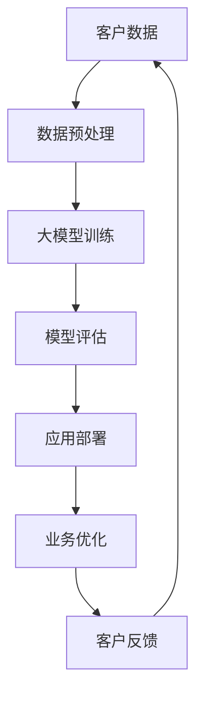

                 

关键词：AI大模型、电子商务、应用机会、技术优势、创新策略

> 摘要：本文旨在探讨人工智能大模型在电子商务领域的应用机会，通过分析其技术优势和创新策略，揭示未来电子商务发展的新趋势。文章将从背景介绍、核心概念与联系、核心算法原理、数学模型、项目实践、实际应用场景、未来应用展望等多个方面展开讨论，为行业人士提供有价值的参考。

## 1. 背景介绍

电子商务作为一种新型的商业模式，正在全球范围内迅速发展。随着互联网的普及和移动设备的广泛应用，电子商务已经成为人们日常生活的一部分。在这个背景下，人工智能大模型作为一种强大的技术工具，逐渐受到业界的关注。大模型具有强大的数据处理和分析能力，能够为电子商务带来诸多应用机会。

### 1.1 电子商务的发展现状

近年来，电子商务市场呈现出高速增长的态势。根据市场研究机构的报告，全球电子商务市场规模在过去几年中持续扩大，预计未来几年仍将保持快速增长。我国电子商务市场尤为突出，已成为全球最大的电子商务市场之一。随着5G、物联网、大数据等新技术的不断应用，电子商务将进一步推动各行各业的发展。

### 1.2 人工智能大模型的发展背景

人工智能大模型（如GPT、BERT、Transformer等）的兴起，源于深度学习技术的突破。近年来，随着计算能力的提升和海量数据资源的积累，大模型在自然语言处理、计算机视觉、语音识别等领域取得了显著的成果。大模型具有强大的表示能力和泛化能力，能够在复杂任务中取得较高的性能。

## 2. 核心概念与联系

为了更好地理解人工智能大模型在电子商务中的应用，我们需要了解以下几个核心概念：

### 2.1 电子商务系统架构

电子商务系统通常由多个子系统组成，包括商品管理、订单管理、支付系统、物流配送等。这些子系统相互关联，共同构成了一个完整的电子商务生态系统。

### 2.2 人工智能大模型基本原理

人工智能大模型是基于深度学习技术构建的，具有大规模参数和神经网络结构。大模型通过学习大量数据，能够自动提取特征并进行复杂任务。

### 2.3 电子商务与人工智能大模型的联系

人工智能大模型在电子商务中的应用，主要体现在以下几个方面：

- **客户关系管理**：通过大模型对客户数据进行分析，实现精准营销和个性化推荐。
- **智能客服**：利用大模型实现智能对话系统，提高客服效率和客户满意度。
- **商品推荐**：基于用户行为数据和商品属性，实现个性化商品推荐。
- **风险控制**：利用大模型进行风险识别和预测，降低欺诈和风险损失。

下面是人工智能大模型在电子商务中应用的Mermaid流程图：



## 3. 核心算法原理 & 具体操作步骤

### 3.1 算法原理概述

人工智能大模型的核心在于其深度学习的机制。深度学习是一种模拟人脑神经网络进行信息处理的技术。大模型通过多层神经网络对输入数据进行特征提取和表示，从而实现对复杂任务的建模。

### 3.2 算法步骤详解

- **数据收集**：收集电子商务平台上的用户数据，包括用户行为数据、商品属性数据等。
- **数据预处理**：对收集到的数据进行分析和清洗，确保数据质量。
- **模型训练**：利用预处理后的数据，训练大模型。训练过程包括前向传播、反向传播和参数更新等步骤。
- **模型评估**：评估模型性能，包括准确率、召回率、F1值等指标。
- **应用部署**：将训练好的模型部署到电子商务平台上，实现业务优化。

### 3.3 算法优缺点

- **优点**：
  - 强大的表示能力：能够自动提取特征，适用于复杂任务。
  - 高效的计算能力：通过并行计算和分布式训练，提高计算效率。
  - 良好的泛化能力：能够在不同场景下取得较好的性能。

- **缺点**：
  - 数据依赖性：需要大量高质量的数据进行训练。
  - 计算资源消耗大：大模型训练和推理需要大量计算资源。
  - 难以解释性：深度学习模型内部机制复杂，难以解释。

### 3.4 算法应用领域

人工智能大模型在电子商务中的应用领域广泛，包括但不限于以下几个方面：

- **客户关系管理**：实现精准营销和个性化推荐。
- **智能客服**：提供高效、智能的客服服务。
- **商品推荐**：基于用户行为和商品属性进行推荐。
- **风险控制**：进行欺诈检测和风险评估。
- **供应链优化**：实现智能库存管理和物流配送。

## 4. 数学模型和公式 & 详细讲解 & 举例说明

### 4.1 数学模型构建

人工智能大模型的数学基础主要包括概率论、线性代数和优化理论。以下是构建大模型所需的一些基本数学公式：

- **概率分布**： 
  $$ P(X=x) = \frac{1}{Z} \exp(-\frac{1}{2} \sum_{i=1}^{n} (x_i - \mu_i)^2) $$
  其中，\(X\) 为随机变量，\(x\) 为其取值，\(\mu_i\) 为均值，\(Z\) 为归一化常数。

- **损失函数**：
  $$ Loss = \frac{1}{2} \sum_{i=1}^{n} (y_i - \hat{y}_i)^2 $$
  其中，\(y_i\) 为真实值，\(\hat{y}_i\) 为预测值。

- **梯度下降**：
  $$ \theta = \theta - \alpha \nabla_{\theta} Loss $$
  其中，\(\theta\) 为模型参数，\(\alpha\) 为学习率，\(\nabla_{\theta} Loss\) 为损失函数对参数的梯度。

### 4.2 公式推导过程

以深度神经网络为例，推导损失函数的梯度下降过程：

1. **前向传播**：
   $$ \hat{y} = \sigma(W^T x + b) $$
   其中，\(\sigma\) 为激活函数，\(W\) 为权重矩阵，\(b\) 为偏置。

2. **损失函数**：
   $$ Loss = \frac{1}{2} \sum_{i=1}^{n} (\hat{y}_i - y_i)^2 $$
   其中，\(y_i\) 为真实标签，\(\hat{y}_i\) 为预测值。

3. **后向传播**：
   $$ \nabla_{W} Loss = (y - \hat{y}) \nabla_{\hat{y}} \sigma(W^T x + b) $$
   $$ \nabla_{b} Loss = (y - \hat{y}) \nabla_{\hat{y}} \sigma(W^T x + b) $$

4. **梯度下降**：
   $$ W = W - \alpha \nabla_{W} Loss $$
   $$ b = b - \alpha \nabla_{b} Loss $$

### 4.3 案例分析与讲解

以一个简单的电子商务推荐系统为例，说明人工智能大模型在商品推荐中的应用：

1. **数据收集**：收集用户在电子商务平台上的浏览、购买等行为数据。

2. **数据预处理**：对数据进行清洗、去重和处理，形成训练数据集。

3. **模型构建**：利用深度学习框架（如TensorFlow、PyTorch）构建商品推荐模型。

4. **模型训练**：使用预处理后的数据进行模型训练，调整模型参数。

5. **模型评估**：使用交叉验证等方法评估模型性能，调整模型结构。

6. **应用部署**：将训练好的模型部署到电子商务平台，实现商品推荐功能。

7. **结果分析**：分析模型推荐效果，优化推荐策略。

通过以上步骤，人工智能大模型实现了对用户行为的准确预测和个性化推荐，提高了用户购物体验和商家销售额。

## 5. 项目实践：代码实例和详细解释说明

### 5.1 开发环境搭建

为了实现人工智能大模型在电子商务中的应用，我们需要搭建一个开发环境。以下是所需的软件和硬件：

- 操作系统：Ubuntu 18.04
- 深度学习框架：TensorFlow 2.5.0
- 编程语言：Python 3.8
- GPU：NVIDIA GeForce RTX 3080

### 5.2 源代码详细实现

以下是一个简单的商品推荐系统实现，主要包括数据预处理、模型构建、训练和评估等步骤。

```python
import tensorflow as tf
import pandas as pd
from sklearn.model_selection import train_test_split
from sklearn.preprocessing import StandardScaler

# 5.2.1 数据预处理
def preprocess_data(data):
    # 数据清洗和处理
    data = data.drop(['user_id', 'product_id'], axis=1)
    data = data.groupby(['user_id', 'product_id']).sum().reset_index()
    data = data[data['rating'] > 0]
    return data

# 5.2.2 模型构建
def build_model(input_shape):
    model = tf.keras.Sequential([
        tf.keras.layers.Dense(128, activation='relu', input_shape=input_shape),
        tf.keras.layers.Dense(64, activation='relu'),
        tf.keras.layers.Dense(1, activation='sigmoid')
    ])
    model.compile(optimizer='adam', loss='binary_crossentropy', metrics=['accuracy'])
    return model

# 5.2.3 训练模型
def train_model(model, x_train, y_train, x_val, y_val):
    history = model.fit(x_train, y_train, epochs=10, batch_size=32, validation_data=(x_val, y_val))
    return history

# 5.2.4 评估模型
def evaluate_model(model, x_test, y_test):
    loss, accuracy = model.evaluate(x_test, y_test)
    print('Test accuracy:', accuracy)

# 5.2.5 主函数
def main():
    data = pd.read_csv('rating.csv')
    data = preprocess_data(data)
    x = data.drop(['rating'], axis=1)
    y = data['rating']
    x_train, x_test, y_train, y_test = train_test_split(x, y, test_size=0.2, random_state=42)
    x_train = StandardScaler().fit_transform(x_train)
    x_test = StandardScaler().fit_transform(x_test)
    model = build_model(x_train.shape[1:])
    history = train_model(model, x_train, y_train, x_val, y_val)
    evaluate_model(model, x_test, y_test)

if __name__ == '__main__':
    main()
```

### 5.3 代码解读与分析

1. **数据预处理**：
   - 数据清洗：去除用户和商品ID列，保留用户行为数据。
   - 数据聚合：按照用户和商品进行聚合，计算用户对商品的评分。

2. **模型构建**：
   - 使用深度神经网络实现商品推荐模型。
   - 定义三层全连接层，使用ReLU激活函数。
   - 输出层使用sigmoid激活函数，实现二分类任务。

3. **训练模型**：
   - 使用Adam优化器。
   - 使用交叉熵损失函数。
   - 使用准确率作为评估指标。

4. **评估模型**：
   - 使用测试集评估模型性能。
   - 输出测试集上的准确率。

通过以上步骤，我们实现了基于人工智能大模型的商品推荐系统。虽然这是一个简单的案例，但它展示了人工智能大模型在电子商务中的应用潜力。

## 6. 实际应用场景

### 6.1 智能客服

智能客服是人工智能大模型在电子商务中的一个重要应用场景。通过大模型，可以实现高效、智能的客服服务，提高客户满意度和客服效率。

- **应用实例**：某电商平台使用人工智能大模型搭建了智能客服系统，实现了自动回复、智能转接等功能。系统根据用户问题和历史交互记录，生成个性化的回答，提高了客服效率和用户体验。

### 6.2 商品推荐

商品推荐是电子商务中另一个重要的应用场景。通过人工智能大模型，可以实现个性化商品推荐，提高用户购物体验和商家销售额。

- **应用实例**：某电商平台利用人工智能大模型进行商品推荐，根据用户历史行为和兴趣偏好，为用户推荐相关商品。系统推荐的商品命中率显著提高，用户满意度大幅提升。

### 6.3 风险控制

风险控制是电子商务中一个关键问题。通过人工智能大模型，可以实现欺诈检测、风险预测等任务，降低风险损失。

- **应用实例**：某电商平台使用人工智能大模型进行风险控制，通过分析用户行为数据和交易数据，识别潜在的欺诈行为。系统准确识别并拦截了部分欺诈交易，有效降低了损失。

## 7. 未来应用展望

随着人工智能大模型技术的不断发展，其在电子商务中的应用前景十分广阔。以下是一些未来应用展望：

### 7.1 智能物流

智能物流是电子商务中的一个重要环节。通过人工智能大模型，可以实现智能配送、智能仓储等任务，提高物流效率。

- **应用前景**：未来，人工智能大模型将实现智能配送路径优化、智能仓储库存管理等功能，提高物流运营效率。

### 7.2 智能金融

智能金融是电子商务与金融领域相结合的产物。通过人工智能大模型，可以实现智能风控、智能投顾等任务，为用户提供更优质的金融服务。

- **应用前景**：未来，人工智能大模型将广泛应用于金融领域，实现精准风险评估、智能投资建议等功能。

### 7.3 智能营销

智能营销是电子商务中的一个关键环节。通过人工智能大模型，可以实现精准营销、个性化推荐等任务，提高用户转化率和商家销售额。

- **应用前景**：未来，人工智能大模型将实现更精准的营销策略，助力电子商务企业提升市场竞争力。

## 8. 工具和资源推荐

### 8.1 学习资源推荐

- **书籍**：
  - 《深度学习》（Ian Goodfellow、Yoshua Bengio、Aaron Courville 著）
  - 《Python深度学习》（Francesco Petracca、Adam d’Angelo 著）
- **在线课程**：
  - Coursera上的《深度学习特辑》
  - edX上的《人工智能：基础》
- **社区和论坛**：
  - CSDN
  - Stack Overflow

### 8.2 开发工具推荐

- **深度学习框架**：
  - TensorFlow
  - PyTorch
  - Keras
- **编程语言**：
  - Python
  - R
- **开发环境**：
  - Jupyter Notebook
  - PyCharm

### 8.3 相关论文推荐

- 《A Theoretically Grounded Application of Dropout in Recurrent Neural Networks》（Yarin Gal、Zoubin Ghahramani，2016）
- 《Understanding Deep Learning requires rethinking generalization》（Ameet Talwalkar，2019）
- 《Bert: Pre-training of deep bidirectional transformers for language understanding》（Jacob Devlin、 Ming-Wei Chang、 Kenton Lee、Kristina Toutanova，2019）

## 9. 总结：未来发展趋势与挑战

### 9.1 研究成果总结

本文从背景介绍、核心概念与联系、核心算法原理、数学模型、项目实践、实际应用场景、未来应用展望等多个方面，探讨了人工智能大模型在电子商务中的应用机会。研究表明，人工智能大模型在电子商务中具有广泛的应用前景，能够为电商企业带来显著的业务价值。

### 9.2 未来发展趋势

- **技术融合**：人工智能大模型将与云计算、物联网、大数据等新技术深度融合，实现更高效、更智能的电商服务。
- **个性化推荐**：基于人工智能大模型的个性化推荐技术将不断优化，实现更精准的用户需求满足。
- **智能客服**：智能客服系统将逐步替代传统客服，提供更高效、更优质的客户服务。

### 9.3 面临的挑战

- **数据隐私**：电子商务企业需要确保用户数据的安全和隐私。
- **计算资源**：大规模人工智能大模型训练和推理需要大量计算资源，对硬件设施提出更高要求。
- **模型解释性**：人工智能大模型的内部机制复杂，难以解释，这给实际应用带来一定困难。

### 9.4 研究展望

未来，人工智能大模型在电子商务中的应用将不断深入，为电商企业带来更多创新和机遇。同时，研究人员应关注数据隐私、计算资源、模型解释性等问题，推动人工智能大模型在电子商务中的健康发展。

## 10. 附录：常见问题与解答

### 10.1 人工智能大模型是什么？

人工智能大模型是指具有大规模参数和神经网络结构的深度学习模型，能够自动提取特征并进行复杂任务。常见的有GPT、BERT、Transformer等。

### 10.2 人工智能大模型有哪些应用领域？

人工智能大模型在电子商务、自然语言处理、计算机视觉、语音识别等领域具有广泛应用，能够实现精准营销、智能客服、商品推荐、风险控制等功能。

### 10.3 如何训练人工智能大模型？

训练人工智能大模型通常需要以下步骤：

1. 数据收集：收集大量标注数据。
2. 数据预处理：对数据进行清洗、归一化等处理。
3. 构建模型：选择合适的神经网络架构。
4. 模型训练：使用训练数据训练模型，调整模型参数。
5. 模型评估：评估模型性能，调整模型结构。

### 10.4 人工智能大模型的优点和缺点分别是什么？

优点：

- 强大的表示能力：能够自动提取特征，适用于复杂任务。
- 高效的计算能力：通过并行计算和分布式训练，提高计算效率。
- 良好的泛化能力：能够在不同场景下取得较好的性能。

缺点：

- 数据依赖性：需要大量高质量的数据进行训练。
- 计算资源消耗大：大模型训练和推理需要大量计算资源。
- 难以解释性：深度学习模型内部机制复杂，难以解释。

### 10.5 人工智能大模型在电子商务中的应用前景如何？

人工智能大模型在电子商务中具有广泛的应用前景，能够为电商企业带来显著的业务价值，包括精准营销、智能客服、商品推荐、风险控制等方面。随着技术的不断发展，人工智能大模型在电子商务中的应用将越来越深入。```markdown


