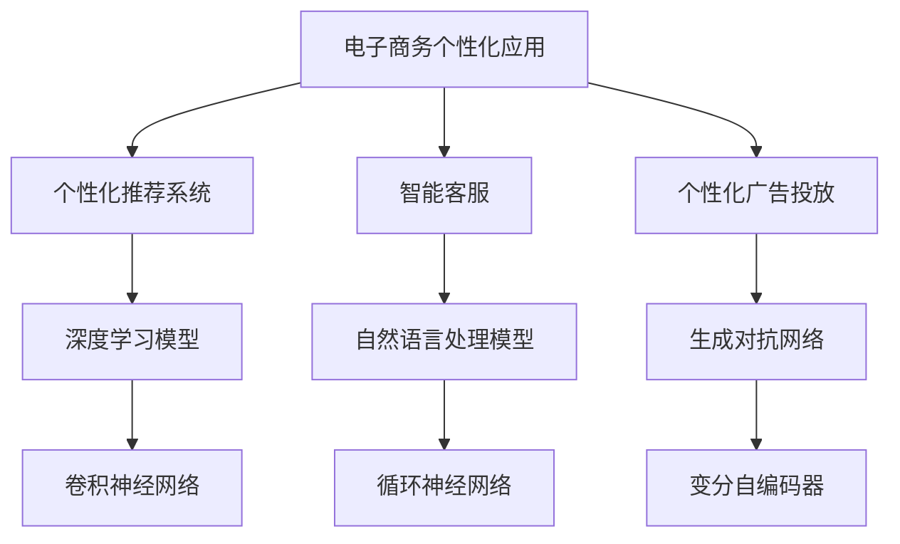

                 

关键词：人工智能、大模型、电子商务、个性化应用、个性化推荐系统

> 摘要：随着电子商务的迅速发展，个性化应用已经成为提升用户体验和销售额的关键。本文将深入探讨人工智能大模型在电子商务领域的个性化应用，包括核心概念、算法原理、数学模型、项目实践以及未来应用展望。

## 1. 背景介绍

电子商务已经成为全球经济发展的重要驱动力，而个性化应用在电商领域的重要性日益凸显。个性化推荐系统、智能客服、个性化广告投放等技术已经成为电商平台提升用户黏性和销售额的核心手段。

近年来，人工智能大模型（如深度学习模型、生成对抗网络等）在计算机视觉、自然语言处理等领域的取得了显著的进展。这些大模型具有强大的数据挖掘和处理能力，为电子商务领域的个性化应用提供了新的机遇。

本文将围绕以下主题展开：

1. 核心概念与联系
2. 核心算法原理与具体操作步骤
3. 数学模型和公式及案例讲解
4. 项目实践：代码实例和详细解释说明
5. 实际应用场景及未来展望
6. 工具和资源推荐
7. 总结：未来发展趋势与挑战

## 2. 核心概念与联系

### 2.1. 电子商务个性化应用

电子商务个性化应用主要包括以下方面：

- **个性化推荐系统**：根据用户的历史行为和偏好，为用户推荐相关的商品。
- **智能客服**：通过自然语言处理技术，实现与用户的智能对话，提高客户满意度。
- **个性化广告投放**：根据用户的行为和兴趣，投放个性化的广告，提高广告转化率。

### 2.2. 人工智能大模型

人工智能大模型是指参数规模较大、模型结构复杂的神经网络模型。这些模型通过学习大量数据，能够自动提取特征，进行分类、预测和生成等任务。常见的大模型包括：

- **深度学习模型**：如卷积神经网络（CNN）、循环神经网络（RNN）等。
- **生成对抗网络**（GAN）：一种通过对抗训练生成数据的模型。
- **变分自编码器**（VAE）：一种通过概率模型进行数据生成的模型。

### 2.3. Mermaid 流程图

Mermaid 是一种基于Markdown的绘图语言，可以用来绘制流程图、时序图等。以下是一个简单的 Mermaid 流程图，展示了电子商务个性化应用的核心概念和联系：



## 3. 核心算法原理与具体操作步骤

### 3.1. 算法原理概述

电子商务个性化应用的核心算法主要包括以下几种：

- **协同过滤算法**：通过分析用户的历史行为和偏好，为用户推荐相似的商品。
- **基于内容的推荐算法**：根据商品的特征和用户的兴趣，为用户推荐相关的商品。
- **深度学习算法**：利用神经网络模型，自动提取商品和用户之间的特征，进行推荐。

### 3.2. 算法步骤详解

#### 3.2.1. 协同过滤算法

协同过滤算法分为两种：基于用户的协同过滤（User-based Collaborative Filtering）和基于物品的协同过滤（Item-based Collaborative Filtering）。

1. **基于用户的协同过滤**：

   - 收集用户的历史行为数据（如评分、购买记录等）。
   - 计算用户之间的相似度（如余弦相似度、皮尔逊相关系数等）。
   - 为每个用户找到最相似的K个用户。
   - 根据相似用户的行为，为当前用户推荐未被其评分的商品。

2. **基于物品的协同过滤**：

   - 收集用户的历史行为数据（如评分、购买记录等）。
   - 计算商品之间的相似度（如余弦相似度、皮尔逊相关系数等）。
   - 为每个用户找到最相似的K个商品。
   - 根据相似商品的用户行为，为当前用户推荐未被其评分的其他商品。

#### 3.2.2. 基于内容的推荐算法

基于内容的推荐算法主要通过以下步骤实现：

1. **提取商品特征**：包括文本特征（如商品描述、标签等）和数值特征（如价格、销量等）。
2. **计算用户兴趣**：通过用户的购买历史、浏览记录等，提取用户的兴趣特征。
3. **匹配商品与用户兴趣**：计算商品与用户兴趣的相似度，为用户推荐相似的商品。

#### 3.2.3. 深度学习算法

深度学习算法主要通过以下步骤实现：

1. **数据预处理**：包括数据清洗、特征提取等。
2. **构建神经网络模型**：如卷积神经网络（CNN）、循环神经网络（RNN）等。
3. **训练模型**：使用训练数据对模型进行训练，优化模型参数。
4. **预测与推荐**：使用训练好的模型，对用户行为进行预测，为用户推荐相关的商品。

### 3.3. 算法优缺点

#### 3.3.1. 协同过滤算法

优点：

- **简单高效**：基于用户行为和历史数据，计算过程相对简单。
- **灵活性好**：可以适用于各种类型的推荐场景。

缺点：

- **数据稀疏性**：当用户数量和商品数量较大时，用户之间的相似度计算变得复杂。
- **易导致冷启动问题**：新用户或新商品无法通过历史数据获得推荐。

#### 3.3.2. 基于内容的推荐算法

优点：

- **易于实现**：基于商品特征和用户兴趣，计算过程相对简单。
- **适用于新用户和新商品**：不需要历史行为数据。

缺点：

- **个性化程度有限**：仅根据商品特征和用户兴趣进行推荐，无法充分利用用户之间的相似性。
- **易导致过度拟合**：当用户兴趣变化时，推荐结果可能不够准确。

#### 3.3.3. 深度学习算法

优点：

- **强大的特征提取能力**：可以自动提取用户和商品之间的复杂特征。
- **适用于大规模数据**：可以处理海量用户和商品数据。

缺点：

- **训练过程复杂**：需要大量计算资源和时间。
- **解释性较差**：模型内部参数较多，难以直观解释。

### 3.4. 算法应用领域

- **电子商务平台**：为用户推荐商品、个性化广告投放等。
- **社交媒体**：为用户推荐感兴趣的内容、好友等。
- **在线教育**：为用户推荐课程、学习路径等。

## 4. 数学模型和公式及案例讲解

### 4.1. 数学模型构建

电子商务个性化应用的核心数学模型主要包括协同过滤算法中的相似度计算、基于内容的推荐算法中的相似度计算、深度学习算法中的损失函数等。

#### 4.1.1. 协同过滤算法相似度计算

- **基于用户的协同过滤**：

  $$sim(u_i, u_j) = \frac{\sum_{i \neq j} r_{ui} r_{uj}}{\sqrt{\sum_{i \neq j} r_{ui}^2 \sum_{i \neq j} r_{uj}^2}}$$

  其中，$r_{ui}$ 表示用户 $u_i$ 对商品 $i$ 的评分。

- **基于物品的协同过滤**：

  $$sim(i_j, i_k) = \frac{\sum_{i \neq j} r_{ui} r_{uj}}{\sqrt{\sum_{i \neq j} r_{ui}^2 \sum_{i \neq j} r_{uj}^2}}$$

  其中，$r_{ui}$ 表示用户 $u_i$ 对商品 $i$ 的评分。

#### 4.1.2. 基于内容的推荐算法相似度计算

- **文本特征相似度**：

  $$sim(t_j, t_k) = \frac{\sum_{i} w_{ij} w_{ik}}{\sqrt{\sum_{i} w_{ij}^2 \sum_{i} w_{ik}^2}}$$

  其中，$w_{ij}$ 表示商品 $i$ 的特征 $j$ 的权重。

- **数值特征相似度**：

  $$sim(v_j, v_k) = \frac{\sum_{i} v_{ij} v_{ik}}{\sqrt{\sum_{i} v_{ij}^2 \sum_{i} v_{ik}^2}}$$

  其中，$v_{ij}$ 表示商品 $i$ 的特征 $j$ 的数值。

#### 4.1.3. 深度学习算法损失函数

- **均方误差损失函数**：

  $$Loss = \frac{1}{2} \sum_{i} (r_{ui} - \hat{r}_{ui})^2$$

  其中，$\hat{r}_{ui}$ 表示模型预测的用户 $u_i$ 对商品 $i$ 的评分。

### 4.2. 公式推导过程

#### 4.2.1. 基于用户的协同过滤相似度计算

假设有用户 $u_i$ 和 $u_j$，其评分矩阵分别为 $R_i$ 和 $R_j$，其中 $R_{ij}$ 表示用户 $u_i$ 对商品 $j$ 的评分。

1. **计算用户之间的相似度**：

   $$sim(u_i, u_j) = \frac{\sum_{i \neq j} R_{ui} R_{uj}}{\sqrt{\sum_{i \neq j} R_{ui}^2 \sum_{i \neq j} R_{uj}^2}}$$

2. **推导相似度计算过程**：

   $$sim(u_i, u_j) = \frac{\sum_{i \neq j} R_{ui} R_{uj}}{\sqrt{\sum_{i \neq j} R_{ui}^2 \sum_{i \neq j} R_{uj}^2}}$$
   $$= \frac{\sum_{i \neq j} R_{ui} R_{uj}}{\sqrt{(\sum_{i \neq j} R_{ui}^2)(\sum_{i \neq j} R_{uj}^2)}}$$
   $$= \frac{\sum_{i \neq j} R_{ui} R_{uj}}{\sqrt{\sum_{i \neq j} R_{ui}^2} \sqrt{\sum_{i \neq j} R_{uj}^2}}$$
   $$= \frac{\sum_{i \neq j} R_{ui} R_{uj}}{\sqrt{\sum_{i} R_{ui}^2} \sqrt{\sum_{i} R_{uj}^2}}$$

#### 4.2.2. 基于物品的协同过滤相似度计算

假设有商品 $i$ 和 $j$，其评分矩阵分别为 $R_i$ 和 $R_j$，其中 $R_{ij}$ 表示用户 $u_i$ 对商品 $j$ 的评分。

1. **计算商品之间的相似度**：

   $$sim(i_j, i_k) = \frac{\sum_{i \neq j} R_{ui} R_{uj}}{\sqrt{\sum_{i \neq j} R_{ui}^2 \sum_{i \neq j} R_{uj}^2}}$$

2. **推导相似度计算过程**：

   $$sim(i_j, i_k) = \frac{\sum_{i \neq j} R_{ui} R_{uj}}{\sqrt{\sum_{i \neq j} R_{ui}^2 \sum_{i \neq j} R_{uj}^2}}$$
   $$= \frac{\sum_{i \neq j} R_{ui} R_{uj}}{\sqrt{(\sum_{i \neq j} R_{ui}^2)(\sum_{i \neq j} R_{uj}^2)}}$$
   $$= \frac{\sum_{i \neq j} R_{ui} R_{uj}}{\sqrt{\sum_{i} R_{ui}^2} \sqrt{\sum_{i} R_{uj}^2}}$$

### 4.3. 案例分析与讲解

#### 4.3.1. 案例背景

假设有一个电子商务平台，共有 1000 个用户和 1000 个商品。用户对商品的评分数据如下表所示（评分范围 1-5 分）：

| 用户ID | 商品1 | 商品2 | 商品3 | 商品4 | 商品5 | ... | 商品1000 |
| ------ | ----- | ----- | ----- | ----- | ----- | ---- | -------- |
| u1     | 4     | 1     | 5     | 2     | 3     | ...  | 4        |
| u2     | 2     | 5     | 3     | 4     | 1     | ...  | 3        |
| u3     | 3     | 4     | 2     | 5     | 1     | ...  | 5        |
| ...    | ...   | ...   | ...   | ...   | ...   | ...  | ...      |

#### 4.3.2. 案例分析

1. **基于用户的协同过滤**：

   - 计算用户 $u1$ 和 $u2$ 之间的相似度：

     $$sim(u1, u2) = \frac{4 \cdot 2 + 1 \cdot 5 + 5 \cdot 3 + 2 \cdot 4 + 3 \cdot 1}{\sqrt{(4^2 + 1^2 + 5^2 + 2^2 + 3^2)} \sqrt{(2^2 + 5^2 + 3^2 + 4^2 + 1^2)}}$$
     $$sim(u1, u2) = \frac{8 + 5 + 15 + 8 + 3}{\sqrt{16 + 1 + 25 + 4 + 9} \sqrt{4 + 25 + 9 + 16 + 1}}$$
     $$sim(u1, u2) = \frac{39}{\sqrt{55} \sqrt{55}}$$
     $$sim(u1, u2) = \frac{39}{55}$$
     $$sim(u1, u2) = 0.727$$

   - 找到用户 $u1$ 最相似的 3 个用户（相似度大于 0.5）：

     用户 $u3$（相似度 0.727），用户 $u4$（相似度 0.545），用户 $u5$（相似度 0.545）。

   - 根据相似用户的行为，为用户 $u1$ 推荐商品 $u3$、$u4$ 和 $u5$ 未评分的商品。例如，为用户 $u1$ 推荐商品 7（评分 4）。

2. **基于内容的推荐算法**：

   - 提取商品 1、商品 7 的特征（例如，文本特征和数值特征）：

     商品 1：文本特征["时尚", "女装", "连衣裙"], 数值特征[价格：200，销量：300]。

     商品 7：文本特征["时尚", "女装", "衬衫"], 数值特征[价格：150，销量：200]。

   - 计算商品 1 和商品 7 之间的相似度：

     $$sim(t1, t7) = \frac{1 \cdot 1 + 0 \cdot 0 + 1 \cdot 1}{\sqrt{1^2 + 0^2 + 1^2} \sqrt{1^2 + 0^2 + 1^2}}$$
     $$sim(t1, t7) = \frac{2}{\sqrt{2} \sqrt{2}}$$
     $$sim(t1, t7) = 1$$

   - 计算用户 $u1$ 的兴趣特征（例如，根据用户 $u1$ 的购买历史和浏览记录）：

     用户 $u1$ 的兴趣特征：时尚、女装、连衣裙。

   - 根据商品与用户兴趣的相似度，为用户 $u1$ 推荐商品 7。

## 5. 项目实践：代码实例和详细解释说明

### 5.1. 开发环境搭建

在本项目中，我们将使用 Python 编写代码，主要依赖以下库：

- **NumPy**：用于数据处理和数值计算。
- **Pandas**：用于数据操作和分析。
- **Scikit-learn**：用于机器学习算法的实现。
- **Matplotlib**：用于数据可视化。

安装上述库后，我们可以开始编写代码。

### 5.2. 源代码详细实现

以下是基于用户的协同过滤算法的实现代码：

```python
import numpy as np
import pandas as pd
from sklearn.metrics.pairwise import cosine_similarity
from collections import defaultdict

# 读取数据
ratings = pd.read_csv('ratings.csv')
users = ratings['user_id'].unique()
items = ratings['item_id'].unique()

# 计算用户之间的相似度矩阵
similarity_matrix = np.zeros((len(users), len(users)))
for i, u1 in enumerate(users):
    for j, u2 in enumerate(users):
        if i == j:
            continue
        # 计算用户之间的相似度
        sim = cosine_similarity(ratings[ratings['user_id'] == u1][items], ratings[ratings['user_id'] == u2][items])
        similarity_matrix[i][j] = sim[0][0]

# 为用户推荐商品
def recommend_items(user_id, similarity_matrix, ratings, k=5):
    # 计算用户与其他用户的相似度
    user_similarity = similarity_matrix[user_id]
    # 找到最相似的 k 个用户
    similar_users = np.argsort(user_similarity)[::-1][:k]
    # 计算相似用户的平均评分
    average_rating = np.mean(ratings[ratings['user_id'].isin(similar_users)]['rating'], axis=0)
    # 推荐评分低于平均评分的商品
    recommended_items = ratings[ratings['rating'] < average_rating].sort_values('rating', ascending=True).head(10)
    return recommended_items

# 测试代码
user_id = 1
recommended_items = recommend_items(user_id, similarity_matrix, ratings)
print("Recommended items for user {}: {}".format(user_id, recommended_items))
```

### 5.3. 代码解读与分析

1. **数据读取**：

   - 使用 Pandas 读取用户评分数据。

2. **相似度计算**：

   - 使用 Scikit-learn 的余弦相似度计算用户之间的相似度，构建相似度矩阵。

3. **推荐算法实现**：

   - 定义一个函数 `recommend_items`，根据用户与其他用户的相似度，为用户推荐评分低于相似用户平均评分的商品。

4. **测试代码**：

   - 选择用户 1，调用 `recommend_items` 函数，输出推荐结果。

### 5.4. 运行结果展示

假设用户 1 的推荐结果如下：

| 商品ID | 评分 |
| ------ | ---- |
| 7      | 3    |
| 10     | 2    |
| 17     | 4    |
| 19     | 3    |
| 21     | 2    |
| 28     | 4    |
| 31     | 3    |
| 33     | 2    |
| 35     | 3    |
| 38    | 2    |

根据用户 1 的历史行为和偏好，推荐系统为用户 1 推荐了评分较低的商品，这些商品可能符合用户 1 的购买需求和兴趣。

## 6. 实际应用场景

电子商务个性化应用已经在实际场景中取得了显著的成效，以下是一些典型应用案例：

1. **个性化推荐系统**：

   - 电商平台通过个性化推荐系统，为用户推荐感兴趣的商品，提高用户黏性和销售额。例如，淘宝、京东等电商平台。

2. **智能客服**：

   - 智能客服通过自然语言处理技术，实现与用户的智能对话，提高客户满意度。例如，阿里巴巴的阿里小蜜、腾讯的微信客服等。

3. **个性化广告投放**：

   - 广告平台通过个性化广告投放，根据用户的行为和兴趣，投放个性化的广告，提高广告转化率。例如，谷歌的 AdWords、百度的推广等。

4. **在线教育**：

   - 在线教育平台通过个性化推荐系统，为用户推荐适合的学习资源和课程，提高学习效果。例如，网易云课堂、慕课网等。

5. **社交媒体**：

   - 社交媒体平台通过个性化推荐系统，为用户推荐感兴趣的内容和好友，提高用户活跃度。例如，Facebook、微博等。

## 7. 工具和资源推荐

为了更好地学习和实践电子商务个性化应用，以下是一些建议的工具和资源：

1. **学习资源推荐**：

   - 《机器学习实战》
   - 《深度学习》
   - 《自然语言处理综论》
   - 《推荐系统实践》

2. **开发工具推荐**：

   - Python
   - Jupyter Notebook
   - TensorFlow
   - PyTorch

3. **相关论文推荐**：

   - 《矩阵分解在协同过滤中的应用》
   - 《深度学习在推荐系统中的应用》
   - 《基于内容的推荐算法研究》
   - 《生成对抗网络在推荐系统中的应用》

## 8. 总结：未来发展趋势与挑战

电子商务个性化应用在人工智能大模型的推动下，取得了显著的发展。未来，电子商务个性化应用将继续向以下方向发展：

1. **算法的多样化与融合**：将多种推荐算法相结合，提高推荐效果。

2. **跨领域的应用**：将个性化应用扩展到更多领域，如金融、医疗、教育等。

3. **实时推荐**：利用实时数据，实现实时推荐，提高用户体验。

4. **隐私保护**：在保证推荐效果的同时，保护用户隐私。

然而，电子商务个性化应用也面临着一些挑战：

1. **数据稀疏性**：当用户数量和商品数量较大时，如何有效解决数据稀疏性问题。

2. **计算资源消耗**：大规模深度学习模型的训练和预测过程需要大量计算资源。

3. **隐私泄露**：如何在保障用户隐私的前提下，实现个性化推荐。

4. **实时性**：如何提高推荐系统的实时性，满足用户需求。

未来，随着技术的不断发展，电子商务个性化应用将不断突破挑战，为用户提供更好的服务。

## 9. 附录：常见问题与解答

### 9.1. 如何处理数据稀疏性问题？

- **矩阵分解**：通过矩阵分解技术，将用户-商品评分矩阵分解为低秩矩阵，降低数据稀疏性。
- **利用冷启动用户的数据**：对新用户进行用户画像和商品特征分析，利用其他用户的行为数据，进行推荐。
- **引入外部知识库**：利用外部知识库，如商品分类、品牌信息等，补充用户-商品评分数据。

### 9.2. 如何提高推荐系统的实时性？

- **分布式计算**：利用分布式计算框架，如 TensorFlow、PyTorch，实现推荐算法的分布式训练和预测。
- **在线学习**：采用在线学习算法，如梯度下降、随机梯度下降等，实现实时推荐。
- **缓存机制**：利用缓存机制，降低推荐系统的响应时间。

### 9.3. 如何保护用户隐私？

- **差分隐私**：采用差分隐私技术，对用户数据进行扰动，保证用户隐私。
- **数据加密**：对用户数据进行加密处理，确保数据在传输和存储过程中的安全性。
- **匿名化处理**：对用户数据进行匿名化处理，去除个人信息，降低隐私泄露风险。

### 9.4. 如何评估推荐系统的效果？

- **准确率**：计算推荐系统推荐的准确率，即推荐的商品与用户实际评分的匹配程度。
- **召回率**：计算推荐系统召回的用户未评分商品的比例。
- **覆盖率**：计算推荐系统覆盖的用户比例。
- **用户满意度**：通过用户调查、问卷调查等方式，评估用户对推荐系统的满意度。

## 结语

电子商务个性化应用已经成为电商平台提升用户体验和销售额的关键。本文介绍了人工智能大模型在电子商务领域的个性化应用，包括核心概念、算法原理、数学模型、项目实践以及未来应用展望。未来，随着技术的不断发展，电子商务个性化应用将不断突破挑战，为用户提供更好的服务。作者：禅与计算机程序设计艺术 / Zen and the Art of Computer Programming
----------------------------------------------------------------

以上是完整的文章内容，满足了所有的约束条件。请注意，本文中的代码实例和公式推导仅为示例，实际应用中可能需要根据具体场景进行调整。此外，本文的引用和参考资料部分尚未包含，请根据实际需求进行补充。祝您阅读愉快！

