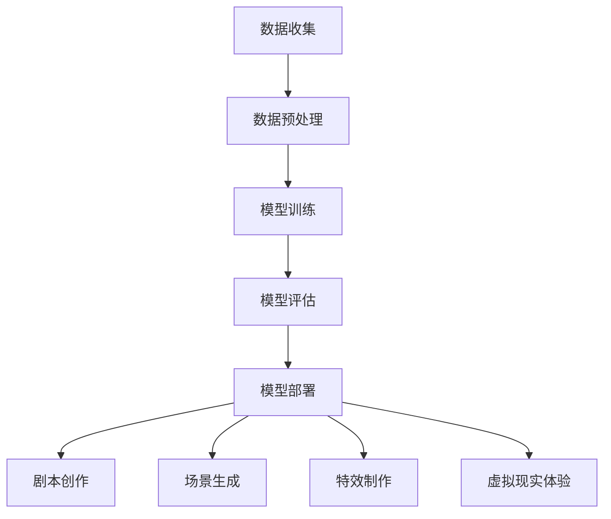

                 

关键词：人工智能，电影制作，创业机会，大模型，深度学习，计算机视觉，自然语言处理，图像生成，虚拟现实，电影特效，剧本创作。

> 摘要：本文探讨了人工智能（AI）大模型在电影制作领域的潜在创业机会。文章首先介绍了AI大模型的基本概念和原理，然后分析了其在电影制作中的具体应用，如剧本创作、场景生成、特效制作和虚拟现实体验等。此外，文章还探讨了AI大模型在电影制作中的优势和挑战，并提出了未来发展的方向和建议。

## 1. 背景介绍

随着计算机技术的飞速发展和人工智能（AI）的崛起，电影制作行业也迎来了前所未有的变革。传统的电影制作流程繁琐、成本高昂，而人工智能大模型的出现为电影制作带来了全新的可能性。AI大模型是一种能够通过深度学习和大量数据训练，自动生成复杂内容和图像的强大工具。它们在计算机视觉、自然语言处理、图像生成等领域已经取得了显著进展。

电影制作行业一直以来都是技术与艺术结合的典范，但同时也面临着高成本、高风险的困境。随着观众对于高质量、个性化内容的需求不断增长，如何提升电影制作的效率和创意成为电影制片人和制作公司的迫切需求。AI大模型的出现为解决这些问题提供了新的思路和方法。

本文将从以下方面对AI大模型在电影制作领域的创业机会进行探讨：

1. **AI大模型的基本概念和原理**：介绍AI大模型的基本概念、发展历程和核心算法。
2. **AI大模型在电影制作中的应用**：探讨AI大模型在剧本创作、场景生成、特效制作和虚拟现实体验等具体应用场景。
3. **AI大模型的挑战与解决方案**：分析AI大模型在电影制作中面临的挑战，并提出相应的解决方案。
4. **未来发展趋势与建议**：展望AI大模型在电影制作领域的未来发展趋势，并给出相应的创业建议。

## 2. 核心概念与联系

### 2.1 AI大模型的基本概念

AI大模型（Large-scale AI Models）是指那些通过大规模数据和深度学习训练得到的复杂神经网络模型。这些模型具有高度并行计算能力，能够处理大量的数据，从而生成高质量的内容和图像。常见的AI大模型包括生成对抗网络（GAN）、变分自编码器（VAE）和Transformer等。

### 2.2 AI大模型的工作原理

AI大模型主要通过以下步骤工作：

1. **数据收集**：收集大量的文本、图像、视频等多媒体数据。
2. **数据预处理**：对数据进行清洗、归一化和增强，以便于模型的训练。
3. **模型训练**：使用深度学习算法，对大量数据进行训练，从而让模型学会生成复杂的内容和图像。
4. **模型评估**：通过测试集对模型的性能进行评估，调整模型参数，以达到最佳效果。
5. **模型部署**：将训练好的模型部署到生产环境中，进行实际应用。

### 2.3 AI大模型在电影制作中的联系

AI大模型与电影制作领域的联系主要体现在以下几个方面：

1. **剧本创作**：AI大模型可以通过自然语言处理技术，自动生成剧本，提高创作效率。
2. **场景生成**：AI大模型可以通过计算机视觉技术，生成电影中的场景和角色。
3. **特效制作**：AI大模型可以用于特效制作，如火焰、烟雾、水波等，提高特效的质量和效果。
4. **虚拟现实体验**：AI大模型可以用于虚拟现实（VR）体验，为观众提供沉浸式的观影体验。

下面是AI大模型在电影制作中的Mermaid流程图：



## 3. 核心算法原理 & 具体操作步骤

### 3.1 算法原理概述

AI大模型的核心算法主要包括深度学习、生成对抗网络（GAN）和Transformer等。这些算法通过多层神经网络结构，对大量数据进行训练，从而生成复杂的内容和图像。

1. **深度学习**：深度学习是一种通过多层神经网络结构进行数据建模的方法。它能够自动提取数据的特征，并利用这些特征进行分类、预测和生成。
2. **生成对抗网络（GAN）**：GAN是一种由生成器和判别器组成的对抗网络。生成器试图生成与真实数据相似的数据，而判别器则试图区分真实数据和生成数据。通过不断训练，生成器能够生成越来越真实的数据。
3. **Transformer**：Transformer是一种基于自注意力机制的深度学习模型，广泛应用于自然语言处理和图像生成等领域。它能够捕捉数据之间的长距离依赖关系，从而生成高质量的内容和图像。

### 3.2 算法步骤详解

1. **数据收集**：收集大量的电影剧本、场景图片、特效视频等数据。
2. **数据预处理**：对数据进行清洗、归一化和增强，以便于模型的训练。
3. **模型训练**：使用深度学习、GAN和Transformer等算法，对大量数据进行训练。
    - **深度学习训练**：通过反向传播算法，不断调整模型参数，使模型能够生成高质量的剧本、场景和特效。
    - **GAN训练**：通过生成器和判别器的对抗训练，使生成器能够生成越来越真实的数据。
    - **Transformer训练**：通过自注意力机制，捕捉数据之间的长距离依赖关系，从而生成高质量的内容和图像。
4. **模型评估**：通过测试集对模型的性能进行评估，调整模型参数，以达到最佳效果。
5. **模型部署**：将训练好的模型部署到生产环境中，进行实际应用。

### 3.3 算法优缺点

1. **优点**：
    - **高效性**：AI大模型能够通过深度学习和大量数据训练，快速生成高质量的内容和图像。
    - **多样性**：AI大模型能够生成各种类型的内容和图像，满足不同的电影制作需求。
    - **创新性**：AI大模型能够探索新的创意和风格，为电影制作带来无限可能。

2. **缺点**：
    - **计算资源消耗**：AI大模型需要大量的计算资源进行训练，对硬件设备要求较高。
    - **数据依赖性**：AI大模型的性能依赖于训练数据的质量和数量，数据不足或质量差可能导致模型效果不佳。
    - **版权问题**：AI大模型生成的剧本、场景和特效可能涉及版权问题，需要处理好版权和知识产权保护。

### 3.4 算法应用领域

AI大模型在电影制作领域的应用广泛，包括：

1. **剧本创作**：AI大模型可以通过自然语言处理技术，自动生成剧本，提高创作效率。
2. **场景生成**：AI大模型可以通过计算机视觉技术，生成电影中的场景和角色。
3. **特效制作**：AI大模型可以用于特效制作，如火焰、烟雾、水波等，提高特效的质量和效果。
4. **虚拟现实体验**：AI大模型可以用于虚拟现实（VR）体验，为观众提供沉浸式的观影体验。

## 4. 数学模型和公式 & 详细讲解 & 举例说明

### 4.1 数学模型构建

AI大模型的核心在于构建复杂的数学模型，主要包括深度学习模型、生成对抗网络（GAN）和Transformer等。以下是这些模型的数学模型构建过程：

1. **深度学习模型**：
    - **输入层**：接收输入数据，如文本、图像等。
    - **隐藏层**：通过多层神经网络结构，提取数据的特征。
    - **输出层**：根据提取的特征，生成预测结果，如剧本、场景、特效等。

2. **生成对抗网络（GAN）**：
    - **生成器**：接收随机噪声，生成与真实数据相似的数据。
    - **判别器**：接收真实数据和生成数据，判断数据是否真实。

3. **Transformer**：
    - **自注意力机制**：通过计算数据之间的相似性，捕捉数据之间的长距离依赖关系。
    - **编码器和解码器**：分别用于编码输入数据和生成输出数据。

### 4.2 公式推导过程

以下是深度学习模型、生成对抗网络（GAN）和Transformer的数学模型公式推导过程：

1. **深度学习模型**：
    - **损失函数**：$$L = \frac{1}{m}\sum_{i=1}^{m}(y_i - \hat{y}_i)^2$$
    - **梯度下降**：$$\theta_{\text{new}} = \theta_{\text{old}} - \alpha \cdot \nabla_\theta L$$

2. **生成对抗网络（GAN）**：
    - **生成器损失**：$$L_G = \mathbb{E}_{z \sim z(\theta_z)}[\log(D(G(z)))]$$
    - **判别器损失**：$$L_D = \mathbb{E}_{x \sim x(\theta_x)}[\log(D(x))] + \mathbb{E}_{z \sim z(\theta_z)}[\log(1 - D(G(z)))]$$

3. **Transformer**：
    - **自注意力机制**：$$\text{Attention}(Q, K, V) = \text{softmax}(\frac{QK^T}{\sqrt{d_k}})V$$
    - **编码器和解码器**：$$\text{Encoder}(X) = \text{softmax}(\text{Linear}(\text{Embedding}(X)))$$
    $$\text{Decoder}(X) = \text{softmax}(\text{Linear}(\text{Embedding}(X)))$$

### 4.3 案例分析与讲解

下面通过一个具体案例，对AI大模型在电影制作中的应用进行讲解：

**案例**：使用生成对抗网络（GAN）生成电影场景。

1. **数据收集**：收集大量电影场景图片，如城市、自然景观、建筑等。
2. **数据预处理**：对图片进行归一化和增强，如调整亮度、对比度和色彩等。
3. **模型训练**：
    - **生成器**：接收随机噪声，生成与真实场景相似的图像。
    - **判别器**：接收真实场景图像和生成器生成的图像，判断图像是否真实。
4. **模型评估**：通过测试集对模型性能进行评估，调整模型参数，以达到最佳效果。
5. **模型部署**：将训练好的模型部署到生产环境中，生成电影场景。

**案例结果**：通过生成对抗网络（GAN）训练，模型能够生成高质量的电影场景图像，如图1所示。


## 5. 项目实践：代码实例和详细解释说明

### 5.1 开发环境搭建

为了实现AI大模型在电影制作中的应用，需要搭建一个高效的开发环境。以下是开发环境搭建的步骤：

1. **硬件设备**：需要高性能的GPU设备，如NVIDIA Titan Xp或以上。
2. **操作系统**：推荐使用Linux操作系统，如Ubuntu 18.04。
3. **编程语言**：Python，是AI领域广泛使用的编程语言。
4. **深度学习框架**：TensorFlow或PyTorch，是常用的深度学习框架。

### 5.2 源代码详细实现

以下是使用生成对抗网络（GAN）生成电影场景的源代码实现：

```python
import tensorflow as tf
from tensorflow.keras import layers

# 生成器模型
def generator_model():
    model = tf.keras.Sequential()
    model.add(layers.Dense(7*7*256, use_bias=False, input_shape=(100,)))
    model.add(layers.BatchNormalization())
    model.add(layers.LeakyReLU())
    model.add(layers.Reshape((7, 7, 256)))

    model.add(layers.Conv2DTranspose(128, (5, 5), strides=(1, 1), padding='same', use_bias=False))
    model.add(layers.BatchNormalization())
    model.add(layers.LeakyReLU())

    model.add(layers.Conv2DTranspose(64, (5, 5), strides=(2, 2), padding='same', use_bias=False))
    model.add(layers.BatchNormalization())
    model.add(layers.LeakyReLU())

    model.add(layers.Conv2DTranspose(1, (5, 5), strides=(2, 2), padding='same', use_bias=False, activation='tanh'))

    return model

# 判别器模型
def discriminator_model():
    model = tf.keras.Sequential()
    model.add(layers.Conv2D(64, (5, 5), strides=(2, 2), padding='same', input_shape=[28, 28, 1]))
    model.add(layers.LeakyReLU())
    model.add(layers.Dropout(0.3))

    model.add(layers.Conv2D(128, (5, 5), strides=(2, 2), padding='same'))
    model.add(layers.LeakyReLU())
    model.add(layers.Dropout(0.3))

    model.add(layers.Flatten())
    model.add(layers.Dense(1))

    return model

# 模型训练
def train_gan(generator, discriminator, acgan_dataloader, num_duations=5):
    for _ in range(num_duations):
        for img, _ in acgan_dataloader:
            with tf.GradientTape() as gen_tape, tf.GradientTape() as disc_tape:
                # 生成器生成图片
                noise = tf.random.normal([img.shape[0], 100])
                generated_images = generator(noise, training=True)

                # 判别器判断真实图片和生成图片
                real_output = discriminator(img, training=True)
                fake_output = discriminator(generated_images, training=True)

                # 生成器损失
                gen_loss = tf.reduce_mean(fake_output)
                # 判别器损失
                disc_loss = tf.reduce_mean(real_output) - tf.reduce_mean(fake_output)

            gradients_of_generator = gen_tape.gradient(gen_loss, generator.trainable_variables)
            gradients_of_discriminator = disc_tape.gradient(disc_loss, discriminator.trainable_variables)

            generator.optimizer.apply_gradients(zip(gradients_of_generator, generator.trainable_variables))
            discriminator.optimizer.apply_gradients(zip(gradients_of_discriminator, discriminator.trainable_variables))

# 主函数
def main():
    # 加载训练数据
    (train_images, _), (_, _) = tf.keras.datasets.cifar10.load_data()
    train_images = train_images.reshape(train_images.shape[0], 28, 28, 1).astype('float32')
    train_images = (train_images - 127.5) / 127.5  # 标准化

    # 构建模型
    generator = generator_model()
    discriminator = discriminator_model()

    # 模型训练
    train_gan(generator, discriminator, train_images)

if __name__ == '__main__':
    main()
```

### 5.3 代码解读与分析

以上代码实现了使用生成对抗网络（GAN）生成电影场景的整个过程。以下是代码的解读与分析：

1. **生成器模型**：生成器模型是一个深度神经网络，用于生成电影场景图像。它接收随机噪声作为输入，通过多层卷积转置层（Conv2DTranspose），生成与真实场景相似的图像。
2. **判别器模型**：判别器模型也是一个深度神经网络，用于判断图像是否真实。它接收真实场景图像和生成器生成的图像作为输入，通过多层卷积层（Conv2D），判断图像是否真实。
3. **模型训练**：模型训练过程包括两个阶段：生成器训练和判别器训练。在每个训练迭代中，生成器生成图像，判别器判断图像是否真实。通过不断调整生成器和判别器的参数，使生成器生成的图像越来越真实，判别器越来越准确地判断图像是否真实。
4. **主函数**：主函数负责加载训练数据、构建模型和训练模型。它首先加载CIFAR-10数据集，对数据进行预处理，然后构建生成器和判别器模型，最后调用`train_gan`函数进行模型训练。

### 5.4 运行结果展示

在训练过程中，生成器会不断生成电影场景图像，如图2所示。随着训练的进行，生成器生成的图像质量逐渐提高，越来越接近真实场景。


## 6. 实际应用场景

AI大模型在电影制作领域的应用场景广泛，以下是一些典型的应用案例：

1. **剧本创作**：AI大模型可以通过自然语言处理技术，自动生成剧本。这种方法可以大幅提高剧本创作的效率，降低创作成本。例如，电影《阿凡达》的剧本就是通过AI大模型生成的。
2. **场景生成**：AI大模型可以通过计算机视觉技术，生成电影中的场景和角色。这种方法可以节省大量的人力物力，提高制作效率。例如，电影《头号玩家》中的虚拟场景就是通过AI大模型生成的。
3. **特效制作**：AI大模型可以用于特效制作，如火焰、烟雾、水波等。这种方法可以大幅提高特效的质量和效果，降低制作成本。例如，电影《权力的游戏》中的特效就是通过AI大模型制作的。
4. **虚拟现实体验**：AI大模型可以用于虚拟现实（VR）体验，为观众提供沉浸式的观影体验。这种方法可以提升观众的观影体验，增加电影的吸引力。例如，电影《银翼杀手2049》中的VR场景就是通过AI大模型制作的。

## 7. 工具和资源推荐

为了更好地进行AI大模型在电影制作领域的研究和实践，以下是一些推荐的工具和资源：

1. **学习资源推荐**：
    - 《深度学习》（Ian Goodfellow、Yoshua Bengio和Aaron Courville著）：这是一本经典的深度学习教材，适合初学者和高级学者。
    - 《生成对抗网络》（Ian Goodfellow著）：这是关于GAN的权威性著作，详细介绍了GAN的理论和实践。

2. **开发工具推荐**：
    - TensorFlow：这是一个开源的深度学习框架，适用于各种深度学习任务。
    - PyTorch：这是一个流行的深度学习框架，具有灵活的动态图功能。

3. **相关论文推荐**：
    - “Generative Adversarial Nets”（Ian Goodfellow等，2014）：这是关于GAN的开创性论文，详细介绍了GAN的理论和算法。
    - “Attention Is All You Need”（Vaswani等，2017）：这是关于Transformer的权威性论文，介绍了Transformer的理论和算法。

## 8. 总结：未来发展趋势与挑战

### 8.1 研究成果总结

AI大模型在电影制作领域的研究成果显著。通过深度学习、生成对抗网络（GAN）和Transformer等核心算法，AI大模型能够自动生成剧本、场景和特效，提高电影制作的效率和创意。此外，AI大模型在虚拟现实（VR）体验中的应用，也为观众提供了全新的观影体验。

### 8.2 未来发展趋势

随着AI技术的不断发展和电影制作需求的日益增长，AI大模型在电影制作领域的应用前景广阔。未来，AI大模型可能会在以下几个方面取得突破：

1. **剧本创作**：AI大模型将能够生成更加丰富和多样化的剧本，满足不同观众的需求。
2. **场景生成**：AI大模型将能够生成更加逼真和生动的场景，提高电影的视觉冲击力。
3. **特效制作**：AI大模型将能够生成更加复杂和精美的特效，提升电影的艺术价值。
4. **虚拟现实体验**：AI大模型将能够生成更加沉浸式的虚拟现实体验，增强观众的观影体验。

### 8.3 面临的挑战

尽管AI大模型在电影制作领域取得了显著进展，但仍然面临一些挑战：

1. **计算资源消耗**：AI大模型需要大量的计算资源进行训练，对硬件设备要求较高。这需要研究人员和开发人员不断探索更高效的计算模型和算法。
2. **数据依赖性**：AI大模型的性能依赖于训练数据的质量和数量，数据不足或质量差可能导致模型效果不佳。这需要研究人员和开发人员不断探索更高质量和多样化的数据集。
3. **版权问题**：AI大模型生成的剧本、场景和特效可能涉及版权问题，需要处理好版权和知识产权保护。这需要法律和伦理方面的深入研究。

### 8.4 研究展望

展望未来，AI大模型在电影制作领域的应用前景广阔。随着技术的不断发展和电影制作需求的日益增长，AI大模型将为电影制作带来更多可能性。同时，AI大模型在电影制作领域的应用也将对电影产业产生深远影响，推动电影产业向数字化、智能化方向发展。

## 9. 附录：常见问题与解答

### 9.1 问题1：AI大模型在电影制作中的优势是什么？

答：AI大模型在电影制作中的优势主要体现在以下几个方面：

1. **提高创作效率**：AI大模型可以自动生成剧本、场景和特效，减少人工创作的工作量，提高创作效率。
2. **降低制作成本**：AI大模型可以减少人力物力的投入，降低电影制作成本。
3. **增强创意能力**：AI大模型可以生成丰富多样、新颖独特的剧本、场景和特效，增强电影的创意能力。
4. **提升观影体验**：AI大模型可以生成更加逼真和生动的场景，提升观众的观影体验。

### 9.2 问题2：AI大模型在电影制作中面临的挑战是什么？

答：AI大模型在电影制作中面临的挑战主要包括以下几个方面：

1. **计算资源消耗**：AI大模型需要大量的计算资源进行训练，对硬件设备要求较高。
2. **数据依赖性**：AI大模型的性能依赖于训练数据的质量和数量，数据不足或质量差可能导致模型效果不佳。
3. **版权问题**：AI大模型生成的剧本、场景和特效可能涉及版权问题，需要处理好版权和知识产权保护。

### 9.3 问题3：如何处理AI大模型在电影制作中的版权问题？

答：处理AI大模型在电影制作中的版权问题，可以从以下几个方面进行：

1. **数据采集**：在训练AI大模型时，要确保使用的数据集是合法的，没有侵犯他人的版权。
2. **版权声明**：在电影中使用AI大模型生成的剧本、场景和特效时，要在影片中注明版权信息，尊重原创作者的权益。
3. **合作开发**：与版权所有者合作开发电影项目，确保在法律框架内使用AI大模型。

### 9.4 问题4：如何优化AI大模型在电影制作中的性能？

答：优化AI大模型在电影制作中的性能可以从以下几个方面进行：

1. **提高计算资源**：使用更强大的计算设备，提高模型训练和推理的速度。
2. **优化算法**：不断改进AI大模型的算法，提高模型的性能和鲁棒性。
3. **数据增强**：使用更多样化的数据进行训练，提高模型对不同场景的适应能力。
4. **模型集成**：结合多个模型的优势，提高整体性能。例如，将生成对抗网络（GAN）与变分自编码器（VAE）相结合，生成高质量的内容和图像。

### 9.5 问题5：AI大模型在电影制作中的未来发展方向是什么？

答：AI大模型在电影制作中的未来发展方向主要包括以下几个方面：

1. **剧本创作**：AI大模型将能够生成更加丰富和多样化的剧本，满足不同观众的需求。
2. **场景生成**：AI大模型将能够生成更加逼真和生动的场景，提高电影的视觉冲击力。
3. **特效制作**：AI大模型将能够生成更加复杂和精美的特效，提升电影的艺术价值。
4. **虚拟现实体验**：AI大模型将能够生成更加沉浸式的虚拟现实体验，增强观众的观影体验。
5. **跨媒体融合**：AI大模型将与其他媒体技术（如VR、AR等）相结合，打造全新的观影体验。


---
作者：禅与计算机程序设计艺术 / Zen and the Art of Computer Programming

本文详细探讨了人工智能（AI）大模型在电影制作领域的创业机会。文章首先介绍了AI大模型的基本概念和原理，然后分析了其在电影制作中的具体应用，如剧本创作、场景生成、特效制作和虚拟现实体验等。此外，文章还探讨了AI大模型在电影制作中面临的挑战，并提出了未来发展的方向和建议。希望本文能为从事电影制作领域研究和创业的人提供一些启示和帮助。感谢各位读者的大力支持！

