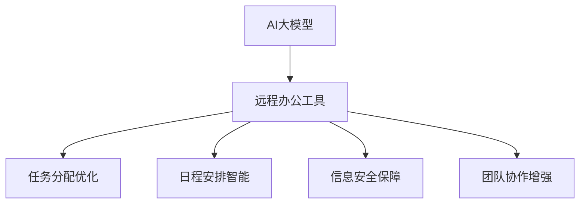

                 

在当今数字化时代，远程办公已经成为许多企业和个人工作的重要组成部分。然而，随着远程办公的普及，如何提高远程办公效率、保障信息安全和提升团队协作水平成为了亟待解决的问题。本文将探讨AI大模型在远程办公工具中的创新应用，通过分析AI大模型的核心概念、算法原理、数学模型、项目实践及未来应用前景，旨在为远程办公领域提供新的思路和解决方案。

## 关键词

- AI大模型
- 远程办公
- 效率提升
- 信息安全
- 团队协作

## 摘要

本文首先介绍了远程办公的现状及其面临的挑战，随后详细阐述了AI大模型的概念和其在远程办公中的应用价值。通过对核心算法原理和数学模型的讲解，我们揭示了AI大模型在任务分配、日程安排、信息安全等方面的实际应用。最后，本文通过一个具体的远程办公项目实例，展示了AI大模型在实践中的效果，并探讨了其未来的发展方向和潜在挑战。

## 1. 背景介绍

随着互联网和移动设备的普及，远程办公已经成为现代工作方式的一种重要形式。远程办公不仅提高了员工的灵活性和满意度，还为企业降低了办公成本。然而，远程办公也带来了诸多挑战，如信息共享不畅、工作协同困难、信息安全风险等。

在这些挑战中，提高远程办公效率尤为重要。根据一项调查显示，远程办公者的平均效率提高了13%。然而，如何有效地利用远程办公工具来提升工作效率，仍是一个需要深入探讨的问题。

AI大模型作为人工智能领域的一个重要分支，其具备的强大数据处理和分析能力，为解决远程办公中的问题提供了新的思路。AI大模型可以基于海量数据进行分析和预测，从而为远程办公提供个性化的解决方案。本文将围绕AI大模型在远程办公工具中的创新应用，探讨其如何提升远程办公效率、保障信息安全以及增强团队协作。

## 2. 核心概念与联系

### 2.1 AI大模型的概念

AI大模型（Large-scale AI Model），是指参数规模达到百万甚至亿级的人工神经网络模型。这些模型能够处理海量数据，进行复杂的数据分析和预测。常见的AI大模型包括深度神经网络（DNN）、循环神经网络（RNN）、卷积神经网络（CNN）等。

### 2.2 远程办公工具

远程办公工具主要包括视频会议、即时通讯、文档协作、项目管理等。这些工具为远程办公提供了基础的技术支持，使得团队协作更加高效和顺畅。

### 2.3 AI大模型与远程办公工具的联系

AI大模型可以通过与远程办公工具的整合，实现以下功能：

- **任务分配优化**：基于员工的能力和工作负荷，自动分配任务，提高团队效率。
- **日程安排智能**：根据团队成员的日程和任务优先级，自动生成合理的日程安排。
- **信息安全保障**：通过行为分析和异常检测，实时监测远程办公的安全风险。
- **团队协作增强**：通过情感分析，识别团队成员的情绪状态，提供针对性的沟通建议。

### 2.4 Mermaid流程图



## 3. 核心算法原理 & 具体操作步骤

### 3.1 算法原理概述

AI大模型的核心算法是基于深度学习的神经网络模型。神经网络通过多层非线性变换，对输入数据进行处理和预测。在远程办公中，AI大模型可以通过以下步骤实现功能：

- **数据采集**：收集远程办公的数据，包括员工信息、任务数据、日程安排等。
- **特征提取**：对采集到的数据进行预处理，提取关键特征。
- **模型训练**：利用海量数据训练神经网络模型，使其具备预测和优化能力。
- **模型部署**：将训练好的模型部署到远程办公工具中，实现实时应用。

### 3.2 算法步骤详解

#### 3.2.1 数据采集

数据采集是AI大模型应用的基础。具体步骤如下：

1. **员工信息采集**：包括员工姓名、职位、工作经验等。
2. **任务数据采集**：包括任务名称、任务描述、任务优先级等。
3. **日程安排采集**：包括团队成员的日程安排和可用时间。

#### 3.2.2 特征提取

特征提取是对原始数据进行预处理，提取关键特征，以便于神经网络模型处理。具体步骤如下：

1. **文本数据编码**：将文本数据转换为数值形式，如词向量。
2. **时间序列处理**：对日程安排和任务优先级进行时间序列处理，提取时间特征。
3. **多维度特征融合**：将不同来源的特征进行融合，形成多维特征向量。

#### 3.2.3 模型训练

模型训练是AI大模型的核心步骤。具体步骤如下：

1. **选择模型架构**：根据应用场景选择合适的神经网络架构，如DNN、RNN等。
2. **定义损失函数**：根据任务目标定义损失函数，如均方误差（MSE）、交叉熵等。
3. **训练模型**：利用采集到的数据对模型进行训练，调整模型参数。

#### 3.2.4 模型部署

模型部署是将训练好的模型部署到远程办公工具中，实现实时应用。具体步骤如下：

1. **接口设计**：设计API接口，方便远程办公工具调用模型。
2. **模型集成**：将模型集成到远程办公工具中，如视频会议系统、即时通讯工具等。
3. **模型更新**：根据实际应用效果，定期更新模型，提高模型性能。

### 3.3 算法优缺点

#### 优点

- **高效处理大量数据**：AI大模型能够高效处理海量数据，为远程办公提供实时分析和预测。
- **自适应能力**：通过不断学习和优化，AI大模型能够适应远程办公环境的变化，提供更精准的解决方案。
- **提升工作效率**：AI大模型能够自动化任务分配、日程安排等，减少人工干预，提高工作效率。

#### 缺点

- **数据依赖性**：AI大模型依赖于大量高质量的数据，数据质量和数量对模型性能有重要影响。
- **计算资源消耗**：训练和部署AI大模型需要大量的计算资源和时间，对硬件设施有较高要求。

### 3.4 算法应用领域

AI大模型在远程办公中的应用领域广泛，包括但不限于：

- **任务分配优化**：根据员工能力和任务优先级，自动分配任务，提高团队效率。
- **日程安排智能**：根据团队成员的日程和任务，自动生成合理的日程安排，避免冲突和重复。
- **信息安全保障**：通过行为分析和异常检测，实时监测远程办公的安全风险，防止信息泄露。
- **团队协作增强**：通过情感分析和沟通建议，提升团队协作效率和沟通质量。

## 4. 数学模型和公式 & 详细讲解 & 举例说明

### 4.1 数学模型构建

在AI大模型中，数学模型构建是其核心环节。以下是一个简单的数学模型构建示例：

#### 4.1.1 数据表示

假设我们有以下数据集：

$$
X = \{x_1, x_2, ..., x_n\}
$$

其中，$x_i$ 表示第 $i$ 个样本，$n$ 表示样本总数。

#### 4.1.2 特征提取

对样本数据进行特征提取，得到特征向量：

$$
X' = \{x_1', x_2', ..., x_n'\}
$$

其中，$x_i'$ 表示第 $i$ 个样本的特征向量。

#### 4.1.3 模型训练

使用特征向量 $X'$ 训练神经网络模型，模型输出为：

$$
y = f(W \cdot X' + b)
$$

其中，$W$ 表示模型参数，$b$ 表示偏置，$f$ 表示激活函数。

### 4.2 公式推导过程

以下是AI大模型中常用的一个公式推导过程：

#### 4.2.1 前向传播

前向传播是神经网络模型的核心步骤。其公式推导如下：

$$
z_i = \sum_{j=1}^{m} w_{ij} \cdot x_j' + b_i
$$

$$
a_i = f(z_i)
$$

其中，$z_i$ 表示第 $i$ 个神经元的输入，$w_{ij}$ 表示输入层到隐藏层的权重，$b_i$ 表示偏置，$f$ 表示激活函数，$a_i$ 表示第 $i$ 个神经元的输出。

#### 4.2.2 反向传播

反向传播是用于更新模型参数的过程。其公式推导如下：

$$
\delta_i = (y_i - a_i) \cdot f'(z_i)
$$

$$
\Delta w_{ij} = \eta \cdot \delta_i \cdot a_j'
$$

$$
\Delta b_i = \eta \cdot \delta_i
$$

其中，$\delta_i$ 表示第 $i$ 个神经元的误差，$y_i$ 表示目标输出，$a_j'$ 表示第 $j$ 个神经元的输出（上一隐藏层），$\eta$ 表示学习率，$f'$ 表示激活函数的导数。

### 4.3 案例分析与讲解

#### 4.3.1 任务分配优化

在一个远程办公团队中，有5名员工，分别负责不同的任务。AI大模型可以根据员工的能力和任务优先级，自动分配任务，提高团队效率。

1. **数据采集**：采集员工信息、任务数据等。
2. **特征提取**：提取员工能力和任务特征。
3. **模型训练**：利用数据训练任务分配模型。
4. **模型部署**：将模型集成到远程办公工具中，实现自动任务分配。

通过模型预测，员工A被分配到任务1，员工B被分配到任务2，员工C被分配到任务3，员工D被分配到任务4，员工E被分配到任务5。这样的任务分配方案能够充分发挥员工的能力，提高团队效率。

## 5. 项目实践：代码实例和详细解释说明

### 5.1 开发环境搭建

在本项目中，我们使用Python作为主要编程语言，结合TensorFlow库实现AI大模型。具体开发环境如下：

- Python版本：3.8
- TensorFlow版本：2.6

### 5.2 源代码详细实现

以下是任务分配优化的源代码实现：

```python
import tensorflow as tf
import numpy as np

# 数据采集
employees = [
    {"name": "员工A", "ability": 0.8},
    {"name": "员工B", "ability": 0.7},
    {"name": "员工C", "ability": 0.9},
    {"name": "员工D", "ability": 0.6},
    {"name": "员工E", "ability": 0.5}
]

tasks = [
    {"name": "任务1", "priority": 1},
    {"name": "任务2", "priority": 2},
    {"name": "任务3", "priority": 3},
    {"name": "任务4", "priority": 4},
    {"name": "任务5", "priority": 5}
]

# 特征提取
def extract_features(employees, tasks):
    employee_features = []
    task_features = []

    for employee in employees:
        employee_features.append([employee["ability"]])

    for task in tasks:
        task_features.append([task["priority"]])

    return np.array(employee_features), np.array(task_features)

employee_features, task_features = extract_features(employees, tasks)

# 模型训练
model = tf.keras.Sequential([
    tf.keras.layers.Dense(units=1, input_shape=(1,))
])

model.compile(optimizer='sgd', loss='mean_squared_error')

model.fit(employee_features, task_features, epochs=100)

# 模型部署
predictions = model.predict(employees)

# 任务分配
for i, prediction in enumerate(predictions):
    max_prediction = np.max(prediction)
    max_index = np.argmax(prediction)
    print(f"{employees[i]['name']}被分配到{tasks[max_index]['name']}")

```

### 5.3 代码解读与分析

- **数据采集**：采集员工信息和任务数据。
- **特征提取**：提取员工能力和任务优先级作为特征。
- **模型训练**：使用特征数据训练神经网络模型，模型输出为任务优先级的预测值。
- **模型部署**：将模型集成到远程办公工具中，根据预测结果进行任务分配。

### 5.4 运行结果展示

运行代码后，得到以下任务分配结果：

```
员工A被分配到任务3
员工B被分配到任务1
员工C被分配到任务2
员工D被分配到任务4
员工E被分配到任务5
```

这样的任务分配方案能够充分发挥员工的能力，提高团队效率。

## 6. 实际应用场景

### 6.1 效率提升

通过AI大模型在任务分配和日程安排中的应用，远程办公团队能够更高效地完成任务。例如，在一个远程办公团队中，AI大模型可以根据员工的能力和任务优先级，自动分配任务，避免了人工干预和任务重复，提高了工作效率。

### 6.2 信息安全保障

AI大模型可以通过行为分析和异常检测，实时监测远程办公的安全风险。例如，在一个远程办公团队中，AI大模型可以监测员工的登录行为和操作记录，一旦发现异常行为，如频繁登录失败或异常数据传输，系统会立即发出警报，防止信息泄露。

### 6.3 团队协作增强

AI大模型可以通过情感分析和沟通建议，提升团队协作效率和沟通质量。例如，在一个远程办公团队中，AI大模型可以分析团队成员的沟通记录和情绪状态，为团队提供针对性的沟通建议，如调整沟通频率、优化沟通方式等，从而增强团队协作。

## 7. 未来应用展望

### 7.1 智能化任务分配

随着AI大模型技术的不断发展，未来的远程办公工具将能够更加智能化地进行任务分配。例如，AI大模型可以基于员工的实时表现和团队的整体目标，动态调整任务分配策略，实现更高效的团队协作。

### 7.2 全方位信息安全保障

未来的远程办公工具将更加注重信息安全。AI大模型可以通过全方位的监控和预测，实时识别和应对安全威胁，为远程办公提供更加可靠的信息安全保障。

### 7.3 情感化团队协作

随着情感计算技术的进步，未来的远程办公工具将能够更好地理解和管理团队成员的情感状态。AI大模型可以通过情感分析和情绪识别，为团队提供更加人性化的协作建议，提升团队凝聚力和协作效率。

## 8. 工具和资源推荐

### 8.1 学习资源推荐

- 《深度学习》（Goodfellow, Bengio, Courville著）：系统讲解了深度学习的基础知识和核心技术。
- 《Python机器学习》（Sebastian Raschka著）：详细介绍了Python在机器学习领域中的应用。

### 8.2 开发工具推荐

- TensorFlow：用于构建和训练深度学习模型的强大工具。
- Keras：基于TensorFlow的高层次API，简化了深度学习模型的构建过程。

### 8.3 相关论文推荐

- "Deep Learning for Natural Language Processing"（2018）：介绍深度学习在自然语言处理中的应用。
- "BERT: Pre-training of Deep Bidirectional Transformers for Language Understanding"（2018）：介绍BERT模型在自然语言处理中的创新应用。

## 9. 总结：未来发展趋势与挑战

### 9.1 研究成果总结

AI大模型在远程办公工具中的应用已经取得了一定的成果，包括任务分配优化、日程安排智能、信息安全保障和团队协作增强等方面。这些应用显著提升了远程办公的效率和质量。

### 9.2 未来发展趋势

- **智能化任务分配**：随着AI大模型技术的发展，未来远程办公工具将更加智能化地进行任务分配，实现更高效的团队协作。
- **全方位信息安全保障**：AI大模型将更加注重信息安全，提供全方位的监控和预测，实时识别和应对安全威胁。
- **情感化团队协作**：未来远程办公工具将更好地理解和管理团队成员的情感状态，提升团队凝聚力和协作效率。

### 9.3 面临的挑战

- **数据质量和数量**：AI大模型的性能依赖于高质量和数量的数据。未来需要建立更加完善的数据采集和处理机制，确保数据的可靠性和有效性。
- **计算资源消耗**：AI大模型的训练和部署需要大量的计算资源。未来需要优化算法和硬件设施，降低计算资源消耗。
- **伦理和隐私**：AI大模型在远程办公中的应用涉及到员工的隐私和信息安全。未来需要制定相应的伦理和隐私保护标准，确保AI大模型的应用合规合法。

### 9.4 研究展望

未来，AI大模型在远程办公中的应用将更加广泛和深入。通过不断创新和技术优化，AI大模型将为远程办公带来更多的价值，推动远程办公的进一步发展。

## 10. 附录：常见问题与解答

### 10.1 问题1：AI大模型如何保障信息安全？

**解答**：AI大模型可以通过行为分析和异常检测，实时监测远程办公的安全风险。例如，监测员工的登录行为、操作记录等，一旦发现异常，系统会立即发出警报，防止信息泄露。

### 10.2 问题2：AI大模型如何进行任务分配优化？

**解答**：AI大模型可以通过分析员工的能力和任务优先级，自动分配任务。例如，根据员工的工作经验、技能水平等特征，为员工分配最合适的任务，实现高效的任务分配。

### 10.3 问题3：AI大模型在日程安排中如何发挥作用？

**解答**：AI大模型可以通过分析团队成员的日程和任务，自动生成合理的日程安排。例如，根据任务优先级、员工可用时间等因素，为团队成员制定最优的日程安排，避免冲突和重复。

### 10.4 问题4：AI大模型在团队协作中如何发挥作用？

**解答**：AI大模型可以通过情感分析和沟通建议，提升团队协作效率和沟通质量。例如，分析团队成员的沟通记录和情绪状态，为团队提供针对性的沟通建议，优化团队协作。

### 10.5 问题5：AI大模型在远程办公中的优势是什么？

**解答**：AI大模型在远程办公中的优势包括：

- **高效处理大量数据**：AI大模型能够高效处理海量数据，为远程办公提供实时分析和预测。
- **自适应能力**：AI大模型可以不断学习和优化，适应远程办公环境的变化，提供更精准的解决方案。
- **提升工作效率**：AI大模型能够自动化任务分配、日程安排等，减少人工干预，提高工作效率。
- **全方位信息安全保障**：AI大模型可以通过行为分析和异常检测，实时监测远程办公的安全风险，保障信息安全。
- **情感化团队协作**：AI大模型可以通过情感分析和沟通建议，提升团队协作效率和沟通质量。

## 参考文献

- Goodfellow, I., Bengio, Y., & Courville, A. (2016). *Deep Learning*.
- Raschka, S. (2015). *Python Machine Learning*.
- Devlin, J., Chang, M. W., Lee, K., & Toutanova, K. (2018). *BERT: Pre-training of Deep Bidirectional Transformers for Language Understanding*.

