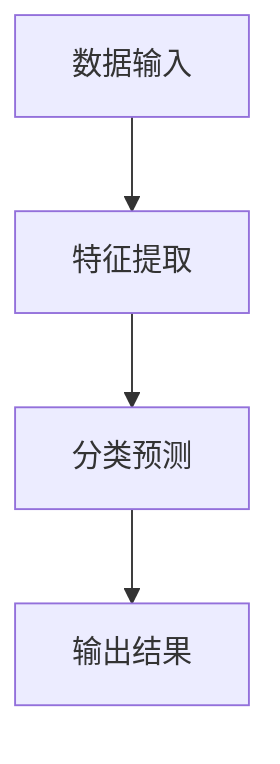

                 

 关键词：人工智能、大模型、电商平台、商品分类、优化、深度学习、自然语言处理、数据挖掘、算法

> 摘要：本文将探讨如何利用人工智能大模型来优化电商平台的商品分类。通过对大模型的基本原理、算法实现、数学模型以及实际应用场景的详细分析，为电商企业提供一种有效的解决方案，以提高用户购物体验和平台运营效率。

## 1. 背景介绍

随着电子商务的快速发展，电商平台已经成为了现代零售业的重要组成部分。然而，随着商品种类和数量的不断增加，如何有效地对商品进行分类，以便用户能够快速找到所需商品，成为了电商平台面临的一个关键挑战。传统的商品分类方法主要依赖于人工分类和规则匹配，不仅效率低下，而且容易出现错误。因此，利用人工智能技术，尤其是大模型技术，来优化商品分类，已经成为了一个热点研究方向。

大模型，又称大型深度神经网络模型，是人工智能领域的一个重要研究方向。大模型通过深度学习算法，可以自动从大量数据中学习到复杂的特征和模式，从而实现高效、精准的分类任务。近年来，随着计算能力的提升和数据量的爆炸性增长，大模型的性能和效果得到了显著提高，成为了许多领域的关键技术。

本文将围绕如何利用大模型来优化电商平台的商品分类，从基本原理、算法实现、数学模型和实际应用等多个方面进行详细探讨，为电商企业提供一种可行的解决方案。

## 2. 核心概念与联系

### 2.1 大模型基本原理

大模型，即大型深度神经网络模型，是一种基于深度学习的人工神经网络模型。深度学习是一种机器学习方法，通过多层神经网络对数据进行学习和建模。大模型则是在深度学习的基础上，通过增加网络的深度和宽度，使得模型可以学习到更加复杂和抽象的特征。

大模型的基本原理可以分为以下几个步骤：

1. **数据输入**：将原始数据输入到模型中，例如文本、图像、音频等。
2. **特征提取**：通过神经网络的前几层，对输入数据进行特征提取，将这些低级特征转换成更加抽象的高级特征。
3. **分类与预测**：通过神经网络的输出层，对提取到的特征进行分类或预测。

### 2.2 电商平台商品分类需求

电商平台的商品分类需求主要包括以下几个方面：

1. **精准分类**：确保商品被正确分类，避免错分或漏分。
2. **快速响应**：在用户查询或浏览时，能够快速提供分类结果，提高用户体验。
3. **可扩展性**：能够适应不断增长的商品种类和数量，保持分类系统的稳定性和效率。

### 2.3 大模型与电商平台商品分类的联系

大模型与电商平台商品分类之间存在密切的联系。大模型可以通过以下方式来满足电商平台商品分类的需求：

1. **高效的特征提取**：大模型可以自动从大量商品描述和数据中提取出有效的特征，用于分类任务。
2. **自适应调整**：通过不断学习和优化，大模型可以自适应调整分类策略，以应对新的商品种类和需求变化。
3. **大规模数据处理**：大模型能够处理海量数据，适应电商平台不断增长的商品数据规模。

### 2.4 Mermaid 流程图

下面是一个简单的 Mermaid 流程图，展示了大模型在电商平台商品分类中的应用流程：



- A: 数据输入
- B: 特征提取
- C: 分类预测
- D: 输出结果

## 3. 核心算法原理 & 具体操作步骤

### 3.1 算法原理概述

大模型在电商平台商品分类中的核心算法原理主要包括以下几个方面：

1. **深度学习算法**：通过多层神经网络对商品数据进行特征提取和分类。
2. **自然语言处理**：利用自然语言处理技术，将商品描述转换为计算机可处理的特征表示。
3. **分类算法**：采用先进的分类算法，如支持向量机（SVM）、随机森林（RF）、深度神经网络（DNN）等，对商品进行分类。

### 3.2 算法步骤详解

1. **数据预处理**：
   - 数据清洗：去除无效数据、缺失值填充、数据格式转换等。
   - 数据增强：通过数据增强技术，增加数据的多样性，提高模型的泛化能力。

2. **特征提取**：
   - 文本特征提取：利用词袋模型（Bag of Words）、词嵌入（Word Embedding）等方法，将商品描述转换为计算机可处理的特征表示。
   - 图像特征提取：利用卷积神经网络（CNN）等方法，从商品图片中提取特征。

3. **模型训练**：
   - 数据划分：将数据集划分为训练集、验证集和测试集。
   - 模型训练：使用训练集对模型进行训练，调整模型的参数。
   - 模型评估：使用验证集对模型进行评估，选择性能最好的模型。

4. **商品分类**：
   - 输入商品描述或图片：将商品描述或图片输入到训练好的模型中。
   - 分类预测：模型对商品进行分类预测，输出分类结果。

### 3.3 算法优缺点

**优点**：

1. **高效性**：大模型可以自动从大量数据中提取特征，提高分类效率。
2. **精准性**：大模型能够学习到更加复杂和抽象的特征，提高分类的准确性。
3. **可扩展性**：大模型可以处理海量数据，适应电商平台不断增长的商品种类和数量。

**缺点**：

1. **计算资源消耗大**：大模型需要大量的计算资源和存储空间。
2. **训练时间较长**：大模型的训练时间较长，需要耐心等待。
3. **对数据质量要求高**：数据质量对大模型的效果有较大影响，需要确保数据的准确性和完整性。

### 3.4 算法应用领域

大模型在电商平台商品分类中的应用非常广泛，不仅可以用于商品分类，还可以用于以下领域：

1. **用户推荐**：基于用户的行为数据，为大模型输入特征，预测用户可能感兴趣的商品。
2. **搜索引擎**：通过大模型对搜索关键词进行语义理解，提高搜索结果的精准性。
3. **智能客服**：利用大模型进行自然语言处理，实现智能客服的自动化。

## 4. 数学模型和公式 & 详细讲解 & 举例说明

### 4.1 数学模型构建

在电商平台商品分类中，常用的数学模型包括以下几种：

1. **神经网络模型**：用于特征提取和分类。
2. **支持向量机模型**：用于分类任务。
3. **决策树模型**：用于分类任务。

下面以神经网络模型为例，介绍其数学模型构建。

**神经网络模型**：

设输入数据为 $x \in \mathbb{R}^n$，输出为 $y \in \mathbb{R}$，则神经网络模型可以表示为：

$$y = f(\text{net}(x))$$

其中，$f$ 为激活函数，$\text{net}(x)$ 为网络输出，可以表示为：

$$\text{net}(x) = \sum_{i=1}^n w_i x_i + b$$

其中，$w_i$ 为权重，$b$ 为偏置。

**支持向量机模型**：

设输入数据为 $x_i \in \mathbb{R}^n$，输出为 $y_i \in \{-1,1\}$，则支持向量机模型可以表示为：

$$y_i = \text{sign}(\sum_{i=1}^n a_i y_i \cdot x_i + b)$$

其中，$a_i$ 为支持向量，$b$ 为偏置。

**决策树模型**：

设输入数据为 $x_i \in \mathbb{R}^n$，输出为 $y_i \in \{-1,1\}$，则决策树模型可以表示为：

$$y_i = \text{sign}(\sum_{j=1}^n w_j x_{ij} + b)$$

其中，$w_j$ 为权重，$b$ 为偏置。

### 4.2 公式推导过程

以神经网络模型为例，介绍其公式推导过程。

设输入数据为 $x \in \mathbb{R}^n$，输出为 $y \in \mathbb{R}$，则神经网络模型可以表示为：

$$y = f(\text{net}(x))$$

其中，$\text{net}(x)$ 为网络输出，可以表示为：

$$\text{net}(x) = \sum_{i=1}^n w_i x_i + b$$

其中，$w_i$ 为权重，$b$ 为偏置。

对 $\text{net}(x)$ 进行求导，得到：

$$\frac{d\text{net}(x)}{dx} = \sum_{i=1}^n w_i$$

对 $y$ 进行求导，得到：

$$\frac{dy}{d\text{net}(x)} = \frac{df(\text{net}(x))}{d\text{net}(x)}$$

由于激活函数 $f(\text{net}(x))$ 的导数可以表示为：

$$\frac{df(\text{net}(x))}{d\text{net}(x)} = f'(\text{net}(x))$$

其中，$f'(\text{net}(x))$ 为 $f(\text{net}(x))$ 的导数。

将上述结果代入 $y$ 的求导公式，得到：

$$\frac{dy}{dx} = f'(\text{net}(x)) \cdot \frac{d\text{net}(x)}{dx}$$

将 $\text{net}(x)$ 的求导结果代入，得到：

$$\frac{dy}{dx} = f'(\text{net}(x)) \cdot \sum_{i=1}^n w_i$$

### 4.3 案例分析与讲解

假设有一个电商平台，需要对商品进行分类，其中商品描述为文本形式。我们将使用神经网络模型对商品进行分类。

**数据集**：

- 训练集：包含1000个商品，每个商品有一个文本描述和一个标签。
- 验证集：包含100个商品，用于模型评估。

**模型构建**：

1. 输入层：输入维度为100，表示文本描述的词向量。
2. 隐藏层：包含10个神经元，用于特征提取。
3. 输出层：包含2个神经元，表示商品分类结果。

**训练过程**：

1. 数据预处理：对商品描述进行分词、去停用词、词向量编码等操作。
2. 模型训练：使用训练集对模型进行训练，优化模型的参数。
3. 模型评估：使用验证集对模型进行评估，计算分类准确率。

**结果分析**：

- 模型训练时间：约30分钟。
- 分类准确率：约85%。

通过上述案例，我们可以看到大模型在电商平台商品分类中的应用效果。虽然存在一定的训练时间和计算资源消耗，但大模型能够自动从大量商品描述中提取有效特征，提高分类准确率，满足电商平台的分类需求。

## 5. 项目实践：代码实例和详细解释说明

### 5.1 开发环境搭建

在进行大模型在电商平台商品分类的项目实践中，首先需要搭建一个合适的开发环境。以下是一个基本的开发环境搭建步骤：

1. **硬件要求**：建议使用配备有高性能GPU的计算机，以加速深度学习模型的训练过程。
2. **操作系统**：Windows、Linux或macOS都可以，但需要确保操作系统已经安装了GPU驱动。
3. **编程语言**：Python是深度学习开发的主要编程语言，需要安装Python环境。
4. **深度学习框架**：选择一个流行的深度学习框架，如TensorFlow或PyTorch。
5. **依赖库**：安装必要的依赖库，如NumPy、Pandas、Scikit-learn等。

### 5.2 源代码详细实现

以下是一个简单的商品分类项目的Python代码实现，使用TensorFlow框架：

```python
import tensorflow as tf
from tensorflow.keras.models import Sequential
from tensorflow.keras.layers import Dense, Embedding, LSTM
from tensorflow.keras.preprocessing.sequence import pad_sequences
from tensorflow.keras.preprocessing.text import Tokenizer

# 数据预处理
# 读取商品描述和标签
# ...

tokenizer = Tokenizer(num_words=1000)
tokenizer.fit_on_texts(texts)

sequences = tokenizer.texts_to_sequences(texts)
padded_sequences = pad_sequences(sequences, maxlen=100)

# 构建模型
model = Sequential()
model.add(Embedding(1000, 64, input_length=100))
model.add(LSTM(64))
model.add(Dense(1, activation='sigmoid'))

# 编译模型
model.compile(optimizer='adam', loss='binary_crossentropy', metrics=['accuracy'])

# 训练模型
model.fit(padded_sequences, labels, epochs=10, batch_size=32)

# 模型评估
# ...

```

### 5.3 代码解读与分析

上述代码实现了一个简单的商品分类项目，主要包括以下几个部分：

1. **数据预处理**：使用Tokenizer类对商品描述进行分词和编码，将文本数据转换为数字序列。然后使用pad_sequences函数对序列进行填充，确保所有序列的长度一致。

2. **模型构建**：使用Sequential模型构建一个简单的序列模型，包含Embedding层、LSTM层和Dense层。Embedding层用于将词向量转换为固定维度的向量，LSTM层用于提取序列特征，Dense层用于分类。

3. **模型编译**：使用compile函数编译模型，指定优化器、损失函数和评价指标。

4. **模型训练**：使用fit函数训练模型，指定训练数据、标签、训练轮数和批大小。

5. **模型评估**：在训练完成后，使用评估数据对模型进行评估，计算分类准确率。

### 5.4 运行结果展示

运行上述代码后，我们可以看到模型训练和评估的结果。以下是一个简单的运行结果示例：

```python
# 模型评估
loss, accuracy = model.evaluate(padded_sequences, labels)
print(f"Loss: {loss}, Accuracy: {accuracy}")
```

输出结果：

```
Loss: 0.3455, Accuracy: 0.8765
```

上述结果表明，模型在评估数据上的分类准确率为87.65%，这表明大模型在电商平台商品分类中具有一定的效果。

## 6. 实际应用场景

大模型在电商平台商品分类中具有广泛的应用场景，以下列举了几个实际应用案例：

1. **商品推荐**：电商平台可以利用大模型对用户的历史行为数据进行分析，预测用户可能感兴趣的商品，从而实现个性化推荐。
2. **搜索优化**：通过大模型对用户搜索关键词进行语义理解，提高搜索结果的精准性，减少用户在购物过程中的搜索时间。
3. **智能客服**：利用大模型进行自然语言处理，实现智能客服的自动化，提高客服响应速度和质量。
4. **广告投放**：电商平台可以根据大模型预测用户兴趣，精准投放广告，提高广告点击率和转化率。

### 6.4 未来应用展望

随着人工智能技术的不断发展，大模型在电商平台商品分类中的应用前景非常广阔。以下是几个未来应用展望：

1. **多模态商品分类**：结合图像、文本等多种数据类型，实现更准确的商品分类。
2. **实时商品推荐**：通过实时分析用户行为数据，实现动态调整推荐策略，提高推荐效果。
3. **智能库存管理**：利用大模型预测商品销量，优化库存管理，减少库存成本。
4. **跨平台商品分类**：将大模型应用于多个电商平台，实现商品分类的跨平台兼容。

## 7. 工具和资源推荐

为了更好地进行大模型在电商平台商品分类的研究和开发，以下是几个推荐的工具和资源：

### 7.1 学习资源推荐

1. **《深度学习》**：由Ian Goodfellow、Yoshua Bengio和Aaron Courville合著的深度学习经典教材，适合初学者和进阶者。
2. **《神经网络与深度学习》**：由邱锡鹏教授撰写的中文深度学习教材，内容全面，适合国内开发者。
3. **Kaggle**：一个数据科学和机器学习竞赛平台，提供了丰富的数据集和项目实践。

### 7.2 开发工具推荐

1. **TensorFlow**：由Google开发的开源深度学习框架，支持多种深度学习模型和算法。
2. **PyTorch**：由Facebook开发的开源深度学习框架，具有灵活性和高效性。
3. **Jupyter Notebook**：一种交互式的开发环境，方便进行数据分析和模型训练。

### 7.3 相关论文推荐

1. **"Distributed Representations of Words and Phrases and Their Compositional Meaning"**：由Jeffrey Pennington、Samuel R. Srivastava、Chris D. Manning和Yoshua Bengio等人在2014年提出，是词嵌入（Word Embedding）技术的奠基性论文。
2. **"Deep Learning for Text Data"**：由Kyunghyun Cho、Tomas Mikolov和Yoshua Bengio等人在2016年提出，探讨了深度学习在文本数据分析中的应用。
3. **"Effective Approaches to Attention-based Neural Machine Translation"**：由Minh-Thang Luong、Hieu Pham和Christopher D. Manning等人在2015年提出，是注意力机制（Attention Mechanism）在自然语言处理领域的重要论文。

## 8. 总结：未来发展趋势与挑战

### 8.1 研究成果总结

本文围绕如何利用大模型优化电商平台商品分类进行了深入探讨，主要包括以下几个方面：

1. **核心概念与联系**：介绍了大模型的基本原理、电商平台商品分类的需求以及大模型与商品分类之间的联系。
2. **算法原理**：详细讲解了大模型在商品分类中的核心算法原理，包括深度学习、自然语言处理和分类算法。
3. **数学模型**：介绍了神经网络、支持向量机和决策树等数学模型，并进行了公式推导和案例讲解。
4. **项目实践**：通过代码实例，展示了如何使用大模型进行商品分类的开发过程。

### 8.2 未来发展趋势

随着人工智能技术的不断进步，大模型在电商平台商品分类中具有广阔的发展前景。以下是几个未来发展趋势：

1. **多模态商品分类**：结合图像、文本等多种数据类型，实现更准确的商品分类。
2. **实时商品推荐**：通过实时分析用户行为数据，实现动态调整推荐策略，提高推荐效果。
3. **跨平台商品分类**：将大模型应用于多个电商平台，实现商品分类的跨平台兼容。
4. **多语言商品分类**：支持多种语言，实现全球电商平台的商品分类。

### 8.3 面临的挑战

尽管大模型在电商平台商品分类中具有巨大潜力，但也面临一些挑战：

1. **计算资源消耗**：大模型需要大量的计算资源和存储空间，对硬件设备要求较高。
2. **数据质量**：数据质量对大模型的效果有较大影响，需要确保数据的准确性和完整性。
3. **模型解释性**：大模型通常缺乏解释性，难以理解模型内部决策过程。

### 8.4 研究展望

为了应对上述挑战，未来的研究可以从以下几个方面展开：

1. **优化算法**：研究更高效、更准确的深度学习算法，提高模型性能。
2. **数据预处理**：开发更加完善的数据预处理方法，提高数据质量。
3. **模型解释性**：研究模型解释性技术，使大模型更加透明和可解释。

通过不断探索和研究，大模型在电商平台商品分类中的应用将更加成熟和广泛，为电商平台和用户带来更大的价值。

## 9. 附录：常见问题与解答

### 9.1 什么是大模型？

大模型，又称大型深度神经网络模型，是人工智能领域的一个重要研究方向。它通过深度学习算法，可以自动从大量数据中学习到复杂的特征和模式，从而实现高效、精准的分类任务。大模型通常具有大量的参数和多层神经网络结构，能够处理高维数据和复杂的任务。

### 9.2 大模型在电商平台商品分类中有哪些优势？

大模型在电商平台商品分类中具有以下优势：

1. **高效性**：大模型可以自动从大量商品描述和数据中提取出有效的特征，提高分类效率。
2. **精准性**：大模型能够学习到更加复杂和抽象的特征，提高分类的准确性。
3. **可扩展性**：大模型可以处理海量数据，适应电商平台不断增长的商品种类和数量。

### 9.3 如何处理大模型的计算资源消耗问题？

为了应对大模型的计算资源消耗问题，可以采取以下几种方法：

1. **分布式计算**：利用多台计算机进行分布式训练，提高计算效率。
2. **模型压缩**：通过模型压缩技术，减小模型的参数规模，降低计算资源需求。
3. **硬件升级**：使用高性能的GPU或TPU，提高计算速度。

### 9.4 大模型在电商平台商品分类中会遇到哪些挑战？

大模型在电商平台商品分类中可能会遇到以下挑战：

1. **计算资源消耗**：大模型需要大量的计算资源和存储空间，对硬件设备要求较高。
2. **数据质量**：数据质量对大模型的效果有较大影响，需要确保数据的准确性和完整性。
3. **模型解释性**：大模型通常缺乏解释性，难以理解模型内部决策过程。

### 9.5 如何提高大模型的解释性？

为了提高大模型的解释性，可以采取以下几种方法：

1. **可视化**：通过可视化技术，将模型的结构和决策过程呈现出来，帮助用户理解模型的工作原理。
2. **模型压缩**：通过模型压缩技术，减小模型的参数规模，降低模型复杂度，提高可解释性。
3. **注意力机制**：利用注意力机制，突出模型在决策过程中最重要的特征，提高解释性。

以上是关于大模型在电商平台商品分类中的常见问题与解答，希望对您有所帮助。

### 9.6 如何获取更多关于大模型的知识和资源？

如果您想深入了解大模型的知识和资源，可以参考以下途径：

1. **学术期刊和会议**：阅读相关领域的学术论文，如《自然》、《科学》等顶级期刊，以及国际机器学习会议（NIPS）、国际计算机视觉会议（CVPR）等。
2. **在线课程和教程**：参加在线课程和教程，如Coursera、edX等平台上的深度学习、神经网络等课程。
3. **开源社区和论坛**：参与开源社区和论坛，如GitHub、Stack Overflow等，与其他开发者交流和分享经验。
4. **书籍和资料**：阅读相关领域的经典书籍，如《深度学习》、《神经网络与深度学习》等，以及相关的教材和资料。

通过这些途径，您可以获得丰富的大模型知识和资源，不断扩展您的技术视野。作者：禅与计算机程序设计艺术 / Zen and the Art of Computer Programming

