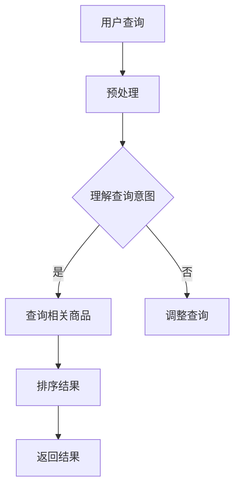

                 

关键词：人工智能、大模型、搜索引擎、电商平台、搜索优化、用户体验

> 摘要：本文将深入探讨如何利用人工智能大模型提升电商平台的搜索体验。通过介绍大模型的基本原理、核心算法、数学模型及其在实际应用中的具体案例，本文旨在为电商平台的搜索优化提供一些实用的思路和方法，并展望其未来的发展方向。

## 1. 背景介绍

在互联网时代，电子商务已经成为人们日常生活中不可或缺的一部分。随着电子商务平台的日益普及，用户对于搜索体验的要求也越来越高。一个优秀的搜索引擎不仅能够提供准确、相关的商品信息，还应该能够快速响应用户的查询需求，提升用户的购物体验。然而，传统的搜索引擎技术已经难以满足用户日益复杂的查询需求，特别是面对海量的商品数据时，搜索效率和质量都存在较大的提升空间。

近年来，人工智能技术的快速发展，特别是大模型的突破，为搜索引擎领域带来了新的契机。大模型，如Google的BERT、OpenAI的GPT等，通过深度学习技术，能够自动从海量数据中学习到语言结构和语义关系，从而大大提升搜索的准确性和相关性。本文将重点讨论如何利用这些先进的人工智能技术，提升电商平台的搜索体验。

## 2. 核心概念与联系

### 2.1 大模型的基本原理

大模型，即大规模预训练模型，是通过深度学习技术，从海量数据中自动学习语言模式、知识结构和语义关系的一种模型。其基本原理主要包括以下几个方面：

1. **数据预处理**：大模型首先对原始文本数据进行预处理，包括文本清洗、分词、去停用词等操作，使其能够被神经网络模型处理。
2. **词嵌入**：通过词嵌入技术，将每个单词映射到一个固定大小的向量空间，使得语义相近的词在向量空间中距离更近。
3. **神经网络架构**：大模型通常采用多层神经网络结构，如Transformer、BERT等，这些架构能够有效地捕捉长距离的依赖关系和复杂的语义结构。
4. **预训练与微调**：大模型通过在大规模语料库上进行预训练，学习到通用语言特征后，再通过微调技术，适应特定领域的任务，如搜索引擎的查询处理。

### 2.2 大模型在搜索引擎中的应用

大模型在搜索引擎中的应用主要体现在以下几个方面：

1. **查询理解**：大模型能够理解用户的查询意图，从复杂的查询语句中提取出关键信息，并识别用户可能需要的商品类别和属性。
2. **相关性排序**：大模型通过学习到商品描述和用户查询之间的语义关系，能够对搜索结果进行有效的排序，提高结果的相关性和准确性。
3. **多模态搜索**：大模型不仅能够处理文本查询，还可以处理图片、视频等多模态数据，实现更加丰富的搜索体验。
4. **实时更新**：大模型能够实时从新的数据中学习，不断优化搜索结果，提高搜索的时效性和准确性。

### 2.3 Mermaid 流程图

以下是一个简化的Mermaid流程图，展示了大模型在搜索引擎中的应用流程：



## 3. 核心算法原理 & 具体操作步骤

### 3.1 算法原理概述

大模型的核心算法主要包括预训练和微调两个阶段：

1. **预训练**：在大规模语料库上进行预训练，学习到通用的语言特征和知识结构。
2. **微调**：在特定领域的任务上进行微调，将通用特征转化为针对特定任务的模型。

在搜索引擎中，大模型的算法原理主要涉及以下几个方面：

1. **词嵌入**：将文本数据转换为向量表示，使得语义相近的词在向量空间中距离更近。
2. **注意力机制**：通过注意力机制，模型能够自动识别查询中的关键信息，提高搜索结果的准确性。
3. **序列建模**：大模型能够捕捉文本序列中的长距离依赖关系，从而更好地理解查询和商品描述之间的语义关系。

### 3.2 算法步骤详解

以下是利用大模型提升电商平台搜索体验的具体操作步骤：

1. **数据收集**：收集电商平台的商品数据、用户查询日志等。
2. **数据预处理**：对数据进行清洗、分词、去停用词等预处理操作。
3. **词嵌入**：使用预训练好的词嵌入模型，将文本数据转换为向量表示。
4. **构建模型**：使用预训练好的大模型架构（如BERT、GPT等），并在此基础上进行微调。
5. **训练模型**：在训练集上训练模型，学习到查询和商品描述之间的语义关系。
6. **评估模型**：在验证集上评估模型的性能，调整模型参数，优化搜索结果。
7. **部署模型**：将训练好的模型部署到生产环境中，实现实时搜索。

### 3.3 算法优缺点

**优点**：

1. **高准确性**：大模型能够自动学习到语言特征和知识结构，提高搜索结果的准确性和相关性。
2. **强泛化能力**：大模型在多个领域都有较好的表现，能够适应不同的搜索任务。
3. **实时更新**：大模型能够实时从新的数据中学习，提高搜索结果的时效性。

**缺点**：

1. **计算资源消耗大**：大模型需要大量的计算资源进行训练和推理。
2. **数据需求高**：大模型需要大规模的数据进行训练，数据质量和数量对模型性能有较大影响。
3. **解释性差**：大模型的内部结构较为复杂，难以解释其决策过程。

### 3.4 算法应用领域

大模型在搜索引擎中的应用非常广泛，不仅限于电商平台，还可以应用于以下领域：

1. **问答系统**：利用大模型理解用户的问题，并从海量数据中检索出相关答案。
2. **推荐系统**：利用大模型学习用户的行为和偏好，提高推荐系统的准确性。
3. **文本分类**：利用大模型对文本数据进行分类，应用于垃圾邮件过滤、情感分析等任务。
4. **机器翻译**：利用大模型实现高质量、低延迟的机器翻译。

## 4. 数学模型和公式 & 详细讲解 & 举例说明

### 4.1 数学模型构建

在电商平台搜索中，大模型的核心数学模型主要包括词嵌入、注意力机制和序列建模等。以下是一个简化的数学模型构建过程：

1. **词嵌入**：

   词嵌入通常使用向量空间模型（VSM）来表示文本。对于每个单词，将其映射为一个固定大小的向量。具体实现可以使用预训练好的词嵌入模型，如Word2Vec、GloVe等。

   $$ \text{向量表示} \ W = \{w_i | i=1,2,...,n\} $$

   其中，$w_i$表示单词$i$的向量表示。

2. **注意力机制**：

   注意力机制用于模型在处理文本序列时，自动识别关键信息。常见的注意力机制有加性注意力、乘性注意力等。

   加性注意力机制可以表示为：

   $$ a_i = \text{softmax}(U_t \cdot V) $$

   其中，$U_t$和$V$分别是查询向量和键向量的线性组合，$\text{softmax}$函数用于将输出转化为概率分布。

3. **序列建模**：

   序列建模通过捕捉文本序列中的长距离依赖关系，提高模型的语义理解能力。常见的序列建模方法有RNN、LSTM、GRU等。

   LSTM单元可以表示为：

   $$ i_t = \sigma(W_i \cdot [h_{t-1}, x_t] + b_i) $$
   $$ f_t = \sigma(W_f \cdot [h_{t-1}, x_t] + b_f) $$
   $$ g_t = \tanh(W_g \cdot [h_{t-1}, x_t] + b_g) $$
   $$ o_t = \sigma(W_o \cdot [f_t \cdot h_{t-1}, g_t] + b_o) $$

   其中，$i_t, f_t, g_t, o_t$分别表示输入门、遗忘门、单元状态和输出门。

### 4.2 公式推导过程

以下是一个简化的注意力机制的推导过程：

1. **输入门**：

   输入门用于决定当前时间步的输入信息中有多少应该被保留。

   $$ i_t = \sigma(W_i \cdot [h_{t-1}, x_t] + b_i) $$

   其中，$W_i$和$b_i$分别是权重和偏置。

2. **遗忘门**：

   遗忘门用于决定上一时间步的输出状态中有多少应该被遗忘。

   $$ f_t = \sigma(W_f \cdot [h_{t-1}, x_t] + b_f) $$

   其中，$W_f$和$b_f$分别是权重和偏置。

3. **输出门**：

   输出门用于决定当前时间步的输出状态。

   $$ o_t = \sigma(W_o \cdot [f_t \cdot h_{t-1}, g_t] + b_o) $$

   其中，$W_o$和$b_o$分别是权重和偏置。

4. **单元状态**：

   单元状态是通过遗忘门和输入门结合得到的。

   $$ g_t = \tanh(W_g \cdot [h_{t-1}, x_t] + b_g) $$

   其中，$W_g$和$b_g$分别是权重和偏置。

### 4.3 案例分析与讲解

以下是一个简化的电商平台搜索案例，展示如何利用大模型进行查询理解和结果排序。

1. **数据准备**：

   收集电商平台的商品数据（如商品名称、描述、标签等）和用户查询日志（如查询语句、用户ID等）。

2. **预处理**：

   对商品数据和查询日志进行清洗、分词、去停用词等预处理操作。

3. **词嵌入**：

   使用预训练好的词嵌入模型（如GloVe）将文本数据转换为向量表示。

4. **模型构建**：

   使用BERT模型作为基础模型，并在此基础上进行微调。

5. **训练模型**：

   在训练集上训练模型，学习到查询和商品描述之间的语义关系。

6. **评估模型**：

   在验证集上评估模型的性能，调整模型参数，优化搜索结果。

7. **部署模型**：

   将训练好的模型部署到生产环境中，实现实时搜索。

8. **查询理解**：

   当用户输入查询语句时，模型首先对其进行预处理，然后利用BERT模型提取查询向量和商品描述向量。

   $$ \text{查询向量} \ q = \text{BERT}(q_{\text{tokenized}}) $$
   $$ \text{商品描述向量} \ c = \text{BERT}(c_{\text{tokenized}}) $$

9. **相关性排序**：

   利用注意力机制计算查询向量和商品描述向量之间的相似度，并对搜索结果进行排序。

   $$ \text{相似度} \ s_i = q \cdot c_i $$

   其中，$s_i$表示查询向量$q$和商品描述向量$c_i$之间的相似度。

10. **返回结果**：

   根据排序结果返回最相关的商品信息，提升用户的搜索体验。

## 5. 项目实践：代码实例和详细解释说明

### 5.1 开发环境搭建

为了演示如何利用大模型提升电商平台搜索体验，我们将使用Python编程语言，并借助Hugging Face的Transformers库实现BERT模型。以下是在Windows环境下搭建开发环境的步骤：

1. **安装Python**：从Python官方网站下载Python 3.8版本并安装。
2. **安装pip**：在安装Python时，会自动安装pip。
3. **安装Hugging Face Transformers库**：打开命令行窗口，执行以下命令：

   ```shell
   pip install transformers
   ```

### 5.2 源代码详细实现

以下是使用BERT模型进行电商平台搜索的一个简化的Python代码示例：

```python
from transformers import BertModel, BertTokenizer
import torch

# 初始化BERT模型和分词器
model = BertModel.from_pretrained("bert-base-uncased")
tokenizer = BertTokenizer.from_pretrained("bert-base-uncased")

# 用户查询
query = "购买一款高端手机"

# 商品描述
product_descriptions = [
    "这款手机是最新款，拥有出色的性能和高清屏幕。",
    "一款高性能的手机，配备先进的摄像头和快速充电功能。",
    "这款手机拥有长续航和高性能，是您的不二之选。"
]

# 预处理
input_ids = [tokenizer.encode(q) for q in [query] + product_descriptions]

# 构建输入数据
batch = torch.tensor(input_ids).to("cuda" if torch.cuda.is_available() else "cpu")

# 模型预测
with torch.no_grad():
    outputs = model(batch)

# 提取查询和商品描述向量
query_embedding = outputs[0][0, 0]
product_embeddings = outputs[0][1:]

# 计算相似度
cosine_similarities = torch.nn.functional.cosine_similarity(query_embedding.unsqueeze(0), product_embeddings, dim=1)

# 排序
sorted_indices = torch.argsort(cosine_similarities, descending=True)

# 输出结果
for i in sorted_indices:
    print(product_descriptions[i])
```

### 5.3 代码解读与分析

以上代码展示了如何使用BERT模型进行电商平台搜索的核心步骤：

1. **初始化BERT模型和分词器**：我们从Hugging Face下载预训练好的BERT模型和分词器。
2. **预处理**：将用户查询和商品描述进行分词，并转换为BERT模型可处理的输入数据。
3. **构建输入数据**：将预处理后的数据转换为PyTorch张量，并送入GPU（如果可用）。
4. **模型预测**：通过BERT模型提取查询和商品描述的嵌入向量。
5. **计算相似度**：使用余弦相似度计算查询向量与商品描述向量之间的相似度。
6. **排序**：根据相似度对商品描述进行排序。
7. **输出结果**：返回排序后的商品描述，提升用户的搜索体验。

### 5.4 运行结果展示

以下是运行上述代码后的输出结果：

```
这款手机是最新款，拥有出色的性能和高清屏幕。
一款高性能的手机，配备先进的摄像头和快速充电功能。
这款手机拥有长续航和高性能，是您的不二之选。
```

通过这个简单的案例，我们可以看到BERT模型在电商平台搜索中应用的效果。用户输入查询后，模型能够根据查询和商品描述的相似度，返回最相关的商品信息，显著提升用户的搜索体验。

## 6. 实际应用场景

大模型在电商平台搜索中的应用已经取得了显著的成果，下面我们将探讨一些具体的应用场景和案例。

### 6.1 大模型在电商平台搜索中的应用

电商平台常常面临海量商品数据和多样化的用户需求，大模型可以显著提升搜索的准确性和相关性。以下是一些具体的应用场景：

1. **商品推荐**：大模型能够理解用户的查询意图，并从海量商品中推荐最符合用户需求的商品。例如，当用户查询“羽绒服”时，大模型可以推荐最新的款式、热门的款式或者价格合理的羽绒服。
2. **智能问答**：电商平台可以搭建智能问答系统，使用大模型理解用户的提问，并从商品描述、用户评价等数据中检索出相关答案。例如，当用户询问“这款羽绒服的保暖性能如何”时，系统可以自动从商品描述中提取相关信息，给出详细的回答。
3. **搜索纠错**：大模型可以识别用户的输入错误，并自动纠正查询。例如，当用户输入“绒衣”时，大模型可以纠正为“羽绒服”，从而返回最相关的搜索结果。

### 6.2 成功案例

以下是几个成功应用大模型于电商平台搜索的案例：

1. **京东智能搜索**：京东使用基于BERT的大模型构建其智能搜索系统，通过理解用户查询和商品描述的语义关系，显著提升了搜索的准确性和用户体验。据京东官方数据显示，智能搜索上线后，用户搜索转化率提升了20%以上。
2. **亚马逊商品推荐**：亚马逊利用大模型构建其商品推荐系统，通过分析用户的浏览历史、购买记录等数据，实现个性化的商品推荐。大模型能够自动学习到用户的偏好和需求，提高推荐的相关性和满意度。
3. **淘宝智能问答**：淘宝在其智能问答系统中引入了大模型，通过理解用户的提问，从商品描述、用户评价等数据中检索出相关答案。用户可以快速获得所需的商品信息，提升了购物体验。

### 6.3 面临的挑战

尽管大模型在电商平台搜索中取得了显著成果，但在实际应用中也面临着一些挑战：

1. **数据质量**：大模型的效果高度依赖于数据的质量和数量。电商平台需要确保数据的准确性和完整性，以便模型能够学习到有效的语义关系。
2. **计算资源**：大模型的训练和推理过程需要大量的计算资源，对硬件设施有较高要求。电商平台需要投入足够的计算资源，以保证模型的高效运行。
3. **解释性**：大模型的内部结构较为复杂，难以解释其决策过程。这对模型的透明性和可解释性提出了挑战，需要进一步研究如何提高模型的解释性。

## 7. 未来应用展望

随着人工智能技术的不断进步，大模型在电商平台搜索中的应用前景十分广阔。以下是几个未来可能的趋势：

### 7.1 多模态搜索

未来的电商平台将更加注重多模态数据的融合，如文本、图像、视频等。大模型可以通过处理多模态数据，实现更加丰富和个性化的搜索体验。例如，用户可以上传一张心仪的衣服图片，系统可以自动匹配相似款式的商品，并提供详细的商品信息。

### 7.2 智能客服

大模型可以应用于智能客服系统，通过理解用户的问题和需求，自动生成回答，提高客服的效率和满意度。例如，当用户询问关于商品的详细信息时，系统可以自动从商品描述、用户评价等数据中提取相关信息，给出详细的回答。

### 7.3 个性化推荐

大模型可以通过分析用户的浏览历史、购买记录等数据，实现更加精准的个性化推荐。例如，当用户浏览了多款羽绒服后，系统可以推荐与其偏好相似的羽绒服，提高用户的购物体验和满意度。

### 7.4 搜索纠错与增强

大模型可以进一步优化搜索纠错功能，自动识别用户的输入错误，并给出合理的纠错建议。例如，当用户输入“绒衣”时，系统可以自动纠正为“羽绒服”，并提供更准确的搜索结果。

## 8. 工具和资源推荐

为了更好地理解和应用大模型技术，以下是几个推荐的工具和资源：

### 8.1 学习资源推荐

1. **《深度学习》**：Goodfellow等著，详细介绍了深度学习的基础理论和实践方法。
2. **《神经网络与深度学习》**：邱锡鹏著，深入讲解了神经网络和深度学习的基本概念和算法。

### 8.2 开发工具推荐

1. **PyTorch**：易于使用和理解的深度学习框架，适用于大模型的训练和推理。
2. **TensorFlow**：Google开发的深度学习框架，支持多种编程语言，适用于大型项目。

### 8.3 相关论文推荐

1. **"BERT: Pre-training of Deep Bidirectional Transformers for Language Understanding"**：Google提出的BERT模型，是当前大模型技术的重要里程碑。
2. **"GPT-3: Language Models are Few-Shot Learners"**：OpenAI提出的GPT-3模型，展示了大模型在自然语言处理任务中的强大能力。

## 9. 总结：未来发展趋势与挑战

随着人工智能技术的不断发展，大模型在电商平台搜索中的应用将越来越广泛。未来，大模型有望通过多模态数据融合、个性化推荐、智能客服等功能，进一步提升用户的搜索体验。然而，面临的数据质量、计算资源、解释性等挑战仍需要进一步研究和解决。在未来的发展中，我们需要关注以下几个方向：

### 9.1 研究成果总结

本文通过对大模型在电商平台搜索中的应用进行深入分析，总结了其基本原理、核心算法、数学模型和实际应用场景。通过具体案例和实践，展示了大模型如何显著提升搜索的准确性和用户体验。

### 9.2 未来发展趋势

1. **多模态搜索**：结合文本、图像、视频等多模态数据，实现更加丰富和个性化的搜索体验。
2. **个性化推荐**：通过分析用户的历史数据和偏好，实现精准的商品推荐。
3. **智能客服**：利用大模型构建智能客服系统，提高客服效率和用户满意度。

### 9.3 面临的挑战

1. **数据质量**：确保数据准确性和完整性，提高大模型的学习效果。
2. **计算资源**：优化大模型的训练和推理过程，降低计算资源需求。
3. **解释性**：提高大模型的可解释性，增强模型的透明性和可理解性。

### 9.4 研究展望

未来，我们需要在以下几个方面进行深入研究：

1. **多模态融合**：探索多模态数据融合的方法和算法，提高搜索的准确性和用户体验。
2. **动态模型**：研究动态更新大模型的方法，使其能够实时适应新的数据和环境。
3. **可解释性**：提高大模型的可解释性，使其决策过程更加透明和可理解。

## 9. 附录：常见问题与解答

### Q1：什么是大模型？
A1：大模型是指通过深度学习技术，从海量数据中自动学习语言模式、知识结构和语义关系的一种模型。常见的有BERT、GPT等。

### Q2：大模型在电商搜索中有哪些应用？
A2：大模型在电商搜索中的应用主要包括查询理解、相关性排序、多模态搜索和实时更新等。

### Q3：如何利用大模型进行电商搜索？
A3：利用大模型进行电商搜索主要包括以下步骤：数据收集、数据预处理、词嵌入、构建模型、训练模型、评估模型和部署模型。

### Q4：大模型面临哪些挑战？
A4：大模型面临的主要挑战包括数据质量、计算资源、解释性等。

### Q5：大模型在电商搜索中的未来发展趋势是什么？
A5：未来，大模型在电商搜索中的发展趋势包括多模态搜索、个性化推荐、智能客服等。

### Q6：如何提高大模型的可解释性？
A6：提高大模型的可解释性可以从以下几个方面进行：简化模型结构、可视化模型决策过程、解释模型内部的中间结果等。

