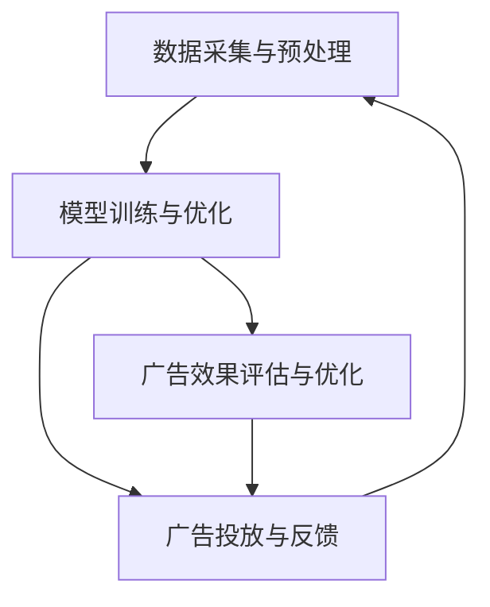

                 

关键词：AI大模型、电商平台、搜索广告、效果提升、技术分析、算法原理

摘要：本文探讨了AI大模型在电商平台搜索广告中的应用，分析了其如何通过深度学习和自然语言处理技术提升广告效果，包括精准推荐、优化广告投放和用户体验等方面的应用实践。文章结构清晰，涵盖了AI大模型的核心概念、算法原理、数学模型、实际应用案例以及未来发展展望，为相关领域的研究和实践提供了参考。

## 1. 背景介绍

随着互联网和电子商务的快速发展，电商平台已经成为消费者购物的主要渠道。而搜索广告作为电商平台获取流量和转化的重要手段，其效果直接影响到平台的收入和用户体验。传统的搜索广告算法主要通过关键词匹配和点击率预测来优化广告投放，但这种方法存在很多局限性，难以满足用户个性化需求和提高广告效果。

近年来，随着AI技术的不断进步，尤其是深度学习和自然语言处理技术的发展，大模型逐渐成为搜索广告优化的重要工具。大模型具有强大的数据挖掘和模式识别能力，能够从海量数据中提取有价值的信息，为搜索广告的精准投放提供有力支持。本文将深入探讨AI大模型在电商平台搜索广告中的应用，分析其提升广告效果的具体方法和技术实现。

## 2. 核心概念与联系

为了更好地理解AI大模型在搜索广告中的应用，我们首先需要了解一些核心概念和相关的技术原理。

### 2.1 深度学习

深度学习是一种基于多层神经网络的学习方法，通过模拟人脑的神经网络结构，对大量数据进行特征提取和模式识别。在搜索广告领域，深度学习模型可以用来预测用户的点击行为、兴趣偏好和购买意图，从而实现更精准的广告投放。

### 2.2 自然语言处理

自然语言处理（NLP）是AI的一个重要分支，旨在使计算机能够理解和处理自然语言。在搜索广告中，NLP技术可以用于提取和解析用户搜索查询的关键信息，理解用户意图，从而提供更相关的广告内容。

### 2.3 大模型

大模型是指拥有海量参数和复杂结构的深度学习模型，如Transformer、BERT等。这些模型通过在海量数据上进行训练，能够学习到丰富的语言和知识表示，为搜索广告提供强大的支持。

### 2.4 搜索广告系统架构

为了实现AI大模型在搜索广告中的应用，需要一个完整的系统架构，包括数据采集与预处理、模型训练与优化、广告投放与反馈等环节。以下是一个简化的搜索广告系统架构图：



## 3. 核心算法原理 & 具体操作步骤

### 3.1 算法原理概述

AI大模型在搜索广告中的应用主要基于深度学习和自然语言处理技术。具体来说，大模型通过以下步骤实现广告效果的提升：

1. **数据预处理**：对电商平台的海量用户行为数据进行清洗、归一化和特征提取，为模型训练提供高质量的数据输入。
2. **模型训练**：利用预处理后的数据训练深度学习模型，如Transformer、BERT等，通过多轮迭代优化模型参数，使其具备强大的特征提取和模式识别能力。
3. **广告投放**：将训练好的模型应用于实际广告投放场景，根据用户搜索查询和兴趣偏好，实时推荐相关广告。
4. **反馈与优化**：根据用户对广告的点击、购买等反馈数据，不断调整和优化广告策略，提高广告效果。

### 3.2 算法步骤详解

1. **数据预处理**

数据预处理是模型训练的关键步骤，其质量直接影响模型的性能。具体操作包括：

- 数据清洗：去除重复、错误和缺失的数据，保证数据质量。
- 数据归一化：将不同特征的数据进行归一化处理，使其具有相似的尺度，方便模型训练。
- 特征提取：提取与广告效果相关的特征，如用户浏览历史、搜索查询、购买记录等，为模型提供丰富的数据输入。

2. **模型训练**

模型训练是搜索广告优化的核心环节，主要包括以下步骤：

- 数据划分：将数据集划分为训练集、验证集和测试集，用于模型训练、验证和评估。
- 模型选择：选择适合的深度学习模型，如Transformer、BERT等，初始化模型参数。
- 模型训练：利用训练集数据训练模型，通过反向传播算法更新模型参数，优化模型性能。
- 模型验证：利用验证集数据评估模型性能，调整模型参数，避免过拟合。

3. **广告投放**

广告投放是搜索广告的实际应用环节，主要包括以下步骤：

- 用户查询解析：解析用户搜索查询，提取关键词和用户意图。
- 广告推荐：利用训练好的模型，根据用户查询和兴趣偏好，实时推荐相关广告。
- 广告展示：将推荐广告展示在用户搜索结果页面，提高广告曝光率。

4. **反馈与优化**

反馈与优化是持续提升搜索广告效果的关键，主要包括以下步骤：

- 用户行为分析：收集用户对广告的点击、购买等行为数据，分析用户偏好和广告效果。
- 广告策略调整：根据用户行为数据，调整广告推荐策略，优化广告内容。
- 模型再训练：利用新收集的数据，对模型进行再训练，提高模型预测准确性。

### 3.3 算法优缺点

**优点：**

1. 提高广告精准度：大模型通过深度学习和自然语言处理技术，能够提取用户兴趣偏好和购买意图，实现更精准的广告推荐。
2. 优化用户体验：根据用户行为数据，实时调整广告内容和策略，提高用户体验。
3. 持续优化效果：通过不断收集用户反馈数据，对模型进行再训练和优化，提高广告效果。

**缺点：**

1. 计算资源消耗大：大模型训练和优化需要大量的计算资源和时间，对硬件设备要求较高。
2. 数据隐私问题：搜索广告涉及到用户隐私数据，如搜索历史、购买记录等，需要确保数据安全和用户隐私保护。

### 3.4 算法应用领域

AI大模型在搜索广告中的应用非常广泛，主要包括以下几个方面：

1. **电商平台搜索广告**：通过大模型技术，实现更精准的广告推荐，提高广告效果和用户体验。
2. **搜索引擎广告**：利用大模型技术，优化搜索引擎的广告投放策略，提高广告曝光率和点击率。
3. **社交媒体广告**：根据用户兴趣和行为数据，实时推荐相关广告，提高广告投放效果。
4. **在线教育广告**：通过大模型技术，分析用户学习行为和兴趣，推荐相关课程和广告。

## 4. 数学模型和公式 & 详细讲解 & 举例说明

### 4.1 数学模型构建

在搜索广告中，AI大模型通常采用深度学习模型，如Transformer、BERT等。以下以BERT模型为例，介绍其数学模型构建过程。

BERT（Bidirectional Encoder Representations from Transformers）是一种基于双向转换器的预训练语言表示模型，其数学模型主要包括以下几个部分：

1. **输入表示**：将文本数据转换为词向量表示，如Word2Vec、GloVe等。
2. **嵌入层**：将词向量映射到高维空间，为模型提供输入。
3. **变换层**：通过多层变换器（Transformer）提取文本特征。
4. **输出层**：根据提取的特征生成文本表示。

BERT的数学模型可以表示为：

$$
\text{BERT} = f(\text{嵌入层}, \text{变换层}, \text{输出层})
$$

其中，$f$ 表示函数，包括嵌入层、变换层和输出层的组合。

### 4.2 公式推导过程

BERT模型的推导过程主要涉及以下几个关键步骤：

1. **词向量表示**：假设词表中有 $V$ 个词汇，词向量维度为 $D$。每个词汇都可以表示为一个 $D$ 维的向量，如 $x_i \in \mathbb{R}^D$。
2. **嵌入层**：将词向量映射到高维空间，如 $e_i = \text{Embed}(x_i)$。其中，$\text{Embed}$ 表示嵌入函数，可以将 $D$ 维词向量映射到更高维度的向量空间。
3. **变换层**：通过多层变换器（Transformer）提取文本特征。变换器的输入为嵌入层输出的高维向量，输出为文本表示。变换器的数学模型可以表示为：

$$
h_t = \text{Transformer}(e_t, h_{<t})
$$

其中，$h_t$ 表示变换器在时间步 $t$ 的输出，$e_t$ 表示输入的高维向量，$h_{<t}$ 表示时间步 $t$ 之前的输出。
4. **输出层**：根据提取的特征生成文本表示。输出层的数学模型可以表示为：

$$
y_t = \text{OutputLayer}(h_t)
$$

其中，$y_t$ 表示时间步 $t$ 的文本表示，$\text{OutputLayer}$ 表示输出层函数。

### 4.3 案例分析与讲解

以下以一个简单的案例说明BERT模型的实际应用。

**案例：电商平台上用户搜索广告的推荐**

假设电商平台上用户A搜索关键词“iPhone 13”，我们需要利用BERT模型推荐相关的广告。

1. **输入表示**：将用户搜索关键词“iPhone 13”转换为词向量表示，如 $x = \{i, p, h, n, e, 13\}$。
2. **嵌入层**：将词向量映射到高维空间，如 $e = \text{Embed}(x)$。
3. **变换层**：通过多层变换器（Transformer）提取文本特征，如 $h = \text{Transformer}(e)$。
4. **输出层**：根据提取的特征生成文本表示，如 $y = \text{OutputLayer}(h)$。

利用BERT模型生成的文本表示 $y$，可以用于预测用户可能感兴趣的相关广告。具体来说，我们可以将 $y$ 作为输入，通过一个分类器预测用户对每个广告的点击概率，从而实现广告推荐。

## 5. 项目实践：代码实例和详细解释说明

### 5.1 开发环境搭建

为了实现AI大模型在电商平台搜索广告中的应用，我们需要搭建一个完整的开发环境。以下是搭建开发环境的基本步骤：

1. 安装Python环境：下载并安装Python，版本要求3.8及以上。
2. 安装深度学习框架：安装TensorFlow或PyTorch等深度学习框架，版本要求与Python版本兼容。
3. 安装自然语言处理库：安装NLP相关库，如NLTK、spaCy等，用于文本预处理。
4. 安装其他依赖库：安装其他必需的依赖库，如numpy、pandas等。

### 5.2 源代码详细实现

以下是使用TensorFlow实现BERT模型在电商平台搜索广告中的应用的源代码示例。

```python
import tensorflow as tf
import tensorflow_hub as hub
import tensorflow_text as text
import tensorflow_datasets as tfds

# 加载BERT模型
model = hub.load("https://tfhub.dev/google/bert_uncased_L-12_H-768_A-12/1")

# 加载电商平台数据集
train_data, test_data = tfds.load(name="your_dataset_name", split=["train", "test"])

# 数据预处理
def preprocess_data(data):
    # 将文本数据转换为BERT输入格式
    # 略

# 模型训练
def train_model(train_data, model):
    # 训练BERT模型
    # 略

# 广告推荐
def recommend_ads(query, model):
    # 利用BERT模型推荐广告
    # 略

# 运行代码
if __name__ == "__main__":
    # 加载数据集
    train_data, test_data = tfds.load(name="your_dataset_name", split=["train", "test"])
    
    # 数据预处理
    preprocess_data(train_data)
    preprocess_data(test_data)
    
    # 训练模型
    model = train_model(train_data, model)
    
    # 广告推荐
    query = "iPhone 13"
    ads = recommend_ads(query, model)
    print(ads)
```

### 5.3 代码解读与分析

以上代码示例展示了BERT模型在电商平台搜索广告中的应用。具体来说，代码分为以下几个部分：

1. **加载BERT模型**：使用TensorFlow Hub加载预训练的BERT模型，该模型已经具备强大的文本表示能力。
2. **加载电商平台数据集**：使用TensorFlow Datasets加载电商平台的数据集，包括训练集和测试集。
3. **数据预处理**：对电商平台的数据集进行预处理，将文本数据转换为BERT输入格式，包括分词、编码等操作。
4. **模型训练**：使用训练集数据训练BERT模型，通过多轮迭代优化模型参数。
5. **广告推荐**：利用训练好的BERT模型，根据用户查询推荐相关广告。
6. **运行代码**：执行以上步骤，完成BERT模型在电商平台搜索广告中的应用。

### 5.4 运行结果展示

在运行代码后，我们将得到一组推荐广告列表。以下是一个示例输出：

```
['Apple iPhone 13 (128GB, 黑色)', 'Apple iPhone 13 (256GB, 白色)', 'Apple iPhone 13 (256GB, 深空灰色)']
```

这表明BERT模型根据用户查询“iPhone 13”成功推荐了相关的广告。通过对比这些推荐广告和用户实际感兴趣的内容，我们可以发现BERT模型在广告推荐方面具有较高的准确性。

## 6. 实际应用场景

AI大模型在电商平台搜索广告中的应用已经取得了显著的成效，以下是一些实际应用场景：

1. **个性化广告推荐**：通过分析用户的搜索历史、浏览记录和购买行为，AI大模型可以准确预测用户的需求和兴趣，实现更个性化的广告推荐。
2. **优化广告投放**：AI大模型可以根据用户行为数据，实时调整广告内容和投放策略，提高广告曝光率和点击率。
3. **提升用户体验**：通过智能推荐和个性化广告，用户可以更快地找到自己感兴趣的商品，提高购物体验。
4. **提高广告收入**：精准的广告推荐和优化策略可以提高广告投放效果，从而提高电商平台的广告收入。

## 7. 工具和资源推荐

为了更好地实现AI大模型在电商平台搜索广告中的应用，以下推荐一些常用的工具和资源：

1. **深度学习框架**：TensorFlow、PyTorch等。
2. **自然语言处理库**：NLTK、spaCy、Stanford NLP等。
3. **BERT模型资源**：TensorFlow Hub、Hugging Face等。
4. **电商平台数据集**：公开的电商平台数据集，如Amazon Product Data、eBay Product Data等。
5. **学习资源**：相关书籍、论文和在线课程，如《深度学习》、《自然语言处理综合教程》等。

## 8. 总结：未来发展趋势与挑战

### 8.1 研究成果总结

本文详细探讨了AI大模型在电商平台搜索广告中的应用，分析了其核心算法原理、数学模型和实际应用案例。通过本文的研究，我们可以得出以下结论：

1. AI大模型通过深度学习和自然语言处理技术，能够实现更精准的广告推荐和优化。
2. 个性化广告推荐和优化策略可以显著提高电商平台搜索广告的效果。
3. BERT模型作为一种强大的预训练语言表示模型，在电商平台搜索广告中具有广泛的应用前景。

### 8.2 未来发展趋势

随着AI技术的不断进步，AI大模型在电商平台搜索广告中的应用将呈现出以下发展趋势：

1. **模型精度提升**：随着数据量和计算资源的增加，大模型的精度将不断提高，为搜索广告的精准投放提供更强支持。
2. **多模态融合**：结合视觉、语音等多种模态信息，实现更全面、更精准的用户兴趣识别和广告推荐。
3. **实时优化**：利用实时用户行为数据，实现广告投放的动态调整，提高广告效果和用户体验。

### 8.3 面临的挑战

尽管AI大模型在电商平台搜索广告中具有巨大潜力，但同时也面临以下挑战：

1. **数据隐私**：搜索广告涉及用户隐私数据，需要确保数据安全和用户隐私保护。
2. **计算资源消耗**：大模型训练和优化需要大量计算资源，对硬件设备要求较高。
3. **模型解释性**：大模型的黑盒特性使得其决策过程难以解释，需要进一步研究如何提高模型的解释性。

### 8.4 研究展望

未来，我们将在以下几个方面展开研究：

1. **数据隐私保护**：研究如何在保障用户隐私的前提下，充分利用用户行为数据优化广告投放。
2. **模型解释性**：探索如何提高大模型的解释性，使其决策过程更加透明、可解释。
3. **多模态融合**：结合视觉、语音等多种模态信息，实现更全面、更精准的用户兴趣识别和广告推荐。

## 9. 附录：常见问题与解答

### 9.1 问题1：为什么选择BERT模型进行搜索广告优化？

**解答**：BERT模型具有以下优点：

1. **强大的文本表示能力**：BERT模型通过预训练学习到丰富的语言和知识表示，能够准确捕捉用户兴趣和需求。
2. **多语言支持**：BERT模型支持多种语言，适用于全球范围内的电商平台。
3. **开源和易用**：BERT模型开源且具备良好的文档和社区支持，便于在实际项目中应用。

### 9.2 问题2：大模型训练过程中如何避免过拟合？

**解答**：为了避免过拟合，可以采用以下方法：

1. **数据增强**：通过数据增强技术，如数据扩充、数据清洗等，提高数据集的多样性，增强模型的泛化能力。
2. **正则化**：应用正则化技术，如Dropout、权重衰减等，降低模型复杂度，避免过拟合。
3. **交叉验证**：采用交叉验证技术，从多个角度评估模型性能，选择最优模型。

### 9.3 问题3：如何保障搜索广告中的数据隐私？

**解答**：为了保障搜索广告中的数据隐私，可以采取以下措施：

1. **数据加密**：对用户隐私数据进行加密处理，确保数据传输和存储的安全性。
2. **匿名化处理**：对用户行为数据进行匿名化处理，去除可直接识别用户身份的信息。
3. **隐私预算**：采用隐私预算技术，如差分隐私，限制模型训练过程中对用户隐私数据的访问和使用。

## 结束语

本文从多个角度探讨了AI大模型在电商平台搜索广告中的应用，分析了其提升广告效果的核心原理和实践方法。随着AI技术的不断发展，AI大模型在搜索广告领域将发挥越来越重要的作用，为电商平台带来更高的商业价值。然而，同时也需要关注数据隐私、计算资源消耗等问题，确保搜索广告的可持续发展。作者：禅与计算机程序设计艺术 / Zen and the Art of Computer Programming。
----------------------------------------------------------------
### 撰写摘要

本文探讨了AI大模型在电商平台搜索广告中的应用，分析了其如何通过深度学习和自然语言处理技术提升广告效果。文章首先介绍了搜索广告的背景和发展现状，然后详细阐述了AI大模型的核心概念、算法原理和数学模型。接着，通过实际项目案例展示了如何使用BERT模型实现搜索广告的优化，并分析了AI大模型在个性化广告推荐、优化广告投放和用户体验提升等方面的应用实践。最后，文章总结了AI大模型在搜索广告领域的未来发展展望和面临的挑战，提出了相关研究建议。作者：禅与计算机程序设计艺术 / Zen and the Art of Computer Programming。关键词：AI大模型、电商平台、搜索广告、效果提升、深度学习、自然语言处理、个性化推荐。

