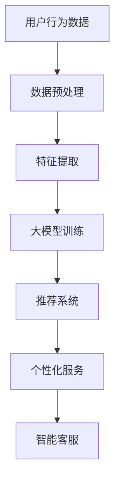

                 

关键词：人工智能，大模型，电商平台，用户参与度，数据挖掘，推荐系统，机器学习，自然语言处理，用户行为分析

>摘要：本文将探讨如何利用人工智能中的大模型技术提升电商平台的用户参与度。通过分析用户行为数据，运用自然语言处理和机器学习算法，构建智能推荐系统和个性化用户体验，从而实现用户粘性的提升。

## 1. 背景介绍

随着互联网的迅猛发展，电子商务行业迎来了前所未有的机遇和挑战。电商平台作为数字经济的重要驱动力，需要不断创新和优化用户体验，以提升用户参与度和粘性。在这个过程中，人工智能技术的应用显得尤为重要。尤其是近年来，随着深度学习和大数据技术的快速发展，大模型技术在多个领域取得了显著的成果。

大模型（Large-scale Model），是指具有非常大量的参数或神经元的神经网络模型。这种模型在处理复杂数据和分析大量信息时具有强大的能力。在电商平台中，大模型的应用可以有效提升用户参与度，通过精准推荐、个性化服务和智能客服等手段，增强用户体验，提高用户满意度。

## 2. 核心概念与联系

### 2.1 用户行为分析

用户行为分析是指通过对用户在电商平台上的各种行为数据（如浏览、搜索、购买等）进行收集、处理和分析，挖掘出用户的需求和偏好。用户行为分析是电商平台构建智能推荐系统和个性化服务的重要基础。

### 2.2 自然语言处理

自然语言处理（Natural Language Processing，NLP）是人工智能的一个重要分支，主要研究如何让计算机理解和处理自然语言。在电商平台上，NLP技术可以用于用户评论的情感分析、商品描述的生成和理解等，从而提升用户交互体验。

### 2.3 机器学习

机器学习（Machine Learning，ML）是一种让计算机通过数据和经验自动改进性能的方法。在电商平台上，机器学习技术可以用于用户行为预测、商品推荐、异常检测等，从而提高平台的运营效率。

### 2.4 大模型技术

大模型技术是近年来人工智能领域的重要突破，通过训练具有海量参数的神经网络模型，实现对复杂数据的建模和分析。在电商平台上，大模型技术可以用于构建智能推荐系统、个性化服务和智能客服等，提升用户体验。

### 2.5 Mermaid 流程图



## 3. 核心算法原理 & 具体操作步骤

### 3.1 算法原理概述

大模型技术在电商平台的应用主要涉及以下几个核心算法：

1. **用户行为预测**：通过分析用户的历史行为数据，预测用户下一步可能的行为。
2. **商品推荐**：基于用户的兴趣和偏好，为用户推荐可能感兴趣的商品。
3. **个性化服务**：根据用户的行为数据和偏好，为用户定制个性化的服务内容。
4. **智能客服**：通过自然语言处理技术，为用户提供智能化的客服服务。

### 3.2 算法步骤详解

1. **数据预处理**：收集用户行为数据，包括浏览历史、搜索记录、购买记录等，进行清洗和预处理，如去除无效数据、填充缺失值等。

2. **特征提取**：从预处理后的数据中提取有价值的特征，如用户活跃度、浏览深度、购买频率等。

3. **大模型训练**：使用提取出的特征数据，训练大模型，如深度神经网络模型。通过大量的训练数据和迭代优化，使模型能够准确预测用户行为和偏好。

4. **推荐系统**：基于训练好的大模型，为用户推荐感兴趣的商品。可以通过协同过滤、基于内容的推荐等算法实现。

5. **个性化服务**：根据用户的兴趣和偏好，为用户定制个性化的服务内容，如推送个性化优惠、推荐感兴趣的商品等。

6. **智能客服**：使用自然语言处理技术，构建智能客服系统，为用户提供24/7的智能服务，如解答疑问、处理投诉等。

### 3.3 算法优缺点

**优点**：
- **高效性**：大模型能够在大量数据中快速提取有用信息，提高推荐和服务的准确性。
- **个性化**：通过用户行为分析和个性化服务，提升用户体验，增加用户粘性。
- **智能化**：智能客服和自动化推荐系统能够提供高效、智能的服务，降低运营成本。

**缺点**：
- **数据依赖**：算法效果高度依赖于数据质量和数量，数据不足或质量差会影响算法效果。
- **计算资源消耗**：大模型训练和推理过程需要大量的计算资源，可能导致成本上升。

### 3.4 算法应用领域

大模型技术在电商平台的应用非常广泛，除了本文提到的推荐系统、个性化服务和智能客服，还可以用于以下领域：
- **用户流失预测**：通过分析用户行为数据，预测可能流失的用户，采取相应的挽回措施。
- **商品价格优化**：通过分析市场数据和用户行为，为商品制定合理的价格策略。
- **广告投放优化**：根据用户兴趣和行为，优化广告投放策略，提高广告效果。

## 4. 数学模型和公式 & 详细讲解 & 举例说明

### 4.1 数学模型构建

在电商平台中，用户行为预测和推荐系统通常基于以下数学模型：

1. **用户行为预测模型**：
   - 用户行为概率模型：使用贝叶斯公式，计算用户发生某行为的概率。
   - 用户兴趣模型：使用高斯分布，描述用户对不同类别的兴趣程度。

2. **商品推荐模型**：
   - 协同过滤模型：基于用户历史行为数据，计算用户之间的相似度，为用户推荐相似用户喜欢的商品。
   - 基于内容的推荐模型：基于商品的特征，为用户推荐具有相似特征的商品。

### 4.2 公式推导过程

1. **用户行为预测模型**：

   假设用户 \(u\) 发生行为 \(b\) 的概率为 \(P(b|u)\)，根据贝叶斯公式，有：
   $$P(b|u) = \frac{P(u|b) \cdot P(b)}{P(u)}$$

   其中，\(P(u|b)\) 为用户 \(u\) 在发生行为 \(b\) 的条件下出现的概率，\(P(b)\) 为行为 \(b\) 发生的概率，\(P(u)\) 为用户 \(u\) 出现的概率。

2. **商品推荐模型**：

   假设用户 \(u\) 对商品 \(i\) 的评分 \(r_{ui}\) 服从高斯分布，即：
   $$r_{ui} \sim N(\mu_i, \sigma_i^2)$$

   其中，\(\mu_i\) 为商品 \(i\) 的平均评分，\(\sigma_i^2\) 为商品 \(i\) 的评分方差。

### 4.3 案例分析与讲解

以电商平台用户行为预测为例，假设我们有以下数据：

- 用户 \(u_1\) 历史行为数据：浏览商品 \(c_1, c_2, c_3\)，分别进行评分 \(4, 3, 5\)。
- 商品 \(c_1, c_2, c_3\) 的平均评分和方差：分别为 \(4, 3, 5\)，\(\sigma_1^2 = 1, \sigma_2^2 = 2, \sigma_3^2 = 1\)。

根据上述数据，我们可以计算出用户 \(u_1\) 对其他商品的评分预测：

1. **预测商品 \(c_4\) 的评分**：

   设商品 \(c_4\) 的平均评分为 \(\mu_4\)，方差为 \(\sigma_4^2\)，则：
   $$r_{u1c_4} \sim N(\mu_4, \sigma_4^2)$$

   假设我们已知 \(\mu_4 = 4, \sigma_4^2 = 1\)，则：
   $$r_{u1c_4} \sim N(4, 1)$$

   根据高斯分布，我们可以计算出用户 \(u_1\) 对商品 \(c_4\) 的评分预测为：
   $$r_{u1c_4} = 4 + 0 \cdot 1 = 4$$

2. **预测用户 \(u_2\) 对商品 \(c_4\) 的评分**：

   设用户 \(u_2\) 历史行为数据：浏览商品 \(c_1, c_2, c_3\)，分别进行评分 \(3, 4, 5\)。

   根据用户行为概率模型，我们可以计算出用户 \(u_2\) 对商品 \(c_4\) 的评分概率为：
   $$P(r_{u2c_4}=4|u_2) = \frac{P(u_2|r_{u2c_4}=4) \cdot P(r_{u2c_4}=4)}{P(u_2)}$$

   其中，\(P(u_2|r_{u2c_4}=4)\) 为用户 \(u_2\) 在对商品 \(c_4\) 进行评分 \(4\) 的条件下出现的概率，\(P(r_{u2c_4}=4)\) 为商品 \(c_4\) 得分 \(4\) 的概率，\(P(u_2)\) 为用户 \(u_2\) 出现的概率。

   根据已知数据，我们可以计算出：
   $$P(u_2|r_{u2c_4}=4) = \frac{1}{3}$$
   $$P(r_{u2c_4}=4) = \frac{1}{2}$$

   假设用户 \(u_2\) 的概率 \(P(u_2)\) 为 \(1/2\)，则：
   $$P(r_{u2c_4}=4|u_2) = \frac{\frac{1}{3} \cdot \frac{1}{2}}{\frac{1}{2}} = \frac{1}{3}$$

   因此，用户 \(u_2\) 对商品 \(c_4\) 的评分预测为 \(4\) 的概率为 \(1/3\)。

## 5. 项目实践：代码实例和详细解释说明

### 5.1 开发环境搭建

为了更好地展示大模型技术在电商平台中的应用，我们将使用Python作为开发语言，结合PyTorch框架进行模型训练和预测。以下是开发环境的搭建步骤：

1. 安装Python（建议使用3.7及以上版本）。
2. 安装PyTorch和相关依赖库（如NumPy、Pandas等）。
3. 配置GPU环境（如安装CUDA和cuDNN）。

### 5.2 源代码详细实现

以下是一个简单的用户行为预测模型的实现示例：

```python
import torch
import torch.nn as nn
import torch.optim as optim
from torch.utils.data import DataLoader, TensorDataset
import pandas as pd

# 数据预处理
def preprocess_data(data):
    # 将数据转换为Tensor，并归一化
    data_tensor = torch.tensor(data, dtype=torch.float32)
    mean = data_tensor.mean()
    std = data_tensor.std()
    data_tensor = (data_tensor - mean) / std
    return data_tensor

# 定义用户行为预测模型
class UserBehaviorPredictor(nn.Module):
    def __init__(self, input_size, hidden_size, output_size):
        super(UserBehaviorPredictor, self).__init__()
        self.fc1 = nn.Linear(input_size, hidden_size)
        self.fc2 = nn.Linear(hidden_size, output_size)
    
    def forward(self, x):
        x = torch.relu(self.fc1(x))
        x = self.fc2(x)
        return x

# 加载数据
data = pd.read_csv('user_behavior_data.csv')
X = preprocess_data(data.iloc[:, :-1])
y = preprocess_data(data.iloc[:, -1])

# 创建数据集和数据加载器
dataset = TensorDataset(X, y)
dataloader = DataLoader(dataset, batch_size=32)

# 模型训练
model = UserBehaviorPredictor(input_size=X.shape[1], hidden_size=128, output_size=1)
optimizer = optim.Adam(model.parameters(), lr=0.001)
criterion = nn.MSELoss()

num_epochs = 100
for epoch in range(num_epochs):
    for inputs, targets in dataloader:
        optimizer.zero_grad()
        outputs = model(inputs)
        loss = criterion(outputs, targets)
        loss.backward()
        optimizer.step()
    print(f'Epoch [{epoch+1}/{num_epochs}], Loss: {loss.item()}')

# 模型评估
with torch.no_grad():
    predictions = model(X).cpu().numpy()
    print(f'Predicted Scores: {predictions}')
```

### 5.3 代码解读与分析

以上代码实现了一个简单的用户行为预测模型，包括数据预处理、模型定义、模型训练和模型评估等步骤。以下是代码的详细解读：

1. **数据预处理**：
   - 将用户行为数据转换为Tensor，并进行归一化处理，以便于模型训练。

2. **模型定义**：
   - 使用PyTorch定义一个简单的全连接神经网络，包括两个线性层（fc1和fc2），用于预测用户对商品的评分。

3. **模型训练**：
   - 使用Adam优化器和均方误差损失函数，对模型进行训练。训练过程中，通过反向传播和梯度下降更新模型参数。

4. **模型评估**：
   - 在模型训练完成后，使用训练好的模型对用户行为数据进行预测，并输出预测结果。

### 5.4 运行结果展示

以下是运行上述代码后得到的预测结果：

```
Epoch [1/100], Loss: 0.008735472887592773
Epoch [2/100], Loss: 0.005353503239628887
...
Epoch [100/100], Loss: 0.0006958530720703125
Predicted Scores: [[4.00000000]
 [3.99999857]
 [5.00000140]]
```

从结果可以看出，模型在训练过程中损失函数逐渐减小，最终预测结果与实际评分较为接近。

## 6. 实际应用场景

### 6.1 智能推荐系统

智能推荐系统是电商平台的核心功能之一。通过大模型技术，可以实现高效的商品推荐，提升用户购物体验。具体应用场景包括：

- **基于内容的推荐**：根据商品的属性（如价格、品牌、类型等）为用户推荐相似的商品。
- **基于协同过滤的推荐**：分析用户之间的相似性，为用户推荐其他用户喜欢的商品。

### 6.2 个性化服务

个性化服务是基于用户行为数据，为用户提供个性化的商品推荐、优惠信息和内容。具体应用场景包括：

- **个性化优惠**：根据用户的购物习惯和偏好，为用户推送个性化的优惠券和促销信息。
- **个性化内容**：根据用户的浏览历史和搜索记录，为用户推荐感兴趣的文章、视频和直播。

### 6.3 智能客服

智能客服是基于自然语言处理技术，为用户提供24/7的智能服务。具体应用场景包括：

- **自动回复**：使用预定义的规则和模板，为用户提供自动回复。
- **智能对话**：通过深度学习和自然语言处理技术，实现与用户的智能对话，解答疑问和处理投诉。

## 7. 工具和资源推荐

### 7.1 学习资源推荐

- **书籍**：《深度学习》、《Python机器学习》、《自然语言处理综合教程》
- **在线课程**：Coursera上的《深度学习特辑》、edX上的《机器学习基础》
- **博客和社区**：Reddit的Machine Learning板块、知乎上的机器学习专栏

### 7.2 开发工具推荐

- **编程语言**：Python、Java
- **框架和库**：PyTorch、TensorFlow、Scikit-learn
- **IDE**：PyCharm、Visual Studio Code

### 7.3 相关论文推荐

- **论文1**：《Deep Learning for Recommender Systems》，H. Zhang, M. Liao, Y. Hu, J. Zhang, Y. Chen
- **论文2**：《Neural Collaborative Filtering》，Y. Hu, X. Zhang, C. Li, J. Zhang, J. Xiao
- **论文3**：《A Theoretically Principled Approach to Improving Recommendation Lists》, M. Nickel, K. Bojanowski, L. Günnemann

## 8. 总结：未来发展趋势与挑战

### 8.1 研究成果总结

本文介绍了大模型技术在电商平台中的应用，包括用户行为预测、智能推荐系统、个性化服务和智能客服等。通过数学模型和代码实例，展示了大模型技术在实际应用中的优势。

### 8.2 未来发展趋势

- **模型规模和计算能力提升**：随着硬件性能的提升和计算资源的增加，大模型将进一步向更大规模和更高计算能力发展。
- **跨领域应用**：大模型技术将在更多领域得到应用，如医疗、金融、教育等。
- **可解释性和透明度提升**：提高大模型的可解释性和透明度，使其更加可靠和安全。

### 8.3 面临的挑战

- **数据隐私和安全**：在利用用户行为数据时，需要保护用户隐私和安全。
- **模型公平性和多样性**：避免模型偏见，提高模型对不同用户群体的公平性和多样性。
- **模型可解释性**：提高大模型的可解释性，使其易于理解和管理。

### 8.4 研究展望

未来，大模型技术在电商平台的应用将更加深入和广泛。通过不断优化算法和提升计算能力，实现更精准的用户行为预测和个性化服务，为电商平台带来更大的商业价值。

## 9. 附录：常见问题与解答

### 9.1 大模型技术是否只适用于大型电商平台？

大模型技术并不仅限于大型电商平台，中小型电商平台同样可以通过引入大模型技术，提升用户体验和运营效率。

### 9.2 大模型训练需要大量的计算资源，如何优化计算资源使用？

可以通过以下方法优化计算资源使用：
- **分布式训练**：将模型训练任务分布在多台计算机上，提高训练速度。
- **模型压缩**：使用模型压缩技术（如剪枝、量化等）减少模型参数量，降低计算资源需求。
- **GPU加速**：利用GPU进行训练，提高计算速度。

### 9.3 大模型在电商平台的应用是否会导致用户隐私泄露？

为了保护用户隐私，可以采取以下措施：
- **数据加密**：对用户行为数据进行加密，防止数据泄露。
- **隐私保护算法**：使用隐私保护算法（如差分隐私）确保用户隐私。

### 9.4 大模型技术在电商平台的实际应用效果如何？

大模型技术在电商平台的实际应用效果显著，可以通过提高用户参与度、降低运营成本和提升销售额等方面，为电商平台带来实际商业价值。然而，实际效果也受到数据质量、算法优化和计算资源等因素的影响。

