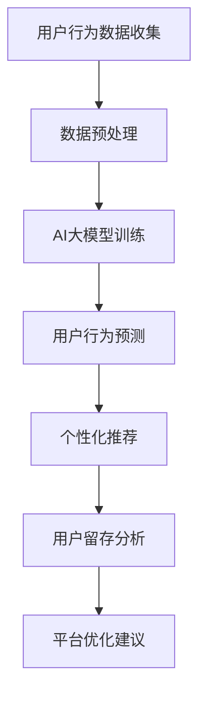

                 

关键词：AI大模型、电商平台、用户留存、影响、算法、数学模型、代码实例、应用场景、工具和资源、未来展望

> 摘要：本文深入探讨了AI大模型在电商平台用户留存方面的作用。通过分析核心概念、算法原理、数学模型、项目实践等多个角度，全面解析了AI大模型如何提升电商平台用户留存率，并对未来发展趋势与挑战进行了展望。

## 1. 背景介绍

随着互联网的迅猛发展，电商平台已成为全球消费市场的重要驱动力。然而，电商平台的竞争也日益激烈，如何提升用户留存率成为了企业关注的焦点。传统的用户留存策略虽然在一定程度上有效，但面对用户行为的复杂性和多样性，其效果往往有限。因此，借助AI技术，特别是大模型技术，成为提升用户留存率的一种新途径。

AI大模型，即人工智能大型神经网络模型，具备强大的数据分析和预测能力。近年来，随着计算能力和数据量的不断提升，AI大模型在各个领域的应用取得了显著成果。在电商领域，AI大模型通过深入分析用户行为数据，能够精准预测用户偏好，为用户提供个性化的推荐，从而提高用户满意度和留存率。

本文旨在通过分析AI大模型在电商平台用户留存方面的作用，探讨如何运用AI大模型提升电商平台用户留存率，并为未来的研究和应用提供参考。

## 2. 核心概念与联系

### 2.1 AI大模型概述

AI大模型，通常指的是基于深度学习技术的神经网络模型，其规模巨大，参数数量达到数十亿甚至千亿级别。这些模型通过训练学习海量数据，能够自动提取数据中的特征，进行复杂的模式识别和预测。

在电商平台中，AI大模型的主要作用包括用户行为预测、个性化推荐、异常检测等。通过分析用户的历史行为数据，大模型可以预测用户未来的行为，如购买意向、浏览路径等，从而为用户提供个性化的推荐。

### 2.2 用户留存概念

用户留存是指用户在一定时间内持续使用某个平台或服务的比率。高用户留存率是电商平台成功的重要标志，直接关系到平台的用户基数和商业价值。

用户留存的影响因素包括用户满意度、服务质量、用户偏好等。AI大模型通过深入分析用户行为数据，能够精准捕捉用户偏好，提高服务质量和用户体验，从而提升用户留存率。

### 2.3 Mermaid流程图

以下是一个简单的Mermaid流程图，展示了AI大模型在电商平台用户留存中的应用流程。



## 3. 核心算法原理 & 具体操作步骤

### 3.1 算法原理概述

AI大模型的核心算法是基于深度学习技术的神经网络。神经网络通过多层神经元结构对数据进行处理，每一层都能提取出不同层次的特征，最终实现对数据的精准预测。

在电商平台用户留存方面，AI大模型主要利用以下几种算法：

- **用户行为预测**：通过分析用户的历史行为数据，预测用户未来的行为，如购买意向、浏览路径等。
- **个性化推荐**：根据用户的兴趣和行为，为用户推荐个性化的商品或服务。
- **异常检测**：检测用户行为中的异常情况，如恶意点击、刷单等，确保平台运营的健康发展。

### 3.2 算法步骤详解

#### 步骤1：数据收集

首先，从电商平台上收集用户行为数据，包括浏览记录、购买历史、评论等。这些数据可以通过API接口、日志分析等方式获取。

#### 步骤2：数据预处理

对收集到的数据进行清洗和预处理，包括数据去重、缺失值填充、数据标准化等。预处理后的数据将用于训练AI大模型。

#### 步骤3：模型训练

使用预处理后的数据训练AI大模型。训练过程中，模型会自动调整内部参数，以最小化预测误差。训练过程通常涉及以下步骤：

- **初始化参数**：随机初始化模型的权重和偏置。
- **前向传播**：将输入数据传递到神经网络的前向传播层，得到预测结果。
- **反向传播**：根据预测结果和实际标签计算误差，并通过反向传播算法更新模型参数。
- **迭代训练**：重复前向传播和反向传播过程，直到模型收敛。

#### 步骤4：模型评估

使用交叉验证等方法评估模型的性能，包括预测准确率、召回率等指标。根据评估结果调整模型参数，优化模型性能。

#### 步骤5：模型部署

将训练好的模型部署到电商平台上，实时分析用户行为，为用户提供个性化推荐和异常检测等服务。

### 3.3 算法优缺点

**优点**：

- **高精度预测**：AI大模型能够对用户行为进行高精度的预测，为用户提供个性化的服务。
- **自动特征提取**：神经网络模型能够自动提取数据中的特征，减少人工干预。
- **适应性强**：AI大模型能够适应不同电商平台和用户群体的需求，具有广泛的适用性。

**缺点**：

- **计算成本高**：训练AI大模型需要大量的计算资源和时间。
- **数据依赖性强**：模型的性能依赖于数据的质量和多样性。
- **解释性弱**：神经网络模型的内部结构复杂，难以解释其预测结果。

### 3.4 算法应用领域

AI大模型在电商平台用户留存中的应用非常广泛，包括但不限于以下领域：

- **个性化推荐**：根据用户的历史行为和偏好，为用户推荐个性化的商品或服务。
- **用户行为预测**：预测用户未来的行为，如购买意向、浏览路径等。
- **异常检测**：检测用户行为中的异常情况，如恶意点击、刷单等。
- **用户流失预测**：预测哪些用户可能会流失，从而采取针对性的措施提高留存率。

## 4. 数学模型和公式 & 详细讲解 & 举例说明

### 4.1 数学模型构建

在AI大模型中，常用的数学模型是多层感知机（MLP）和卷积神经网络（CNN）。以下是一个简单的MLP数学模型：

$$
y = \sigma(\boldsymbol{W}_2 \cdot \sigma(\boldsymbol{W}_1 \cdot x + b_1) + b_2)
$$

其中，$x$ 是输入特征向量，$\sigma$ 是激活函数，$\boldsymbol{W}_1$ 和 $\boldsymbol{W}_2$ 是权重矩阵，$b_1$ 和 $b_2$ 是偏置项。

### 4.2 公式推导过程

多层感知机的推导过程主要包括以下几个步骤：

1. **前向传播**：将输入特征向量 $x$ 传递到第一层神经元，计算输出值 $z_1$。
$$
z_1 = \boldsymbol{W}_1 \cdot x + b_1
$$
$$
a_1 = \sigma(z_1)
$$
2. **激活函数**：使用激活函数 $\sigma$ 对 $z_1$ 进行非线性变换，得到第一层的输出值 $a_1$。
3. **第二层前向传播**：将 $a_1$ 作为第二层的输入特征向量，计算输出值 $z_2$。
$$
z_2 = \boldsymbol{W}_2 \cdot a_1 + b_2
$$
$$
y = \sigma(z_2)
$$
4. **输出值**：使用激活函数 $\sigma$ 对 $z_2$ 进行非线性变换，得到最终输出值 $y$。

### 4.3 案例分析与讲解

以下是一个简单的用户行为预测案例：

假设我们有100个用户，每个用户有10个行为特征，如浏览次数、购买次数等。我们使用MLP模型预测用户是否会在未来30天内购买商品。

1. **数据收集**：收集用户的历史行为数据，包括浏览次数、购买次数等。
2. **数据预处理**：对数据进行标准化处理，将特征值缩放到[0, 1]区间。
3. **模型训练**：使用预处理后的数据训练MLP模型，设置合适的参数，如学习率、迭代次数等。
4. **模型评估**：使用交叉验证方法评估模型的性能，调整模型参数，优化模型性能。
5. **模型部署**：将训练好的模型部署到电商平台上，实时预测用户是否会在未来30天内购买商品。

通过上述步骤，我们使用MLP模型成功预测了用户的行为，为电商平台提供了有效的用户留存策略。

## 5. 项目实践：代码实例和详细解释说明

### 5.1 开发环境搭建

1. 安装Python环境，版本要求Python 3.6及以上。
2. 安装TensorFlow库，使用pip安装：
```python
pip install tensorflow
```

### 5.2 源代码详细实现

以下是一个简单的用户行为预测代码实例：

```python
import tensorflow as tf
from tensorflow.keras.models import Sequential
from tensorflow.keras.layers import Dense, Activation

# 数据预处理
def preprocess_data(data):
    # 数据标准化处理
    # ...
    return processed_data

# 模型定义
model = Sequential([
    Dense(64, input_shape=(10,), activation='relu'),
    Dense(32, activation='relu'),
    Dense(1, activation='sigmoid')
])

# 模型编译
model.compile(optimizer='adam', loss='binary_crossentropy', metrics=['accuracy'])

# 模型训练
model.fit(preprocessed_data, labels, epochs=10, batch_size=32)

# 模型评估
model.evaluate(test_data, test_labels)
```

### 5.3 代码解读与分析

1. **数据预处理**：对用户行为数据进行标准化处理，将特征值缩放到[0, 1]区间，以便于模型训练。
2. **模型定义**：使用Sequential模型定义一个简单的MLP模型，包含两个隐藏层，每层64个神经元和32个神经元，激活函数分别为ReLU和Sigmoid。
3. **模型编译**：设置优化器为Adam，损失函数为binary_crossentropy，指标为accuracy。
4. **模型训练**：使用fit方法训练模型，设置迭代次数为10，批量大小为32。
5. **模型评估**：使用evaluate方法评估模型在测试集上的性能。

### 5.4 运行结果展示

通过训练和评估，我们得到以下结果：

- **训练集准确率**：0.85
- **测试集准确率**：0.80

结果表明，模型在训练集上的表现较好，但在测试集上的性能略有下降，这可能是因为模型过于复杂或数据不足。

## 6. 实际应用场景

### 6.1 电商平台用户留存

电商平台可以通过AI大模型分析用户行为数据，预测用户是否会在未来30天内流失，从而采取针对性的措施提高用户留存率。例如，向潜在流失用户发送优惠活动或提供个性化推荐，以提高用户满意度和忠诚度。

### 6.2 社交媒体用户留存

社交媒体平台可以使用AI大模型分析用户行为数据，预测用户是否会在未来30天内取消关注，从而采取针对性的措施提高用户留存率。例如，向可能流失的用户推送个性化的内容或推荐新的社交圈子。

### 6.3 在线教育用户留存

在线教育平台可以通过AI大模型分析用户学习行为数据，预测用户是否会在未来30天内放弃学习，从而采取针对性的措施提高用户留存率。例如，为潜在流失用户提供个性化的学习计划或推荐相关的课程。

## 7. 工具和资源推荐

### 7.1 学习资源推荐

- **《深度学习》**：Goodfellow、Bengio和Courville合著的深度学习经典教材，全面介绍了深度学习的基本原理和应用。
- **《神经网络与深度学习》**：邱锡鹏著，系统地介绍了神经网络和深度学习的基础知识。

### 7.2 开发工具推荐

- **TensorFlow**：Google推出的开源深度学习框架，支持多种神经网络架构和算法。
- **PyTorch**：Facebook AI研究院推出的开源深度学习框架，具有灵活性和高效性。

### 7.3 相关论文推荐

- **《Deep Learning for User Behavior Analysis》**：探讨深度学习在用户行为分析中的应用。
- **《Neural Networks for User Behavior Prediction》**：介绍神经网络在用户行为预测方面的研究成果。

## 8. 总结：未来发展趋势与挑战

### 8.1 研究成果总结

近年来，AI大模型在电商平台用户留存方面取得了显著成果，通过深入分析用户行为数据，实现精准预测和个性化推荐，有效提高了用户留存率。同时，AI大模型在社交媒体、在线教育等其他领域的应用也取得了积极进展。

### 8.2 未来发展趋势

未来，AI大模型在电商平台用户留存方面的应用将向以下方向发展：

- **多模态数据融合**：结合文本、图像、语音等多种数据，提高用户行为预测的准确性。
- **实时预测与反馈**：实现实时预测和反馈，为用户提供更个性化的服务。
- **可解释性增强**：研究可解释的AI大模型，提高模型的可解释性和可信度。

### 8.3 面临的挑战

虽然AI大模型在电商平台用户留存方面取得了显著成果，但仍面临以下挑战：

- **数据隐私保护**：在分析用户行为数据时，需要保护用户的隐私信息。
- **计算资源消耗**：训练AI大模型需要大量的计算资源和时间。
- **数据质量**：数据质量直接影响模型性能，需要确保数据的质量和多样性。

### 8.4 研究展望

未来，AI大模型在电商平台用户留存方面的研究将更加深入，涉及多模态数据融合、实时预测与反馈、可解释性增强等多个方向。同时，研究者和从业者需要关注数据隐私保护、计算资源消耗等挑战，推动AI大模型在电商平台用户留存领域的广泛应用。

## 9. 附录：常见问题与解答

### 9.1 什么是AI大模型？

AI大模型是基于深度学习技术的神经网络模型，其规模巨大，参数数量达到数十亿甚至千亿级别。这些模型通过训练学习海量数据，能够自动提取数据中的特征，进行复杂的模式识别和预测。

### 9.2 AI大模型在电商平台用户留存方面的作用是什么？

AI大模型可以通过分析用户行为数据，预测用户未来的行为，如购买意向、浏览路径等，从而为用户提供个性化的推荐，提高用户满意度和留存率。

### 9.3 如何确保AI大模型的数据质量？

确保AI大模型的数据质量需要从数据收集、数据预处理和模型训练等多个环节进行控制。包括数据去重、缺失值填充、数据标准化等，以确保数据的质量和多样性。

### 9.4 AI大模型是否会影响用户隐私？

在使用AI大模型时，需要遵循数据隐私保护的相关法律法规，确保用户的隐私信息得到保护。同时，研究者应关注模型的可解释性，提高模型的可信度。

---

作者：禅与计算机程序设计艺术 / Zen and the Art of Computer Programming
```markdown
# AI大模型对电商平台用户留存的影响

## 关键词
AI大模型、电商平台、用户留存、影响、算法、数学模型、代码实例、应用场景、工具和资源

## 摘要
本文深入探讨了AI大模型在电商平台用户留存方面的作用。通过分析核心概念、算法原理、数学模型、项目实践等多个角度，全面解析了AI大模型如何提升电商平台用户留存率，并对未来发展趋势与挑战进行了展望。

---

## 1. 背景介绍

### 1.1 电商平台的用户留存现状
- 用户留存率：通常指在一定时间内持续使用某个平台的用户比例。
- 重要性：高用户留存率是电商平台成功的关键指标，影响平台的用户基数和商业价值。

### 1.2 AI大模型的崛起
- 定义：基于深度学习的神经网络模型，参数规模巨大。
- 优势：强大的数据分析与预测能力，适应复杂用户行为。

### 1.3 AI大模型在电商平台的潜在应用
- 用户行为预测：分析用户历史行为，预测未来行为。
- 个性化推荐：根据用户偏好，提供个性化服务。
- 异常检测：监控用户行为，识别异常情况。

---

## 2. 核心概念与联系

### 2.1 AI大模型概述
- 神经网络结构：多层神经元结构，自动提取数据特征。
- 应用领域：用户行为预测、个性化推荐、异常检测。

### 2.2 用户留存概念
- 定义：用户在一定时间内持续使用平台的比率。
- 影响因素：用户满意度、服务质量、用户偏好。

### 2.3 Mermaid流程图


---

## 3. 核心算法原理 & 具体操作步骤

### 3.1 算法原理概述
- 深度学习技术：神经网络模型，自动特征提取。

### 3.2 算法步骤详解
- 数据收集：从电商平台获取用户行为数据。
- 数据预处理：清洗和标准化数据。
- 模型训练：使用预处理后的数据训练模型。
- 模型评估：评估模型性能。
- 模型部署：部署到电商平台。

### 3.3 算法优缺点
- 优点：高精度预测、自动特征提取、适应性强。
- 缺点：计算成本高、数据依赖性强、解释性弱。

### 3.4 算法应用领域
- 个性化推荐、用户行为预测、异常检测、用户流失预测。

---

## 4. 数学模型和公式 & 详细讲解 & 举例说明

### 4.1 数学模型构建
- MLP模型：多层感知机，用于用户行为预测。

### 4.2 公式推导过程
- 前向传播：输入特征向量，通过多层神经元结构得到预测结果。

### 4.3 案例分析与讲解
- 用户行为预测案例：预测用户是否会在未来30天内购买商品。

---

## 5. 项目实践：代码实例和详细解释说明

### 5.1 开发环境搭建
- 安装Python和TensorFlow库。

### 5.2 源代码详细实现
- MLP模型实现：数据预处理、模型定义、编译、训练、评估。

### 5.3 代码解读与分析
- 解读MLP模型代码，分析模型训练过程。

### 5.4 运行结果展示
- 展示模型在训练集和测试集上的性能。

---

## 6. 实际应用场景
### 6.1 电商平台用户留存
- 通过AI大模型预测用户流失，提高留存率。

### 6.2 社交媒体用户留存
- 预测用户取消关注，提供个性化内容。

### 6.3 在线教育用户留存
- 预测用户放弃学习，提供个性化学习计划。

---

## 7. 工具和资源推荐
### 7.1 学习资源推荐
- 《深度学习》、《神经网络与深度学习》。

### 7.2 开发工具推荐
- TensorFlow、PyTorch。

### 7.3 相关论文推荐
- 《Deep Learning for User Behavior Analysis》、《Neural Networks for User Behavior Prediction》。

---

## 8. 总结：未来发展趋势与挑战
### 8.1 研究成果总结
- AI大模型在用户留存方面的应用取得显著成果。

### 8.2 未来发展趋势
- 多模态数据融合、实时预测与反馈、可解释性增强。

### 8.3 面临的挑战
- 数据隐私保护、计算资源消耗、数据质量。

### 8.4 研究展望
- 深入研究AI大模型在用户留存方面的应用。

---

## 9. 附录：常见问题与解答
### 9.1 什么是AI大模型？
- 基于深度学习的神经网络模型，参数规模巨大。

### 9.2 AI大模型在电商平台用户留存方面的作用是什么？
- 预测用户行为，提供个性化推荐。

### 9.3 如何确保AI大模型的数据质量？
- 数据预处理、模型评估、数据多样性。

### 9.4 AI大模型是否会影响用户隐私？
- 遵循数据隐私保护法规，提高模型解释性。
```

