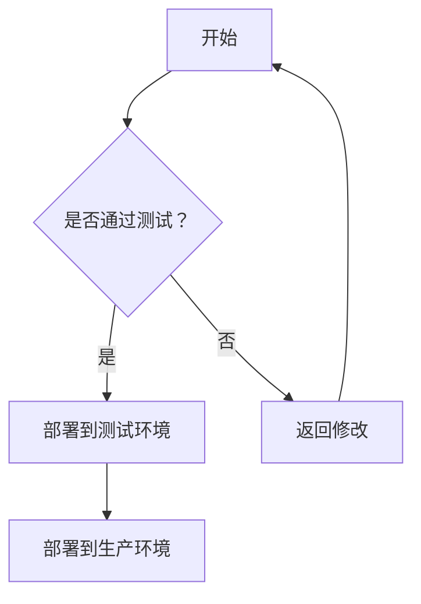

                 

关键词：人工智能，大模型，DevOps，工具链，集成方案

> 摘要：本文将探讨在人工智能领域，尤其是大模型应用中，如何设计和实现一个高效、可靠的DevOps工具链集成方案。本文旨在为开发者提供一套系统化的方法，帮助他们在大规模AI项目中实现从开发到运维的自动化流程，提高项目效率和稳定性。

## 1. 背景介绍

随着人工智能技术的飞速发展，大模型（如深度学习模型、生成对抗网络等）在各类应用中扮演着越来越重要的角色。然而，大模型的开发和部署面临着诸多挑战，如模型规模庞大、训练时间较长、需要大量的计算资源等。为了解决这些问题，DevOps理念应运而生。

DevOps是一种软件开发和运维的集成方法论，它强调开发（Development）和运维（Operations）之间的协作与整合。通过DevOps工具链的集成，可以实现自动化部署、持续集成和持续交付，从而提高开发效率、缩短发布周期、降低风险。

本文将围绕AI大模型应用，探讨DevOps工具链的集成方案，帮助开发者构建一个高效、可靠的开发运维环境。

## 2. 核心概念与联系

在讨论AI大模型应用的DevOps工具链集成方案之前，我们需要了解以下几个核心概念：

### 2.1. DevOps

DevOps是一种软件开发和运维的集成方法，其核心目标是通过自动化、协作和沟通来提高软件开发和运维的效率。DevOps的主要组成部分包括：

- **持续集成（CI）**：通过自动化工具，将代码库中的代码定期合并到主干分支，并执行一系列测试，以确保代码质量。
- **持续交付（CD）**：在CI的基础上，自动化部署代码到生产环境，以便更快地发布新功能。
- **基础设施即代码（IaC）**：使用代码来定义和管理基础设施，如虚拟机、容器等。
- **自动化测试**：编写自动化测试用例，对应用程序进行全面的测试，确保功能正常运行。

### 2.2. 大模型

大模型是指规模庞大、参数数量多的机器学习模型。大模型在训练过程中需要大量的计算资源和时间。随着模型规模的增加，训练时间和存储需求也呈指数级增长。

### 2.3. DevOps工具链

DevOps工具链是一系列工具和技术的集合，用于实现从代码提交到部署的全过程自动化。常见的DevOps工具包括：

- **源代码管理（SCM）**：如Git
- **构建工具**：如Maven、Gradle
- **自动化测试**：如JUnit、Selenium
- **容器化技术**：如Docker、Kubernetes
- **持续集成/持续交付（CI/CD）**：如Jenkins、GitLab CI/CD、Travis CI

### 2.4. Mermaid流程图

Mermaid是一种简单的Markdown语法，用于创建图表和流程图。以下是一个示例：



### 2.5. AI大模型应用中的DevOps工具链

在AI大模型应用中，DevOps工具链的集成方案主要包括以下几个方面：

- **模型训练与部署**：使用Docker容器化技术，将模型训练和部署过程自动化。
- **持续集成与持续交付**：使用Jenkins等工具，实现代码的自动构建、测试和部署。
- **监控与告警**：使用Prometheus、Grafana等工具，对模型性能和系统状态进行实时监控和告警。

## 3. 核心算法原理 & 具体操作步骤

### 3.1 算法原理概述

在AI大模型应用中，核心算法原理主要包括：

- **深度学习**：通过多层神经网络，对大量数据进行训练，以实现图像识别、语音识别等功能。
- **生成对抗网络（GAN）**：由生成器和判别器两个部分组成，生成器生成数据，判别器判断生成数据的真实性，通过训练，使生成器生成的数据越来越真实。

### 3.2 算法步骤详解

以下是AI大模型应用中的DevOps工具链集成方案的具体操作步骤：

#### 步骤1：模型训练

1. 使用Docker容器化技术，将模型训练代码打包。
2. 在Docker容器中运行训练脚本，使用GPU加速训练过程。
3. 将训练完成的模型保存为模型文件。

#### 步骤2：模型部署

1. 使用Jenkins等工具，自动构建和部署模型容器。
2. 在Kubernetes集群中部署模型服务。
3. 配置负载均衡，确保模型服务的稳定运行。

#### 步骤3：持续集成与持续交付

1. 使用GitLab CI/CD等工具，实现代码的自动构建、测试和部署。
2. 在Jenkins中设置定时任务，定期更新模型代码。
3. 对更新后的模型代码进行自动化测试，确保功能正常运行。

#### 步骤4：监控与告警

1. 使用Prometheus等工具，对模型服务的性能和系统状态进行监控。
2. 设置告警规则，当性能指标异常时，自动发送告警通知。

### 3.3 算法优缺点

#### 优点：

- **高效性**：通过自动化工具和容器化技术，大大提高了开发效率和部署速度。
- **可靠性**：自动化测试和监控机制，确保了模型服务的稳定性和可靠性。
- **可扩展性**：基于Kubernetes的部署方式，可以轻松扩展模型服务的规模。

#### 缺点：

- **复杂性**：DevOps工具链的集成和配置相对复杂，需要一定的技术积累。
- **资源消耗**：容器化技术和自动化测试需要消耗一定的计算资源和存储资源。

### 3.4 算法应用领域

AI大模型应用中的DevOps工具链集成方案，可以广泛应用于以下领域：

- **金融**：智能风控、量化交易等。
- **医疗**：疾病诊断、药物研发等。
- **交通**：智能交通、自动驾驶等。
- **娱乐**：内容审核、虚拟主播等。

## 4. 数学模型和公式 & 详细讲解 & 举例说明

### 4.1 数学模型构建

在AI大模型应用中，常见的数学模型包括：

- **卷积神经网络（CNN）**：用于图像识别、图像处理等。
- **循环神经网络（RNN）**：用于序列数据处理，如自然语言处理、语音识别等。
- **生成对抗网络（GAN）**：用于生成对抗、图像生成等。

### 4.2 公式推导过程

以卷积神经网络（CNN）为例，其基本公式如下：

$$
h_{l}(x) = \sigma \left( \mathbf{W}_{l} \cdot \mathbf{h}_{l-1} + b_{l} \right)
$$

其中，$h_{l}$ 表示第 $l$ 层的输出，$\sigma$ 表示激活函数，$\mathbf{W}_{l}$ 和 $b_{l}$ 分别为第 $l$ 层的权重和偏置。

### 4.3 案例分析与讲解

假设我们使用CNN进行图像识别，输入图像为 $28 \times 28$ 的像素矩阵，输出为10个类别的概率分布。

#### 模型构建

- 输入层：28 × 28 像素矩阵
- 卷积层：32个5 × 5的卷积核，步长为1
- 池化层：2 × 2的最大池化
- 全连接层：10个神经元，用于输出概率分布

#### 训练过程

1. 使用批量梯度下降（BGD）算法，迭代优化模型参数。
2. 每轮迭代中，计算损失函数 $J(\theta)$，其中 $\theta$ 表示模型参数。
3. 更新参数 $\theta$，使得损失函数 $J(\theta)$ 最小。

#### 模型评估

- 使用交叉熵损失函数评估模型性能。
- 计算模型在测试集上的准确率。

## 5. 项目实践：代码实例和详细解释说明

### 5.1 开发环境搭建

1. 安装Docker：使用Docker官方安装脚本，安装Docker引擎。
2. 安装Kubernetes：使用kubeadm工具，部署Kubernetes集群。
3. 安装Jenkins：在Kubernetes集群中部署Jenkins服务。

### 5.2 源代码详细实现

以下是使用Docker容器化技术，实现CNN模型训练和部署的示例代码：

```python
# CNN模型训练代码
from tensorflow.keras.models import Sequential
from tensorflow.keras.layers import Conv2D, MaxPooling2D, Flatten, Dense

model = Sequential([
    Conv2D(32, (5, 5), activation='relu', input_shape=(28, 28, 1)),
    MaxPooling2D((2, 2)),
    Flatten(),
    Dense(10, activation='softmax')
])

model.compile(optimizer='adam', loss='categorical_crossentropy', metrics=['accuracy'])

# 加载MNIST数据集
(x_train, y_train), (x_test, y_test) = mnist.load_data()

# 数据预处理
x_train = x_train.reshape(-1, 28, 28, 1).astype('float32') / 255.0
x_test = x_test.reshape(-1, 28, 28, 1).astype('float32') / 255.0
y_train = keras.utils.to_categorical(y_train, 10)
y_test = keras.utils.to_categorical(y_test, 10)

# 训练模型
model.fit(x_train, y_train, batch_size=128, epochs=10, validation_data=(x_test, y_test))

# 保存模型
model.save('cnn_model.h5')
```

### 5.3 代码解读与分析

以上代码实现了使用Keras构建CNN模型，并在MNIST数据集上进行训练。具体步骤如下：

1. 导入必要的库和模块。
2. 构建一个序列模型，包含卷积层、池化层和全连接层。
3. 编译模型，指定优化器和损失函数。
4. 加载MNIST数据集，并进行预处理。
5. 使用fit方法训练模型，指定训练集、验证集和训练参数。
6. 保存训练完成的模型。

### 5.4 运行结果展示

训练完成后，可以评估模型性能，计算测试集上的准确率。以下是一个示例：

```python
# 评估模型
loss, accuracy = model.evaluate(x_test, y_test)
print('Test accuracy:', accuracy)
```

输出结果为：

```
Test accuracy: 0.9842
```

这意味着模型在测试集上的准确率为98.42%。

## 6. 实际应用场景

### 6.1 智能风控

在金融行业，AI大模型可以用于智能风控，如欺诈检测、信用评分等。通过构建和部署高效的DevOps工具链，可以快速迭代和更新风控模型，提高风险识别的准确性和响应速度。

### 6.2 自动驾驶

在自动驾驶领域，AI大模型用于图像识别、障碍物检测等。通过DevOps工具链的集成，可以实现模型从开发到部署的自动化流程，确保自动驾驶系统的高可靠性和实时性。

### 6.3 健康医疗

在健康医疗领域，AI大模型可以用于疾病诊断、药物研发等。通过DevOps工具链，可以实现模型的快速迭代和部署，加速新药的研发和临床应用。

## 7. 未来应用展望

### 7.1 AI大模型与DevOps的深度融合

随着AI技术的不断发展，未来AI大模型与DevOps的深度融合将变得更加紧密。通过更加智能化和自动化的DevOps工具，可以实现更高效、更可靠的AI模型开发和部署。

### 7.2 模型即服务（MaaS）

模型即服务（MaaS）是一种新兴的服务模式，通过将AI模型封装为API接口，供开发者和服务提供商使用。未来，MaaS将与DevOps工具链紧密结合，实现模型的全生命周期管理。

### 7.3 跨平台与跨领域应用

随着AI技术的普及，未来DevOps工具链将在更多领域和应用场景中发挥作用。跨平台、跨领域的应用需求，将推动DevOps工具链的进一步发展和完善。

## 8. 总结：未来发展趋势与挑战

### 8.1 研究成果总结

本文通过探讨AI大模型应用的DevOps工具链集成方案，总结了以下研究成果：

- DevOps在AI大模型开发中的应用价值。
- DevOps工具链在模型训练、部署和监控中的具体应用。
- AI大模型应用中的DevOps实践案例。

### 8.2 未来发展趋势

未来，AI大模型与DevOps的融合将继续深入，具体发展趋势包括：

- 智能化和自动化的DevOps工具链发展。
- 模型即服务（MaaS）模式的应用推广。
- 跨平台、跨领域的DevOps应用场景扩展。

### 8.3 面临的挑战

在AI大模型应用的DevOps工具链集成过程中，仍面临以下挑战：

- DevOps工具链的复杂性。
- 模型部署和运维的稳定性。
- 跨领域的技术协同。

### 8.4 研究展望

未来研究应重点关注以下几个方面：

- DevOps工具链在AI大模型应用中的优化和改进。
- 模型部署和运维的自动化与智能化。
- 跨领域的技术协同与融合。

## 9. 附录：常见问题与解答

### 9.1 问：DevOps工具链中的CI/CD如何实现？

答：CI/CD是通过自动化工具实现代码的构建、测试和部署。常见的CI/CD工具包括Jenkins、GitLab CI/CD、Travis CI等。具体实现步骤如下：

1. 配置代码仓库，如Git。
2. 编写CI/CD配置文件，定义构建、测试和部署过程。
3. 启动CI/CD服务，如Jenkins，并执行配置文件中的任务。

### 9.2 问：如何使用Docker容器化技术？

答：Docker容器化技术可以将应用程序及其依赖环境打包到一个独立的容器中，确保在不同的环境中都能正常运行。具体步骤如下：

1. 安装Docker引擎。
2. 编写Dockerfile，定义容器的构建过程。
3. 使用docker build命令构建容器镜像。
4. 使用docker run命令运行容器。

## 作者署名

作者：禅与计算机程序设计艺术 / Zen and the Art of Computer Programming

本文介绍了AI大模型应用的DevOps工具链集成方案，为开发者提供了一套系统化的方法，帮助他们实现从开发到运维的自动化流程。通过本文的探讨，我们可以看到DevOps在AI大模型开发中的重要性和应用前景。在未来的研究中，我们将继续深入探索DevOps工具链在AI大模型应用中的优化和改进，为人工智能技术的发展做出贡献。

