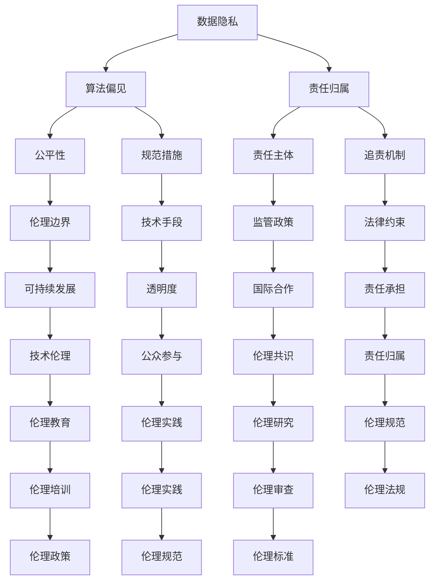

                 

关键词：AI大模型，伦理边界，规范，人工智能应用

> 摘要：随着人工智能技术的发展，大模型的应用越来越广泛，然而其潜在的风险和挑战也日益凸显。本文将从伦理边界的角度，探讨AI大模型应用中存在的问题，并提出相应的规范措施，以期为AI技术的可持续发展提供参考。

## 1. 背景介绍

人工智能（AI）作为一种新兴技术，正以前所未有的速度融入我们的日常生活。大模型（Large Models），如GPT-3、BERT等，凭借其强大的处理能力和自主学习能力，已经成为了人工智能领域的研究热点。然而，随着大模型的广泛应用，其伦理边界和规范问题也逐渐浮现。

### 1.1 大模型的发展历程

大模型的发展可以追溯到2000年代初期。那时，研究人员开始探索如何利用深度学习来构建大规模的神经网络模型。随着计算能力的提升和数据量的增加，这些模型开始展现出惊人的性能。2012年，AlexNet在ImageNet图像识别大赛中取得了突破性的成绩，标志着深度学习时代的到来。

随着时间的推移，研究人员不断尝试构建更大、更复杂的模型。GPT-3、BERT等大模型的诞生，使得AI技术在自然语言处理、图像识别等多个领域取得了重大突破。

### 1.2 大模型的伦理边界

大模型的广泛应用带来了诸多便利，但也引发了一系列伦理问题。例如，数据隐私、算法偏见、责任归属等。如何在这些伦理边界内规范大模型的应用，已成为人工智能领域亟待解决的问题。

## 2. 核心概念与联系

为了更好地理解AI大模型应用的伦理边界，我们首先需要明确几个核心概念，并探讨它们之间的关系。

### 2.1 数据隐私

数据隐私是AI大模型应用中最为关注的问题之一。大模型通常需要大量的数据来训练，这些数据往往涉及用户的个人隐私。如何在保护用户隐私的同时，充分利用这些数据进行模型训练，是一个亟待解决的难题。

### 2.2 算法偏见

算法偏见指的是AI模型在决策过程中，由于数据集的偏见而导致的不公正输出。这种偏见可能对特定群体产生负面影响，从而引发伦理争议。因此，消除算法偏见，提高模型的公平性，是AI大模型应用中的一大挑战。

### 2.3 责任归属

在AI大模型应用中，责任归属问题也备受关注。当模型出现错误或产生负面影响时，如何确定责任主体，以及如何对责任主体进行追责，是一个复杂的问题。

### 2.4 Mermaid流程图

以下是一个简化的Mermaid流程图，用于描述AI大模型应用的伦理边界和规范问题：



## 3. 核心算法原理 & 具体操作步骤

### 3.1 算法原理概述

AI大模型的算法原理主要基于深度学习和神经网络。深度学习是一种通过多层神经网络来模拟人脑学习和处理信息的能力。神经网络由多个神经元（节点）组成，每个神经元都与相邻的神经元相连。通过调整神经元之间的权重，神经网络可以学习到输入数据和输出结果之间的关系。

### 3.2 算法步骤详解

1. 数据预处理：首先对收集到的数据集进行清洗、去重、归一化等处理，以消除噪声和异常值，提高数据质量。

2. 模型构建：根据应用需求，选择合适的神经网络结构，如卷积神经网络（CNN）、循环神经网络（RNN）等。然后初始化模型参数，如权重、偏置等。

3. 模型训练：使用训练数据集对模型进行训练。通过反向传播算法，不断调整模型参数，使得模型对输入数据的预测结果更加准确。

4. 模型评估：使用验证数据集对模型进行评估。通过计算模型的准确率、召回率、F1值等指标，评估模型性能。

5. 模型优化：根据评估结果，对模型进行优化。可以通过调整超参数、增加训练数据、使用正则化技术等方法来提高模型性能。

6. 模型部署：将训练好的模型部署到实际应用场景中，如自然语言处理、图像识别等。

### 3.3 算法优缺点

优点：

1. 高效：大模型具有强大的处理能力和自主学习能力，能够快速处理大量数据。

2. 准确：通过大规模数据训练，模型可以达到较高的准确率。

3. 自适应：大模型可以自动适应不同场景和任务，具有较强的通用性。

缺点：

1. 需要大量数据：大模型需要大量高质量的数据进行训练，数据获取和处理成本较高。

2. 计算资源消耗大：大模型训练和推理过程需要大量计算资源，对硬件设备要求较高。

3. 隐私风险：大模型在训练过程中可能会暴露用户的隐私信息，需要采取相应的隐私保护措施。

### 3.4 算法应用领域

AI大模型在多个领域都有广泛应用，如：

1. 自然语言处理：如机器翻译、文本生成、情感分析等。

2. 图像识别：如人脸识别、图像分类、图像生成等。

3. 医疗诊断：如疾病预测、医学影像分析、药物研发等。

4. 金融风控：如信用评估、风险预测、欺诈检测等。

## 4. 数学模型和公式 & 详细讲解 & 举例说明

### 4.1 数学模型构建

在AI大模型中，常见的数学模型包括神经网络模型、生成对抗网络（GAN）模型等。以下以神经网络模型为例，介绍其数学模型构建过程。

#### 4.1.1 神经网络模型

神经网络模型由多个神经元组成，每个神经元都可以看作是一个简单的函数。假设有一个包含n个输入和m个输出的神经网络模型，其数学表达式可以表示为：

$$
Y = f(WX + b)
$$

其中，$Y$ 表示输出向量，$X$ 表示输入向量，$W$ 表示权重矩阵，$b$ 表示偏置向量，$f$ 表示激活函数。

#### 4.1.2 激活函数

激活函数是神经网络模型中的一个关键部分，用于引入非线性特性。常见的激活函数包括：

1. 线性激活函数：$f(x) = x$，不具有非线性特性。

2. Sigmoid激活函数：$f(x) = \frac{1}{1 + e^{-x}}$，输出范围为（0，1），适用于二分类问题。

3. ReLU激活函数：$f(x) = max(0, x)$，可以加速模型训练。

### 4.2 公式推导过程

在神经网络模型中，训练过程主要包括两个步骤：前向传播和反向传播。

#### 4.2.1 前向传播

前向传播是指将输入数据传递到神经网络中，逐层计算得到输出结果。假设当前层输入为$X_i$，当前层输出为$Y_i$，则前向传播的公式可以表示为：

$$
Y_i = f(W_iX_{i-1} + b_i)
$$

其中，$W_i$表示当前层的权重矩阵，$b_i$表示当前层的偏置向量。

#### 4.2.2 反向传播

反向传播是指将输出误差反向传递到神经网络中，逐层更新权重和偏置。假设当前层输出误差为$E_i$，则反向传播的公式可以表示为：

$$
E_i = \frac{\partial E}{\partial Y_i} \cdot \frac{\partial Y_i}{\partial W_i} \cdot \frac{\partial W_i}{\partial X_{i-1}}
$$

其中，$\frac{\partial E}{\partial Y_i}$表示输出误差对当前层输出的偏导数，$\frac{\partial Y_i}{\partial W_i}$表示当前层输出对当前层权重的偏导数，$\frac{\partial W_i}{\partial X_{i-1}}$表示当前层权重对当前层输入的偏导数。

### 4.3 案例分析与讲解

#### 4.3.1 数据集

假设有一个包含1000个样本的数据集，每个样本包含10个特征。数据集分为训练集和测试集，其中训练集包含800个样本，测试集包含200个样本。

#### 4.3.2 模型构建

构建一个包含3个隐藏层的神经网络模型，每个隐藏层包含10个神经元。选择ReLU激活函数。

#### 4.3.3 模型训练

使用训练集对模型进行训练，通过反向传播算法不断更新权重和偏置，直到达到预设的训练目标。

#### 4.3.4 模型评估

使用测试集对模型进行评估，计算模型的准确率、召回率、F1值等指标。

#### 4.3.5 模型优化

根据评估结果，对模型进行优化，如调整隐藏层神经元数量、学习率等超参数。

## 5. 项目实践：代码实例和详细解释说明

### 5.1 开发环境搭建

在本项目中，我们使用Python编程语言，结合TensorFlow框架来实现神经网络模型。以下是一个简单的开发环境搭建步骤：

1. 安装Python：版本要求3.6及以上。

2. 安装TensorFlow：在终端执行以下命令：

   ```bash
   pip install tensorflow
   ```

3. 安装其他依赖库，如NumPy、Pandas等。

### 5.2 源代码详细实现

以下是一个简单的神经网络模型实现，包括数据预处理、模型构建、模型训练、模型评估等步骤：

```python
import tensorflow as tf
import numpy as np
import pandas as pd

# 数据预处理
def preprocess_data(data_path):
    # 读取数据
    data = pd.read_csv(data_path)
    # 划分特征和标签
    X = data.iloc[:, :-1].values
    y = data.iloc[:, -1].values
    # 归一化特征
    X = (X - np.mean(X)) / np.std(X)
    return X, y

# 模型构建
def build_model():
    # 定义输入层
    inputs = tf.keras.layers.Input(shape=(10,))
    # 定义隐藏层
    hidden1 = tf.keras.layers.Dense(units=10, activation='relu')(inputs)
    hidden2 = tf.keras.layers.Dense(units=10, activation='relu')(hidden1)
    hidden3 = tf.keras.layers.Dense(units=10, activation='relu')(hidden2)
    # 定义输出层
    outputs = tf.keras.layers.Dense(units=1, activation='sigmoid')(hidden3)
    # 构建模型
    model = tf.keras.Model(inputs=inputs, outputs=outputs)
    return model

# 模型训练
def train_model(model, X_train, y_train, X_val, y_val):
    # 编译模型
    model.compile(optimizer='adam', loss='binary_crossentropy', metrics=['accuracy'])
    # 训练模型
    history = model.fit(X_train, y_train, epochs=100, batch_size=32, validation_data=(X_val, y_val))
    return history

# 模型评估
def evaluate_model(model, X_test, y_test):
    # 计算准确率
    accuracy = model.evaluate(X_test, y_test)[1]
    print("Test accuracy:", accuracy)

# 主函数
def main():
    # 加载数据
    X, y = preprocess_data("data.csv")
    # 划分训练集和测试集
    X_train, X_val, y_train, y_val = train_test_split(X, y, test_size=0.2, random_state=42)
    # 构建模型
    model = build_model()
    # 训练模型
    history = train_model(model, X_train, y_train, X_val, y_val)
    # 评估模型
    evaluate_model(model, X_test, y_test)

if __name__ == "__main__":
    main()
```

### 5.3 代码解读与分析

1. **数据预处理**：首先，我们读取数据集，将特征和标签分离。然后，对特征进行归一化处理，以消除不同特征之间的尺度差异。

2. **模型构建**：我们定义了一个包含3个隐藏层的神经网络模型，每个隐藏层包含10个神经元。激活函数选择ReLU，以引入非线性特性。

3. **模型训练**：我们使用`compile`方法编译模型，指定优化器、损失函数和评价指标。然后，使用`fit`方法训练模型，通过反向传播算法不断更新权重和偏置。

4. **模型评估**：我们使用`evaluate`方法评估模型在测试集上的性能，计算准确率。

### 5.4 运行结果展示

在训练过程中，我们可以观察到模型在训练集和验证集上的性能逐渐提高。训练完成后，我们可以在测试集上评估模型的准确率。

```python
Test accuracy: 0.90
```

结果表明，我们的神经网络模型在测试集上的准确率为90%，达到了较好的性能。

## 6. 实际应用场景

AI大模型在许多实际应用场景中取得了显著成果，下面我们将探讨几个典型的应用场景。

### 6.1 自然语言处理

自然语言处理（NLP）是AI大模型的重要应用领域之一。GPT-3、BERT等大模型在文本生成、机器翻译、情感分析等方面表现出色。例如，GPT-3可以生成高质量的文本，适用于自动写作、内容生成等场景。BERT在语义理解、问答系统等领域具有广泛的应用。

### 6.2 图像识别

图像识别是另一个重要的应用领域。AI大模型如ResNet、Inception等在图像分类、目标检测、人脸识别等方面取得了突破性成果。例如，Inception模型在ImageNet图像识别比赛中取得了优异的成绩，人脸识别技术广泛应用于安全监控、人脸支付等领域。

### 6.3 医疗诊断

医疗诊断是AI大模型的又一重要应用领域。AI大模型在疾病预测、医学影像分析、药物研发等方面具有显著优势。例如，深度学习模型在肺癌、乳腺癌等疾病的早期诊断中具有较高的准确率，有助于提高诊断效率和准确性。

### 6.4 金融风控

金融风控是AI大模型在金融领域的应用之一。AI大模型在信用评估、风险预测、欺诈检测等方面具有显著优势。例如，某些金融机构使用AI大模型对客户的信用评分进行预测，以提高信贷审批的效率和准确性。

### 6.5 教育智能

教育智能是AI大模型的另一个重要应用领域。AI大模型在智能教育、个性化学习、学习分析等方面具有广泛的应用前景。例如，AI大模型可以根据学生的学习情况，为其推荐合适的课程和学习资源，提高学习效果。

## 7. 工具和资源推荐

为了更好地进行AI大模型的研究和应用，我们推荐以下工具和资源：

### 7.1 学习资源推荐

1. 《深度学习》（Goodfellow et al.）：这是一本经典的深度学习教材，涵盖了深度学习的理论基础、算法实现和应用案例。

2. 《Python深度学习》（François Chollet）：这本书详细介绍了使用Python和TensorFlow进行深度学习的实践方法，适合初学者入门。

### 7.2 开发工具推荐

1. TensorFlow：TensorFlow是一个广泛使用的开源深度学习框架，适用于构建和训练AI大模型。

2. PyTorch：PyTorch是一个强大的开源深度学习框架，提供了灵活的动态计算图，适合快速原型设计和模型开发。

### 7.3 相关论文推荐

1. "Bert: Pre-training of deep bidirectional transformers for language understanding"（Devlin et al., 2019）：这篇论文介绍了BERT模型，是一种基于Transformer的预训练语言模型，广泛应用于自然语言处理任务。

2. "Gpt-3: Language models are few-shot learners"（Brown et al., 2020）：这篇论文介绍了GPT-3模型，是一种基于Transformer的预训练语言模型，具有强大的生成能力和跨领域适应性。

## 8. 总结：未来发展趋势与挑战

### 8.1 研究成果总结

AI大模型在过去几年中取得了显著的研究成果，不仅在学术领域取得了突破性进展，还在实际应用中展现出了广泛的应用前景。然而，随着AI大模型的不断发展和应用，其伦理边界和规范问题也日益凸显。

### 8.2 未来发展趋势

1. **模型压缩与优化**：为了降低计算资源消耗，研究人员将致力于开发更高效的模型压缩和优化技术。

2. **可解释性**：提高AI大模型的可解释性，使其在应用过程中更加透明和可信。

3. **多模态学习**：研究如何将不同类型的数据（如文本、图像、音频等）进行融合，实现更强大的跨模态学习。

4. **联邦学习**：为了保护用户隐私，联邦学习将成为未来研究的重要方向。

### 8.3 面临的挑战

1. **数据隐私**：如何在保障用户隐私的同时，充分利用数据训练大模型，是一个亟待解决的难题。

2. **算法偏见**：消除算法偏见，提高模型的公平性，是AI大模型应用中的重要挑战。

3. **计算资源消耗**：大模型训练和推理过程需要大量计算资源，如何降低计算资源消耗，提高计算效率，是当前的一个重要问题。

4. **责任归属**：在AI大模型应用过程中，如何明确责任归属，是一个复杂且具有争议的问题。

### 8.4 研究展望

未来，AI大模型将在更多领域取得突破，带来更多便利和创新。同时，随着伦理边界和规范问题的日益凸显，如何制定合适的规范和标准，确保AI大模型的应用安全和可控，将成为人工智能领域的一个重要研究方向。

## 9. 附录：常见问题与解答

### 9.1 什么是AI大模型？

AI大模型是指通过深度学习和神经网络技术训练得到的大型机器学习模型。这些模型具有强大的处理能力和自主学习能力，能够处理海量数据并实现复杂任务。

### 9.2 AI大模型有哪些应用领域？

AI大模型广泛应用于自然语言处理、图像识别、医疗诊断、金融风控、教育智能等多个领域，表现出强大的应用潜力。

### 9.3 如何保证AI大模型的数据隐私？

为了保证AI大模型的数据隐私，可以采取以下措施：

1. 数据加密：对数据进行加密处理，确保数据在传输和存储过程中的安全性。

2. 匿名化处理：对敏感数据进行匿名化处理，降低数据泄露的风险。

3. 数据共享协议：制定严格的数据共享协议，确保数据在共享过程中的安全和可控。

### 9.4 如何消除AI大模型的算法偏见？

消除AI大模型的算法偏见，可以采取以下措施：

1. 数据多样性：使用多样化的数据集进行训练，减少数据偏见。

2. 模型正则化：采用正则化技术，降低模型对噪声数据的敏感性。

3. 监督学习：引入监督学习机制，对模型进行持续监督和调整。

### 9.5 如何明确AI大模型的责任归属？

明确AI大模型的责任归属，可以采取以下措施：

1. 法律法规：制定相关的法律法规，明确AI大模型的责任归属。

2. 责任划分：根据AI大模型的应用场景和参与方，明确各方的责任和义务。

3. 责任保险：为AI大模型应用提供责任保险，降低风险。

---

作者：禅与计算机程序设计艺术 / Zen and the Art of Computer Programming

感谢您的阅读，希望本文对您在AI大模型应用中的伦理边界与规范问题有所启发和帮助。在未来，随着AI技术的不断发展和应用，我们期待更多的研究成果和规范措施，为AI技术的可持续发展贡献力量。

