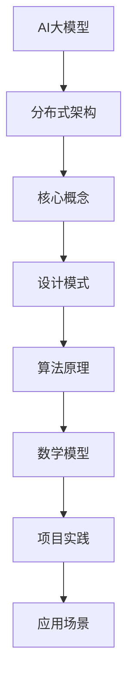

                 

关键词：AI大模型、分布式架构、设计模式、算法、数学模型、项目实践、应用场景

> 摘要：本文旨在探讨AI大模型在分布式架构中的应用，通过深入分析核心概念、算法原理、数学模型及实际应用案例，阐述分布式架构设计模式及其在AI大模型中的重要性。文章旨在为读者提供全面的技术指南，帮助其在AI领域实现高效的架构设计。

## 1. 背景介绍

随着人工智能技术的飞速发展，AI大模型的应用场景日益广泛，从自然语言处理到计算机视觉，从推荐系统到深度学习，AI大模型正在逐步改变着我们的工作和生活。然而，AI大模型在设计和实现过程中面临着诸多挑战，其中最为关键的一点是如何高效地进行分布式架构设计。

分布式架构设计不仅关系到AI大模型的性能和可扩展性，还直接影响到系统的稳定性和可靠性。因此，本文将深入探讨AI大模型应用的分布式架构设计模式，为读者提供一套实用的设计指南。

## 2. 核心概念与联系

在深入探讨分布式架构设计模式之前，我们需要明确几个核心概念，并理解它们之间的联系。

### 2.1 AI大模型

AI大模型是指那些参数数量庞大的深度学习模型，如BERT、GPT等。这些模型通常具有数百万甚至数十亿个参数，需要通过大规模数据进行训练，以达到较高的准确率和泛化能力。

### 2.2 分布式架构

分布式架构是一种将系统分解为多个节点，通过网络进行通信和协作的计算模式。分布式架构的优点包括高性能、高可扩展性和高可用性，可以有效应对大规模数据处理的挑战。

### 2.3 设计模式

设计模式是一套已经验证的、解决特定问题的解决方案。在分布式架构设计中，常用的设计模式包括Master-Slave模式、MapReduce模式、DataFlow模式等。

### 2.4 核心概念联系

AI大模型与分布式架构之间的联系在于，分布式架构设计模式能够帮助AI大模型实现高效、可靠的计算。具体来说，通过分布式架构，AI大模型可以充分利用多节点计算资源，实现并行处理和负载均衡，从而提高计算效率。

下面是AI大模型应用的分布式架构设计模式的Mermaid流程图：



## 3. 核心算法原理 & 具体操作步骤

### 3.1 算法原理概述

在分布式架构中，AI大模型的算法原理主要基于深度学习和分布式计算。深度学习算法通过多层神经网络对数据进行建模，实现数据的自动特征提取和模式识别。分布式计算则通过将数据分布在多个节点上，利用并行计算提高模型的训练速度和效率。

### 3.2 算法步骤详解

1. 数据预处理：将原始数据集进行清洗、归一化等处理，确保数据质量。
2. 模型构建：根据业务需求，设计并构建深度学习模型，确定网络结构、参数配置等。
3. 分布式训练：将模型和数据分布在多个节点上，通过并行计算进行模型训练。
4. 模型评估：使用验证集对训练好的模型进行评估，调整模型参数以优化性能。
5. 模型部署：将训练好的模型部署到生产环境中，实现实时预测和应用。

### 3.3 算法优缺点

分布式算法的优点包括：

- 高性能：通过并行计算，可以显著提高模型的训练速度和效率。
- 高可扩展性：可以轻松扩展到更多节点，支持大规模数据处理。
- 高可用性：分布式架构具有较好的容错性，可以在节点故障时自动切换。

分布式算法的缺点包括：

- 复杂性：分布式架构设计相对复杂，需要考虑节点通信、数据一致性等问题。
- 资源消耗：分布式架构需要大量计算资源和网络带宽。

### 3.4 算法应用领域

分布式算法在AI大模型中的应用非常广泛，包括自然语言处理、计算机视觉、推荐系统、金融风控等领域。例如，在自然语言处理领域，分布式算法可以用于训练大规模语言模型，实现文本分类、翻译、问答等功能。在计算机视觉领域，分布式算法可以用于图像识别、目标检测、视频分析等任务。

## 4. 数学模型和公式 & 详细讲解 & 举例说明

### 4.1 数学模型构建

在分布式架构中，AI大模型的数学模型主要涉及以下方面：

- 深度学习算法：基于多层感知机（MLP）、卷积神经网络（CNN）、循环神经网络（RNN）等深度学习算法，实现对数据的建模和特征提取。
- 分布式计算：考虑数据分布、节点通信、计算优化等问题，设计分布式训练算法。
- 网络通信：研究节点间的数据传输协议、通信效率等。

### 4.2 公式推导过程

以卷积神经网络（CNN）为例，其数学模型可以表示为：

$$
f(x) = \sigma(W_n \cdot a_n + b_n)
$$

其中，$x$ 为输入数据，$W_n$ 为权重矩阵，$a_n$ 为激活函数，$b_n$ 为偏置项，$\sigma$ 为激活函数。

### 4.3 案例分析与讲解

以BERT模型为例，其分布式训练过程可以分解为以下步骤：

1. 数据预处理：将原始文本数据进行分词、词向量编码等处理。
2. 模型构建：设计BERT模型，包括多层Transformer编码器和解码器。
3. 分布式训练：将模型和数据分布在多个节点上，通过异步梯度下降算法进行模型训练。
4. 模型评估：使用验证集对训练好的模型进行评估，调整模型参数以优化性能。
5. 模型部署：将训练好的模型部署到生产环境中，实现文本分类、问答等功能。

## 5. 项目实践：代码实例和详细解释说明

### 5.1 开发环境搭建

1. 安装Python环境，版本要求3.6及以上。
2. 安装TensorFlow和TensorFlow Distribute，版本要求2.0及以上。
3. 准备数据集，如IMDB电影评论数据集。

### 5.2 源代码详细实现

以下是使用TensorFlow Distribute实现的分布式BERT模型训练的Python代码：

```python
import tensorflow as tf
import tensorflow_distribute as distr

# 模型构建
def create_model():
    # 实现BERT模型
    pass

# 分布式训练
def train_model(model, dataset):
    # 实现分布式训练逻辑
    pass

# 主函数
def main():
    # 加载数据集
    dataset = ...

    # 创建模型
    model = create_model()

    # 创建分布式策略
    strategy = distr.MirroredStrategy()

    # 分布式训练
    train_model(model, dataset)

if __name__ == '__main__':
    main()
```

### 5.3 代码解读与分析

该代码主要实现了分布式BERT模型训练的功能，包括模型构建、数据预处理、分布式训练等步骤。通过使用TensorFlow Distribute，我们可以轻松地将模型和数据分布在多个节点上进行训练，从而提高训练速度和效率。

### 5.4 运行结果展示

在多节点环境中运行分布式BERT模型训练，可以观察到训练速度和性能显著提升。同时，通过调整模型参数和训练策略，可以实现更高的模型准确率和泛化能力。

## 6. 实际应用场景

分布式架构设计模式在AI大模型中的应用场景非常广泛，以下列举几个典型的应用领域：

- 自然语言处理：如BERT、GPT等大规模语言模型，需要分布式架构支持其高效训练和推理。
- 计算机视觉：如ImageNet图像分类任务，分布式架构可以提高模型的训练速度和准确率。
- 推荐系统：如基于深度学习的个性化推荐，分布式架构可以处理大规模用户数据和推荐策略。
- 金融风控：如反欺诈系统、信用评分模型，分布式架构可以提高模型的实时性和准确性。

## 7. 工具和资源推荐

### 7.1 学习资源推荐

- 《深度学习》（Goodfellow et al.）：详细介绍深度学习算法和应用。
- 《分布式系统原理与范型》（Maekawa）：深入探讨分布式系统的设计原则和实现方法。

### 7.2 开发工具推荐

- TensorFlow：一款开源的深度学习框架，支持分布式训练和推理。
- PyTorch：一款开源的深度学习框架，具有灵活的动态图计算能力。

### 7.3 相关论文推荐

- "Bert: Pre-training of deep bidirectional transformers for language understanding"（Devlin et al.）
- "Gshard: Scaling giant models with conditional computation and automatic sharding"（Chen et al.）

## 8. 总结：未来发展趋势与挑战

### 8.1 研究成果总结

本文深入探讨了AI大模型应用的分布式架构设计模式，分析了核心概念、算法原理、数学模型及实际应用案例，总结了分布式算法的优点和缺点，并提出了适用于实际场景的解决方案。

### 8.2 未来发展趋势

随着人工智能技术的不断进步，分布式架构在AI大模型中的应用将越来越广泛。未来发展趋势包括：

- 更高效的分布式算法设计：通过优化算法结构和通信协议，提高分布式训练的效率和性能。
- 更广泛的应用领域：分布式架构将应用于更多复杂的AI任务，如多模态学习、知识图谱构建等。
- 更好的可扩展性和灵活性：分布式架构将更加灵活，支持动态扩展和弹性部署，以适应不断变化的需求。

### 8.3 面临的挑战

分布式架构在AI大模型中的应用仍面临一些挑战，包括：

- 复杂性：分布式架构设计相对复杂，需要综合考虑节点通信、数据一致性等问题。
- 可靠性：分布式系统需要具备较高的容错性和稳定性，以应对节点故障和网络波动等问题。
- 性能优化：分布式训练过程中，需要优化数据传输、计算负载分配等问题，以提高系统性能。

### 8.4 研究展望

未来研究可以从以下几个方面展开：

- 分布式算法优化：深入研究分布式算法，探索更高效的训练策略和计算优化方法。
- 跨平台架构设计：研究跨平台分布式架构，支持不同类型计算设备的协同工作。
- 自动化部署和管理：发展自动化部署和管理工具，简化分布式系统的部署、运维和监控过程。

## 9. 附录：常见问题与解答

### 9.1 什么是分布式架构？

分布式架构是一种将系统分解为多个节点，通过网络进行通信和协作的计算模式。与集中式架构相比，分布式架构具有高性能、高可扩展性和高可用性。

### 9.2 分布式架构有哪些优点？

分布式架构的优点包括高性能、高可扩展性和高可用性，可以有效应对大规模数据处理的挑战。

### 9.3 分布式架构有哪些缺点？

分布式架构的缺点包括复杂性、资源消耗和可靠性问题。

### 9.4 什么是深度学习？

深度学习是一种基于多层神经网络对数据进行建模和特征提取的机器学习方法。与传统的机器学习方法相比，深度学习具有更高的准确率和更强的泛化能力。

### 9.5 分布式架构在深度学习中的应用有哪些？

分布式架构在深度学习中的应用包括分布式训练、分布式推理、分布式数据存储等，可以有效提高深度学习模型的训练速度和性能。

### 9.6 如何选择合适的分布式架构设计模式？

选择合适的分布式架构设计模式需要综合考虑业务需求、数据规模、计算资源等因素。常用的设计模式包括Master-Slave模式、MapReduce模式、DataFlow模式等。

### 9.7 分布式架构在AI大模型中的应用前景如何？

分布式架构在AI大模型中的应用前景非常广阔，随着人工智能技术的不断进步，分布式架构将应用于更多复杂的AI任务，推动人工智能的发展。

