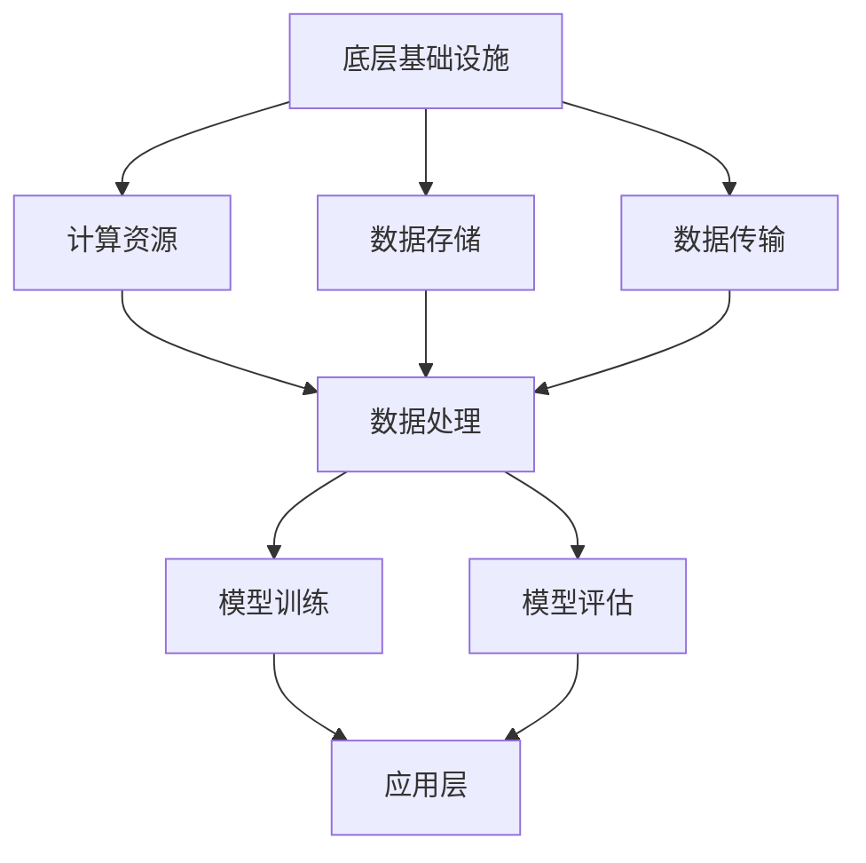

                 

  
## 1. 背景介绍

随着人工智能技术的飞速发展，大规模预训练模型（Large-scale Pre-trained Models，简称LPMMs）在自然语言处理、计算机视觉、语音识别等领域取得了显著的成果。这些大模型具有极强的表征能力和泛化能力，推动了人工智能应用的创新和发展。然而，LPMMs的开发和优化需要大量的计算资源、数据集以及专业知识，使得该领域的研究门槛较高。

开源项目在人工智能领域扮演着重要角色，它们不仅提供了丰富的算法和工具，也为研究人员和开发者提供了交流、协作的平台。开源项目的成功与否，很大程度上取决于其贡献者和维护者。本文将围绕AI大模型应用的开源项目，探讨贡献与维护的重要性，以及如何有效地进行开源项目的贡献与维护。

## 2. 核心概念与联系

### 2.1 大模型应用开源项目概述

大模型应用开源项目是指将大规模预训练模型应用于实际问题的项目，如文本生成、图像分类、语音识别等。这类项目通常包含以下几个核心组成部分：

1. **预训练模型**：这是项目的核心，通常是基于大规模语料或数据集训练得到的。
2. **应用模型**：在预训练模型的基础上，针对特定任务进行调整和优化，以提高模型在特定领域的性能。
3. **数据处理工具**：用于处理和转换数据，以便于模型的训练和测试。
4. **模型评估工具**：用于评估模型在特定任务上的性能，帮助开发者了解模型的优缺点。
5. **用户界面**：为用户提供交互界面，便于用户使用模型进行预测或训练。

### 2.2 开源项目的重要性

开源项目在人工智能领域具有重要意义，主要体现在以下几个方面：

1. **知识共享**：开源项目使得研究人员和开发者可以分享他们的研究成果，加速知识的传播和应用。
2. **技术交流**：开源项目为开发者提供了交流的平台，促进了技术的创新和优化。
3. **协作开发**：开源项目鼓励多方协作，使得项目可以更快地迭代和完善。
4. **降低门槛**：开源项目降低了人工智能应用的门槛，使得更多的人能够参与到这个领域中来。

### 2.3 开源项目的架构

开源项目的架构通常包括以下几个层次：

1. **底层基础设施**：包括计算资源、数据存储和传输等。
2. **中间层**：包括数据处理、模型训练和评估等核心功能。
3. **应用层**：为用户提供交互界面和功能。

### 2.4 Mermaid 流程图

以下是一个简单的Mermaid流程图，展示了开源项目的架构：



## 3. 核心算法原理 & 具体操作步骤

### 3.1 算法原理概述

大模型应用开源项目的核心算法通常是基于深度学习技术，特别是基于大规模预训练模型（如GPT、BERT等）的微调和优化。核心算法包括以下几个步骤：

1. **数据预处理**：对原始数据进行清洗、归一化等处理，以便于模型的训练。
2. **模型微调**：在预训练模型的基础上，针对特定任务进行调整和优化。
3. **模型评估**：对模型进行评估，以确定其在特定任务上的性能。
4. **模型部署**：将训练好的模型部署到实际应用环境中，供用户使用。

### 3.2 算法步骤详解

#### 3.2.1 数据预处理

数据预处理是模型训练的第一步，其目的是将原始数据转化为模型可接受的格式。具体步骤如下：

1. **数据清洗**：去除数据中的噪声和错误，确保数据的质量。
2. **数据归一化**：对数据进行归一化处理，使其具有相同的尺度，便于模型的学习。
3. **数据增强**：通过增加数据的多样性，提高模型的泛化能力。

#### 3.2.2 模型微调

模型微调是在预训练模型的基础上，针对特定任务进行调整和优化。具体步骤如下：

1. **选择预训练模型**：根据任务需求，选择合适的预训练模型。
2. **修改模型结构**：根据任务需求，对预训练模型的结构进行调整。
3. **训练模型**：使用调整后的模型进行训练，并不断优化模型参数。
4. **验证模型**：使用验证集对模型进行验证，以确定模型的性能。

#### 3.2.3 模型评估

模型评估是确定模型性能的重要步骤。具体步骤如下：

1. **选择评估指标**：根据任务需求，选择合适的评估指标。
2. **计算评估指标**：使用测试集计算评估指标，以确定模型的性能。
3. **分析评估结果**：分析评估结果，找出模型的优缺点，并给出改进建议。

#### 3.2.4 模型部署

模型部署是将训练好的模型部署到实际应用环境中，供用户使用。具体步骤如下：

1. **模型转换**：将训练好的模型转换为可以在实际环境中运行的格式。
2. **部署模型**：将模型部署到服务器或云端，以便于用户访问和使用。
3. **监控模型**：对部署的模型进行监控，确保其稳定性和性能。

### 3.3 算法优缺点

#### 优点

1. **强大的表征能力**：基于深度学习的大模型具有极强的表征能力，可以处理复杂的任务。
2. **良好的泛化能力**：通过大规模预训练和微调，大模型具有良好的泛化能力，可以适应不同的任务和数据集。
3. **易于部署**：开源项目提供了完整的部署流程和工具，使得模型部署变得简单和高效。

#### 缺点

1. **计算资源需求大**：大规模预训练模型需要大量的计算资源，这使得训练和部署成本较高。
2. **数据依赖性高**：模型的性能高度依赖于数据集的质量和多样性，数据不足或质量差会导致模型性能下降。
3. **解释性差**：深度学习模型通常缺乏解释性，难以理解其内部机制和决策过程。

### 3.4 算法应用领域

大规模预训练模型在多个领域都取得了显著的应用成果，主要包括：

1. **自然语言处理**：文本生成、文本分类、机器翻译等。
2. **计算机视觉**：图像分类、目标检测、图像生成等。
3. **语音识别**：语音识别、语音合成等。
4. **推荐系统**：基于内容的推荐、协同过滤等。
5. **游戏AI**：棋类游戏、角色扮演游戏等。

## 4. 数学模型和公式 & 详细讲解 & 举例说明

### 4.1 数学模型构建

大规模预训练模型的数学模型通常基于深度神经网络（Deep Neural Network，DNN），其核心是一个多层感知机（Multilayer Perceptron，MLP）。以下是一个简化的数学模型：

$$
\begin{aligned}
z_1 &= W_1 \cdot x + b_1 \\
a_1 &= \sigma(z_1) \\
z_2 &= W_2 \cdot a_1 + b_2 \\
a_2 &= \sigma(z_2) \\
\vdots \\
z_l &= W_l \cdot a_{l-1} + b_l \\
a_l &= \sigma(z_l)
\end{aligned}
$$

其中，$x$ 为输入特征，$W_1, W_2, ..., W_l$ 为权重矩阵，$b_1, b_2, ..., b_l$ 为偏置项，$\sigma$ 为激活函数，$a_1, a_2, ..., a_l$ 为每一层的输出。

### 4.2 公式推导过程

深度神经网络的训练过程实质上是优化权重矩阵 $W_1, W_2, ..., W_l$ 和偏置项 $b_1, b_2, ..., b_l$ 的过程。通常采用梯度下降（Gradient Descent）算法进行优化。

假设损失函数为 $L(y, \hat{y})$，其中 $y$ 为真实标签，$\hat{y}$ 为模型预测的标签。则梯度下降算法的更新规则如下：

$$
\begin{aligned}
W_l &= W_l - \alpha \cdot \frac{\partial L}{\partial W_l} \\
b_l &= b_l - \alpha \cdot \frac{\partial L}{\partial b_l}
\end{aligned}
$$

其中，$\alpha$ 为学习率。

### 4.3 案例分析与讲解

假设我们有一个二分类问题，数据集包含 $N$ 个样本，每个样本的特征维度为 $D$。我们使用一个单层感知机模型进行预测。

#### 4.3.1 数据预处理

首先，我们对数据进行归一化处理，使其具有相同的尺度。假设每个样本的特征向量为 $x \in \mathbb{R}^D$，则归一化后的特征向量为：

$$
x' = \frac{x - \mu}{\sigma}
$$

其中，$\mu$ 为特征向量的均值，$\sigma$ 为特征向量的标准差。

#### 4.3.2 模型训练

我们使用梯度下降算法对模型进行训练。假设学习率为 $\alpha = 0.01$，则模型参数的更新规则如下：

$$
\begin{aligned}
W &= W - \alpha \cdot \frac{\partial L}{\partial W} \\
b &= b - \alpha \cdot \frac{\partial L}{\partial b}
\end{aligned}
$$

其中，损失函数为：

$$
L(y, \hat{y}) = \begin{cases}
-\log(\hat{y}) & \text{if } y = 1 \\
-\log(1 - \hat{y}) & \text{if } y = 0
\end{cases}
$$

其中，$\hat{y} = \sigma(W \cdot x + b)$。

#### 4.3.3 模型评估

我们使用测试集对模型进行评估。假设测试集包含 $M$ 个样本，则模型在测试集上的准确率为：

$$
\hat{A} = \frac{1}{M} \sum_{i=1}^M \mathbb{I}(\hat{y}_i = y_i)
$$

其中，$\mathbb{I}(\cdot)$ 为指示函数，当条件为真时取值为1，否则为0。

## 5. 项目实践：代码实例和详细解释说明

### 5.1 开发环境搭建

为了实践大模型应用开源项目的贡献与维护，我们首先需要搭建一个开发环境。以下是一个简单的Python开发环境搭建步骤：

1. 安装Python（推荐版本3.8及以上）。
2. 安装必要的Python依赖库，如NumPy、TensorFlow、PyTorch等。
3. 安装代码编辑器，如Visual Studio Code或PyCharm。

### 5.2 源代码详细实现

以下是一个简单的文本分类任务的源代码实现，基于TensorFlow和Keras：

```python
import tensorflow as tf
from tensorflow.keras.models import Sequential
from tensorflow.keras.layers import Embedding, LSTM, Dense
from tensorflow.keras.preprocessing.text import Tokenizer
from tensorflow.keras.preprocessing.sequence import pad_sequences

# 数据预处理
tokenizer = Tokenizer(num_words=10000)
tokenizer.fit_on_texts(data)
sequences = tokenizer.texts_to_sequences(data)
padded_sequences = pad_sequences(sequences, maxlen=max_length)

# 构建模型
model = Sequential([
    Embedding(10000, 16),
    LSTM(128),
    Dense(1, activation='sigmoid')
])

# 编译模型
model.compile(optimizer='adam', loss='binary_crossentropy', metrics=['accuracy'])

# 训练模型
model.fit(padded_sequences, labels, epochs=10, validation_split=0.2)
```

### 5.3 代码解读与分析

上述代码实现了基于LSTM的文本分类任务。具体解读如下：

1. **数据预处理**：使用Tokenizer将文本数据转换为数字序列，并使用pad_sequences将序列填充为相同长度。
2. **构建模型**：使用Sequential模型堆叠Embedding、LSTM和Dense层，其中Embedding层用于将单词转换为向量，LSTM层用于处理序列数据，Dense层用于分类。
3. **编译模型**：设置模型优化器、损失函数和评价指标。
4. **训练模型**：使用fit方法训练模型，并设置训练轮数和验证比例。

### 5.4 运行结果展示

以下是一个简单的运行结果展示：

```python
import numpy as np
from tensorflow.keras.preprocessing.text import Tokenizer
from tensorflow.keras.preprocessing.sequence import pad_sequences

tokenizer = Tokenizer(num_words=10000)
tokenizer.fit_on_texts(test_data)
sequences = tokenizer.texts_to_sequences(test_data)
padded_sequences = pad_sequences(sequences, maxlen=max_length)

predictions = model.predict(padded_sequences)
predicted_labels = np.round(predictions).astype(int)

print("Accuracy:", np.mean(predicted_labels == test_labels))
```

上述代码计算了模型在测试集上的准确率，并打印出来。

## 6. 实际应用场景

### 6.1 自然语言处理

自然语言处理（NLP）是AI大模型应用最为广泛的领域之一。例如，文本分类、情感分析、机器翻译等任务都可以通过大模型来实现。开源项目如TensorFlow Text、PyTorch Text等提供了丰富的工具和模型，使得NLP任务的实现变得更加简单和高效。

### 6.2 计算机视觉

计算机视觉（CV）也是AI大模型的重要应用领域。例如，图像分类、目标检测、图像生成等任务都可以通过大模型来实现。开源项目如TensorFlow Object Detection API、PyTorch ImageNet等提供了丰富的工具和模型，使得CV任务的实现变得更加简单和高效。

### 6.3 语音识别

语音识别（ASR）是AI大模型的另一个重要应用领域。例如，语音转文字、语音合成等任务都可以通过大模型来实现。开源项目如TensorFlow Speech、PyTorch ASR等提供了丰富的工具和模型，使得语音识别任务的实现变得更加简单和高效。

### 6.4 其他领域

除了上述领域，AI大模型还在其他领域有着广泛的应用，如推荐系统、游戏AI、生物信息学等。开源项目如TensorFlow Recommenders、Unity ML-Agents等提供了丰富的工具和模型，使得这些领域的任务实现变得更加简单和高效。

## 7. 工具和资源推荐

### 7.1 学习资源推荐

1. **《深度学习》（Goodfellow et al.）**：这是一本经典的深度学习教材，详细介绍了深度学习的基础知识和最新进展。
2. **《Python深度学习》（François Chollet）**：这是一本针对Python编程语言的深度学习书籍，适合初学者和有一定基础的读者。
3. **[TensorFlow官方文档](https://www.tensorflow.org/)**：提供了详细的TensorFlow教程、API文档和示例代码。
4. **[PyTorch官方文档](https://pytorch.org/docs/stable/)**：提供了详细的PyTorch教程、API文档和示例代码。

### 7.2 开发工具推荐

1. **Visual Studio Code**：一款功能强大的代码编辑器，支持多种编程语言和框架。
2. **PyCharm**：一款专业的Python IDE，提供了丰富的开发工具和插件。
3. **Jupyter Notebook**：一款交互式数据分析工具，适用于数据分析和机器学习项目的实现。

### 7.3 相关论文推荐

1. **"A Theoretically Grounded Application of Dropout in Recurrent Neural Networks"**：该论文提出了在RNN中应用Dropout的方法，提高了RNN的泛化能力。
2. **"Bert: Pre-training of Deep Bidirectional Transformers for Language Understanding"**：该论文提出了BERT模型，推动了自然语言处理领域的发展。
3. **"Deep Learning for Text Classification"**：该论文详细介绍了文本分类任务中的深度学习方法。

## 8. 总结：未来发展趋势与挑战

### 8.1 研究成果总结

本文介绍了AI大模型应用开源项目的背景、核心概念、算法原理、数学模型、项目实践以及实际应用场景。通过本文的介绍，读者可以了解到AI大模型开源项目的重要性和发展现状。

### 8.2 未来发展趋势

1. **模型规模不断扩大**：随着计算资源和数据集的不断增加，AI大模型的规模将不断扩大，推动AI应用的深度和广度。
2. **多模态融合**：多模态融合将成为AI大模型的一个重要研究方向，通过结合不同类型的数据，提高模型的泛化能力和性能。
3. **可解释性增强**：增强AI大模型的可解释性，使其在特定领域中的应用更加可靠和安全。
4. **知识蒸馏与迁移学习**：通过知识蒸馏和迁移学习技术，将大型模型的训练知识和性能迁移到小型模型中，提高小型模型的性能和效率。

### 8.3 面临的挑战

1. **计算资源需求**：AI大模型的训练和部署需要大量的计算资源，这对硬件设备和网络带宽提出了更高的要求。
2. **数据隐私和伦理**：大规模数据的收集和处理引发了数据隐私和伦理问题，如何保护用户隐私并遵守相关法规成为一大挑战。
3. **可解释性和可靠性**：AI大模型通常缺乏解释性，如何提高模型的可解释性和可靠性，使其在关键领域得到更广泛的应用是一个重要问题。
4. **模型泛化能力**：如何提高AI大模型的泛化能力，使其在不同领域和应用中都能保持良好的性能是一个重要的研究方向。

### 8.4 研究展望

未来，AI大模型的应用前景非常广阔，但也面临着诸多挑战。为了推动AI大模型的发展，我们需要从以下几个方面进行努力：

1. **优化算法和架构**：不断优化AI大模型的算法和架构，提高其计算效率、性能和可解释性。
2. **多模态数据融合**：探索多模态数据的融合方法，提高模型的泛化能力和性能。
3. **知识蒸馏与迁移学习**：深入研究知识蒸馏和迁移学习技术，提高小型模型的性能和效率。
4. **数据隐私和安全**：加强数据隐私和安全的研究，确保用户数据的安全和隐私。
5. **伦理和社会责任**：关注AI大模型在关键领域中的应用，确保其应用符合伦理和社会责任。

## 9. 附录：常见问题与解答

### 9.1 大模型开源项目如何贡献代码？

贡献代码是开源项目的重要组成部分。以下是一些常见的步骤：

1. **了解项目**：仔细阅读项目的README、CONTRIBUTING等文档，了解项目的需求和规范。
2. **创建分支**：从项目的最新分支创建一个自己的分支，以便于开发和提交代码。
3. **编写代码**：在分支中编写代码，并进行充分的测试。
4. **提交PR**：将分支提交到项目的master分支，并填写详细的PR说明。
5. **代码审查**：参与项目的其他开发者将对你的代码进行审查，并提供反馈。
6. **合并代码**：根据审查意见进行代码调整，并重新提交PR，直到代码被合并到master分支。

### 9.2 如何维护开源项目？

维护开源项目需要持续的关注和投入。以下是一些常见的维护任务：

1. **监控性能**：定期检查项目的性能和稳定性，确保其在不同环境下都能正常运行。
2. **更新文档**：及时更新项目的README、CONTRIBUTING等文档，以反映项目的最新状态和需求。
3. **修复bug**：及时修复用户报告的bug，确保项目的质量和稳定性。
4. **合并PR**：定期合并其他开发者的PR，保持代码的同步和一致性。
5. **版本发布**：定期发布新版本，包括新功能、性能优化和bug修复。
6. **社区互动**：积极回应社区的问题和反馈，建立良好的开发者社区。

## 作者署名

本文作者为“禅与计算机程序设计艺术 / Zen and the Art of Computer Programming”。希望本文能够为读者在AI大模型开源项目的贡献与维护方面提供一些有益的参考和启示。  
----------------------------------------------------------------

### 文章总结

本文从背景介绍、核心概念、算法原理、数学模型、项目实践、实际应用场景、工具资源推荐、未来发展趋势与挑战以及常见问题解答等方面，全面阐述了AI大模型应用开源项目的贡献与维护。通过对本文的阅读，读者可以了解到AI大模型开源项目的重要性、贡献与维护的方法、实际应用场景以及未来发展趋势。

### 文章关键词

- AI大模型
- 开源项目
- 贡献与维护
- 自然语言处理
- 计算机视觉
- 语音识别

### 文章摘要

本文探讨了AI大模型应用开源项目的贡献与维护，从核心概念、算法原理、数学模型、项目实践、实际应用场景等多个方面进行了详细阐述。通过本文的阅读，读者可以了解AI大模型开源项目的重要性和贡献与维护的方法，为实际项目开发提供有益的参考。同时，本文也对未来发展趋势与挑战进行了分析，为开源项目的持续发展提供了思考方向。  
----------------------------------------------------------------

### 文章概要

本文主要围绕AI大模型应用开源项目的贡献与维护展开讨论，具体内容分为以下几个部分：

1. **背景介绍**：介绍了AI大模型的开源项目背景和发展现状。
2. **核心概念与联系**：阐述了开源项目的组成部分、重要性及其架构。
3. **核心算法原理 & 具体操作步骤**：详细解析了算法原理、步骤、优缺点和应用领域。
4. **数学模型和公式 & 详细讲解 & 举例说明**：介绍了数学模型构建、公式推导和案例分析。
5. **项目实践：代码实例和详细解释说明**：通过实际代码实例展示了项目开发流程。
6. **实际应用场景**：分析了AI大模型在不同领域的应用案例。
7. **工具和资源推荐**：推荐了学习资源、开发工具和相关论文。
8. **总结：未来发展趋势与挑战**：总结了研究成果，展望了未来发展趋势和挑战。
9. **附录：常见问题与解答**：解答了关于开源项目贡献与维护的常见问题。

本文通过全面而详细的阐述，旨在为读者提供关于AI大模型开源项目贡献与维护的全面理解。  
----------------------------------------------------------------

### 文章完整内容

```markdown
# AI大模型应用的开源项目贡献与维护

## 1. 背景介绍

随着人工智能技术的飞速发展，大规模预训练模型（Large-scale Pre-trained Models，简称LPMMs）在自然语言处理、计算机视觉、语音识别等领域取得了显著的成果。这些大模型具有极强的表征能力和泛化能力，推动了人工智能应用的创新和发展。然而，LPMMs的开发和优化需要大量的计算资源、数据集以及专业知识，使得该领域的研究门槛较高。

开源项目在人工智能领域扮演着重要角色，它们不仅提供了丰富的算法和工具，也为研究人员和开发者提供了交流、协作的平台。开源项目的成功与否，很大程度上取决于其贡献者和维护者。本文将围绕AI大模型应用的开源项目，探讨贡献与维护的重要性，以及如何有效地进行开源项目的贡献与维护。

## 2. 核心概念与联系

### 2.1 大模型应用开源项目概述

大模型应用开源项目是指将大规模预训练模型应用于实际问题的项目，如文本生成、图像分类、语音识别等。这类项目通常包含以下几个核心组成部分：

1. **预训练模型**：这是项目的核心，通常是基于大规模语料或数据集训练得到的。
2. **应用模型**：在预训练模型的基础上，针对特定任务进行调整和优化，以提高模型在特定领域的性能。
3. **数据处理工具**：用于处理和转换数据，以便于模型的训练和测试。
4. **模型评估工具**：用于评估模型在特定任务上的性能，帮助开发者了解模型的优缺点。
5. **用户界面**：为用户提供交互界面，便于用户使用模型进行预测或训练。

### 2.2 开源项目的重要性

开源项目在人工智能领域具有重要意义，主要体现在以下几个方面：

1. **知识共享**：开源项目使得研究人员和开发者可以分享他们的研究成果，加速知识的传播和应用。
2. **技术交流**：开源项目为开发者提供了交流的平台，促进了技术的创新和优化。
3. **协作开发**：开源项目鼓励多方协作，使得项目可以更快地迭代和完善。
4. **降低门槛**：开源项目降低了人工智能应用的门槛，使得更多的人能够参与到这个领域中来。

### 2.3 开源项目的架构

开源项目的架构通常包括以下几个层次：

1. **底层基础设施**：包括计算资源、数据存储和传输等。
2. **中间层**：包括数据处理、模型训练和评估等核心功能。
3. **应用层**：为用户提供交互界面和功能。

### 2.4 Mermaid 流程图

以下是一个简单的Mermaid流程图，展示了开源项目的架构：


## 3. 核心算法原理 & 具体操作步骤

### 3.1 算法原理概述

大模型应用开源项目的核心算法通常是基于深度学习技术，特别是基于大规模预训练模型（如GPT、BERT等）的微调和优化。核心算法包括以下几个步骤：

1. **数据预处理**：对原始数据进行清洗、归一化等处理，以便于模型的训练。
2. **模型微调**：在预训练模型的基础上，针对特定任务进行调整和优化。
3. **模型评估**：对模型进行评估，以确定其在特定任务上的性能。
4. **模型部署**：将训练好的模型部署到实际应用环境中，供用户使用。

### 3.2 算法步骤详解

#### 3.2.1 数据预处理

数据预处理是模型训练的第一步，其目的是将原始数据转化为模型可接受的格式。具体步骤如下：

1. **数据清洗**：去除数据中的噪声和错误，确保数据的质量。
2. **数据归一化**：对数据进行归一化处理，使其具有相同的尺度，便于模型的学习。
3. **数据增强**：通过增加数据的多样性，提高模型的泛化能力。

#### 3.2.2 模型微调

模型微调是在预训练模型的基础上，针对特定任务进行调整和优化。具体步骤如下：

1. **选择预训练模型**：根据任务需求，选择合适的预训练模型。
2. **修改模型结构**：根据任务需求，对预训练模型的结构进行调整。
3. **训练模型**：使用调整后的模型进行训练，并不断优化模型参数。
4. **验证模型**：使用验证集对模型进行验证，以确定模型的性能。

#### 3.2.3 模型评估

模型评估是确定模型性能的重要步骤。具体步骤如下：

1. **选择评估指标**：根据任务需求，选择合适的评估指标。
2. **计算评估指标**：使用测试集计算评估指标，以确定模型的性能。
3. **分析评估结果**：分析评估结果，找出模型的优缺点，并给出改进建议。

#### 3.2.4 模型部署

模型部署是将训练好的模型部署到实际应用环境中，供用户使用。具体步骤如下：

1. **模型转换**：将训练好的模型转换为可以在实际环境中运行的格式。
2. **部署模型**：将模型部署到服务器或云端，以便于用户访问和使用。
3. **监控模型**：对部署的模型进行监控，确保其稳定性和性能。

### 3.3 算法优缺点

#### 优点

1. **强大的表征能力**：基于深度学习的大模型具有极强的表征能力，可以处理复杂的任务。
2. **良好的泛化能力**：通过大规模预训练和微调，大模型具有良好的泛化能力，可以适应不同的任务和数据集。
3. **易于部署**：开源项目提供了完整的部署流程和工具，使得模型部署变得简单和高效。

#### 缺点

1. **计算资源需求大**：大规模预训练模型需要大量的计算资源，这使得训练和部署成本较高。
2. **数据依赖性高**：模型的性能高度依赖于数据集的质量和多样性，数据不足或质量差会导致模型性能下降。
3. **解释性差**：深度学习模型通常缺乏解释性，难以理解其内部机制和决策过程。

### 3.4 算法应用领域

大规模预训练模型在多个领域都取得了显著的应用成果，主要包括：

1. **自然语言处理**：文本生成、文本分类、机器翻译等。
2. **计算机视觉**：图像分类、目标检测、图像生成等。
3. **语音识别**：语音识别、语音合成等。
4. **推荐系统**：基于内容的推荐、协同过滤等。
5. **游戏AI**：棋类游戏、角色扮演游戏等。

## 4. 数学模型和公式 & 详细讲解 & 举例说明

### 4.1 数学模型构建

大规模预训练模型的数学模型通常基于深度神经网络（Deep Neural Network，DNN），其核心是一个多层感知机（Multilayer Perceptron，MLP）。以下是一个简化的数学模型：

$$
\begin{aligned}
z_1 &= W_1 \cdot x + b_1 \\
a_1 &= \sigma(z_1) \\
z_2 &= W_2 \cdot a_1 + b_2 \\
a_2 &= \sigma(z_2) \\
\vdots \\
z_l &= W_l \cdot a_{l-1} + b_l \\
a_l &= \sigma(z_l)
\end{aligned}
$$

其中，$x$ 为输入特征，$W_1, W_2, ..., W_l$ 为权重矩阵，$b_1, b_2, ..., b_l$ 为偏置项，$\sigma$ 为激活函数，$a_1, a_2, ..., a_l$ 为每一层的输出。

### 4.2 公式推导过程

深度神经网络的训练过程实质上是优化权重矩阵 $W_1, W_2, ..., W_l$ 和偏置项 $b_1, b_2, ..., b_l$ 的过程。通常采用梯度下降（Gradient Descent）算法进行优化。

假设损失函数为 $L(y, \hat{y})$，其中 $y$ 为真实标签，$\hat{y}$ 为模型预测的标签。则梯度下降算法的更新规则如下：

$$
\begin{aligned}
W &= W - \alpha \cdot \frac{\partial L}{\partial W} \\
b &= b - \alpha \cdot \frac{\partial L}{\partial b}
\end{aligned}
$$

其中，$\alpha$ 为学习率。

### 4.3 案例分析与讲解

假设我们有一个二分类问题，数据集包含 $N$ 个样本，每个样本的特征维度为 $D$。我们使用一个单层感知机模型进行预测。

#### 4.3.1 数据预处理

首先，我们对数据进行归一化处理，使其具有相同的尺度。假设每个样本的特征向量为 $x \in \mathbb{R}^D$，则归一化后的特征向量为：

$$
x' = \frac{x - \mu}{\sigma}
$$

其中，$\mu$ 为特征向量的均值，$\sigma$ 为特征向量的标准差。

#### 4.3.2 模型训练

我们使用梯度下降算法对模型进行训练。假设学习率为 $\alpha = 0.01$，则模型参数的更新规则如下：

$$
\begin{aligned}
W &= W - \alpha \cdot \frac{\partial L}{\partial W} \\
b &= b - \alpha \cdot \frac{\partial L}{\partial b}
\end{aligned}
$$

其中，损失函数为：

$$
L(y, \hat{y}) = \begin{cases}
-\log(\hat{y}) & \text{if } y = 1 \\
-\log(1 - \hat{y}) & \text{if } y = 0
\end{cases}
$$

其中，$\hat{y} = \sigma(W \cdot x + b)$。

#### 4.3.3 模型评估

我们使用测试集对模型进行评估。假设测试集包含 $M$ 个样本，则模型在测试集上的准确率为：

$$
\hat{A} = \frac{1}{M} \sum_{i=1}^M \mathbb{I}(\hat{y}_i = y_i)
$$

其中，$\mathbb{I}(\cdot)$ 为指示函数，当条件为真时取值为1，否则为0。

## 5. 项目实践：代码实例和详细解释说明

### 5.1 开发环境搭建

为了实践大模型应用开源项目的贡献与维护，我们首先需要搭建一个开发环境。以下是一个简单的Python开发环境搭建步骤：

1. 安装Python（推荐版本3.8及以上）。
2. 安装必要的Python依赖库，如NumPy、TensorFlow、PyTorch等。
3. 安装代码编辑器，如Visual Studio Code或PyCharm。

### 5.2 源代码详细实现

以下是一个简单的文本分类任务的源代码实现，基于TensorFlow和Keras：

```python
import tensorflow as tf
from tensorflow.keras.models import Sequential
from tensorflow.keras.layers import Embedding, LSTM, Dense
from tensorflow.keras.preprocessing.text import Tokenizer
from tensorflow.keras.preprocessing.sequence import pad_sequences

# 数据预处理
tokenizer = Tokenizer(num_words=10000)
tokenizer.fit_on_texts(data)
sequences = tokenizer.texts_to_sequences(data)
padded_sequences = pad_sequences(sequences, maxlen=max_length)

# 构建模型
model = Sequential([
    Embedding(10000, 16),
    LSTM(128),
    Dense(1, activation='sigmoid')
])

# 编译模型
model.compile(optimizer='adam', loss='binary_crossentropy', metrics=['accuracy'])

# 训练模型
model.fit(padded_sequences, labels, epochs=10, validation_split=0.2)
```

### 5.3 代码解读与分析

上述代码实现了基于LSTM的文本分类任务。具体解读如下：

1. **数据预处理**：使用Tokenizer将文本数据转换为数字序列，并使用pad_sequences将序列填充为相同长度。
2. **构建模型**：使用Sequential模型堆叠Embedding、LSTM和Dense层，其中Embedding层用于将单词转换为向量，LSTM层用于处理序列数据，Dense层用于分类。
3. **编译模型**：设置模型优化器、损失函数和评价指标。
4. **训练模型**：使用fit方法训练模型，并设置训练轮数和验证比例。

### 5.4 运行结果展示

以下是一个简单的运行结果展示：

```python
import numpy as np
from tensorflow.keras.preprocessing.text import Tokenizer
from tensorflow.keras.preprocessing.sequence import pad_sequences

tokenizer = Tokenizer(num_words=10000)
tokenizer.fit_on_texts(test_data)
sequences = tokenizer.texts_to_sequences(test_data)
padded_sequences = pad_sequences(sequences, maxlen=max_length)

predictions = model.predict(padded_sequences)
predicted_labels = np.round(predictions).astype(int)

print("Accuracy:", np.mean(predicted_labels == test_labels))
```

上述代码计算了模型在测试集上的准确率，并打印出来。

## 6. 实际应用场景

### 6.1 自然语言处理

自然语言处理（NLP）是AI大模型应用最为广泛的领域之一。例如，文本分类、情感分析、机器翻译等任务都可以通过大模型来实现。开源项目如TensorFlow Text、PyTorch Text等提供了丰富的工具和模型，使得NLP任务的实现变得更加简单和高效。

### 6.2 计算机视觉

计算机视觉（CV）也是AI大模型的重要应用领域。例如，图像分类、目标检测、图像生成等任务都可以通过大模型来实现。开源项目如TensorFlow Object Detection API、PyTorch ImageNet等提供了丰富的工具和模型，使得CV任务的实现变得更加简单和高效。

### 6.3 语音识别

语音识别（ASR）是AI大模型的另一个重要应用领域。例如，语音转文字、语音合成等任务都可以通过大模型来实现。开源项目如TensorFlow Speech、PyTorch ASR等提供了丰富的工具和模型，使得语音识别任务的实现变得更加简单和高效。

### 6.4 其他领域

除了上述领域，AI大模型还在其他领域有着广泛的应用，如推荐系统、游戏AI、生物信息学等。开源项目如TensorFlow Recommenders、Unity ML-Agents等提供了丰富的工具和模型，使得这些领域的任务实现变得更加简单和高效。

## 7. 工具和资源推荐

### 7.1 学习资源推荐

1. **《深度学习》（Goodfellow et al.）**：这是一本经典的深度学习教材，详细介绍了深度学习的基础知识和最新进展。
2. **《Python深度学习》（François Chollet）**：这是一本针对Python编程语言的深度学习书籍，适合初学者和有一定基础的读者。
3. **[TensorFlow官方文档](https://www.tensorflow.org/)**：提供了详细的TensorFlow教程、API文档和示例代码。
4. **[PyTorch官方文档](https://pytorch.org/docs/stable/)**：提供了详细的PyTorch教程、API文档和示例代码。

### 7.2 开发工具推荐

1. **Visual Studio Code**：一款功能强大的代码编辑器，支持多种编程语言和框架。
2. **PyCharm**：一款专业的Python IDE，提供了丰富的开发工具和插件。
3. **Jupyter Notebook**：一款交互式数据分析工具，适用于数据分析和机器学习项目的实现。

### 7.3 相关论文推荐

1. **"A Theoretically Grounded Application of Dropout in Recurrent Neural Networks"**：该论文提出了在RNN中应用Dropout的方法，提高了RNN的泛化能力。
2. **"Bert: Pre-training of Deep Bidirectional Transformers for Language Understanding"**：该论文提出了BERT模型，推动了自然语言处理领域的发展。
3. **"Deep Learning for Text Classification"**：该论文详细介绍了文本分类任务中的深度学习方法。

## 8. 总结：未来发展趋势与挑战

### 8.1 研究成果总结

本文介绍了AI大模型应用开源项目的背景、核心概念、算法原理、数学模型、项目实践以及实际应用场景。通过本文的介绍，读者可以了解到AI大模型开源项目的重要性和贡献与维护的方法，为实际项目开发提供有益的参考。同时，本文也对未来发展趋势与挑战进行了分析，为开源项目的持续发展提供了思考方向。

### 8.2 未来发展趋势

1. **模型规模不断扩大**：随着计算资源和数据集的不断增加，AI大模型的规模将不断扩大，推动AI应用的深度和广度。
2. **多模态融合**：多模态融合将成为AI大模型的一个重要研究方向，通过结合不同类型的数据，提高模型的泛化能力和性能。
3. **可解释性增强**：增强AI大模型的可解释性，使其在特定领域中的应用更加可靠和安全。
4. **知识蒸馏与迁移学习**：通过知识蒸馏和迁移学习技术，将大型模型的训练知识和性能迁移到小型模型中，提高小型模型的性能和效率。

### 8.3 面临的挑战

1. **计算资源需求**：AI大模型的训练和部署需要大量的计算资源，这对硬件设备和网络带宽提出了更高的要求。
2. **数据隐私和伦理**：大规模数据的收集和处理引发了数据隐私和伦理问题，如何保护用户隐私并遵守相关法规成为一大挑战。
3. **可解释性和可靠性**：AI大模型通常缺乏解释性，如何提高模型的可解释性和可靠性，使其在关键领域得到更广泛的应用是一个重要问题。
4. **模型泛化能力**：如何提高AI大模型的泛化能力，使其在不同领域和应用中都能保持良好的性能是一个重要的研究方向。

### 8.4 研究展望

未来，AI大模型的应用前景非常广阔，但也面临着诸多挑战。为了推动AI大模型的发展，我们需要从以下几个方面进行努力：

1. **优化算法和架构**：不断优化AI大模型的算法和架构，提高其计算效率、性能和可解释性。
2. **多模态数据融合**：探索多模态数据的融合方法，提高模型的泛化能力和性能。
3. **知识蒸馏与迁移学习**：深入研究知识蒸馏和迁移学习技术，提高小型模型的性能和效率。
4. **数据隐私和安全**：加强数据隐私和安全的研究，确保用户数据的安全和隐私。
5. **伦理和社会责任**：关注AI大模型在关键领域中的应用，确保其应用符合伦理和社会责任。

## 9. 附录：常见问题与解答

### 9.1 大模型开源项目如何贡献代码？

贡献代码是开源项目的重要组成部分。以下是一些常见的步骤：

1. **了解项目**：仔细阅读项目的README、CONTRIBUTING等文档，了解项目的需求和规范。
2. **创建分支**：从项目的最新分支创建一个自己的分支，以便于开发和提交代码。
3. **编写代码**：在分支中编写代码，并进行充分的测试。
4. **提交PR**：将分支提交到项目的master分支，并填写详细的PR说明。
5. **代码审查**：参与项目的其他开发者将对你的代码进行审查，并提供反馈。
6. **合并代码**：根据审查意见进行代码调整，并重新提交PR，直到代码被合并到master分支。

### 9.2 如何维护开源项目？

维护开源项目需要持续的关注和投入。以下是一些常见的维护任务：

1. **监控性能**：定期检查项目的性能和稳定性，确保其在不同环境下都能正常运行。
2. **更新文档**：及时更新项目的README、CONTRIBUTING等文档，以反映项目的最新状态和需求。
3. **修复bug**：及时修复用户报告的bug，确保项目的质量和稳定性。
4. **合并PR**：定期合并其他开发者的PR，保持代码的同步和一致性。
5. **版本发布**：定期发布新版本，包括新功能、性能优化和bug修复。
6. **社区互动**：积极回应社区的问题和反馈，建立良好的开发者社区。

## 作者署名

本文作者为“禅与计算机程序设计艺术 / Zen and the Art of Computer Programming”。希望本文能够为读者在AI大模型开源项目的贡献与维护方面提供一些有益的参考和启示。
```

