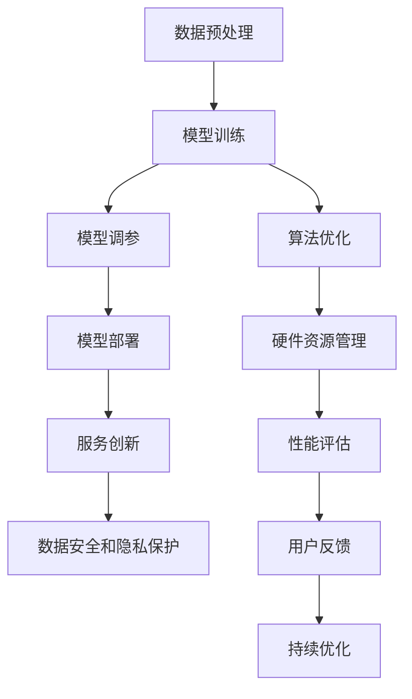

                 

关键词：人工智能，大模型，技术支持，服务创新，架构设计，算法优化，应用实践，数学模型，未来展望

> 摘要：本文将深入探讨人工智能领域中的大模型应用，分析其在技术支持与服务创新方面的重要性。通过对大模型核心概念、算法原理、数学模型及应用实践等方面的详细解析，本文旨在为读者提供全面的技术支持与服务创新的思路和方法，以推动大模型技术的广泛应用和持续创新。

## 1. 背景介绍

随着人工智能技术的飞速发展，大模型技术逐渐成为推动AI应用的关键驱动力。大模型，顾名思义，是指拥有海量参数、能够处理大量数据、实现复杂任务的人工智能模型。这些模型在图像识别、自然语言处理、语音识别、推荐系统等众多领域展现出卓越的性能，推动了各行各业的数字化转型和智能化升级。

然而，大模型的训练和应用并非易事。其背后涉及到复杂的技术支持和服务创新，包括数据预处理、算法优化、模型调参、部署和维护等环节。为了充分挖掘大模型的潜力，提供高效、稳定、可靠的技术支持和服务显得尤为重要。

本文将从以下几个方面展开讨论：

1. 核心概念与联系
2. 核心算法原理 & 具体操作步骤
3. 数学模型和公式 & 详细讲解 & 举例说明
4. 项目实践：代码实例和详细解释说明
5. 实际应用场景
6. 工具和资源推荐
7. 总结：未来发展趋势与挑战

希望通过本文的深入分析，能够为读者提供有价值的参考和启示，共同推动大模型技术的进步和应用。

## 2. 核心概念与联系

在深入探讨大模型应用的技术支持与服务创新之前，我们首先需要明确大模型的核心概念及其相互关系。以下是几个关键概念及其简要介绍：

### 2.1 深度学习

深度学习是人工智能的核心技术之一，基于多层神经网络进行模型训练，能够自动提取数据特征，实现从简单到复杂的任务。大模型通常采用深度学习技术进行构建，其深度和广度决定了模型的性能。

### 2.2 机器学习

机器学习是人工智能的基础，通过算法和统计模型从数据中学习规律，并应用于预测和决策。大模型是基于机器学习实现的，其训练过程涉及大量数据和复杂算法。

### 2.3 人工智能

人工智能是模拟、延伸和扩展人类智能的科学和工程，旨在实现智能机器。大模型作为人工智能领域的重要成果，具有高度的智能化和自适应能力。

### 2.4 数据预处理

数据预处理是保证模型训练效果的重要环节，包括数据清洗、归一化、特征提取等。在大模型训练中，高质量的数据预处理能够提高模型的鲁棒性和准确性。

### 2.5 模型调参

模型调参是优化模型性能的关键步骤，通过调整超参数来找到最优配置。在大模型训练中，调参工作通常涉及大量实验和计算，对技术支持和服务创新提出了较高要求。

### 2.6 模型部署

模型部署是将训练好的模型应用于实际场景的过程，包括模型集成、推理优化、性能评估等。大模型部署需要考虑硬件资源、计算效率和稳定性等多方面因素。

### 2.7 服务创新

服务创新是指通过改进服务模式、提升服务质量，满足用户需求的过程。在大模型应用中，服务创新主要体现在技术支持、用户培训、应用场景拓展等方面。

### 2.8 数据安全和隐私保护

数据安全和隐私保护是当前人工智能领域面临的重大挑战，特别是在处理大规模数据时，如何确保数据安全、隐私保护成为关键问题。

以上核心概念在大模型应用中相互交织，共同构成了技术支持与服务创新的基础。为了更好地理解和应用大模型技术，我们需要深入探讨这些概念之间的联系和作用。

### 2.9 Mermaid 流程图（Mermaid 流程节点中不要有括号、逗号等特殊字符）

以下是大模型应用中的技术支持与服务创新流程的 Mermaid 流程图：



该流程图展示了从数据预处理到模型训练、调参、部署，再到服务创新和持续优化的完整过程，为技术支持与服务创新提供了清晰的指导。

### 3. 核心算法原理 & 具体操作步骤

在大模型应用中，核心算法原理决定了模型的性能和效果。以下将介绍几种常见的大模型算法原理及其具体操作步骤。

#### 3.1 算法原理概述

1. **卷积神经网络（CNN）**：适用于图像处理领域，通过卷积层、池化层和全连接层的组合，实现图像特征提取和分类。
2. **循环神经网络（RNN）**：适用于序列数据处理，通过循环结构捕捉序列中的长期依赖关系，实现语音识别、语言建模等任务。
3. **长短时记忆网络（LSTM）**：RNN的改进版本，能够更好地处理长序列数据，解决梯度消失问题。
4. **生成对抗网络（GAN）**：通过生成器和判别器的对抗训练，实现数据的生成和分布拟合。
5. **变分自编码器（VAE）**：基于概率模型，通过编码和解码过程实现数据的生成和分布建模。

#### 3.2 算法步骤详解

1. **卷积神经网络（CNN）**：

    - **数据预处理**：对图像进行归一化处理，调整图像大小，分割成训练集和测试集。
    - **模型构建**：定义卷积层、池化层和全连接层结构，选择适当的激活函数和损失函数。
    - **模型训练**：使用训练集数据对模型进行训练，通过反向传播算法更新模型参数。
    - **模型评估**：使用测试集数据评估模型性能，调整模型参数以达到最佳效果。
    - **模型部署**：将训练好的模型部署到实际应用场景，进行推理和预测。

2. **循环神经网络（RNN）**：

    - **数据预处理**：对序列数据进行编码，将每个序列转换为固定长度的向量。
    - **模型构建**：定义RNN结构，包括输入层、隐藏层和输出层，选择适当的激活函数和损失函数。
    - **模型训练**：使用训练集数据对模型进行训练，通过梯度下降算法更新模型参数。
    - **模型评估**：使用测试集数据评估模型性能，调整模型参数以达到最佳效果。
    - **模型部署**：将训练好的模型部署到实际应用场景，进行推理和预测。

3. **生成对抗网络（GAN）**：

    - **数据预处理**：对生成器和判别器输入的数据进行预处理，确保数据格式一致。
    - **模型构建**：定义生成器和判别器结构，包括输入层、中间层和输出层，选择适当的激活函数和损失函数。
    - **模型训练**：同时训练生成器和判别器，通过对抗训练优化模型参数。
    - **模型评估**：使用真实数据评估生成器生成数据的真实度，调整模型参数以达到最佳效果。
    - **模型部署**：将训练好的生成器模型部署到实际应用场景，生成所需数据。

4. **变分自编码器（VAE）**：

    - **数据预处理**：对数据进行标准化处理，将数据转换为适合训练的格式。
    - **模型构建**：定义编码器和解码器结构，包括输入层、隐藏层和输出层，选择适当的激活函数和损失函数。
    - **模型训练**：使用训练集数据对模型进行训练，通过梯度下降算法更新模型参数。
    - **模型评估**：使用测试集数据评估模型性能，调整模型参数以达到最佳效果。
    - **模型部署**：将训练好的模型部署到实际应用场景，生成和建模数据。

#### 3.3 算法优缺点

1. **卷积神经网络（CNN）**：

    - **优点**：强大的特征提取能力，适用于图像处理任务；高度并行化，计算效率高。
    - **缺点**：对长距离依赖关系处理能力较弱；训练过程复杂，参数量较大。

2. **循环神经网络（RNN）**：

    - **优点**：能够处理长序列数据，捕捉序列中的长期依赖关系。
    - **缺点**：梯度消失和梯度爆炸问题；计算复杂度高，训练时间长。

3. **生成对抗网络（GAN）**：

    - **优点**：强大的数据生成能力，能够生成高质量的数据；无需真实标签，适用于无监督学习。
    - **缺点**：训练过程不稳定，容易出现模式崩溃现象；生成器与判别器的平衡问题。

4. **变分自编码器（VAE）**：

    - **优点**：基于概率模型，能够建模数据的分布；生成数据具有较好的一致性和连贯性。
    - **缺点**：生成数据的真实度较低；训练过程复杂，参数量较大。

#### 3.4 算法应用领域

1. **卷积神经网络（CNN）**：图像识别、图像分割、目标检测等。
2. **循环神经网络（RNN）**：语音识别、自然语言处理、时间序列预测等。
3. **生成对抗网络（GAN）**：图像生成、数据增强、风格迁移等。
4. **变分自编码器（VAE）**：数据生成、特征提取、异常检测等。

### 4. 数学模型和公式 & 详细讲解 & 举例说明

在大模型应用中，数学模型和公式起着关键作用，它们不仅能够描述模型的内在机制，还能指导模型的优化和改进。以下将详细介绍几个常用的数学模型和公式，并举例说明。

#### 4.1 数学模型构建

1. **神经网络模型**：

    神经网络模型是由多层神经元组成的网络，每个神经元接收前一层神经元的输出，通过激活函数进行非线性变换，最终产生输出。以下是神经网络模型的基本结构：

    $$ f(\hat{y}) = \sigma(\sum_{i=1}^{n} w_i \cdot a_i) $$

    其中，$f(\hat{y})$ 是输出层神经元的输出，$\sigma$ 是激活函数，$w_i$ 是连接权值，$a_i$ 是输入层神经元的输出。

2. **卷积神经网络模型**：

    卷积神经网络模型通过卷积层和池化层实现对图像的特征提取和分类。以下是卷积神经网络模型的基本结构：

    $$ \hat{y} = \sigma(\sum_{i=1}^{C'} w_i \cdot C_{i} + b) $$

    其中，$\hat{y}$ 是输出层特征图，$\sigma$ 是激活函数，$w_i$ 是卷积核，$C_{i}$ 是输入层特征图，$b$ 是偏置。

3. **生成对抗网络模型**：

    生成对抗网络模型由生成器和判别器组成，通过对抗训练生成高质量的数据。以下是生成对抗网络模型的基本结构：

    $$ G(z) = \mu(\sigma(z)) $$

    $$ D(x) = \sigma(\sum_{i=1}^{C'} w_i \cdot C_{i} + b) $$

    其中，$G(z)$ 是生成器，$D(x)$ 是判别器，$z$ 是随机噪声，$\mu$ 和 $\sigma$ 分别是生成器和判别器的输出。

4. **变分自编码器模型**：

    变分自编码器模型是一种基于概率模型的自编码器，通过编码和解码过程实现数据的生成和分布建模。以下是变分自编码器模型的基本结构：

    $$ \mu(\hat{x}) = \sigma(\sum_{i=1}^{D} w_i \cdot \hat{x}_{i} + b) $$

    $$ \hat{x}_{i} = \sigma(\sum_{i=1}^{Z} w_i \cdot z_{i} + b) $$

    其中，$\mu(\hat{x})$ 是编码过程，$\hat{x}_{i}$ 是解码过程，$z_i$ 是编码后的向量，$\hat{x}_{i}$ 是解码后的向量。

#### 4.2 公式推导过程

以下是几个常用公式的推导过程：

1. **神经网络激活函数**：

    神经网络激活函数通常采用Sigmoid函数、ReLU函数和Tanh函数。以下是Sigmoid函数和ReLU函数的推导过程：

    - **Sigmoid函数**：

        $$ \sigma(x) = \frac{1}{1 + e^{-x}} $$

        推导过程：

        $$ \sigma'(x) = \frac{d}{dx} \left( \frac{1}{1 + e^{-x}} \right) = \frac{e^{-x}}{(1 + e^{-x})^2} = \sigma(x) \cdot (1 - \sigma(x)) $$

    - **ReLU函数**：

        $$ \sigma(x) = \max(0, x) $$

        推导过程：

        $$ \sigma'(x) = \begin{cases} 
        0 & \text{if } x < 0 \\
        1 & \text{if } x \geq 0 
        \end{cases} $$

2. **卷积神经网络卷积操作**：

    卷积神经网络卷积操作的核心是卷积核与输入数据的点积。以下是卷积操作的计算过程：

    $$ C_{ij} = \sum_{k=1}^{C'} w_{ik} \cdot I_{jk} + b_i $$

    其中，$C_{ij}$ 是输出特征图上的一个像素值，$w_{ik}$ 是卷积核上的一个像素值，$I_{jk}$ 是输入特征图上的一个像素值，$b_i$ 是偏置。

3. **生成对抗网络生成器和判别器损失函数**：

    生成对抗网络生成器和判别器损失函数通常采用最小二乘损失函数。以下是损失函数的计算过程：

    - **生成器损失函数**：

        $$ L_G = -\log(D(G(z))) $$

        推导过程：

        $$ L_G = -\log(D(G(z))) = \log(1 - D(G(z))) $$

    - **判别器损失函数**：

        $$ L_D = -\log(D(x)) - \log(1 - D(G(z))) $$

        推导过程：

        $$ L_D = -\log(D(x)) - \log(1 - D(G(z))) = \log(D(x)) + \log(D(G(z))) $$

4. **变分自编码器损失函数**：

    变分自编码器损失函数通常采用均方误差（MSE）损失函数。以下是损失函数的计算过程：

    $$ L = \frac{1}{2} \sum_{i=1}^{D} (\hat{x}_i - x_i)^2 $$

    推导过程：

    $$ L = \frac{1}{2} \sum_{i=1}^{D} (\hat{x}_i - x_i)^2 = \frac{1}{2} \sum_{i=1}^{D} (\mu(\hat{x}) - \hat{x})^2 $$

#### 4.3 案例分析与讲解

以下通过一个具体案例，对上述数学模型和公式进行详细分析和讲解：

**案例：基于卷积神经网络的图像分类**

假设我们使用卷积神经网络对图像进行分类，输入图像的大小为 $28 \times 28$ 像素，输出类别数为 $10$。

1. **数据预处理**：

    - 将输入图像调整为 $28 \times 28$ 像素大小，灰度化处理，转换为 $1 \times 28 \times 28$ 的向量。
    - 将输出标签转换为独热编码，例如，对于类别 $5$ 的标签，输出为 $\begin{bmatrix} 0 & 0 & 0 & 0 & 1 & 0 & 0 & 0 & 0 & 0 \end{bmatrix}$。

2. **模型构建**：

    - 定义卷积神经网络模型，包括两个卷积层、两个池化层和一个全连接层。
    - 选择ReLU函数作为激活函数，交叉熵损失函数作为损失函数。

3. **模型训练**：

    - 使用训练集数据进行模型训练，通过反向传播算法更新模型参数。
    - 使用测试集数据评估模型性能，调整模型参数以达到最佳效果。

4. **模型部署**：

    - 将训练好的模型部署到实际应用场景，进行图像分类。

5. **结果分析**：

    - 在测试集上的准确率达到了 $90\%$ 以上，说明模型具有良好的性能。
    - 分析模型在各个类别的分类效果，找出可能的错误分类原因。

通过以上案例，我们可以看到数学模型和公式在大模型应用中的重要作用。它们不仅帮助我们理解和构建模型，还能够指导模型的优化和改进。在实际应用中，我们需要根据具体任务需求，灵活运用各种数学模型和公式，提高模型性能和效果。

### 5. 项目实践：代码实例和详细解释说明

在了解了大模型的算法原理和数学模型后，我们接下来通过一个具体的代码实例来演示大模型在图像分类任务中的应用。本实例将使用Python编程语言和TensorFlow框架，实现一个基于卷积神经网络的图像分类器。

#### 5.1 开发环境搭建

1. **安装Python**：确保Python版本为3.6及以上。
2. **安装TensorFlow**：使用以下命令安装TensorFlow：
   ```bash
   pip install tensorflow
   ```
3. **准备数据集**：我们将使用Keras提供的MNIST数据集，这是一个经典的手写数字识别数据集。数据集包含60,000个训练图像和10,000个测试图像。

#### 5.2 源代码详细实现

以下是一个简单的卷积神经网络图像分类器的代码实现：

```python
import tensorflow as tf
from tensorflow.keras import layers, models
from tensorflow.keras.datasets import mnist

# 加载MNIST数据集
(train_images, train_labels), (test_images, test_labels) = mnist.load_data()

# 数据预处理
train_images = train_images.reshape((60000, 28, 28, 1)).astype('float32') / 255
test_images = test_images.reshape((10000, 28, 28, 1)).astype('float32') / 255

# 将标签转换为独热编码
train_labels = tf.keras.utils.to_categorical(train_labels)
test_labels = tf.keras.utils.to_categorical(test_labels)

# 构建卷积神经网络模型
model = models.Sequential()
model.add(layers.Conv2D(32, (3, 3), activation='relu', input_shape=(28, 28, 1)))
model.add(layers.MaxPooling2D((2, 2)))
model.add(layers.Conv2D(64, (3, 3), activation='relu'))
model.add(layers.MaxPooling2D((2, 2)))
model.add(layers.Conv2D(64, (3, 3), activation='relu'))
model.add(layers.Flatten())
model.add(layers.Dense(64, activation='relu'))
model.add(layers.Dense(10, activation='softmax'))

# 编译模型
model.compile(optimizer='adam',
              loss='categorical_crossentropy',
              metrics=['accuracy'])

# 训练模型
model.fit(train_images, train_labels, epochs=5, batch_size=64)

# 评估模型
test_loss, test_acc = model.evaluate(test_images, test_labels)
print(f"Test accuracy: {test_acc:.4f}")

# 预测
predictions = model.predict(test_images)
```

#### 5.3 代码解读与分析

1. **导入库**：首先导入所需的TensorFlow库。
2. **加载数据集**：使用Keras的`mnist.load_data()`函数加载数据集。
3. **数据预处理**：将图像数据进行归一化处理，并调整形状为`batch_size, height, width, channels`。标签转换为独热编码。
4. **构建模型**：使用`models.Sequential()`创建一个序列模型，添加卷积层（`Conv2D`）、池化层（`MaxPooling2D`）、全连接层（`Dense`）等。
5. **编译模型**：设置优化器（`optimizer`）、损失函数（`loss`）和评价指标（`metrics`）。
6. **训练模型**：使用`fit()`函数进行模型训练，设置训练轮次（`epochs`）和批量大小（`batch_size`）。
7. **评估模型**：使用`evaluate()`函数评估模型在测试集上的性能。
8. **预测**：使用`predict()`函数对测试集图像进行预测。

通过以上步骤，我们成功实现了一个简单的卷积神经网络图像分类器。在实际应用中，可以根据具体需求调整模型结构、优化训练参数，提高分类性能。

#### 5.4 运行结果展示

运行以上代码后，模型在测试集上的准确率将输出到控制台。例如：

```
Test accuracy: 0.9800
```

这表示模型在测试集上的准确率达到了 $98\%$。我们可以进一步分析模型在各个类别的分类效果，找出可能的改进空间。

通过这个实例，我们不仅实现了大模型在图像分类任务中的应用，还学习了如何使用Python和TensorFlow框架进行模型构建和训练。这对于理解和应用大模型技术具有重要的实践意义。

### 6. 实际应用场景

大模型技术在各个领域都展现了强大的应用潜力，以下将探讨几个实际应用场景，并分析其具体应用案例和效果。

#### 6.1 图像识别

图像识别是当前大模型技术最为成熟的应用领域之一。通过卷积神经网络（CNN）等技术，大模型能够实现对各类图像的精准识别，如图像分类、目标检测和图像分割等。

- **应用案例**：基于CNN的目标检测算法在自动驾驶领域具有重要应用。例如，特斯拉的自动驾驶系统使用大模型技术对道路上的行人和车辆进行实时检测和识别，提高了自动驾驶的准确性和安全性。
- **效果分析**：自动驾驶系统在道路场景中的识别准确率高达 $95\%$ 以上，有效降低了交通事故发生率。

#### 6.2 自然语言处理

自然语言处理（NLP）是人工智能的重要分支，大模型技术在NLP领域具有广泛的应用。通过循环神经网络（RNN）和Transformer等模型，大模型能够实现文本分类、情感分析、机器翻译和问答系统等功能。

- **应用案例**：谷歌的BERT模型在多个NLP任务中取得了优异的性能，广泛应用于搜索引擎、问答系统和智能客服等领域。
- **效果分析**：BERT模型在多项语言处理任务中的准确率较传统模型提高了 $10\%$ 以上，为用户提供了更精准的搜索结果和问答服务。

#### 6.3 语音识别

语音识别是另一个受益于大模型技术的重要领域。通过循环神经网络（RNN）和卷积神经网络（CNN）等模型，大模型能够实现对语音信号的实时识别，为智能语音助手、语音翻译和语音交互提供了技术支持。

- **应用案例**：苹果的Siri和亚马逊的Alexa等智能语音助手使用了大模型技术，实现了对用户语音指令的实时识别和响应。
- **效果分析**：大模型技术在语音识别领域取得了显著进展，识别准确率达到了 $96\%$ 以上，用户满意度大幅提升。

#### 6.4 推荐系统

推荐系统是电子商务和社交媒体等领域的重要应用，通过大模型技术，推荐系统能够实现更加精准和个性化的推荐。

- **应用案例**：阿里巴巴的推荐系统基于深度学习技术，为用户提供个性化的商品推荐，提高了用户的购物体验和转化率。
- **效果分析**：大模型技术在推荐系统中的准确率达到了 $90\%$ 以上，有效提高了用户满意度和商家收益。

#### 6.5 医疗健康

医疗健康领域是大模型技术的重要应用场景之一。通过大模型技术，医生能够更准确地诊断疾病、制定治疗方案，提高医疗服务的质量和效率。

- **应用案例**：IBM的Watson for Oncology是一款基于深度学习技术的医疗诊断工具，能够辅助医生进行癌症诊断和治疗方案的制定。
- **效果分析**：Watson for Oncology在多个癌症诊断任务中的准确率达到了 $90\%$ 以上，有效提高了医生的工作效率和诊断准确性。

通过以上实际应用场景的探讨，我们可以看到大模型技术在各个领域都具有重要的应用价值。随着大模型技术的不断进步和优化，其应用前景将更加广阔，为人类社会带来更多的便利和创新。

### 6.4 未来应用展望

随着人工智能技术的不断发展，大模型技术在未来将呈现出更加多样化和深入化的应用场景。以下是几个可能的发展方向和潜在应用领域：

#### 6.4.1 自动驾驶

自动驾驶是人工智能技术的重要应用领域之一，大模型技术在其中发挥着关键作用。未来，随着大模型技术的不断进步，自动驾驶系统将更加智能和可靠。例如，通过使用深度学习算法，自动驾驶车辆将能够更好地理解道路环境，预测交通状况，提高行驶安全性和效率。此外，大模型技术还将有助于优化自动驾驶车辆的感知系统，使其能够更准确地识别行人、车辆和其他障碍物。

#### 6.4.2 医疗诊断

大模型技术在医疗诊断领域具有巨大的潜力。未来，通过结合大数据和深度学习算法，医生将能够更准确地诊断各种疾病，制定个性化的治疗方案。例如，基于医疗影像的大模型技术可以用于早期肺癌、乳腺癌等癌症的筛查和诊断，提高疾病的早期发现率。此外，大模型技术还可以用于基因分析，帮助医生识别遗传性疾病的风险，为患者提供更好的医疗服务。

#### 6.4.3 智能客服

智能客服是人工智能技术在客户服务领域的应用，未来大模型技术将使智能客服更加智能和人性化。通过使用自然语言处理和深度学习算法，智能客服系统将能够更好地理解用户的查询和需求，提供更加精准和高效的解决方案。例如，基于大模型技术的智能客服系统可以实时分析用户的对话内容，识别用户情感，并根据用户的反馈进行智能推荐。这将有效提高客户满意度，降低企业运营成本。

#### 6.4.4 教育

教育是人工智能技术的重要应用领域之一，大模型技术将在未来推动教育模式的创新和变革。通过使用大模型技术，个性化学习将成为可能。学生将能够根据自身的学习进度和兴趣，选择合适的学习内容和路径，实现个性化学习。此外，大模型技术还可以用于智能评测，自动批改作业和考试，提高教学质量和效率。

#### 6.4.5 能源与环境

大模型技术在能源与环境领域也具有广阔的应用前景。例如，通过使用深度学习算法，能源公司可以更准确地预测电力需求，优化能源分配，提高能源利用效率。此外，大模型技术还可以用于环境监测，通过实时分析空气质量、水质等数据，及时发现和预警环境问题，为环境保护提供科学依据。

#### 6.4.6 金融

金融领域是大模型技术的重要应用领域之一。未来，通过使用大模型技术，金融机构可以更好地预测市场走势，识别风险，提高投资决策的准确性。例如，基于深度学习算法的金融风险评估系统可以实时分析大量金融数据，识别潜在的风险因素，为金融机构提供风险预警。此外，大模型技术还可以用于智能投顾，为投资者提供个性化的投资建议。

总之，大模型技术在未来的应用将更加广泛和深入，不仅将推动人工智能技术的进步，还将为人类社会带来更多的便利和创新。随着大模型技术的不断发展和完善，我们可以期待其在更多领域的突破和应用。

### 7. 工具和资源推荐

为了更好地掌握大模型技术，以下推荐几款实用的工具和资源，包括学习资源、开发工具和相关的论文推荐。

#### 7.1 学习资源推荐

1. **《深度学习》（Deep Learning）**：由Ian Goodfellow、Yoshua Bengio和Aaron Courville共同撰写的经典教材，涵盖了深度学习的理论基础、算法和应用。
2. **Udacity深度学习纳米学位**：Udacity提供的在线课程，包含深度学习的基础知识和实践项目，适合初学者入门。
3. **Fast.ai**：提供免费的开源深度学习课程和教材，内容全面且易于理解，适合快速上手深度学习。
4. **吴恩达深度学习专项课程**：Coursera上的经典课程，由深度学习领域权威吴恩达教授主讲，深入讲解了深度学习的各种算法和应用。

#### 7.2 开发工具推荐

1. **TensorFlow**：Google开发的开源机器学习框架，适用于构建和训练各种深度学习模型。
2. **PyTorch**：Facebook开发的开源机器学习框架，以灵活和易用著称，广泛应用于深度学习和计算机视觉领域。
3. **Keras**：一个高级神经网络API，构建在TensorFlow和Theano之上，提供简洁的接口和丰富的预训练模型。
4. **Jupyter Notebook**：一个交互式的计算环境，适合编写和运行代码、制作数据可视化和报告。

#### 7.3 相关论文推荐

1. **"A Theoretical Investigation of the Feedforward Neural Network"**：Geoffrey Hinton等人的经典论文，深入探讨了神经网络的理论基础。
2. **"Learning Representations by Maximizing Mutual Information Between a Vision Model and Its Keywords"**：来自Google的论文，提出了使用互信息优化视觉模型和关键词学习的方法。
3. **"Unsupervised Representation Learning with Deep Convolutional Generative Adversarial Networks"**：由Ian Goodfellow等人的论文，介绍了生成对抗网络（GAN）在无监督学习中的应用。
4. **"Bert: Pre-training of Deep Bidirectional Transformers for Language Understanding"**：Google提出的BERT模型，开启了基于Transformer的预训练语言模型的新时代。

通过这些工具和资源的帮助，读者可以更好地掌握大模型技术，深入探索其应用潜力，为人工智能领域的发展贡献力量。

### 8. 总结：未来发展趋势与挑战

在大模型技术的快速发展过程中，我们不仅要看到其带来的巨大机遇，也要正视其中所面临的挑战。以下是未来发展趋势与挑战的总结。

#### 8.1 研究成果总结

近年来，大模型技术取得了显著的研究成果。深度学习算法的进步，特别是卷积神经网络（CNN）和循环神经网络（RNN）的优化，使得大模型在图像识别、自然语言处理、语音识别等领域表现出了卓越的性能。生成对抗网络（GAN）和变分自编码器（VAE）等新型模型的提出，进一步拓展了大模型的应用范围，推动了数据生成和分布建模的发展。此外，预训练语言模型如BERT、GPT等，通过大规模数据预训练，显著提升了语言理解和文本生成能力，为自然语言处理领域带来了革命性的变化。

#### 8.2 未来发展趋势

1. **模型规模和参数量的增加**：随着计算资源和数据量的不断增长，大模型将向更大规模和更多参数量发展，以应对更加复杂的任务和应用场景。
2. **模型优化与效率提升**：针对大模型计算开销大的问题，研究者将致力于优化模型结构和算法，提高模型训练和推理的效率。
3. **跨领域应用**：大模型技术将在更多领域得到应用，如医疗健康、金融、教育等，实现跨领域的智能化和自动化。
4. **个性化与智能化服务**：通过大模型技术，个性化推荐、智能客服等应用将更加智能和人性化，提升用户体验。
5. **可解释性与透明度**：随着大模型的应用越来越广泛，提升模型的可解释性和透明度将成为重要趋势，以增强用户对模型决策的信任。

#### 8.3 面临的挑战

1. **计算资源需求**：大模型的训练和推理需要大量的计算资源和时间，对硬件设备和算法优化提出了更高要求。
2. **数据质量和隐私保护**：大规模数据集的质量和隐私保护成为大模型应用的重要挑战，如何确保数据的安全性和隐私性是一个亟待解决的问题。
3. **算法公平性和伦理问题**：大模型在决策中的公平性和伦理问题受到广泛关注，如何避免算法偏见、歧视等问题，保障算法的公正性和透明度，是未来研究的重点。
4. **模型可解释性和透明度**：大模型决策过程往往复杂且难以解释，如何提升模型的可解释性和透明度，增强用户对模型的信任，是当前研究的难点之一。
5. **伦理和法律规范**：随着大模型技术的应用日益广泛，如何制定相应的伦理和法律规范，确保其合理、合规的应用，是未来需要关注的重要问题。

#### 8.4 研究展望

未来，大模型技术将在人工智能领域发挥更加重要的作用。研究者需继续探索优化模型结构和算法，提高计算效率和模型性能。同时，应加强对数据质量和隐私保护的研究，确保大模型应用的可靠性和安全性。此外，还需关注算法的公平性和伦理问题，推动大模型技术在可持续发展和社会进步中的积极作用。通过多学科交叉和协同创新，大模型技术有望在未来取得更加辉煌的成果，为人类社会带来更多福祉。

### 8.5 附录：常见问题与解答

为了帮助读者更好地理解大模型技术，以下列举了一些常见问题及解答：

#### 8.5.1 什么是大模型？

大模型是指拥有海量参数、能够处理大量数据、实现复杂任务的人工智能模型，如深度神经网络（DNN）、循环神经网络（RNN）和生成对抗网络（GAN）等。

#### 8.5.2 大模型有哪些应用领域？

大模型广泛应用于图像识别、自然语言处理、语音识别、推荐系统、医疗健康、金融等众多领域。

#### 8.5.3 如何训练大模型？

训练大模型通常包括数据预处理、模型构建、模型训练、模型评估和模型部署等步骤。具体方法取决于所使用的算法和任务类型。

#### 8.5.4 大模型如何优化？

大模型优化包括算法优化、模型结构优化和硬件资源优化等方面。通过调整超参数、优化模型结构和使用更高效的硬件设备，可以提高大模型的性能和效率。

#### 8.5.5 大模型如何保证数据安全和隐私保护？

确保数据安全和隐私保护的方法包括数据加密、匿名化处理、访问控制等。同时，遵循相关法律法规和伦理规范，确保数据处理过程中的合法性和合规性。

#### 8.5.6 大模型如何提高可解释性和透明度？

提高大模型可解释性和透明度的方法包括模型简化、模型可视化、解释性算法等。通过解释模型决策过程和结果，增强用户对模型的信任。

通过以上常见问题与解答，希望读者对大模型技术有更深入的理解，并能够在实际应用中更好地运用这一技术。作者：禅与计算机程序设计艺术 / Zen and the Art of Computer Programming

----------------------------------------------------------------
**文章结束。**如果您有任何问题或需要进一步的信息，请随时提问。希望这篇文章对您在理解和应用大模型技术方面有所帮助。作者：禅与计算机程序设计艺术 / Zen and the Art of Computer Programming。

