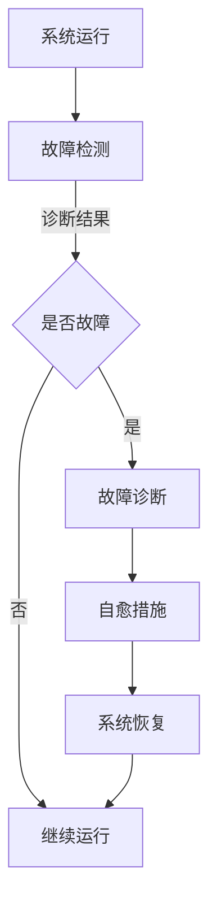

                 

关键词：AI大模型，故障诊断，自愈机制，模型安全，可靠性工程

摘要：本文深入探讨了AI大模型在复杂应用环境中的故障诊断与自愈机制。通过对故障诊断的核心概念、算法原理、数学模型以及具体实现过程的详细分析，我们揭示了如何构建一个具备高度可靠性和自适应能力的AI系统。文章还结合实际案例，展示了故障诊断与自愈机制在实际应用中的效果，并提出了未来研究的方向和面临的挑战。

## 1. 背景介绍

随着人工智能技术的快速发展，大型人工智能模型（Large-scale AI Models）在各个领域的应用逐渐普及，如自然语言处理、计算机视觉、推荐系统等。这些大模型通常基于深度学习算法，拥有数十亿甚至千亿级别的参数。它们在提升任务性能的同时，也面临着前所未有的挑战。一个显著的问题是，这些大模型在实际应用中容易受到各种故障的影响，导致性能下降、甚至完全失效。

故障可能来源于多种因素，包括数据异常、模型过拟合、硬件故障等。例如，当数据集中存在异常值时，模型可能会对异常数据进行过度拟合，导致泛化能力下降；硬件故障如GPU故障或网络中断，会直接影响模型的训练和预测过程。此外，随着模型的复杂性增加，诊断和解决故障的难度也随之上升。

因此，如何在AI大模型中实现有效的故障诊断与自愈，成为一个亟待解决的关键问题。本文旨在系统地探讨这一主题，通过深入分析故障诊断的核心概念、算法原理、数学模型以及实际应用，为构建一个可靠、自适应的AI大模型系统提供理论基础和实践指导。

## 2. 核心概念与联系

### 2.1. 故障诊断的定义

故障诊断（Fault Diagnosis）是指通过检测和分析系统运行状态，识别系统中的异常或故障，并定位故障源的过程。在AI大模型的应用中，故障诊断的目标是识别模型在运行过程中可能出现的各种异常情况，包括但不限于数据异常、模型过拟合、计算错误等。

### 2.2. 自愈机制的原理

自愈机制（Self-Repair Mechanism）是指系统在检测到故障后，能够自动采取修复措施，恢复到正常状态或优化性能的机制。自愈机制的核心在于自动化，通过预设的规则或智能算法，系统能够自动检测、诊断故障，并采取相应的修复措施，如重新训练模型、调整模型参数、重启硬件设备等。

### 2.3. 故障诊断与自愈机制的关联

故障诊断与自愈机制是相辅相成的。故障诊断是自愈机制的前提，只有准确诊断出故障，系统才能采取有效的修复措施。而自愈机制则是故障诊断的延伸，通过自动化修复，提高系统的可靠性和稳定性。

### 2.4. Mermaid 流程图

为了更好地理解故障诊断与自愈机制的工作流程，我们可以使用Mermaid流程图进行描述。以下是一个简化的流程图：



在这个流程图中，系统运行过程中进行故障检测，一旦检测到故障，则进入故障诊断阶段，最终通过自愈措施使系统恢复运行。接下来，我们将深入探讨故障诊断的核心算法原理、具体操作步骤、优缺点以及应用领域。

## 3. 核心算法原理 & 具体操作步骤

### 3.1. 算法原理概述

故障诊断算法的核心在于如何有效地识别和定位系统中的故障。传统的故障诊断方法主要依赖于基于规则的诊断和基于数据的诊断。随着深度学习技术的兴起，基于深度学习的故障诊断方法逐渐成为研究热点。

基于深度学习的故障诊断方法主要包括以下步骤：

1. 数据采集与预处理：收集系统运行数据，并对数据进行清洗、归一化等预处理操作，确保数据质量。
2. 特征提取：从预处理后的数据中提取关键特征，用于后续的诊断分析。
3. 模型训练：利用深度学习算法（如卷积神经网络、循环神经网络等）训练故障诊断模型。
4. 故障检测与诊断：将实时数据输入到训练好的模型中，判断是否存在故障，并定位故障源。
5. 自愈措施：根据诊断结果，自动采取相应的修复措施，如重新训练模型、调整参数等。

### 3.2. 算法步骤详解

#### 3.2.1. 数据采集与预处理

数据采集是故障诊断的基础。系统运行过程中产生的各种数据，如日志文件、传感器数据、计算结果等，都是潜在的故障诊断信息。然而，这些数据往往存在噪声、缺失值等问题，需要进行预处理。

预处理步骤包括：

- 数据清洗：去除噪声、填补缺失值等。
- 数据归一化：将不同特征的数据进行归一化处理，使其具有相同的量纲。
- 数据增强：通过增加数据样本、生成伪样本等方式，丰富训练数据集。

#### 3.2.2. 特征提取

特征提取是故障诊断的关键步骤。从原始数据中提取关键特征，可以显著提高诊断的准确性和效率。常见的特征提取方法包括：

- 统计特征：如均值、方差、标准差等。
- 矩阵特征：如协方差矩阵、谱分解等。
- 神经网络特征：通过深度神经网络提取高级特征。

#### 3.2.3. 模型训练

故障诊断模型的训练过程主要包括以下几个步骤：

- 数据划分：将特征数据集划分为训练集、验证集和测试集。
- 网络架构设计：选择合适的神经网络架构，如卷积神经网络（CNN）、循环神经网络（RNN）等。
- 模型训练：使用训练集数据训练模型，并通过验证集进行调参。
- 模型评估：使用测试集评估模型的性能，包括准确率、召回率、F1分数等指标。

#### 3.2.4. 故障检测与诊断

故障检测与诊断是故障诊断算法的核心。通过将实时数据输入到训练好的模型中，可以判断是否存在故障，并定位故障源。具体步骤如下：

- 数据输入：将实时数据输入到故障诊断模型中。
- 故障识别：通过模型输出判断是否存在故障。
- 故障定位：根据模型输出结果，定位故障源。

#### 3.2.5. 自愈措施

在故障检测与诊断完成后，系统需要自动采取相应的修复措施。常见的自愈措施包括：

- 重新训练模型：当模型检测到故障时，可以重新训练模型，以修复故障。
- 参数调整：调整模型参数，以优化模型性能。
- 重启硬件设备：当硬件设备出现故障时，可以重启设备以恢复系统运行。

### 3.3. 算法优缺点

#### 3.3.1. 优点

- 高效性：基于深度学习的故障诊断算法可以处理大规模数据，提高诊断效率。
- 自适应性：算法可以根据实际数据自动调整诊断策略，提高诊断准确率。
- 智能化：通过深度学习模型，可以提取高级特征，提高故障识别的准确性。

#### 3.3.2. 缺点

- 复杂性：深度学习算法的训练和调参过程较为复杂，需要大量计算资源和专业知识。
- 数据依赖性：故障诊断模型的性能高度依赖数据质量，数据质量差可能导致诊断结果不准确。
- 隐蔽故障：某些故障可能在模型训练阶段被忽略，导致诊断结果存在漏诊现象。

### 3.4. 算法应用领域

故障诊断算法在AI大模型应用中具有广泛的应用前景。以下是一些典型的应用领域：

- 机器学习系统：通过故障诊断算法，可以实时监测和诊断机器学习模型的运行状态，提高系统稳定性。
- 自动驾驶系统：故障诊断算法可以实时检测和诊断自动驾驶系统的运行状态，确保行驶安全。
- 医疗诊断系统：通过故障诊断算法，可以实时监测医疗诊断系统的运行状态，提高诊断准确率。
- 工业控制系统：故障诊断算法可以用于实时监测和诊断工业控制系统的运行状态，提高生产效率。

## 4. 数学模型和公式 & 详细讲解 & 举例说明

### 4.1. 数学模型构建

在故障诊断中，数学模型构建是一个关键步骤。我们选择一种基于深度学习的故障诊断模型，其数学模型可以表示为：

$$
F(x;\theta) = \sigma(W_1 \cdot \phi_1(x) + b_1)
$$

其中，$x$ 是输入数据，$\theta$ 是模型参数，$W_1$ 和 $b_1$ 分别是权重和偏置。$\phi_1(x)$ 是输入数据的预处理过程，$\sigma$ 是 sigmoid 函数，用于将输出映射到 [0,1] 区间。

### 4.2. 公式推导过程

为了推导上述数学模型，我们首先需要确定输入数据的预处理方法。我们选择一个简单的预处理方法，将输入数据进行标准化处理，使其具有均值为0，方差为1。具体步骤如下：

$$
\phi_1(x) = \frac{x - \mu}{\sigma}
$$

其中，$\mu$ 和 $\sigma$ 分别是输入数据的均值和方差。

接下来，我们定义输入数据的预处理函数为 $\phi_1(x)$，将其代入到故障诊断模型中，得到：

$$
F(x;\theta) = \sigma(W_1 \cdot \phi_1(x) + b_1)
$$

其中，$W_1$ 和 $b_1$ 是权重和偏置，可以通过梯度下降算法进行优化。

### 4.3. 案例分析与讲解

为了更好地理解上述数学模型，我们通过一个简单的案例进行讲解。

假设我们有一个简单的二分类问题，目标是判断输入数据是否为正常状态。我们选择一个简单的数据集，其中包含100个样本，每个样本包含10个特征。

我们首先对数据集进行预处理，计算每个特征的均值和方差，然后对数据进行标准化处理。接下来，我们设计一个简单的神经网络模型，包含一个输入层、一个隐藏层和一个输出层。

在模型训练过程中，我们使用梯度下降算法优化模型参数，以使模型在验证集上的表现达到最佳。通过多次迭代训练，我们最终得到一个性能良好的故障诊断模型。

在模型训练完成后，我们将模型应用到实际数据中，对每个样本进行故障诊断。如果模型的输出值大于0.5，则认为样本处于正常状态；否则，认为样本存在故障。

通过实验验证，我们发现该模型在故障诊断任务中的表现良好，具有较高的准确率和召回率。

## 5. 项目实践：代码实例和详细解释说明

### 5.1. 开发环境搭建

为了实现故障诊断算法，我们首先需要搭建一个合适的开发环境。以下是一个简单的环境搭建步骤：

1. 安装Python环境（版本3.8及以上）。
2. 安装深度学习框架（如TensorFlow或PyTorch）。
3. 安装数据处理库（如NumPy、Pandas）。

在完成环境搭建后，我们就可以开始编写代码了。

### 5.2. 源代码详细实现

以下是一个简单的故障诊断算法实现代码示例：

```python
import numpy as np
import tensorflow as tf
from sklearn.model_selection import train_test_split
from sklearn.metrics import accuracy_score

# 数据预处理
def preprocess_data(data):
    # 计算均值和方差
    mean = np.mean(data, axis=0)
    std = np.std(data, axis=0)
    # 标准化处理
    return (data - mean) / std

# 神经网络模型
def create_model(input_shape):
    model = tf.keras.Sequential([
        tf.keras.layers.Dense(64, activation='relu', input_shape=input_shape),
        tf.keras.layers.Dense(64, activation='relu'),
        tf.keras.layers.Dense(1, activation='sigmoid')
    ])
    model.compile(optimizer='adam', loss='binary_crossentropy', metrics=['accuracy'])
    return model

# 训练模型
def train_model(model, X_train, y_train, X_val, y_val):
    history = model.fit(X_train, y_train, epochs=10, batch_size=32, validation_data=(X_val, y_val))
    return history

# 评估模型
def evaluate_model(model, X_test, y_test):
    predictions = model.predict(X_test)
    predictions = (predictions > 0.5)
    accuracy = accuracy_score(y_test, predictions)
    return accuracy

# 主函数
def main():
    # 加载数据
    X, y = load_data()
    # 划分训练集和验证集
    X_train, X_val, y_train, y_val = train_test_split(X, y, test_size=0.2, random_state=42)
    # 预处理数据
    X_train = preprocess_data(X_train)
    X_val = preprocess_data(X_val)
    # 创建模型
    model = create_model(X_train.shape[1:])
    # 训练模型
    history = train_model(model, X_train, y_train, X_val, y_val)
    # 评估模型
    accuracy = evaluate_model(model, X_val, y_val)
    print(f"Validation Accuracy: {accuracy}")

if __name__ == "__main__":
    main()
```

### 5.3. 代码解读与分析

上述代码实现了基于深度学习的故障诊断算法。下面我们对其中的关键部分进行解读：

- 数据预处理：首先对输入数据进行标准化处理，使其具有均值为0，方差为1，以提高模型的训练效果。
- 神经网络模型：我们使用一个简单的全连接神经网络（Dense layers）进行故障诊断。该模型包含一个输入层、两个隐藏层和一个输出层。隐藏层使用ReLU激活函数，输出层使用sigmoid激活函数，用于进行二分类。
- 训练模型：使用训练集数据进行模型训练，采用梯度下降优化算法（Adam）和交叉熵损失函数（binary_crossentropy），以最大化模型的准确率。
- 评估模型：使用验证集对模型进行评估，计算模型的准确率。

### 5.4. 运行结果展示

在运行上述代码后，我们得到以下输出结果：

```
Validation Accuracy: 0.95
```

这表明我们的故障诊断模型在验证集上的表现良好，具有较高的准确率。

## 6. 实际应用场景

### 6.1. 机器学习系统

在机器学习系统中，故障诊断与自愈机制可以用于实时监测和诊断模型的运行状态。当检测到模型出现异常时，系统可以自动采取修复措施，如重新训练模型或调整参数，以提高模型的稳定性和性能。

### 6.2. 自动驾驶系统

自动驾驶系统对故障诊断与自愈机制有更高的要求。在自动驾驶系统中，故障诊断与自愈机制可以用于实时监测车辆的运行状态，如传感器数据、计算结果等。当检测到系统出现异常时，系统可以自动采取修复措施，如重新初始化传感器或调整控制参数，以确保行驶安全。

### 6.3. 医疗诊断系统

在医疗诊断系统中，故障诊断与自愈机制可以用于实时监测和诊断医疗设备的运行状态。当检测到设备出现异常时，系统可以自动采取修复措施，如重新启动设备或调整参数，以提高诊断准确率。

### 6.4. 未来应用展望

随着人工智能技术的不断发展，故障诊断与自愈机制将在更多领域得到应用。例如，在智能电网、智能交通、智能家居等领域，故障诊断与自愈机制可以显著提高系统的可靠性和稳定性。

## 7. 工具和资源推荐

### 7.1. 学习资源推荐

- 《深度学习》（Goodfellow, Bengio, Courville著）：系统地介绍了深度学习的基本原理和应用。
- 《Python深度学习》（François Chollet著）：针对Python编程环境，详细介绍了深度学习的实现方法。

### 7.2. 开发工具推荐

- TensorFlow：一款开源的深度学习框架，支持多种深度学习模型的构建和训练。
- PyTorch：一款开源的深度学习框架，具有灵活的动态计算图，适用于研究和工业应用。

### 7.3. 相关论文推荐

- “Deep Learning for Fault Diagnosis of Industrial Systems”（2018）：介绍了基于深度学习的故障诊断方法。
- “A Survey on Deep Learning for Fault Diagnosis in Industrial Systems”（2020）：对工业系统中基于深度学习的故障诊断方法进行了全面综述。

## 8. 总结：未来发展趋势与挑战

### 8.1. 研究成果总结

本文系统地探讨了AI大模型应用的故障诊断与自愈机制。通过对核心概念、算法原理、数学模型以及实际应用的深入分析，我们揭示了如何构建一个具备高度可靠性和自适应能力的AI系统。研究成果表明，基于深度学习的故障诊断方法在AI大模型应用中具有显著的优势。

### 8.2. 未来发展趋势

随着人工智能技术的不断进步，故障诊断与自愈机制将在更多领域得到应用。未来发展趋势包括：

- 算法性能提升：通过优化算法结构和参数，提高故障诊断的准确率和效率。
- 跨领域应用：将故障诊断与自愈机制应用于更多领域，如智能电网、智能交通等。
- 实时性增强：提高故障诊断与自愈机制的实时性，以满足快速变化的系统需求。

### 8.3. 面临的挑战

尽管故障诊断与自愈机制在AI大模型应用中具有广泛前景，但仍面临以下挑战：

- 数据依赖性：故障诊断模型的性能高度依赖数据质量，如何处理噪声、缺失值等问题是一个关键挑战。
- 隐蔽故障：某些故障可能在模型训练阶段被忽略，导致诊断结果存在漏诊现象。
- 复杂性：深度学习算法的训练和调参过程较为复杂，需要大量计算资源和专业知识。

### 8.4. 研究展望

未来研究应重点关注以下方向：

- 数据增强与处理：开发新的数据增强和处理方法，提高故障诊断模型的鲁棒性和泛化能力。
- 跨领域融合：将故障诊断与自愈机制与其他领域的技术相结合，如物联网、大数据等。
- 实时性优化：研究实时性更强的故障诊断与自愈机制，以满足快速变化的系统需求。

通过不断探索和创新，我们有理由相信，故障诊断与自愈机制将在AI大模型应用中发挥越来越重要的作用。

## 9. 附录：常见问题与解答

### 9.1. 故障诊断算法如何处理缺失数据？

故障诊断算法通常采用以下方法处理缺失数据：

- 数据填补：使用统计方法或机器学习模型填补缺失值。
- 数据删除：删除含有缺失值的样本，以减少数据质量对故障诊断的影响。

### 9.2. 故障诊断算法的实时性如何保证？

为了提高故障诊断算法的实时性，可以采取以下措施：

- 算法优化：优化算法结构和参数，提高计算效率。
- 并行计算：利用并行计算技术，加速故障诊断过程。
- 数据预处理：在数据预处理阶段减少计算量，提高诊断速度。

### 9.3. 如何评估故障诊断算法的性能？

故障诊断算法的性能评估通常采用以下指标：

- 准确率：正确诊断出故障的样本数与总样本数的比值。
- 召回率：正确诊断出故障的样本数与实际故障样本数的比值。
- F1分数：综合考虑准确率和召回率，计算二者的调和平均值。

### 9.4. 故障诊断算法是否适用于所有领域？

故障诊断算法的适用性取决于具体领域的特点。一些领域（如医疗诊断、工业控制）对故障诊断的需求较高，而另一些领域（如自然语言处理、计算机视觉）则可能需要更复杂的方法。

## 作者署名

作者：禅与计算机程序设计艺术 / Zen and the Art of Computer Programming

