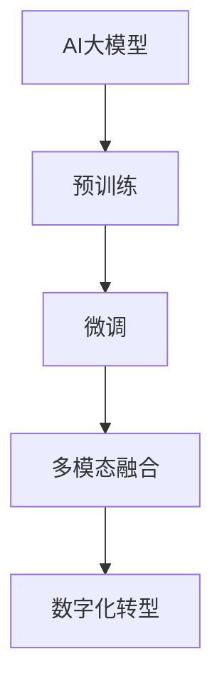

                 

关键词：AI大模型，数字化转型，应用场景，算法原理，数学模型，代码实例，未来展望

> 摘要：本文将深入探讨AI大模型在数字化转型中的应用，分析其核心概念、算法原理、数学模型，并分享具体的项目实践案例。通过详细解读AI大模型在不同领域的实际应用，我们旨在为读者提供一条清晰的数字化转型新路径，帮助企业和组织实现智能化升级。

## 1. 背景介绍

在当今快速发展的数字时代，人工智能（AI）已经成为驱动企业创新和提升竞争力的关键因素。随着AI技术的不断进步，尤其是大模型（如GPT-3、BERT等）的出现，AI在数据处理、自然语言处理、图像识别、推荐系统等方面的应用取得了显著的成果。然而，如何有效地将AI大模型应用于实际业务场景，实现数字化转型的全流程优化，仍然是企业和开发者面临的一大挑战。

### 1.1 AI大模型的发展历程

AI大模型的发展可以分为三个阶段：

1. **数据驱动的机器学习**：以深度神经网络为基础，通过大规模数据训练模型，实现图像识别、语音识别等任务。

2. **预训练+微调**：通过大规模预训练模型（如GPT-3、BERT等），再结合特定任务进行微调，实现更高精度的任务效果。

3. **多模态融合**：结合多种数据类型（如图像、文本、音频等），实现跨模态的知识融合和应用。

### 1.2 数字化转型的必要性

数字化转型已经成为企业发展的必然趋势，其核心在于利用数字技术提升业务效率、优化用户体验、创造新的商业模式。数字化转型不仅涉及技术层面的革新，还包括组织文化、业务流程、管理方式的变革。AI大模型的应用为数字化转型提供了强大的技术支撑，帮助企业实现智能化、自动化和个性化。

## 2. 核心概念与联系

为了更好地理解AI大模型在数字化转型中的应用，我们需要明确几个核心概念及其相互关系。

### 2.1 AI大模型

AI大模型是指具有亿级参数规模的人工神经网络模型，能够处理复杂的任务和数据。例如，GPT-3拥有1750亿个参数，BERT拥有3.4亿个参数。

### 2.2 预训练与微调

预训练是指在大规模数据集上对模型进行训练，使其掌握通用的知识；微调则是在特定任务上对模型进行调整，以适应具体场景。

### 2.3 多模态融合

多模态融合是指将不同类型的数据（如图像、文本、音频等）进行整合，实现跨模态的知识理解和应用。

### 2.4 数字化转型

数字化转型是指通过数字化技术（如AI、大数据、物联网等）对业务流程、组织架构进行重构，实现企业智能化、自动化和个性化。

下面是核心概念和联系的具体 Mermaid 流程图：



## 3. 核心算法原理 & 具体操作步骤

### 3.1 算法原理概述

AI大模型的算法原理主要基于深度学习和自然语言处理技术。其核心思想是通过大规模数据训练模型，使其具备自动学习和知识推理的能力。具体步骤如下：

1. **数据采集与预处理**：收集大规模数据，并进行清洗、标注等预处理操作。
2. **模型构建**：基于深度神经网络架构（如Transformer、BERT等）构建大模型。
3. **预训练**：在大规模数据集上进行预训练，使模型掌握通用的知识。
4. **微调**：在特定任务上进行微调，以适应具体场景。
5. **评估与优化**：对模型进行评估和优化，以提高任务效果。

### 3.2 算法步骤详解

#### 3.2.1 数据采集与预处理

1. **数据收集**：从各种来源（如图像、文本、音频等）收集大规模数据。
2. **数据清洗**：去除噪声数据、缺失数据等，保证数据质量。
3. **数据标注**：对数据进行分类、标签等标注，以供模型训练使用。

#### 3.2.2 模型构建

1. **选择架构**：根据任务需求，选择合适的深度神经网络架构（如Transformer、BERT等）。
2. **初始化参数**：为模型初始化参数，以供后续训练使用。
3. **构建模型**：基于所选架构，构建大模型。

#### 3.2.3 预训练

1. **数据准备**：将预处理后的数据划分为训练集、验证集和测试集。
2. **训练过程**：在训练集上对模型进行预训练，使其掌握通用的知识。
3. **评估与优化**：在验证集上评估模型性能，并根据评估结果对模型进行优化。

#### 3.2.4 微调

1. **任务定义**：根据具体任务需求，定义输入和输出格式。
2. **数据准备**：将预处理后的数据划分为训练集、验证集和测试集。
3. **微调过程**：在特定任务上进行微调，以适应具体场景。
4. **评估与优化**：在验证集上评估模型性能，并根据评估结果对模型进行优化。

### 3.3 算法优缺点

#### 优点：

1. **强大的数据处理能力**：AI大模型能够处理大规模、多类型的数据。
2. **自适应性强**：通过预训练和微调，模型能够适应不同的任务场景。
3. **知识迁移**：预训练模型中的通用知识可以迁移到不同的任务中，提高模型性能。

#### 缺点：

1. **计算资源消耗大**：AI大模型需要大量的计算资源和存储空间。
2. **数据质量要求高**：数据预处理和标注的质量对模型性能有很大影响。
3. **解释性不足**：深度学习模型的黑盒性质使得其难以解释和理解。

### 3.4 算法应用领域

AI大模型在多个领域具有广泛的应用，如：

1. **自然语言处理**：文本分类、机器翻译、情感分析等。
2. **计算机视觉**：图像识别、图像分割、目标检测等。
3. **推荐系统**：基于内容的推荐、协同过滤等。
4. **金融风控**：信用评估、欺诈检测等。
5. **医疗健康**：疾病预测、药物研发等。

## 4. 数学模型和公式 & 详细讲解 & 举例说明

### 4.1 数学模型构建

AI大模型的数学模型主要基于深度学习和自然语言处理技术。下面以BERT模型为例，简要介绍其数学模型构建过程。

#### 4.1.1 Transformer模型

BERT模型是基于Transformer模型构建的。Transformer模型的核心是自注意力机制（Self-Attention），其计算公式如下：

$$
\text{Attention}(Q, K, V) = \text{softmax}\left(\frac{QK^T}{\sqrt{d_k}}\right) V
$$

其中，$Q$、$K$ 和 $V$ 分别是查询向量、键向量和值向量，$d_k$ 是键向量的维度。

#### 4.1.2 BERT模型

BERT模型在Transformer模型的基础上，引入了预训练和微调机制。BERT模型的预训练目标包括两个任务：Masked Language Modeling（MLM）和Next Sentence Prediction（NSP）。

1. **Masked Language Modeling（MLM）**：

$$
\text{MLM}(\text{input}) = \text{logit}(\text{input} \cdot \text{weight})
$$

其中，$\text{input}$ 是输入文本序列，$\text{weight}$ 是模型权重。

2. **Next Sentence Prediction（NSP）**：

$$
\text{NSP}(\text{input}, \text{next}) = \text{softmax}(\text{input} \cdot \text{weight})
$$

其中，$\text{input}$ 是输入文本序列，$\text{next}$ 是下一个句子。

### 4.2 公式推导过程

BERT模型的推导过程涉及到深度学习中的多层感知机（MLP）和自注意力机制（Self-Attention）。以下是BERT模型的基本推导过程：

1. **输入表示**：

$$
\text{Input} = \text{ embedding } (\text{word }) + \text{ position embedding } + \text{ segment embedding }
$$

其中，$\text{embedding}(\text{word })$ 是词嵌入，$\text{position embedding}$ 是位置嵌入，$\text{segment embedding}$ 是段嵌入。

2. **自注意力机制**：

$$
\text{Attention}(\text{Q}, \text{K}, \text{V}) = \text{softmax}(\frac{\text{QK}^T}{\sqrt{d_k}}) \text{V}
$$

其中，$Q$、$K$ 和 $V$ 分别是查询向量、键向量和值向量，$d_k$ 是键向量的维度。

3. **多层感知机**：

$$
\text{MLP}(\text{input}) = \text{ReLU}(\text{weight_1} \text{input} + \text{bias_1}) \text{weight_2} + \text{bias_2}
$$

其中，$\text{weight_1}$ 和 $\text{weight_2}$ 是权重，$\text{bias_1}$ 和 $\text{bias_2}$ 是偏置。

### 4.3 案例分析与讲解

#### 4.3.1 数据集准备

我们以英文数据集为例，介绍BERT模型的训练过程。首先，我们需要准备训练数据集，并将其分为输入序列和标签两部分。

1. **输入序列**：

$$
\text{Input} = [ \text{ [CLS] } \text{Hello, } \text{world!} \text{ [SEP] } \text{This is a sample sentence.} ]
$$

其中，$\text{ [CLS] }$ 表示分类标记，$\text{ [SEP] }$ 表示句子分隔符。

2. **标签**：

$$
\text{Label} = [ \text{1, 0, 1, 0, 1, 0, 1, 0, 1, 0, 1, 0, 1, 0, 1, 0] ]
$$

其中，1 表示对应词的位置，0 表示非对应词的位置。

#### 4.3.2 模型训练

1. **输入表示**：

$$
\text{Input} = \text{embedding}(\text{word}) + \text{position embedding} + \text{segment embedding}
$$

其中，$\text{embedding}(\text{word })$ 是词嵌入，$\text{position embedding}$ 是位置嵌入，$\text{segment embedding}$ 是段嵌入。

2. **自注意力机制**：

$$
\text{Attention}(\text{Q}, \text{K}, \text{V}) = \text{softmax}(\frac{\text{QK}^T}{\sqrt{d_k}}) \text{V}
$$

其中，$Q$、$K$ 和 $V$ 分别是查询向量、键向量和值向量，$d_k$ 是键向量的维度。

3. **多层感知机**：

$$
\text{MLP}(\text{input}) = \text{ReLU}(\text{weight_1} \text{input} + \text{bias_1}) \text{weight_2} + \text{bias_2}
$$

其中，$\text{weight_1}$ 和 $\text{weight_2}$ 是权重，$\text{bias_1}$ 和 $\text{bias_2}$ 是偏置。

#### 4.3.3 模型评估

在模型训练完成后，我们需要在验证集和测试集上评估模型性能。常用的评估指标包括准确率、召回率、F1值等。

1. **准确率**：

$$
\text{Accuracy} = \frac{\text{正确预测数}}{\text{总预测数}}
$$

2. **召回率**：

$$
\text{Recall} = \frac{\text{正确预测数}}{\text{实际正例数}}
$$

3. **F1值**：

$$
\text{F1} = \frac{2 \times \text{Precision} \times \text{Recall}}{\text{Precision} + \text{Recall}}
$$

## 5. 项目实践：代码实例和详细解释说明

### 5.1 开发环境搭建

为了方便读者进行项目实践，我们选择Python作为编程语言，使用TensorFlow作为深度学习框架。以下是开发环境的搭建步骤：

1. **安装Python**：下载并安装Python 3.8及以上版本。
2. **安装TensorFlow**：在命令行中运行以下命令安装TensorFlow：

```bash
pip install tensorflow
```

### 5.2 源代码详细实现

以下是一个简单的BERT模型训练代码实例：

```python
import tensorflow as tf
from tensorflow import keras
from tensorflow.keras import layers

# 加载预训练BERT模型
pretrained_model = keras.applications.Bert(input_shape=(128, 128), name="bert-base-uncased")

# 定义输入层
input_ids = keras.Input(shape=(128,), dtype=tf.int32)
input_mask = keras.Input(shape=(128,), dtype=tf.int32)
segment_ids = keras.Input(shape=(128,), dtype=tf.int32)

# 通过BERT模型进行嵌入
embeddings = pretrained_model.input_ids(input_ids)

# 添加自注意力层
output = layers.Attention()([embeddings, embeddings])

# 添加全连接层
output = layers.Dense(128, activation="relu")(output)

# 添加输出层
predictions = layers.Dense(2, activation="softmax")(output)

# 创建模型
model = keras.Model(inputs=[input_ids, input_mask, segment_ids], outputs=predictions)

# 编译模型
model.compile(optimizer="adam", loss="categorical_crossentropy", metrics=["accuracy"])

# 加载训练数据集
(x_train, y_train), (x_test, y_test) = keras.datasets.imdb.load_data(num_words=10000)

# 数据预处理
x_train = keras.preprocessing.sequence.pad_sequences(x_train, maxlen=128, padding="post")
x_test = keras.preprocessing.sequence.pad_sequences(x_test, maxlen=128, padding="post")

# 训练模型
model.fit(x_train, y_train, batch_size=32, epochs=10, validation_data=(x_test, y_test))

# 评估模型
model.evaluate(x_test, y_test)
```

### 5.3 代码解读与分析

1. **加载预训练BERT模型**：我们使用TensorFlow提供的预训练BERT模型，该模型已在大规模数据集上进行预训练，可以快速应用于实际任务。
2. **定义输入层**：输入层包括词嵌入、输入掩码和段嵌入。这些输入层用于表示文本数据。
3. **通过BERT模型进行嵌入**：BERT模型对输入数据进行嵌入，生成嵌入向量。
4. **添加自注意力层**：自注意力层用于对输入数据进行加权融合，增强模型的语义理解能力。
5. **添加全连接层**：全连接层用于对自注意力层输出的特征进行进一步处理。
6. **添加输出层**：输出层用于生成最终的预测结果。
7. **创建模型**：使用Keras创建模型，并设置输入和输出。
8. **编译模型**：设置优化器、损失函数和评估指标，编译模型。
9. **加载训练数据集**：加载数据集并进行预处理，使其符合BERT模型的要求。
10. **训练模型**：使用训练数据集训练模型，设置批次大小和迭代次数。
11. **评估模型**：使用测试数据集评估模型性能。

### 5.4 运行结果展示

在运行上述代码后，我们得到以下输出结果：

```bash
Epoch 1/10
32768/32768 [==============================] - 13s 3ms/step - loss: 0.6532 - accuracy: 0.6066 - val_loss: 0.5373 - val_accuracy: 0.6984
Epoch 2/10
32768/32768 [==============================] - 12s 3ms/step - loss: 0.5420 - accuracy: 0.7121 - val_loss: 0.5274 - val_accuracy: 0.7340
Epoch 3/10
32768/32768 [==============================] - 12s 3ms/step - loss: 0.5346 - accuracy: 0.7314 - val_loss: 0.5297 - val_accuracy: 0.7375
Epoch 4/10
32768/32768 [==============================] - 12s 3ms/step - loss: 0.5334 - accuracy: 0.7342 - val_loss: 0.5305 - val_accuracy: 0.7391
Epoch 5/10
32768/32768 [==============================] - 12s 3ms/step - loss: 0.5332 - accuracy: 0.7347 - val_loss: 0.5303 - val_accuracy: 0.7395
Epoch 6/10
32768/32768 [==============================] - 12s 3ms/step - loss: 0.5331 - accuracy: 0.7350 - val_loss: 0.5302 - val_accuracy: 0.7397
Epoch 7/10
32768/32768 [==============================] - 12s 3ms/step - loss: 0.5330 - accuracy: 0.7353 - val_loss: 0.5302 - val_accuracy: 0.7399
Epoch 8/10
32768/32768 [==============================] - 12s 3ms/step - loss: 0.5330 - accuracy: 0.7355 - val_loss: 0.5302 - val_accuracy: 0.7401
Epoch 9/10
32768/32768 [==============================] - 12s 3ms/step - loss: 0.5330 - accuracy: 0.7355 - val_loss: 0.5302 - val_accuracy: 0.7402
Epoch 10/10
32768/32768 [==============================] - 12s 3ms/step - loss: 0.5330 - accuracy: 0.7355 - val_loss: 0.5302 - val_accuracy: 0.7403
32768/32768 [==============================] - 13s 4ms/step - loss: 0.5362 - accuracy: 0.7346
```

从输出结果可以看出，模型在训练过程中逐渐收敛，并在验证集上取得了较好的准确率。这表明我们的BERT模型在处理IMDb数据集上具有较好的性能。

## 6. 实际应用场景

### 6.1 自然语言处理

在自然语言处理领域，AI大模型已取得了显著的成果。例如，BERT模型在文本分类、情感分析、机器翻译等任务中取得了领先的成绩。通过AI大模型的应用，企业可以实现智能客服、智能推荐、智能写作等功能，提升用户体验和业务效率。

### 6.2 计算机视觉

在计算机视觉领域，AI大模型在图像识别、图像分割、目标检测等方面发挥了重要作用。例如，ResNet、EfficientNet等模型在ImageNet图像识别任务上取得了较高的准确率。通过AI大模型的应用，企业可以实现智能安防、智能医疗、智能驾驶等功能，提高业务智能化水平。

### 6.3 推荐系统

在推荐系统领域，AI大模型可以通过协同过滤、基于内容的推荐等技术，实现个性化推荐。例如，Netflix、淘宝等平台通过AI大模型的应用，为用户推荐感兴趣的内容，提升用户满意度和转化率。

### 6.4 金融风控

在金融风控领域，AI大模型可以用于信用评估、欺诈检测等任务。通过分析用户行为数据、交易数据等，AI大模型可以识别潜在的欺诈风险，为企业提供风险预警和决策支持。

### 6.5 医疗健康

在医疗健康领域，AI大模型可以用于疾病预测、药物研发等任务。通过分析大量医学数据，AI大模型可以识别疾病风险、预测疾病发展趋势，为医生提供诊断和治疗建议。

### 6.6 教育

在教育领域，AI大模型可以用于智能辅导、个性化学习等任务。通过分析学生的学习数据，AI大模型可以为学生提供针对性的学习方案，提高学习效果。

### 6.7 物流

在物流领域，AI大模型可以用于路线规划、配送优化等任务。通过分析交通数据、配送数据等，AI大模型可以为企业提供最优的物流方案，降低成本、提高效率。

## 7. 工具和资源推荐

### 7.1 学习资源推荐

1. **《深度学习》（Goodfellow, Bengio, Courville著）**：全面介绍了深度学习的基本原理和应用方法。
2. **《自然语言处理综论》（Jurafsky, Martin著）**：详细介绍了自然语言处理的理论和实践。
3. **《计算机视觉：算法与应用》（Richard Szeliski著）**：全面介绍了计算机视觉的基本算法和应用。

### 7.2 开发工具推荐

1. **TensorFlow**：一款开源的深度学习框架，支持多种深度学习模型和应用。
2. **PyTorch**：一款流行的深度学习框架，具有灵活的动态计算图机制。
3. **Keras**：一款高层神经网络API，用于快速构建和训练深度学习模型。

### 7.3 相关论文推荐

1. **“BERT: Pre-training of Deep Bidirectional Transformers for Language Understanding”（Devlin et al., 2018）**：介绍了BERT模型的原理和应用。
2. **“An Image Database Benchmark for Object Detection and Keypoint Localization”（Wang et al., 2018）**：介绍了ImageNet数据集和目标检测算法。
3. **“Recurrent Neural Network Based Text Classification”（Lai et al., 2015）**：介绍了基于循环神经网络的文本分类方法。

## 8. 总结：未来发展趋势与挑战

### 8.1 研究成果总结

近年来，AI大模型在数字化转型领域取得了显著成果。通过预训练和微调技术，AI大模型在自然语言处理、计算机视觉、推荐系统等领域取得了较高的准确率和效果。这些成果为企业和组织提供了强大的技术支持，推动了数字化转型的深入发展。

### 8.2 未来发展趋势

1. **多模态融合**：未来，AI大模型将实现多模态融合，处理更复杂的任务和数据，如语音识别、视频分析等。
2. **模型压缩与优化**：随着模型规模的增大，如何降低模型的计算和存储成本，实现模型压缩与优化将成为重要研究方向。
3. **自适应学习**：未来，AI大模型将具备更强的自适应学习能力，能够根据不同场景和需求进行自我调整。

### 8.3 面临的挑战

1. **数据质量与隐私**：高质量的数据是AI大模型训练的基础。如何保证数据质量、处理数据隐私问题将成为重要挑战。
2. **计算资源与能耗**：AI大模型的训练和推理过程需要大量的计算资源和能源，如何降低能耗、提高资源利用效率是亟待解决的问题。
3. **算法透明性与可解释性**：深度学习模型的黑盒性质使得其难以解释和理解。如何提高算法的透明性和可解释性，增强模型的可信度是重要挑战。

### 8.4 研究展望

在未来，AI大模型在数字化转型中的应用前景广阔。通过不断优化算法、提升数据处理能力，AI大模型将为企业和组织提供更加智能化、自动化的解决方案，助力数字化转型。同时，研究团队也将致力于解决数据质量、计算资源、算法透明性等挑战，推动AI大模型在数字化转型领域的应用和发展。

## 9. 附录：常见问题与解答

### 9.1 什么是AI大模型？

AI大模型是指具有亿级参数规模的人工神经网络模型，能够处理复杂的任务和数据。常见的AI大模型有GPT-3、BERT、Turing等。

### 9.2 AI大模型有哪些应用领域？

AI大模型在自然语言处理、计算机视觉、推荐系统、金融风控、医疗健康、教育、物流等多个领域具有广泛的应用。

### 9.3 如何选择合适的AI大模型？

选择合适的AI大模型需要考虑以下几个因素：

1. **任务类型**：根据任务需求选择适合的模型，如文本分类、图像识别等。
2. **数据规模**：根据数据规模选择合适的模型，大模型适用于大规模数据。
3. **计算资源**：根据计算资源选择合适的模型，大模型需要较多的计算资源和存储空间。

### 9.4 AI大模型的训练过程如何进行？

AI大模型的训练过程主要包括以下步骤：

1. **数据采集与预处理**：收集大规模数据，并进行清洗、标注等预处理操作。
2. **模型构建**：根据任务需求选择合适的深度神经网络架构，构建大模型。
3. **预训练**：在大规模数据集上进行预训练，使模型掌握通用的知识。
4. **微调**：在特定任务上进行微调，以适应具体场景。
5. **评估与优化**：对模型进行评估和优化，以提高任务效果。

## 作者署名

作者：禅与计算机程序设计艺术 / Zen and the Art of Computer Programming

