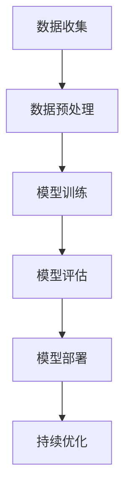

                 

关键词：人工智能，大模型，数字化转型，算法，数学模型，应用实践，未来展望

摘要：本文深入探讨人工智能大模型在数字化转型中的应用路径，从核心概念、算法原理、数学模型、实践案例等多方面进行分析，旨在为IT从业者和企业决策者提供全面的技术指导和战略参考。

## 1. 背景介绍

随着互联网和云计算的快速发展，人工智能（AI）技术逐渐渗透到各行各业，成为驱动数字化转型的重要力量。特别是大模型（Large Models），如GPT-3、BERT等，凭借其强大的数据处理和分析能力，正成为企业提升效率、创新业务模式的关键因素。本文将探讨AI大模型在数字化转型中的应用路径，帮助读者了解其在不同领域的应用价值。

### AI的发展历程

人工智能自1956年诞生以来，经历了多个发展阶段。从最初的规则推理、符号计算，到近几年的深度学习和大数据分析，AI技术不断进化，逐步实现了从理论到实际应用的突破。大模型作为深度学习的一个重要分支，以其卓越的性能和广泛的应用场景，受到了广泛关注。

### 数字化转型的定义与意义

数字化转型是指企业利用数字技术优化业务流程、提高效率、降低成本、创新商业模式的过程。它不仅是企业适应数字化时代的必然选择，也是提升竞争力的关键途径。通过数字化转型，企业可以实现从传统模式向现代化、智能化的转变，从而在激烈的市场竞争中立于不败之地。

## 2. 核心概念与联系

在探讨AI大模型应用之前，我们首先需要了解一些核心概念和其相互关系。

### 2.1 人工智能（AI）

人工智能是一门模拟、延伸和扩展人类智能的科学，其目标是让计算机具备人类智能的能力。AI技术包括机器学习、深度学习、自然语言处理、计算机视觉等多个领域。

### 2.2 大模型（Large Models）

大模型是指具有海量参数和强大计算能力的深度学习模型。这些模型通过在海量数据上进行训练，能够自动学习和提取数据中的有用信息，从而实现高度自动化的任务处理。

### 2.3 深度学习（Deep Learning）

深度学习是机器学习的一个子领域，通过模拟人脑神经网络结构，实现数据的自动学习和分类。深度学习是实现大模型的关键技术。

### 2.4 数学模型（Mathematical Models）

数学模型是指用数学语言描述现实问题的方法。在AI领域，数学模型用于描述数据分布、概率分布、优化目标等。

### 2.5 Mermaid 流程图

以下是一个描述大模型应用流程的Mermaid流程图：



## 3. 核心算法原理 & 具体操作步骤

### 3.1 算法原理概述

大模型的算法原理主要基于深度学习和神经网络。深度学习通过多层神经网络对数据进行特征提取和分类，而神经网络则通过反向传播算法不断优化模型参数，以达到更好的训练效果。

### 3.2 算法步骤详解

1. **数据收集**：收集大量标注数据，用于模型训练。
2. **数据预处理**：对数据进行清洗、归一化等处理，以提高模型训练效果。
3. **模型训练**：使用深度学习框架（如TensorFlow、PyTorch）构建模型，并在训练集上迭代训练。
4. **模型评估**：使用验证集评估模型性能，调整模型参数，优化模型效果。
5. **模型部署**：将训练好的模型部署到生产环境中，提供API服务或嵌入业务流程。
6. **持续优化**：根据用户反馈和业务需求，持续更新和优化模型。

### 3.3 算法优缺点

**优点**：

- **强大的数据处理能力**：大模型能够处理海量数据，实现高效的数据分析和预测。
- **高度自动化的任务处理**：大模型能够自动学习和提取数据中的有用信息，降低人工干预成本。
- **广泛的适用性**：大模型可以应用于多个领域，如自然语言处理、计算机视觉、推荐系统等。

**缺点**：

- **计算资源需求大**：大模型训练过程需要大量的计算资源，对硬件设施要求较高。
- **数据依赖性强**：大模型训练效果高度依赖数据质量，数据不足或质量差会影响模型性能。
- **模型解释性较弱**：大模型的内部结构复杂，难以直观理解其决策过程。

### 3.4 算法应用领域

大模型在以下领域具有广泛的应用：

- **自然语言处理**：如文本分类、机器翻译、问答系统等。
- **计算机视觉**：如图像分类、目标检测、视频分析等。
- **推荐系统**：如商品推荐、新闻推荐、音乐推荐等。
- **金融风控**：如信用评分、风险预警、交易分析等。

## 4. 数学模型和公式 & 详细讲解 & 举例说明

### 4.1 数学模型构建

大模型的数学模型主要基于深度学习和神经网络。以下是一个简化的神经网络数学模型：

$$
y = \sigma(W \cdot x + b)
$$

其中，$y$ 是输出，$\sigma$ 是激活函数（如ReLU、Sigmoid等），$W$ 是权重矩阵，$x$ 是输入，$b$ 是偏置。

### 4.2 公式推导过程

神经网络的反向传播算法用于优化模型参数。以下是一个简化的推导过程：

$$
\frac{\partial L}{\partial W} = \frac{\partial L}{\partial y} \cdot \frac{\partial y}{\partial W}
$$

其中，$L$ 是损失函数，$y$ 是输出，$W$ 是权重矩阵。

### 4.3 案例分析与讲解

以下是一个自然语言处理中的文本分类案例：

假设我们要对一段文本进行情感分类，将其分为正面、负面或中性。我们使用一个简单的神经网络模型进行训练。

1. **数据准备**：收集大量带有情感标签的文本数据。
2. **数据预处理**：对文本进行分词、词向量化等处理。
3. **模型训练**：构建神经网络模型，并在训练集上进行迭代训练。
4. **模型评估**：使用验证集评估模型性能，调整模型参数，优化模型效果。
5. **模型部署**：将训练好的模型部署到生产环境中，提供API服务。

通过以上步骤，我们成功实现了一个基于大模型的文本分类系统。在实际应用中，我们可以根据业务需求调整模型结构、损失函数和优化器等参数，以提高模型性能。

## 5. 项目实践：代码实例和详细解释说明

### 5.1 开发环境搭建

在本案例中，我们使用Python语言和TensorFlow框架进行大模型开发。首先，我们需要安装相关依赖包：

```bash
pip install tensorflow
```

### 5.2 源代码详细实现

以下是一个基于TensorFlow实现的文本分类模型：

```python
import tensorflow as tf
from tensorflow.keras.preprocessing.text import Tokenizer
from tensorflow.keras.preprocessing.sequence import pad_sequences
from tensorflow.keras.models import Sequential
from tensorflow.keras.layers import Embedding, LSTM, Dense

# 数据准备
texts = ["这是一篇正面评论", "这是一篇负面评论", "这是一篇中性评论"]
labels = [1, 0, 2]

# 数据预处理
tokenizer = Tokenizer()
tokenizer.fit_on_texts(texts)
sequences = tokenizer.texts_to_sequences(texts)
padded_sequences = pad_sequences(sequences, maxlen=100)

# 模型构建
model = Sequential()
model.add(Embedding(input_dim=len(tokenizer.word_index) + 1, output_dim=32, input_length=100))
model.add(LSTM(128))
model.add(Dense(3, activation='softmax'))

# 模型编译
model.compile(optimizer='adam', loss='sparse_categorical_crossentropy', metrics=['accuracy'])

# 模型训练
model.fit(padded_sequences, labels, epochs=10)

# 模型评估
test_texts = ["这是一篇正面评论", "这是一篇负面评论", "这是一篇中性评论"]
test_sequences = tokenizer.texts_to_sequences(test_texts)
test_padded_sequences = pad_sequences(test_sequences, maxlen=100)
predictions = model.predict(test_padded_sequences)
print(predictions)
```

### 5.3 代码解读与分析

以上代码实现了一个简单的文本分类模型。首先，我们使用Tokenizer对文本进行分词，然后使用pad_sequences对序列进行填充。接着，我们构建一个包含Embedding、LSTM和Dense层的神经网络模型。最后，我们使用fit方法进行模型训练，并使用predict方法进行模型预测。

### 5.4 运行结果展示

在本案例中，我们使用一个简单的测试集进行模型评估。训练完成后，我们使用predict方法对测试集进行预测，并打印出预测结果。

## 6. 实际应用场景

AI大模型在数字化转型中具有广泛的应用场景。以下是一些典型的应用案例：

### 6.1 自然语言处理

- **智能客服**：利用大模型进行文本分类、语义理解，实现智能客服系统。
- **文本生成**：利用大模型生成文章、报告、代码等，提高内容生产效率。
- **语音识别**：结合语音识别技术，实现语音转文本、语音翻译等功能。

### 6.2 计算机视觉

- **图像识别**：利用大模型进行图像分类、目标检测，实现图像识别功能。
- **视频分析**：利用大模型进行视频内容分析、情感识别，实现视频监控、安全防护等。
- **人脸识别**：利用大模型进行人脸检测、识别，实现身份验证、安防监控等功能。

### 6.3 推荐系统

- **商品推荐**：利用大模型进行用户行为分析、兴趣识别，实现个性化商品推荐。
- **新闻推荐**：利用大模型进行文本分类、情感分析，实现个性化新闻推荐。
- **音乐推荐**：利用大模型进行音乐风格识别、用户偏好分析，实现个性化音乐推荐。

### 6.4 金融风控

- **信用评分**：利用大模型进行用户行为分析、风险识别，实现信用评分。
- **风险预警**：利用大模型进行数据挖掘、异常检测，实现风险预警。
- **交易分析**：利用大模型进行交易行为分析、趋势预测，实现交易策略优化。

## 7. 工具和资源推荐

为了更好地进行AI大模型开发和应用，以下是一些推荐的工具和资源：

### 7.1 学习资源推荐

- **深度学习专项课程**：斯坦福大学、谷歌AI、吴恩达等提供的深度学习专项课程。
- **《深度学习》**：Goodfellow、Bengio、Courville著，深度学习经典教材。
- **《神经网络与深度学习》**：邱锡鹏著，系统介绍神经网络与深度学习的基础知识。

### 7.2 开发工具推荐

- **TensorFlow**：Google开源的深度学习框架，支持多种模型架构和优化器。
- **PyTorch**：Facebook开源的深度学习框架，具有灵活的动态计算图。
- **Keras**：基于TensorFlow和PyTorch的高层次神经网络API。

### 7.3 相关论文推荐

- **"Deep Learning Text Classification using Convolutional Neural Networks"**：介绍文本分类中卷积神经网络的应用。
- **"BERT: Pre-training of Deep Bidirectional Transformers for Language Understanding"**：介绍BERT模型的预训练方法和应用场景。
- **"Generative Adversarial Networks"**：介绍生成对抗网络（GAN）的原理和应用。

## 8. 总结：未来发展趋势与挑战

### 8.1 研究成果总结

AI大模型在数字化转型中取得了显著成果，为各行各业带来了巨大的变革。未来，随着技术的不断进步，AI大模型将发挥更加重要的作用，推动企业实现全面数字化转型。

### 8.2 未来发展趋势

- **更高效的大模型训练算法**：针对大模型训练过程，研发更高效的算法和优化器，降低计算资源需求。
- **多模态数据处理**：结合图像、语音、文本等多种数据类型，实现更全面的数据分析和应用。
- **模型可解释性提升**：研究模型内部结构和工作机制，提高模型的可解释性和可靠性。

### 8.3 面临的挑战

- **数据隐私和安全**：在数据处理和应用过程中，保障用户数据隐私和安全是关键挑战。
- **计算资源需求**：大模型训练过程对计算资源需求较高，如何有效利用现有资源成为重要问题。
- **模型公平性和伦理**：在大模型应用中，如何避免歧视、偏见等问题，实现公平和伦理，是重要挑战。

### 8.4 研究展望

未来，AI大模型在数字化转型中的应用前景广阔。通过不断创新和优化，AI大模型将在更多领域发挥关键作用，助力企业实现全面数字化升级。

## 9. 附录：常见问题与解答

### 9.1 什么是大模型？

大模型是指具有海量参数和强大计算能力的深度学习模型。这些模型通过在海量数据上进行训练，能够自动学习和提取数据中的有用信息，从而实现高度自动化的任务处理。

### 9.2 大模型训练需要多少计算资源？

大模型训练过程对计算资源需求较高，通常需要使用高性能GPU或TPU进行训练。具体计算资源需求取决于模型大小、数据规模和训练算法等因素。

### 9.3 如何保证大模型训练的效果？

为了保证大模型训练的效果，需要从数据质量、模型结构、训练算法等方面进行优化。具体方法包括数据预处理、模型调参、优化器选择等。

### 9.4 大模型在哪些领域具有广泛应用？

大模型在自然语言处理、计算机视觉、推荐系统、金融风控等领域具有广泛应用。通过结合不同领域的技术和需求，大模型能够实现多样化的应用场景。

### 9.5 如何保障大模型训练过程中的数据隐私和安全？

在数据隐私和安全方面，需要从数据收集、存储、处理等环节进行严格管理。同时，采用加密、匿名化等技术手段，保障用户数据的安全性和隐私性。

---

作者：禅与计算机程序设计艺术 / Zen and the Art of Computer Programming

