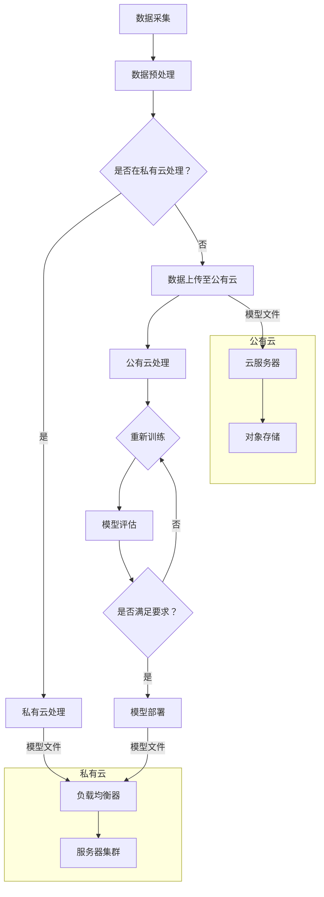

                 

关键词：AI大模型，混合云，部署，管理，性能优化

> 摘要：本文将深入探讨AI大模型的混合云部署与管理，分析其背景、核心概念、算法原理、数学模型、项目实践、实际应用场景及未来展望。通过对混合云架构的解析，介绍AI大模型在云计算环境下的部署与优化策略，旨在为AI开发者和企业决策者提供实用的技术指导。

## 1. 背景介绍

### 1.1 AI大模型的发展现状

近年来，人工智能（AI）技术取得了飞速发展，大模型成为推动AI进步的重要引擎。从GPT-3到ChatGLM，AI大模型在语言理解、文本生成、图像识别等领域展现出了惊人的能力。然而，这些大模型的训练和部署面临着诸多挑战，包括计算资源的需求、数据隐私的保护、分布式训练的优化等。

### 1.2 混合云的兴起

随着云计算技术的成熟，混合云逐渐成为企业IT基础设施的新趋势。混合云结合了公有云和私有云的优势，能够根据业务需求灵活调整资源分配，提高系统的弹性和可扩展性。在AI大模型的应用场景中，混合云提供了高效、安全的计算环境。

## 2. 核心概念与联系

### 2.1 混合云架构

混合云架构通常包括以下几个核心组件：

- **私有云**：企业内部的数据中心，负责存储和管理核心业务数据。
- **公有云**：由第三方服务提供商运营，提供弹性的计算和存储资源。
- **负载均衡器**：实现不同云资源之间的流量分配。
- **容器化技术**：如Docker，用于打包和部署应用。

### 2.2 AI大模型架构

AI大模型架构通常涉及以下关键技术：

- **深度学习框架**：如TensorFlow、PyTorch，用于构建和训练模型。
- **分布式训练**：通过多台服务器并行计算，加速模型的训练过程。
- **模型压缩**：减少模型的大小和计算量，提高部署效率。
- **自动化管理平台**：实现模型的自动部署、监控和管理。

### 2.3 Mermaid 流程图

以下是一个简化的AI大模型在混合云环境中的部署流程图：



## 3. 核心算法原理 & 具体操作步骤

### 3.1 算法原理概述

AI大模型的训练过程主要依赖于深度学习算法。深度学习通过多层神经网络对数据进行特征提取和建模，实现对复杂模式的识别。在混合云环境中，分布式训练技术能够显著提高训练效率。

### 3.2 算法步骤详解

1. **数据预处理**：清洗和归一化数据，确保数据质量。
2. **模型构建**：使用深度学习框架定义神经网络结构。
3. **数据切分**：将数据集分为训练集、验证集和测试集。
4. **分布式训练**：将模型参数和计算任务分配到多台服务器上。
5. **同步或异步更新**：服务器之间同步或异步更新模型参数。
6. **模型评估**：使用验证集评估模型性能。
7. **模型优化**：根据评估结果调整模型结构或参数。

### 3.3 算法优缺点

**优点**：

- **高效训练**：分布式训练能够充分利用多台服务器的计算能力，显著缩短训练时间。
- **灵活扩展**：混合云环境可以根据需求动态调整资源分配，提高系统的可扩展性。

**缺点**：

- **复杂管理**：分布式训练和混合云架构的管理较为复杂，需要专业的运维团队。
- **数据传输开销**：数据在公有云和私有云之间传输可能产生额外的开销。

### 3.4 算法应用领域

AI大模型在以下领域具有广泛应用：

- **自然语言处理**：语言模型、机器翻译、文本生成。
- **计算机视觉**：图像分类、目标检测、图像生成。
- **推荐系统**：个性化推荐、商品推荐。

## 4. 数学模型和公式 & 详细讲解 & 举例说明

### 4.1 数学模型构建

AI大模型的训练过程涉及多个数学模型，包括损失函数、优化算法等。以下是一个简单的损失函数例子：

$$
L(\theta) = -\frac{1}{m}\sum_{i=1}^{m}y^{(i)}\log(a^{(i)}_y)
$$

其中，$L(\theta)$ 表示损失函数，$m$ 表示样本数量，$y^{(i)}$ 表示第 $i$ 个样本的真实标签，$a^{(i)}_y$ 表示模型预测的概率。

### 4.2 公式推导过程

假设我们有 $n$ 个输入特征和 $k$ 个输出类别，使用softmax函数对输出概率进行归一化：

$$
a^{(i)} = \frac{e^{\theta^{T}x^{(i)}}}{\sum_{j=1}^{k}e^{\theta^{T}x^{(i)}}}
$$

其中，$a^{(i)}$ 表示第 $i$ 个样本的输出概率分布，$\theta$ 表示模型参数，$x^{(i)}$ 表示第 $i$ 个样本的特征向量。

### 4.3 案例分析与讲解

假设我们有一个二分类问题，使用逻辑回归模型进行预测。给定特征向量 $x$ 和标签 $y$，模型的损失函数为：

$$
L(\theta) = -\frac{1}{m}\sum_{i=1}^{m}y^{(i)}\theta^{T}x^{(i)} - (1-y^{(i)})\log(1 + e^{\theta^{T}x^{(i)}})
$$

使用梯度下降法对模型参数进行优化：

$$
\theta := \theta - \alpha\nabla_{\theta}L(\theta)
$$

其中，$\alpha$ 表示学习率。

## 5. 项目实践：代码实例和详细解释说明

### 5.1 开发环境搭建

在开始项目实践之前，我们需要搭建一个包含深度学习框架、容器化工具和混合云平台的开发环境。以下是简单的步骤：

1. 安装Docker和Kubernetes。
2. 配置私有云和公有云的账号。
3. 安装TensorFlow或PyTorch。

### 5.2 源代码详细实现

以下是一个简单的AI大模型训练的Dockerfile示例：

```dockerfile
FROM tensorflow/tensorflow:latest

RUN pip install tensorflow

COPY train.py .

CMD ["python", "train.py"]
```

训练脚本 `train.py`：

```python
import tensorflow as tf
from tensorflow.keras.layers import Dense
from tensorflow.keras.models import Sequential

# 构建模型
model = Sequential([
    Dense(128, activation='relu', input_shape=(784,)),
    Dense(1, activation='sigmoid')
])

# 编译模型
model.compile(optimizer='adam', loss='binary_crossentropy', metrics=['accuracy'])

# 加载数据
(x_train, y_train), (x_test, y_test) = tf.keras.datasets.mnist.load_data()

# 训练模型
model.fit(x_train, y_train, epochs=5, batch_size=128)
```

### 5.3 代码解读与分析

1. **模型构建**：使用Keras API定义一个简单的全连接神经网络。
2. **编译模型**：设置优化器和损失函数。
3. **加载数据**：从MNIST数据集中加载数据。
4. **训练模型**：使用fit方法训练模型。

### 5.4 运行结果展示

在训练过程中，我们可以使用TensorBoard可视化模型的训练过程，并在训练完成后评估模型的性能。以下是一个简单的TensorBoard可视化示例：

```bash
tensorboard --logdir=logs
```

在TensorBoard中，我们可以查看损失函数、准确率等指标的曲线图，以及模型参数的分布情况。

## 6. 实际应用场景

### 6.1 自然语言处理

在自然语言处理领域，AI大模型广泛应用于语言模型、机器翻译和文本生成等任务。例如，使用GPT-3模型进行自动写作、文章摘要生成等。

### 6.2 计算机视觉

在计算机视觉领域，AI大模型用于图像分类、目标检测和图像生成等任务。例如，使用ImageNet进行图像分类，使用GAN进行图像生成。

### 6.3 推荐系统

在推荐系统领域，AI大模型用于用户画像构建、商品推荐和广告投放等任务。例如，使用深度学习模型进行协同过滤和内容推荐。

## 7. 工具和资源推荐

### 7.1 学习资源推荐

- 《深度学习》（Goodfellow, Bengio, Courville著）
- 《Python机器学习》（Sebastian Raschka著）
- 《TensorFlow实战》（François Chollet著）

### 7.2 开发工具推荐

- Docker：容器化工具，用于打包和部署应用。
- Kubernetes：容器编排工具，用于管理容器化应用。
- Jupyter Notebook：交互式编程环境，用于数据分析和模型训练。

### 7.3 相关论文推荐

- “Attention Is All You Need”（Vaswani et al., 2017）
- “Generative Adversarial Nets”（Goodfellow et al., 2014）
- “A Theoretically Grounded Application of Dropout in Recurrent Neural Networks”（Yarin Gal and Zoubin Ghahramani, 2016）

## 8. 总结：未来发展趋势与挑战

### 8.1 研究成果总结

AI大模型在自然语言处理、计算机视觉和推荐系统等领域取得了显著成果，推动了相关技术的发展。混合云架构为AI大模型提供了高效、安全的计算环境，促进了其应用场景的扩展。

### 8.2 未来发展趋势

1. **模型压缩与优化**：提高模型的部署效率，降低计算资源消耗。
2. **分布式训练与推理**：进一步优化分布式训练和推理算法，提高系统的性能。
3. **跨领域应用**：将AI大模型应用于更多领域，如医疗、金融等。

### 8.3 面临的挑战

1. **计算资源需求**：随着模型规模的扩大，计算资源需求不断增加。
2. **数据隐私保护**：在分布式训练过程中保护用户数据隐私。
3. **系统安全性**：确保系统的可靠性和安全性，防止攻击和数据泄露。

### 8.4 研究展望

未来，AI大模型的应用将更加广泛，同时面临诸多挑战。通过不断创新和优化，有望在计算效率、数据隐私和系统安全性等方面取得突破，为各行业带来更大的价值。

## 9. 附录：常见问题与解答

### 9.1 混合云与公有云、私有云的区别是什么？

混合云结合了公有云和私有云的优势，既具有公有云的弹性和可扩展性，又保持了私有云的安全性。与公有云和私有云相比，混合云能够根据业务需求灵活调整资源分配，提高系统的整体性能。

### 9.2 如何优化AI大模型的部署？

1. **模型压缩**：通过模型压缩技术减少模型的大小和计算量，提高部署效率。
2. **分布式训练**：利用分布式训练技术充分利用多台服务器的计算能力，加速训练过程。
3. **自动化管理**：使用自动化管理平台实现模型的自动部署、监控和管理，降低运维成本。

### 9.3 如何保护AI大模型的数据隐私？

1. **数据加密**：对数据进行加密，确保数据在传输和存储过程中不被窃取。
2. **隐私保护算法**：使用差分隐私、联邦学习等技术保护用户数据隐私。
3. **权限管理**：严格管理数据访问权限，确保只有授权人员可以访问敏感数据。

以上是关于AI大模型应用的混合云部署与管理的一些常见问题与解答，希望对您有所帮助。

### 致谢

本文撰写过程中，得到了许多专家和同行的指导与支持，特此感谢。同时，也感谢所有提供宝贵数据和资源的开发者，使得AI大模型的应用得以不断发展。

**作者：禅与计算机程序设计艺术 / Zen and the Art of Computer Programming**

