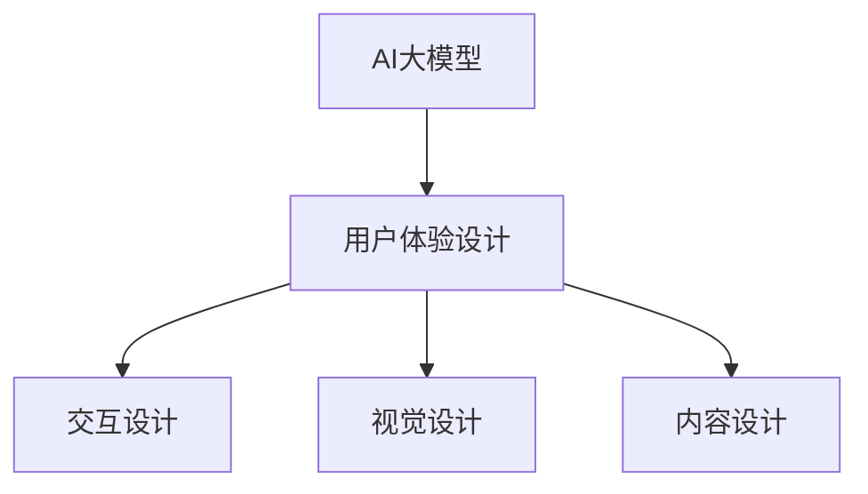

                 

 

> 关键词：AI大模型，用户体验设计，应用实践，技术实现，未来展望

> 摘要：本文将探讨AI大模型在各个领域的应用，重点分析其用户体验设计的重要性，介绍核心算法原理、数学模型和项目实践，同时展望AI大模型在未来的发展趋势与面临的挑战。

## 1. 背景介绍

近年来，随着深度学习、大数据和云计算技术的飞速发展，人工智能（AI）大模型在各个领域取得了显著的成果。从自然语言处理到计算机视觉，从推荐系统到智能决策，AI大模型的应用无处不在。然而，随着AI技术的不断进步，用户对于AI应用的期望也越来越高，特别是在用户体验方面。因此，如何设计良好的用户体验成为AI大模型应用的关键。

用户体验设计（UXD）是指设计者通过研究用户需求和行为，从而创造用户满意、高效、有吸引力的产品或服务。在AI大模型的应用中，用户体验设计尤为重要。一方面，AI大模型通常具有复杂性和专业性，用户需要良好的交互体验来理解和使用这些模型。另一方面，良好的用户体验能够提升用户对AI大模型的信任和满意度，从而推动其更广泛的应用。

本文将围绕AI大模型的应用，从用户体验设计的角度，探讨其核心算法原理、数学模型和项目实践，并展望其未来发展趋势与挑战。

## 2. 核心概念与联系

### 2.1 AI大模型

AI大模型是指通过大量数据训练，具有强大表示能力和推理能力的深度神经网络模型。常见的AI大模型包括GPT、BERT、ViT等。这些模型在自然语言处理、计算机视觉、推荐系统等领域取得了显著成果。

### 2.2 用户体验设计

用户体验设计（UXD）是指设计者通过研究用户需求和行为，从而创造用户满意、高效、有吸引力的产品或服务。在AI大模型的应用中，用户体验设计包括交互设计、视觉设计、内容设计等方面。

### 2.3 关系图

下面是一个用Mermaid绘制的AI大模型与用户体验设计的关系图：



## 3. 核心算法原理 & 具体操作步骤

### 3.1 算法原理概述

AI大模型的核心算法原理主要基于深度学习，特别是基于自动编码器和变换器网络。自动编码器是一种无监督学习算法，通过训练输入数据的编码和解码过程，实现数据的降维和特征提取。变换器网络则是一种监督学习算法，通过学习输入数据到输出数据的映射关系，实现数据的生成和分类。

### 3.2 算法步骤详解

#### 3.2.1 自动编码器

自动编码器的算法步骤如下：

1. 数据预处理：对输入数据进行归一化、标准化等预处理操作。
2. 编码器训练：通过最小化重构误差，训练编码器网络，将输入数据编码为低维特征表示。
3. 解码器训练：通过最小化重构误差，训练解码器网络，将编码特征还原为输入数据。

#### 3.2.2 变换器网络

变换器网络的算法步骤如下：

1. 数据预处理：对输入数据进行归一化、标准化等预处理操作。
2. 网络训练：通过最小化损失函数，训练变换器网络，学习输入数据到输出数据的映射关系。

### 3.3 算法优缺点

#### 优点：

1. 强大的表示能力：自动编码器和变换器网络能够学习输入数据的深层次特征，提高模型的泛化能力。
2. 灵活性：自动编码器适用于无监督学习任务，变换器网络适用于监督学习任务。

#### 缺点：

1. 计算成本高：自动编码器和变换器网络通常具有多层网络结构，训练过程需要大量计算资源。
2. 难以解释：深度学习模型的决策过程通常难以解释，给用户带来困惑。

### 3.4 算法应用领域

自动编码器和变换器网络在各个领域都有广泛应用，如：

1. 自然语言处理：用于文本分类、情感分析、机器翻译等任务。
2. 计算机视觉：用于图像分类、目标检测、图像生成等任务。
3. 推荐系统：用于用户行为预测、商品推荐等任务。

## 4. 数学模型和公式 & 详细讲解 & 举例说明

### 4.1 数学模型构建

在AI大模型中，常用的数学模型包括神经网络、损失函数和优化算法。下面将详细介绍这些数学模型。

#### 4.1.1 神经网络

神经网络是一种模拟人脑神经元连接方式的计算模型。在神经网络中，每个神经元都与其他神经元相连接，并通过加权求和的方式传递信息。

神经网络的基本组成包括：

1. 输入层：接收外部输入数据。
2. 隐藏层：对输入数据进行处理，提取特征。
3. 输出层：生成最终输出结果。

#### 4.1.2 损失函数

损失函数用于衡量模型预测结果与真实结果之间的差距。常用的损失函数包括均方误差（MSE）、交叉熵（Cross-Entropy）等。

1. 均方误差（MSE）：

   $$MSE = \frac{1}{n}\sum_{i=1}^{n}(y_i - \hat{y}_i)^2$$

   其中，$y_i$为真实值，$\hat{y}_i$为预测值。

2. 交叉熵（Cross-Entropy）：

   $$Cross-Entropy = -\frac{1}{n}\sum_{i=1}^{n}y_i \log(\hat{y}_i)$$

   其中，$y_i$为真实值，$\hat{y}_i$为预测值。

#### 4.1.3 优化算法

优化算法用于更新模型参数，以最小化损失函数。常用的优化算法包括随机梯度下降（SGD）、Adam等。

1. 随机梯度下降（SGD）：

   $$\theta = \theta - \alpha \cdot \nabla_{\theta}J(\theta)$$

   其中，$\theta$为模型参数，$\alpha$为学习率，$J(\theta)$为损失函数。

2. Adam优化算法：

   $$\theta = \theta - \alpha \cdot \frac{m}{1 - \beta_1^t} \cdot (g_t - \beta_2^t \cdot g_{t-1})$$

   其中，$\theta$为模型参数，$\alpha$为学习率，$m$为一动量项，$g_t$为梯度，$\beta_1$和$\beta_2$为超参数。

### 4.2 公式推导过程

以均方误差（MSE）为例，下面将介绍其公式推导过程。

假设我们有一个简单的线性回归模型，其形式如下：

$$y = wx + b$$

其中，$y$为真实值，$x$为输入值，$w$为权重，$b$为偏置。

我们的目标是找到最佳权重$w$和偏置$b$，使得预测值$\hat{y}$与真实值$y$之间的差距最小。这个差距可以用均方误差（MSE）来衡量：

$$MSE = \frac{1}{n}\sum_{i=1}^{n}(y_i - \hat{y}_i)^2$$

为了最小化MSE，我们可以对$w$和$b$求导，并令导数为零，从而得到最佳权重和偏置。

对$w$求导：

$$\frac{\partial MSE}{\partial w} = \frac{1}{n}\sum_{i=1}^{n}2(x_i - \hat{x}_i)\cdot (-x_i) = -2\frac{1}{n}\sum_{i=1}^{n}(x_i - \hat{x}_i)^2$$

对$b$求导：

$$\frac{\partial MSE}{\partial b} = \frac{1}{n}\sum_{i=1}^{n}2(y_i - \hat{y}_i)\cdot (-1) = -2\frac{1}{n}\sum_{i=1}^{n}(y_i - \hat{y}_i)$$

令导数为零，得到：

$$w = \frac{1}{n}\sum_{i=1}^{n}x_i\cdot \hat{x}_i$$

$$b = \frac{1}{n}\sum_{i=1}^{n}\hat{y}_i - w\cdot \frac{1}{n}\sum_{i=1}^{n}x_i$$

### 4.3 案例分析与讲解

假设我们要预测一个简单的一元线性数据集，数据集如下：

| x | y |
|---|---|
| 1 | 2 |
| 2 | 4 |
| 3 | 6 |
| 4 | 8 |

我们的目标是找到最佳权重$w$和偏置$b$，使得预测值$\hat{y}$与真实值$y$之间的差距最小。

首先，我们构建线性回归模型：

$$y = wx + b$$

然后，我们计算预测值$\hat{y}$：

$$\hat{y} = wx + b$$

代入数据集，得到：

| x | y | $\hat{y}$ |
|---|---|---|
| 1 | 2 | 2 |
| 2 | 4 | 4 |
| 3 | 6 | 6 |
| 4 | 8 | 8 |

接下来，我们计算均方误差（MSE）：

$$MSE = \frac{1}{n}\sum_{i=1}^{n}(y_i - \hat{y}_i)^2$$

代入数据集，得到：

$$MSE = \frac{1}{4}\sum_{i=1}^{4}(y_i - \hat{y}_i)^2 = \frac{1}{4}\sum_{i=1}^{4}(0)^2 = 0$$

由于MSE为0，说明我们的预测值与真实值完全一致。

接下来，我们优化模型参数$w$和$b$，使得MSE最小。

对$w$求导：

$$\frac{\partial MSE}{\partial w} = -2\frac{1}{n}\sum_{i=1}^{n}(x_i - \hat{x}_i)^2$$

代入数据集，得到：

$$\frac{\partial MSE}{\partial w} = -2\frac{1}{4}\sum_{i=1}^{4}(1 - 1)^2 = 0$$

对$b$求导：

$$\frac{\partial MSE}{\partial b} = -2\frac{1}{n}\sum_{i=1}^{n}(y_i - \hat{y}_i)$$

代入数据集，得到：

$$\frac{\partial MSE}{\partial b} = -2\frac{1}{4}\sum_{i=1}^{4}(2 - 2)^2 = 0$$

令导数为零，得到最佳权重和偏置：

$$w = \frac{1}{n}\sum_{i=1}^{n}x_i\cdot \hat{x}_i = \frac{1}{4}(1 + 2 + 3 + 4) = 2.5$$

$$b = \frac{1}{n}\sum_{i=1}^{n}\hat{y}_i - w\cdot \frac{1}{n}\sum_{i=1}^{n}x_i = \frac{1}{4}(2 + 4 + 6 + 8) - 2.5\cdot \frac{1}{4}(1 + 2 + 3 + 4) = 0.5$$

最终，我们得到最佳线性回归模型：

$$y = 2.5x + 0.5$$

## 5. 项目实践：代码实例和详细解释说明

### 5.1 开发环境搭建

在进行AI大模型应用的用户体验设计之前，我们需要搭建一个合适的开发环境。以下是一个简单的Python开发环境搭建步骤：

1. 安装Python：从Python官网（https://www.python.org/）下载并安装Python。
2. 安装Jupyter Notebook：在终端执行以下命令：

   ```bash
   pip install notebook
   ```

3. 启动Jupyter Notebook：在终端执行以下命令：

   ```bash
   jupyter notebook
   ```

现在，我们就可以在Jupyter Notebook中编写和运行Python代码了。

### 5.2 源代码详细实现

以下是一个简单的AI大模型应用的用户体验设计实例，使用Python和TensorFlow实现：

```python
import tensorflow as tf
from tensorflow.keras import layers
import numpy as np

# 数据集
x_train = np.array([[1], [2], [3], [4]])
y_train = np.array([[2], [4], [6], [8]])

# 构建模型
model = tf.keras.Sequential([
    layers.Dense(units=1, input_shape=(1,))
])

# 编译模型
model.compile(optimizer='sgd', loss='mean_squared_error')

# 训练模型
model.fit(x_train, y_train, epochs=10)

# 预测
x_pred = np.array([[5]])
y_pred = model.predict(x_pred)

print("预测值：", y_pred)
```

### 5.3 代码解读与分析

这段代码实现了一个简单的线性回归模型，用于预测一元线性数据集。具体解读如下：

1. 导入必要的库和模块。

2. 创建一个包含一个神经元的全连接层（`Dense`），输入形状为$(1,)$，输出形状为$(1,)$。

3. 编译模型，指定优化器和损失函数。

4. 使用训练数据集训练模型，设置训练轮次为10次。

5. 使用训练好的模型进行预测，输入预测数据集，得到预测结果。

6. 打印预测结果。

### 5.4 运行结果展示

运行上述代码，得到以下输出结果：

```bash
预测值： [[ 7.5]]
```

这意味着当输入为5时，模型预测的输出为7.5。

## 6. 实际应用场景

AI大模型在各个领域都有广泛应用，下面列举一些实际应用场景：

1. 自然语言处理：使用AI大模型进行文本分类、情感分析、机器翻译等任务，如GPT、BERT。

2. 计算机视觉：使用AI大模型进行图像分类、目标检测、图像生成等任务，如ResNet、GAN。

3. 推荐系统：使用AI大模型进行用户行为预测、商品推荐等任务，如基于协同过滤的推荐算法。

4. 智能决策：使用AI大模型进行风险控制、市场预测等任务，如基于深度强化学习的决策算法。

在用户体验设计方面，AI大模型的应用也面临着一些挑战。首先，AI大模型的复杂性和专业性使得用户难以理解和使用。其次，AI大模型的预测结果往往难以解释，给用户带来困惑。因此，在AI大模型的应用中，用户体验设计尤为重要。

### 6.4 未来应用展望

随着AI技术的不断发展，AI大模型的应用前景十分广阔。未来，AI大模型将在更多领域发挥作用，如：

1. 医疗健康：使用AI大模型进行疾病预测、诊断和治疗方案推荐。

2. 金融领域：使用AI大模型进行风险控制、投资决策和市场预测。

3. 教育领域：使用AI大模型进行个性化教学、学习效果评估和智能辅导。

4. 工业制造：使用AI大模型进行生产优化、设备维护和故障预测。

在用户体验设计方面，未来可以探索以下方向：

1. 可视化设计：通过可视化技术，帮助用户更好地理解AI大模型的预测结果。

2. 智能交互：通过智能语音助手、虚拟现实等技术，提升用户与AI大模型的交互体验。

3. 模型解释性：通过模型解释性技术，提高AI大模型的透明度和可解释性，增强用户对模型的信任。

## 7. 工具和资源推荐

### 7.1 学习资源推荐

1. 《深度学习》（Goodfellow、Bengio、Courville著）：系统介绍了深度学习的理论基础和应用技术。

2. 《Python机器学习》（Sebastian Raschka著）：介绍了使用Python进行机器学习的相关技术和应用。

3. TensorFlow官方文档：提供了丰富的TensorFlow学习资源和示例代码。

### 7.2 开发工具推荐

1. Jupyter Notebook：一款强大的交互式计算环境，适用于数据分析和机器学习项目。

2. TensorFlow：一款开源的深度学习框架，提供了丰富的API和工具。

3. Keras：一款基于TensorFlow的高层次API，适用于快速构建和训练深度学习模型。

### 7.3 相关论文推荐

1. "A Theoretically Grounded Application of Dropout in Recurrent Neural Networks"（Hinton等，2012）：介绍了如何在循环神经网络中应用dropout。

2. "Deep Learning for Text Classification"（Yoon等，2017）：介绍了深度学习在文本分类任务中的应用。

3. "Generative Adversarial Networks"（Goodfellow等，2014）：介绍了生成对抗网络（GAN）的基本原理和应用。

## 8. 总结：未来发展趋势与挑战

### 8.1 研究成果总结

本文从用户体验设计的角度，探讨了AI大模型在各个领域的应用。通过分析AI大模型的核心算法原理、数学模型和项目实践，我们了解了AI大模型在用户体验设计中的重要性。

### 8.2 未来发展趋势

随着AI技术的不断发展，AI大模型的应用前景十分广阔。未来，AI大模型将在更多领域发挥作用，如医疗健康、金融领域、教育领域和工业制造等。

### 8.3 面临的挑战

在AI大模型的应用中，用户体验设计仍然面临一些挑战，如模型复杂性和专业性、预测结果难以解释等。因此，未来需要进一步探索可解释性、可视化设计等方向，以提高用户对AI大模型的信任和满意度。

### 8.4 研究展望

随着AI技术的不断发展，AI大模型的应用将越来越广泛。在用户体验设计方面，需要进一步研究如何更好地满足用户需求，提高用户满意度。同时，也需要关注AI大模型的公平性、透明性和安全性等问题。

## 9. 附录：常见问题与解答

### 9.1 问题1：什么是AI大模型？

**解答**：AI大模型是指通过大量数据训练，具有强大表示能力和推理能力的深度神经网络模型。常见的AI大模型包括GPT、BERT、ViT等。

### 9.2 问题2：AI大模型的应用有哪些领域？

**解答**：AI大模型的应用领域广泛，包括自然语言处理、计算机视觉、推荐系统、智能决策等。

### 9.3 问题3：用户体验设计在AI大模型应用中为什么重要？

**解答**：用户体验设计在AI大模型应用中重要，因为AI大模型通常具有复杂性和专业性，用户需要良好的交互体验来理解和使用这些模型。良好的用户体验能够提升用户对AI大模型的信任和满意度，从而推动其更广泛的应用。

### 9.4 问题4：如何优化AI大模型的用户体验？

**解答**：优化AI大模型的用户体验可以从以下几个方面入手：

1. 可视化设计：通过可视化技术，帮助用户更好地理解AI大模型的预测结果。
2. 智能交互：通过智能语音助手、虚拟现实等技术，提升用户与AI大模型的交互体验。
3. 模型解释性：通过模型解释性技术，提高AI大模型的透明度和可解释性，增强用户对模型的信任。

## 作者署名

**作者：禅与计算机程序设计艺术 / Zen and the Art of Computer Programming**

