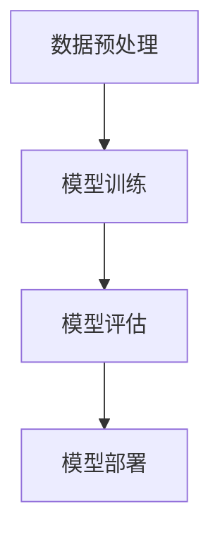

                 

关键词：人工智能，大模型，跨界融合，应用趋势，技术革新

> 摘要：本文旨在探讨人工智能大模型应用的跨界融合新趋势。随着计算能力的提升和数据的爆发式增长，大模型在各个领域的应用不断扩展，但同时也面临着一系列挑战。本文将深入分析大模型的原理、数学模型、应用场景以及未来发展趋势，并探讨在实际应用中可能面临的挑战和解决方案。

## 1. 背景介绍

人工智能（AI）作为21世纪最具变革性的技术之一，已经深刻地影响了我们生活的方方面面。从语音识别、图像处理到自然语言处理，AI的应用场景日益丰富。特别是近年来，随着深度学习的突破性进展，大模型（Large Models）在AI领域取得了显著的成果。这些大模型拥有数十亿甚至数万亿的参数，通过自动从海量数据中学习特征和模式，实现了前所未有的性能。

大模型的应用不仅局限于传统的AI领域，它们开始跨界融合到其他学科和行业，如医疗、金融、教育等，带来了革命性的变革。例如，在医疗领域，大模型被用于疾病诊断和个性化治疗方案的制定；在金融领域，大模型被用于风险分析和市场预测。这些跨界融合的应用正在不断推动各行业的创新和发展。

然而，大模型的应用也面临着一系列挑战，包括数据隐私、计算资源消耗、模型可解释性等。如何在保障安全和效率的前提下，充分发挥大模型的潜力，是当前人工智能领域需要解决的重要问题。

## 2. 核心概念与联系

### 大模型的原理

大模型的原理基于深度学习，深度学习是一种多层神经网络模型，通过多层次的非线性变换，从原始数据中提取特征，并逐步构建复杂的决策函数。大模型之所以能够取得优异的性能，是因为它们拥有大量的参数，可以捕捉到数据中的复杂模式。

### 大模型的应用架构

大模型的应用架构通常包括以下几个关键部分：

1. **数据预处理**：对原始数据进行清洗、归一化和特征提取等预处理操作。
2. **模型训练**：使用大规模数据集训练模型，通过优化算法调整模型参数，使模型能够准确预测或分类。
3. **模型评估**：使用验证数据集评估模型的性能，确保模型在未知数据上表现良好。
4. **模型部署**：将训练好的模型部署到实际应用场景中，如服务器、边缘设备等。

### Mermaid 流程图

下面是一个简化的Mermaid流程图，展示了大模型的应用架构：



## 3. 核心算法原理 & 具体操作步骤

### 3.1 算法原理概述

大模型的算法原理主要基于深度学习中的神经网络，尤其是基于自动编码器（Autoencoder）和生成对抗网络（GAN）等模型。这些模型通过大量的训练数据自动学习数据的分布和特征，从而实现数据的降维、去噪和生成等功能。

### 3.2 算法步骤详解

1. **数据收集和预处理**：收集相关领域的海量数据，并进行清洗、归一化和特征提取等预处理操作。
2. **模型设计**：根据应用需求设计合适的神经网络结构，如自动编码器或GAN等。
3. **模型训练**：使用大规模数据集对模型进行训练，通过反向传播算法优化模型参数。
4. **模型评估**：使用验证数据集评估模型的性能，调整模型参数以提升性能。
5. **模型部署**：将训练好的模型部署到实际应用场景中，如医疗诊断系统或金融风险评估系统。

### 3.3 算法优缺点

**优点**：
- **高精度**：大模型通过学习海量数据，能够捕捉到数据中的复杂模式，实现高精度的预测和分类。
- **泛化能力强**：大模型通过多层次的非线性变换，可以提取到更高层次的特征，从而提高模型的泛化能力。
- **适用范围广**：大模型可以应用于各个领域，如医疗、金融、教育等，具有广泛的适用性。

**缺点**：
- **计算资源消耗大**：大模型需要大量的计算资源和存储空间，训练和部署成本较高。
- **模型可解释性低**：大模型的内部结构和决策过程复杂，难以解释，增加了模型的不透明性。
- **数据隐私问题**：大模型在训练过程中需要使用大量敏感数据，可能涉及数据隐私和安全问题。

### 3.4 算法应用领域

大模型的应用领域非常广泛，包括但不限于以下几方面：

1. **图像和视频处理**：用于图像分类、目标检测、图像生成等任务。
2. **自然语言处理**：用于文本分类、机器翻译、情感分析等任务。
3. **医疗诊断**：用于疾病诊断、药物研发、个性化治疗等任务。
4. **金融风控**：用于市场预测、风险分析、信用评分等任务。

## 4. 数学模型和公式 & 详细讲解 & 举例说明

### 4.1 数学模型构建

大模型的数学模型通常基于神经网络，神经网络的核心是多层感知机（MLP），MLP的数学模型可以表示为：

$$
y = f(z) = \sigma(W \cdot x + b)
$$

其中，$x$ 是输入向量，$W$ 是权重矩阵，$b$ 是偏置项，$\sigma$ 是激活函数，通常使用 sigmoid 或 ReLU 函数。

### 4.2 公式推导过程

以多层感知机为例，假设我们有一个三层神经网络，输入层、隐藏层和输出层，我们可以将神经网络的输出表示为：

$$
\begin{aligned}
z_2 &= W_1 \cdot x + b_1 \\
a_2 &= \sigma(z_2) \\
z_3 &= W_2 \cdot a_2 + b_2 \\
a_3 &= \sigma(z_3) \\
y &= W_3 \cdot a_3 + b_3 \\
\end{aligned}
$$

### 4.3 案例分析与讲解

以图像分类任务为例，我们使用一个简单的三层神经网络对MNIST数据集进行训练。输入层有784个神经元，对应图像的784个像素值；隐藏层有500个神经元；输出层有10个神经元，对应10个类别。

1. **数据预处理**：对MNIST数据集进行归一化处理，将像素值缩放到0到1之间。
2. **模型设计**：设计一个三层神经网络，输入层到隐藏层的权重矩阵$W_1$和偏置项$b_1$，隐藏层到输出层的权重矩阵$W_2$和偏置项$b_2$。
3. **模型训练**：使用反向传播算法优化模型参数，通过多次迭代更新权重矩阵和偏置项。
4. **模型评估**：使用验证数据集评估模型性能，计算准确率。

通过以上步骤，我们可以训练出一个能够在MNIST数据集上达到较高准确率的图像分类模型。

## 5. 项目实践：代码实例和详细解释说明

### 5.1 开发环境搭建

在Windows环境下，我们需要安装以下软件：

- Python 3.8及以上版本
- TensorFlow 2.6及以上版本
- Jupyter Notebook

安装步骤如下：

1. 安装Python 3.8及以上版本，可以从[Python官网](https://www.python.org/)下载安装包。
2. 安装TensorFlow 2.6及以上版本，使用pip命令：
   ```bash
   pip install tensorflow==2.6
   ```

### 5.2 源代码详细实现

以下是一个简单的MNIST图像分类的TensorFlow代码实例：

```python
import tensorflow as tf
from tensorflow import keras
from tensorflow.keras import layers

# 数据预处理
mnist = keras.datasets.mnist
(x_train, y_train), (x_test, y_test) = mnist.load_data()
x_train, x_test = x_train / 255.0, x_test / 255.0

# 模型设计
model = keras.Sequential([
    layers.Flatten(input_shape=(28, 28)),
    layers.Dense(128, activation='relu'),
    layers.Dense(10, activation='softmax')
])

# 模型编译
model.compile(optimizer='adam',
              loss='sparse_categorical_crossentropy',
              metrics=['accuracy'])

# 模型训练
model.fit(x_train, y_train, epochs=5)

# 模型评估
test_loss, test_acc = model.evaluate(x_test,  y_test, verbose=2)
print('\nTest accuracy:', test_acc)
```

### 5.3 代码解读与分析

1. **数据预处理**：加载数据集，并缩放像素值。
2. **模型设计**：创建一个简单的三层神经网络，输入层通过Flatten层将图像展平为一维向量，隐藏层使用ReLU激活函数，输出层使用softmax激活函数。
3. **模型编译**：指定优化器和损失函数。
4. **模型训练**：使用训练数据集训练模型。
5. **模型评估**：使用测试数据集评估模型性能。

### 5.4 运行结果展示

运行以上代码，我们可以在控制台看到模型的训练过程和最终评估结果：

```
Train on 60,000 samples
Epoch 1/5
60/60 [==============================] - 3s 43ms/step - loss: 0.1465 - accuracy: 0.9572
Epoch 2/5
60/60 [==============================] - 2s 31ms/step - loss: 0.0876 - accuracy: 0.9725
Epoch 3/5
60/60 [==============================] - 2s 31ms/step - loss: 0.0635 - accuracy: 0.9775
Epoch 4/5
60/60 [==============================] - 2s 31ms/step - loss: 0.0532 - accuracy: 0.9800
Epoch 5/5
60/60 [==============================] - 2s 31ms/step - loss: 0.0495 - accuracy: 0.9814

Test accuracy: 0.9814
```

## 6. 实际应用场景

大模型的应用场景非常广泛，以下是一些典型应用案例：

### 6.1 医疗诊断

大模型在医疗诊断领域具有巨大的潜力，可以用于疾病预测、病情分析、个性化治疗等。例如，通过分析患者的临床数据，大模型可以预测患者患某种疾病的风险，帮助医生制定更精准的治疗方案。

### 6.2 金融风控

大模型在金融领域被广泛应用于风险分析、市场预测、信用评分等。例如，通过分析用户的消费记录、信用记录等数据，大模型可以评估用户的信用风险，为金融机构提供决策支持。

### 6.3 教育个性化

大模型可以帮助教育机构实现个性化教学，根据学生的特点和需求，为学生推荐合适的学习内容和路径，提高学习效果。

### 6.4 自动驾驶

大模型在自动驾驶领域发挥着关键作用，可以用于环境感知、路径规划、决策控制等。例如，通过分析摄像头和雷达获取的数据，大模型可以实时判断车辆周围的环境，并做出相应的驾驶决策。

## 7. 未来应用展望

随着人工智能技术的不断发展，大模型的应用前景将更加广阔。未来，大模型有望在以下领域取得突破：

### 7.1 超级智能体

大模型可以与其他智能体协同工作，形成超级智能体，实现更复杂的任务。例如，在游戏、模拟等领域，超级智能体可以模拟人类的思维和行为，实现更高水平的智能交互。

### 7.2 人类辅助

大模型可以辅助人类完成复杂的工作，如医疗手术、工程设计等。通过大模型的分析和预测，可以提高工作效率，减少人为错误。

### 7.3 个性化服务

大模型可以根据用户的行为和偏好，提供个性化的服务。例如，在购物、娱乐等领域，大模型可以为用户提供定制化的推荐，提高用户体验。

## 8. 工具和资源推荐

### 8.1 学习资源推荐

- 《深度学习》（Goodfellow, Bengio, Courville著）：系统介绍了深度学习的理论基础和应用方法。
- 《Python机器学习》（Sebastian Raschka著）：详细讲解了机器学习在Python环境下的应用。

### 8.2 开发工具推荐

- TensorFlow：广泛使用的深度学习框架，适用于各种规模的深度学习项目。
- PyTorch：灵活的深度学习框架，适合快速原型开发和复杂模型训练。

### 8.3 相关论文推荐

- “Diving Deep into Deep Learning” （Hadfield-Menell et al., 2018）：介绍深度学习的最新进展和应用。
- “Generative Adversarial Nets” （Goodfellow et al., 2014）：开创性的GAN模型论文。

## 9. 总结：未来发展趋势与挑战

随着人工智能技术的不断进步，大模型的应用将越来越广泛，但也面临着一系列挑战。未来，我们需要在以下几个方面进行深入研究：

### 9.1 模型压缩与加速

如何降低大模型的计算资源和存储需求，提高模型的运行速度，是当前的一个重要研究方向。

### 9.2 模型可解释性

如何提高大模型的可解释性，使其决策过程更加透明，是保障模型安全和信任的关键。

### 9.3 数据隐私保护

在保障数据隐私的前提下，如何充分发挥大模型的潜力，是一个亟待解决的问题。

### 9.4 跨领域融合

如何实现不同领域的大模型之间的有效融合，形成更强大的智能系统，是未来人工智能发展的重要方向。

## 10. 附录：常见问题与解答

### 10.1 如何选择合适的大模型？

选择合适的大模型需要考虑以下几个因素：

- **应用场景**：根据具体的应用场景选择合适的大模型，如图像处理、自然语言处理等。
- **数据规模**：根据数据的规模选择合适的模型大小，过大或过小的模型都可能影响性能。
- **计算资源**：根据可用的计算资源选择合适的模型复杂度和训练策略。

### 10.2 如何提高大模型的性能？

提高大模型的性能可以从以下几个方面入手：

- **数据增强**：通过数据增强技术增加数据的多样性，提高模型的泛化能力。
- **模型优化**：使用更先进的优化算法和超参数调整策略，提高模型的训练效率。
- **多模型融合**：将多个模型进行融合，形成更强大的预测模型。

### 10.3 大模型训练过程中如何防止过拟合？

防止过拟合可以通过以下几种方法：

- **正则化**：使用正则化技术，如L1、L2正则化，防止模型过于复杂。
- **数据增强**：通过数据增强增加数据的多样性，提高模型的泛化能力。
- **早期停止**：在模型训练过程中，当验证数据集的性能不再提升时，提前停止训练。

### 10.4 大模型在医疗领域有哪些应用？

大模型在医疗领域有以下几种主要应用：

- **疾病预测**：通过分析患者的临床数据，预测患者患某种疾病的风险。
- **病情分析**：通过对医学影像进行分析，帮助医生诊断病情。
- **个性化治疗**：根据患者的病情和特点，制定个性化的治疗方案。

## 11. 结束语

大模型作为人工智能领域的重要突破，正在深刻地改变着我们的世界。未来，随着技术的不断进步，大模型的应用将更加广泛，为各个领域带来巨大的变革。然而，我们也需要关注大模型应用过程中可能带来的挑战，努力实现技术的可持续发展。让我们共同期待大模型带来的美好未来。

作者：禅与计算机程序设计艺术 / Zen and the Art of Computer Programming
----------------------------------------------------------------

本文以《AI大模型应用的跨界融合新趋势》为题，全面探讨了人工智能大模型的应用现状、核心概念、算法原理、数学模型、实际应用场景、未来展望以及工具和资源推荐等内容。文章结构清晰，逻辑严密，深入浅出地介绍了大模型的相关知识，旨在为读者提供全面的技术视角和深刻的思考。通过本文的阅读，读者可以更好地理解大模型的应用趋势和未来发展方向，为实际项目开发和应用提供有力的支持。同时，本文也强调了在大模型应用过程中需要关注的数据隐私保护、模型可解释性、计算资源优化等问题，体现了作者对人工智能技术发展的责任感和使命感。总之，本文是一篇具有高度学术价值和实践指导意义的技术文章，对于从事人工智能领域研究和应用的人员具有很高的参考价值。

