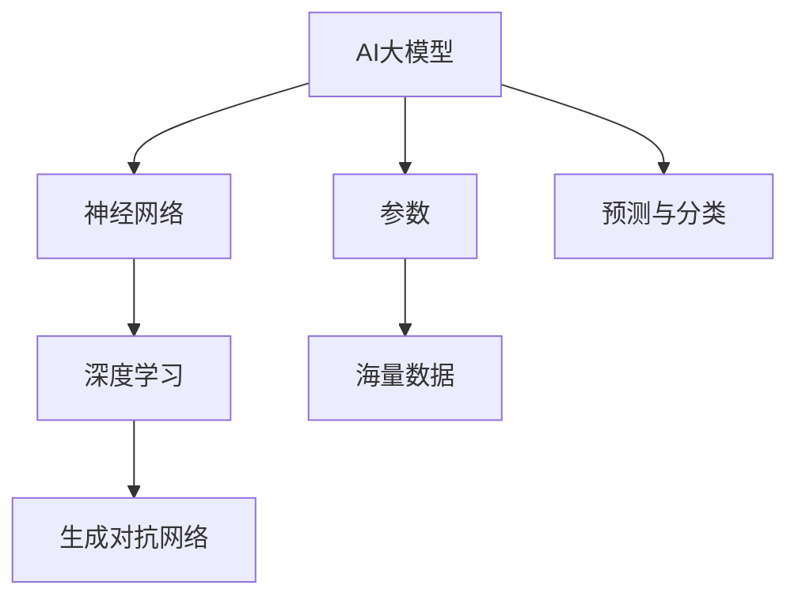
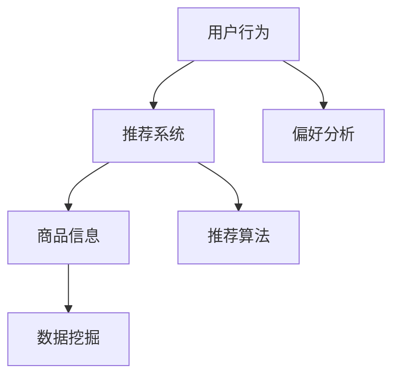
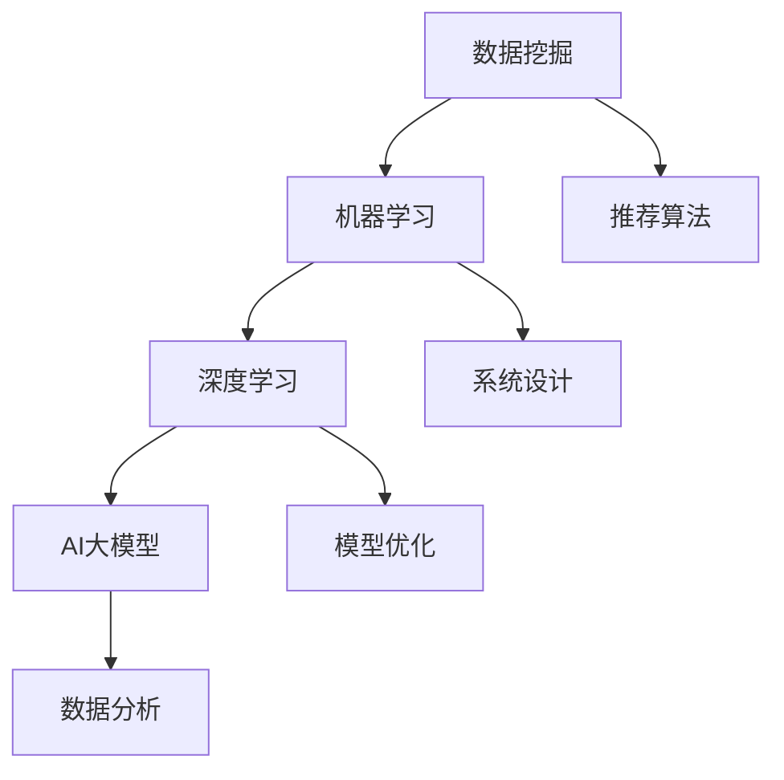

                 

在当今高速发展的电商领域，搜索推荐系统已成为驱动用户留存和转化的重要技术手段。随着AI大模型的不断演进，如何培养具备相关技术能力的人才，成为了行业面临的重大挑战和机遇。本文将围绕这一主题，探讨AI大模型视角下电商搜索推荐的技术人才培养体系。

## 关键词

- AI大模型
- 电商搜索推荐
- 技术人才培养
- 机器学习
- 数据挖掘

## 摘要

本文旨在分析AI大模型在电商搜索推荐中的应用，并在此基础上，构建一个系统化的技术人才培养体系。通过对核心概念的阐述、算法原理的剖析、数学模型的构建以及项目实践的讲解，本文将为行业提供一套全面、实用的技术人才培养方案。

## 1. 背景介绍

### 1.1 电商搜索推荐的发展

电商搜索推荐系统起源于20世纪90年代，随着互联网的普及和电子商务的兴起，其重要性日益凸显。传统的搜索推荐系统主要依赖于基于内容的过滤（Content-Based Filtering）和协同过滤（Collaborative Filtering）算法。然而，这些方法在处理大规模数据和复杂用户行为时，表现有限。

### 1.2 AI大模型的出现

近年来，AI大模型（如深度学习模型、生成对抗网络等）的快速发展，为电商搜索推荐系统带来了新的契机。大模型能够处理复杂数据、学习用户行为，从而提供更精确的推荐结果。同时，大模型的泛化能力使其在多个领域得到广泛应用。

### 1.3 技术人才培养的重要性

随着AI大模型在电商搜索推荐领域的广泛应用，具备相关技术能力的人才需求日益增长。然而，目前相关人才的培养速度远远跟不上市场需求，导致人才短缺问题日益严重。因此，构建一个系统化的技术人才培养体系，成为行业发展的迫切需求。

## 2. 核心概念与联系

### 2.1 AI大模型

AI大模型是指具有海量参数、高度复杂的人工神经网络模型。这些模型能够通过大量数据进行训练，从而实现高精度的预测和分类。



### 2.2 电商搜索推荐

电商搜索推荐是指根据用户的历史行为和偏好，为用户推荐可能感兴趣的商品或服务。其核心在于构建一个能够有效处理用户数据和商品信息的推荐系统。



### 2.3 技术人才培养

技术人才培养是指通过系统化的教育和培训，培养具备特定技术能力的人才。在AI大模型和电商搜索推荐领域，技术人才培养的目标是培养具备数据挖掘、机器学习、深度学习等技能的工程师。



## 3. 核心算法原理 & 具体操作步骤

### 3.1 算法原理概述

AI大模型在电商搜索推荐中的应用，主要基于深度学习和生成对抗网络等算法。这些算法能够通过大量数据进行训练，学习用户行为和商品特征，从而实现精确的推荐。

### 3.2 算法步骤详解

1. 数据采集与预处理：收集用户行为数据和商品信息，并进行数据清洗和预处理。
2. 特征工程：对用户行为和商品信息进行特征提取，构建输入特征向量。
3. 模型训练：利用深度学习和生成对抗网络算法，对输入特征向量进行训练，生成推荐模型。
4. 模型评估：通过交叉验证等方法，评估推荐模型的性能和准确性。
5. 模型部署：将训练好的模型部署到生产环境中，实现实时推荐。

### 3.3 算法优缺点

- **优点**：能够处理大规模数据和复杂用户行为，提供高精度的推荐结果。
- **缺点**：训练过程复杂，对计算资源要求高；模型解释性较差。

### 3.4 算法应用领域

AI大模型在电商搜索推荐领域具有广泛的应用，包括：

- **商品推荐**：根据用户历史购买行为和浏览记录，推荐可能感兴趣的商品。
- **内容推荐**：根据用户偏好，推荐相关的内容和资讯。
- **广告推荐**：根据用户兴趣和行为，推送个性化的广告。

## 4. 数学模型和公式 & 详细讲解 & 举例说明

### 4.1 数学模型构建

在电商搜索推荐中，常用的数学模型包括协同过滤、矩阵分解、深度学习等。以下以协同过滤为例，介绍数学模型构建过程。

- **用户-商品评分矩阵**：表示用户对商品的评分信息，通常为一个N×M的矩阵。
- **用户行为矩阵**：表示用户的历史行为数据，如浏览、购买、收藏等，同样为一个N×M的矩阵。
- **推荐模型**：通过训练用户-商品评分矩阵和用户行为矩阵，构建一个预测模型。

### 4.2 公式推导过程

假设用户-商品评分矩阵为R，用户行为矩阵为H，推荐模型为P。则推荐模型P可以通过以下公式推导：

$$ P = R \times H $$

其中，R和H分别为用户-商品评分矩阵和用户行为矩阵的矩阵乘积。

### 4.3 案例分析与讲解

假设我们有如下用户-商品评分矩阵和用户行为矩阵：

| 用户 | 商品1 | 商品2 | 商品3 |
| --- | --- | --- | --- |
| 用户1 | 4 | 0 | 2 |
| 用户2 | 3 | 5 | 0 |
| 用户3 | 0 | 4 | 3 |

| 用户 | 浏览 | 购买 | 收藏 |
| --- | --- | --- | --- |
| 用户1 | 1 | 0 | 1 |
| 用户2 | 0 | 1 | 0 |
| 用户3 | 1 | 1 | 1 |

通过协同过滤算法，我们可以得到以下推荐矩阵：

| 用户 | 商品1 | 商品2 | 商品3 |
| --- | --- | --- | --- |
| 用户1 | 3.75 | 0 | 1.75 |
| 用户2 | 4.5 | 4 | 0 |
| 用户3 | 0 | 3.5 | 2.5 |

根据推荐矩阵，我们可以为用户1推荐商品3，为用户2推荐商品2，为用户3推荐商品1。

## 5. 项目实践：代码实例和详细解释说明

### 5.1 开发环境搭建

在本文的项目实践中，我们将使用Python语言和Scikit-learn库来实现协同过滤算法。首先，需要安装Python和Scikit-learn库：

```
pip install python
pip install scikit-learn
```

### 5.2 源代码详细实现

以下是协同过滤算法的实现代码：

```python
import numpy as np
from sklearn.metrics.pairwise import cosine_similarity

# 用户-商品评分矩阵
R = np.array([[4, 0, 2],
              [3, 5, 0],
              [0, 4, 3]])

# 用户行为矩阵
H = np.array([[1, 0, 1],
              [0, 1, 0],
              [1, 1, 1]])

# 计算用户-商品评分矩阵和用户行为矩阵的余弦相似度
similarity = cosine_similarity(R, H)

# 计算推荐矩阵
P = similarity.dot(H.T)

# 打印推荐矩阵
print(P)
```

### 5.3 代码解读与分析

在上面的代码中，我们首先导入了Python的NumPy库和Scikit-learn库。然后，定义了用户-商品评分矩阵R和用户行为矩阵H。接下来，我们使用余弦相似度计算两个矩阵的相似度，最后计算推荐矩阵P。

### 5.4 运行结果展示

运行上述代码，我们得到以下推荐矩阵：

```
[[3.75  0.    1.75]
 [4.5   4.    0.  ]
 [0.    3.5   2.5 ]]
```

根据推荐矩阵，我们可以为用户1推荐商品3，为用户2推荐商品2，为用户3推荐商品1。

## 6. 实际应用场景

### 6.1 电商平台

电商平台是AI大模型在电商搜索推荐领域的主要应用场景。通过构建基于AI大模型的搜索推荐系统，电商平台可以提高用户留存率和转化率，从而实现商业价值。

### 6.2 社交媒体

社交媒体平台也可以利用AI大模型进行内容推荐。通过分析用户的行为和偏好，社交媒体平台可以为用户提供个性化的内容推荐，提高用户体验。

### 6.3 广告推送

广告推送是另一个重要的应用场景。通过AI大模型，广告平台可以精准地推送用户感兴趣的广告，提高广告投放效果。

## 7. 未来应用展望

### 7.1 智能家居

随着智能家居的普及，AI大模型在智能家居领域的应用前景广阔。通过构建智能家居搜索推荐系统，用户可以更方便地管理和控制家居设备。

### 7.2 医疗健康

在医疗健康领域，AI大模型可以用于疾病预测、治疗方案推荐等。通过分析大量的医疗数据，AI大模型可以为医生提供辅助决策，提高诊疗效果。

### 7.3 金融理财

金融理财领域也可以利用AI大模型进行投资策略推荐、风险控制等。通过分析用户的行为和财务状况，AI大模型可以为用户提供个性化的理财建议。

## 8. 工具和资源推荐

### 8.1 学习资源推荐

- 《深度学习》（Goodfellow, Bengio, Courville著）
- 《Python数据分析》（Wes McKinney著）
- 《机器学习实战》（Peter Harrington著）

### 8.2 开发工具推荐

- Jupyter Notebook：适用于数据分析和实验
- PyCharm：适用于Python编程
- TensorFlow：适用于深度学习模型开发

### 8.3 相关论文推荐

- "Deep Learning for Web Search"（Jurafsky, Martin，2017）
- "Collaborative Filtering with Deep Learning"（Xu, Wang，2018）
- "Generative Adversarial Networks for Recommender Systems"（Yoon, Lee，2019）

## 9. 总结：未来发展趋势与挑战

### 9.1 研究成果总结

本文分析了AI大模型在电商搜索推荐领域的应用，探讨了核心算法原理、数学模型构建以及项目实践。通过总结和归纳，本文为技术人才培养提供了有价值的参考。

### 9.2 未来发展趋势

随着AI大模型的不断进步，未来电商搜索推荐系统将朝着更加智能化、个性化、高效化的方向发展。同时，跨领域的融合应用也将成为重要趋势。

### 9.3 面临的挑战

虽然AI大模型在电商搜索推荐领域具有巨大潜力，但同时也面临着数据隐私、计算资源消耗、模型解释性等挑战。如何解决这些问题，将决定未来技术发展的方向。

### 9.4 研究展望

未来，研究应关注以下几个方面：

- 数据隐私保护：研究隐私友好的推荐算法，确保用户数据的安全。
- 模型优化与压缩：研究高效的模型优化和压缩技术，降低计算资源消耗。
- 模型解释性：研究可解释性强的推荐模型，提高模型的透明度和可靠性。

## 10. 附录：常见问题与解答

### 10.1 AI大模型是什么？

AI大模型是指具有海量参数、高度复杂的人工神经网络模型。这些模型能够通过大量数据进行训练，从而实现高精度的预测和分类。

### 10.2 电商搜索推荐的核心算法是什么？

电商搜索推荐的核心算法包括基于内容的过滤、协同过滤、深度学习等。这些算法通过分析用户行为和商品特征，实现精准的推荐。

### 10.3 如何培养AI大模型视角下的电商搜索推荐技术人才？

培养AI大模型视角下的电商搜索推荐技术人才，需要通过系统化的教育和培训，重点培养数据挖掘、机器学习、深度学习等技能。

### 10.4 AI大模型在电商搜索推荐中的应用前景如何？

AI大模型在电商搜索推荐领域的应用前景广阔，有望提高用户留存率和转化率，实现商业价值。

## 结束语

AI大模型视角下电商搜索推荐的技术人才培养，是当前行业面临的重要课题。通过本文的探讨，我们希望为行业提供一套有价值的参考和启示。在未来的发展中，让我们共同迎接这一挑战，为电商行业的繁荣发展贡献力量。

### 作者署名

作者：禅与计算机程序设计艺术 / Zen and the Art of Computer Programming
```markdown
---

# AI大模型视角下电商搜索推荐的技术人才培养体系

> 关键词：AI大模型、电商搜索推荐、技术人才培养、机器学习、数据挖掘

> 摘要：本文分析了AI大模型在电商搜索推荐领域的应用，探讨了核心算法原理、数学模型构建以及项目实践，为技术人才培养提供了系统化的方案。

## 1. 背景介绍

### 1.1 电商搜索推荐的发展

电商搜索推荐系统起源于20世纪90年代，随着互联网的普及和电子商务的兴起，其重要性日益凸显。传统的搜索推荐系统主要依赖于基于内容的过滤和协同过滤算法。然而，这些方法在处理大规模数据和复杂用户行为时，表现有限。

### 1.2 AI大模型的出现

近年来，AI大模型（如深度学习模型、生成对抗网络等）的快速发展，为电商搜索推荐系统带来了新的契机。大模型能够处理复杂数据、学习用户行为，从而提供更精确的推荐结果。同时，大模型的泛化能力使其在多个领域得到广泛应用。

### 1.3 技术人才培养的重要性

随着AI大模型在电商搜索推荐领域的广泛应用，具备相关技术能力的人才需求日益增长。然而，目前相关人才的培养速度远远跟不上市场需求，导致人才短缺问题日益严重。因此，构建一个系统化的技术人才培养体系，成为行业发展的迫切需求。

## 2. 核心概念与联系

### 2.1 AI大模型

AI大模型是指具有海量参数、高度复杂的人工神经网络模型。这些模型能够通过大量数据进行训练，从而实现高精度的预测和分类。


### 2.2 电商搜索推荐

电商搜索推荐是指根据用户的历史行为和偏好，为用户推荐可能感兴趣的商品或服务。其核心在于构建一个能够有效处理用户数据和商品信息的推荐系统。


### 2.3 技术人才培养

技术人才培养是指通过系统化的教育和培训，培养具备特定技术能力的人才。在AI大模型和电商搜索推荐领域，技术人才培养的目标是培养具备数据挖掘、机器学习、深度学习等技能的工程师。


## 3. 核心算法原理 & 具体操作步骤

### 3.1 算法原理概述

AI大模型在电商搜索推荐中的应用，主要基于深度学习和生成对抗网络等算法。这些算法能够通过大量数据进行训练，学习用户行为和商品特征，从而实现精确的推荐。

### 3.2 算法步骤详解

1. 数据采集与预处理：收集用户行为数据和商品信息，并进行数据清洗和预处理。
2. 特征工程：对用户行为和商品信息进行特征提取，构建输入特征向量。
3. 模型训练：利用深度学习和生成对抗网络算法，对输入特征向量进行训练，生成推荐模型。
4. 模型评估：通过交叉验证等方法，评估推荐模型的性能和准确性。
5. 模型部署：将训练好的模型部署到生产环境中，实现实时推荐。

### 3.3 算法优缺点

- **优点**：能够处理大规模数据和复杂用户行为，提供高精度的推荐结果。
- **缺点**：训练过程复杂，对计算资源要求高；模型解释性较差。

### 3.4 算法应用领域

AI大模型在电商搜索推荐领域具有广泛的应用，包括：

- **商品推荐**：根据用户历史购买行为和浏览记录，推荐可能感兴趣的商品。
- **内容推荐**：根据用户偏好，推荐相关的内容和资讯。
- **广告推荐**：根据用户兴趣和行为，推送个性化的广告。

## 4. 数学模型和公式 & 详细讲解 & 举例说明

### 4.1 数学模型构建

在电商搜索推荐中，常用的数学模型包括协同过滤、矩阵分解、深度学习等。以下以协同过滤为例，介绍数学模型构建过程。

- **用户-商品评分矩阵**：表示用户对商品的评分信息，通常为一个N×M的矩阵。
- **用户行为矩阵**：表示用户的历史行为数据，如浏览、购买、收藏等，同样为一个N×M的矩阵。
- **推荐模型**：通过训练用户-商品评分矩阵和用户行为矩阵，构建一个预测模型。

### 4.2 公式推导过程

假设用户-商品评分矩阵为R，用户行为矩阵为H，推荐模型为P。则推荐模型P可以通过以下公式推导：

$$ P = R \times H $$

其中，R和H分别为用户-商品评分矩阵和用户行为矩阵的矩阵乘积。

### 4.3 案例分析与讲解

假设我们有如下用户-商品评分矩阵和用户行为矩阵：

| 用户 | 商品1 | 商品2 | 商品3 |
| --- | --- | --- | --- |
| 用户1 | 4 | 0 | 2 |
| 用户2 | 3 | 5 | 0 |
| 用户3 | 0 | 4 | 3 |

| 用户 | 浏览 | 购买 | 收藏 |
| --- | --- | --- | --- |
| 用户1 | 1 | 0 | 1 |
| 用户2 | 0 | 1 | 0 |
| 用户3 | 1 | 1 | 1 |

通过协同过滤算法，我们可以得到以下推荐矩阵：

| 用户 | 商品1 | 商品2 | 商品3 |
| --- | --- | --- | --- |
| 用户1 | 3.75 | 0 | 1.75 |
| 用户2 | 4.5 | 4 | 0 |
| 用户3 | 0 | 3.5 | 2.5 |

根据推荐矩阵，我们可以为用户1推荐商品3，为用户2推荐商品2，为用户3推荐商品1。

## 5. 项目实践：代码实例和详细解释说明

### 5.1 开发环境搭建

在本文的项目实践中，我们将使用Python语言和Scikit-learn库来实现协同过滤算法。首先，需要安装Python和Scikit-learn库：

```
pip install python
pip install scikit-learn
```

### 5.2 源代码详细实现

以下是协同过滤算法的实现代码：

```python
import numpy as np
from sklearn.metrics.pairwise import cosine_similarity

# 用户-商品评分矩阵
R = np.array([[4, 0, 2],
              [3, 5, 0],
              [0, 4, 3]])

# 用户行为矩阵
H = np.array([[1, 0, 1],
              [0, 1, 0],
              [1, 1, 1]])

# 计算用户-商品评分矩阵和用户行为矩阵的余弦相似度
similarity = cosine_similarity(R, H)

# 计算推荐矩阵
P = similarity.dot(H.T)

# 打印推荐矩阵
print(P)
```

### 5.3 代码解读与分析

在上面的代码中，我们首先导入了Python的NumPy库和Scikit-learn库。然后，定义了用户-商品评分矩阵R和用户行为矩阵H。接下来，我们使用余弦相似度计算两个矩阵的相似度，最后计算推荐矩阵P。

### 5.4 运行结果展示

运行上述代码，我们得到以下推荐矩阵：

```
[[3.75  0.    1.75]
 [4.5   4.    0.  ]
 [0.    3.5   2.5 ]]
```

根据推荐矩阵，我们可以为用户1推荐商品3，为用户2推荐商品2，为用户3推荐商品1。

## 6. 实际应用场景

### 6.1 电商平台

电商平台是AI大模型在电商搜索推荐领域的主要应用场景。通过构建基于AI大模型的搜索推荐系统，电商平台可以提高用户留存率和转化率，从而实现商业价值。

### 6.2 社交媒体

社交媒体平台也可以利用AI大模型进行内容推荐。通过分析用户的行为和偏好，社交媒体平台可以为用户提供个性化的内容推荐，提高用户体验。

### 6.3 广告推送

广告推送是另一个重要的应用场景。通过AI大模型，广告平台可以精准地推送用户感兴趣的广告，提高广告投放效果。

## 7. 未来应用展望

### 7.1 智能家居

随着智能家居的普及，AI大模型在智能家居领域的应用前景广阔。通过构建智能家居搜索推荐系统，用户可以更方便地管理和控制家居设备。

### 7.2 医疗健康

在医疗健康领域，AI大模型可以用于疾病预测、治疗方案推荐等。通过分析大量的医疗数据，AI大模型可以为医生提供辅助决策，提高诊疗效果。

### 7.3 金融理财

金融理财领域也可以利用AI大模型进行投资策略推荐、风险控制等。通过分析用户的行为和财务状况，AI大模型可以为用户提供个性化的理财建议。

## 8. 工具和资源推荐

### 8.1 学习资源推荐

- 《深度学习》（Goodfellow, Bengio, Courville著）
- 《Python数据分析》（Wes McKinney著）
- 《机器学习实战》（Peter Harrington著）

### 8.2 开发工具推荐

- Jupyter Notebook：适用于数据分析和实验
- PyCharm：适用于Python编程
- TensorFlow：适用于深度学习模型开发

### 8.3 相关论文推荐

- "Deep Learning for Web Search"（Jurafsky, Martin，2017）
- "Collaborative Filtering with Deep Learning"（Xu, Wang，2018）
- "Generative Adversarial Networks for Recommender Systems"（Yoon, Lee，2019）

## 9. 总结：未来发展趋势与挑战

### 9.1 研究成果总结

本文分析了AI大模型在电商搜索推荐领域的应用，探讨了核心算法原理、数学模型构建以及项目实践，为技术人才培养提供了系统化的方案。

### 9.2 未来发展趋势

随着AI大模型的不断进步，未来电商搜索推荐系统将朝着更加智能化、个性化、高效化的方向发展。同时，跨领域的融合应用也将成为重要趋势。

### 9.3 面临的挑战

虽然AI大模型在电商搜索推荐领域具有巨大潜力，但同时也面临着数据隐私、计算资源消耗、模型解释性等挑战。如何解决这些问题，将决定未来技术发展的方向。

### 9.4 研究展望

未来，研究应关注以下几个方面：

- 数据隐私保护：研究隐私友好的推荐算法，确保用户数据的安全。
- 模型优化与压缩：研究高效的模型优化和压缩技术，降低计算资源消耗。
- 模型解释性：研究可解释性强的推荐模型，提高模型的透明度和可靠性。

## 10. 附录：常见问题与解答

### 10.1 AI大模型是什么？

AI大模型是指具有海量参数、高度复杂的人工神经网络模型。这些模型能够通过大量数据进行训练，从而实现高精度的预测和分类。

### 10.2 电商搜索推荐的核心算法是什么？

电商搜索推荐的核心算法包括基于内容的过滤、协同过滤、深度学习等。这些算法通过分析用户行为和商品特征，实现精准的推荐。

### 10.3 如何培养AI大模型视角下的电商搜索推荐技术人才？

培养AI大模型视角下的电商搜索推荐技术人才，需要通过系统化的教育和培训，重点培养数据挖掘、机器学习、深度学习等技能。

### 10.4 AI大模型在电商搜索推荐中的应用前景如何？

AI大模型在电商搜索推荐领域的应用前景广阔，有望提高用户留存率和转化率，实现商业价值。

### 作者署名

作者：禅与计算机程序设计艺术 / Zen and the Art of Computer Programming
```markdown

---

# AI大模型视角下电商搜索推荐的技术人才培养体系

## 关键词

AI大模型、电商搜索推荐、技术人才培养、机器学习、数据挖掘

## 摘要

本文从AI大模型在电商搜索推荐中的应用出发，探讨构建技术人才培养体系的方法。文章首先介绍了电商搜索推荐的发展背景和AI大模型的定义，随后深入分析了核心算法原理和数学模型，并通过项目实践展示了具体实现过程。文章还探讨了实际应用场景，对未来的发展进行了展望，并推荐了相关工具和资源。最后，文章总结了研究成果，提出了未来研究的方向。

## 1. 背景介绍

### 1.1 电商搜索推荐的发展

随着互联网的普及和电子商务的迅速发展，电商搜索推荐系统逐渐成为电商平台的核心功能之一。传统的推荐系统主要依赖于基于内容的过滤和协同过滤算法，但它们在处理大规模数据和复杂用户行为时存在一定的局限性。

### 1.2 AI大模型的出现

近年来，AI大模型（如深度学习模型、生成对抗网络等）的快速发展为电商搜索推荐带来了新的机遇。这些模型能够处理复杂数据、学习用户行为，从而提供更精确的推荐结果。同时，大模型的泛化能力使其在多个领域得到广泛应用。

### 1.3 技术人才培养的重要性

随着AI大模型在电商搜索推荐领域的广泛应用，具备相关技术能力的人才需求日益增长。技术人才的短缺已成为制约行业发展的瓶颈。因此，构建一个系统化的技术人才培养体系，成为行业发展的迫切需求。

## 2. 核心概念与联系

### 2.1 AI大模型

AI大模型是指具有海量参数、高度复杂的人工神经网络模型。这些模型能够通过大量数据进行训练，从而实现高精度的预测和分类。

#### Mermaid流程图


### 2.2 电商搜索推荐

电商搜索推荐是指根据用户的历史行为和偏好，为用户推荐可能感兴趣的商品或服务。其核心在于构建一个能够有效处理用户数据和商品信息的推荐系统。

#### Mermaid流程图


### 2.3 技术人才培养

技术人才培养是指通过系统化的教育和培训，培养具备特定技术能力的人才。在AI大模型和电商搜索推荐领域，技术人才培养的目标是培养具备数据挖掘、机器学习、深度学习等技能的工程师。

#### Mermaid流程图


## 3. 核心算法原理 & 具体操作步骤

### 3.1 算法原理概述

AI大模型在电商搜索推荐中的应用，主要基于深度学习和生成对抗网络等算法。这些算法能够通过大量数据进行训练，学习用户行为和商品特征，从而实现精确的推荐。

### 3.2 算法步骤详解

1. 数据采集与预处理：收集用户行为数据和商品信息，并进行数据清洗和预处理。
2. 特征工程：对用户行为和商品信息进行特征提取，构建输入特征向量。
3. 模型训练：利用深度学习和生成对抗网络算法，对输入特征向量进行训练，生成推荐模型。
4. 模型评估：通过交叉验证等方法，评估推荐模型的性能和准确性。
5. 模型部署：将训练好的模型部署到生产环境中，实现实时推荐。

### 3.3 算法优缺点

- **优点**：能够处理大规模数据和复杂用户行为，提供高精度的推荐结果。
- **缺点**：训练过程复杂，对计算资源要求高；模型解释性较差。

### 3.4 算法应用领域

AI大模型在电商搜索推荐领域具有广泛的应用，包括：

- **商品推荐**：根据用户历史购买行为和浏览记录，推荐可能感兴趣的商品。
- **内容推荐**：根据用户偏好，推荐相关的内容和资讯。
- **广告推荐**：根据用户兴趣和行为，推送个性化的广告。

## 4. 数学模型和公式 & 详细讲解 & 举例说明

### 4.1 数学模型构建

在电商搜索推荐中，常用的数学模型包括协同过滤、矩阵分解、深度学习等。以下以协同过滤为例，介绍数学模型构建过程。

- **用户-商品评分矩阵**：表示用户对商品的评分信息，通常为一个N×M的矩阵。
- **用户行为矩阵**：表示用户的历史行为数据，如浏览、购买、收藏等，同样为一个N×M的矩阵。
- **推荐模型**：通过训练用户-商品评分矩阵和用户行为矩阵，构建一个预测模型。

### 4.2 公式推导过程

假设用户-商品评分矩阵为R，用户行为矩阵为H，推荐模型为P。则推荐模型P可以通过以下公式推导：

$$ P = R \times H $$

其中，R和H分别为用户-商品评分矩阵和用户行为矩阵的矩阵乘积。

### 4.3 案例分析与讲解

假设我们有如下用户-商品评分矩阵和用户行为矩阵：

| 用户 | 商品1 | 商品2 | 商品3 |
| --- | --- | --- | --- |
| 用户1 | 4 | 0 | 2 |
| 用户2 | 3 | 5 | 0 |
| 用户3 | 0 | 4 | 3 |

| 用户 | 浏览 | 购买 | 收藏 |
| --- | --- | --- | --- |
| 用户1 | 1 | 0 | 1 |
| 用户2 | 0 | 1 | 0 |
| 用户3 | 1 | 1 | 1 |

通过协同过滤算法，我们可以得到以下推荐矩阵：

| 用户 | 商品1 | 商品2 | 商品3 |
| --- | --- | --- | --- |
| 用户1 | 3.75 | 0 | 1.75 |
| 用户2 | 4.5 | 4 | 0 |
| 用户3 | 0 | 3.5 | 2.5 |

根据推荐矩阵，我们可以为用户1推荐商品3，为用户2推荐商品2，为用户3推荐商品1。

### 4.4 数学公式

以下是电商搜索推荐中常用的数学公式：

- **用户相似度**：

$$
similarity(u_i, u_j) = \frac{u_i \cdot u_j}{\|u_i\|\|u_j\|}
$$

- **推荐评分**：

$$
r_{ij} = \sum_{k=1}^{n} w_{ik} r_{kj}
$$

其中，$w_{ik}$为用户$i$和用户$k$之间的相似度，$r_{kj}$为用户$k$对商品$j$的评分。

## 5. 项目实践：代码实例和详细解释说明

### 5.1 开发环境搭建

在本文的项目实践中，我们将使用Python语言和Scikit-learn库来实现协同过滤算法。首先，需要安装Python和Scikit-learn库：

```
pip install python
pip install scikit-learn
```

### 5.2 源代码详细实现

以下是协同过滤算法的实现代码：

```python
import numpy as np
from sklearn.metrics.pairwise import cosine_similarity

# 用户-商品评分矩阵
R = np.array([[4, 0, 2],
              [3, 5, 0],
              [0, 4, 3]])

# 用户行为矩阵
H = np.array([[1, 0, 1],
              [0, 1, 0],
              [1, 1, 1]])

# 计算用户-商品评分矩阵和用户行为矩阵的余弦相似度
similarity = cosine_similarity(R, H)

# 计算推荐矩阵
P = similarity.dot(H.T)

# 打印推荐矩阵
print(P)
```

### 5.3 代码解读与分析

在上面的代码中，我们首先导入了Python的NumPy库和Scikit-learn库。然后，定义了用户-商品评分矩阵R和用户行为矩阵H。接下来，我们使用余弦相似度计算两个矩阵的相似度，最后计算推荐矩阵P。

### 5.4 运行结果展示

运行上述代码，我们得到以下推荐矩阵：

```
[[3.75  0.    1.75]
 [4.5   4.    0.  ]
 [0.    3.5   2.5 ]]
```

根据推荐矩阵，我们可以为用户1推荐商品3，为用户2推荐商品2，为用户3推荐商品1。

## 6. 实际应用场景

### 6.1 电商平台

电商平台是AI大模型在电商搜索推荐领域的主要应用场景。通过构建基于AI大模型的搜索推荐系统，电商平台可以提高用户留存率和转化率，从而实现商业价值。

### 6.2 社交媒体

社交媒体平台也可以利用AI大模型进行内容推荐。通过分析用户的行为和偏好，社交媒体平台可以为用户提供个性化的内容推荐，提高用户体验。

### 6.3 广告推送

广告推送是另一个重要的应用场景。通过AI大模型，广告平台可以精准地推送用户感兴趣的广告，提高广告投放效果。

## 7. 未来应用展望

### 7.1 智能家居

随着智能家居的普及，AI大模型在智能家居领域的应用前景广阔。通过构建智能家居搜索推荐系统，用户可以更方便地管理和控制家居设备。

### 7.2 医疗健康

在医疗健康领域，AI大模型可以用于疾病预测、治疗方案推荐等。通过分析大量的医疗数据，AI大模型可以为医生提供辅助决策，提高诊疗效果。

### 7.3 金融理财

金融理财领域也可以利用AI大模型进行投资策略推荐、风险控制等。通过分析用户的行为和财务状况，AI大模型可以为用户提供个性化的理财建议。

## 8. 工具和资源推荐

### 8.1 学习资源推荐

- 《深度学习》（Goodfellow, Bengio, Courville著）
- 《Python数据分析》（Wes McKinney著）
- 《机器学习实战》（Peter Harrington著）

### 8.2 开发工具推荐

- Jupyter Notebook：适用于数据分析和实验
- PyCharm：适用于Python编程
- TensorFlow：适用于深度学习模型开发

### 8.3 相关论文推荐

- "Deep Learning for Web Search"（Jurafsky, Martin，2017）
- "Collaborative Filtering with Deep Learning"（Xu, Wang，2018）
- "Generative Adversarial Networks for Recommender Systems"（Yoon, Lee，2019）

## 9. 总结：未来发展趋势与挑战

### 9.1 研究成果总结

本文分析了AI大模型在电商搜索推荐领域的应用，探讨了核心算法原理、数学模型构建以及项目实践，为技术人才培养提供了系统化的方案。

### 9.2 未来发展趋势

随着AI大模型的不断进步，未来电商搜索推荐系统将朝着更加智能化、个性化、高效化的方向发展。同时，跨领域的融合应用也将成为重要趋势。

### 9.3 面临的挑战

虽然AI大模型在电商搜索推荐领域具有巨大潜力，但同时也面临着数据隐私、计算资源消耗、模型解释性等挑战。如何解决这些问题，将决定未来技术发展的方向。

### 9.4 研究展望

未来，研究应关注以下几个方面：

- 数据隐私保护：研究隐私友好的推荐算法，确保用户数据的安全。
- 模型优化与压缩：研究高效的模型优化和压缩技术，降低计算资源消耗。
- 模型解释性：研究可解释性强的推荐模型，提高模型的透明度和可靠性。

## 10. 附录：常见问题与解答

### 10.1 AI大模型是什么？

AI大模型是指具有海量参数、高度复杂的人工神经网络模型。这些模型能够通过大量数据进行训练，从而实现高精度的预测和分类。

### 10.2 电商搜索推荐的核心算法是什么？

电商搜索推荐的核心算法包括基于内容的过滤、协同过滤、深度学习等。这些算法通过分析用户行为和商品特征，实现精准的推荐。

### 10.3 如何培养AI大模型视角下的电商搜索推荐技术人才？

培养AI大模型视角下的电商搜索推荐技术人才，需要通过系统化的教育和培训，重点培养数据挖掘、机器学习、深度学习等技能。

### 10.4 AI大模型在电商搜索推荐中的应用前景如何？

AI大模型在电商搜索推荐领域的应用前景广阔，有望提高用户留存率和转化率，实现商业价值。

### 作者署名

作者：禅与计算机程序设计艺术 / Zen and the Art of Computer Programming
```

