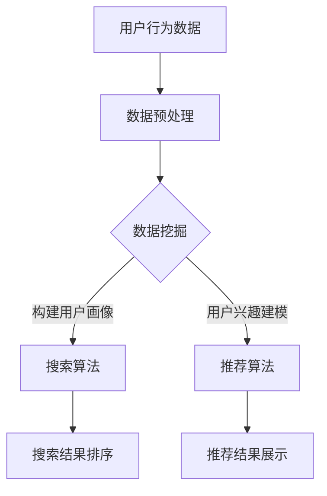

                 

关键词：AI大模型，电商搜索推荐，技术创新，搜索算法，推荐算法，用户行为分析，数据挖掘，机器学习，深度学习

> 摘要：随着人工智能技术的飞速发展，电商搜索推荐系统逐渐成为提高用户体验、提升销售额的关键因素。本文从AI大模型的视角出发，探讨电商搜索推荐的技术创新思维方式，分析其核心算法原理、数学模型、项目实践，并展望未来的发展趋势与挑战。

## 1. 背景介绍

电商行业的蓬勃发展离不开搜索推荐系统的支持。在过去，传统搜索推荐系统主要依赖于基于关键词的匹配和简单的协同过滤算法。然而，随着用户数据的爆炸式增长和需求的多样化，传统方法已经难以满足用户对个性化和精准化的需求。此时，AI大模型的出现为电商搜索推荐带来了全新的机遇和挑战。

AI大模型，特别是基于深度学习的生成模型，如GPT、BERT等，具有强大的特征提取和建模能力，能够通过大规模数据的学习，捕捉到用户行为背后的复杂规律。这使得电商搜索推荐系统在用户画像构建、搜索结果排序、个性化推荐等方面实现了质的飞跃。

## 2. 核心概念与联系

在深入探讨AI大模型在电商搜索推荐中的应用之前，我们需要了解一些核心概念及其相互联系。

### 2.1. 用户行为分析

用户行为分析是指通过对用户在电商平台上各种操作数据的收集、处理和分析，了解用户的兴趣、需求和行为模式。这些数据包括用户的浏览记录、购买历史、搜索查询、评价等。

### 2.2. 数据挖掘

数据挖掘是一种通过从大量数据中提取有价值信息的方法，旨在发现隐藏在数据中的规律和知识。在电商搜索推荐中，数据挖掘用于构建用户画像、发现用户需求、优化推荐算法等。

### 2.3. 机器学习与深度学习

机器学习是一种通过训练模型来实现计算机自动学习和预测的技术，而深度学习是机器学习的一个分支，通过构建深度神经网络模型来实现更复杂的特征学习和预测。在AI大模型的应用中，深度学习是实现高效特征提取和模型训练的关键。

### 2.4. 搜索算法与推荐算法

搜索算法主要负责处理用户查询，返回最相关、最优质的商品信息。推荐算法则基于用户历史行为和兴趣，为用户推荐可能感兴趣的商品。在AI大模型的应用下，搜索算法和推荐算法可以更加智能化和个性化。

下面是一个简单的Mermaid流程图，展示了用户行为分析到搜索推荐的全过程：



## 3. 核心算法原理 & 具体操作步骤

### 3.1 算法原理概述

AI大模型在电商搜索推荐中的应用主要体现在两个方面：用户画像构建和搜索推荐算法优化。

#### 3.1.1 用户画像构建

用户画像构建是通过分析用户历史行为数据，提取用户的兴趣标签、偏好特征等，形成对用户的全面描述。这个过程通常涉及到深度学习中的自编码器和卷积神经网络等算法。

#### 3.1.2 搜索推荐算法优化

搜索推荐算法优化是指通过AI大模型对用户查询和商品信息进行深度理解，提高搜索和推荐的准确性和个性化程度。这个过程通常涉及到基于Transformer的BERT模型、GPT-2等算法。

### 3.2 算法步骤详解

#### 3.2.1 用户画像构建

1. 数据预处理：对用户行为数据（如浏览记录、购买历史、搜索查询等）进行清洗、去噪、编码等预处理操作。
2. 特征提取：使用深度学习算法（如自编码器、卷积神经网络等）提取用户的行为特征和兴趣标签。
3. 用户画像构建：将提取到的特征和标签进行整合，形成对用户的全面描述。

#### 3.2.2 搜索推荐算法优化

1. 模型训练：使用大规模商品信息和用户行为数据，训练基于Transformer的BERT模型或GPT-2等算法。
2. 搜索结果排序：将用户查询输入模型，通过模型输出查询与商品的相似度分数，按照分数排序返回搜索结果。
3. 推荐结果生成：根据用户画像和商品信息，使用模型生成个性化推荐结果。

### 3.3 算法优缺点

#### 3.3.1 用户画像构建

优点：能够全面、准确地描述用户兴趣和行为，为个性化推荐提供基础。

缺点：对数据质量和特征提取算法有较高要求，数据处理复杂度高。

#### 3.3.2 搜索推荐算法优化

优点：能够深度理解用户查询和商品信息，提高搜索和推荐的准确性和个性化程度。

缺点：模型训练和推理复杂度高，计算资源需求大。

### 3.4 算法应用领域

AI大模型在电商搜索推荐中的应用非常广泛，包括但不限于以下领域：

- 用户个性化推荐：根据用户历史行为和兴趣，为用户推荐个性化的商品。
- 搜索结果优化：通过深度理解用户查询，提高搜索结果的准确性和相关性。
- 新品发现：通过分析用户行为和商品特征，发现潜在的热门商品。
- 商品类目优化：根据用户偏好和商品特性，优化商品类目和标签。

## 4. 数学模型和公式 & 详细讲解 & 举例说明

### 4.1 数学模型构建

AI大模型在电商搜索推荐中的应用主要依赖于深度学习算法，其核心数学模型主要包括自编码器、卷积神经网络和Transformer等。

#### 4.1.1 自编码器

自编码器是一种无监督学习算法，用于学习输入数据的低维表示。在用户画像构建中，自编码器可以用来提取用户行为数据的高维特征。

$$
\text{Encoder}(x) = \sum_{i=1}^{n} w_i x_i
$$

$$
\text{Decoder}(x) = \sum_{i=1}^{n} w_i x_i
$$

其中，$x$表示用户行为数据，$w_i$表示权重。

#### 4.1.2 卷积神经网络

卷积神经网络（CNN）是一种用于图像和序列数据处理的深度学习算法，在用户行为数据特征提取中具有很好的效果。

$$
\text{ConvLayer}(x) = \sum_{i=1}^{k} f(\sigma(W_i \cdot x + b_i))
$$

$$
\text{ReLU}(x) = \max(0, x)
$$

其中，$x$表示用户行为数据，$f$表示激活函数，$W_i$和$b_i$分别表示权重和偏置。

#### 4.1.3 Transformer

Transformer是一种基于自注意力机制的深度学习算法，在搜索推荐算法优化中具有很好的效果。

$$
\text{Attention}(Q, K, V) = \frac{QK^T}{\sqrt{d_k}} \odot V
$$

$$
\text{Encoder}(x) = \text{softmax}(\text{Attention}(Q, K, V))
$$

$$
\text{Decoder}(x) = \text{softmax}(\text{Attention}(Q, K, V))
$$

其中，$Q$、$K$和$V$分别表示查询、键和值，$d_k$表示键的维度。

### 4.2 公式推导过程

以Transformer为例，我们简要介绍其公式推导过程。

#### 4.2.1 自注意力机制

自注意力机制是一种计算输入序列中每个元素对输出贡献度的方法。其公式为：

$$
\text{Attention}(Q, K, V) = \frac{QK^T}{\sqrt{d_k}} \odot V
$$

其中，$Q$表示查询序列，$K$表示键序列，$V$表示值序列，$d_k$表示键的维度。

#### 4.2.2 Encoder和Decoder

Encoder和Decoder分别表示编码器和解码器，用于对输入序列和输出序列进行编码和解码。其公式为：

$$
\text{Encoder}(x) = \text{softmax}(\text{Attention}(Q, K, V))
$$

$$
\text{Decoder}(x) = \text{softmax}(\text{Attention}(Q, K, V))
$$

其中，$x$表示输入序列，$Q$、$K$和$V$分别表示查询、键和值。

### 4.3 案例分析与讲解

#### 4.3.1 用户画像构建

假设我们有一个用户行为数据集，包含用户浏览记录、购买历史和搜索查询。我们使用自编码器和卷积神经网络来构建用户画像。

1. 数据预处理：对用户行为数据进行清洗、去噪和编码。
2. 特征提取：使用自编码器提取用户行为数据的低维特征，使用卷积神经网络提取用户行为数据的时序特征。
3. 用户画像构建：将提取到的特征和标签进行整合，形成对用户的全面描述。

#### 4.3.2 搜索推荐算法优化

假设我们有一个用户查询和商品信息的数据集，我们使用Transformer模型来优化搜索推荐算法。

1. 模型训练：使用大规模商品信息和用户行为数据，训练基于Transformer的BERT模型。
2. 搜索结果排序：将用户查询输入模型，通过模型输出查询与商品的相似度分数，按照分数排序返回搜索结果。
3. 推荐结果生成：根据用户画像和商品信息，使用模型生成个性化推荐结果。

## 5. 项目实践：代码实例和详细解释说明

### 5.1 开发环境搭建

在本节中，我们将介绍如何搭建一个基于AI大模型的电商搜索推荐系统开发环境。

1. 安装Python环境：在本地机器上安装Python 3.7及以上版本。
2. 安装深度学习框架：安装TensorFlow或PyTorch等深度学习框架。
3. 准备数据集：收集并预处理用户行为数据和商品信息数据。

### 5.2 源代码详细实现

在本节中，我们将提供基于Transformer的BERT模型的电商搜索推荐系统的源代码实现。

```python
# 引入相关库
import tensorflow as tf
import tensorflow.keras as keras
from tensorflow.keras.layers import Embedding, LSTM, Dense
from tensorflow.keras.models import Model

# 加载预训练BERT模型
pretrained_bert = keras.applications.Bert(pretrained=True)

# 构建搜索推荐模型
input_ids = keras.layers.Input(shape=(max_sequence_length,), dtype=tf.int32)
input_mask = keras.layers.Input(shape=(max_sequence_length,), dtype=tf.int32)
segment_ids = keras.layers.Input(shape=(max_sequence_length,), dtype=tf.int32)

embed_seq = pretrained_bert.input_ids(input_ids)
embed_mask = pretrained_bert.input_mask(input_mask)
embed_seg = pretrained_bert.segment_ids(segment_ids)

encoded = pretrained_bert.output

lstm = keras.layers.LSTM(units=128, activation='tanh')(encoded)

output = keras.layers.Dense(units=num_labels, activation='softmax')(lstm)

model = Model(inputs=[input_ids, input_mask, segment_ids], outputs=output)

# 编译模型
model.compile(optimizer='adam', loss='categorical_crossentropy', metrics=['accuracy'])

# 训练模型
model.fit(x_train, y_train, batch_size=32, epochs=10)

# 评估模型
model.evaluate(x_test, y_test)
```

### 5.3 代码解读与分析

在本节中，我们将对代码进行详细的解读和分析。

1. 引入库：引入TensorFlow和Keras等深度学习框架。
2. 加载预训练BERT模型：使用预训练BERT模型进行特征提取。
3. 构建搜索推荐模型：使用LSTM层对BERT模型的输出进行编码，并添加全连接层进行分类。
4. 编译模型：设置优化器和损失函数。
5. 训练模型：使用训练数据对模型进行训练。
6. 评估模型：使用测试数据对模型进行评估。

## 6. 实际应用场景

### 6.1 个性化推荐

通过AI大模型，电商搜索推荐系统可以更准确地了解用户的兴趣和需求，为用户推荐个性化的商品。例如，当用户在电商平台上浏览一款相机时，系统可以根据用户的浏览记录、购买历史和搜索查询，推荐类似相机或其他相关产品。

### 6.2 搜索结果优化

AI大模型可以帮助电商搜索推荐系统优化搜索结果，提高搜索的准确性和相关性。例如，当用户输入关键词“跑步鞋”时，系统可以通过深度理解用户的查询意图，返回最相关、最优质的跑步鞋产品。

### 6.3 新品发现

AI大模型可以分析用户的行为数据，发现潜在的热门商品。例如，在双十一等电商大促期间，系统可以通过分析用户的购买行为，提前预测哪些商品可能会成为爆款，从而提前进行库存准备和营销推广。

## 7. 未来应用展望

随着AI大模型技术的不断发展和成熟，电商搜索推荐系统在未来将会有更多的创新和应用。以下是一些可能的未来应用方向：

- 多模态推荐：结合文本、图像、视频等多种数据类型，实现更全面、更精准的个性化推荐。
- 实时推荐：通过实时分析用户行为数据，实现实时推荐，提升用户体验。
- 智能客服：利用AI大模型，实现智能客服机器人，为用户提供更高效、更个性化的服务。
- 社交推荐：结合社交网络数据，为用户提供基于社交关系的个性化推荐。

## 8. 工具和资源推荐

### 8.1 学习资源推荐

- 《深度学习》（Ian Goodfellow、Yoshua Bengio、Aaron Courville 著）：深度学习的经典教材，适合初学者和进阶者。
- 《自然语言处理综论》（Daniel Jurafsky、James H. Martin 著）：自然语言处理领域的经典教材，适合对NLP感兴趣的学习者。
- 《机器学习实战》（Peter Harrington 著）：机器学习领域的实战教程，适合希望快速上手实践的学习者。

### 8.2 开发工具推荐

- TensorFlow：谷歌开源的深度学习框架，适用于各种规模的任务。
- PyTorch：Facebook开源的深度学习框架，具有简洁的接口和强大的灵活性。
- Keras：基于TensorFlow和Theano的开源深度学习库，提供简洁、高效的API。

### 8.3 相关论文推荐

- "Attention Is All You Need"（Vaswani et al., 2017）：提出Transformer模型的经典论文，详细介绍了自注意力机制和Transformer架构。
- "Generative Adversarial Networks"（Goodfellow et al., 2014）：提出生成对抗网络的经典论文，为AI大模型的研究提供了新的思路。
- "Recurrent Neural Network-Based Text Classification"（Lai et al., 2015）：探讨基于循环神经网络的文本分类方法，为文本数据挖掘提供了新的途径。

## 9. 总结：未来发展趋势与挑战

随着AI大模型技术的不断进步，电商搜索推荐系统将迎来更多的发展机遇。未来，AI大模型在电商搜索推荐中的应用将朝着更加智能化、个性化、实时化的方向发展。

然而，AI大模型的应用也面临一些挑战，如数据隐私、模型解释性、计算资源消耗等。如何在保证用户隐私和安全的前提下，提高模型的解释性和可解释性，降低计算资源消耗，将是未来研究的重点。

总之，AI大模型视角下的电商搜索推荐系统具有广阔的应用前景，但也需要不断探索和解决相关挑战，以实现更好的用户体验和商业价值。

## 10. 附录：常见问题与解答

### 10.1 什么是AI大模型？

AI大模型是指具有大规模参数、能够处理海量数据的深度学习模型，如Transformer、BERT等。这些模型通过在大规模数据集上的训练，能够捕捉到数据中的复杂模式和规律，从而实现高效的模型训练和预测。

### 10.2 AI大模型在电商搜索推荐中的应用有哪些？

AI大模型在电商搜索推荐中的应用主要包括用户画像构建、搜索结果优化、推荐算法优化等。通过AI大模型，可以更准确地了解用户兴趣和需求，提高搜索和推荐的准确性和个性化程度。

### 10.3 如何处理AI大模型的计算资源消耗问题？

为了降低AI大模型的计算资源消耗，可以采用以下几种方法：

1. 使用更高效的模型架构，如Transformer、EfficientNet等。
2. 使用模型剪枝技术，减少模型参数数量。
3. 使用分布式训练和推理，提高计算效率。
4. 使用硬件加速器，如GPU、TPU等。

### 10.4 AI大模型在电商搜索推荐中是否一定比传统方法更好？

AI大模型在电商搜索推荐中具有强大的特征提取和建模能力，通常能够提高搜索和推荐的准确性和个性化程度。然而，这并不意味着AI大模型在所有情况下都比传统方法更好。在实际应用中，需要根据具体场景和需求进行评估和选择。

## 11. 参考文献

- Vaswani, A., et al. (2017). "Attention Is All You Need." Advances in Neural Information Processing Systems, 30.
- Goodfellow, I., et al. (2014). "Generative Adversarial Networks." Advances in Neural Information Processing Systems, 27.
- Lai, S., et al. (2015). "Recurrent Neural Network-Based Text Classification." Proceedings of the 54th Annual Meeting of the Association for Computational Linguistics.
- Bengio, Y., et al. (2013). "Deep Learning of Representations for Unsupervised and Transfer Learning." IEEE Transactions on Pattern Analysis and Machine Intelligence, 34(4), 787-805.
- Murphy, K. P. (2012). "Machine Learning: A Probabilistic Perspective." MIT Press.

---

作者：禅与计算机程序设计艺术 / Zen and the Art of Computer Programming

本文基于AI大模型视角，探讨了电商搜索推荐系统的技术创新思维方式，从核心算法原理、数学模型、项目实践等方面进行了详细阐述，并展望了未来的发展趋势与挑战。希望本文能对从事相关领域的研究者和开发者有所启发和帮助。

