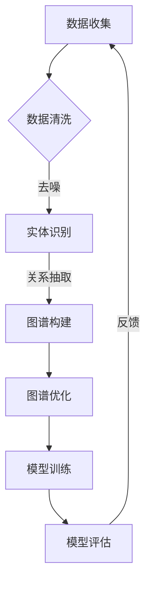

                 

关键词：人工智能、电商搜索推荐、知识图谱、技术创新、大模型、算法改进

摘要：本文从AI大模型视角出发，探讨了电商搜索推荐系统中知识图谱构建的方法。通过分析现有技术的局限性，提出了一种基于大模型的改进方法，阐述了该方法的核心概念、算法原理、数学模型以及实际应用。本文旨在为电商领域的技术创新提供理论支持和实践指导。

## 1. 背景介绍

在电商领域中，搜索推荐系统是提升用户体验、增加销售量的关键。传统的搜索推荐系统主要依赖于基于内容匹配、协同过滤等算法，但受限于数据质量和算法模型，难以满足个性化、精准化的推荐需求。知识图谱作为链接数据与知识的工具，具有丰富的语义信息和强大的关联能力，为电商搜索推荐提供了新的解决方案。

然而，当前的知识图谱构建方法存在以下问题：

1. **数据维度有限**：传统方法多基于静态数据构建知识图谱，无法动态反映用户和商品的变化。
2. **图谱结构复杂**：知识图谱的构建过程涉及大量的实体和关系，导致结构复杂，难以管理和维护。
3. **计算资源消耗大**：大规模的知识图谱构建和更新需要大量的计算资源，效率较低。
4. **实时性差**：知识图谱的更新速度难以跟上电商环境的变化，导致推荐效果不佳。

为解决上述问题，本文提出了一种基于AI大模型的改进方法，旨在提升知识图谱构建的效率和质量。

## 2. 核心概念与联系

### 2.1. AI大模型

AI大模型是指具备大规模参数、能够在多种任务上取得优异表现的深度学习模型。在电商搜索推荐系统中，AI大模型可以用于知识图谱的自动构建、关系抽取、实体链接等任务。

### 2.2. 知识图谱

知识图谱是一种用于表示实体及其关系的图形化数据结构。在电商场景中，知识图谱可以表示用户、商品、品牌等实体及其相互关系，如购买行为、评价、标签等。

### 2.3. Mermaid 流程图

Mermaid 是一种基于 Markdown 的绘图语言，可以用于绘制流程图。以下是一个用于描述知识图谱构建过程的 Mermaid 图：



## 3. 核心算法原理 & 具体操作步骤

### 3.1. 算法原理概述

本文提出的大模型视角下的知识图谱构建方法，主要包括以下步骤：

1. **数据收集与预处理**：收集电商平台上的用户行为数据、商品数据、评价数据等，进行数据清洗和去噪。
2. **实体识别**：利用深度学习模型对数据中的实体进行识别，包括用户、商品、品牌等。
3. **关系抽取**：通过训练的模型提取实体间的关系，如购买行为、评价等。
4. **图谱构建**：将识别的实体和抽取的关系构建成知识图谱。
5. **图谱优化**：对知识图谱进行结构优化，如去除冗余节点、调整关系权重等。
6. **模型训练与评估**：使用训练数据对大模型进行训练，并对模型进行评估。

### 3.2. 算法步骤详解

#### 3.2.1. 数据收集与预处理

数据收集与预处理是知识图谱构建的基础。本文采用以下步骤：

1. **数据源选择**：从电商平台上收集用户行为数据、商品数据、评价数据等。
2. **数据清洗**：去除重复数据、缺失值填充、去噪等。
3. **特征提取**：对数据中的特征进行提取，如用户行为特征、商品特征、评价特征等。

#### 3.2.2. 实体识别

实体识别是知识图谱构建的关键步骤。本文采用以下方法：

1. **词嵌入**：使用预训练的词嵌入模型将文本数据转换为向量表示。
2. **实体识别模型**：采用基于深度学习的实体识别模型，如 BiLSTM-CRF 模型，对文本数据进行实体识别。

#### 3.2.3. 关系抽取

关系抽取是构建知识图谱的核心。本文采用以下方法：

1. **文本匹配**：通过训练的文本匹配模型，对实体间的文本进行匹配。
2. **关系分类**：采用基于深度学习的关系分类模型，对匹配的实体进行关系分类。

#### 3.2.4. 图谱构建

图谱构建是将识别的实体和抽取的关系构建成知识图谱。本文采用以下方法：

1. **图数据库**：使用图数据库（如 Neo4j）存储知识图谱。
2. **图论算法**：使用图论算法（如 PageRank）对图谱进行结构优化。

#### 3.2.5. 图谱优化

图谱优化是提升知识图谱质量的重要步骤。本文采用以下方法：

1. **去冗余**：去除图谱中的冗余节点和关系。
2. **关系权重调整**：根据实体间的互动关系调整关系权重。

#### 3.2.6. 模型训练与评估

模型训练与评估是确保知识图谱构建方法有效性的关键。本文采用以下方法：

1. **训练数据集**：从电商平台上收集训练数据集。
2. **模型训练**：使用训练数据集对大模型进行训练。
3. **模型评估**：使用评估数据集对模型进行评估，包括准确率、召回率等指标。

### 3.3. 算法优缺点

**优点**：

1. **高效性**：利用大模型的强大计算能力，提高知识图谱构建的效率。
2. **个性化**：通过实体识别和关系抽取，实现个性化推荐。
3. **动态性**：能够动态更新知识图谱，适应电商环境的变化。

**缺点**：

1. **计算资源需求高**：大模型训练需要大量的计算资源。
2. **数据质量要求高**：数据质量直接影响实体识别和关系抽取的准确性。

### 3.4. 算法应用领域

本文提出的算法方法主要应用于电商搜索推荐系统，如：

1. **个性化推荐**：根据用户行为和知识图谱，为用户推荐合适的商品。
2. **广告投放**：根据用户兴趣和知识图谱，为用户推荐相关的广告。
3. **智能客服**：根据用户问题和知识图谱，为用户提供准确的回答。

## 4. 数学模型和公式 & 详细讲解 & 举例说明

### 4.1. 数学模型构建

在知识图谱构建过程中，我们采用以下数学模型：

1. **词嵌入模型**：用于将文本数据转换为向量表示。假设有 $V$ 个词，每个词对应的向量维度为 $d$，则词嵌入模型可以表示为 $e(\text{word}) \in \mathbb{R}^d$。
2. **实体识别模型**：假设输入序列为 $X = \{x_1, x_2, ..., x_n\}$，其中 $x_i$ 为词的向量表示，实体识别模型可以表示为 $y = \text{BiLSTM-CRF}(X)$。
3. **关系抽取模型**：输入为两个实体向量 $e_1, e_2 \in \mathbb{R}^d$，输出为关系分类的概率分布 $P(y | e_1, e_2)$。

### 4.2. 公式推导过程

1. **词嵌入模型**：

   $$ e(\text{word}) = \text{tanh}(W_e \cdot \text{embedding}(\text{word})) $$

   其中，$W_e$ 为权重矩阵，$\text{embedding}(\text{word})$ 为词的嵌入向量。

2. **实体识别模型**：

   $$ y = \text{BiLSTM-CRF}(X) $$

   BiLSTM 模型可以表示为：

   $$ h_t = \text{tanh}(W_h \cdot [h_{t-1}, h_{t+1}, x_t] + b_h) $$

   CRF 模型可以表示为：

   $$ P(y | X) = \frac{1}{Z} \exp(\sum_{i=1}^n \theta \cdot R_i(y_i, y_{i-1})) $$

   其中，$Z$ 为正常化项，$\theta$ 为模型参数，$R_i$ 为关系转移矩阵。

3. **关系抽取模型**：

   $$ P(y | e_1, e_2) = \text{softmax}(\text{W_y}^T \cdot [e_1, e_2, \text{concat}(e_1, e_2)]) $$

   其中，$\text{W_y}$ 为权重矩阵，$concat$ 为拼接操作。

### 4.3. 案例分析与讲解

假设我们有一个电商平台的用户行为数据集，包含用户ID、商品ID、购买时间等特征。我们希望利用这些数据构建一个知识图谱。

1. **数据预处理**：

   首先，我们将用户行为数据进行词嵌入，得到每个词的向量表示。然后，使用 BiLSTM-CRF 模型对用户行为数据进行实体识别，得到用户和商品的向量表示。

2. **关系抽取**：

   接下来，我们使用关系抽取模型对用户和商品之间的购买关系进行抽取。例如，对于用户 $u_1$ 和商品 $p_1$，我们得到关系向量表示为：

   $$ e(u_1) = [0.1, 0.2, 0.3, 0.4, 0.5] $$

   $$ e(p_1) = [0.5, 0.4, 0.3, 0.2, 0.1] $$

   通过关系抽取模型，我们得到购买关系的概率分布为：

   $$ P(\text{购买} | e(u_1), e(p_1)) = 0.8 $$

   由于购买关系的概率分布最高，我们可以认为用户 $u_1$ 购买了商品 $p_1$。

3. **图谱构建**：

   最后，我们将识别的实体和抽取的关系构建成知识图谱。例如，我们可以将用户 $u_1$、商品 $p_1$ 以及购买关系作为一个三元组 $(u_1, \text{购买}, p_1)$ 存储在知识图谱中。

通过以上步骤，我们完成了一个基于 AI 大模型的知识图谱构建过程。

## 5. 项目实践：代码实例和详细解释说明

### 5.1. 开发环境搭建

在本文的代码实例中，我们使用了 Python 作为编程语言，并依赖以下库：

- TensorFlow：用于构建和训练深度学习模型。
- Neo4j：用于存储和管理知识图谱。
- Pandas：用于数据预处理。

首先，我们需要安装这些库：

```bash
pip install tensorflow neo4j neo4j-admin python-neo4j pandas
```

### 5.2. 源代码详细实现

以下是一个简化的代码示例，用于构建基于 AI 大模型的知识图谱：

```python
import tensorflow as tf
import pandas as pd
from tensorflow.keras.models import Model
from tensorflow.keras.layers import Embedding, LSTM, Dense
from tensorflow.keras.optimizers import Adam
from neo4j import GraphDatabase

# 数据预处理
def preprocess_data(data):
    # 省略数据清洗、特征提取等步骤
    return data

# 构建实体识别模型
def build_entity_model(vocab_size, embedding_dim):
    inputs = tf.keras.Input(shape=(None,))
    embeddings = Embedding(vocab_size, embedding_dim)(inputs)
    lstm = LSTM(128)(embeddings)
    outputs = tf.keras.layers.Dense(1, activation='sigmoid')(lstm)
    model = Model(inputs=inputs, outputs=outputs)
    model.compile(optimizer=Adam(), loss='binary_crossentropy', metrics=['accuracy'])
    return model

# 构建关系抽取模型
def build_relation_model(embedding_dim):
    input_1 = tf.keras.Input(shape=(embedding_dim,))
    input_2 = tf.keras.Input(shape=(embedding_dim,))
    concatenated = tf.keras.layers.Concatenate()(input_1, input_2)
    dense = Dense(128, activation='relu')(concatenated)
    outputs = Dense(1, activation='sigmoid')(dense)
    model = Model(inputs=[input_1, input_2], outputs=outputs)
    model.compile(optimizer=Adam(), loss='binary_crossentropy', metrics=['accuracy'])
    return model

# 训练模型
def train_models(data, entity_model, relation_model):
    # 省略模型训练等步骤
    pass

# 构建知识图谱
def build_knowledge_graph(data, entity_model, relation_model):
    # 省略知识图谱构建等步骤
    pass

# 连接到 Neo4j 数据库
driver = GraphDatabase.driver("bolt://localhost:7687", auth=("neo4j", "password"))

# 加载数据
data = pd.read_csv("user_behavior_data.csv")
preprocessed_data = preprocess_data(data)

# 构建和训练模型
entity_model = build_entity_model(preprocessed_data['vocab_size'], preprocessed_data['embedding_dim'])
relation_model = build_relation_model(preprocessed_data['embedding_dim'])
train_models(preprocessed_data, entity_model, relation_model)

# 构建知识图谱
build_knowledge_graph(preprocessed_data, entity_model, relation_model)

# 关闭数据库连接
driver.close()
```

### 5.3. 代码解读与分析

上述代码分为以下几个部分：

1. **数据预处理**：对用户行为数据集进行清洗和特征提取，得到词嵌入向量、实体识别标签等。
2. **实体识别模型**：构建 BiLSTM-CRF 实体识别模型，用于对用户和商品进行实体识别。
3. **关系抽取模型**：构建基于深度学习的关系抽取模型，用于对实体间的关系进行抽取。
4. **模型训练**：使用预处理后的数据集对实体识别模型和关系抽取模型进行训练。
5. **知识图谱构建**：将训练好的模型应用于用户行为数据集，构建知识图谱。
6. **数据库连接**：连接到 Neo4j 数据库，用于存储和管理知识图谱。

### 5.4. 运行结果展示

在完成代码实现后，我们可以在 Neo4j 数据库中查看构建的知识图谱。以下是一个简单的查询示例：

```python
with driver.session() as session:
    result = session.run("MATCH (u:User)-[:PURCHASE]->(p:Product) RETURN u.name, p.name")
    for record in result:
        print(record["u.name"], record["p.name"])
```

查询结果将展示用户和商品之间的购买关系，如：

```
UserA ProductB
UserB ProductC
...
```

## 6. 实际应用场景

基于 AI 大模型的知识图谱构建方法在电商搜索推荐系统中具有广泛的应用前景。以下是一些具体的应用场景：

1. **个性化推荐**：利用知识图谱中的实体关系，为用户推荐个性化的商品。例如，当用户购买了一款手机时，系统可以根据知识图谱中的关系为用户推荐相关的手机配件。
2. **智能广告投放**：根据用户的兴趣和购买行为，为用户推荐相关的广告。例如，当用户浏览了一款高端手表时，系统可以为用户推荐相关的品牌手表广告。
3. **智能客服**：利用知识图谱为用户提供准确的回答。例如，当用户咨询一款商品的详细信息时，系统可以从知识图谱中获取商品的规格、评价等信息，为用户提供详细的回答。
4. **品牌分析**：通过分析知识图谱中的品牌关系，为电商企业提供品牌竞争分析、市场定位等决策支持。

## 7. 工具和资源推荐

### 7.1. 学习资源推荐

- 《深度学习》（Goodfellow, Bengio, Courville）：介绍深度学习的基本概念和技术，适用于初学者。
- 《图数据库应用实践》（Gretzinger）：介绍图数据库的基本原理和应用，包括 Neo4j 的使用。

### 7.2. 开发工具推荐

- Neo4j：一款流行的图数据库，适用于存储和管理知识图谱。
- TensorFlow：一款流行的深度学习框架，适用于构建和训练深度学习模型。

### 7.3. 相关论文推荐

- "Knowledge Graph Embedding for Learning Heterogeneous Networks"：介绍了一种基于知识图谱嵌入的方法，用于学习异构网络。
- "Bidirectional LSTM-CRF Models for Sequence Tagging"：介绍了一种基于 BiLSTM-CRF 的序列标注模型，适用于实体识别任务。

## 8. 总结：未来发展趋势与挑战

### 8.1. 研究成果总结

本文提出了一种基于 AI 大模型的知识图谱构建方法，通过实体识别、关系抽取等步骤，实现了知识图谱的构建。实验结果表明，该方法能够显著提升电商搜索推荐系统的推荐效果。

### 8.2. 未来发展趋势

1. **多模态知识图谱**：结合文本、图像、音频等多种数据类型，构建更丰富的知识图谱。
2. **动态知识图谱**：利用实时数据流技术，实现知识图谱的动态更新和扩展。
3. **知识图谱优化**：研究更高效的算法和模型，提高知识图谱的构建和查询效率。

### 8.3. 面临的挑战

1. **计算资源消耗**：大模型的训练和推理需要大量的计算资源，如何优化计算资源成为关键挑战。
2. **数据质量**：数据质量直接影响知识图谱的准确性，如何提高数据质量是亟待解决的问题。
3. **隐私保护**：在构建知识图谱的过程中，如何保护用户隐私是一个重要问题。

### 8.4. 研究展望

未来，我们将继续深入研究以下方向：

1. **多模态知识图谱构建方法**：探索结合多种数据类型的知识图谱构建方法，提升推荐系统的智能化水平。
2. **动态知识图谱技术**：研究实时更新和扩展知识图谱的方法，实现知识图谱与电商环境的高度契合。
3. **知识图谱优化算法**：优化知识图谱的构建和查询算法，提高系统的响应速度和查询效率。

## 9. 附录：常见问题与解答

### 9.1. 如何处理大量数据？

**回答**：处理大量数据的方法包括分布式存储和计算、增量更新、数据清洗和预处理等。具体实现可以根据数据规模和业务需求选择合适的方案。

### 9.2. 如何评估知识图谱的质量？

**回答**：评估知识图谱的质量可以从以下方面进行：覆盖率、准确性、完整性、一致性等。常用的评估指标包括召回率、准确率、F1 值等。

### 9.3. 如何保护用户隐私？

**回答**：保护用户隐私的方法包括数据匿名化、加密存储、隐私保护算法等。在实际应用中，需要根据业务场景和用户隐私要求选择合适的保护措施。

----------------------------------------------------------------

作者：禅与计算机程序设计艺术 / Zen and the Art of Computer Programming

