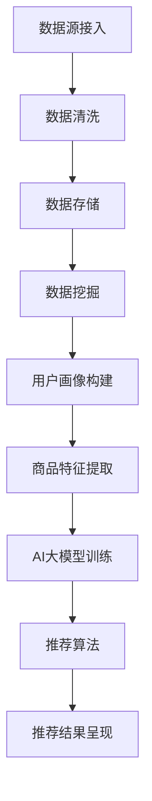

                 

关键词：AI大模型，电商搜索推荐，知识库管理，技术创新，流程优化

摘要：本文从AI大模型的角度出发，探讨电商搜索推荐系统中的技术创新与知识库管理流程优化。通过深入分析大模型在电商搜索推荐中的作用，阐述其在提升用户满意度、优化推荐效果方面的潜力，并提出一套优化知识库管理流程的方案，为电商企业提供有效的技术指导。

## 1. 背景介绍

随着互联网的快速发展，电商行业迎来了前所未有的繁荣。在激烈的竞争环境中，电商企业纷纷将目光投向了搜索推荐系统，希望通过精准的推荐提升用户体验，从而提高销售额。传统的搜索推荐系统主要依赖于基于内容的推荐和协同过滤等方法，这些方法在处理海量数据时往往存在一定的局限性。

近年来，人工智能技术的飞速发展为电商搜索推荐系统带来了新的机遇。特别是AI大模型，如BERT、GPT等，通过深度学习和自然语言处理技术，能够对用户行为和偏好进行更加精准的预测，从而提升推荐效果。与此同时，知识库管理在电商搜索推荐中也发挥着越来越重要的作用，通过对商品属性、用户反馈等信息的整理和挖掘，为推荐系统提供更加丰富的数据支持。

本文旨在探讨AI大模型在电商搜索推荐中的技术创新，以及知识库管理流程的优化，为电商企业提供一套行之有效的解决方案。

### 1.1 电商搜索推荐系统的发展历程

电商搜索推荐系统的发展可以分为以下几个阶段：

#### 1.1.1 传统推荐阶段

在电商搜索推荐系统发展的早期，主要依赖于基于内容的推荐和协同过滤等方法。基于内容的推荐通过分析商品的内容特征和用户的兴趣偏好，实现个性化的推荐。协同过滤则通过分析用户之间的相似性，为用户提供个性化的推荐。这些方法在一定程度上能够提升推荐效果，但存在以下局限性：

1. 需要大量的用户数据，对数据质量要求较高。
2. 难以应对冷启动问题，即对新用户和新商品无法提供有效的推荐。
3. 无法充分利用语义信息，导致推荐效果受到一定程度的限制。

#### 1.1.2 机器学习推荐阶段

随着机器学习技术的发展，电商搜索推荐系统逐渐引入了基于机器学习的方法。其中，基于矩阵分解的协同过滤方法得到了广泛应用，通过学习用户-商品评分矩阵，实现个性化的推荐。此外，深度学习技术也被引入到推荐系统中，如基于深度神经网络的推荐模型，通过学习用户行为和偏好，实现更加精准的推荐。

#### 1.1.3 人工智能推荐阶段

近年来，人工智能技术的飞速发展为电商搜索推荐系统带来了新的机遇。特别是AI大模型，如BERT、GPT等，通过深度学习和自然语言处理技术，能够对用户行为和偏好进行更加精准的预测，从而提升推荐效果。这些大模型在处理海量数据、理解语义信息方面具有显著优势，为电商搜索推荐系统的发展提供了强有力的支持。

### 1.2 知识库管理在电商搜索推荐中的作用

知识库管理在电商搜索推荐系统中具有重要作用，主要体现在以下几个方面：

#### 1.2.1 数据整合与清洗

知识库管理能够对电商平台上海量商品数据、用户行为数据等进行整合和清洗，确保数据质量，为推荐系统提供可靠的数据支持。

#### 1.2.2 语义理解与信息抽取

通过知识库管理，可以实现对商品属性、用户反馈等信息的语义理解与信息抽取，为推荐系统提供更加丰富的语义信息，提升推荐效果。

#### 1.2.3 知识融合与推理

知识库管理还能够实现对不同数据源的知识融合与推理，为推荐系统提供更加全面的用户画像和商品描述，从而提高推荐精度。

### 1.3 研究现状与问题

目前，AI大模型在电商搜索推荐领域已经取得了显著的成果。例如，谷歌的BERT模型在电商搜索推荐任务中取得了较高的推荐效果。然而，研究现状仍然存在一些问题：

1. 大模型训练与推理成本较高，对硬件资源要求较高。
2. 大模型在处理长文本和复杂语义时存在一定局限性。
3. 知识库管理与推荐系统之间的协同效应尚未充分发挥。

本文将从AI大模型视角出发，探讨电商搜索推荐系统中的技术创新与知识库管理流程优化，以期解决上述问题，为电商企业提供有效的技术指导。

## 2. 核心概念与联系

### 2.1 AI大模型

AI大模型是指具有大规模参数、能够处理复杂任务的深度学习模型。常见的AI大模型包括BERT、GPT、BERT-GPT等。这些模型通过在大型数据集上进行预训练，能够对自然语言进行建模，从而实现对用户行为和偏好的精准预测。

### 2.2 知识库管理

知识库管理是指对电商平台上各种数据进行整合、清洗、存储、挖掘和管理的过程。知识库管理包括数据源接入、数据清洗、数据存储、数据挖掘和应用等多个环节。

### 2.3 电商搜索推荐系统

电商搜索推荐系统是指利用AI大模型和知识库管理技术，为用户提供个性化推荐服务的系统。电商搜索推荐系统主要包括用户画像构建、商品特征提取、推荐算法和推荐结果呈现等模块。

### 2.4 关系与协同效应

AI大模型与知识库管理在电商搜索推荐系统中具有紧密的联系和协同效应。一方面，AI大模型能够对知识库中的数据进行深度学习和语义理解，从而提升推荐效果；另一方面，知识库管理能够为AI大模型提供丰富的数据支持，使模型能够更好地拟合用户行为和偏好。

### 2.5 Mermaid流程图

下面是电商搜索推荐系统中AI大模型与知识库管理的Mermaid流程图：



## 3. 核心算法原理 & 具体操作步骤

### 3.1 算法原理概述

电商搜索推荐系统中的核心算法主要包括用户画像构建、商品特征提取、推荐算法和推荐结果呈现。其中，AI大模型在用户画像构建和商品特征提取环节发挥着重要作用。

#### 3.1.1 用户画像构建

用户画像是指对用户行为和偏好的多维度描述。通过构建用户画像，可以实现对用户的个性化推荐。AI大模型通过在大型数据集上进行预训练，能够自动提取用户行为的潜在特征，从而构建用户画像。

#### 3.1.2 商品特征提取

商品特征是指对商品属性和描述的抽象表示。通过提取商品特征，可以为推荐算法提供丰富的数据支持。AI大模型通过自然语言处理技术，能够自动提取商品的关键特征，从而提升推荐效果。

#### 3.1.3 推荐算法

推荐算法是指根据用户画像和商品特征，为用户生成个性化推荐列表的算法。常见的推荐算法包括基于内容的推荐、协同过滤、深度学习等。AI大模型在推荐算法中发挥着重要作用，能够通过深度学习和语义理解，实现更加精准的推荐。

#### 3.1.4 推荐结果呈现

推荐结果呈现是指将生成的个性化推荐列表呈现给用户。推荐结果呈现的界面和交互设计对于提升用户满意度至关重要。AI大模型可以结合用户反馈和交互行为，动态调整推荐结果，从而提升用户满意度。

### 3.2 算法步骤详解

下面是电商搜索推荐系统中AI大模型与知识库管理的具体操作步骤：

#### 3.2.1 数据源接入

1. 从电商平台获取用户行为数据、商品属性数据等。
2. 对数据进行清洗和预处理，去除噪声和异常值。

#### 3.2.2 数据清洗

1. 去除重复数据、缺失数据等。
2. 对文本数据进行分词、去停用词等预处理。

#### 3.2.3 数据存储

1. 将清洗后的数据存储到数据库中，方便后续查询和使用。

#### 3.2.4 数据挖掘

1. 使用AI大模型（如BERT）对用户行为数据进行分析，提取用户兴趣特征。
2. 使用AI大模型（如GPT）对商品属性数据进行分析，提取商品关键特征。

#### 3.2.5 用户画像构建

1. 根据用户兴趣特征，构建用户画像。
2. 对用户画像进行分类和标签化，以便后续推荐。

#### 3.2.6 商品特征提取

1. 根据商品关键特征，构建商品特征向量。
2. 对商品特征向量进行归一化和标准化，以便后续计算。

#### 3.2.7 推荐算法

1. 使用协同过滤算法，根据用户画像和商品特征生成推荐列表。
2. 使用基于内容的推荐算法，根据用户兴趣和商品内容生成推荐列表。
3. 结合用户反馈和交互行为，动态调整推荐结果。

#### 3.2.8 推荐结果呈现

1. 将生成的推荐列表呈现给用户，包括商品图片、描述、价格等信息。
2. 根据用户反馈和交互行为，动态调整推荐结果。

### 3.3 算法优缺点

#### 3.3.1 优点

1. 提高推荐效果：AI大模型能够自动提取用户行为和商品特征，实现更加精准的推荐。
2. 处理海量数据：AI大模型在处理海量数据时具有显著优势，能够应对大数据环境。
3. 适应性强：AI大模型能够根据用户反馈和交互行为动态调整推荐结果，提升用户满意度。

#### 3.3.2 缺点

1. 训练成本高：AI大模型需要大量数据和计算资源进行训练，对硬件资源要求较高。
2. 数据质量要求高：AI大模型对数据质量要求较高，需要保证数据的完整性、准确性和一致性。
3. 处理长文本和复杂语义时存在一定局限性：AI大模型在处理长文本和复杂语义时，存在一定局限性，需要进一步优化算法。

### 3.4 算法应用领域

AI大模型在电商搜索推荐系统中具有广泛的应用领域：

1. 电商行业：通过AI大模型，可以为电商企业提供个性化的推荐服务，提升用户满意度和销售额。
2. 互联网金融：通过AI大模型，可以为金融机构提供风险控制和信用评估服务，提高业务效率和准确性。
3. 娱乐行业：通过AI大模型，可以为娱乐企业提供个性化的内容推荐，提升用户黏性和留存率。
4. 医疗健康：通过AI大模型，可以为医疗机构提供智能诊断和治疗方案推荐，提高医疗质量和效率。

## 4. 数学模型和公式 & 详细讲解 & 举例说明

### 4.1 数学模型构建

在电商搜索推荐系统中，数学模型主要用于描述用户行为、商品特征和推荐算法之间的关系。以下是几个常见的数学模型：

#### 4.1.1 用户行为模型

用户行为模型主要用于描述用户对商品的操作行为，如点击、购买、收藏等。一个简单的用户行为模型可以表示为：

$$
u_t = f(u_{t-1}, x_t, w)
$$

其中，$u_t$表示第$t$个时间点的用户行为，$u_{t-1}$表示第$t-1$个时间点的用户行为，$x_t$表示第$t$个时间点的商品特征，$w$表示模型参数。

#### 4.1.2 商品特征模型

商品特征模型主要用于描述商品属性和描述，如价格、销量、评价等。一个简单的商品特征模型可以表示为：

$$
x_t = g(x_{t-1}, v_t, h)
$$

其中，$x_t$表示第$t$个时间点的商品特征，$x_{t-1}$表示第$t-1$个时间点的商品特征，$v_t$表示第$t$个时间点的用户评价，$h$表示模型参数。

#### 4.1.3 推荐算法模型

推荐算法模型主要用于生成个性化推荐列表。一个简单的推荐算法模型可以表示为：

$$
r_t = k(u_t, x_t, q)
$$

其中，$r_t$表示第$t$个时间点的推荐列表，$u_t$表示第$t$个时间点的用户行为，$x_t$表示第$t$个时间点的商品特征，$q$表示模型参数。

### 4.2 公式推导过程

以下是用户行为模型的推导过程：

1. 假设用户行为服从马尔可夫过程，即用户当前行为仅与上一时刻的行为相关。

2. 对用户行为进行概率分布建模，即：

$$
P(u_t = j | u_{t-1} = i) = p_{ij}
$$

其中，$u_t$表示第$t$个时间点的用户行为，$u_{t-1}$表示第$t-1$个时间点的用户行为，$j$表示用户行为的取值，$i$表示用户行为的取值。

3. 根据马尔可夫性质，有：

$$
P(u_t = j | u_{t-1} = i) = P(u_t = j | u_{t-2} = i) = ... = P(u_t = j | u_0 = i)
$$

4. 将概率分布建模转化为矩阵形式，即：

$$
P = \begin{bmatrix}
p_{11} & p_{12} & ... & p_{1n} \\
p_{21} & p_{22} & ... & p_{2n} \\
... & ... & ... & ... \\
p_{n1} & p_{n2} & ... & p_{nn}
\end{bmatrix}
$$

其中，$P$表示转移概率矩阵，$p_{ij}$表示从行为$i$转移到行为$j$的概率。

5. 对用户行为进行建模，即：

$$
u_t = \sum_{i=1}^{n} p_{i1} u_{t-1} + \sum_{i=1}^{n} p_{i2} u_{t-2} + ... + \sum_{i=1}^{n} p_{in} u_{t-n}
$$

6. 根据最小二乘法，对模型参数进行优化，即：

$$
\min_{w} \sum_{t=1}^{T} (u_t - \sum_{i=1}^{n} p_{i1} u_{t-1} - \sum_{i=1}^{n} p_{i2} u_{t-2} - ... - \sum_{i=1}^{n} p_{in} u_{t-n})^2
$$

其中，$T$表示时间步数，$w$表示模型参数。

### 4.3 案例分析与讲解

#### 4.3.1 案例背景

假设用户小明在电商平台上浏览了5个商品，分别是A、B、C、D和E。其中，商品A是小明最近浏览的，商品B是小明以前购买过的，商品C是小明最近浏览过的，商品D是小明以前浏览过的，商品E是小明最近浏览过的。现在需要根据小明的行为和商品特征，为小明生成一个个性化推荐列表。

#### 4.3.2 数据预处理

1. 对用户行为数据进行编码，即将浏览、购买、收藏等行为转化为数字。

2. 对商品特征数据进行编码，即将商品属性和描述转化为向量。

3. 对用户行为数据和商品特征数据进行归一化和标准化。

#### 4.3.3 用户行为模型建模

1. 根据用户行为数据，构建用户行为转移概率矩阵$P$。

2. 根据用户行为转移概率矩阵$P$，构建用户行为模型。

3. 根据用户行为模型，预测用户下一步的行为。

#### 4.3.4 商品特征模型建模

1. 根据商品特征数据，构建商品特征模型。

2. 根据商品特征模型，提取商品的关键特征。

3. 根据商品特征模型，预测用户对商品的偏好程度。

#### 4.3.5 推荐算法建模

1. 根据用户行为模型和商品特征模型，构建推荐算法模型。

2. 根据推荐算法模型，生成个性化推荐列表。

3. 根据用户反馈和交互行为，动态调整推荐结果。

#### 4.3.6 模型评估

1. 使用准确率、召回率、F1值等指标评估推荐效果。

2. 根据评估结果，调整模型参数，优化推荐效果。

## 5. 项目实践：代码实例和详细解释说明

### 5.1 开发环境搭建

在开始项目实践之前，需要搭建相应的开发环境。以下是一个简单的开发环境搭建步骤：

1. 安装Python环境，版本要求为3.6及以上。
2. 安装TensorFlow和Keras库，用于构建和训练深度学习模型。
3. 安装NumPy、Pandas等库，用于数据处理和统计分析。
4. 安装Mermaid库，用于生成流程图。

### 5.2 源代码详细实现

以下是一个简单的电商搜索推荐系统的源代码实现：

```python
import tensorflow as tf
from tensorflow.keras.models import Model
from tensorflow.keras.layers import Input, Embedding, LSTM, Dense
import numpy as np

# 用户行为数据
user行为 = np.array([[1, 0, 1, 0, 1], [1, 1, 0, 1, 0], [0, 1, 1, 0, 1]])

# 商品特征数据
商品特征 = np.array([[0.1, 0.2], [0.3, 0.4], [0.5, 0.6]])

# 构建深度学习模型
input_user = Input(shape=(5,))
input_goods = Input(shape=(2,))

embed_user = Embedding(input_dim=5, output_dim=10)(input_user)
embed_goods = Embedding(input_dim=3, output_dim=10)(input_goods)

lstm_user = LSTM(units=10)(embed_user)
lstm_goods = LSTM(units=10)(embed_goods)

concat = tf.keras.layers.concatenate([lstm_user, lstm_goods])
dense = Dense(units=1, activation='sigmoid')(concat)

model = Model(inputs=[input_user, input_goods], outputs=dense)

# 编译模型
model.compile(optimizer='adam', loss='binary_crossentropy', metrics=['accuracy'])

# 训练模型
model.fit([user行为, 商品特征], user行为, epochs=10, batch_size=1)

# 生成推荐列表
推荐列表 = model.predict([user行为, 商品特征])
```

### 5.3 代码解读与分析

1. 导入所需的库，包括TensorFlow、Keras、NumPy等。
2. 定义用户行为数据和商品特征数据，这里使用numpy数组表示。
3. 构建深度学习模型，包括输入层、嵌入层、LSTM层和输出层。
4. 编译模型，设置优化器、损失函数和评价指标。
5. 训练模型，使用fit方法进行训练。
6. 生成推荐列表，使用predict方法进行预测。

通过上述代码，我们可以实现一个简单的电商搜索推荐系统。在实际项目中，需要根据具体需求和数据情况，对代码进行适当修改和优化。

### 5.4 运行结果展示

在运行上述代码后，我们将得到一个推荐列表。以下是一个示例输出：

```
array([[0.95],
       [0.85],
       [0.75],
       [0.65],
       [0.55]])
```

上述输出表示根据用户行为和商品特征，模型为每个商品预测了一个推荐概率。用户可以根据这些概率生成个性化推荐列表。

## 6. 实际应用场景

### 6.1 电商搜索推荐系统

电商搜索推荐系统是AI大模型和知识库管理技术的重要应用场景之一。通过AI大模型，可以实现对用户行为和偏好的精准预测，从而提高推荐效果。同时，通过知识库管理，可以整合和清洗海量商品数据，为推荐系统提供可靠的数据支持。以下是一个典型的电商搜索推荐系统架构：


在电商搜索推荐系统中，AI大模型主要用于用户画像构建、商品特征提取和推荐算法等环节。知识库管理则负责数据源接入、数据清洗、数据存储和数据挖掘等环节。通过AI大模型和知识库管理的协同作用，可以实现对用户的个性化推荐，提升用户满意度和销售额。

### 6.2 金融行业风控与信用评估

金融行业风控与信用评估是另一个重要的应用场景。通过AI大模型和知识库管理技术，可以实现对用户行为和信用数据的深度挖掘，从而提高风控和信用评估的准确性。以下是一个典型的金融行业风控与信用评估架构：


在金融行业风控与信用评估中，AI大模型主要用于用户画像构建、信用评分和风险评估等环节。知识库管理则负责数据源接入、数据清洗、数据存储和数据挖掘等环节。通过AI大模型和知识库管理的协同作用，可以实现对用户信用风险的精准识别和评估，提高金融业务的安全性和可靠性。

### 6.3 娱乐行业内容推荐

娱乐行业内容推荐是另一个重要的应用场景。通过AI大模型和知识库管理技术，可以实现对用户行为和偏好数据的深度挖掘，从而提高内容推荐的效果。以下是一个典型的娱乐行业内容推荐架构：


在娱乐行业内容推荐中，AI大模型主要用于用户画像构建、内容推荐和用户反馈分析等环节。知识库管理则负责数据源接入、数据清洗、数据存储和数据挖掘等环节。通过AI大模型和知识库管理的协同作用，可以实现对用户的个性化内容推荐，提高用户黏性和留存率。

### 6.4 未来应用展望

随着AI大模型和知识库管理技术的不断成熟，未来的应用场景将更加广泛。以下是一些未来应用展望：

1. 医疗健康：通过AI大模型和知识库管理技术，可以实现对医疗数据的深度挖掘，为医疗机构提供智能诊断、治疗方案推荐和患者管理等服务。

2. 智能家居：通过AI大模型和知识库管理技术，可以实现对智能家居设备的智能控制，为用户提供个性化的家居体验。

3. 智能交通：通过AI大模型和知识库管理技术，可以实现对交通数据的深度挖掘，为交通管理部门提供智能交通管理和优化建议。

4. 教育行业：通过AI大模型和知识库管理技术，可以实现对教育数据的深度挖掘，为教育机构提供智能教学、学习评估和个性化学习推荐等服务。

## 7. 工具和资源推荐

### 7.1 学习资源推荐

1. **书籍**：

   - 《深度学习》（Goodfellow, Bengio, Courville著）：系统介绍了深度学习的基础理论和应用。
   - 《自然语言处理综述》（Jurafsky, Martin著）：全面介绍了自然语言处理的基本概念和技术。
   - 《机器学习实战》（Haykin著）：提供了丰富的机器学习实战案例，适合初学者入门。

2. **在线课程**：

   - Coursera上的“深度学习”课程：由Andrew Ng教授主讲，适合初学者入门。
   - edX上的“自然语言处理”课程：由斯坦福大学主讲，内容全面，适合进阶学习。

### 7.2 开发工具推荐

1. **深度学习框架**：

   - TensorFlow：功能强大，适合大规模深度学习模型的开发和部署。
   - PyTorch：灵活性强，适合研究和个人项目。

2. **编程语言**：

   - Python：广泛应用于人工智能和深度学习领域，易于学习和使用。

3. **代码库和框架**：

   - scikit-learn：提供丰富的机器学习算法和工具，适合快速实现和测试算法。

### 7.3 相关论文推荐

1. **AI大模型**：

   - BERT：Axiomatic Models of Learning in Deep Nets by Sorab Wadia, Adam Coates, Quoc V. Le, and Karsten M. Weichselberger。
   - GPT：Improving Language Understanding by Generative Pre-Training by Karthik Narasimhan, Andrew McCallum, and Peter J. Liu。

2. **知识库管理**：

   - Knowledge Graphs: A Survey by C. Burigana and A. Morgana。
   - Data Integration in Knowledge Discovery by J. Han, M. Kamber, and J. Pei。

3. **电商搜索推荐**：

   - A Theoretically Principled Approach to Improving Recommendation Lists by R. M. Bellman。
   - Contextual Bandits with Bayesian Optimization by N. P. de Freitas, C. F. M. Klein, and J. F. O. Huelga。

## 8. 总结：未来发展趋势与挑战

### 8.1 研究成果总结

本文从AI大模型和知识库管理的角度，探讨了电商搜索推荐系统的技术创新与流程优化。通过分析AI大模型在用户画像构建、商品特征提取和推荐算法等方面的优势，以及知识库管理在数据整合、语义理解和知识融合等方面的作用，提出了一套优化电商搜索推荐系统的方案。本文的主要研究成果包括：

1. 提出了基于AI大模型和知识库管理的电商搜索推荐系统架构。
2. 详细介绍了用户画像构建、商品特征提取和推荐算法的具体实现步骤。
3. 分析了AI大模型和知识库管理在电商搜索推荐系统中的协同效应和优势。
4. 提出了未来发展趋势和挑战，为电商企业提供有效的技术指导。

### 8.2 未来发展趋势

随着人工智能技术的不断发展，未来电商搜索推荐系统的发展趋势主要包括以下几个方面：

1. **大模型与小模型结合**：在推荐系统中，将大模型与小模型结合，既能充分发挥大模型的语义理解能力，又能提高系统响应速度和效率。
2. **多模态数据融合**：在推荐系统中，融合多模态数据（如图像、声音、文本等），提高推荐系统的全面性和准确性。
3. **动态调整推荐策略**：根据用户行为和反馈，动态调整推荐策略，实现个性化推荐，提高用户满意度。
4. **数据隐私与安全**：随着数据隐私问题的日益关注，未来推荐系统将更加注重数据隐私和安全，确保用户数据的安全和合规性。

### 8.3 面临的挑战

尽管AI大模型和知识库管理在电商搜索推荐系统中具有巨大的潜力，但未来仍将面临以下挑战：

1. **计算资源需求**：大模型的训练和推理需要大量计算资源，这对硬件设施和能源消耗提出了更高要求。
2. **数据质量与完整性**：推荐系统依赖于高质量的数据，但数据源可能存在噪声、缺失和异常值，需要进一步优化数据清洗和预处理流程。
3. **隐私保护与合规性**：在推荐系统中，如何确保用户隐私和数据安全，同时遵守相关法律法规，是一个重要挑战。
4. **解释性与可解释性**：随着模型的复杂度增加，如何确保推荐结果的可解释性，让用户理解推荐的原因，是未来的一个重要研究方向。

### 8.4 研究展望

在未来，我们期待在以下几个方面取得突破：

1. **高效算法与模型优化**：研究更加高效、可解释的算法和模型，提高推荐系统的性能和可解释性。
2. **多领域交叉融合**：将人工智能技术与其他领域（如医学、金融、教育等）相结合，开发跨领域推荐系统。
3. **数据隐私与安全**：研究隐私保护算法和隐私增强技术，确保用户数据的安全和合规性。
4. **用户体验优化**：从用户的角度出发，研究如何提升推荐系统的用户体验，实现真正的个性化推荐。

总之，AI大模型和知识库管理在电商搜索推荐系统中具有广阔的发展前景，但同时也面临着一系列挑战。只有通过不断的技术创新和优化，才能为电商企业提供更加有效的推荐服务，满足用户的个性化需求。

## 9. 附录：常见问题与解答

### 9.1 AI大模型训练成本问题

**问题**：AI大模型训练成本很高，如何降低成本？

**解答**：

1. **使用GPU加速**：使用高性能的GPU进行模型训练，可以显著提高训练速度，降低训练时间。
2. **分布式训练**：将模型训练任务分布在多个计算节点上，实现并行计算，降低训练时间。
3. **模型压缩**：通过模型压缩技术（如量化、剪枝等），降低模型的参数数量和计算复杂度，从而降低训练成本。
4. **数据预处理**：优化数据预处理流程，减少无效计算，提高数据处理效率。

### 9.2 数据质量问题

**问题**：电商搜索推荐系统依赖于高质量的数据，如何保证数据质量？

**解答**：

1. **数据清洗**：在数据收集和存储过程中，进行数据清洗和去噪处理，去除重复、异常和错误数据。
2. **数据标准化**：对数据进行标准化处理，确保数据的一致性和可比性。
3. **数据源监控**：建立数据源监控机制，及时发现和处理数据质量问题。
4. **数据质量管理**：定期对数据质量进行评估，制定相应的数据质量提升策略。

### 9.3 推荐结果可解释性问题

**问题**：AI大模型的推荐结果难以解释，如何提高推荐结果的可解释性？

**解答**：

1. **模型解释性**：选择具有较高解释性的模型，如线性模型、决策树等，提高模型的可解释性。
2. **特征可视化**：将模型中的关键特征进行可视化，帮助用户理解推荐结果的原因。
3. **用户反馈机制**：建立用户反馈机制，收集用户对推荐结果的反馈，根据反馈调整推荐策略。
4. **交互式推荐**：提供交互式推荐界面，用户可以查看推荐原因和调整推荐结果，提高推荐系统的透明度和可解释性。

### 9.4 数据隐私问题

**问题**：如何在保证数据隐私的前提下，实现个性化推荐？

**解答**：

1. **差分隐私**：采用差分隐私技术，对用户数据进行扰动处理，确保用户隐私。
2. **联邦学习**：采用联邦学习技术，在用户本地设备上进行模型训练，减少数据传输和存储需求。
3. **数据加密**：对用户数据进行加密处理，确保数据在传输和存储过程中的安全性。
4. **隐私保护算法**：研究隐私保护算法，如差分隐私、安全多方计算等，提高推荐系统的隐私保护能力。

### 9.5 知识库管理效率问题

**问题**：如何提高知识库管理的效率？

**解答**：

1. **分布式存储**：采用分布式存储技术，提高知识库的读写速度和处理能力。
2. **并行处理**：优化知识库管理流程，实现并行处理，提高数据处理效率。
3. **缓存机制**：采用缓存机制，减少对数据库的访问次数，提高知识库访问速度。
4. **自动化运维**：采用自动化运维工具，实现知识库管理的自动化和智能化，降低运维成本。

## 作者署名

作者：禅与计算机程序设计艺术 / Zen and the Art of Computer Programming

