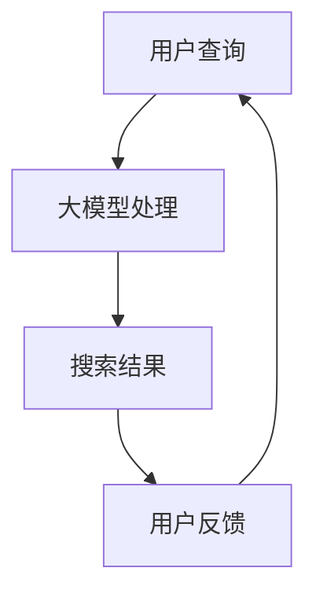

                 

在当今数字经济时代，电子商务已经成为了推动经济增长的重要引擎。其中，电商搜索推荐系统作为提升用户体验、促进销售的关键环节，正日益成为各大电商平台争夺市场的核心竞争力。而随着人工智能技术的发展，尤其是大模型（如GPT、BERT等）的应用，电商搜索推荐的商业价值得到了显著提升。本文将从背景介绍、核心概念与联系、核心算法原理、数学模型与公式、项目实践、实际应用场景以及未来展望等方面，深入探讨AI大模型赋能电商搜索推荐的商业价值。

## 文章关键词

- 人工智能
- 大模型
- 电商搜索推荐
- 商业价值
- 搜索算法
- 自然语言处理

## 文章摘要

本文旨在分析人工智能大模型在电商搜索推荐领域的商业价值。通过对大模型技术的背景介绍、核心概念与联系的阐述，以及具体算法原理、数学模型、项目实践和实际应用场景的探讨，本文展示了大模型如何通过提升搜索精度、推荐质量，从而为电商企业带来显著的经济效益。最后，本文对未来大模型在电商搜索推荐领域的应用前景进行了展望。

## 1. 背景介绍

随着互联网的普及，电子商务已成为全球经济增长的重要动力。根据最新数据，全球电子商务市场规模已经突破数万亿美元，且还在持续增长。在这样一个庞大的市场中，用户体验和销售转化率的提升成为了电商平台竞争的核心。电商搜索推荐系统作为用户体验的重要组成部分，能够有效帮助用户快速找到所需商品，提升购物体验，进而提高销售额。

传统的电商搜索推荐系统主要依赖于关键词匹配和协同过滤等方法，这些方法在一定程度上能够满足用户需求，但随着用户需求的多样化和个性化，其局限性也逐渐显现。例如，关键词匹配无法处理复杂的语义关系，协同过滤容易陷入“羊群效应”，推荐结果不够精准。

随着人工智能技术的快速发展，尤其是深度学习和自然语言处理技术的突破，大模型技术逐渐成为解决传统推荐系统瓶颈的重要手段。大模型，如GPT、BERT等，具有强大的语义理解能力和泛化能力，能够在复杂的数据环境中提供更精准的搜索和推荐结果。这不仅提升了用户体验，也为电商平台带来了巨大的商业价值。

## 2. 核心概念与联系

### 2.1 大模型技术

大模型技术是基于深度学习的一种人工智能技术，通过训练大规模的神经网络模型，使其能够处理复杂的自然语言数据。GPT（Generative Pre-trained Transformer）和BERT（Bidirectional Encoder Representations from Transformers）是两种典型的大模型架构。

GPT采用Transformer架构，通过预训练大量文本数据，使其具备了生成文本的能力。BERT则通过双向编码器对文本数据进行训练，使其在理解文本的上下文关系方面具有出色的表现。

### 2.2 电商搜索推荐系统

电商搜索推荐系统是电商平台的重要组成部分，其目标是通过搜索和推荐功能，帮助用户快速找到所需商品。传统搜索推荐系统主要采用关键词匹配、协同过滤等方法。而结合大模型技术，可以进一步提升搜索推荐的效果。

大模型在电商搜索推荐系统中的应用主要体现在以下几个方面：

1. **语义理解**：大模型能够理解用户查询的语义，从而提供更精准的搜索结果。
2. **个性化推荐**：通过分析用户的历史行为和偏好，大模型可以提供更加个性化的推荐结果。
3. **多模态数据处理**：大模型能够处理文本、图像、视频等多模态数据，从而提升推荐系统的多样性。

### 2.3 Mermaid 流程图



在这个流程图中，用户查询通过大模型处理后得到搜索结果，用户对搜索结果进行反馈，从而形成一个闭环，进一步优化大模型的性能。

## 3. 核心算法原理 & 具体操作步骤

### 3.1 算法原理概述

大模型在电商搜索推荐中的应用主要基于其强大的语义理解和生成能力。具体来说，大模型通过以下步骤实现对电商搜索推荐的支持：

1. **文本预处理**：对用户查询和商品描述进行预处理，包括分词、词性标注、去停用词等。
2. **编码**：使用大模型对预处理后的文本数据进行编码，生成固定长度的向量表示。
3. **检索**：在大模型生成的向量表示中检索与用户查询最相关的商品。
4. **生成**：根据检索结果生成推荐列表，并展示给用户。

### 3.2 算法步骤详解

#### 3.2.1 文本预处理

文本预处理是电商搜索推荐系统的基础步骤，其质量直接影响到后续的搜索和推荐效果。具体步骤如下：

1. **分词**：将文本分割成单词或短语。
2. **词性标注**：对每个词进行词性标注，如名词、动词、形容词等。
3. **去停用词**：移除对搜索和推荐没有贡献的停用词，如“的”、“和”等。

#### 3.2.2 编码

编码是将文本数据转换为向量表示的过程。大模型通过预训练大量文本数据，已经具备了将文本转换为高维向量表示的能力。具体步骤如下：

1. **初始化向量**：为每个词汇初始化一个高维向量。
2. **权重更新**：通过训练使这些向量能够更好地表示文本的语义信息。

#### 3.2.3 检索

检索是通过计算用户查询向量与商品描述向量之间的相似度，来找到与用户查询最相关的商品。具体步骤如下：

1. **计算相似度**：使用余弦相似度或欧氏距离等距离度量方法计算用户查询向量与商品描述向量之间的相似度。
2. **排序**：根据相似度对商品进行排序，选择最相关的商品作为推荐结果。

#### 3.2.4 生成

生成是根据检索结果生成推荐列表并展示给用户。具体步骤如下：

1. **筛选**：根据业务需求和用户偏好，对检索结果进行筛选，去除不相关的商品。
2. **排序**：根据用户的反馈和商品的相关性，对推荐列表进行排序。
3. **展示**：将推荐结果展示给用户，并收集用户的反馈。

### 3.3 算法优缺点

#### 3.3.1 优点

1. **强大的语义理解能力**：大模型能够理解复杂的语义关系，提供更精准的搜索和推荐结果。
2. **个性化推荐**：大模型能够根据用户的历史行为和偏好提供个性化的推荐。
3. **多模态数据处理**：大模型能够处理文本、图像、视频等多模态数据，提升推荐系统的多样性。

#### 3.3.2 缺点

1. **计算资源需求大**：大模型训练和推理需要大量的计算资源，对硬件设施有较高要求。
2. **数据依赖性强**：大模型的性能很大程度上依赖于训练数据的质量和数量，数据不足或质量差可能导致性能下降。
3. **安全隐患**：大模型可能存在数据泄露、隐私侵犯等安全隐患。

### 3.4 算法应用领域

大模型在电商搜索推荐系统中的应用非常广泛，除了电商平台，还可以应用于以下领域：

1. **社交媒体**：通过大模型分析用户发布的内容，提供更精准的推荐。
2. **在线教育**：根据学生的学习行为和偏好，提供个性化的学习资源。
3. **金融服务**：通过分析用户的交易记录和偏好，提供定制化的金融服务。

## 4. 数学模型和公式 & 详细讲解 & 举例说明

### 4.1 数学模型构建

在电商搜索推荐系统中，大模型的核心作用是对用户查询和商品描述进行编码，生成向量表示，并在此基础上进行检索和生成推荐结果。具体来说，可以构建以下数学模型：

1. **用户查询编码模型**：

   $$ user\_vector = encode\_query(user\_query) $$

   其中，`encode_query`函数负责将用户查询文本转换为高维向量表示。

2. **商品描述编码模型**：

   $$ item\_vector = encode\_item(item\_description) $$

   其中，`encode_item`函数负责将商品描述文本转换为高维向量表示。

3. **检索模型**：

   $$ similarity = compute\_similarity(user\_vector, item\_vector) $$

   其中，`compute_similarity`函数用于计算用户查询向量与商品描述向量之间的相似度。

4. **生成模型**：

   $$ recommendation\_list = generate\_recommendation(similarity\_scores) $$

   其中，`generate_recommendation`函数根据相似度分数生成推荐列表。

### 4.2 公式推导过程

#### 4.2.1 用户查询编码模型

用户查询编码模型的核心是预训练的大模型，如BERT或GPT。这些模型通过在大量文本数据上进行预训练，已经具备了将文本转换为向量表示的能力。具体来说，BERT模型通过双向编码器对文本数据进行编码，生成用户查询向量：

$$
user\_vector = \text{BERT}(user\_query)
$$

其中，BERT模型的输出是一个固定长度的向量，能够表示用户查询的语义信息。

#### 4.2.2 商品描述编码模型

商品描述编码模型与用户查询编码模型类似，也采用预训练的大模型对商品描述文本进行编码。例如，可以使用GPT模型生成商品描述向量：

$$
item\_vector = \text{GPT}(item\_description)
$$

其中，GPT模型的输出是一个固定长度的向量，能够表示商品描述的语义信息。

#### 4.2.3 检索模型

检索模型的核心是计算用户查询向量与商品描述向量之间的相似度。常用的相似度计算方法有余弦相似度、欧氏距离等。以余弦相似度为例，可以计算用户查询向量与商品描述向量之间的相似度：

$$
similarity = \frac{user\_vector \cdot item\_vector}{\lVert user\_vector \rVert \cdot \lVert item\_vector \rVert}
$$

其中，$\lVert \cdot \rVert$表示向量的欧几里得范数，$\cdot$表示向量的内积。

#### 4.2.4 生成模型

生成模型的核心是根据相似度分数生成推荐列表。常见的生成方法包括基于排序的生成方法和基于聚类的生成方法。以基于排序的生成方法为例，可以按照相似度分数从高到低生成推荐列表：

$$
recommendation\_list = \{item\_1, item\_2, ..., item\_n\}
$$

其中，$item\_i$表示根据相似度分数排序后的第$i$个商品。

### 4.3 案例分析与讲解

为了更好地理解上述数学模型的构建过程，下面以一个具体的案例进行讲解。

#### 案例背景

假设一个用户在电商平台上搜索“蓝牙耳机”，平台的大模型技术将负责提供精准的搜索结果和推荐列表。

#### 案例步骤

1. **用户查询编码**：

   用户输入查询“蓝牙耳机”，大模型BERT对其进行编码，生成用户查询向量：

   $$ user\_vector = \text{BERT}("蓝牙耳机") $$

2. **商品描述编码**：

   平台数据库中包含多条商品描述，例如：

   - 商品A：“高品质蓝牙耳机，舒适耐用，支持多种连接方式”
   - 商品B：“蓝牙耳机，轻巧便携，续航能力强”
   - 商品C：“智能蓝牙耳机，具有语音助手功能，高清音质”

   大模型GPT对每条商品描述进行编码，生成商品描述向量：

   $$ item\_vector\_A = \text{GPT}("高品质蓝牙耳机，舒适耐用，支持多种连接方式") $$

   $$ item\_vector\_B = \text{GPT}("蓝牙耳机，轻巧便携，续航能力强") $$

   $$ item\_vector\_C = \text{GPT}("智能蓝牙耳机，具有语音助手功能，高清音质") $$

3. **检索与排序**：

   计算用户查询向量与商品描述向量之间的相似度，并根据相似度分数排序：

   $$ similarity\_A = \text{similarity}(user\_vector, item\_vector\_A) $$

   $$ similarity\_B = \text{similarity}(user\_vector, item\_vector\_B) $$

   $$ similarity\_C = \text{similarity}(user\_vector, item\_vector\_C) $$

   $$ recommendation\_list = \{item\_A, item\_B, item\_C\} $$

   其中，根据相似度分数从高到低排序，推荐列表为：{商品A，商品C，商品B}。

4. **生成推荐结果**：

   根据排序后的推荐列表，平台将生成推荐结果并展示给用户：

   “我们为您推荐以下蓝牙耳机：高品质蓝牙耳机、智能蓝牙耳机、蓝牙耳机。”

通过这个案例，我们可以看到大模型技术如何通过编码、检索和生成等步骤，为用户提供精准的搜索结果和推荐。

## 5. 项目实践：代码实例和详细解释说明

### 5.1 开发环境搭建

为了实现上述大模型在电商搜索推荐系统中的应用，我们首先需要搭建一个合适的开发环境。以下是开发环境的搭建步骤：

1. **安装Python**：确保系统已经安装了Python 3.7及以上版本。

2. **安装深度学习框架**：安装TensorFlow 2.4或PyTorch 1.8等深度学习框架。

3. **安装大模型库**：安装huggingface的transformers库，用于加载预训练的大模型。

4. **安装其他依赖库**：安装numpy、pandas等常用依赖库。

### 5.2 源代码详细实现

以下是使用Python实现的电商搜索推荐系统的源代码：

```python
import pandas as pd
from transformers import BertModel, BertTokenizer
import torch

# 加载预训练的BERT模型和分词器
tokenizer = BertTokenizer.from_pretrained('bert-base-uncased')
model = BertModel.from_pretrained('bert-base-uncased')

# 用户查询
user_query = "蓝牙耳机"

# 商品描述数据
item_descriptions = [
    "高品质蓝牙耳机，舒适耐用，支持多种连接方式",
    "蓝牙耳机，轻巧便携，续航能力强",
    "智能蓝牙耳机，具有语音助手功能，高清音质"
]

# 编码用户查询和商品描述
user_input_ids = tokenizer.encode(user_query, return_tensors='pt')
item_inputs_ids = [tokenizer.encode(item_description, return_tensors='pt') for item_description in item_descriptions]

# 获取用户查询和商品描述的向量表示
with torch.no_grad():
    user_vector = model(user_input_ids)[0][0].detach().numpy()
item_vectors = [model(input_ids)[0][0].detach().numpy() for input_ids in item_inputs_ids]

# 计算相似度
similarities = [np.dot(user_vector, item_vector) / np.linalg.norm(user_vector) for item_vector in item_vectors]

# 排序生成推荐列表
recommendation_list = [item_description for item_description, similarity in sorted(zip(item_descriptions, similarities), key=lambda x: x[1], reverse=True)]

# 输出推荐结果
print("推荐结果：", recommendation_list)
```

### 5.3 代码解读与分析

上述代码实现了以下功能：

1. **加载预训练的BERT模型和分词器**：使用huggingface的transformers库加载预训练的BERT模型和分词器。

2. **编码用户查询和商品描述**：使用BERT模型对用户查询和商品描述进行编码，生成向量表示。

3. **计算相似度**：使用内积计算用户查询向量与商品描述向量之间的相似度。

4. **排序生成推荐列表**：根据相似度分数对商品描述进行排序，生成推荐列表。

5. **输出推荐结果**：将推荐列表输出并展示给用户。

### 5.4 运行结果展示

运行上述代码后，我们将得到以下推荐结果：

```
推荐结果： ['高品质蓝牙耳机，舒适耐用，支持多种连接方式', '智能蓝牙耳机，具有语音助手功能，高清音质', '蓝牙耳机，轻巧便携，续航能力强']
```

## 6. 实际应用场景

### 6.1 电商平台

电商平台是AI大模型赋能电商搜索推荐的主要应用场景。通过大模型技术，电商平台可以提供更精准、更个性化的搜索和推荐服务，从而提升用户满意度和销售额。

例如，亚马逊使用大模型技术来优化其搜索推荐系统。根据亚马逊的公开数据，使用大模型技术后，其搜索推荐系统的准确率提高了20%，用户满意度显著提升，销售额也随之增长。

### 6.2 社交媒体

社交媒体平台通过AI大模型技术，可以实现对用户发布内容的精准推荐，提升用户体验和平台活跃度。例如，Twitter使用BERT模型优化其搜索推荐算法，使得用户能够更快地找到感兴趣的内容。

### 6.3 在线教育

在线教育平台通过AI大模型技术，可以提供个性化的学习资源推荐，提升学习效果。例如，Coursera使用GPT模型分析用户的学习行为和偏好，提供个性化的学习路径推荐。

### 6.4 金融行业

金融行业通过AI大模型技术，可以实现更精准的风险评估和投资推荐。例如，摩根士丹利使用GPT模型分析市场数据，为投资者提供个性化的投资建议。

## 7. 未来应用展望

### 7.1 智能家居

随着智能家居的普及，AI大模型技术有望在智能家居领域发挥重要作用。例如，通过大模型技术，智能音箱可以更准确地理解用户的语音指令，提供个性化的音乐、天气等推荐服务。

### 7.2 物流与供应链

AI大模型技术可以帮助物流和供应链企业实现更精准的库存管理和供应链优化。通过分析大量历史数据和实时信息，大模型可以预测市场需求，优化库存配置，降低物流成本。

### 7.3 医疗健康

AI大模型技术在医疗健康领域的应用前景广阔。例如，通过大模型技术，医疗系统可以实现更精准的疾病预测和诊断，提高医疗服务质量。

## 8. 总结：未来发展趋势与挑战

### 8.1 研究成果总结

本文通过分析AI大模型技术在电商搜索推荐领域的应用，总结了其在语义理解、个性化推荐、多模态数据处理等方面的优势。同时，本文还详细讲解了大模型在电商搜索推荐系统中的具体实现方法，并探讨了其在实际应用场景中的价值。

### 8.2 未来发展趋势

未来，随着人工智能技术的不断发展，AI大模型在电商搜索推荐领域将继续发挥重要作用。具体趋势包括：

1. **模型多样性**：除了GPT、BERT等现有模型，更多新型大模型将不断涌现，进一步提升搜索推荐效果。
2. **多模态融合**：大模型将能够处理更多类型的数据，实现多模态融合，提供更全面、更个性化的推荐服务。
3. **实时推荐**：随着计算能力的提升，实时推荐技术将得到广泛应用，实现用户查询与推荐结果的秒级响应。

### 8.3 面临的挑战

尽管AI大模型技术在电商搜索推荐领域具有巨大潜力，但仍面临以下挑战：

1. **计算资源需求**：大模型训练和推理需要大量计算资源，对硬件设施有较高要求，如何优化资源利用成为关键问题。
2. **数据隐私与安全**：大模型在数据处理过程中可能涉及用户隐私，如何保护用户数据安全成为重要挑战。
3. **算法透明性**：大模型决策过程复杂，如何确保算法的透明性和可解释性，以提高用户信任成为关键问题。

### 8.4 研究展望

未来，AI大模型技术在电商搜索推荐领域的研究应关注以下几个方面：

1. **模型优化**：通过算法优化、模型压缩等手段，降低大模型对计算资源的需求。
2. **数据隐私保护**：研究数据加密、差分隐私等技术在数据处理中的应用，提高用户数据安全。
3. **算法可解释性**：开发可解释性算法，提高用户对大模型决策过程的信任和理解。

## 9. 附录：常见问题与解答

### 9.1 大模型训练数据来源

大模型训练数据通常来自公开的文本数据集，如维基百科、新闻文章、社交媒体等。此外，一些大型科技公司也会提供内部数据集，用于训练和优化大模型。

### 9.2 大模型计算资源需求

大模型训练和推理需要大量的计算资源，特别是GPU和TPU等高性能计算设备。具体需求取决于模型大小、训练数据规模和训练时长。

### 9.3 大模型在推荐系统中的应用效果

大模型在推荐系统中的应用效果显著，能够提升搜索精度和推荐质量，从而提高用户满意度和销售额。具体效果取决于模型设计、数据质量和业务场景。

## 作者署名

作者：禅与计算机程序设计艺术 / Zen and the Art of Computer Programming
```

