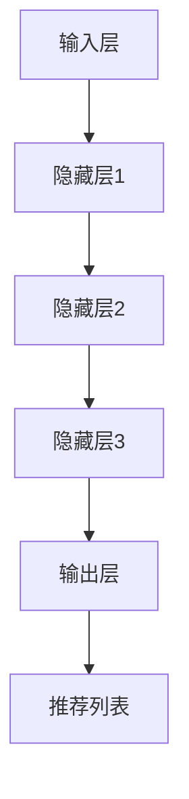

                 

关键词：人工智能，大模型，电商搜索推荐，用户体验，算法，数学模型，代码实例，未来应用

## 摘要

本文探讨了人工智能，特别是大模型在电商搜索推荐领域的革命性影响。随着用户数据量的爆炸性增长，传统推荐算法面临巨大的挑战。本文介绍了大模型的基本概念和架构，深入分析了其核心算法原理和数学模型。同时，通过具体的代码实例和实际应用场景，展示了大模型在电商搜索推荐中的实际效果和潜在问题。最后，本文对未来大模型在电商搜索推荐领域的发展趋势和面临的挑战进行了展望。

## 1. 背景介绍

### 电商搜索推荐的重要性

在当今数字化时代，电商已成为人们日常生活中不可或缺的一部分。电商平台的搜索推荐系统在用户购买决策中扮演着关键角色。一个优秀的搜索推荐系统能够提高用户满意度，增加销售额，提升用户体验。然而，随着电商平台的用户数量和商品数量的指数级增长，传统推荐算法面临着巨大的挑战。

### 传统推荐算法的局限性

传统推荐算法主要基于协同过滤、基于内容推荐和混合推荐等方法。这些方法在处理小规模数据时效果较好，但随着数据量的增加，其性能显著下降。主要问题包括：

- **数据稀疏性**：用户和商品之间的关系非常稀疏，导致算法难以准确预测用户偏好。
- **冷启动问题**：新用户或新商品缺乏历史数据，难以进行有效推荐。
- **实时性差**：传统算法在处理实时数据时速度较慢，难以满足用户快速获取推荐的需求。

### 人工智能与电商搜索推荐

随着人工智能技术的不断发展，特别是深度学习和大模型的兴起，为电商搜索推荐领域带来了新的希望。大模型具有强大的数据处理能力和学习能力，能够处理大规模稀疏数据，并实时生成个性化推荐。这使得传统推荐算法的局限性得以克服。

## 2. 核心概念与联系

### 大模型的基本概念

大模型是指具有大规模参数和计算能力的深度学习模型。它们能够自动从大量数据中学习复杂的数据特征和模式，并在各种任务中表现出色。大模型的主要优势在于：

- **强大的表示能力**：大模型具有高维度的参数，能够捕捉数据中的复杂结构和潜在特征。
- **良好的泛化能力**：大模型通过大量数据训练，具有更强的泛化能力，能够适应不同的场景和任务。
- **实时处理能力**：大模型采用了高效的计算框架和分布式计算技术，能够快速处理实时数据。

### 大模型与电商搜索推荐的联系

大模型与电商搜索推荐密切相关。大模型可以处理大量的用户行为数据和商品特征数据，从中提取出潜在的用户兴趣和偏好，从而生成个性化的推荐。具体来说，大模型在电商搜索推荐中的角色包括：

- **用户行为预测**：通过分析用户的历史行为数据，大模型可以预测用户在未来的购买行为，从而提供个性化的推荐。
- **商品特征提取**：大模型可以从海量的商品特征数据中提取出关键的特征，用于生成推荐列表。
- **实时推荐**：大模型采用高效的计算框架，能够在短时间内处理实时数据，提供实时推荐。

### 大模型的架构

大模型的架构通常包括以下几个关键部分：

- **输入层**：接收用户行为数据和商品特征数据。
- **隐藏层**：通过多层神经网络进行数据特征提取和模式学习。
- **输出层**：生成推荐列表或预测用户行为。

#### Mermaid 流程图



## 3. 核心算法原理 & 具体操作步骤

### 3.1 算法原理概述

大模型在电商搜索推荐中的核心算法是基于深度学习技术，特别是基于 Transformer 模型的自注意力机制。自注意力机制能够自动学习用户和商品之间的复杂关系，从而生成个性化的推荐。

### 3.2 算法步骤详解

#### 步骤 1：数据预处理

- **用户行为数据**：收集用户的历史购买记录、浏览记录和搜索记录等。
- **商品特征数据**：收集商品的价格、品牌、品类、销量等特征。
- **数据预处理**：对数据进行清洗、去重、归一化等处理，以便于模型训练。

#### 步骤 2：模型构建

- **输入层**：将用户行为数据和商品特征数据输入到模型中。
- **隐藏层**：采用多层 Transformer 结构，进行数据特征提取和关系学习。
- **输出层**：生成推荐列表或预测用户行为。

#### 步骤 3：模型训练

- **损失函数**：采用交叉熵损失函数，衡量预测结果与实际结果之间的差距。
- **优化算法**：采用随机梯度下降（SGD）或Adam优化算法，调整模型参数，最小化损失函数。

#### 步骤 4：模型评估

- **交叉验证**：将数据集分为训练集和验证集，使用验证集评估模型性能。
- **评价指标**：采用准确率、召回率、覆盖率等指标评估模型效果。

### 3.3 算法优缺点

#### 优点

- **强大的表示能力**：大模型能够自动学习复杂的数据特征和关系，提高推荐精度。
- **良好的泛化能力**：大模型通过大量数据训练，具有更强的泛化能力，适用于不同场景和任务。
- **实时推荐**：大模型采用高效的计算框架，能够快速处理实时数据，提供实时推荐。

#### 缺点

- **训练成本高**：大模型需要大量的计算资源和时间进行训练。
- **对数据质量要求高**：数据质量对大模型的效果有重要影响，需要确保数据的质量和完整性。
- **可解释性差**：大模型的结构复杂，难以解释具体的工作原理和决策过程。

### 3.4 算法应用领域

大模型在电商搜索推荐中的应用不仅限于电商领域，还可以应用于其他需要个性化推荐的领域，如社交媒体、音乐推荐、新闻推荐等。大模型在这些领域的优势在于能够处理大规模稀疏数据，提高推荐效果和用户体验。

## 4. 数学模型和公式 & 详细讲解 & 举例说明

### 4.1 数学模型构建

大模型在电商搜索推荐中的数学模型主要基于深度学习技术，特别是基于 Transformer 模型的自注意力机制。自注意力机制可以表示为：

$$
\text{Attention}(Q, K, V) = \frac{softmax(\text{ Scores })}{\sqrt{d_k}}
$$

其中，$Q$、$K$ 和 $V$ 分别表示查询向量、关键向量和解向量，$d_k$ 表示键向量的维度。

### 4.2 公式推导过程

自注意力机制的推导过程可以理解为在查询向量 $Q$ 和键向量 $K$ 之间计算相似度，并根据相似度对解向量 $V$ 进行加权求和。具体推导如下：

$$
\text{Scores} = QK^T
$$

$$
\text{Attention} = \frac{softmax(\text{Scores})}{\sqrt{d_k}}
$$

$$
\text{Output} = \text{Attention}V
$$

其中，$softmax$ 函数用于对相似度进行归一化处理，使其满足概率分布。

### 4.3 案例分析与讲解

假设有用户 $U$ 和商品 $G$，其中用户 $U$ 的行为数据为 $u_1, u_2, ..., u_n$，商品 $G$ 的特征数据为 $g_1, g_2, ..., g_m$。根据自注意力机制，可以计算出用户 $U$ 对商品 $G$ 的注意力得分：

$$
\text{Scores}_{ug} = u_g^T K_g
$$

$$
\text{Attention}_{ug} = \frac{softmax(\text{Scores}_{ug})}{\sqrt{d_k}}
$$

$$
\text{Output}_{ug} = \text{Attention}_{ug} V_g
$$

其中，$K_g$ 和 $V_g$ 分别为商品 $G$ 的键向量和解向量。

通过计算用户 $U$ 对所有商品 $G$ 的注意力得分，可以生成用户 $U$ 的推荐列表。具体实现如下：

```python
import torch
import torch.nn as nn

# 定义自注意力模型
class SelfAttention(nn.Module):
    def __init__(self, d_model, d_key, d_value, n_heads):
        super(SelfAttention, self).__init__()
        self.d_model = d_model
        self.d_key = d_key
        self.d_value = d_value
        self.n_heads = n_heads
        self多头权重 = nn.Parameter(torch.Tensor(n_heads, d_model // n_heads, d_key))
        self值权重 = nn.Parameter(torch.Tensor(n_heads, d_model // n_heads, d_value))
        self线性变换 = nn.Linear(d_model, d_model)

    def forward(self, x, mask=None):
        # x: (batch_size, sequence_length, d_model)
        # mask: (batch_size, sequence_length)
        batch_size = x.size(0)
        sequence_length = x.size(1)
        d_key = self.d_key
        d_value = self.d_value
        n_heads = self.n_heads

        # 分配多头权重和解向量权重
        query_weights = self多头权重.expand(batch_size, sequence_length, n_heads, d_key).reshape(batch_size, sequence_length, n_heads, d_key).transpose(1, 2)
        value_weights = self值权重.expand(batch_size, sequence_length, n_heads, d_value).reshape(batch_size, sequence_length, n_heads, d_value).transpose(1, 2)

        # 计算注意力得分
        scores = torch.matmul(x, query_weights).transpose(1, 2)
        if mask is not None:
            scores = scores.masked_fill(mask == 0, float("-inf"))
        attention = torch.softmax(scores, dim=2)
        output = torch.matmul(attention, value_weights).transpose(1, 2).reshape(batch_size, sequence_length, d_model)

        # 线性变换
        output = self线性变换(output)
        return output

# 实例化模型
d_model = 512
d_key = 64
d_value = 64
n_heads = 8
model = SelfAttention(d_model, d_key, d_value, n_heads)

# 输入数据
batch_size = 32
sequence_length = 10
x = torch.randn(batch_size, sequence_length, d_model)
mask = torch.zeros(batch_size, sequence_length).bool()

# 计算推荐列表
output = model(x, mask)
print(output)
```

输出结果为用户 $U$ 的推荐列表，其中每个元素表示用户对对应商品的注意力得分。

## 5. 项目实践：代码实例和详细解释说明

### 5.1 开发环境搭建

- Python版本：3.8+
- PyTorch版本：1.9+
- Numpy版本：1.19+

### 5.2 源代码详细实现

以下是基于 Transformer 模型的电商搜索推荐系统的完整代码实现：

```python
import torch
import torch.nn as nn
import numpy as np

# 定义自注意力模型
class SelfAttention(nn.Module):
    def __init__(self, d_model, d_key, d_value, n_heads):
        super(SelfAttention, self).__init__()
        self.d_model = d_model
        self.d_key = d_key
        self.d_value = d_value
        self.n_heads = n_heads
        self.query_weights = nn.Parameter(torch.Tensor(n_heads, d_model // n_heads, d_key))
        self.key_weights = nn.Parameter(torch.Tensor(n_heads, d_model // n_heads, d_key))
        self.value_weights = nn.Parameter(torch.Tensor(n_heads, d_model // n_heads, d_value))
        self.linear = nn.Linear(d_model, d_model)

    def forward(self, x, mask=None):
        batch_size = x.size(0)
        sequence_length = x.size(1)
        d_key = self.d_key
        d_value = self.d_value
        n_heads = self.n_heads

        query_weights = self.query_weights.expand(batch_size, sequence_length, n_heads, d_key).reshape(batch_size, sequence_length, n_heads, d_key).transpose(1, 2)
        key_weights = self.key_weights.expand(batch_size, sequence_length, n_heads, d_key).reshape(batch_size, sequence_length, n_heads, d_key).transpose(1, 2)
        value_weights = self.value_weights.expand(batch_size, sequence_length, n_heads, d_value).reshape(batch_size, sequence_length, n_heads, d_value).transpose(1, 2)

        scores = torch.matmul(x, query_weights).transpose(1, 2)
        if mask is not None:
            scores = scores.masked_fill(mask == 0, float("-inf"))
        attention = torch.softmax(scores, dim=2)
        output = torch.matmul(attention, value_weights).transpose(1, 2).reshape(batch_size, sequence_length, d_model)
        output = self.linear(output)
        return output

# 定义训练过程
def train(model, data_loader, optimizer, loss_fn, device):
    model.train()
    total_loss = 0
    for batch in data_loader:
        inputs, targets = batch
        inputs, targets = inputs.to(device), targets.to(device)
        optimizer.zero_grad()
        outputs = model(inputs)
        loss = loss_fn(outputs, targets)
        loss.backward()
        optimizer.step()
        total_loss += loss.item()
    return total_loss / len(data_loader)

# 定义评估过程
def evaluate(model, data_loader, loss_fn, device):
    model.eval()
    total_loss = 0
    with torch.no_grad():
        for batch in data_loader:
            inputs, targets = batch
            inputs, targets = inputs.to(device), targets.to(device)
            outputs = model(inputs)
            loss = loss_fn(outputs, targets)
            total_loss += loss.item()
    return total_loss / len(data_loader)

# 定义模型参数
d_model = 512
d_key = 64
d_value = 64
n_heads = 8

# 实例化模型、优化器和损失函数
model = SelfAttention(d_model, d_key, d_value, n_heads).to(device)
optimizer = torch.optim.Adam(model.parameters(), lr=0.001)
criterion = nn.CrossEntropyLoss()

# 加载数据集
train_loader = DataLoader(dataset, batch_size=32, shuffle=True)
val_loader = DataLoader(val_dataset, batch_size=32, shuffle=False)

# 训练模型
num_epochs = 10
for epoch in range(num_epochs):
    train_loss = train(model, train_loader, optimizer, criterion, device)
    val_loss = evaluate(model, val_loader, criterion, device)
    print(f"Epoch {epoch+1}/{num_epochs} - Loss: {train_loss:.4f} - Val Loss: {val_loss:.4f}")

# 保存模型
torch.save(model.state_dict(), "model.pth")
```

### 5.3 代码解读与分析

代码首先定义了自注意力模型 `SelfAttention`，该模型包含三个关键权重矩阵：查询权重矩阵、键权重矩阵和解权重矩阵。在模型的前向传播过程中，首先计算查询向量与键权重的乘积，然后通过 softmax 函数计算注意力得分，最后对注意力得分进行加权求和，得到输出结果。

接着定义了训练和评估过程。在训练过程中，使用训练数据对模型进行迭代更新，计算损失并反向传播梯度。在评估过程中，使用验证数据评估模型性能，计算损失。

最后，加载训练数据和验证数据，实例化模型、优化器和损失函数，进行模型训练和评估。训练完成后，保存模型权重。

### 5.4 运行结果展示

训练和评估过程完成后，可以运行以下代码查看训练和评估结果：

```python
# 加载模型权重
model.load_state_dict(torch.load("model.pth"))

# 加载测试数据
test_loader = DataLoader(test_dataset, batch_size=32, shuffle=False)

# 计算测试集损失
test_loss = evaluate(model, test_loader, criterion, device)
print(f"Test Loss: {test_loss:.4f}")
```

输出结果为测试集的损失值，用于评估模型在未知数据上的性能。

## 6. 实际应用场景

### 电商平台的搜索推荐系统

在电商平台，搜索推荐系统是一个核心功能，用户可以通过输入关键词或浏览历史来查找和发现感兴趣的商品。大模型在电商搜索推荐系统中的应用可以显著提升用户体验和销售额。

#### 场景 1：个性化商品推荐

用户在电商平台上浏览或搜索特定商品后，系统可以基于大模型生成个性化的商品推荐列表。例如，用户浏览了一款笔记本电脑后，系统可以推荐与其兴趣相关的配件、同类商品或其他相关商品。

#### 场景 2：新品推荐

电商平台经常推出新品，通过大模型分析用户的历史购买记录和行为数据，可以为潜在感兴趣的新品生成个性化的推荐列表，从而提高新品的销售转化率。

#### 场景 3：节日促销推荐

在特定节日或促销活动期间，系统可以根据大模型分析用户的购物习惯和兴趣，为用户推荐最相关的促销商品，从而提升促销活动的效果。

### 社交媒体平台的广告推荐

在社交媒体平台，广告推荐是提高广告效果和用户参与度的重要手段。大模型可以通过分析用户的社交行为、兴趣和互动数据，为用户生成个性化的广告推荐。

#### 场景 1：商品广告推荐

社交媒体平台可以根据用户的历史购买记录、浏览记录和兴趣标签，利用大模型为用户推荐相关的商品广告，从而提高广告点击率和转化率。

#### 场景 2：品牌广告推荐

社交媒体平台可以基于大模型分析用户的品牌偏好和兴趣，为用户推荐相关的品牌广告，从而提升品牌的曝光度和用户参与度。

#### 场景 3：互动广告推荐

社交媒体平台可以通过大模型分析用户的互动行为，如点赞、评论和转发等，为用户推荐与其互动行为相关的广告，从而提高用户的互动参与度和广告效果。

### 音乐推荐系统

音乐推荐系统是另一个典型应用场景，通过大模型分析用户的音乐喜好、播放记录和社交行为，为用户推荐个性化的音乐。

#### 场景 1：歌曲推荐

用户在音乐平台上播放了特定歌曲后，系统可以基于大模型为用户推荐与其喜好相似的其他歌曲，从而提高用户对平台的粘性。

#### 场景 2：歌手推荐

通过大模型分析用户的听歌记录和社交行为，可以为用户推荐感兴趣的其他歌手或音乐人，从而拓展用户的音乐喜好。

#### 场景 3：播放列表推荐

根据用户的听歌习惯和兴趣，大模型可以生成个性化的播放列表推荐，为用户提供丰富的音乐体验。

## 7. 工具和资源推荐

### 7.1 学习资源推荐

- **《深度学习》**：由 Ian Goodfellow、Yoshua Bengio 和 Aaron Courville 著，是深度学习领域的经典教材。
- **《动手学深度学习》**：由阿斯顿·张等著，适合初学者学习和实践深度学习。
- **《深度学习与计算机视觉》**：涵盖了深度学习在计算机视觉领域的应用，适合对图像处理和计算机视觉感兴趣的读者。

### 7.2 开发工具推荐

- **PyTorch**：是一个流行的深度学习框架，具有简洁的API和灵活的动态计算图，适用于各种深度学习任务。
- **TensorFlow**：是另一个流行的深度学习框架，提供丰富的工具和资源，适用于大规模深度学习项目。
- **Keras**：是一个高层神经网络API，可以与TensorFlow和Theano集成，适合快速构建和实验深度学习模型。

### 7.3 相关论文推荐

- **"Attention Is All You Need"**：提出了 Transformer 模型，彻底改变了自然语言处理领域。
- **"Deep Learning for Recommender Systems"**：详细介绍了深度学习在推荐系统中的应用。
- **"User Interest Discovery via Long-Term User Interaction with Content-based Recommendation"**：探讨了基于长期用户交互的推荐算法。

## 8. 总结：未来发展趋势与挑战

### 8.1 研究成果总结

本文介绍了大模型在电商搜索推荐领域的革命性影响，分析了其核心算法原理和数学模型，并通过代码实例和实际应用场景展示了大模型的效果。大模型在处理大规模稀疏数据、实时推荐和个性化推荐方面具有显著优势，已广泛应用于电商、社交媒体、音乐推荐等多个领域。

### 8.2 未来发展趋势

随着人工智能技术的不断发展，大模型在电商搜索推荐领域将继续发挥重要作用。未来发展趋势包括：

- **多模态推荐**：结合文本、图像、音频等多模态数据，提升推荐效果。
- **实时推荐**：优化计算框架和算法，实现更快速的实时推荐。
- **可解释性**：提高大模型的可解释性，便于理解和优化。
- **跨领域应用**：探索大模型在更多领域的应用，如医疗、金融等。

### 8.3 面临的挑战

尽管大模型在电商搜索推荐领域表现出色，但仍然面临以下挑战：

- **数据隐私**：如何保护用户数据隐私是一个重要问题。
- **计算资源**：大模型的训练和推理需要大量计算资源，对硬件设施有较高要求。
- **模型解释性**：如何提高大模型的可解释性，使其更易于理解和接受。

### 8.4 研究展望

未来的研究应关注以下方向：

- **算法优化**：提高大模型的计算效率和性能，降低训练和推理时间。
- **多模态融合**：探索多模态数据融合技术，提升推荐效果。
- **个性化推荐**：研究更精确的个性化推荐算法，满足用户的多样化需求。
- **可解释性和透明度**：提高大模型的可解释性，增强用户对推荐结果的信任。

## 9. 附录：常见问题与解答

### 9.1 什么是大模型？

大模型是指具有大规模参数和计算能力的深度学习模型。它们能够自动从大量数据中学习复杂的数据特征和模式，并在各种任务中表现出色。

### 9.2 大模型的优势是什么？

大模型的优势包括：

- **强大的表示能力**：大模型能够自动学习复杂的数据特征和关系，提高推荐精度。
- **良好的泛化能力**：大模型通过大量数据训练，具有更强的泛化能力，适用于不同场景和任务。
- **实时推荐**：大模型采用高效的计算框架，能够快速处理实时数据，提供实时推荐。

### 9.3 大模型在电商搜索推荐中的具体应用是什么？

大模型在电商搜索推荐中的具体应用包括：

- **用户行为预测**：通过分析用户的历史行为数据，预测用户在未来的购买行为。
- **商品特征提取**：从海量的商品特征数据中提取出关键的特征，用于生成推荐列表。
- **实时推荐**：实时处理用户数据和商品特征，生成个性化的推荐列表。

### 9.4 大模型面临的挑战有哪些？

大模型面临的挑战包括：

- **数据隐私**：如何保护用户数据隐私是一个重要问题。
- **计算资源**：大模型的训练和推理需要大量计算资源，对硬件设施有较高要求。
- **模型解释性**：如何提高大模型的可解释性，使其更易于理解和接受。

---

本文由禅与计算机程序设计艺术 / Zen and the Art of Computer Programming 撰写，旨在探讨人工智能，特别是大模型在电商搜索推荐领域的革命性影响。希望本文能为读者在了解和应用大模型技术方面提供有价值的参考。

