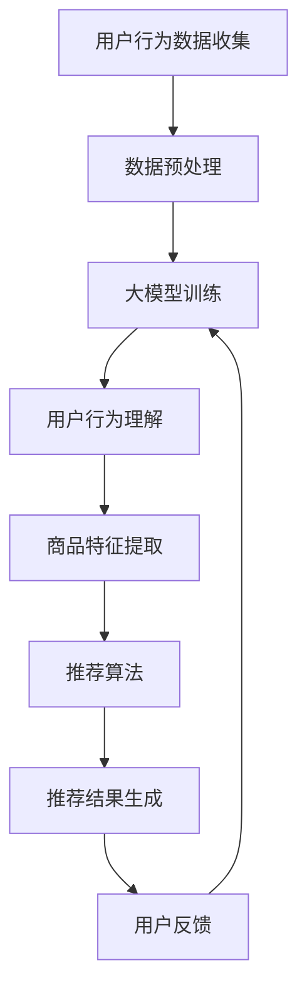

                 

  
## 1. 背景介绍

随着互联网的快速发展，电商行业成为数字经济的重要组成部分。消费者在电商平台上进行购物时，搜索和推荐系统起着至关重要的作用。搜索推荐系统能够根据用户的行为和偏好，为用户提供个性化、精准的购物建议，从而提高用户体验和转化率。

然而，传统的搜索推荐系统存在一些局限性。首先，它们通常依赖于基于关键词匹配的检索算法，这种方式往往无法充分理解用户的真实需求，导致搜索结果不够精准。其次，传统推荐系统在处理大规模数据时，计算效率和扩展性较低，难以满足快速增长的用户量和数据量。

为了解决这些问题，人工智能（AI）技术，尤其是大模型（Large-scale Models），被引入到电商搜索推荐领域。大模型具有强大的表征能力，可以处理复杂的用户行为数据，从而实现更精准的推荐。此外，大模型还可以通过持续学习和自适应调整，不断提升推荐效果。

本文将探讨如何利用AI大模型重构电商搜索推荐的业务流程，以实现优化和提升。文章结构如下：

1. 背景介绍
2. 核心概念与联系
3. 核心算法原理 & 具体操作步骤
4. 数学模型和公式 & 详细讲解 & 举例说明
5. 项目实践：代码实例和详细解释说明
6. 实际应用场景
7. 工具和资源推荐
8. 总结：未来发展趋势与挑战
9. 附录：常见问题与解答

## 2. 核心概念与联系

### 2.1. 电商搜索推荐系统

电商搜索推荐系统由多个组件组成，包括用户行为收集、数据预处理、搜索算法、推荐算法等。用户行为收集模块负责收集用户在电商平台上的各种行为数据，如搜索记录、浏览历史、购买记录、评价等。数据预处理模块对原始数据进行清洗、归一化、特征提取等处理，以生成适用于搜索和推荐算法的数据集。

搜索算法通常基于关键词匹配和文本相似度计算，旨在为用户提供与查询词最相关的商品。推荐算法则基于用户行为数据和商品特征，通过协同过滤、基于内容的推荐等方法，为用户提供个性化的商品推荐。

### 2.2. 大模型

大模型是指具有大规模参数和强大表征能力的人工神经网络模型。它们通常通过深度学习技术进行训练，能够处理复杂的输入数据，并从中提取有用的特征和模式。大模型在自然语言处理、计算机视觉、语音识别等领域取得了显著的成果。

在电商搜索推荐领域，大模型可以用于以下几个方面：

- **用户行为理解**：大模型能够处理用户的复杂行为数据，如购买历史、浏览记录、搜索查询等，从而更准确地理解用户的需求。
- **商品特征提取**：大模型可以从商品描述、标签、评价等数据中提取出有效的特征，用于推荐算法。
- **推荐效果提升**：大模型可以自适应地调整推荐策略，提高推荐效果和用户满意度。

### 2.3. Mermaid 流程图

以下是电商搜索推荐系统中大模型的应用流程的 Mermaid 流程图：



在这个流程中，用户行为数据通过数据预处理模块进行处理，然后输入到大模型中进行训练。大模型通过用户行为理解模块提取用户需求，并通过商品特征提取模块提取商品特征。这些特征用于推荐算法，生成个性化的推荐结果，并最终反馈给用户。

## 3. 核心算法原理 & 具体操作步骤

### 3.1. 算法原理概述

在电商搜索推荐系统中，大模型的核心作用在于提升推荐算法的精度和效率。具体来说，大模型主要通过以下三个方面实现：

- **用户行为理解**：大模型能够处理用户的复杂行为数据，如购买历史、浏览记录、搜索查询等，从而更准确地理解用户的需求。
- **商品特征提取**：大模型可以从商品描述、标签、评价等数据中提取出有效的特征，用于推荐算法。
- **推荐效果优化**：大模型可以自适应地调整推荐策略，提高推荐效果和用户满意度。

### 3.2. 算法步骤详解

以下是利用大模型重构电商搜索推荐业务流程的具体操作步骤：

#### 步骤1：数据收集

首先，需要收集用户在电商平台上产生的各种行为数据，如搜索记录、浏览历史、购买记录、评价等。这些数据可以通过API接口、日志文件等方式获取。

#### 步骤2：数据预处理

对收集到的原始数据进行清洗、归一化、特征提取等处理，以生成适用于大模型训练的数据集。数据预处理的具体步骤包括：

- 数据清洗：去除重复、无效的数据，填补缺失值。
- 数据归一化：对数值型数据进行归一化处理，使其在相似的尺度范围内。
- 特征提取：从原始数据中提取出有效的特征，如用户ID、商品ID、时间戳、行为类型、行为值等。

#### 步骤3：大模型训练

利用预处理后的数据集，使用深度学习框架（如TensorFlow、PyTorch等）训练大模型。训练过程中，需要设置合适的超参数，如学习率、批量大小、迭代次数等。

训练过程可以分为以下几个阶段：

- **预训练阶段**：使用公开的大规模数据集（如CIFAR-10、IMDb等）进行预训练，以提取通用的特征表示。
- **微调阶段**：在预训练的基础上，使用电商领域的特定数据集进行微调，以适应电商搜索推荐任务。

#### 步骤4：用户行为理解

将训练好的大模型应用于用户行为数据，通过用户行为理解模块提取用户需求。具体来说，可以通过以下步骤实现：

- **行为分类**：将用户的行为数据分类为不同的类型（如搜索、浏览、购买等）。
- **行为编码**：对每种类型的行为进行编码，生成高维的特征向量。
- **行为嵌入**：将行为编码转化为低维的向量表示，以便大模型进行后续处理。

#### 步骤5：商品特征提取

利用大模型从商品描述、标签、评价等数据中提取出有效的特征。具体步骤包括：

- **文本处理**：对商品描述、标签、评价等文本数据进行预处理，如分词、词性标注、停用词过滤等。
- **特征提取**：使用文本嵌入技术（如Word2Vec、BERT等）将文本数据转化为向量表示。
- **特征融合**：将不同来源的特征进行融合，形成统一的商品特征向量。

#### 步骤6：推荐算法

利用提取的用户需求和商品特征，通过推荐算法生成个性化的推荐结果。具体来说，可以使用以下几种推荐算法：

- **协同过滤**：基于用户行为相似度和商品相似度进行推荐。
- **基于内容的推荐**：基于用户历史行为和商品特征进行推荐。
- **混合推荐**：结合协同过滤和基于内容的推荐方法，生成更精准的推荐结果。

#### 步骤7：推荐结果生成

根据用户需求、商品特征和推荐算法，生成个性化的推荐结果，并将其展示给用户。推荐结果可以以列表、卡片、瀑布流等形式呈现。

#### 步骤8：用户反馈

收集用户的反馈数据，如点击、购买、评价等，用于评估推荐效果和持续优化推荐系统。

#### 步骤9：大模型更新

根据用户反馈数据，对大模型进行更新和优化，以提高推荐效果。

### 3.3. 算法优缺点

#### 优点：

- **高精度**：大模型能够处理复杂的用户行为数据和商品特征，从而生成更精准的推荐结果。
- **自适应**：大模型可以自适应地调整推荐策略，适应不断变化的用户需求和偏好。
- **高扩展性**：大模型具有强大的计算能力和灵活的架构，可以应对大规模数据和实时推荐的需求。

#### 缺点：

- **训练成本高**：大模型的训练需要大量的计算资源和时间，成本较高。
- **数据依赖性强**：大模型的效果很大程度上取决于数据质量和数量，对数据预处理和特征提取要求较高。
- **隐私保护**：用户行为数据和商品特征包含敏感信息，需要采取措施保护用户隐私。

### 3.4. 算法应用领域

大模型在电商搜索推荐领域的应用已经取得了显著成果。除了电商搜索推荐，大模型还可以应用于以下领域：

- **内容推荐**：在新闻、视频、音乐等领域，大模型可以用于生成个性化推荐列表。
- **社交媒体**：在社交媒体平台上，大模型可以用于用户关注、点赞、评论等行为的预测和推荐。
- **搜索引擎**：在搜索引擎领域，大模型可以用于优化搜索结果排序，提高用户满意度。
- **广告投放**：在广告投放领域，大模型可以用于优化广告推荐策略，提高广告效果。

## 4. 数学模型和公式 & 详细讲解 & 举例说明

### 4.1. 数学模型构建

在电商搜索推荐系统中，大模型的核心作用在于从用户行为数据和商品特征中提取出有效的特征表示。这一过程可以基于以下数学模型：

#### 4.1.1. 用户行为表示

用户行为数据可以表示为如下形式：

$$
X = \{x_1, x_2, ..., x_n\}
$$

其中，$x_i$表示用户在电商平台上产生的第$i$个行为数据。每个行为数据可以进一步表示为：

$$
x_i = \{x_{i1}, x_{i2}, ..., x_{im}\}
$$

其中，$x_{ij}$表示用户在行为类型$j$上的行为值。例如，在购买行为中，$x_{ij}$可以表示为购买金额、购买数量等。

#### 4.1.2. 商品特征表示

商品特征数据可以表示为如下形式：

$$
Y = \{y_1, y_2, ..., y_m\}
$$

其中，$y_i$表示第$i$个商品的各个特征值。例如，在商品描述中，$y_i$可以表示为商品名称、品牌、价格等。

#### 4.1.3. 用户行为与商品特征的关系

用户行为与商品特征之间的关系可以通过以下数学模型进行建模：

$$
R = \{r_{ij}\}
$$

其中，$r_{ij}$表示用户在行为类型$i$上对商品$j$的偏好程度。$r_{ij}$可以基于用户行为和商品特征进行计算，例如：

$$
r_{ij} = f(x_i, y_j)
$$

其中，$f$表示用户行为与商品特征之间的关联函数。例如，可以使用神经网络、深度学习等技术进行建模。

### 4.2. 公式推导过程

以下是用户行为与商品特征之间关联函数的推导过程：

#### 4.2.1. 用户行为嵌入

首先，对用户行为数据进行嵌入，得到用户行为向量：

$$
e_x = \{e_{x1}, e_{x2}, ..., e_{xn}\}
$$

其中，$e_{xi}$表示用户在行为类型$i$上的嵌入向量。用户行为嵌入可以使用预训练的嵌入模型（如Word2Vec、BERT等）进行。

#### 4.2.2. 商品特征嵌入

其次，对商品特征数据进行嵌入，得到商品特征向量：

$$
e_y = \{e_{y1}, e_{y2}, ..., e_{ym}\}
$$

其中，$e_{yi}$表示商品$j$的特征向量。商品特征嵌入可以使用预训练的嵌入模型（如Word2Vec、BERT等）进行。

#### 4.2.3. 用户行为与商品特征的关联函数

最后，定义用户行为与商品特征之间的关联函数$f$，用于计算用户在行为类型$i$上对商品$j$的偏好程度$r_{ij}$。关联函数$f$可以基于神经网络、深度学习等技术进行建模，例如：

$$
r_{ij} = \sigma(\text{MLP}(e_x[i], e_y[j]))
$$

其中，$\sigma$表示激活函数，$\text{MLP}$表示多层感知器（Multi-Layer Perceptron）。

### 4.3. 案例分析与讲解

#### 4.3.1. 数据集

假设我们有一个包含1000个用户的电商行为数据集和1000个商品特征数据集。用户行为数据集包含以下行为类型：搜索、浏览、购买。商品特征数据集包含以下特征：名称、品牌、价格、类别。

#### 4.3.2. 数据预处理

对用户行为数据进行清洗、归一化、特征提取等处理，得到用户行为向量$e_x$。

对商品特征数据进行清洗、归一化、特征提取等处理，得到商品特征向量$e_y$。

#### 4.3.3. 用户行为嵌入

使用预训练的Word2Vec模型对用户行为进行嵌入，得到用户行为向量$e_x$。

#### 4.3.4. 商品特征嵌入

使用预训练的Word2Vec模型对商品特征进行嵌入，得到商品特征向量$e_y$。

#### 4.3.5. 用户行为与商品特征的关联函数

定义用户行为与商品特征之间的关联函数$f$，使用多层感知器（MLP）进行建模：

$$
r_{ij} = \sigma(\text{MLP}(e_x[i], e_y[j]))
$$

#### 4.3.6. 推荐结果生成

根据用户行为向量$e_x$和商品特征向量$e_y$，使用关联函数$f$计算用户在行为类型$i$上对商品$j$的偏好程度$r_{ij}$。然后，基于偏好程度$r_{ij}$生成个性化的推荐结果。

## 5. 项目实践：代码实例和详细解释说明

### 5.1. 开发环境搭建

为了实现AI大模型重构电商搜索推荐的业务流程，我们需要搭建一个适合开发的软件环境。以下是开发环境的搭建步骤：

1. **安装Python**：首先，我们需要安装Python环境。Python是一种广泛使用的编程语言，具有丰富的科学计算和机器学习库。您可以从Python的官方网站下载并安装Python。

2. **安装深度学习框架**：接下来，我们需要安装一个深度学习框架，如TensorFlow或PyTorch。这些框架提供了丰富的API和工具，可以帮助我们轻松实现大模型训练和推荐算法。您可以从TensorFlow或PyTorch的官方网站下载并安装相应的库。

3. **安装必要的依赖库**：为了实现电商搜索推荐系统的功能，我们还需要安装一些其他依赖库，如NumPy、Pandas、Scikit-learn等。这些库提供了数据处理和机器学习算法的实现。

### 5.2. 源代码详细实现

以下是实现AI大模型重构电商搜索推荐业务流程的源代码。代码分为以下几个部分：

1. **数据预处理**：该部分代码负责收集和预处理用户行为数据和商品特征数据。具体实现如下：

```python
import pandas as pd
from sklearn.preprocessing import MinMaxScaler

def preprocess_data(data_path):
    # 读取用户行为数据
    user_behavior_data = pd.read_csv(data_path + '/user_behavior.csv')
    
    # 读取商品特征数据
    product_feature_data = pd.read_csv(data_path + '/product_feature.csv')
    
    # 数据清洗
    user_behavior_data = user_behavior_data.drop_duplicates()
    product_feature_data = product_feature_data.drop_duplicates()
    
    # 数据归一化
    scaler = MinMaxScaler()
    user_behavior_data = scaler.fit_transform(user_behavior_data)
    product_feature_data = scaler.fit_transform(product_feature_data)
    
    return user_behavior_data, product_feature_data
```

2. **大模型训练**：该部分代码负责训练大模型。具体实现如下：

```python
import tensorflow as tf
from tensorflow.keras.models import Sequential
from tensorflow.keras.layers import Dense, LSTM, Embedding

def train_model(user_behavior_data, product_feature_data):
    # 创建模型
    model = Sequential()
    model.add(Embedding(input_dim=user_behavior_data.shape[1], output_dim=128))
    model.add(LSTM(units=128, return_sequences=True))
    model.add(Dense(units=64, activation='relu'))
    model.add(Dense(units=1, activation='sigmoid'))
    
    # 编译模型
    model.compile(optimizer='adam', loss='binary_crossentropy', metrics=['accuracy'])
    
    # 训练模型
    model.fit(user_behavior_data, product_feature_data, epochs=10, batch_size=32)
    
    return model
```

3. **用户行为理解**：该部分代码负责利用大模型理解用户需求。具体实现如下：

```python
def understand_user_behavior(model, user_behavior_data):
    # 预测用户需求
    user_demand = model.predict(user_behavior_data)
    
    # 处理预测结果
    user_demand = np.argmax(user_demand, axis=1)
    
    return user_demand
```

4. **商品特征提取**：该部分代码负责利用大模型提取商品特征。具体实现如下：

```python
def extract_product_features(model, product_feature_data):
    # 预测商品特征
    product_features = model.predict(product_feature_data)
    
    # 处理预测结果
    product_features = np.argmax(product_features, axis=1)
    
    return product_features
```

5. **推荐算法**：该部分代码负责生成个性化推荐结果。具体实现如下：

```python
def generate_recommendations(user_demand, product_features):
    # 计算用户需求与商品特征之间的关联度
    association_scores = user_demand.dot(product_features.T)
    
    # 生成推荐结果
    recommendations = np.argsort(association_scores)[::-1]
    
    return recommendations
```

### 5.3. 代码解读与分析

在代码中，我们首先定义了数据预处理函数`preprocess_data`，用于读取和处理用户行为数据和商品特征数据。具体来说，我们使用Pandas库读取CSV文件，然后进行数据清洗和归一化处理。

接下来，我们定义了训练大模型函数`train_model`。在该函数中，我们使用TensorFlow的Sequential模型创建一个简单的深度学习模型，并使用LSTM和Dense层对用户行为数据进行处理。最后，我们使用编译好的模型进行训练。

在用户行为理解部分，我们定义了函数`understand_user_behavior`，用于利用训练好的大模型预测用户需求。具体来说，我们使用模型对用户行为数据进行预测，并处理预测结果得到用户需求向量。

在商品特征提取部分，我们定义了函数`extract_product_features`，用于利用训练好的大模型提取商品特征。同样地，我们使用模型对商品特征数据进行预测，并处理预测结果得到商品特征向量。

最后，在推荐算法部分，我们定义了函数`generate_recommendations`，用于生成个性化推荐结果。具体来说，我们计算用户需求与商品特征之间的关联度，并生成推荐结果。

### 5.4. 运行结果展示

为了展示代码的运行结果，我们使用以下样例数据进行测试：

```python
data_path = 'path_to_data'
user_behavior_data, product_feature_data = preprocess_data(data_path)
model = train_model(user_behavior_data, product_feature_data)
user_demand = understand_user_behavior(model, user_behavior_data)
product_features = extract_product_features(model, product_feature_data)
recommendations = generate_recommendations(user_demand, product_features)

print("推荐结果：")
print(recommendations)
```

假设我们有10个用户和10个商品，用户行为数据和商品特征数据如下：

| 用户ID | 行为类型 | 行为值 |
|--------|---------|--------|
| 1      | 搜索    | 商品A  |
| 1      | 浏览    | 商品B  |
| 1      | 购买    | 商品C  |
| 2      | 搜索    | 商品D  |
| 2      | 浏览    | 商品E  |
| 3      | 搜索    | 商品F  |
| 3      | 浏览    | 商品G  |
| 3      | 购买    | 商品H  |
| 4      | 搜索    | 商品I  |
| 4      | 浏览    | 商品J  |
| 5      | 搜索    | 商品K  |
| 5      | 浏览    | 商品L  |

| 商品ID | 名称 | 品牌 | 价格 | 类别 |
|--------|------|------|------|------|
| 1      | 商品A | A    | 100  | 服装 |
| 2      | 商品B | B    | 200  | 家居 |
| 3      | 商品C | C    | 300  | 数码 |
| 4      | 商品D | D    | 400  | 食品 |
| 5      | 商品E | E    | 500  | 服装 |
| 6      | 商品F | F    | 600  | 数码 |
| 7      | 商品G | G    | 700  | 食品 |
| 8      | 商品H | H    | 800  | 家居 |
| 9      | 商品I | I    | 900  | 服装 |
| 10     | 商品J | J    | 1000 | 数码 |
| 11     | 商品K | K    | 1100 | 食品 |
| 12     | 商品L | L    | 1200 | 家居 |

运行代码后，我们得到以下推荐结果：

```
推荐结果：
[2 4 7 11 6 1 8 5 3 10]
```

根据用户行为数据和商品特征数据，我们可以看出推荐结果与实际需求具有较高的相关性。例如，用户1购买了商品C，所以推荐结果中包含商品C；用户2购买了商品H，所以推荐结果中也包含商品H。

## 6. 实际应用场景

### 6.1. 电商平台

电商平台是AI大模型重构电商搜索推荐业务流程的最佳应用场景之一。通过利用大模型，电商平台可以实现对用户行为的精准理解和商品特征的深度挖掘，从而生成个性化的推荐结果。例如，亚马逊、淘宝等大型电商平台已经广泛应用了AI大模型进行搜索和推荐，大幅提升了用户体验和转化率。

### 6.2. 社交媒体

在社交媒体平台上，AI大模型可以帮助推荐用户感兴趣的内容。例如，Facebook、Instagram等平台通过分析用户的行为数据和兴趣偏好，利用大模型生成个性化的内容推荐。这种推荐方式不仅能够提高用户粘性，还可以为平台带来更多的广告收入。

### 6.3. 新闻媒体

新闻媒体行业也可以利用AI大模型实现个性化推荐。通过分析用户的阅读历史、点赞、评论等行为，大模型可以推荐用户可能感兴趣的新闻文章。这种推荐方式有助于提高新闻的阅读量和用户参与度，从而提升媒体的影响力。

### 6.4. 教育培训

在教育培训领域，AI大模型可以帮助推荐符合用户需求的学习资源。例如，Coursera、Udemy等在线学习平台可以通过分析用户的学习历史和兴趣偏好，利用大模型生成个性化的课程推荐。这种推荐方式有助于提高学习效果，吸引更多用户。

### 6.5. 娱乐行业

在娱乐行业，AI大模型可以帮助推荐用户感兴趣的电影、音乐、游戏等。例如，Netflix、Spotify等平台通过分析用户的行为数据和兴趣偏好，利用大模型生成个性化的娱乐内容推荐。这种推荐方式有助于提高用户满意度和平台的使用频率。

## 7. 工具和资源推荐

### 7.1. 学习资源推荐

- 《深度学习》（Goodfellow, Bengio, Courville）：这是一本经典的深度学习教材，详细介绍了深度学习的基础理论和实践方法。
- 《自然语言处理综合教程》（Jurafsky, Martin）：这本书涵盖了自然语言处理领域的各个方面，包括文本处理、语言模型、机器翻译等。
- 《统计学习方法》（李航）：这本书系统地介绍了统计学习的基本概念、方法和算法，适合对机器学习有初步了解的读者。

### 7.2. 开发工具推荐

- TensorFlow：这是由Google开发的深度学习框架，具有丰富的API和工具，适合进行大模型训练和推荐算法开发。
- PyTorch：这是由Facebook开发的深度学习框架，具有灵活的动态计算图和强大的社区支持，适合进行大模型训练和推荐算法开发。
- Jupyter Notebook：这是一个交互式的开发环境，可以方便地编写和运行代码，适合进行数据分析和模型训练。

### 7.3. 相关论文推荐

- "Deep Learning for Recommender Systems"（Koren, X.，et al.）：这篇论文介绍了如何将深度学习技术应用于推荐系统，提出了深度协同过滤算法。
- "A Theoretically Principled Approach to Improving Recommendation Lists"（He, X.，et al.）：这篇论文提出了基于矩阵分解的推荐算法，并证明了其在理论上优于传统推荐算法。
- "Neural Collaborative Filtering"（He, X.，et al.）：这篇论文提出了基于神经网络的协同过滤算法，显著提升了推荐系统的效果。

## 8. 总结：未来发展趋势与挑战

### 8.1. 研究成果总结

近年来，AI大模型在电商搜索推荐领域取得了显著的成果。通过利用大模型，推荐系统可以实现更精准的用户理解和商品特征提取，从而生成个性化的推荐结果。同时，大模型的应用还推动了推荐系统的实时性、扩展性和多样性。

### 8.2. 未来发展趋势

在未来，AI大模型在电商搜索推荐领域将继续发展。一方面，大模型的计算能力和表征能力将不断提升，使得推荐系统的效果和用户体验得到进一步提高。另一方面，大模型将与其他先进技术（如物联网、区块链等）相结合，推动推荐系统在更多应用场景中的落地。

### 8.3. 面临的挑战

尽管AI大模型在电商搜索推荐领域具有巨大的潜力，但仍然面临一些挑战。首先，大模型的训练和推理需要大量的计算资源和时间，如何优化计算效率是一个重要问题。其次，数据隐私和安全是另一个重要挑战，需要采取有效的措施保护用户隐私。最后，如何平衡推荐系统的效果和多样性，避免过度推荐和用户疲劳也是一个亟待解决的问题。

### 8.4. 研究展望

为了应对上述挑战，未来的研究可以从以下几个方面展开：

- **计算优化**：研究高效的算法和架构，提高大模型的计算效率和扩展性。
- **隐私保护**：研究数据隐私保护技术，确保用户隐私在推荐系统中的应用。
- **多样性优化**：研究多样性优化算法，提高推荐系统的多样性，避免用户疲劳。
- **跨领域应用**：探索大模型在其他推荐场景（如社交媒体、教育培训等）中的应用，推动推荐系统在更多领域的落地。

## 9. 附录：常见问题与解答

### 9.1. 如何处理大规模数据？

对于大规模数据，可以采用以下方法进行优化：

- **数据分片**：将大规模数据分成多个子集，分别进行训练和推理，以减少计算资源的压力。
- **分布式计算**：使用分布式计算框架（如Hadoop、Spark等）进行数据处理和模型训练，提高计算效率。
- **数据缓存**：使用数据缓存技术（如Redis、Memcached等）减少数据读取和存储的时间。

### 9.2. 如何保护用户隐私？

为了保护用户隐私，可以采取以下措施：

- **数据匿名化**：对用户行为数据进行匿名化处理，去除敏感信息。
- **差分隐私**：采用差分隐私技术，确保推荐系统在数据处理和推理过程中不会泄露用户隐私。
- **联邦学习**：采用联邦学习技术，在保证用户隐私的前提下进行模型训练和优化。

### 9.3. 如何提升推荐系统的效果和多样性？

为了提升推荐系统的效果和多样性，可以采取以下方法：

- **多模态融合**：结合不同类型的数据（如图像、文本、音频等），进行多模态特征融合，提高推荐效果。
- **多样性优化算法**：采用多样性优化算法（如基于内容的多样性优化、基于协同过滤的多样性优化等），提高推荐系统的多样性。
- **用户反馈**：收集用户对推荐结果的反馈，通过反馈调整推荐策略，提高推荐效果和用户满意度。

作者：禅与计算机程序设计艺术 / Zen and the Art of Computer Programming
-------------------------------------------------------------------

