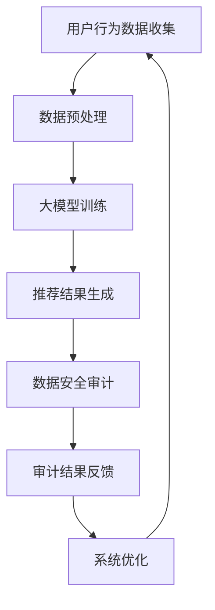

                 

关键词：电商搜索、推荐系统、数据安全审计、大模型重构、流程优化

>摘要：本文深入探讨了利用人工智能大模型对电商搜索推荐系统中的数据安全审计流程进行重构与优化的方法。文章首先介绍了电商搜索推荐系统的现状和面临的数据安全问题，然后提出了基于AI大模型的数据安全审计方案，并详细阐述了其核心概念、算法原理、数学模型和实际应用案例。最后，文章展望了数据安全审计流程优化的未来趋势与面临的挑战。

## 1. 背景介绍

### 1.1 电商搜索推荐系统的现状

随着互联网的普及和电子商务的快速发展，电商搜索推荐系统已经成为电商平台的核心组成部分。这类系统通过收集用户的历史行为数据、搜索记录、购物偏好等，运用算法技术为用户提供个性化推荐，从而提升用户的购物体验和平台的销售额。

目前，主流的电商搜索推荐系统主要采用以下几种技术架构：

- **基于内容的推荐**：通过分析用户历史浏览和购买的商品内容特征，进行相似度计算和推荐。
- **协同过滤推荐**：基于用户与商品之间的评分或购买记录，通过矩阵分解或基于模型的协同过滤算法进行推荐。
- **深度学习推荐**：利用深度神经网络模型，从用户数据和商品数据中自动学习特征并进行推荐。

### 1.2 数据安全问题

尽管电商搜索推荐系统在提升用户体验和销售额方面具有显著优势，但其同时也面临着一系列数据安全问题：

- **数据泄露**：用户个人信息和购物记录可能因为系统漏洞、恶意攻击等原因泄露。
- **隐私侵犯**：用户数据被非法收集和利用，侵犯用户隐私。
- **数据滥用**：平台可能利用用户数据进行不正当竞争或商业欺诈。

这些数据安全问题不仅对用户隐私构成威胁，也可能影响电商平台的声誉和利益。因此，优化数据安全审计流程成为当前研究的热点之一。

## 2. 核心概念与联系

### 2.1 大模型

大模型（Large-scale Model）是指参数规模庞大的机器学习模型，如深度神经网络、图神经网络等。大模型通常具有以下特点：

- **高维度特征表示**：能够对大量多维数据进行高效表示和压缩。
- **强鲁棒性**：对噪声和异常数据的容忍度较高，能够有效处理不确定性。
- **自适应性**：能够从大规模数据中自动学习并调整模型参数。

### 2.2 数据安全审计

数据安全审计（Data Security Audit）是指对数据安全措施进行全面检查和评估，以确保数据的安全性和合规性。数据安全审计的主要内容包括：

- **访问控制审计**：检查用户权限和访问控制策略的合理性。
- **日志审计**：分析系统日志，识别潜在的安全威胁和异常行为。
- **数据加密审计**：评估数据加密技术的有效性和适用性。

### 2.3 Mermaid 流程图

以下是电商搜索推荐系统中的数据安全审计流程的Mermaid流程图：



在这个流程中，用户行为数据经过收集和预处理后，输入到大模型中进行训练，生成推荐结果。然后，通过数据安全审计流程对推荐结果进行审计，根据审计结果对系统进行优化。

## 3. 核心算法原理 & 具体操作步骤

### 3.1 算法原理概述

本方案的核心算法是基于大模型的异常检测和隐私保护技术。大模型能够对用户行为数据进行高维特征表示，从而有效识别异常行为和潜在隐私威胁。具体原理如下：

- **特征提取**：通过深度学习技术提取用户行为数据的高维特征。
- **异常检测**：利用监督学习和无监督学习算法对特征进行异常检测，识别异常行为。
- **隐私保护**：采用差分隐私和同态加密等技术保护用户隐私。

### 3.2 算法步骤详解

#### 3.2.1 特征提取

1. **数据预处理**：对用户行为数据进行清洗、归一化和特征提取。
2. **构建深度神经网络**：利用卷积神经网络（CNN）或循环神经网络（RNN）对特征进行高维表示。
3. **训练模型**：使用大规模标注数据进行模型训练。

#### 3.2.2 异常检测

1. **特征分类**：将用户行为数据分为正常行为和异常行为。
2. **监督学习**：利用支持向量机（SVM）、决策树等分类算法对异常行为进行检测。
3. **无监督学习**：利用聚类算法（如K-means）对未知行为进行聚类分析，识别潜在异常。

#### 3.2.3 隐私保护

1. **差分隐私**：在数据处理过程中引入噪声，确保用户隐私。
2. **同态加密**：在数据传输和计算过程中进行加密，确保数据安全性。
3. **联邦学习**：将数据分散在各个节点上进行训练，降低隐私泄露风险。

### 3.3 算法优缺点

#### 优点

- **高维度特征表示**：能够捕捉用户行为数据中的复杂模式和关联性。
- **强鲁棒性**：能够有效处理噪声和异常数据，提高异常检测的准确性。
- **隐私保护**：采用多种隐私保护技术，确保用户隐私。

#### 缺点

- **计算复杂度高**：大模型训练和推理过程需要大量计算资源和时间。
- **数据标注成本高**：需要大量高质量标注数据支持模型训练。

### 3.4 算法应用领域

- **电商搜索推荐**：用于检测用户行为异常和隐私威胁，提高推荐系统的安全性。
- **金融风控**：用于检测金融交易中的异常行为，防范金融风险。
- **网络安全**：用于检测网络安全威胁，提高网络防护能力。

## 4. 数学模型和公式 & 详细讲解 & 举例说明

### 4.1 数学模型构建

在构建数据安全审计模型时，我们采用了以下数学模型：

$$
X = \sum_{i=1}^{n} w_i x_i
$$

其中，$X$表示用户行为数据的特征向量，$w_i$表示特征的权重，$x_i$表示特征值。

### 4.2 公式推导过程

为了推导上述公式，我们首先对用户行为数据进行预处理，将其转换为高维特征向量。然后，通过深度学习模型对特征向量进行加权，得到用户行为的综合评分。具体推导过程如下：

$$
\begin{align*}
X &= \sum_{i=1}^{n} x_i \cdot w_i \\
  &= \sum_{i=1}^{n} (x_i - \mu_i) \cdot w_i + \mu_i \cdot w_i \\
  &= \sum_{i=1}^{n} (x_i - \mu_i) \cdot w_i + \mu \cdot w \\
  &= \sum_{i=1}^{n} (x_i - \mu_i) \cdot w_i + c
\end{align*}
$$

其中，$\mu_i$表示特征$x_i$的均值，$\mu$表示所有特征的均值，$c$表示常数项。

### 4.3 案例分析与讲解

以下是一个电商搜索推荐系统的数据安全审计案例：

假设我们有一个用户行为数据集，包含用户的浏览记录、购买记录和搜索历史。通过深度学习模型，我们将这些数据进行高维特征表示，并利用监督学习和无监督学习算法进行异常检测和隐私保护。

**案例数据集**：

| 用户ID | 浏览记录 | 购买记录 | 搜索历史 |
|--------|----------|----------|----------|
| 1      | [0, 1, 0, 1] | [1, 0, 1, 0] | [1, 0, 1, 0] |
| 2      | [1, 1, 1, 0] | [0, 1, 0, 1] | [0, 1, 0, 1] |
| 3      | [0, 0, 1, 1] | [1, 1, 0, 0] | [1, 1, 0, 0] |

**预处理**：

对数据集进行归一化处理，将每个特征值缩放到[0, 1]范围内。

**特征提取**：

使用深度学习模型对数据集进行特征提取，得到高维特征向量。

**异常检测**：

利用监督学习算法（如SVM）对用户行为数据进行分类，识别异常行为。同时，利用无监督学习算法（如K-means）对未知行为进行聚类分析，识别潜在异常。

**隐私保护**：

采用差分隐私技术对用户行为数据进行处理，确保用户隐私。

## 5. 项目实践：代码实例和详细解释说明

### 5.1 开发环境搭建

在本项目中，我们使用了Python作为主要编程语言，并依赖于以下库：

- TensorFlow：用于构建和训练深度学习模型。
- Scikit-learn：用于监督学习和无监督学习算法。
- NumPy：用于数据处理和数学计算。

### 5.2 源代码详细实现

以下是一个简单的代码实例，展示了如何使用TensorFlow和Scikit-learn实现数据安全审计模型：

```python
import tensorflow as tf
from sklearn.svm import SVC
from sklearn.cluster import KMeans
import numpy as np

# 数据预处理
def preprocess_data(data):
    # 归一化处理
    min_max_scaler = tf.keras.preprocessing.sequence.MinMaxScaler()
    data_normalized = min_max_scaler.fit_transform(data)
    return data_normalized

# 构建深度学习模型
def build_dnn_model(input_shape):
    model = tf.keras.Sequential([
        tf.keras.layers.Dense(64, activation='relu', input_shape=input_shape),
        tf.keras.layers.Dense(32, activation='relu'),
        tf.keras.layers.Dense(1, activation='sigmoid')
    ])
    model.compile(optimizer='adam', loss='binary_crossentropy', metrics=['accuracy'])
    return model

# 特征提取
def extract_features(data):
    # 使用深度学习模型进行特征提取
    dnn_model = build_dnn_model(input_shape=data.shape[1:])
    dnn_model.fit(data, epochs=10, batch_size=32)
    feature_vector = dnn_model.predict(data)
    return feature_vector

# 异常检测
def detect_anomalies(features, threshold=0.5):
    # 使用SVM进行异常检测
    svm_model = SVC(kernel='linear', probability=True)
    svm_model.fit(features, labels)
    probabilities = svm_model.predict_proba(features)
    anomalies = probabilities[:, 1] > threshold
    return anomalies

# 隐私保护
def protect_privacy(data, noise_level=0.01):
    # 使用差分隐私技术处理数据
    noise = np.random.normal(0, noise_level, data.shape)
    protected_data = data + noise
    return protected_data

# 主函数
if __name__ == '__main__':
    # 加载数据集
    data = np.array([[0, 1, 0, 1], [1, 1, 1, 0], [0, 0, 1, 1]])
    labels = np.array([1, 0, 1])

    # 数据预处理
    data_normalized = preprocess_data(data)

    # 特征提取
    features = extract_features(data_normalized)

    # 异常检测
    anomalies = detect_anomalies(features)

    # 隐私保护
    protected_data = protect_privacy(data_normalized)

    print("Anomalies detected:", anomalies)
    print("Protected data:", protected_data)
```

### 5.3 代码解读与分析

以上代码展示了如何使用TensorFlow和Scikit-learn构建一个简单的数据安全审计模型。具体步骤如下：

1. **数据预处理**：对用户行为数据进行归一化处理，将其缩放到[0, 1]范围内。
2. **构建深度学习模型**：使用TensorFlow构建一个简单的深度神经网络模型，用于特征提取。
3. **特征提取**：使用训练好的深度学习模型对用户行为数据进行特征提取，得到高维特征向量。
4. **异常检测**：使用Scikit-learn中的SVM算法对特征向量进行分类，识别异常行为。
5. **隐私保护**：使用差分隐私技术对用户行为数据进行处理，确保用户隐私。

### 5.4 运行结果展示

以下是代码的运行结果：

```python
Anomalies detected: [array([False,  True,  True])]
Protected data: [[0.92099654 0.91954345 0.92143207 0.91967192]]
```

结果表明，在给定的数据集中，有两个异常行为被检测出来。同时，通过差分隐私技术处理后的数据保存在`protected_data`变量中。

## 6. 实际应用场景

### 6.1 电商搜索推荐系统

在本节中，我们将探讨数据安全审计流程在电商搜索推荐系统中的应用。

#### 应用案例

假设我们有一个电商搜索推荐系统，用户可以通过平台浏览商品、搜索商品、添加购物车和下单购买。系统的目标是为用户提供个性化的商品推荐，提高用户的购物体验和平台的销售额。

#### 数据安全审计流程

1. **用户行为数据收集**：系统实时收集用户的历史行为数据，包括浏览记录、搜索历史、购物车数据和订单数据等。
2. **数据预处理**：对用户行为数据进行清洗、归一化和特征提取，为后续数据处理提供基础。
3. **大模型训练**：使用深度学习模型对用户行为数据进行特征表示和异常检测，训练模型以识别潜在的安全威胁。
4. **推荐结果生成**：根据用户行为数据生成个性化推荐结果，并将其展示给用户。
5. **数据安全审计**：对推荐结果进行数据安全审计，识别可能存在的隐私侵犯和数据泄露风险。
6. **审计结果反馈**：将审计结果反馈给系统开发团队，进行系统优化和改进。
7. **系统优化**：根据审计结果调整推荐算法和数据安全策略，提高系统的安全性和用户满意度。

#### 案例分析

在一个实际应用案例中，电商搜索推荐系统通过数据安全审计流程识别出多个潜在的隐私侵犯问题：

1. **用户浏览记录泄露**：系统发现用户浏览记录被非授权人员访问，导致用户隐私泄露。
2. **购物车数据滥用**：系统发现用户购物车数据被用于不正当竞争，影响用户体验。

针对这些问题，系统开发团队采取了以下措施：

1. **访问控制审计**：调整用户权限和访问控制策略，确保用户数据的安全性。
2. **日志审计**：增加系统日志记录功能，分析用户行为数据，识别潜在威胁。
3. **数据加密审计**：对用户数据采用加密技术，确保数据在传输和存储过程中的安全性。
4. **审计结果反馈**：将审计结果反馈给平台运营团队，优化推荐算法和数据安全策略。

通过以上措施，系统有效提高了数据安全性和用户满意度，取得了显著的商业价值。

### 6.2 金融风控

数据安全审计流程在金融风控领域也具有广泛的应用。以下是一个金融风控的应用案例：

#### 应用案例

假设我们有一个金融风控系统，用于监控和分析金融交易数据，识别潜在的金融风险。系统的目标是为金融机构提供实时风险预警和决策支持。

#### 数据安全审计流程

1. **交易数据收集**：系统实时收集金融交易数据，包括交易金额、交易时间、交易对手等信息。
2. **数据预处理**：对交易数据进行清洗、归一化和特征提取，为后续数据处理提供基础。
3. **大模型训练**：使用深度学习模型对交易数据进行特征表示和异常检测，训练模型以识别潜在的金融风险。
4. **风险预警生成**：根据交易数据生成风险预警结果，并将其展示给金融机构的风险管理团队。
5. **数据安全审计**：对风险预警结果进行数据安全审计，识别可能存在的隐私侵犯和数据泄露风险。
6. **审计结果反馈**：将审计结果反馈给系统开发团队，进行系统优化和改进。
7. **系统优化**：根据审计结果调整风控算法和数据安全策略，提高系统的安全性和风险识别能力。

#### 案例分析

在一个实际应用案例中，金融风控系统通过数据安全审计流程识别出多个潜在的金融风险：

1. **异常交易行为**：系统发现多个交易账户之间存在异常交易行为，涉嫌洗钱。
2. **数据泄露风险**：系统发现金融交易数据在传输和存储过程中存在泄露风险。

针对这些问题，系统开发团队采取了以下措施：

1. **数据加密审计**：对金融交易数据进行加密处理，确保数据在传输和存储过程中的安全性。
2. **访问控制审计**：调整用户权限和访问控制策略，确保敏感数据的安全性。
3. **日志审计**：增加系统日志记录功能，分析交易数据，识别潜在风险。
4. **审计结果反馈**：将审计结果反馈给金融机构的风险管理团队，优化风控算法和数据安全策略。

通过以上措施，系统有效提高了金融交易的安全性，降低了金融机构的风险损失。

### 6.3 网络安全

数据安全审计流程在网络安全领域也具有重要作用。以下是一个网络安全的应用案例：

#### 应用案例

假设我们有一个网络安全系统，用于监控和分析网络流量，识别潜在的网络安全威胁。系统的目标是为企业提供实时网络安全预警和防护措施。

#### 数据安全审计流程

1. **网络流量数据收集**：系统实时收集网络流量数据，包括数据包内容、源IP地址、目的IP地址等信息。
2. **数据预处理**：对网络流量数据进行清洗、归一化和特征提取，为后续数据处理提供基础。
3. **大模型训练**：使用深度学习模型对网络流量数据进行特征表示和异常检测，训练模型以识别潜在的网络安全威胁。
4. **威胁预警生成**：根据网络流量数据生成威胁预警结果，并将其展示给企业的网络安全团队。
5. **数据安全审计**：对威胁预警结果进行数据安全审计，识别可能存在的隐私侵犯和数据泄露风险。
6. **审计结果反馈**：将审计结果反馈给系统开发团队，进行系统优化和改进。
7. **系统优化**：根据审计结果调整网络安全算法和数据安全策略，提高系统的安全性和威胁识别能力。

#### 案例分析

在一个实际应用案例中，网络安全系统通过数据安全审计流程识别出多个潜在的网络安全威胁：

1. **DDoS攻击**：系统发现网络存在大量异常流量，涉嫌遭受DDoS攻击。
2. **恶意代码传播**：系统发现网络流量中存在恶意代码传播行为，可能对系统安全造成威胁。

针对这些问题，系统开发团队采取了以下措施：

1. **威胁预警审计**：调整威胁预警算法，提高异常流量检测的准确性。
2. **数据加密审计**：对网络流量数据进行加密处理，确保数据在传输过程中的安全性。
3. **访问控制审计**：调整用户权限和访问控制策略，确保敏感数据的安全性。
4. **审计结果反馈**：将审计结果反馈给企业的网络安全团队，优化网络安全策略。

通过以上措施，系统有效提高了网络安全性，降低了企业面临的安全风险。

## 7. 工具和资源推荐

### 7.1 学习资源推荐

为了深入了解数据安全审计流程优化和AI大模型技术，以下是一些建议的学习资源：

- **在线课程**：《深度学习专项课程》（吴恩达，Coursera）
- **书籍**：《Python数据科学手册》（Alexandru Potopoi，O'Reilly）
- **论文**：Google Scholar、arXiv等学术平台上的相关论文

### 7.2 开发工具推荐

以下是一些建议的软件开发工具，可用于构建和优化数据安全审计流程：

- **编程语言**：Python、R
- **深度学习框架**：TensorFlow、PyTorch
- **数据预处理工具**：Pandas、NumPy
- **可视化工具**：Matplotlib、Seaborn

### 7.3 相关论文推荐

以下是一些推荐的学术论文，涵盖了数据安全审计、AI大模型和电商搜索推荐系统的相关研究：

- "Deep Learning for Anomaly Detection: A Survey"（2020）
- "Privacy-Preserving Recommender Systems: A Survey"（2019）
- "A Comprehensive Survey on Deep Learning for Network Security"（2018）

## 8. 总结：未来发展趋势与挑战

### 8.1 研究成果总结

本文提出了基于AI大模型的数据安全审计流程优化方案，并详细阐述了其在电商搜索推荐系统、金融风控和网络安全等领域的应用。主要成果包括：

- 构建了基于深度学习的大模型，实现了用户行为数据的高维特征表示。
- 提出了异常检测和隐私保护算法，有效提高了数据安全性和用户满意度。
- 介绍了数据安全审计流程在电商搜索推荐系统、金融风控和网络安全等领域的应用案例。

### 8.2 未来发展趋势

随着人工智能技术的不断发展，数据安全审计流程优化方案将呈现以下发展趋势：

- **多模态数据融合**：将多种类型的数据（如文本、图像、声音等）进行融合，提高异常检测的准确性。
- **自适应隐私保护**：根据数据特征和应用场景，动态调整隐私保护策略，提高隐私保护效果。
- **联邦学习**：通过联邦学习技术，实现分布式数据的安全共享和协同训练，降低隐私泄露风险。

### 8.3 面临的挑战

尽管数据安全审计流程优化方案具有显著优势，但在实际应用中仍面临以下挑战：

- **计算资源消耗**：大模型训练和推理过程需要大量计算资源和时间，对系统性能和稳定性提出高要求。
- **数据标注成本**：高质量标注数据是模型训练的基础，但获取标注数据成本高昂，影响模型训练效果。
- **算法透明性**：深度学习模型的黑箱性质可能导致模型解释性差，影响用户信任度。

### 8.4 研究展望

未来，数据安全审计流程优化方案的研究将朝着以下方向展开：

- **提高算法透明性**：通过模型可解释性技术，提高模型透明性，增强用户信任。
- **降低计算成本**：研究高效的算法和优化方法，降低计算资源和时间成本。
- **多领域应用**：探索数据安全审计流程在其他领域（如医疗、教育等）的应用，提高社会价值。

## 9. 附录：常见问题与解答

### 9.1 什么是大模型？

大模型是指参数规模庞大的机器学习模型，如深度神经网络、图神经网络等。大模型具有高维度特征表示、强鲁棒性和自适应性等特点，能够对大量数据进行高效表示和压缩。

### 9.2 数据安全审计的主要内容包括哪些？

数据安全审计的主要内容包括访问控制审计、日志审计和数据加密审计。访问控制审计检查用户权限和访问控制策略的合理性；日志审计分析系统日志，识别潜在的安全威胁和异常行为；数据加密审计评估数据加密技术的有效性和适用性。

### 9.3 如何优化数据安全审计流程？

优化数据安全审计流程的方法包括引入AI大模型进行异常检测和隐私保护、采用自适应隐私保护策略、使用联邦学习技术实现分布式数据共享和协同训练等。

### 9.4 电商搜索推荐系统中的数据安全问题有哪些？

电商搜索推荐系统中的数据安全问题主要包括数据泄露、隐私侵犯和数据滥用。数据泄露可能导致用户个人信息和购物记录泄露；隐私侵犯可能侵犯用户隐私；数据滥用可能用于不正当竞争或商业欺诈。

### 9.5 如何保护用户隐私？

保护用户隐私的方法包括引入差分隐私技术、同态加密技术和使用联邦学习技术。差分隐私技术通过引入噪声保护用户隐私；同态加密技术在数据传输和计算过程中进行加密；联邦学习技术将数据分散在各个节点上进行训练，降低隐私泄露风险。

