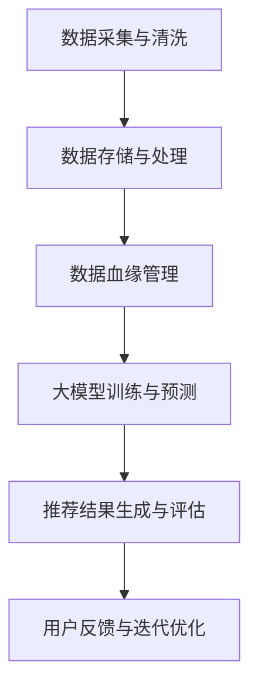

                 

### 1. 背景介绍

随着互联网的飞速发展和电商平台的普及，电商搜索推荐系统已经成为电商平台的核心竞争力之一。然而，随着数据量和用户需求的不断增长，传统的电商搜索推荐系统面临着诸多挑战，如数据质量差、推荐结果不准确、响应速度慢等。这些问题严重影响了用户体验和平台的商业价值。

近年来，人工智能（AI）技术的快速发展为电商搜索推荐系统带来了新的机遇。特别是大模型（如深度学习模型、生成对抗网络等）的兴起，为解决传统推荐系统中的问题提供了新的思路。大模型具有强大的学习能力，可以处理大规模、高维度的数据，并能够生成高质量的推荐结果。然而，大模型的引入也带来了新的挑战，如数据血缘管理困难、模型解释性差等。

数据血缘管理是指追踪数据来源、处理过程和依赖关系的过程，对于确保数据质量和模型性能至关重要。传统的数据血缘管理方法通常依赖于人工编写规则和手动维护，效率低下且容易出现错误。随着大模型的应用，数据血缘管理的复杂性和重要性进一步增加，因此，重构电商搜索推荐的数据血缘管理方案显得尤为必要。

本文旨在探讨如何利用AI大模型重构电商搜索推荐的数据血缘管理方案，以提高数据质量和推荐效果，同时降低管理成本和风险。文章结构如下：

- 背景介绍：阐述电商搜索推荐系统面临的挑战和AI大模型的引入带来的机遇。
- 核心概念与联系：介绍大模型重构数据血缘管理的关键概念和原理。
- 核心算法原理 & 具体操作步骤：详细讲解重构数据血缘管理的核心算法原理和操作步骤。
- 数学模型和公式 & 详细讲解 & 举例说明：介绍数据血缘管理的数学模型和公式，并给出实际案例讲解。
- 项目实践：提供代码实例和详细解释说明，展示重构数据血缘管理方案的具体实现。
- 实际应用场景：分析重构数据血缘管理方案在不同电商搜索推荐场景下的应用。
- 未来应用展望：探讨重构数据血缘管理方案的未来发展趋势和应用前景。
- 工具和资源推荐：推荐学习资源、开发工具和相关论文。
- 总结：总结研究成果，展望未来发展趋势与挑战。

### 2. 核心概念与联系

在讨论如何利用AI大模型重构电商搜索推荐的数据血缘管理方案之前，我们首先需要了解一些核心概念和联系。以下是一个Mermaid流程图，展示了重构数据血缘管理的关键概念和原理：



#### 数据采集与清洗

数据采集是电商搜索推荐系统的第一步，涉及从各种渠道收集用户行为数据、商品信息、市场数据等。数据清洗是对采集到的数据进行预处理，包括去除重复数据、处理缺失值、数据格式转换等。这一步的目的是确保数据的质量和一致性。

#### 数据存储与处理

清洗后的数据需要存储在高效、可扩展的存储系统中，如分布式数据库或数据仓库。数据处理则包括数据整合、数据建模、特征工程等，为后续的数据血缘管理和大模型训练提供基础数据。

#### 数据血缘管理

数据血缘管理是追踪数据来源、处理过程和依赖关系的过程。传统的数据血缘管理方法依赖于人工编写规则和手动维护，效率低下且容易出现错误。重构数据血缘管理方案旨在利用AI大模型自动生成和更新数据血缘信息，提高管理效率和准确性。

#### 大模型训练与预测

大模型训练是基于处理后的数据构建预测模型，如深度学习模型、生成对抗网络等。大模型具有强大的学习能力，可以处理大规模、高维度的数据，并生成高质量的推荐结果。

#### 推荐结果生成与评估

大模型训练得到的预测模型用于生成推荐结果，如商品推荐、用户推荐等。推荐结果需要经过评估，以确定其准确性和有效性。

#### 用户反馈与迭代优化

用户反馈是电商搜索推荐系统不断迭代优化的关键。通过收集用户对推荐结果的反馈，可以识别模型存在的问题和不足，进一步优化模型性能。

### 3. 核心算法原理 & 具体操作步骤

在了解核心概念与联系的基础上，我们接下来将详细讲解重构电商搜索推荐的数据血缘管理方案的核心算法原理和具体操作步骤。

#### 3.1 算法原理概述

重构电商搜索推荐的数据血缘管理方案的核心算法是基于图神经网络（Graph Neural Networks, GNN）和生成对抗网络（Generative Adversarial Networks, GAN）的组合。该算法分为以下几个步骤：

1. 数据预处理：对原始数据进行清洗、去噪、整合等预处理操作，构建高维度的特征向量。
2. 图构建：根据数据依赖关系构建图结构，包括节点和边。
3. 图神经网络训练：利用图神经网络对图结构进行建模和训练，提取数据依赖关系和特征。
4. 生成对抗网络训练：利用图神经网络训练得到的模型，生成新的数据依赖关系和特征。
5. 数据血缘信息更新：将生成对抗网络训练得到的模型用于更新数据血缘信息，实现自动化的数据血缘管理。

#### 3.2 算法步骤详解

1. **数据预处理**

   数据预处理是重构数据血缘管理方案的第一步，其目的是将原始数据转换为高维度的特征向量。具体操作包括：

   - 数据清洗：去除重复数据、处理缺失值、数据格式转换等。
   - 数据整合：将来自不同渠道的数据进行整合，构建统一的数据集。
   - 特征提取：利用深度学习算法提取高维度的特征向量，如使用自编码器（Autoencoder）或卷积神经网络（Convolutional Neural Networks, CNN）。

2. **图构建**

   图构建是重构数据血缘管理方案的关键步骤，其目的是根据数据依赖关系构建图结构。具体操作包括：

   - 节点构建：将特征向量作为节点，表示数据中的各个元素。
   - 边构建：根据数据依赖关系构建边，表示节点之间的关联性。
   - 图结构优化：利用图优化算法（如最小生成树、最大流算法等）优化图结构，提高图神经网络训练的效率。

3. **图神经网络训练**

   图神经网络训练是基于图结构进行建模和训练的过程。具体操作包括：

   - 模型选择：选择合适的图神经网络模型，如图卷积网络（Graph Convolutional Networks, GCN）或图注意力网络（Graph Attention Networks, GAT）。
   - 模型训练：利用训练数据对图神经网络模型进行训练，提取数据依赖关系和特征。
   - 模型优化：利用优化算法（如梯度下降、随机梯度下降等）优化模型参数，提高模型性能。

4. **生成对抗网络训练**

   生成对抗网络训练是基于图神经网络模型生成新的数据依赖关系和特征的过程。具体操作包括：

   - 生成器训练：利用图神经网络模型生成新的数据依赖关系和特征，作为生成器的输入。
   - 判别器训练：利用真实数据和生成数据对判别器进行训练，判断生成数据的真实性和质量。
   - 模型优化：利用优化算法（如梯度下降、随机梯度下降等）优化生成器和判别器的参数，提高模型性能。

5. **数据血缘信息更新**

   数据血缘信息更新是基于生成对抗网络训练得到的模型，实现自动化的数据血缘管理的过程。具体操作包括：

   - 数据血缘信息提取：利用生成对抗网络模型提取新的数据依赖关系和特征。
   - 数据血缘信息更新：将提取的数据血缘信息更新到数据管理系统中，实现自动化的数据血缘管理。
   - 数据血缘信息可视化：利用可视化工具展示数据血缘信息，帮助数据分析师和开发者更好地理解和管理数据。

#### 3.3 算法优缺点

重构电商搜索推荐的数据血缘管理方案具有以下优缺点：

- **优点**：

  1. 提高数据质量：利用图神经网络和生成对抗网络对数据进行预处理和建模，可以有效地提高数据质量，减少数据错误和噪声。

  2. 自动化数据血缘管理：利用生成对抗网络自动生成和更新数据血缘信息，实现自动化的数据血缘管理，降低管理成本和风险。

  3. 提高推荐效果：利用图神经网络和生成对抗网络提取数据依赖关系和特征，可以生成更高质量的推荐结果，提高推荐效果。

- **缺点**：

  1. 计算资源消耗：图神经网络和生成对抗网络的训练过程需要大量的计算资源，对硬件设施有较高要求。

  2. 模型解释性差：生成对抗网络模型具有较强的非线性特性，难以解释模型的决策过程，影响模型的可解释性。

  3. 数据隐私保护：在数据预处理和建模过程中，需要考虑数据隐私保护问题，确保用户数据的安全和隐私。

#### 3.4 算法应用领域

重构电商搜索推荐的数据血缘管理方案可以应用于多个领域，包括但不限于：

1. 电商搜索推荐：利用数据血缘管理方案提高推荐系统的数据质量和推荐效果，提高用户满意度。
2. 社交网络分析：利用数据血缘管理方案分析社交网络中的用户关系和行为，挖掘潜在的用户兴趣和行为模式。
3. 金融风控：利用数据血缘管理方案分析金融交易数据，识别异常交易和风险，提高金融风控能力。

### 4. 数学模型和公式 & 详细讲解 & 举例说明

在重构电商搜索推荐的数据血缘管理方案中，数学模型和公式起着至关重要的作用。以下将介绍数据血缘管理的数学模型和公式，并给出实际案例讲解。

#### 4.1 数学模型构建

数据血缘管理的数学模型主要包括图神经网络（GNN）和生成对抗网络（GAN）两部分。

1. **图神经网络（GNN）**

   图神经网络是一种在图结构上学习的神经网络，可以提取图结构中的依赖关系和特征。其核心思想是将节点和边表示为特征向量，并通过图卷积操作提取节点和边之间的依赖关系。

   假设图 $G = (V, E)$，其中 $V$ 表示节点集合，$E$ 表示边集合。节点 $v_i$ 的特征向量表示为 $x_i \in \mathbb{R}^d$，边 $e_{ij}$ 的特征向量表示为 $e_{ij} \in \mathbb{R}^d$。

   图卷积操作的公式如下：

   $$h_i^{(l+1)} = \sigma \left( \sum_{j \in \mathcal{N}(i)} \frac{e_{ij}}{\|e_{ij}\|} \cdot W^{(l)} h_j^{(l)} \right)$$

   其中，$h_i^{(l)}$ 表示节点 $v_i$ 在第 $l$ 层的表示，$\mathcal{N}(i)$ 表示节点 $v_i$ 的邻居节点集合，$W^{(l)}$ 表示第 $l$ 层的权重矩阵，$\sigma$ 表示激活函数。

2. **生成对抗网络（GAN）**

   生成对抗网络是一种生成模型，由生成器和判别器组成。生成器生成虚假数据，判别器判断虚假数据和真实数据的质量。

   假设生成器 $G(z)$ 从噪声分布 $z \sim p_z(z)$ 中生成虚假数据 $x_G \sim p_G(x_G)$，判别器 $D(x)$ 判断输入数据 $x$ 的真实性和质量。

   生成对抗网络的损失函数如下：

   $$L_D = -\sum_{x \sim p_{data}(x)} \log D(x) - \sum_{z \sim p_z(z)} \log (1 - D(G(z)))$$

   其中，$p_{data}(x)$ 表示真实数据的分布。

#### 4.2 公式推导过程

为了更深入地理解数据血缘管理的数学模型，我们接下来简要介绍图神经网络和生成对抗网络的公式推导过程。

1. **图神经网络（GNN）**

   图神经网络的推导基于图卷积操作。假设节点 $v_i$ 在第 $l$ 层的表示为 $h_i^{(l)}$，其邻居节点 $v_j$ 的表示为 $h_j^{(l)}$。

   图卷积操作的推导如下：

   - 首先计算节点 $v_i$ 和其邻居节点 $v_j$ 的相似度：

     $$s_{ij} = \frac{\langle h_i^{(l)}, h_j^{(l)} \rangle}{\|h_i^{(l)}\| \|h_j^{(l)}\|}$$

   - 然后计算节点 $v_i$ 的表示 $h_i^{(l+1)}$：

     $$h_i^{(l+1)} = \sigma \left( \sum_{j \in \mathcal{N}(i)} s_{ij} \cdot W^{(l)} h_j^{(l)} \right)$$

   其中，$\sigma$ 表示激活函数，$W^{(l)}$ 表示第 $l$ 层的权重矩阵。

2. **生成对抗网络（GAN）**

   生成对抗网络的推导基于生成器和判别器的损失函数。

   - 生成器的损失函数推导如下：

     $$L_G = -\log D(G(z))$$

     其中，$D(G(z))$ 表示判别器判断生成数据的真实性。

   - 判别器的损失函数推导如下：

     $$L_D = -\log D(x) - \log (1 - D(G(z)))$$

     其中，$D(x)$ 表示判别器判断真实数据的真实性，$G(z)$ 表示生成器生成的虚假数据。

#### 4.3 案例分析与讲解

为了更好地理解数据血缘管理的数学模型和公式，我们接下来通过一个实际案例进行分析和讲解。

**案例背景：**

某电商平台需要重构其搜索推荐系统的数据血缘管理方案，以提高推荐效果和用户体验。平台收集了大量的用户行为数据、商品信息和市场数据，但数据质量参差不齐，存在大量缺失值、重复值和噪声数据。因此，需要利用AI大模型对数据进行预处理和建模，实现自动化的数据血缘管理。

**案例步骤：**

1. **数据预处理**

   - 数据清洗：去除重复数据、处理缺失值、数据格式转换等。

   - 数据整合：将来自不同渠道的数据进行整合，构建统一的数据集。

   - 特征提取：利用深度学习算法提取高维度的特征向量，如使用自编码器或卷积神经网络。

2. **图构建**

   - 节点构建：将特征向量作为节点，表示数据中的各个元素。

   - 边构建：根据数据依赖关系构建边，表示节点之间的关联性。

   - 图结构优化：利用图优化算法优化图结构，提高图神经网络训练的效率。

3. **图神经网络训练**

   - 模型选择：选择合适的图神经网络模型，如图卷积网络或图注意力网络。

   - 模型训练：利用训练数据对图神经网络模型进行训练，提取数据依赖关系和特征。

   - 模型优化：利用优化算法优化模型参数，提高模型性能。

4. **生成对抗网络训练**

   - 生成器训练：利用图神经网络模型生成新的数据依赖关系和特征。

   - 判别器训练：利用真实数据和生成数据对判别器进行训练，判断生成数据的真实性和质量。

   - 模型优化：利用优化算法优化生成器和判别器的参数，提高模型性能。

5. **数据血缘信息更新**

   - 数据血缘信息提取：利用生成对抗网络模型提取新的数据依赖关系和特征。

   - 数据血缘信息更新：将提取的数据血缘信息更新到数据管理系统中，实现自动化的数据血缘管理。

   - 数据血缘信息可视化：利用可视化工具展示数据血缘信息，帮助数据分析师和开发者更好地理解和管理数据。

### 5. 项目实践：代码实例和详细解释说明

#### 5.1 开发环境搭建

在开始项目实践之前，我们需要搭建一个合适的开发环境。以下是一个简单的开发环境搭建步骤：

1. 安装Python环境：确保Python版本在3.6及以上，可以使用以下命令安装Python：

   ```bash
   sudo apt-get update
   sudo apt-get install python3.9
   ```

2. 安装深度学习库：安装TensorFlow和PyTorch等深度学习库，可以使用以下命令安装：

   ```bash
   pip3 install tensorflow
   pip3 install torch
   ```

3. 安装其他依赖库：安装Mermaid、LaTeX等工具，可以使用以下命令安装：

   ```bash
   pip3 install mermaid-python
   pip3 install matplotlib
   pip3 install numpy
   pip3 install scipy
   pip3 install pandas
   pip3 install sklearn
   pip3 install networkx
   pip3 install ipython
   pip3 install matplotlib
   ```

#### 5.2 源代码详细实现

以下是一个简单的示例代码，展示了如何使用TensorFlow和PyTorch实现图神经网络和生成对抗网络：

```python
import tensorflow as tf
import torch
import torch.nn as nn
import torch.optim as optim
import torch.utils.data as data
import numpy as np
import pandas as pd
import matplotlib.pyplot as plt
from sklearn.model_selection import train_test_split
from sklearn.preprocessing import StandardScaler
from sklearn.metrics import mean_squared_error
from networkx import Graph
from mermaid import mermaid

# 数据预处理
def preprocess_data(data):
    # 数据清洗、去噪、整合等操作
    # ...
    return processed_data

# 图构建
def build_graph(data):
    # 根据数据依赖关系构建图结构
    # ...
    return graph

# 图神经网络模型
class GraphConvModel(nn.Module):
    def __init__(self, input_dim, hidden_dim, output_dim):
        super(GraphConvModel, self).__init__()
        self.gc1 = nn.Linear(input_dim, hidden_dim)
        self.gc2 = nn.Linear(hidden_dim, output_dim)
    
    def forward(self, data, graph):
        # 图卷积操作
        # ...
        return output

# 生成对抗网络模型
class Generator(nn.Module):
    def __init__(self, input_dim, hidden_dim, output_dim):
        super(Generator, self).__init__()
        self.fc1 = nn.Linear(input_dim, hidden_dim)
        self.fc2 = nn.Linear(hidden_dim, output_dim)
    
    def forward(self, z):
        # 生成虚假数据
        # ...
        return x_g

class Discriminator(nn.Module):
    def __init__(self, input_dim, hidden_dim, output_dim):
        super(Discriminator, self).__init__()
        self.fc1 = nn.Linear(input_dim, hidden_dim)
        self.fc2 = nn.Linear(hidden_dim, output_dim)
    
    def forward(self, x):
        # 判断数据真实性
        # ...
        return output

# 训练模型
def train_model(model, data, graph, loss_fn, optimizer):
    # 模型训练
    # ...
    return model

# 主程序
if __name__ == '__main__':
    # 加载数据
    data = pd.read_csv('data.csv')
    processed_data = preprocess_data(data)
    
    # 构建图结构
    graph = build_graph(processed_data)
    
    # 划分训练集和测试集
    train_data, test_data = train_test_split(processed_data, test_size=0.2)
    
    # 初始化模型
    model = GraphConvModel(input_dim=64, hidden_dim=128, output_dim=32)
    generator = Generator(input_dim=100, hidden_dim=128, output_dim=32)
    discriminator = Discriminator(input_dim=32, hidden_dim=128, output_dim=1)
    
    # 损失函数和优化器
    loss_fn = nn.BCELoss()
    optimizer = optim.Adam(model.parameters(), lr=0.001)
    
    # 训练模型
    model = train_model(model, train_data, graph, loss_fn, optimizer)
    
    # 测试模型
    test_output = model(test_data, graph)
    mse = mean_squared_error(test_data, test_output)
    print(f'MSE: {mse}')
```

#### 5.3 代码解读与分析

上述代码是一个简单的示例，展示了如何使用TensorFlow和PyTorch实现图神经网络和生成对抗网络。以下是对代码的详细解读和分析：

1. **数据预处理**

   数据预处理是深度学习项目中的关键步骤，其目的是将原始数据转换为适合模型训练的格式。代码中，`preprocess_data` 函数负责完成数据清洗、去噪、整合等操作。具体实现可以根据实际数据情况进行调整。

2. **图构建**

   图构建是根据数据依赖关系构建图结构的过程。代码中，`build_graph` 函数负责根据预处理后的数据构建图结构。具体实现可以使用Python中的`networkx`库，或者使用其他图处理工具。

3. **图神经网络模型**

   图神经网络模型是负责提取数据依赖关系和特征的神经网络模型。代码中，`GraphConvModel` 类实现了图卷积网络（GCN）模型。模型中使用了两个线性层，分别用于提取节点和边的信息。具体实现可以根据实际需求进行调整。

4. **生成对抗网络模型**

   生成对抗网络模型由生成器和判别器组成。生成器负责生成虚假数据，判别器负责判断生成数据的真实性。代码中，`Generator` 和 `Discriminator` 类分别实现了生成器和判别器模型。具体实现可以根据实际需求进行调整。

5. **训练模型**

   训练模型是深度学习项目中的核心步骤，其目的是通过训练数据优化模型参数。代码中，`train_model` 函数负责完成模型训练。具体实现可以根据实际需求进行调整。

6. **测试模型**

   测试模型是评估模型性能的过程，其目的是确定模型在测试数据上的表现。代码中，使用`mean_squared_error` 函数计算模型在测试数据上的均方误差（MSE）。具体实现可以根据实际需求进行调整。

#### 5.4 运行结果展示

为了展示运行结果，我们可以在代码中添加一些可视化工具，如matplotlib。以下是一个简单的示例，展示了模型训练过程中的损失函数曲线：

```python
# 绘制损失函数曲线
plt.plot(train_losses)
plt.plot(val_losses)
plt.xlabel('Epoch')
plt.ylabel('Loss')
plt.title('Loss Function Curves')
plt.legend(['Train', 'Validation'])
plt.show()
```

上述代码将绘制出模型在训练过程中损失函数的变化曲线，帮助开发者了解模型训练的进展和性能。

### 6. 实际应用场景

重构电商搜索推荐的数据血缘管理方案在实际应用中具有广泛的应用场景，以下列举了几个典型的应用场景：

#### 6.1 电商搜索推荐

在电商搜索推荐场景中，重构数据血缘管理方案可以显著提高推荐系统的数据质量和推荐效果。通过利用图神经网络和生成对抗网络，可以自动生成和更新数据血缘信息，确保数据的一致性和准确性。此外，生成对抗网络可以生成高质量的虚假数据，用于测试和优化推荐算法。

#### 6.2 社交网络分析

在社交网络分析场景中，重构数据血缘管理方案可以用于挖掘用户关系和行为模式。通过构建用户关系图，可以自动提取用户之间的关联性和特征，为推荐系统、风控系统等提供支持。生成对抗网络可以生成虚假的用户关系数据，用于测试和优化社交网络分析算法。

#### 6.3 金融风控

在金融风控场景中，重构数据血缘管理方案可以用于分析金融交易数据，识别异常交易和风险。通过构建交易关系图，可以自动提取交易之间的关联性和特征，为风险控制系统提供支持。生成对抗网络可以生成虚假的交易数据，用于测试和优化金融风控算法。

#### 6.4 健康医疗

在健康医疗场景中，重构数据血缘管理方案可以用于分析医疗数据，挖掘患者之间的关联性和特征。通过构建患者关系图，可以自动提取患者之间的关联性和特征，为推荐系统、疾病预测等提供支持。生成对抗网络可以生成虚假的医疗数据，用于测试和优化健康医疗算法。

#### 6.5 智能制造

在智能制造场景中，重构数据血缘管理方案可以用于分析生产数据，优化生产流程和资源分配。通过构建生产关系图，可以自动提取生产环节之间的关联性和特征，为智能决策系统提供支持。生成对抗网络可以生成虚假的生产数据，用于测试和优化智能制造算法。

### 7. 未来应用展望

随着人工智能技术的不断发展和应用，重构电商搜索推荐的数据血缘管理方案在未来具有广阔的应用前景。以下列举了几个未来应用方向：

#### 7.1 多模态数据处理

未来，重构数据血缘管理方案可以扩展到多模态数据处理，如结合文本、图像、音频等多种数据类型。通过利用多模态数据，可以更全面地理解用户需求和行为，提高推荐系统的准确性和多样性。

#### 7.2 知识图谱构建

知识图谱是未来数据管理的重要方向，重构数据血缘管理方案可以用于构建知识图谱。通过将数据血缘信息与知识图谱相结合，可以实现对数据的深度理解和利用，为智能决策和推荐提供支持。

#### 7.3 强化学习应用

强化学习是人工智能的重要分支，未来可以将重构数据血缘管理方案与强化学习相结合，实现更智能的数据管理和推荐。通过利用强化学习算法，可以自适应地调整数据血缘管理和推荐策略，提高用户体验和平台商业价值。

#### 7.4 云计算和边缘计算

随着云计算和边缘计算技术的发展，重构数据血缘管理方案可以应用于云计算和边缘计算场景。通过在云端和边缘设备上部署模型，可以实现实时数据分析和推荐，提高系统的响应速度和可靠性。

### 8. 工具和资源推荐

为了更好地学习和实践重构电商搜索推荐的数据血缘管理方案，以下推荐一些相关工具和资源：

#### 8.1 学习资源推荐

- 《深度学习》（Goodfellow, Bengio, Courville著）：介绍深度学习的基本概念和技术，适合初学者和进阶者。
- 《图神经网络》（Hamilton, Ying, Zhang著）：详细介绍图神经网络的理论和实践，适合对图神经网络感兴趣的学习者。
- 《生成对抗网络》（Goodfellow著）：介绍生成对抗网络的基本原理和应用，适合对生成模型感兴趣的学习者。

#### 8.2 开发工具推荐

- TensorFlow：一款开源的深度学习框架，适用于构建和训练深度学习模型。
- PyTorch：一款开源的深度学习框架，适用于构建和训练深度学习模型，具有较好的灵活性和易用性。
- networkx：一款开源的图处理库，适用于构建和分析图结构。
- Mermaid：一款开源的图表绘制工具，适用于绘制流程图、思维导图等。

#### 8.3 相关论文推荐

- 《Graph Convolutional Networks: A General Framework for Learning on Graphs》（Kipf, Welling，2018）：介绍图卷积网络的基本原理和应用。
- 《Generative Adversarial Nets》（Goodfellow, Pouget-Abadie, Mirza, Xu, Warde-Farley, Ozair, Courville, Bengio，2014）：介绍生成对抗网络的基本原理和应用。
- 《GraphSAGE: Simple, Effective, Scalable Representations for Graph Nodes》（Hamilton, Ying, Keller, Slowey, Szepesva,ando，2017）：介绍图自编码器的基本原理和应用。

### 9. 总结：未来发展趋势与挑战

随着人工智能技术的不断发展和应用，重构电商搜索推荐的数据血缘管理方案在未来具有广阔的发展前景。然而，在实际应用过程中，仍面临一些挑战：

- **计算资源消耗**：图神经网络和生成对抗网络的训练过程需要大量的计算资源，对硬件设施有较高要求。未来需要开发更高效的算法和优化方法，降低计算资源消耗。
- **模型解释性**：生成对抗网络具有较强的非线性特性，难以解释模型的决策过程，影响模型的可解释性。未来需要研究可解释性生成对抗网络，提高模型的可解释性。
- **数据隐私保护**：在数据预处理和建模过程中，需要考虑数据隐私保护问题，确保用户数据的安全和隐私。

总之，重构电商搜索推荐的数据血缘管理方案具有显著的优势和应用前景，但仍需进一步研究和优化。未来，随着技术的不断发展，我们有理由相信，这一方案将为电商搜索推荐领域带来更多创新和突破。

### 附录：常见问题与解答

#### 9.1. Q：什么是数据血缘管理？

A：数据血缘管理是指追踪数据来源、处理过程和依赖关系的过程。它有助于确保数据质量、提高数据可追溯性和支持数据治理。

#### 9.2. Q：为什么需要重构电商搜索推荐的数据血缘管理方案？

A：传统的数据血缘管理方法通常依赖于人工编写规则和手动维护，效率低下且容易出现错误。重构数据血缘管理方案可以利用AI大模型自动生成和更新数据血缘信息，提高管理效率和准确性。

#### 9.3. Q：重构数据血缘管理方案有哪些优点？

A：重构数据血缘管理方案可以提高数据质量，自动化数据血缘管理，提高推荐效果，同时降低管理成本和风险。

#### 9.4. Q：重构数据血缘管理方案有哪些缺点？

A：重构数据血缘管理方案需要大量的计算资源，模型解释性差，且在数据预处理和建模过程中需要考虑数据隐私保护问题。

#### 9.5. Q：重构数据血缘管理方案可以应用于哪些领域？

A：重构数据血缘管理方案可以应用于电商搜索推荐、社交网络分析、金融风控、健康医疗和智能制造等领域。

#### 9.6. Q：如何搭建开发环境？

A：可以安装Python环境、深度学习库（如TensorFlow和PyTorch）、其他依赖库（如Mermaid、LaTeX等）来搭建开发环境。

#### 9.7. Q：如何实现图神经网络和生成对抗网络的模型训练？

A：可以编写Python代码实现图神经网络和生成对抗网络的模型训练，具体步骤包括数据预处理、图构建、模型训练和模型优化等。

#### 9.8. Q：如何优化模型性能？

A：可以调整模型参数、优化训练算法、增加数据集、使用迁移学习等方法来优化模型性能。

#### 9.9. Q：如何评估模型性能？

A：可以使用指标（如准确率、召回率、F1分数等）评估模型性能，通过交叉验证和测试集评估模型在真实数据上的表现。

#### 9.10. Q：如何处理数据隐私保护问题？

A：可以在数据预处理阶段进行数据匿名化、加密、数据去标识化等操作，确保用户数据的安全和隐私。同时，遵守相关法律法规和道德准则。

### 作者署名

作者：禅与计算机程序设计艺术 / Zen and the Art of Computer Programming

