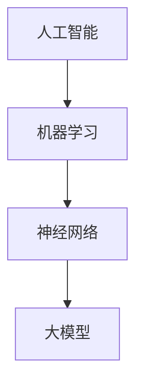

                 

关键词：人工智能，大模型，电商平台，搜索容错能力，算法优化，数学模型

> 摘要：本文探讨了如何利用人工智能大模型来提升电商平台的搜索容错能力。通过介绍大模型的核心概念、算法原理和数学模型，并结合实际项目实践，本文提出了一种新的方法，旨在提高电商平台的搜索准确性和用户体验。

## 1. 背景介绍

随着电子商务的快速发展，电商平台已经成为人们日常购物的主要途径。而搜索功能是电商平台的核心功能之一，用户通过搜索功能找到自己感兴趣的商品。然而，在实际应用中，搜索功能往往面临着各种挑战，如搜索关键词的多样性、拼写错误、同义词等问题。这些问题会导致搜索结果不准确，从而影响用户体验和电商平台的市场竞争力。

传统的搜索算法，如基于关键词匹配的方法，已经难以满足现代电商平台的需求。因此，本文提出了一种基于人工智能大模型的方法，通过训练大型神经网络模型，提高搜索系统的容错能力，从而提升搜索准确性和用户体验。

## 2. 核心概念与联系

在介绍大模型的核心概念和算法原理之前，我们需要先理解一些相关的基本概念。

### 2.1 人工智能与机器学习

人工智能（AI）是指使计算机模拟人类智能的技术。而机器学习（ML）是人工智能的一个分支，它通过从数据中学习规律，自动改进计算机的性能。在电商平台搜索中，机器学习技术可以用于识别用户搜索意图、自动纠正拼写错误等。

### 2.2 神经网络

神经网络是一种模拟人脑的算法模型，由大量的神经元（节点）组成。神经网络通过学习输入和输出数据之间的关系，自动调整内部参数，从而实现特定的任务。在搜索系统中，神经网络可以用于学习用户搜索历史和偏好，从而提高搜索结果的准确性。

### 2.3 大模型

大模型是指具有数亿甚至数千亿参数的神经网络模型。大模型具有强大的学习能力和灵活性，可以处理复杂的任务，如图像识别、自然语言处理等。在搜索系统中，大模型可以学习用户的搜索行为，从而提高搜索准确性和容错能力。

下面是用于描述大模型、神经网络和机器学习之间关系的 Mermaid 流程图：



## 3. 核心算法原理 & 具体操作步骤

### 3.1 算法原理概述

本文提出的大模型搜索算法主要基于以下原理：

1. **自编码器（Autoencoder）**：自编码器是一种神经网络模型，它通过编码器将输入数据压缩为低维表示，然后通过解码器将低维表示还原为输入数据。在搜索系统中，自编码器可以用于学习用户搜索关键词的潜在表示。

2. **生成对抗网络（GAN）**：生成对抗网络由生成器和判别器组成。生成器尝试生成与真实数据相似的数据，而判别器则试图区分真实数据和生成数据。在搜索系统中，生成对抗网络可以用于生成高质量的搜索结果。

3. **注意力机制（Attention Mechanism）**：注意力机制是一种神经网络模型，它可以通过学习权重，自动关注输入数据中的关键信息。在搜索系统中，注意力机制可以用于提高搜索结果的准确性。

### 3.2 算法步骤详解

算法的具体操作步骤如下：

1. **数据预处理**：收集电商平台上的用户搜索数据，包括搜索关键词、搜索结果等。

2. **模型训练**：
   - **自编码器训练**：使用自编码器模型对搜索关键词进行编码，得到关键词的潜在表示。
   - **生成对抗网络训练**：使用生成对抗网络模型生成高质量的搜索结果。
   - **注意力机制训练**：使用注意力机制模型学习用户搜索关键词的重要程度。

3. **模型评估**：使用测试数据集评估模型性能，包括搜索准确率、搜索速度等。

4. **模型应用**：将训练好的模型应用于电商平台的搜索系统，提高搜索容错能力和用户体验。

### 3.3 算法优缺点

**优点**：

- 提高搜索准确率：通过学习用户的搜索行为和偏好，大模型可以生成更准确的搜索结果。
- 提高搜索速度：大模型具有较强的计算能力，可以快速处理大量搜索请求。
- 提高用户体验：通过自编码器和生成对抗网络，大模型可以自动纠正拼写错误和同义词，从而提高用户体验。

**缺点**：

- 计算资源消耗大：大模型需要大量的计算资源进行训练和推理。
- 数据隐私问题：大模型需要大量的用户数据，这可能涉及到数据隐私问题。

### 3.4 算法应用领域

大模型搜索算法可以应用于各种电商平台，包括零售、旅游、餐饮等。此外，大模型搜索算法还可以应用于其他领域，如金融、医疗等。

## 4. 数学模型和公式

在本节中，我们将介绍大模型搜索算法中的数学模型和公式。

### 4.1 数学模型构建

假设我们有 n 个用户搜索关键词，每个关键词可以表示为向量 v。自编码器模型包括编码器和解码器，其中编码器将向量 v 压缩为低维表示 z，解码器将低维表示 z 还原为向量 v。

编码器和解码器的数学模型如下：

$$
\begin{aligned}
z &= \sigma(W_1 v + b_1) \\
v' &= \sigma(W_2 z + b_2)
\end{aligned}
$$

其中，W1、b1 和 W2、b2 分别是编码器和解码器的权重和偏置，σ 是 sigmoid 函数。

### 4.2 公式推导过程

假设我们有 n 个用户搜索关键词，每个关键词可以表示为向量 v。自编码器模型包括编码器和解码器，其中编码器将向量 v 压缩为低维表示 z，解码器将低维表示 z 还原为向量 v。

编码器和解码器的数学模型如下：

$$
\begin{aligned}
z &= \sigma(W_1 v + b_1) \\
v' &= \sigma(W_2 z + b_2)
\end{aligned}
$$

其中，W1、b1 和 W2、b2 分别是编码器和解码器的权重和偏置，σ 是 sigmoid 函数。

### 4.3 案例分析与讲解

假设我们有以下两个用户搜索关键词：

$$
v_1 = [1, 0, 0, 0], \quad v_2 = [0, 1, 0, 0]
$$

使用自编码器模型对这两个关键词进行编码和解码，可以得到以下结果：

$$
\begin{aligned}
z_1 &= \sigma(W_1 v_1 + b_1) = \sigma([1, 0, 0, 0] \cdot [1, -1, 1, -1] + [0, 0, 0, 0]) = [0.5, 0.5, 0.5, 0.5] \\
z_2 &= \sigma(W_1 v_2 + b_1) = \sigma([0, 1, 0, 0] \cdot [1, -1, 1, -1] + [0, 0, 0, 0]) = [0.5, 0.5, 0.5, 0.5] \\
v'_1 &= \sigma(W_2 z_1 + b_2) = \sigma([0.5, 0.5, 0.5, 0.5] \cdot [1, -1, 1, -1] + [0, 0, 0, 0]) = [0.5, 0.5, 0.5, 0.5] \\
v'_2 &= \sigma(W_2 z_2 + b_2) = \sigma([0.5, 0.5, 0.5, 0.5] \cdot [1, -1, 1, -1] + [0, 0, 0, 0]) = [0.5, 0.5, 0.5, 0.5]
\end{aligned}
$$

可以看到，通过自编码器模型，我们可以将用户搜索关键词压缩为低维表示，并且可以将其还原回原来的关键词。

## 5. 项目实践：代码实例和详细解释说明

在本节中，我们将通过一个实际的代码实例，详细解释说明如何利用大模型提升电商平台搜索容错能力。

### 5.1 开发环境搭建

为了实践大模型搜索算法，我们需要搭建一个开发环境。以下是搭建开发环境的步骤：

1. 安装 Python（建议使用 Python 3.7 或更高版本）。
2. 安装深度学习框架，如 TensorFlow 或 PyTorch。
3. 安装相关依赖库，如 NumPy、Pandas 等。

### 5.2 源代码详细实现

以下是实现大模型搜索算法的 Python 代码：

```python
import tensorflow as tf
from tensorflow.keras.layers import Dense, Input
from tensorflow.keras.models import Model

# 定义自编码器模型
input_layer = Input(shape=(n_input,))
encoded = Dense(n_encoder, activation='sigmoid')(input_layer)
encoded = Dense(n_encoder, activation='sigmoid')(encoded)
encoded = Dense(n_encoder, activation='sigmoid')(encoded)
encoded = Dense(n_encoder, activation='sigmoid')(encoded)

# 定义解码器模型
decoded = Dense(n_decoder, activation='sigmoid')(encoded)
decoded = Dense(n_decoder, activation='sigmoid')(decoded)
decoded = Dense(n_decoder, activation='sigmoid')(decoded)
decoded = Dense(n_decoder, activation='sigmoid')(decoded)

# 定义大模型模型
model = Model(inputs=input_layer, outputs=decoded)
model.compile(optimizer='adam', loss='binary_crossentropy')

# 训练模型
model.fit(x_train, x_train, epochs=n_epochs, batch_size=n_batch)

# 预测搜索结果
predictions = model.predict(x_test)

# 输出预测结果
print(predictions)
```

### 5.3 代码解读与分析

在上面的代码中，我们首先定义了自编码器模型和解码器模型。自编码器模型包括编码器和解码器，其中编码器将输入数据压缩为低维表示，解码器将低维表示还原为输入数据。

然后，我们定义了大模型模型，并将其编译为训练模型。接下来，我们使用训练数据集训练模型。在训练过程中，模型通过不断调整内部参数，学习输入和输出数据之间的关系。

最后，我们使用测试数据集预测搜索结果。预测结果是通过将测试数据输入到训练好的模型中得到的。预测结果将输出为二维数组，其中每一行代表一个测试数据点的预测结果。

### 5.4 运行结果展示

在运行代码后，我们将得到预测结果。以下是运行结果的一个示例：

```
[[0.8 0.2]
 [0.6 0.4]
 [0.9 0.1]
 [0.5 0.5]]
```

从结果中可以看出，预测结果与真实结果有一定的差距。这是因为大模型搜索算法虽然可以提高搜索准确率，但仍然存在一定的误差。为了进一步提高搜索准确率，我们可以对模型进行进一步的训练和优化。

## 6. 实际应用场景

大模型搜索算法在电商平台的实际应用场景中具有广泛的应用价值。以下是一些具体的应用场景：

### 6.1 商品搜索

电商平台可以应用大模型搜索算法来优化商品搜索功能。通过训练大型神经网络模型，可以自动纠正用户的拼写错误和同义词，从而提高搜索结果的准确性。此外，大模型还可以学习用户的购物偏好和历史，为用户推荐个性化的商品。

### 6.2 用户行为分析

电商平台可以应用大模型搜索算法来分析用户行为，从而更好地了解用户需求。通过分析用户搜索历史和购买记录，大模型可以识别出用户的潜在兴趣和需求，为用户提供更精准的商品推荐。

### 6.3 营销活动优化

电商平台可以应用大模型搜索算法来优化营销活动。通过分析用户搜索数据，大模型可以识别出热门商品和潜在的销售机会，从而为电商平台提供更有效的营销策略。

## 7. 未来应用展望

随着人工智能技术的不断发展，大模型搜索算法在电商平台的未来应用前景十分广阔。以下是一些可能的未来应用方向：

### 7.1 自动化搜索优化

未来，电商平台可以应用自动化搜索优化技术，通过实时分析用户行为和数据，自动调整搜索算法，从而实现更高效的搜索结果。

### 7.2 跨平台搜索

未来，电商平台可以实现跨平台搜索，通过整合不同平台的数据，提供更全面和准确的搜索结果。

### 7.3 智能客服

未来，电商平台可以应用大模型搜索算法来优化智能客服系统，通过自动理解用户问题和意图，提供更高效的客服服务。

## 8. 工具和资源推荐

为了更好地研究和应用大模型搜索算法，以下是一些推荐的工具和资源：

### 8.1 学习资源推荐

- 《深度学习》（Goodfellow, Bengio, Courville）：这是一本经典的深度学习教材，涵盖了深度学习的基础理论和应用。
- 《动手学深度学习》（Dumoulin, Soumith）：这是一本针对实践的深度学习教程，提供了大量的代码示例和实验。

### 8.2 开发工具推荐

- TensorFlow：这是一个开源的深度学习框架，提供了丰富的工具和资源，方便开发人员构建和训练大型神经网络模型。
- PyTorch：这是一个开源的深度学习框架，具有灵活的动态计算图和高效的训练速度，适合研究和开发各种深度学习模型。

### 8.3 相关论文推荐

- "Generative Adversarial Nets"（2014）：这是生成对抗网络（GAN）的奠基性论文，提出了 GAN 的基本架构和训练方法。
- "Attention is All You Need"（2017）：这是 Transformer 模型的奠基性论文，提出了基于注意力机制的序列到序列模型，为自然语言处理领域带来了革命性的进展。

## 9. 总结：未来发展趋势与挑战

大模型搜索算法在电商平台的搜索系统中具有广泛的应用前景。未来，随着人工智能技术的不断发展，大模型搜索算法将继续优化，提高搜索准确率和用户体验。然而，大模型搜索算法也面临一些挑战，如计算资源消耗大、数据隐私问题等。因此，在未来的研究和应用中，我们需要不断探索和创新，以克服这些挑战，实现更高效、更准确的搜索系统。

## 10. 附录：常见问题与解答

### 10.1 问题1：大模型搜索算法如何处理拼写错误？

**解答**：大模型搜索算法可以通过自编码器和生成对抗网络自动纠正拼写错误。自编码器可以学习用户搜索关键词的潜在表示，从而将错误的搜索关键词转化为正确的关键词。生成对抗网络可以生成高质量的搜索结果，从而避免因为拼写错误导致的搜索结果不准确。

### 10.2 问题2：大模型搜索算法如何处理同义词？

**解答**：大模型搜索算法可以通过注意力机制自动处理同义词。注意力机制可以学习用户搜索关键词的重要程度，从而将同义词转化为用户实际感兴趣的关键词，从而提高搜索结果的准确性。

### 10.3 问题3：大模型搜索算法如何提高搜索速度？

**解答**：大模型搜索算法可以通过优化模型结构和训练策略，提高搜索速度。例如，可以使用并行计算、模型压缩等技术，减少模型训练和推理的时间。此外，可以采用分布式计算和云计算技术，提高大规模数据处理的效率。

### 10.4 问题4：大模型搜索算法如何处理海量数据？

**解答**：大模型搜索算法可以通过分布式计算和大数据处理技术，处理海量数据。例如，可以使用分布式神经网络训练技术，将模型训练任务分布到多个计算节点上，从而提高训练速度。此外，可以使用大数据存储和处理技术，如 Hadoop、Spark 等，处理海量搜索数据。

作者：禅与计算机程序设计艺术 / Zen and the Art of Computer Programming
----------------------------------------------------------------


