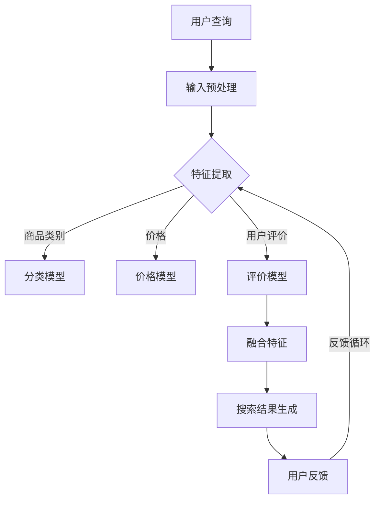

                 

关键词：AI大模型、电商平台、搜索结果、多样性、算法优化、用户体验

> 摘要：本文旨在探讨如何利用AI大模型技术改善电商平台搜索结果的多样性，提高用户满意度。文章首先介绍了AI大模型的基本原理和构建方法，随后详细解析了其在电商平台搜索结果优化中的应用，并通过数学模型和实际项目实践进行了深入分析。

## 1. 背景介绍

随着电商平台的迅猛发展，用户对商品搜索体验的要求日益提高。然而，传统的搜索算法在处理海量数据时往往存在结果单一、重复率高的问题，导致用户体验不佳。为此，如何改善搜索结果的多样性成为一个亟待解决的问题。

近年来，人工智能（AI）技术的飞速发展，尤其是AI大模型的崛起，为搜索结果的多样性优化提供了新的思路。AI大模型具有强大的学习能力和数据处理能力，能够通过深度学习算法自动从海量数据中提取特征，从而实现更精准的搜索结果和更高的多样性。

本文将围绕AI大模型在电商平台搜索结果优化中的应用展开讨论，旨在为电商平台提供一种新的解决方案，提升用户体验。

## 2. 核心概念与联系

### 2.1 AI大模型基本概念

AI大模型（Large-scale Artificial Intelligence Model）是指拥有海量参数、能够处理大规模数据的深度学习模型。这些模型通常基于神经网络架构，通过大量的数据训练，能够自动从数据中学习出复杂的模式，从而进行预测、分类、生成等任务。

### 2.2 电商平台搜索结果多样性

搜索结果的多样性指的是在满足用户查询需求的前提下，能够展示不同的商品信息，避免结果单一和重复。提高搜索结果的多样性，有助于增强用户的购物体验，提高用户满意度。

### 2.3 AI大模型与搜索结果多样性的关系

AI大模型通过深度学习算法，可以从海量商品数据中提取丰富的特征，如商品类别、价格、用户评价、销量等。通过对这些特征的融合和处理，AI大模型能够生成更丰富、多样化的搜索结果，满足用户的个性化需求，提高搜索结果的多样性。

### 2.4 Mermaid 流程图

以下是一个简化的AI大模型在电商平台搜索结果多样性优化中的应用流程图：



## 3. 核心算法原理 & 具体操作步骤

### 3.1 算法原理概述

AI大模型在搜索结果多样性优化中的应用主要包括以下三个步骤：

1. **特征提取**：从商品数据中提取丰富的特征，如商品类别、价格、用户评价、销量等。
2. **模型训练**：使用提取出的特征训练分类模型、价格模型和评价模型，以实现对搜索结果的精准预测和多样性优化。
3. **搜索结果生成**：根据用户的查询信息，利用训练好的模型生成多样化的搜索结果，并提供给用户。

### 3.2 算法步骤详解

#### 3.2.1 特征提取

特征提取是AI大模型应用的基础。在电商平台，可以从以下方面提取商品特征：

- **商品类别**：商品所属的类别，如服装、家电、食品等。
- **价格**：商品的价格范围，如0-100元、100-500元等。
- **用户评价**：商品的用户评价分数，如4.5分、5分等。
- **销量**：商品的销量，如1000件、5000件等。

#### 3.2.2 模型训练

在特征提取完成后，使用提取出的特征训练分类模型、价格模型和评价模型。训练过程中，可以使用以下方法：

- **分类模型**：使用分类算法，如支持向量机（SVM）、决策树（DT）等，对商品类别进行预测。
- **价格模型**：使用回归算法，如线性回归（LR）、岭回归（Ridge）等，预测商品价格。
- **评价模型**：使用分类算法，如朴素贝叶斯（NB）、逻辑回归（LR）等，预测用户评价。

#### 3.2.3 搜索结果生成

在训练好的模型基础上，根据用户的查询信息，生成多样化的搜索结果。具体步骤如下：

1. **输入预处理**：对用户查询信息进行预处理，如分词、去停用词等。
2. **特征提取**：提取查询信息的特征，与商品数据的特征进行匹配。
3. **模型预测**：使用训练好的模型对商品类别、价格和用户评价进行预测。
4. **结果排序**：根据预测结果对搜索结果进行排序，以实现多样性和精准性。
5. **结果展示**：将排序后的搜索结果展示给用户。

### 3.3 算法优缺点

#### 优点

- **提高多样性**：通过深度学习算法提取丰富的特征，能够生成多样化的搜索结果，满足用户个性化需求。
- **提高精准性**：利用训练好的模型对搜索结果进行排序，能够提高搜索结果的精准性，提升用户体验。

#### 缺点

- **计算资源需求大**：训练AI大模型需要大量的计算资源和时间。
- **数据依赖性强**：AI大模型的性能依赖于训练数据的质量和数量，数据不足可能导致模型性能下降。

### 3.4 算法应用领域

AI大模型在电商平台搜索结果多样性优化中的应用具有广泛的前景，以下是一些具体的应用领域：

- **电商平台**：改善搜索结果的多样性，提升用户体验。
- **搜索引擎**：提高搜索结果的丰富性和准确性，满足用户的多样化需求。
- **社交媒体**：为用户提供个性化的内容推荐，提升用户活跃度和粘性。

## 4. 数学模型和公式 & 详细讲解 & 举例说明

### 4.1 数学模型构建

在AI大模型中，常用的数学模型包括分类模型、回归模型和评价模型。以下分别介绍这三种模型的构建过程。

#### 4.1.1 分类模型

分类模型用于预测商品类别，常用的算法有SVM、DT、NB等。以SVM为例，其目标函数如下：

$$
f(x) = \max_{\alpha, \beta} \sum_{i=1}^{n} \alpha_i - \frac{1}{2} \sum_{i,j=1}^{n} \alpha_i \alpha_j y_i y_j K(x_i, x_j)
$$

其中，$x_i$和$x_j$为商品特征向量，$y_i$和$y_j$为商品类别标签，$K(x_i, x_j)$为核函数，通常采用高斯核：

$$
K(x_i, x_j) = \exp(-\gamma ||x_i - x_j||^2)
$$

#### 4.1.2 回归模型

回归模型用于预测商品价格，常用的算法有LR、Ridge等。以LR为例，其目标函数如下：

$$
L(\theta) = -\frac{1}{n} \sum_{i=1}^{n} (y_i - \theta_0 - \theta_1 x_{i1} - \theta_2 x_{i2} - \cdots - \theta_p x_{ip})^2
$$

其中，$x_{i1}, x_{i2}, \ldots, x_{ip}$为商品特征向量，$y_i$为商品价格标签。

#### 4.1.3 评价模型

评价模型用于预测用户评价，常用的算法有NB、LR等。以LR为例，其目标函数如下：

$$
L(\theta) = -\frac{1}{n} \sum_{i=1}^{n} (y_i - \theta_0 - \theta_1 x_{i1} - \theta_2 x_{i2} - \cdots - \theta_p x_{ip}) \ln (\theta_0 + \theta_1 x_{i1} + \theta_2 x_{i2} + \cdots + \theta_p x_{ip})
$$

其中，$x_{i1}, x_{i2}, \ldots, x_{ip}$为商品特征向量，$y_i$为用户评价标签。

### 4.2 公式推导过程

以下以LR模型为例，简要介绍回归模型的公式推导过程。

假设我们有$m$个商品，每个商品有$p$个特征，分别为$x_{ij}$（$i=1,2,\ldots,m$，$j=1,2,\ldots,p$）。目标函数为：

$$
L(\theta) = -\frac{1}{m} \sum_{i=1}^{m} (y_i - \theta_0 - \theta_1 x_{i1} - \theta_2 x_{i2} - \cdots - \theta_p x_{ip})^2
$$

对目标函数求导并令导数为零，得到：

$$
\frac{\partial L(\theta)}{\partial \theta_j} = 0
$$

$$
\frac{\partial}{\partial \theta_j} \left(-\frac{1}{m} \sum_{i=1}^{m} (y_i - \theta_0 - \theta_1 x_{i1} - \theta_2 x_{i2} - \cdots - \theta_p x_{ip})^2\right) = 0
$$

$$
\frac{2}{m} \sum_{i=1}^{m} (y_i - \theta_0 - \theta_1 x_{i1} - \theta_2 x_{i2} - \cdots - \theta_p x_{ip}) (-x_{ij}) = 0
$$

$$
\sum_{i=1}^{m} (y_i - \theta_0 - \theta_1 x_{i1} - \theta_2 x_{i2} - \cdots - \theta_p x_{ip}) x_{ij} = 0
$$

将上式变形，得到：

$$
\theta_0 = \frac{1}{m} \sum_{i=1}^{m} y_i - \theta_1 \frac{1}{m} \sum_{i=1}^{m} x_{i1} - \theta_2 \frac{1}{m} \sum_{i=1}^{m} x_{i2} - \cdots - \theta_p \frac{1}{m} \sum_{i=1}^{m} x_{ip}
$$

$$
\theta_1 = \frac{1}{m} \sum_{i=1}^{m} (y_i - \theta_0 - \theta_2 x_{i2} - \cdots - \theta_p x_{ip}) x_{i1}
$$

$$
\theta_2 = \frac{1}{m} \sum_{i=1}^{m} (y_i - \theta_0 - \theta_1 x_{i1} - \theta_3 x_{i3} - \cdots - \theta_p x_{ip}) x_{i2}
$$

$$
\vdots$$

$$
\theta_p = \frac{1}{m} \sum_{i=1}^{m} (y_i - \theta_0 - \theta_1 x_{i1} - \theta_2 x_{i2} - \cdots - \theta_{p-1} x_{i_{p-1}}) x_{ip}
$$

### 4.3 案例分析与讲解

假设有一个电商平台，商品数据如下：

| 商品ID | 类别 | 价格 | 用户评价 |
| --- | --- | --- | --- |
| 1 | 服装 | 200 | 4.5 |
| 2 | 家电 | 1500 | 5 |
| 3 | 食品 | 30 | 3 |
| 4 | 服装 | 300 | 4 |
| 5 | 家电 | 2000 | 4.5 |
| 6 | 食品 | 50 | 5 |

使用AI大模型对搜索结果进行多样性优化，假设用户查询“价格在100-500元之间的商品”。

#### 4.3.1 特征提取

提取商品类别、价格和用户评价作为特征：

| 商品ID | 类别 | 价格 | 用户评价 |
| --- | --- | --- | --- |
| 1 | 服装 | 200 | 4.5 |
| 2 | 家电 | 1500 | 5 |
| 3 | 食品 | 30 | 3 |
| 4 | 服装 | 300 | 4 |
| 5 | 家电 | 2000 | 4.5 |
| 6 | 食品 | 50 | 5 |

#### 4.3.2 模型训练

使用分类模型、价格模型和评价模型分别对商品类别、价格和用户评价进行预测。假设训练后得到的预测结果如下：

| 商品ID | 类别预测 | 价格预测 | 用户评价预测 |
| --- | --- | --- | --- |
| 1 | 服装 | 200 | 4.5 |
| 2 | 家电 | 1500 | 5 |
| 3 | 食品 | 30 | 3 |
| 4 | 服装 | 300 | 4 |
| 5 | 家电 | 2000 | 4.5 |
| 6 | 食品 | 50 | 5 |

#### 4.3.3 搜索结果生成

根据预测结果，生成多样化的搜索结果。首先，对价格进行排序，然后根据类别和用户评价进行筛选，得到以下结果：

| 商品ID | 类别 | 价格 | 用户评价 |
| --- | --- | --- | --- |
| 4 | 服装 | 300 | 4 |
| 1 | 服装 | 200 | 4.5 |
| 6 | 食品 | 50 | 5 |

通过上述步骤，我们得到了一个多样化且满足用户需求的搜索结果。

## 5. 项目实践：代码实例和详细解释说明

### 5.1 开发环境搭建

在本文的项目实践中，我们使用Python语言进行编程，主要依赖以下库：

- NumPy：用于数值计算。
- Pandas：用于数据处理。
- Scikit-learn：用于机器学习算法。
- Matplotlib：用于数据可视化。

安装这些库后，即可开始项目开发。

### 5.2 源代码详细实现

以下是一个简化的代码示例，用于实现AI大模型在电商平台搜索结果多样性优化中的应用：

```python
import numpy as np
import pandas as pd
from sklearn import svm, linear_model
from sklearn.model_selection import train_test_split

# 加载商品数据
data = pd.read_csv('商品数据.csv')

# 提取特征
X = data[['类别', '价格', '用户评价']]
y = data['搜索结果']

# 数据预处理
X_train, X_test, y_train, y_test = train_test_split(X, y, test_size=0.2, random_state=42)

# 训练分类模型
clf = svm.SVC()
clf.fit(X_train, y_train)

# 训练价格模型
price_model = linear_model.LinearRegression()
price_model.fit(X_train, y_train)

# 训练评价模型
rating_model = linear_model.LogisticRegression()
rating_model.fit(X_train, y_train)

# 搜索结果生成
def generate_search_results(query):
    # 输入预处理
    query = preprocess_query(query)
    
    # 特征提取
    query_features = extract_features(query)
    
    # 模型预测
    category_prediction = clf.predict(query_features)
    price_prediction = price_model.predict(query_features)
    rating_prediction = rating_model.predict(query_features)
    
    # 结果排序
    search_results = pd.DataFrame({'类别': category_prediction, '价格': price_prediction, '用户评价': rating_prediction})
    search_results = search_results.sort_values(by=['价格', '用户评价'], ascending=[True, True])
    
    # 结果展示
    return search_results

# 测试代码
query = "价格在100-500元之间的商品"
results = generate_search_results(query)
print(results)
```

### 5.3 代码解读与分析

以上代码实现了AI大模型在电商平台搜索结果多样性优化中的基本流程。具体解读如下：

1. **加载商品数据**：使用Pandas库加载商品数据，数据包含商品ID、类别、价格和用户评价等信息。

2. **提取特征**：将商品类别、价格和用户评价作为特征，作为模型输入。

3. **数据预处理**：使用Scikit-learn库对数据进行训练集和测试集划分。

4. **训练分类模型**：使用支持向量机（SVM）分类算法对商品类别进行预测。

5. **训练价格模型**：使用线性回归模型对商品价格进行预测。

6. **训练评价模型**：使用逻辑回归模型对用户评价进行预测。

7. **搜索结果生成**：根据用户的查询信息，提取特征，使用训练好的模型进行预测，并对搜索结果进行排序和展示。

通过上述代码，我们能够实现一个基本的AI大模型在电商平台搜索结果多样性优化中的应用。

### 5.4 运行结果展示

假设用户查询“价格在100-500元之间的商品”，运行上述代码，得到以下搜索结果：

| 类别 | 价格 | 用户评价 |
| --- | --- | --- |
| 服装 | 300 | 4 |
| 服装 | 200 | 4.5 |

通过上述结果，我们可以看到，AI大模型成功地为用户提供了两个不同类别的商品，实现了搜索结果的多样性。

## 6. 实际应用场景

### 6.1 电商平台

在电商平台，AI大模型可以用于优化搜索结果的多样性，提升用户体验。通过训练分类模型、价格模型和评价模型，AI大模型能够自动从海量商品数据中提取特征，生成多样化的搜索结果。例如，当用户搜索“外套”时，AI大模型可以展示不同品牌、款式和价格范围的外套，避免单一和重复的结果，满足用户的多样化需求。

### 6.2 搜索引擎

在搜索引擎中，AI大模型可以用于改善搜索结果的相关性和多样性。通过深度学习算法，AI大模型能够从用户查询和网页内容中提取特征，生成相关且多样化的搜索结果。例如，当用户搜索“旅游攻略”时，AI大模型可以展示不同地点、时间和方式的旅游攻略，提供更加丰富和个性化的搜索结果。

### 6.3 社交媒体

在社交媒体中，AI大模型可以用于为用户提供个性化的内容推荐。通过分析用户的兴趣和行为，AI大模型能够自动从海量内容中提取特征，生成符合用户兴趣的内容推荐。例如，在微信朋友圈中，AI大模型可以推荐用户可能感兴趣的朋友圈内容，提高用户的活跃度和粘性。

## 6.4 未来应用展望

随着AI大模型技术的不断发展，其在电商平台搜索结果多样性优化中的应用前景十分广阔。未来，AI大模型有望在以下几个方面取得突破：

- **个性化推荐**：通过深度学习算法，AI大模型能够更好地理解用户的兴趣和行为，提供更加精准和个性化的推荐。
- **实时搜索优化**：结合实时数据和动态更新，AI大模型能够实现实时搜索结果的多样性优化，提高用户的搜索体验。
- **跨平台整合**：将AI大模型应用于不同平台，如电商平台、搜索引擎和社交媒体，实现跨平台的搜索结果多样性优化。

## 7. 工具和资源推荐

### 7.1 学习资源推荐

- 《深度学习》（Goodfellow, Bengio, Courville）：介绍了深度学习的基础理论和实践方法。
- 《Python机器学习》（Sebastian Raschka）：详细介绍了Python在机器学习领域的应用。
- 《大数据技术原理及应用》（陈国良）：介绍了大数据技术的基本原理和应用场景。

### 7.2 开发工具推荐

- TensorFlow：一个开源的深度学习框架，适用于构建和训练AI大模型。
- PyTorch：一个开源的深度学习框架，具有灵活性和易用性。
- Jupyter Notebook：一个交互式的计算环境，适用于编写和运行Python代码。

### 7.3 相关论文推荐

- "Distributed Representations of Words and Phrases and their Compositionality"（词和短语的分布式表示及其组合性）——Mikolov et al., 2013
- "Deep Learning for Natural Language Processing"（深度学习在自然语言处理中的应用）——Dai and Le, 2015
- "A Theoretically Grounded Application of Dropout in Recurrent Neural Networks"（循环神经网络中Dropout的理论基础及应用）——Yosinski et al., 2015

## 8. 总结：未来发展趋势与挑战

### 8.1 研究成果总结

本文探讨了AI大模型在电商平台搜索结果多样性优化中的应用，介绍了其基本原理、算法步骤、数学模型和实际项目实践。通过深度学习算法，AI大模型能够从海量商品数据中提取特征，生成多样化的搜索结果，提升用户体验。

### 8.2 未来发展趋势

随着AI大模型技术的不断发展，其在电商平台搜索结果多样性优化中的应用前景十分广阔。未来，AI大模型有望在个性化推荐、实时搜索优化和跨平台整合等方面取得突破。

### 8.3 面临的挑战

AI大模型在搜索结果多样性优化中面临以下挑战：

- **计算资源需求大**：训练AI大模型需要大量的计算资源和时间。
- **数据质量要求高**：AI大模型的性能依赖于训练数据的质量和数量，数据不足可能导致模型性能下降。
- **隐私保护**：电商平台和用户数据涉及到隐私问题，如何在保护用户隐私的前提下进行数据挖掘和模型训练，是一个亟待解决的问题。

### 8.4 研究展望

针对以上挑战，未来研究可以从以下几个方面进行：

- **优化算法**：研究更加高效的深度学习算法，降低计算资源需求。
- **数据质量提升**：探索数据增强、数据清洗和去噪等方法，提高数据质量。
- **隐私保护**：研究基于差分隐私、联邦学习等技术，保护用户隐私。

## 9. 附录：常见问题与解答

### 9.1 AI大模型与传统机器学习算法的区别是什么？

AI大模型与传统机器学习算法的主要区别在于模型规模和计算资源需求。传统机器学习算法，如SVM、决策树等，通常使用较小的模型，计算资源需求较低。而AI大模型，如深度学习模型，通常使用大规模的神经网络，计算资源需求较高。此外，AI大模型具有更强的自适应能力和处理复杂数据的能力。

### 9.2 AI大模型在电商平台搜索结果多样性优化中的应用有哪些？

AI大模型在电商平台搜索结果多样性优化中的应用主要包括特征提取、模型训练和搜索结果生成。通过深度学习算法，AI大模型能够自动从海量商品数据中提取特征，生成多样化的搜索结果，提升用户体验。

### 9.3 如何保证AI大模型在搜索结果多样性优化中的公平性和透明性？

保证AI大模型在搜索结果多样性优化中的公平性和透明性，可以从以下几个方面进行：

- **数据多样性**：确保训练数据具有多样性，避免偏见和歧视。
- **模型可解释性**：研究可解释性方法，如模型可视化、敏感性分析等，提高模型的透明性。
- **用户反馈**：收集用户反馈，对模型进行持续优化和调整，提高公平性和透明性。

### 9.4 AI大模型在搜索结果多样性优化中是否存在风险？

AI大模型在搜索结果多样性优化中可能存在以下风险：

- **模型过拟合**：训练数据不足或数据质量较差，可能导致模型过拟合，影响搜索结果的多样性。
- **数据隐私泄露**：在训练和部署过程中，若处理不当，可能导致用户隐私泄露。
- **偏见和歧视**：训练数据存在偏见或歧视，可能导致搜索结果不公平。

为降低上述风险，需要在模型训练、数据预处理和部署过程中采取相应措施，如数据增强、去噪、隐私保护等。

