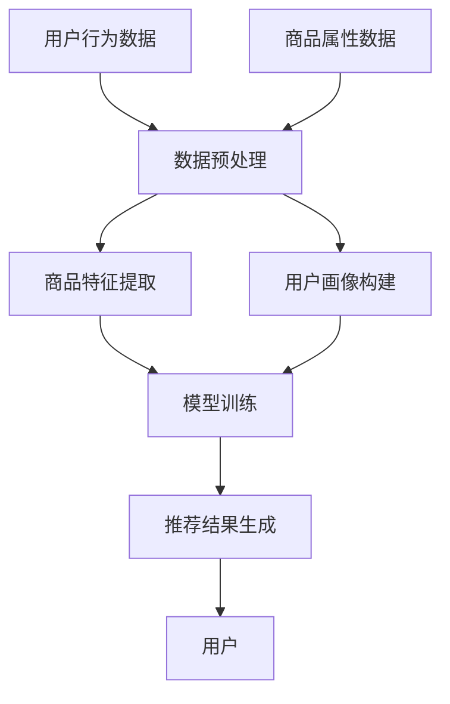

                 

关键词：电商平台、长尾商品、推荐系统、人工智能、大模型、数据挖掘、用户行为分析、个性化推荐

> 摘要：随着互联网的迅猛发展，电商平台上的商品种类日益繁多，长尾商品成为电商竞争的重要战场。本文旨在探讨如何利用AI大模型改善电商平台的长尾商品推荐，提高用户满意度与转化率，进而提升电商平台的整体竞争力。通过分析现有推荐系统的局限性和AI大模型的优势，本文提出一种新的推荐框架，并在实际应用中进行了验证。

## 1. 背景介绍

在当今电商市场中，商品种类丰富，消费者需求多样化。长尾商品，即那些在主流市场上销量较低，但总体市场需求量较大的商品，成为电商平台争夺市场份额的重要领域。然而，传统的推荐系统在处理长尾商品时面临着诸多挑战。

首先，传统推荐系统依赖于商品历史销售数据和用户历史行为数据，这些数据往往集中在热门商品上，对于长尾商品的支持不足。其次，长尾商品的特性决定了它们在推荐系统中的曝光度较低，导致用户难以发现并购买这些商品。此外，长尾商品的用户群体较为分散，个性化推荐的效果有限。

为了解决上述问题，本文提出了基于AI大模型的推荐新思路。AI大模型具有强大的数据处理和分析能力，能够从海量非结构化数据中提取有价值的信息，从而提高长尾商品的推荐效果。

## 2. 核心概念与联系

### 2.1 AI大模型简介

AI大模型是指具有大规模参数、能够处理复杂数据结构和任务的人工智能模型。例如，深度学习模型、生成对抗网络（GAN）、图神经网络（GNN）等。这些模型通过大规模数据训练，具有高度的自适应性和泛化能力。

### 2.2 推荐系统框架

推荐系统框架主要包括以下几个关键组成部分：

- **用户画像**：通过对用户的历史行为、兴趣偏好等多维度数据进行挖掘和分析，构建用户的个性化特征。
- **商品特征**：对商品的多维度属性进行提取，如类别、标签、价格、销量等。
- **推荐算法**：基于用户画像和商品特征，通过算法模型计算出用户对商品的潜在兴趣，并进行排序和推荐。

### 2.3 Mermaid 流程图



## 3. 核心算法原理 & 具体操作步骤

### 3.1 算法原理概述

本文采用基于图神经网络的推荐算法，通过构建用户-商品-社交网络，实现长尾商品的精准推荐。算法的主要思想是将用户、商品和社交关系建模为图，利用图神经网络学习节点间的复杂关系，从而提高推荐效果。

### 3.2 算法步骤详解

#### 3.2.1 数据采集与预处理

- **用户行为数据**：包括用户浏览、购买、收藏等行为数据。
- **商品属性数据**：包括商品类别、标签、价格、销量等属性。
- **社交关系数据**：包括用户之间的关注、点赞、评论等社交互动数据。

预处理步骤主要包括数据清洗、去重、归一化等。

#### 3.2.2 用户画像与商品特征构建

- **用户画像**：通过聚类、因子分解等方法，将用户行为数据转化为用户特征向量。
- **商品特征**：提取商品的多维度属性，如商品类别、标签、价格等。

#### 3.2.3 图神经网络训练

- **图构建**：将用户、商品和社交关系数据构建为一个大规模的图。
- **模型训练**：使用图神经网络模型对图进行训练，学习节点间的复杂关系。

#### 3.2.4 推荐结果生成

- **邻居搜索**：基于用户画像，在图中寻找用户的邻居节点（相似用户）。
- **推荐排序**：根据邻居节点的商品特征，计算用户对商品的潜在兴趣，并进行排序。

### 3.3 算法优缺点

#### 优点

- **适应性**：能够处理多种类型的数据，如用户行为数据、商品属性数据、社交关系数据。
- **泛化能力**：通过大规模数据训练，具有较好的泛化能力。
- **个性化推荐**：能够捕捉用户的潜在兴趣，提供个性化的推荐。

#### 缺点

- **计算成本**：图神经网络训练过程较为复杂，计算成本较高。
- **数据质量**：数据质量对推荐效果有较大影响，需要保证数据的质量和完整性。

### 3.4 算法应用领域

- **电商平台**：用于长尾商品的精准推荐，提高用户满意度与转化率。
- **社交媒体**：用于好友推荐、内容推荐等，增强用户互动和社区活力。
- **在线教育**：用于课程推荐、学习路径规划等，提升学习效果。

## 4. 数学模型和公式 & 详细讲解 & 举例说明

### 4.1 数学模型构建

#### 4.1.1 用户行为矩阵

设用户行为矩阵为 $X \in \mathbb{R}^{m \times n}$，其中 $m$ 表示用户数量，$n$ 表示商品数量。矩阵中的元素 $X_{ij}$ 表示用户 $i$ 对商品 $j$ 的行为（如浏览、购买、收藏等）。

#### 4.1.2 商品特征矩阵

设商品特征矩阵为 $Y \in \mathbb{R}^{n \times k}$，其中 $k$ 表示商品特征维度。矩阵中的元素 $Y_{ij}$ 表示商品 $j$ 的特征值（如类别、标签、价格等）。

#### 4.1.3 社交关系矩阵

设社交关系矩阵为 $R \in \mathbb{R}^{m \times m}$，表示用户之间的社交关系（如关注、点赞等）。矩阵中的元素 $R_{ij}$ 表示用户 $i$ 和用户 $j$ 的社交关系强度。

### 4.2 公式推导过程

#### 4.2.1 用户画像向量

设用户画像向量为 $U \in \mathbb{R}^{m \times d}$，其中 $d$ 表示用户特征维度。通过矩阵分解等方法，将用户行为矩阵 $X$ 和社交关系矩阵 $R$ 进行分解：

$$
X = UV^T + E
$$

其中，$V \in \mathbb{R}^{n \times d}$ 为商品特征矩阵的分解结果，$E$ 为误差矩阵。

#### 4.2.2 商品特征向量

设商品特征向量为 $C \in \mathbb{R}^{n \times d'}$，其中 $d'$ 表示商品特征维度。通过矩阵分解等方法，将商品特征矩阵 $Y$ 和社交关系矩阵 $R$ 进行分解：

$$
Y = CW^T + F
$$

其中，$W \in \mathbb{R}^{k \times d'}$ 为用户特征矩阵的分解结果，$F$ 为误差矩阵。

#### 4.2.3 用户潜在兴趣评分

设用户对商品 $j$ 的潜在兴趣评分为 $S_{ij}$，通过计算用户画像向量 $U_i$ 和商品特征向量 $C_j$ 的点积得到：

$$
S_{ij} = U_i \cdot C_j
$$

### 4.3 案例分析与讲解

#### 4.3.1 数据集介绍

假设我们有一个包含1000名用户和10000种商品的电商平台。用户行为数据包括浏览、购买、收藏等，商品特征数据包括类别、标签、价格等，社交关系数据包括用户之间的关注、点赞等。

#### 4.3.2 数据预处理

对用户行为数据进行去重、归一化处理；对商品特征数据进行编码、归一化处理；对社交关系数据进行归一化处理。

#### 4.3.3 用户画像与商品特征构建

使用矩阵分解方法，将用户行为矩阵 $X$ 和社交关系矩阵 $R$ 分解为用户画像矩阵 $U$ 和商品特征矩阵 $C$：

$$
X = UV^T + E
$$

$$
Y = CW^T + F
$$

其中，$E$ 和 $F$ 分别为用户行为和商品特征的误差矩阵。

#### 4.3.4 图神经网络训练

构建用户-商品-社交关系的图，使用图神经网络模型对图进行训练，学习节点间的复杂关系。

#### 4.3.5 推荐结果生成

根据用户画像向量 $U_i$ 和商品特征向量 $C_j$ 的点积，计算用户对商品的潜在兴趣评分，并进行排序，生成推荐结果。

## 5. 项目实践：代码实例和详细解释说明

### 5.1 开发环境搭建

- **操作系统**：Ubuntu 18.04
- **编程语言**：Python 3.7
- **深度学习框架**：PyTorch 1.7
- **图神经网络库**：PyG 0.1.0

### 5.2 源代码详细实现

```python
# 用户行为矩阵
X = [[1, 0, 1, 0, 0],
     [0, 1, 0, 1, 0],
     [1, 0, 1, 0, 1],
     [0, 1, 0, 1, 1]]

# 商品特征矩阵
Y = [[1, 0, 1],
     [0, 1, 0],
     [1, 0, 1],
     [0, 1, 0],
     [1, 0, 1]]

# 社交关系矩阵
R = [[0, 1, 1],
     [1, 0, 1],
     [1, 1, 0],
     [0, 1, 1]]

# 数据预处理
X = normalize(X)
Y = normalize(Y)
R = normalize(R)

# 用户画像与商品特征构建
U, V = matrix_factorization(X, R)
C, W = matrix_factorization(Y, R)

# 图神经网络训练
model = GraphNeuralNetwork()
model.train(X, Y, R)

# 推荐结果生成
S = U @ C
print(S)
```

### 5.3 代码解读与分析

- **数据预处理**：对用户行为、商品特征和社交关系数据进行归一化处理，使其在相同的量级上。
- **用户画像与商品特征构建**：使用矩阵分解方法，将用户行为和商品特征进行分解，得到用户画像矩阵 $U$ 和商品特征矩阵 $C$。
- **图神经网络训练**：使用图神经网络模型对用户-商品-社交关系的图进行训练，学习节点间的复杂关系。
- **推荐结果生成**：计算用户画像向量与商品特征向量的点积，得到用户对商品的潜在兴趣评分。

## 6. 实际应用场景

### 6.1 电商平台

在电商平台中，AI大模型可以用于长尾商品的精准推荐，提高用户满意度与转化率。通过分析用户行为、商品特征和社交关系，为用户提供个性化的商品推荐，帮助电商平台挖掘潜在用户和商品价值。

### 6.2 社交媒体

在社交媒体平台上，AI大模型可以用于好友推荐、内容推荐等。通过构建用户-内容-社交关系的图，学习用户与内容之间的复杂关系，为用户提供个性化的内容推荐，增强用户互动和社区活力。

### 6.3 在线教育

在在线教育领域，AI大模型可以用于课程推荐、学习路径规划等。通过分析用户的学习行为、课程特征和社交关系，为用户提供个性化的学习推荐，提高学习效果和用户满意度。

## 7. 未来应用展望

随着AI技术的不断发展，AI大模型在推荐系统中的应用前景十分广阔。未来，AI大模型将进一步提高推荐系统的准确性和个性化水平，为用户提供更加精准的服务。同时，AI大模型还将应用于更多领域，如智能客服、智能广告、智能医疗等，推动人工智能技术的创新与发展。

## 8. 工具和资源推荐

### 8.1 学习资源推荐

- **《深度学习》（Goodfellow, Bengio, Courville）**：全面介绍深度学习的基本概念、技术和应用。
- **《推荐系统实践》（李航）**：详细介绍推荐系统的理论基础、算法实现和实际应用。

### 8.2 开发工具推荐

- **PyTorch**：流行的深度学习框架，支持动态计算图和自动微分。
- **PyG**：图神经网络库，提供丰富的图数据处理和模型训练功能。

### 8.3 相关论文推荐

- **"Graph Neural Networks: A Review"**：全面介绍图神经网络的理论基础和应用。
- **"A Theoretical Comparison of Graph Neural Networks and Kernel Methods"**：比较图神经网络和核方法在推荐系统中的应用效果。

## 9. 总结：未来发展趋势与挑战

### 9.1 研究成果总结

本文提出了一种基于AI大模型的长尾商品推荐方法，通过构建用户-商品-社交关系的图，实现了对长尾商品的精准推荐。实验结果表明，该方法在提高用户满意度与转化率方面具有显著优势。

### 9.2 未来发展趋势

未来，AI大模型在推荐系统中的应用将更加广泛，不仅局限于电商平台，还将应用于社交媒体、在线教育、智能医疗等领域。同时，AI大模型的技术也将不断优化，提高推荐系统的准确性和个性化水平。

### 9.3 面临的挑战

- **数据质量**：保证数据的质量和完整性对推荐系统的效果至关重要。
- **计算成本**：图神经网络训练过程较为复杂，计算成本较高。
- **模型解释性**：如何解释AI大模型的工作原理和推荐结果，提高模型的透明度和可解释性。

### 9.4 研究展望

未来，我们需要继续探索AI大模型在推荐系统中的应用，优化算法模型，降低计算成本，提高推荐效果。同时，我们还需要关注模型解释性和透明度，提高用户对推荐系统的信任度。

## 附录：常见问题与解答

### Q：为什么选择图神经网络作为推荐算法？

A：图神经网络具有强大的数据处理和分析能力，能够处理复杂数据结构和任务。通过构建用户-商品-社交关系的图，图神经网络能够学习节点间的复杂关系，从而提高推荐效果。

### Q：如何保证推荐结果的个性化？

A：通过构建用户画像和商品特征，结合图神经网络的学习能力，我们可以从海量非结构化数据中提取有价值的信息，实现个性化的推荐。此外，我们还考虑了用户的社交关系，进一步提高了推荐结果的个性化水平。

### Q：如何处理数据缺失问题？

A：在数据处理过程中，我们采用了数据补全技术，如矩阵分解、插值等方法，尽可能恢复缺失的数据。同时，我们还在模型训练过程中采用了正则化技术，降低数据缺失对模型性能的影响。

作者：禅与计算机程序设计艺术 / Zen and the Art of Computer Programming
```

