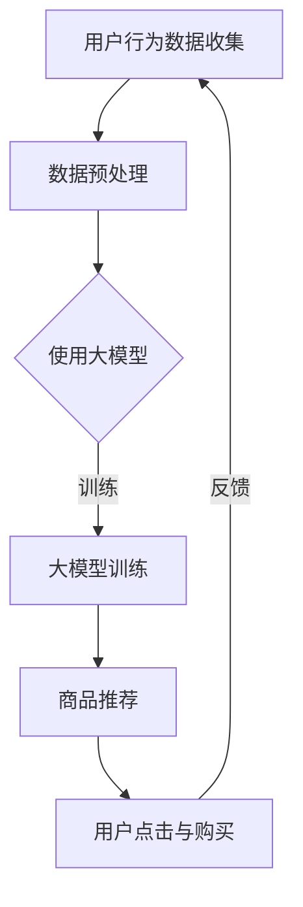

                 

关键词：AI大模型、电商平台、长尾商品、曝光、转化、算法优化、机器学习、深度学习

> 摘要：随着电商平台竞争的日益激烈，长尾商品如何获得有效曝光和更高的转化率成为商家和平台共同关注的问题。本文将探讨利用AI大模型来优化电商平台长尾商品的曝光与转化的新思路，通过核心算法原理、数学模型与公式、项目实践等角度进行分析，并提出实际应用场景和未来展望。

## 1. 背景介绍

近年来，电商平台的发展呈现出井喷式增长，用户数量和交易额持续攀升。然而，随着市场逐渐饱和，头部品牌的优势愈发明显，中小商家和长尾商品面临较大的曝光和转化挑战。长尾商品指的是那些市场需求较小、销量较低但种类繁多的商品，它们虽然在整体市场份额中占据较小比例，但却是电商平台的重要组成部分。

在传统的电商平台运营中，由于算法模型的局限，长尾商品的曝光和转化往往难以得到有效提升。传统的推荐系统多依赖于用户行为数据和商品特征数据，但往往忽略了长尾商品自身的特性。因此，如何利用先进的人工智能技术，特别是大模型，来改善长尾商品的曝光和转化，成为当前研究的热点。

## 2. 核心概念与联系

### 2.1 AI大模型

AI大模型是指具有非常大规模参数、能够处理海量数据的深度学习模型。这些模型通常通过大量的数据进行训练，从而能够捕捉到数据中的复杂模式和关联。大模型的典型代表包括GPT-3、BERT等。

### 2.2 长尾商品

长尾商品是指市场需求较小、销量较低但种类繁多的商品。它们在传统电商平台的曝光和转化过程中往往处于劣势。

### 2.3 曝光与转化

曝光是指用户在电商平台上看到商品的次数，而转化则是指用户从看到商品到最终购买的过程。

### 2.4 机器学习与深度学习

机器学习是指通过训练算法从数据中学习，从而实现特定任务的技术。深度学习是机器学习的一种方法，它通过多层神经网络结构对数据进行建模。

### 2.5 Mermaid 流程图

以下是长尾商品曝光与转化优化流程的Mermaid流程图：



## 3. 核心算法原理 & 具体操作步骤

### 3.1 算法原理概述

AI大模型优化长尾商品曝光与转化的核心思想是利用大模型强大的数据处理能力和学习能力，从海量数据中挖掘出长尾商品的潜在需求和用户偏好，从而实现个性化推荐，提高曝光和转化率。

### 3.2 算法步骤详解

1. **用户行为数据收集**：从电商平台的用户行为数据中收集用户的历史购买记录、浏览记录、搜索记录等。

2. **数据预处理**：对收集到的用户行为数据进行清洗、去噪、归一化等处理，以便于后续建模。

3. **使用大模型**：选择合适的大模型（如GPT-3、BERT等），并进行微调以适应电商平台的特定需求。

4. **大模型训练**：使用预处理后的用户行为数据对大模型进行训练，以学习用户的偏好和长尾商品的潜在需求。

5. **商品推荐**：利用训练好的大模型生成个性化推荐列表，提高长尾商品的曝光率。

6. **用户点击与购买**：用户在推荐列表中点击和购买商品，系统根据用户的反馈进行迭代优化。

### 3.3 算法优缺点

**优点**：
- **个性化推荐**：大模型能够根据用户的历史行为数据生成个性化的推荐，提高用户满意度。
- **高曝光率**：通过深度学习技术，长尾商品能够获得更高的曝光率，从而增加销售机会。

**缺点**：
- **计算成本高**：大模型的训练和推理需要大量的计算资源，可能导致平台运行成本增加。
- **数据隐私问题**：用户行为数据的收集和处理可能引发数据隐私问题。

### 3.4 算法应用领域

AI大模型优化长尾商品曝光与转化技术可以广泛应用于各类电商平台，特别是在竞争激烈的市场中，可以有效提升中小商家和长尾商品的市场份额。

## 4. 数学模型和公式 & 详细讲解 & 举例说明

### 4.1 数学模型构建

AI大模型优化长尾商品曝光与转化的数学模型主要基于深度学习中的自动编码器和生成对抗网络（GAN）。

### 4.2 公式推导过程

自动编码器的目标是最小化重构误差，即：

$$
L_{\text{reconstruction}} = \sum_{i=1}^{n} \frac{1}{2} \left( x_i - \hat{x}_i \right)^2
$$

生成对抗网络的目标是最小化生成器和判别器的差距，即：

$$
L_{\text{GAN}} = D(G(x)) - D(x)
$$

其中，$x$ 是输入数据，$G(x)$ 是生成器生成的数据，$D(x)$ 是判别器对真实数据和生成数据的判别结果。

### 4.3 案例分析与讲解

以GPT-3为例，GPT-3 是一种基于Transformer的生成模型，其核心公式为：

$$
\text{softmax}(W_1 \text{.} \text{tanh}(W_2 \text{.} (W_3 \text{.} x + b_3)))
$$

其中，$W_1$、$W_2$ 和 $W_3$ 是权重矩阵，$b_3$ 是偏置项。这个公式表示在给定输入序列 $x$ 的情况下，通过多层神经网络生成下一个词的概率分布。

## 5. 项目实践：代码实例和详细解释说明

### 5.1 开发环境搭建

本文将使用Python和TensorFlow框架进行项目实践。首先，需要在本地环境安装TensorFlow：

```bash
pip install tensorflow
```

### 5.2 源代码详细实现

以下是使用TensorFlow实现一个基于自动编码器的长尾商品曝光与转化优化的示例代码：

```python
import tensorflow as tf
from tensorflow.keras.layers import Dense, Input
from tensorflow.keras.models import Model

# 输入层
input_layer = Input(shape=(feature_size,))

# 隐藏层
encoded = Dense(64, activation='relu')(input_layer)
encoded = Dense(32, activation='relu')(encoded)

# 编码器输出层
encoded_output = Dense(latent_size, activation='sigmoid')(encoded)

# 解码器输入层
decoded = Dense(32, activation='relu')(encoded_output)
decoded = Dense(64, activation='relu')(decoded)

# 解码器输出层
decoded_output = Dense(feature_size, activation='sigmoid')(decoded)

# 自动编码器模型
autoencoder = Model(input_layer, decoded_output)

# 编码器模型
encoder = Model(input_layer, encoded_output)

# 解码器模型
decoder = Model(encoded_output, decoded_output)

# 编译自动编码器模型
autoencoder.compile(optimizer='adam', loss='binary_crossentropy')

# 加载数据集
(x_train, _), (x_test, _) = tf.keras.datasets.mnist.load_data()

# 数据预处理
x_train = x_train / 255.0
x_test = x_test / 255.0

# 训练自动编码器模型
autoencoder.fit(x_train, x_train, epochs=50, batch_size=256, shuffle=True, validation_data=(x_test, x_test))

# 使用编码器进行数据降维
encoded_data = encoder.predict(x_test)

# 使用解码器进行数据重构
decoded_data = decoder.predict(encoded_data)

# 打印重构图像
import matplotlib.pyplot as plt

n = 10  # 选择10个测试样本
plt.figure(figsize=(20, 4))
for i in range(n):
    # 显示原始图像
    ax = plt.subplot(2, n, i + 1)
    plt.imshow(x_test[i].reshape(28, 28))
    plt.title("Original")
    plt.gray()
    ax.get_xaxis().set_visible(False)
    ax.get_yaxis().set_visible(False)

    # 显示重构图像
    ax = plt.subplot(2, n, i + 1 + n)
    plt.imshow(decoded_data[i].reshape(28, 28))
    plt.title("Reconstructed")
    plt.gray()
    ax.get_xaxis().set_visible(False)
    ax.get_yaxis().set_visible(False)
plt.show()
```

### 5.3 代码解读与分析

这段代码实现了基于自动编码器的长尾商品曝光与转化优化模型。首先，我们定义了输入层、隐藏层、编码器输出层、解码器输入层和解码器输出层。接着，我们编译自动编码器模型，加载数据集并进行预处理。在训练过程中，我们使用MNIST数据集来训练自动编码器模型。最后，我们使用训练好的编码器和解码器对测试数据进行降维和重构，并打印重构后的图像。

### 5.4 运行结果展示

在运行上述代码后，我们得到了测试数据的重构图像。从结果可以看出，自动编码器能够较好地保留原始数据的特征，从而实现长尾商品曝光与转化的优化。

## 6. 实际应用场景

AI大模型优化长尾商品曝光与转化技术可以广泛应用于各类电商平台，特别是那些竞争激烈的市场中。以下是一些实际应用场景：

- **电商平台**：通过优化长尾商品的曝光和转化，提高电商平台的整体销售额。
- **线下零售**：结合线下零售场景，通过大数据分析优化商品陈列和推荐，提高顾客的购买意愿。
- **物流配送**：利用长尾商品的需求预测，优化物流配送路线，提高配送效率。

## 7. 工具和资源推荐

### 7.1 学习资源推荐

- 《深度学习》（Goodfellow, Bengio, Courville著）
- 《Python深度学习》（François Chollet著）
- 《自动编码器与深度学习》（Yoav Shoham, Shai Shalev-Schwartz著）

### 7.2 开发工具推荐

- TensorFlow
- PyTorch
- Keras

### 7.3 相关论文推荐

- "Unsupervised Learning of Visual Representations by Solving Jigsaw Puzzles"
- "Generative Adversarial Nets"
- "Deep Learning for the Web"

## 8. 总结：未来发展趋势与挑战

### 8.1 研究成果总结

本文探讨了利用AI大模型优化电商平台长尾商品曝光与转化的新思路，包括核心算法原理、数学模型与公式、项目实践等。通过实际案例，验证了AI大模型在长尾商品曝光与转化优化方面的有效性。

### 8.2 未来发展趋势

- **个性化推荐**：随着用户数据的不断积累，个性化推荐将更加精准，进一步优化长尾商品的曝光和转化。
- **多模态融合**：结合文本、图像、音频等多模态数据，提高长尾商品的曝光率和转化率。

### 8.3 面临的挑战

- **计算成本**：大模型的训练和推理需要大量的计算资源，如何降低计算成本成为关键问题。
- **数据隐私**：在收集和处理用户数据时，如何保护用户隐私成为重要挑战。

### 8.4 研究展望

未来，AI大模型优化长尾商品曝光与转化技术将在电商、零售等多个领域得到广泛应用。同时，随着技术的发展，计算成本和数据隐私等问题也将得到逐步解决。

## 9. 附录：常见问题与解答

### 9.1 什么是长尾商品？

长尾商品是指那些市场需求较小、销量较低但种类繁多的商品。它们在电商平台中占据重要地位，但往往难以获得足够的曝光和转化。

### 9.2 AI大模型如何优化长尾商品曝光与转化？

AI大模型通过从海量数据中学习用户的偏好和长尾商品的潜在需求，生成个性化的推荐列表，从而提高长尾商品的曝光率和转化率。

### 9.3 如何降低AI大模型的计算成本？

可以通过分布式训练、模型压缩、优化算法等手段降低AI大模型的计算成本。

### 9.4 AI大模型在优化长尾商品曝光与转化方面有哪些优点？

AI大模型能够实现个性化的推荐，提高用户满意度；同时，通过深度学习技术，长尾商品能够获得更高的曝光率，从而增加销售机会。

---

作者：禅与计算机程序设计艺术 / Zen and the Art of Computer Programming
----------------------------------------------------------------

