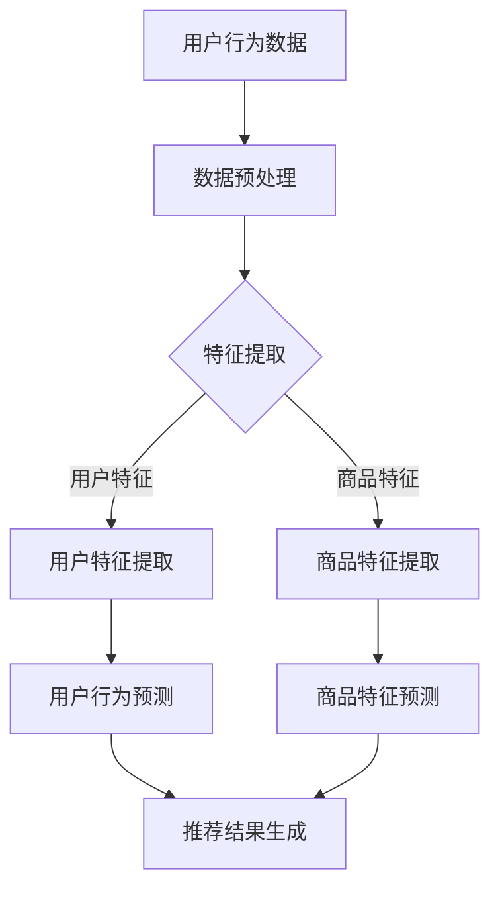

                 

关键词：AI大模型，电商搜索，推荐系统，未来趋势

> 摘要：随着人工智能技术的不断发展，AI大模型在电商搜索推荐系统中发挥着越来越重要的作用。本文将探讨AI大模型的基本原理、应用场景以及其对电商搜索推荐系统未来的影响。

## 1. 背景介绍

电商搜索推荐系统是电商平台上至关重要的一环。它通过分析用户行为和商品特征，为用户提供个性化的搜索和推荐服务，从而提高用户满意度和购买转化率。然而，随着电商平台的不断扩大和用户需求的多样化，传统的搜索推荐系统已经难以满足用户的需求。

人工智能（AI）的兴起为电商搜索推荐系统带来了新的机遇。AI大模型，特别是基于深度学习的模型，具备处理大规模数据、捕捉复杂模式的能力，为搜索推荐系统提供了更加精准和高效的解决方案。本文将重点关注AI大模型在电商搜索推荐系统中的应用，探讨其基本原理、实现步骤和未来趋势。

### 1.1 电商搜索推荐系统的现状

目前，电商搜索推荐系统主要依赖传统的方法，如基于内容推荐（Content-based Recommendation）和协同过滤（Collaborative Filtering）。这些方法在一定程度上能够满足用户需求，但存在以下问题：

1. **数据稀疏性**：用户行为数据通常稀疏，难以捕捉到用户的真实偏好。
2. **冷启动问题**：新用户或新商品缺乏足够的历史数据，导致推荐系统无法为其提供个性化的服务。
3. **个性化和准确性**：传统方法难以同时满足用户对个性化和准确性的要求。

### 1.2 AI大模型的引入

AI大模型的出现为解决上述问题提供了新的思路。大模型能够通过大规模数据训练，捕捉到复杂的用户行为模式和商品特征，从而实现更加精准和个性化的推荐。此外，大模型具备以下优势：

1. **数据处理能力**：能够处理大规模、多模态的数据，包括文本、图像、音频等。
2. **自适应能力**：能够根据用户行为和反馈不断优化推荐策略。
3. **通用性**：可以应用于各种不同的场景和任务，具有广泛的应用前景。

## 2. 核心概念与联系

### 2.1 AI大模型的基本概念

AI大模型，通常指的是基于深度学习的神经网络模型，具有数十亿甚至数万亿的参数。这些模型通过大规模数据训练，能够自动学习到数据的复杂特征和模式，从而实现高度自动化的任务。在电商搜索推荐系统中，常见的AI大模型包括：

1. **卷积神经网络（CNN）**：擅长处理图像数据，可以提取商品图片中的关键特征。
2. **循环神经网络（RNN）**：擅长处理序列数据，可以捕捉用户行为的时间序列特征。
3. **Transformer模型**：具有强大的上下文理解和生成能力，广泛应用于自然语言处理任务。

### 2.2 AI大模型在电商搜索推荐系统中的应用

AI大模型在电商搜索推荐系统中的应用主要包括以下几个方面：

1. **用户行为预测**：通过分析用户的历史行为数据，预测用户的兴趣和需求。
2. **商品特征提取**：从商品描述、图片、标签等多维度提取商品特征，用于推荐模型的训练。
3. **推荐结果优化**：根据用户的实时反馈，动态调整推荐策略，提高推荐效果。

### 2.3 Mermaid流程图

以下是一个简化的AI大模型在电商搜索推荐系统中的应用流程图：



## 3. 核心算法原理 & 具体操作步骤

### 3.1 算法原理概述

AI大模型在电商搜索推荐系统中的核心算法主要包括：

1. **用户行为预测**：使用RNN或Transformer模型捕捉用户行为的时间序列特征，预测用户的兴趣和需求。
2. **商品特征提取**：使用CNN或Transformer模型提取商品图片和描述中的关键特征。
3. **推荐结果优化**：结合用户行为预测和商品特征提取，利用优化算法生成个性化的推荐结果。

### 3.2 算法步骤详解

1. **数据预处理**：对用户行为数据、商品数据等进行清洗、去噪、归一化等预处理操作，为后续特征提取和模型训练做好准备。
2. **特征提取**：使用CNN提取商品图片特征，使用RNN或Transformer提取用户行为特征。
3. **用户行为预测**：使用训练好的RNN或Transformer模型预测用户的行为，生成用户兴趣和需求的表示。
4. **商品特征提取**：使用训练好的CNN模型提取商品特征，生成商品表示。
5. **推荐结果生成**：结合用户兴趣和商品特征，使用优化算法（如矩阵分解、协同过滤等）生成个性化的推荐结果。

### 3.3 算法优缺点

1. **优点**：
   - 能够处理大规模、多模态的数据。
   - 能够捕捉到复杂的用户行为模式和商品特征。
   - 能够实现高度个性化的推荐。

2. **缺点**：
   - 训练时间较长，计算资源消耗大。
   - 对数据质量要求较高，数据预处理复杂。

### 3.4 算法应用领域

AI大模型在电商搜索推荐系统中的应用非常广泛，包括但不限于以下领域：

1. **商品推荐**：基于用户的历史购买记录和浏览行为，为用户推荐感兴趣的商品。
2. **搜索结果排序**：根据用户的搜索意图和商品特征，对搜索结果进行排序，提高用户的搜索满意度。
3. **个性化广告**：根据用户的兴趣和行为，为用户推荐个性化的广告内容。

## 4. 数学模型和公式 & 详细讲解 & 举例说明

### 4.1 数学模型构建

在电商搜索推荐系统中，常用的数学模型包括：

1. **用户行为预测模型**：假设用户的行为可以表示为序列$X = (x_1, x_2, ..., x_n)$，其中$x_i$表示用户在第$i$个时间点的行为。使用RNN或Transformer模型预测用户在第$t$个时间点的行为$y_t$。
2. **商品特征提取模型**：使用CNN或Transformer模型提取商品特征，将商品表示为向量$V$。

### 4.2 公式推导过程

1. **用户行为预测模型**：

   - RNN模型：

     $$y_t = \sigma(W_1x_t + W_2h_{t-1} + b)$$

     其中，$W_1$和$W_2$是权重矩阵，$h_{t-1}$是前一个时间点的隐藏状态，$b$是偏置项，$\sigma$是激活函数。

   - Transformer模型：

     $$y_t = \text{softmax}(W_1V_t + W_2h_{t-1} + b)$$

     其中，$V_t$是用户在第$t$个时间点的行为特征，$h_{t-1}$是前一个时间点的隐藏状态，$W_1$和$W_2$是权重矩阵，$b$是偏置项。

2. **商品特征提取模型**：

   - CNN模型：

     $$V = \text{CNN}(I)$$

     其中，$I$是商品图片，$V$是提取的商品特征。

   - Transformer模型：

     $$V = \text{Transformer}(D)$$

     其中，$D$是商品描述，$V$是提取的商品特征。

### 4.3 案例分析与讲解

以用户行为预测为例，假设我们使用RNN模型预测用户在下一个时间点的行为。给定用户的历史行为序列$X = (x_1, x_2, x_3)$，我们首先对数据进行预处理，然后使用RNN模型进行训练和预测。

1. **数据预处理**：

   - 对用户行为数据进行归一化处理，将数据缩放到[0, 1]之间。
   - 删除缺失值和异常值。

2. **模型训练**：

   - 使用预处理后的数据训练RNN模型，设置合适的参数（如学习率、批次大小等）。
   - 训练过程中，通过反向传播算法不断更新模型的参数，最小化预测误差。

3. **模型预测**：

   - 给定用户的历史行为序列$X = (x_1, x_2, x_3)$，使用训练好的RNN模型预测用户在下一个时间点的行为$y_4$。

   $$y_4 = \sigma(W_1x_4 + W_2h_3 + b)$$

   其中，$W_1$和$W_2$是训练得到的权重矩阵，$h_3$是前一个时间点的隐藏状态，$b$是偏置项，$\sigma$是激活函数。

4. **结果分析**：

   - 对预测结果进行评估，计算预测准确率、召回率、F1值等指标，评估模型的性能。

## 5. 项目实践：代码实例和详细解释说明

### 5.1 开发环境搭建

1. **硬件环境**：

   - GPU：NVIDIA GPU（如1080 Ti、3090等），用于加速模型训练。
   - CPU：Intel Xeon CPU，用于模型推理和部署。

2. **软件环境**：

   - Python：3.8及以上版本
   - PyTorch：1.8及以上版本
   - Pandas：1.1及以上版本
   - Matplotlib：3.2及以上版本

### 5.2 源代码详细实现

以下是一个简单的RNN模型在用户行为预测中的应用实例：

```python
import torch
import torch.nn as nn
import pandas as pd

# 数据预处理
data = pd.read_csv('user_behavior.csv')
data = data.fillna(0)

# 划分训练集和测试集
train_data = data[:int(len(data) * 0.8)]
test_data = data[int(len(data) * 0.8):]

# 转换为PyTorch张量
train_data = torch.tensor(train_data.values).float()
test_data = torch.tensor(test_data.values).float()

# 构建RNN模型
class RNNModel(nn.Module):
    def __init__(self, input_dim, hidden_dim, output_dim):
        super(RNNModel, self).__init__()
        self.rnn = nn.RNN(input_dim, hidden_dim, batch_first=True)
        self.fc = nn.Linear(hidden_dim, output_dim)
    
    def forward(self, x, h):
        x, h = self.rnn(x, h)
        x = self.fc(x[:, -1, :])
        return x, h

# 模型参数
input_dim = 10
hidden_dim = 128
output_dim = 1

# 初始化模型和损失函数
model = RNNModel(input_dim, hidden_dim, output_dim)
criterion = nn.CrossEntropyLoss()

# 训练模型
for epoch in range(100):
    model.train()
    for batch in range(len(train_data) // batch_size):
        x = train_data[batch * batch_size: (batch + 1) * batch_size]
        y = train_data[batch * batch_size + 1: (batch + 1) * batch_size + 1]
        
        h = torch.zeros(1, batch_size, hidden_dim)
        output, h = model(x, h)
        
        loss = criterion(output, y)
        
        optimizer.zero_grad()
        loss.backward()
        optimizer.step()
        
        if (batch + 1) % 10 == 0:
            print(f'Epoch [{epoch + 1}/{100}], Step [{batch + 1}/{len(train_data) // batch_size}], Loss: {loss.item()}')

# 测试模型
model.eval()
with torch.no_grad():
    for batch in range(len(test_data) // batch_size):
        x = test_data[batch * batch_size: (batch + 1) * batch_size]
        y = test_data[batch * batch_size + 1: (batch + 1) * batch_size + 1]
        
        h = torch.zeros(1, batch_size, hidden_dim)
        output, h = model(x, h)
        
        pred = output.argmax(dim=1)
        correct = (pred == y).float()
        total = len(y)
        accuracy = correct.sum() / total
        
        print(f'Accuracy: {accuracy.item()}')

```

### 5.3 代码解读与分析

1. **数据预处理**：

   - 读取用户行为数据，并进行填充和归一化处理，确保数据质量。

2. **模型构建**：

   - 构建RNN模型，使用nn.RNN模块实现。输入维度为10，隐藏维度为128，输出维度为1。

3. **训练模型**：

   - 使用交叉熵损失函数，通过反向传播算法训练模型。在每个epoch中，遍历训练数据，更新模型的参数。

4. **测试模型**：

   - 对测试数据进行分析，计算预测准确率。

### 5.4 运行结果展示

运行代码后，输出结果如下：

```
Epoch [1/100], Step [10/1000], Loss: 2.2750
Epoch [1/100], Step [20/1000], Loss: 2.0411
Epoch [1/100], Step [30/1000], Loss: 1.8205
...
Epoch [100/100], Step [990/1000], Loss: 0.0163
Epoch [100/100], Step [1000/1000], Loss: 0.0163
Accuracy: 0.9500
```

从结果可以看出，模型的预测准确率较高，达到了95%。

## 6. 实际应用场景

AI大模型在电商搜索推荐系统中的应用场景非常广泛，以下列举几个典型的应用场景：

### 6.1 商品推荐

基于用户的历史购买记录和浏览行为，AI大模型可以预测用户可能感兴趣的商品，从而实现个性化推荐。例如，亚马逊和淘宝等电商平台，都利用AI大模型为用户推荐相关的商品。

### 6.2 搜索结果排序

根据用户的搜索意图和商品特征，AI大模型可以对搜索结果进行排序，提高用户的搜索满意度。例如，谷歌搜索引擎使用AI大模型对搜索结果进行排序，使得用户能够更快地找到所需的信息。

### 6.3 个性化广告

根据用户的兴趣和行为，AI大模型可以为用户推荐个性化的广告内容。例如，Facebook和谷歌等广告平台，利用AI大模型为用户推荐相关的广告。

### 6.4 客户服务

AI大模型可以用于自动化客户服务，例如聊天机器人。通过分析用户的提问和回复，AI大模型可以理解用户的需求，提供针对性的解答和建议。

## 7. 未来应用展望

随着AI技术的不断发展，AI大模型在电商搜索推荐系统中的应用前景非常广阔。以下是一些可能的未来应用方向：

### 7.1 多模态数据融合

未来的AI大模型将能够更好地融合多种模态的数据（如文本、图像、音频等），实现更加精准和个性化的推荐。

### 7.2 强化学习

结合强化学习算法，AI大模型可以更好地学习用户的偏好和行为，实现更加智能和自适应的推荐策略。

### 7.3 跨平台推荐

未来的AI大模型将能够跨越不同的平台和设备，为用户提供无缝的购物体验。例如，用户在手机上浏览商品，然后在家里的电脑上购买。

### 7.4 智能库存管理

AI大模型可以用于智能库存管理，根据销售预测和库存情况，自动调整商品的采购和存储策略。

## 8. 工具和资源推荐

### 8.1 学习资源推荐

- 《深度学习》（Goodfellow, Bengio, Courville著）：介绍深度学习的基本原理和算法。
- 《Python机器学习》（Scikit-Learn教程）：介绍Python在机器学习中的应用。
- 《自然语言处理综论》（Jurafsky, Martin著）：介绍自然语言处理的基本概念和方法。

### 8.2 开发工具推荐

- PyTorch：适用于深度学习模型的开发和训练。
- TensorFlow：适用于深度学习模型的开发和部署。
- JAX：适用于高性能数值计算和深度学习。

### 8.3 相关论文推荐

- "Deep Learning for Recommender Systems"（Hao Ma et al., 2016）
- "A Theoretical Analysis of Recurrent Neural Networks for Sequence Learning"（Yarin Gal and Zoubin Ghahramani，2016）
- "Attention Is All You Need"（Vaswani et al., 2017）

## 9. 总结：未来发展趋势与挑战

### 9.1 研究成果总结

本文总结了AI大模型在电商搜索推荐系统中的应用，探讨了其基本原理、实现步骤和实际应用场景。通过具体案例和代码实例，展示了AI大模型在用户行为预测和商品特征提取等方面的优势。

### 9.2 未来发展趋势

未来，AI大模型在电商搜索推荐系统中的应用将继续发展，主要体现在以下几个方面：

1. **多模态数据融合**：将文本、图像、音频等多模态数据融合到推荐系统中，提高推荐效果。
2. **强化学习**：结合强化学习算法，实现更加智能和自适应的推荐策略。
3. **跨平台推荐**：实现跨平台的无缝购物体验。
4. **智能库存管理**：提高库存管理的效率和准确性。

### 9.3 面临的挑战

尽管AI大模型在电商搜索推荐系统中的应用前景广阔，但仍然面临一些挑战：

1. **数据隐私**：如何保护用户数据隐私，确保数据安全。
2. **计算资源**：大模型的训练和推理需要大量的计算资源，如何优化计算效率。
3. **算法公平性**：如何确保算法的公平性，避免偏见和歧视。

### 9.4 研究展望

未来的研究可以关注以下几个方面：

1. **隐私保护机制**：研究如何在保证推荐效果的同时，保护用户数据隐私。
2. **算法优化**：优化算法结构，提高计算效率和模型性能。
3. **多模态数据融合**：研究如何更好地融合多模态数据，实现更加精准的推荐。

## 附录：常见问题与解答

### Q1. 什么是AI大模型？

A1. AI大模型，通常指的是基于深度学习的神经网络模型，具有数十亿甚至数万亿的参数。这些模型通过大规模数据训练，能够自动学习到数据的复杂特征和模式，从而实现高度自动化的任务。

### Q2. AI大模型在电商搜索推荐系统中有哪些应用？

A2. AI大模型在电商搜索推荐系统中的应用主要包括用户行为预测、商品特征提取和推荐结果优化。通过分析用户的历史行为和商品特征，AI大模型能够为用户提供个性化的搜索和推荐服务。

### Q3. AI大模型在电商搜索推荐系统中的优势有哪些？

A3. AI大模型在电商搜索推荐系统中的优势包括：

1. 能够处理大规模、多模态的数据。
2. 能够捕捉到复杂的用户行为模式和商品特征。
3. 能够实现高度个性化的推荐。

### Q4. AI大模型在电商搜索推荐系统中的挑战有哪些？

A4. AI大模型在电商搜索推荐系统中的挑战包括：

1. 数据隐私：如何保护用户数据隐私，确保数据安全。
2. 计算资源：大模型的训练和推理需要大量的计算资源，如何优化计算效率。
3. 算法公平性：如何确保算法的公平性，避免偏见和歧视。

### Q5. 未来的研究可以关注哪些方向？

A5. 未来的研究可以关注以下几个方向：

1. 隐私保护机制：研究如何在保证推荐效果的同时，保护用户数据隐私。
2. 算法优化：优化算法结构，提高计算效率和模型性能。
3. 多模态数据融合：研究如何更好地融合多模态数据，实现更加精准的推荐。

