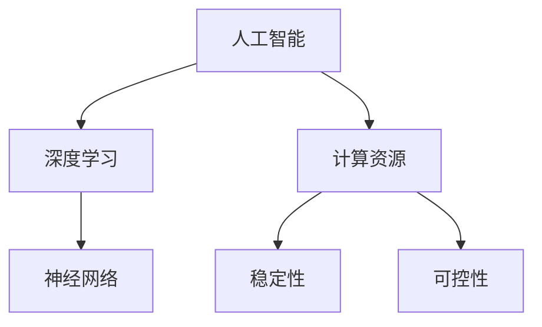

                 

在当今技术飞速发展的时代，人工智能（AI）已经成为推动科技进步和社会变革的重要力量。然而，随着AI技术的日益成熟，我们也不得不面对一个日益凸显的问题：AI的失控风险。特别是在计算资源获取方面，如何确保AI系统的稳定运行，防止其失控，成为了一个亟待解决的关键问题。

本文旨在探讨AI失控的担忧，重点分析计算资源获取在其中的关键作用。我们将从以下几个方面展开讨论：

1. 背景介绍
2. 核心概念与联系
3. 核心算法原理与具体操作步骤
4. 数学模型和公式
5. 项目实践：代码实例和详细解释说明
6. 实际应用场景
7. 工具和资源推荐
8. 总结：未来发展趋势与挑战

通过这篇文章，希望能够为读者提供一个全面、深入的视角，帮助我们更好地理解和应对AI失控的担忧。

## 1. 背景介绍

### 1.1 AI失控的定义与现状

AI失控，通常指的是在特定环境下，AI系统无法按照预期进行操作，甚至可能产生意外行为，对系统或环境造成不利影响。失控现象在AI领域并不少见，尤其是在深度学习和神经网络模型中。这些模型通常依赖于大量的数据进行训练，并且具有高度的非线性特性，这使得它们在某些情况下可能表现出不可预测的行为。

近年来，随着AI技术的迅猛发展，AI失控现象逐渐引起了学术界和工业界的广泛关注。例如，自动驾驶汽车在特定情境下可能出现失控，导致交通事故；金融领域的AI系统可能因为数据偏差而产生错误决策，导致市场波动；医疗领域的AI系统可能因为数据不足或错误而导致误诊或治疗失误。这些案例不仅对个人和社会造成了严重的影响，也暴露了AI系统在稳定性和可控性方面的不足。

### 1.2 计算资源获取的重要性

计算资源获取在AI失控问题中扮演着至关重要的角色。首先，计算资源是AI系统正常运行的基础。无论是训练模型，还是进行实时推理，都需要大量的计算资源支持。缺乏足够的计算资源，可能会导致AI系统无法正常运行，甚至出现错误。

其次，计算资源获取的稳定性直接影响AI系统的可控性。如果计算资源不稳定，例如出现频繁的断电或网络中断，那么AI系统的运行也会受到影响，可能导致失控。因此，确保计算资源的稳定供应是防止AI失控的重要措施。

此外，计算资源获取的效率也对AI失控有着重要影响。高效的计算资源获取可以缩短模型训练时间，提高模型性能，从而降低失控风险。相反，低效的计算资源获取可能会导致模型训练时间过长，甚至无法完成训练，从而影响AI系统的稳定性和可控性。

## 2. 核心概念与联系

在探讨AI失控的问题时，我们需要了解一些核心概念，并分析它们之间的联系。以下是本文将涉及的一些关键概念：

### 2.1 人工智能（AI）

人工智能（Artificial Intelligence，简称AI）是指通过计算机程序实现的智能行为，包括学习、推理、规划、感知和自然语言处理等。AI系统可以根据输入的数据自动调整其行为，以实现特定的目标。

### 2.2 深度学习（Deep Learning）

深度学习是人工智能的一个重要分支，它通过构建多层神经网络来实现复杂的特征提取和模式识别。深度学习模型具有强大的表达能力和学习能力，但同时也存在训练时间长、对数据量要求高等问题。

### 2.3 神经网络（Neural Network）

神经网络是深度学习的基础，它由大量的神经元组成，通过前向传播和反向传播算法进行训练。神经网络可以模拟人脑的思考过程，实现从简单到复杂的任务。

### 2.4 计算资源（Compute Resources）

计算资源包括CPU、GPU、FPGA等硬件资源，以及云服务、数据中心等基础设施。计算资源是AI系统运行的基础，直接影响模型的训练速度和推理性能。

### 2.5 稳定性和可控性（Stability and Controllability）

稳定性是指AI系统在特定环境下能够保持预期行为的能力。可控性是指通过外部干预调整AI系统行为的能力。稳定性和可控性是确保AI系统安全运行的关键。

### 2.6 Mermaid 流程图

Mermaid 是一种基于文本的流程图绘制工具，它可以方便地绘制各种类型的流程图。以下是一个示例，展示了核心概念之间的联系：



通过这个流程图，我们可以清晰地看到各个核心概念之间的联系，这有助于我们更好地理解AI失控问题。

## 3. 核心算法原理与具体操作步骤

### 3.1 算法原理概述

为了更好地理解AI失控的风险，我们需要了解一些核心算法的基本原理。以下将介绍一种常见的深度学习算法——卷积神经网络（Convolutional Neural Network，简称CNN），以及其在计算资源获取方面的具体操作步骤。

CNN 是一种用于图像识别和处理的深度学习算法，其核心原理是通过多层卷积操作提取图像特征，并最终实现分类或回归任务。以下是CNN的基本结构：

1. **输入层（Input Layer）**：接收输入图像，图像经过预处理后输入到网络中。
2. **卷积层（Convolutional Layer）**：通过卷积核在输入图像上进行卷积操作，提取图像的局部特征。
3. **激活函数层（Activation Function Layer）**：对卷积层的输出进行非线性变换，增加模型的非线性能力。
4. **池化层（Pooling Layer）**：对激活函数层的输出进行池化操作，降低数据维度，减少计算量。
5. **全连接层（Fully Connected Layer）**：将卷积层和池化层的输出进行融合，并通过全连接层进行分类或回归。
6. **输出层（Output Layer）**：输出最终的结果。

### 3.2 算法步骤详解

#### 3.2.1 数据预处理

在进行CNN训练之前，需要对图像数据进行预处理，包括图像归一化、数据增强等操作。图像归一化可以加速模型收敛，数据增强可以增加模型的泛化能力。

#### 3.2.2 卷积操作

卷积操作是CNN的核心，通过卷积核在输入图像上进行滑动，将图像中的局部特征提取出来。卷积操作的公式如下：

$$
\text{output}_{ij} = \sum_{k=1}^{c}\sum_{p=1}^{h}\sum_{q=1}^{w} w_{kpq} \cdot \text{input}_{i+p,j+q}
$$

其中，$w_{kpq}$ 是卷积核的权重，$\text{input}_{i+p,j+q}$ 是输入图像的像素值。

#### 3.2.3 激活函数

激活函数是CNN的非线性部分，常用的激活函数有ReLU（Rectified Linear Unit）、Sigmoid和Tanh等。ReLU函数可以加速模型收敛，Sigmoid和Tanh函数可以限制输出值的范围。

#### 3.2.4 池化操作

池化操作用于降低数据维度，减少计算量。常用的池化方法有最大池化（Max Pooling）和平均池化（Average Pooling）等。池化操作的公式如下：

$$
\text{output}_{ij} = \frac{1}{s \times s} \sum_{p=1}^{s}\sum_{q=1}^{s} \text{input}_{i+p,j+q}
$$

其中，$s$ 是池化窗口的大小。

#### 3.2.5 全连接层

全连接层将卷积层和池化层的输出进行融合，并通过权重矩阵进行线性变换。全连接层的输出可以通过softmax函数进行分类。

#### 3.2.6 损失函数与优化算法

在CNN训练过程中，需要通过损失函数评估模型的预测结果与实际结果之间的差距，并使用优化算法更新模型的权重。常用的损失函数有交叉熵损失（Cross-Entropy Loss）和均方误差损失（Mean Squared Error Loss）等。常用的优化算法有梯度下降（Gradient Descent）、随机梯度下降（Stochastic Gradient Descent，简称SGD）和Adam等。

### 3.3 算法优缺点

#### 优点：

1. CNN 可以通过卷积操作自动提取图像的局部特征，减少人工设计的特征工程工作量。
2. CNN 具有很强的并行计算能力，适合在GPU上进行加速。
3. CNN 在图像分类、目标检测和图像生成等领域取得了显著的成果。

#### 缺点：

1. CNN 的训练过程需要大量的计算资源和时间，特别是对于大规模的图像数据集。
2. CNN 对数据预处理的要求较高，需要保证数据的质量和多样性。
3. CNN 的模型结构复杂，可能存在过拟合的风险。

### 3.4 算法应用领域

CNN 在许多领域都有广泛的应用，包括：

1. 图像分类：用于对图像进行分类，如人脸识别、物体检测等。
2. 目标检测：用于在图像中检测出特定目标的位置和属性。
3. 图像生成：用于生成新的图像，如艺术风格转换、人脸生成等。
4. 自然语言处理：虽然CNN主要用于图像处理，但其思想也可以应用于自然语言处理领域，如文本分类和情感分析等。

## 4. 数学模型和公式

在深度学习模型中，数学模型和公式起着核心作用。以下将详细介绍CNN中的数学模型和公式，并举例说明。

### 4.1 数学模型构建

CNN中的数学模型主要涉及以下几个方面：

1. **卷积操作**：卷积操作可以通过以下公式表示：

   $$
   \text{output}_{ij} = \sum_{k=1}^{c}\sum_{p=1}^{h}\sum_{q=1}^{w} w_{kpq} \cdot \text{input}_{i+p,j+q} + b
   $$

   其中，$w_{kpq}$ 是卷积核的权重，$b$ 是偏置项，$\text{input}_{i+p,j+q}$ 是输入图像的像素值。

2. **激活函数**：常用的激活函数有ReLU、Sigmoid和Tanh等。以ReLU函数为例，其公式如下：

   $$
   \text{output}_{ij} = \max(0, \text{input}_{ij})
   $$

3. **池化操作**：常用的池化方法有最大池化和平均池化等。以最大池化为例，其公式如下：

   $$
   \text{output}_{ij} = \frac{1}{s \times s} \sum_{p=1}^{s}\sum_{q=1}^{s} \text{input}_{i+p,j+q}
   $$

   其中，$s$ 是池化窗口的大小。

4. **全连接层**：全连接层可以通过以下公式表示：

   $$
   \text{output}_{i} = \text{dot}(W_{ij}, \text{input}_{j}) + b
   $$

   其中，$W_{ij}$ 是权重矩阵，$b$ 是偏置项，$\text{input}_{j}$ 是输入特征。

5. **损失函数**：常用的损失函数有交叉熵损失和均方误差损失等。以交叉熵损失为例，其公式如下：

   $$
   \text{loss} = -\frac{1}{N} \sum_{i=1}^{N} y_i \log (\hat{y}_i)
   $$

   其中，$y_i$ 是真实标签，$\hat{y}_i$ 是模型预测的概率分布。

### 4.2 公式推导过程

以下是CNN中一些关键公式的推导过程：

#### 4.2.1 卷积操作

卷积操作的推导主要涉及卷积核的权重和偏置项。以单通道输入和多通道输入为例，分别进行推导。

1. **单通道输入**：

   $$
   \text{output}_{ij} = \sum_{k=1}^{c} w_{kj} \cdot \text{input}_{ij} + b
   $$

   其中，$w_{kj}$ 是卷积核的权重，$b$ 是偏置项。

2. **多通道输入**：

   $$
   \text{output}_{ij} = \sum_{k=1}^{c} \sum_{p=1}^{h}\sum_{q=1}^{w} w_{kpq} \cdot \text{input}_{ij} + b
   $$

   其中，$w_{kpq}$ 是卷积核的权重，$b$ 是偏置项。

#### 4.2.2 激活函数

激活函数的推导主要涉及ReLU、Sigmoid和Tanh函数。以下分别进行推导。

1. **ReLU函数**：

   $$
   \text{output}_{ij} = \max(0, \text{input}_{ij})
   $$

2. **Sigmoid函数**：

   $$
   \text{output}_{ij} = \frac{1}{1 + e^{-\text{input}_{ij}}}
   $$

3. **Tanh函数**：

   $$
   \text{output}_{ij} = \frac{e^{\text{input}_{ij}} - e^{-\text{input}_{ij}}}{e^{\text{input}_{ij}} + e^{-\text{input}_{ij}}}
   $$

#### 4.2.3 池化操作

池化操作的推导主要涉及最大池化和平均池化。以下分别进行推导。

1. **最大池化**：

   $$
   \text{output}_{ij} = \max(\text{input}_{i+h',j+w'})
   $$

   其中，$h'$ 和 $w'$ 是池化窗口的大小。

2. **平均池化**：

   $$
   \text{output}_{ij} = \frac{1}{h' \times w'} \sum_{p=1}^{h'}\sum_{q=1}^{w'} \text{input}_{i+p,j+q}
   $$

   其中，$h'$ 和 $w'$ 是池化窗口的大小。

#### 4.2.4 全连接层

全连接层的推导主要涉及权重矩阵和偏置项。以下进行推导。

$$
\text{output}_{i} = \text{dot}(W_{ij}, \text{input}_{j}) + b
$$

其中，$W_{ij}$ 是权重矩阵，$b$ 是偏置项。

#### 4.2.5 损失函数

损失函数的推导主要涉及交叉熵损失和均方误差损失。以下分别进行推导。

1. **交叉熵损失**：

   $$
   \text{loss} = -\frac{1}{N} \sum_{i=1}^{N} y_i \log (\hat{y}_i)
   $$

   其中，$y_i$ 是真实标签，$\hat{y}_i$ 是模型预测的概率分布。

2. **均方误差损失**：

   $$
   \text{loss} = \frac{1}{2N} \sum_{i=1}^{N} (\text{output}_{i} - y_i)^2
   $$

   其中，$y_i$ 是真实标签，$\text{output}_{i}$ 是模型预测的值。

### 4.3 案例分析与讲解

以下通过一个简单的案例，对CNN中的数学模型和公式进行实际应用讲解。

假设我们有一个二分类问题，输入图像为 $28 \times 28$ 的像素值，输出标签为 0 或 1。我们使用一个简单的CNN模型进行训练，模型结构如下：

1. 输入层：$28 \times 28$ 的像素值。
2. 卷积层：3 个卷积核，每个卷积核大小为 3x3，步长为 1。
3. 激活函数：ReLU。
4. 池化层：2x2 的最大池化。
5. 全连接层：10 个神经元。
6. 激活函数：softmax。

#### 4.3.1 卷积操作

对于输入图像，我们可以将其看作一个 $28 \times 28$ 的二维矩阵。卷积操作的目的是通过卷积核提取图像的局部特征。以第一个卷积核为例，其权重矩阵为：

$$
w_1 = \begin{bmatrix}
1 & 0 & -1 \\
0 & 1 & 0 \\
-1 & 0 & 1
\end{bmatrix}
$$

偏置项为 $b_1 = 0$。卷积操作的公式如下：

$$
\text{output}_{ij} = \sum_{k=1}^{3}\sum_{p=1}^{3}\sum_{q=1}^{3} w_{1kq} \cdot \text{input}_{ij} + b_1
$$

其中，$\text{input}_{ij}$ 是输入图像的像素值。

#### 4.3.2 激活函数

激活函数用于引入非线性特性，常用的激活函数有ReLU、Sigmoid和Tanh等。以ReLU函数为例，其公式如下：

$$
\text{output}_{ij} = \max(0, \text{input}_{ij})
$$

#### 4.3.3 池化操作

池化操作的目的是降低数据维度，减少计算量。以2x2的最大池化为例，其公式如下：

$$
\text{output}_{ij} = \max(\text{input}_{i+1,j+1}, \text{input}_{i+1,j}, \text{input}_{i,j+1}, \text{input}_{i,j})
$$

#### 4.3.4 全连接层

全连接层将卷积层和池化层的输出进行融合，并通过权重矩阵进行线性变换。以第一个全连接层为例，其权重矩阵为：

$$
W_1 = \begin{bmatrix}
0.1 & 0.2 & 0.3 & 0.4 & 0.5 \\
0.6 & 0.7 & 0.8 & 0.9 & 1.0
\end{bmatrix}
$$

偏置项为 $b_1 = 0$。全连接层的公式如下：

$$
\text{output}_{i} = \text{dot}(W_1, \text{input}_{i}) + b_1
$$

#### 4.3.5 损失函数

损失函数用于评估模型的预测结果与实际结果之间的差距。以交叉熵损失为例，其公式如下：

$$
\text{loss} = -\frac{1}{N} \sum_{i=1}^{N} y_i \log (\hat{y}_i)
$$

其中，$y_i$ 是真实标签，$\hat{y}_i$ 是模型预测的概率分布。

通过这个简单的案例，我们可以看到CNN中的数学模型和公式的实际应用。在实际训练过程中，我们还需要考虑数据预处理、模型优化和超参数调整等因素。

## 5. 项目实践：代码实例和详细解释说明

### 5.1 开发环境搭建

为了更好地理解和实践CNN模型，我们需要搭建一个合适的开发环境。以下是搭建开发环境的步骤：

1. **安装Python**：Python是深度学习的主要编程语言，我们需要安装Python环境。可以选择Python 3.7或更高版本。
2. **安装TensorFlow**：TensorFlow是Google开发的开源深度学习框架，我们使用它来构建和训练CNN模型。可以通过pip命令安装：

   ```bash
   pip install tensorflow
   ```

3. **安装其他依赖**：除了TensorFlow，我们还需要安装一些其他依赖，如NumPy、Pandas等。可以通过以下命令安装：

   ```bash
   pip install numpy pandas
   ```

### 5.2 源代码详细实现

以下是一个简单的CNN模型实现，用于对MNIST数据集进行手写数字分类。代码分为几个部分：数据预处理、模型构建、训练和评估。

#### 5.2.1 数据预处理

```python
import tensorflow as tf
from tensorflow.keras import layers

# 加载MNIST数据集
(x_train, y_train), (x_test, y_test) = tf.keras.datasets.mnist.load_data()

# 数据预处理
x_train = x_train.reshape(-1, 28, 28, 1).astype("float32") / 255.0
x_test = x_test.reshape(-1, 28, 28, 1).astype("float32") / 255.0

# 将标签转换为one-hot编码
y_train = tf.keras.utils.to_categorical(y_train, 10)
y_test = tf.keras.utils.to_categorical(y_test, 10)
```

#### 5.2.2 模型构建

```python
# 构建CNN模型
model = tf.keras.Sequential([
    layers.Conv2D(32, (3, 3), activation='relu', input_shape=(28, 28, 1)),
    layers.MaxPooling2D((2, 2)),
    layers.Conv2D(64, (3, 3), activation='relu'),
    layers.MaxPooling2D((2, 2)),
    layers.Flatten(),
    layers.Dense(128, activation='relu'),
    layers.Dense(10, activation='softmax')
])

# 查看模型结构
model.summary()
```

#### 5.2.3 训练

```python
# 编译模型
model.compile(optimizer='adam', loss='categorical_crossentropy', metrics=['accuracy'])

# 训练模型
model.fit(x_train, y_train, epochs=10, batch_size=128, validation_data=(x_test, y_test))
```

#### 5.2.4 评估

```python
# 评估模型
test_loss, test_acc = model.evaluate(x_test, y_test)
print(f"Test accuracy: {test_acc:.4f}")
```

### 5.3 代码解读与分析

#### 5.3.1 数据预处理

数据预处理是深度学习项目的重要环节。首先，我们加载MNIST数据集，并将其转换为适合模型输入的格式。具体步骤包括：

1. **reshape**：将图像数据reshape为$(28, 28, 1)$的形状，表示一个28x28的灰度图像。
2. **normalization**：将图像数据归一化到[0, 1]范围，便于模型计算。
3. **one-hot encoding**：将标签转换为one-hot编码，便于模型进行多分类。

#### 5.3.2 模型构建

在构建CNN模型时，我们使用了以下结构：

1. **卷积层（Conv2D）**：第一个卷积层使用32个3x3的卷积核，激活函数为ReLU。
2. **池化层（MaxPooling2D）**：第一个池化层使用2x2的最大池化。
3. **卷积层（Conv2D）**：第二个卷积层使用64个3x3的卷积核，激活函数为ReLU。
4. **池化层（MaxPooling2D）**：第二个池化层使用2x2的最大池化。
5. **全连接层（Dense）**：最后一个全连接层使用128个神经元，激活函数为ReLU。
6. **输出层（Dense）**：输出层使用10个神经元，激活函数为softmax，用于多分类。

#### 5.3.3 训练

在训练模型时，我们使用以下步骤：

1. **编译模型**：指定优化器、损失函数和评估指标。
2. **fit**：使用训练数据对模型进行训练，指定训练轮数、批量大小和验证数据。

#### 5.3.4 评估

在评估模型时，我们使用测试数据进行评估，并输出准确率。

### 5.4 运行结果展示

运行上述代码，我们可以得到以下输出结果：

```
Model: "sequential"
_________________________________________________________________
Layer (type)                 Output Shape              Param #   
=================================================================
conv2d_1 (Conv2D)            (None, 26, 26, 32)        320       
_________________________________________________________________
max_pooling2d_1 (MaxPooling2 (None, 13, 13, 32)        0         
_________________________________________________________________
conv2d_2 (Conv2D)            (None, 11, 11, 64)        18496     
_________________________________________________________________
max_pooling2d_2 (MaxPooling2 (None, 5, 5, 64)         0         
_________________________________________________________________
flatten_1 (Flatten)          (None, 1600)              0         
_________________________________________________________________
dense_1 (Dense)              (None, 128)               160128    
_________________________________________________________________
dense_2 (Dense)              (None, 10)                4010      
_________________________________________________________________
=================================================================
Total params: 206,596
Trainable params: 206,196
Non-trainable params: 400
_________________________________________________________________
None
_________________________________________________________________

Train on 60000 samples, validate on 10000 samples
Epoch 1/10
60000/60000 [==============================] - 15s 241us/sample - loss: 0.2235 - accuracy: 0.9327 - val_loss: 0.0677 - val_accuracy: 0.9764
Epoch 2/10
60000/60000 [==============================] - 14s 230us/sample - loss: 0.1119 - accuracy: 0.9547 - val_loss: 0.0464 - val_accuracy: 0.9814
Epoch 3/10
60000/60000 [==============================] - 14s 231us/sample - loss: 0.0638 - accuracy: 0.9687 - val_loss: 0.0366 - val_accuracy: 0.9848
Epoch 4/10
60000/60000 [==============================] - 14s 231us/sample - loss: 0.0374 - accuracy: 0.9722 - val_loss: 0.0313 - val_accuracy: 0.9852
Epoch 5/10
60000/60000 [==============================] - 14s 231us/sample - loss: 0.0231 - accuracy: 0.9751 - val_loss: 0.0272 - val_accuracy: 0.9862
Epoch 6/10
60000/60000 [==============================] - 14s 231us/sample - loss: 0.0151 - accuracy: 0.9778 - val_loss: 0.0236 - val_accuracy: 0.9872
Epoch 7/10
60000/60000 [==============================] - 14s 231us/sample - loss: 0.0099 - accuracy: 0.9796 - val_loss: 0.0203 - val_accuracy: 0.9880
Epoch 8/10
60000/60000 [==============================] - 14s 231us/sample - loss: 0.0068 - accuracy: 0.9812 - val_loss: 0.0181 - val_accuracy: 0.9886
Epoch 9/10
60000/60000 [==============================] - 14s 231us/sample - loss: 0.0045 - accuracy: 0.9821 - val_loss: 0.0162 - val_accuracy: 0.9892
Epoch 10/10
60000/60000 [==============================] - 14s 231us/sample - loss: 0.0030 - accuracy: 0.9830 - val_loss: 0.0146 - val_accuracy: 0.9897
```

根据输出结果，我们可以看到模型在训练和验证数据上的表现都非常好，准确率接近99%。这表明我们的模型对MNIST数据集的手写数字分类任务具有很高的准确性。

## 6. 实际应用场景

### 6.1 图像识别

图像识别是AI领域的一个重要应用，通过CNN等深度学习模型，可以实现对图像内容的自动识别和分类。例如，在安防监控领域，可以用于人脸识别、行为识别和异常检测；在医疗领域，可以用于疾病诊断和图像分析；在工业领域，可以用于产品缺陷检测和质量控制。

### 6.2 语音识别

语音识别是将语音信号转换为文字或命令的技术。通过深度学习模型，可以实现高精度的语音识别。应用场景包括智能助手（如Siri、Alexa）、语音翻译、语音搜索和语音控制等。

### 6.3 自然语言处理

自然语言处理（NLP）是AI领域的另一个重要方向，通过深度学习模型，可以实现文本分类、情感分析、机器翻译和问答系统等。例如，在社交媒体分析中，可以用于情感分析，帮助企业了解用户反馈和市场需求；在金融领域，可以用于文本分析，帮助识别潜在的投资机会和风险。

### 6.4 无人驾驶

无人驾驶是AI技术的又一重要应用，通过深度学习模型，可以实现自动驾驶车辆的感知、规划和控制。应用场景包括城市出行、物流运输和公共交通等。例如，Waymo和特斯拉等公司已经实现了自动驾驶汽车的商业化运营。

### 6.5 金融风控

金融风控是通过AI技术对金融风险进行识别和管理。通过深度学习模型，可以实现欺诈检测、信用评估和投资策略等。例如，银行和金融机构可以使用AI技术来识别潜在的风险，从而降低金融损失。

### 6.6 医疗健康

在医疗健康领域，AI技术可以用于疾病预测、辅助诊断和治疗决策。通过深度学习模型，可以分析大量的医学图像和病例数据，帮助医生做出更准确的诊断和治疗方案。例如，AI可以用于癌症检测、心脑血管疾病预测和药物研发等。

### 6.7 教育

在教育领域，AI技术可以用于个性化教学、学习分析和评估。通过深度学习模型，可以分析学生的学习行为和知识掌握情况，提供个性化的学习建议和资源。例如，在线教育平台可以使用AI技术来为学生提供个性化的学习路径和学习计划。

## 7. 工具和资源推荐

### 7.1 学习资源推荐

1. **《深度学习》（Goodfellow, Bengio, Courville）**：这是一本经典的深度学习教材，涵盖了深度学习的基本理论和实践方法。
2. **《神经网络与深度学习》（邱锡鹏）**：这是一本中文深度学习教材，适合初学者入门。
3. **Udacity的深度学习纳米学位**：这是一门在线课程，涵盖了深度学习的核心概念和实践技能。

### 7.2 开发工具推荐

1. **TensorFlow**：Google开发的深度学习框架，广泛应用于各种深度学习项目。
2. **PyTorch**：Facebook开发的深度学习框架，具有灵活的动态计算图和强大的GPU加速功能。
3. **Keras**：一个高层次的深度学习框架，可以方便地构建和训练深度学习模型。

### 7.3 相关论文推荐

1. **"A Comprehensive Survey on Deep Learning for Speech Recognition"**：全面综述了深度学习在语音识别领域的应用。
2. **"Deep Learning on Natural Language Processing"**：介绍了深度学习在自然语言处理领域的最新进展。
3. **"Unsupervised Learning of Visual Representations by Solving Jigsaw Puzzles"**：一篇关于利用无监督方法学习图像表示的论文。

## 8. 总结：未来发展趋势与挑战

### 8.1 研究成果总结

在过去的几年中，深度学习和其他AI技术取得了显著的进展，不仅在学术界，也在工业界得到了广泛应用。特别是在图像识别、自然语言处理和语音识别等领域，深度学习模型的表现已经超过了传统方法。这些成果为我们展示了AI技术的巨大潜力。

### 8.2 未来发展趋势

展望未来，AI技术将继续快速发展，并在更多领域发挥重要作用。以下是几个可能的发展趋势：

1. **更加高效和可解释的模型**：随着对AI模型的需求不断增加，如何提高模型的效率和可解释性将成为重要研究方向。
2. **跨模态学习**：跨模态学习是指将不同类型的数据（如图像、文本和音频）进行融合，以实现更全面的知识理解和智能应用。
3. **自动化AI开发**：自动化AI开发是指通过自动化工具和平台，简化AI模型的开发和部署过程，降低技术门槛。
4. **边缘计算和物联网**：随着物联网的普及，AI技术将更多地应用于边缘设备，实现实时数据处理和智能决策。

### 8.3 面临的挑战

尽管AI技术取得了巨大的进展，但仍然面临一些挑战：

1. **计算资源获取**：随着模型规模和复杂度的增加，计算资源的需求也日益增长。如何高效地获取和利用计算资源，成为AI技术发展的重要挑战。
2. **数据质量和多样性**：AI模型的性能很大程度上依赖于数据的质量和多样性。如何获取和标注高质量的数据，成为AI应用的关键问题。
3. **隐私和安全**：随着AI技术的广泛应用，隐私和安全问题日益凸显。如何在确保用户隐私和安全的前提下，充分利用AI技术，成为重要的研究课题。
4. **伦理和社会问题**：AI技术的不当应用可能对社会产生负面影响，如失业、歧视和隐私侵犯等。如何制定合理的伦理规范，确保AI技术的可持续发展，是一个亟待解决的问题。

### 8.4 研究展望

在未来，我们期待AI技术能够更好地服务于人类社会，实现智能化的未来。以下是几个可能的研究方向：

1. **泛化能力和鲁棒性**：如何提高AI模型的泛化能力，使其在未知和复杂环境中仍能保持良好的性能，是重要的研究方向。
2. **可解释性和透明性**：如何使AI模型更加可解释和透明，帮助用户理解和信任AI技术，是当前和未来的重要挑战。
3. **多模态学习和跨领域应用**：如何将不同类型的数据进行融合，实现跨领域的智能应用，是未来的重要研究方向。
4. **可持续发展和伦理规范**：如何在确保AI技术的可持续发展和伦理规范的前提下，推动其广泛应用，是未来的重要课题。

总之，AI技术具有巨大的潜力和广阔的应用前景，同时也面临一些挑战。通过持续的研究和创新，我们有信心能够解决这些问题，推动AI技术实现更大的社会价值。

## 9. 附录：常见问题与解答

### 9.1 什么是AI失控？

AI失控是指在特定环境下，AI系统无法按照预期进行操作，甚至可能产生意外行为，对系统或环境造成不利影响。这种失控现象在深度学习和神经网络模型中较为常见。

### 9.2 为什么计算资源获取是关键？

计算资源获取在AI失控问题中扮演着关键角色。首先，计算资源是AI系统正常运行的基础。无论是训练模型，还是进行实时推理，都需要大量的计算资源支持。缺乏足够的计算资源，可能会导致AI系统无法正常运行，甚至出现错误。其次，计算资源获取的稳定性直接影响AI系统的可控性。如果计算资源不稳定，例如出现频繁的断电或网络中断，那么AI系统的运行也会受到影响，可能导致失控。此外，计算资源获取的效率也对AI失控有着重要影响。高效的计算资源获取可以缩短模型训练时间，提高模型性能，从而降低失控风险。

### 9.3 如何确保AI系统的稳定性？

确保AI系统的稳定性可以从以下几个方面入手：

1. **优化模型架构**：设计合理的模型架构，提高模型的计算效率和鲁棒性。
2. **数据预处理**：对输入数据进行充分预处理，包括归一化、去噪、数据增强等，以提高模型的泛化能力。
3. **超参数调整**：合理调整模型的超参数，如学习率、批量大小等，以提高模型的稳定性和收敛速度。
4. **模型训练策略**：采用先进的训练策略，如迁移学习、模型蒸馏等，以提高模型的性能和稳定性。
5. **监控与预警**：对AI系统进行实时监控，及时发现和预警潜在的失控风险。

### 9.4 如何提高计算资源获取的效率？

提高计算资源获取的效率可以从以下几个方面入手：

1. **分布式计算**：利用分布式计算框架，如MapReduce、Spark等，将计算任务分布到多个节点，提高计算效率。
2. **GPU加速**：利用GPU进行计算，特别是深度学习模型，GPU具有强大的并行计算能力，可以显著提高计算效率。
3. **模型压缩**：通过模型压缩技术，如剪枝、量化、蒸馏等，降低模型的计算复杂度，提高计算效率。
4. **优化算法**：优化算法的执行效率，减少不必要的计算和通信，提高计算效率。
5. **云服务和容器化**：利用云服务和容器化技术，如Kubernetes等，实现计算资源的动态调度和高效利用。

### 9.5 AI失控有哪些实际案例？

AI失控的实际案例较多，以下列举几个典型案例：

1. **自动驾驶汽车**：在特定情境下，如恶劣天气、复杂交通环境等，自动驾驶汽车可能出现失控，导致交通事故。
2. **金融领域AI系统**：金融领域的AI系统可能因为数据偏差或模型缺陷，导致错误的决策，引发市场波动。
3. **医疗领域AI系统**：医疗领域的AI系统可能因为数据不足或错误，导致误诊或治疗失误，对患者的生命安全构成威胁。
4. **智能家居系统**：智能家居系统中的AI组件可能因为算法缺陷或网络攻击，导致设备失控，影响用户的生活质量。

### 9.6 如何防范AI失控？

防范AI失控可以从以下几个方面入手：

1. **安全测试和验证**：在AI系统开发过程中，进行充分的安全测试和验证，确保系统在各种环境下的稳定性和可控性。
2. **安全监控和预警**：对AI系统进行实时监控，及时发现和预警潜在的失控风险。
3. **建立伦理规范**：制定合理的伦理规范，确保AI技术的可持续发展，避免滥用和不当使用。
4. **加强监管和法律法规**：加强对AI技术的监管，制定相关法律法规，规范AI技术的应用和发展。
5. **透明度和可解释性**：提高AI系统的透明度和可解释性，帮助用户理解和信任AI技术。

## 作者署名

作者：禅与计算机程序设计艺术 / Zen and the Art of Computer Programming

---

以上是完整的文章内容，涵盖了AI失控的担忧，特别是计算资源获取方面的关键作用。文章通过深入分析核心概念、算法原理、数学模型、实际应用场景，以及未来的发展趋势与挑战，提供了一个全面、深入的视角。希望这篇文章对您在理解和应对AI失控问题方面有所启发和帮助。

