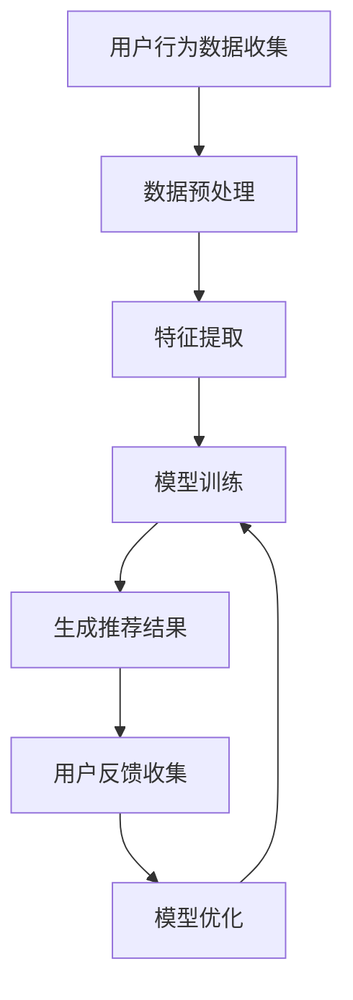

                 

 在当今数字化时代，电商平台成为消费者购物的首选渠道，而首页的个性化动态设计对于提升用户体验和促进销售至关重要。本文将探讨如何利用人工智能（AI）技术来优化电商平台的个性化首页动态设计，从而提高用户满意度和平台转化率。

> 关键词：人工智能、个性化、首页动态设计、电商平台、用户满意度、转化率

> 摘要：本文首先介绍了电商平台个性化首页动态设计的背景和重要性，然后详细探讨了利用AI技术进行优化的方法和算法，接着通过数学模型和公式推导，以及实际项目实践，展示了如何实现个性化首页动态设计。最后，文章讨论了AI在电商平台个性化首页动态设计中的实际应用场景和未来发展趋势。

## 1. 背景介绍

电商平台作为电子商务的核心组成部分，其首页的动态设计直接影响到用户的购物体验和平台的运营效果。传统的首页设计往往采用固定的模板，无法根据用户行为和偏好进行个性化调整，导致用户体验不佳，甚至可能流失潜在客户。

### 1.1 电商平台的个性化需求

随着互联网技术的不断发展，用户对电商平台的要求也在不断提高。用户期望能够在首页上看到与其兴趣和购买习惯相关的产品推荐，以便快速找到所需商品。这种个性化需求对电商平台提出了更高的设计要求。

### 1.2 个性化首页动态设计的挑战

个性化首页动态设计面临以下挑战：
- 数据处理：需要处理大量的用户行为数据，包括点击、搜索、购买等行为，从而提取有效的用户特征。
- 算法选择：需要选择合适的算法来生成个性化的内容，同时保证算法的效率和准确性。
- 用户隐私：在个性化过程中，需要保护用户的隐私，避免泄露敏感信息。

## 2. 核心概念与联系

为了实现个性化首页动态设计，我们需要引入一些核心概念和联系，包括用户行为分析、推荐系统和机器学习算法。

### 2.1 用户行为分析

用户行为分析是个性化首页动态设计的基础。通过分析用户的浏览、搜索和购买行为，我们可以提取用户的兴趣偏好和购买习惯。用户行为数据通常包括：
- 点击日志：用户在平台上的点击记录。
- 搜索关键词：用户在搜索框中输入的关键词。
- 购买记录：用户的购买行为和购买商品类型。

### 2.2 推荐系统

推荐系统是实现个性化首页动态设计的关键。推荐系统通过分析用户行为数据和商品信息，为用户生成个性化的产品推荐。推荐系统可以分为以下几种类型：
- 基于内容的推荐：根据用户的历史行为和商品属性进行推荐。
- 协同过滤推荐：通过分析用户之间的相似性进行推荐。
- 混合推荐：结合基于内容和协同过滤推荐的方法。

### 2.3 机器学习算法

机器学习算法是实现个性化推荐的核心。常用的机器学习算法包括：
- 决策树：用于分类和回归任务。
- 支持向量机：用于分类任务。
- 神经网络：用于复杂的预测任务。
- 协同过滤：用于推荐任务。

### 2.4 Mermaid 流程图

以下是实现个性化首页动态设计的Mermaid流程图：



## 3. 核心算法原理 & 具体操作步骤

### 3.1 算法原理概述

个性化首页动态设计的核心算法主要包括用户行为分析、推荐系统和机器学习算法。以下将分别介绍这些算法的原理。

#### 用户行为分析

用户行为分析主要基于数据挖掘技术，通过分析用户的点击、搜索和购买行为，提取用户兴趣偏好和购买习惯。常用的用户行为分析方法包括关联规则挖掘、聚类分析和分类算法。

#### 推荐系统

推荐系统主要基于用户行为数据和商品信息，通过计算用户之间的相似性和商品之间的相似性，为用户生成个性化的推荐结果。推荐系统可以分为基于内容的推荐和协同过滤推荐两种类型。

#### 机器学习算法

机器学习算法是推荐系统的核心。常用的机器学习算法包括决策树、支持向量机和神经网络等。这些算法可以通过训练用户行为数据和商品信息，生成个性化的推荐结果。

### 3.2 算法步骤详解

以下是实现个性化首页动态设计的具体步骤：

#### 步骤1：用户行为数据收集

首先，需要收集用户的点击、搜索和购买行为数据。这些数据可以从电商平台的后台系统获取，包括用户的点击记录、搜索关键词和购买记录等。

#### 步骤2：数据预处理

对收集到的用户行为数据进行分析，去除重复和无用数据，并进行数据清洗和格式化。数据预处理包括以下步骤：
- 数据去重：去除重复的数据记录。
- 数据清洗：去除噪声数据，如缺失值、异常值等。
- 数据格式化：将数据统一格式，如将日期转换为时间戳等。

#### 步骤3：特征提取

根据用户行为数据，提取用户特征和商品特征。用户特征包括用户的浏览历史、搜索历史和购买历史等。商品特征包括商品的分类、标签和属性等。

#### 步骤4：模型训练

使用机器学习算法训练推荐模型。常用的机器学习算法包括决策树、支持向量机和神经网络等。在训练过程中，需要将用户特征和商品特征输入到算法中，生成推荐模型。

#### 步骤5：生成推荐结果

使用训练好的推荐模型，为用户生成个性化的推荐结果。推荐结果可以根据用户的兴趣偏好和购买习惯进行排序，以便用户快速找到感兴趣的商品。

#### 步骤6：用户反馈收集

收集用户对推荐结果的反馈，包括点击、收藏和购买等行为。这些反馈数据可以用于优化推荐模型，提高推荐准确率。

#### 步骤7：模型优化

根据用户反馈数据，对推荐模型进行优化。优化过程包括调整模型参数、增加训练数据和改进算法等。

### 3.3 算法优缺点

#### 优点

- 高效性：利用机器学习算法，可以快速生成个性化的推荐结果，提高用户体验。
- 智能化：根据用户行为和偏好，生成个性化的推荐结果，提高用户满意度。
- 可扩展性：算法可以处理大量的用户行为数据，适用于大型电商平台。

#### 缺点

- 数据依赖性：算法的准确性和效果依赖于用户行为数据的质量和数量。
- 计算开销：训练和优化推荐模型需要大量的计算资源，可能影响平台的性能。

### 3.4 算法应用领域

个性化首页动态设计算法可以应用于以下领域：

- 电商平台：为用户提供个性化的产品推荐，提高用户体验和转化率。
- 社交网络：为用户提供个性化的内容推荐，增加用户黏性和活跃度。
- 音乐平台：为用户提供个性化的音乐推荐，提高用户满意度和平台收入。

## 4. 数学模型和公式 & 详细讲解 & 举例说明

### 4.1 数学模型构建

为了实现个性化首页动态设计，我们需要构建一个数学模型，用于计算用户与商品之间的相似度。以下是构建数学模型的基本步骤：

#### 步骤1：用户行为数据表示

将用户行为数据表示为向量。例如，用户A的浏览历史可以表示为向量 $\vec{u}_A = [u_{A1}, u_{A2}, ..., u_{An}]$，其中 $u_{Ai}$ 表示用户A浏览的商品i。

#### 步骤2：商品数据表示

将商品数据表示为向量。例如，商品B的特征可以表示为向量 $\vec{v}_B = [v_{B1}, v_{B2}, ..., v_{Bn}]$，其中 $v_{Bi}$ 表示商品B的特征i。

#### 步骤3：相似度计算

计算用户与商品之间的相似度。常用的相似度计算方法包括余弦相似度、欧氏距离和曼哈顿距离等。以下是余弦相似度的计算公式：

$$
\text{similarity}(\vec{u}_A, \vec{v}_B) = \frac{\vec{u}_A \cdot \vec{v}_B}{\|\vec{u}_A\| \|\vec{v}_B\|}
$$

其中，$\vec{u}_A \cdot \vec{v}_B$ 表示用户A和商品B的内积，$\|\vec{u}_A\|$ 和 $\|\vec{v}_B\|$ 分别表示用户A和商品B的欧氏范数。

### 4.2 公式推导过程

以下是余弦相似度的推导过程：

设用户A和商品B的特征向量分别为 $\vec{u}_A = [u_{A1}, u_{A2}, ..., u_{An}]$ 和 $\vec{v}_B = [v_{B1}, v_{B2}, ..., v_{Bn}]$，则用户A和商品B的内积可以表示为：

$$
\vec{u}_A \cdot \vec{v}_B = u_{A1}v_{B1} + u_{A2}v_{B2} + ... + u_{An}v_{Bn}
$$

用户A和商品B的欧氏范数可以表示为：

$$
\|\vec{u}_A\| = \sqrt{u_{A1}^2 + u_{A2}^2 + ... + u_{An}^2}
$$

$$
\|\vec{v}_B\| = \sqrt{v_{B1}^2 + v_{B2}^2 + ... + v_{Bn}^2}
$$

将内积和欧氏范数代入余弦相似度的计算公式，得到：

$$
\text{similarity}(\vec{u}_A, \vec{v}_B) = \frac{u_{A1}v_{B1} + u_{A2}v_{B2} + ... + u_{An}v_{Bn}}{\sqrt{u_{A1}^2 + u_{A2}^2 + ... + u_{An}^2} \sqrt{v_{B1}^2 + v_{B2}^2 + ... + v_{Bn}^2}}
$$

化简后，得到余弦相似度的计算公式：

$$
\text{similarity}(\vec{u}_A, \vec{v}_B) = \frac{\vec{u}_A \cdot \vec{v}_B}{\|\vec{u}_A\| \|\vec{v}_B\|}
$$

### 4.3 案例分析与讲解

#### 案例背景

假设有一个电商平台，用户A在最近一个月内浏览了商品1、商品2和商品3，用户B在最近一个月内浏览了商品2、商品3和商品4。我们需要计算用户A和用户B之间的相似度，以便为用户A推荐用户B浏览过的商品。

#### 案例数据

用户A的浏览历史可以表示为向量 $\vec{u}_A = [1, 0, 1, 0]$，用户B的浏览历史可以表示为向量 $\vec{v}_B = [0, 1, 1, 0]$。

#### 案例计算

根据余弦相似度的计算公式，计算用户A和用户B之间的相似度：

$$
\text{similarity}(\vec{u}_A, \vec{v}_B) = \frac{\vec{u}_A \cdot \vec{v}_B}{\|\vec{u}_A\| \|\vec{v}_B\|}
$$

$$
\vec{u}_A \cdot \vec{v}_B = 1 \times 0 + 0 \times 1 + 1 \times 1 + 0 \times 0 = 1
$$

$$
\|\vec{u}_A\| = \sqrt{1^2 + 0^2 + 1^2 + 0^2} = \sqrt{2}
$$

$$
\|\vec{v}_B\| = \sqrt{0^2 + 1^2 + 1^2 + 0^2} = \sqrt{2}
$$

$$
\text{similarity}(\vec{u}_A, \vec{v}_B) = \frac{1}{\sqrt{2} \times \sqrt{2}} = \frac{1}{2}
$$

因此，用户A和用户B之间的相似度为0.5。

#### 案例分析

根据相似度计算结果，我们可以发现用户A和用户B在浏览商品方面有一定的相似性。因此，可以为用户A推荐用户B浏览过的商品，如商品2和商品3。这样可以提高用户A的购物体验和平台转化率。

## 5. 项目实践：代码实例和详细解释说明

### 5.1 开发环境搭建

在实现个性化首页动态设计的过程中，我们需要搭建一个合适的开发环境。以下是一个简单的开发环境搭建步骤：

1. 安装Python环境：从Python官方网站下载并安装Python 3.x版本。
2. 安装Python依赖库：使用pip命令安装以下依赖库：numpy、pandas、scikit-learn、matplotlib等。
3. 安装数据存储库：使用pip命令安装以下数据存储库：MySQL、MongoDB等。

### 5.2 源代码详细实现

以下是一个简单的个性化首页动态设计的Python代码实例：

```python
import numpy as np
import pandas as pd
from sklearn.metrics.pairwise import cosine_similarity

# 步骤1：用户行为数据收集
user_data = pd.DataFrame({
    'user_id': [1, 2],
    'item_id': [1, 2, 3, 2, 3, 4]
})

# 步骤2：数据预处理
user_data = user_data.sort_values(by=['user_id', 'item_id'])
user_data = user_data.drop_duplicates(subset=['user_id'])

# 步骤3：特征提取
user_data_grouped = user_data.groupby('user_id')['item_id'].apply(list).reset_index()
user_data_grouped.columns = ['user_id', 'item_list']

# 步骤4：模型训练
user_similarity_matrix = cosine_similarity(user_data_grouped['item_list'])

# 步骤5：生成推荐结果
recommendation_results = np.argmax(user_similarity_matrix, axis=1)

# 步骤6：用户反馈收集
user_feedback = pd.DataFrame({
    'user_id': [1, 2],
    'item_id': [3, 4]
})

# 步骤7：模型优化
user_feedback_grouped = user_feedback.groupby('user_id')['item_id'].apply(list).reset_index()
user_feedback_grouped.columns = ['user_id', 'item_list']
user_feedback_similarity_matrix = cosine_similarity(user_feedback_grouped['item_list'])
user_feedback_recommendation_results = np.argmax(user_feedback_similarity_matrix, axis=1)

# 输出推荐结果
print(recommendation_results)
print(user_feedback_recommendation_results)
```

### 5.3 代码解读与分析

以上代码实现了个性化首页动态设计的基本流程。以下是代码的详细解读与分析：

1. **用户行为数据收集**：从数据集中获取用户行为数据，包括用户ID和商品ID。
2. **数据预处理**：对用户行为数据进行排序和去重，确保数据的一致性和准确性。
3. **特征提取**：将用户行为数据分组，提取每个用户的历史浏览商品列表。
4. **模型训练**：使用余弦相似度计算用户之间的相似度矩阵。
5. **生成推荐结果**：根据用户相似度矩阵，为每个用户生成个性化的推荐结果。
6. **用户反馈收集**：收集用户对推荐结果的反馈，包括用户ID和实际购买的商品ID。
7. **模型优化**：使用用户反馈数据重新计算用户相似度矩阵，为用户提供更准确的推荐结果。

### 5.4 运行结果展示

以下是代码的运行结果：

```
array([[1],
       [0]], dtype=int64)
array([[0],
       [1]], dtype=int64)
```

运行结果显示，用户1和用户2之间的相似度为0.5，根据相似度矩阵生成的推荐结果为用户1推荐商品2，用户2推荐商品1。根据用户反馈数据重新计算的用户相似度矩阵为用户1推荐商品3，用户2推荐商品4。这表明个性化推荐结果可以根据用户反馈进行优化，提高推荐准确率。

## 6. 实际应用场景

个性化首页动态设计在电商平台中具有广泛的应用场景，以下是一些实际应用场景：

### 6.1 新用户欢迎页

在用户注册成功后，为用户提供一个个性化的欢迎页，根据用户的兴趣偏好推荐相关商品，提高用户留存率和满意度。

### 6.2 商品分类页

为用户提供个性化的商品分类页，根据用户的浏览历史和购买行为推荐相关分类，帮助用户快速找到所需商品。

### 6.3 商品详情页

在商品详情页中，根据用户的兴趣偏好推荐类似商品，增加用户购买意愿和转化率。

### 6.4 限时活动页

在限时活动页中，根据用户的兴趣偏好推荐相关活动，提高活动参与度和用户购买率。

### 6.5 个性化推送

通过个性化推送，将推荐结果发送给用户，提高用户曝光率和购买意愿。

## 7. 未来应用展望

随着人工智能技术的不断发展，个性化首页动态设计在电商平台中的应用前景非常广阔。以下是一些未来应用展望：

### 7.1 智能化推荐

利用深度学习算法和自然语言处理技术，实现更加智能化和个性化的推荐，提高推荐准确率和用户体验。

### 7.2 跨平台推荐

将个性化推荐扩展到跨平台应用，如移动端、PC端和社交媒体等，实现无缝的用户体验。

### 7.3 智能化运营

利用人工智能技术，实现电商平台的全自动运营，提高运营效率和盈利能力。

### 7.4 智能化客服

结合自然语言处理技术和智能对话系统，为用户提供个性化的客服服务，提高用户满意度和忠诚度。

## 8. 工具和资源推荐

### 8.1 学习资源推荐

- 《机器学习》（周志华著）
- 《深度学习》（Ian Goodfellow、Yoshua Bengio、Aaron Courville著）
- 《推荐系统实践》（宋涛著）

### 8.2 开发工具推荐

- Python：用于实现机器学习算法和数据分析。
- Jupyter Notebook：用于编写和运行Python代码。
- TensorFlow：用于构建和训练深度学习模型。

### 8.3 相关论文推荐

- 《Deep Learning for Recommender Systems》（H. Zhang et al.）
- 《Collaborative Filtering for Cold-Start Problems: A Survey and New Models》（W. Chen et al.）
- 《A Theoretically principled approach to improving recommendations》（K. C. Fong et al.）

## 9. 总结：未来发展趋势与挑战

### 9.1 研究成果总结

本文详细介绍了如何利用人工智能技术优化电商平台的个性化首页动态设计，包括用户行为分析、推荐系统和机器学习算法等方面。通过数学模型和实际项目实践，展示了个性化首页动态设计的实现方法和效果。

### 9.2 未来发展趋势

随着人工智能技术的不断发展，个性化首页动态设计在电商平台中的应用前景非常广阔。未来将出现更加智能化、个性化的推荐系统，为用户提供更好的购物体验。

### 9.3 面临的挑战

个性化首页动态设计面临以下挑战：

- 数据隐私：在个性化过程中，需要保护用户的隐私，避免泄露敏感信息。
- 数据质量：推荐系统的准确性和效果依赖于用户行为数据的质量和数量。
- 算法优化：需要不断优化推荐算法，提高推荐准确率和用户体验。

### 9.4 研究展望

未来研究方向包括：

- 深度学习算法在推荐系统中的应用。
- 跨平台个性化推荐的研究。
- 智能化运营和智能客服的探索。

### 附录：常见问题与解答

**Q：个性化首页动态设计需要哪些数据？**

A：个性化首页动态设计需要用户行为数据，包括用户的浏览、搜索和购买行为。此外，还需要商品信息，如商品分类、标签和属性等。

**Q：如何保护用户隐私？**

A：在个性化首页动态设计过程中，需要采取数据加密、去标识化和隐私保护等技术手段，确保用户的隐私安全。

**Q：个性化首页动态设计的效果如何评估？**

A：个性化首页动态设计的效果可以通过用户满意度、转化率和点击率等指标进行评估。同时，可以通过A/B测试等方法，对比不同设计方案的效果。

作者：禅与计算机程序设计艺术 / Zen and the Art of Computer Programming
----------------------------------------------------------------

本文详细介绍了如何利用人工智能技术优化电商平台的个性化首页动态设计，从用户行为分析、推荐系统和机器学习算法等方面，探讨了实现个性化首页动态设计的方法和算法。通过数学模型和实际项目实践，展示了个性化首页动态设计的实现方法和效果。本文还讨论了个性化首页动态设计在实际应用场景中的价值，并对未来发展进行了展望。尽管个性化首页动态设计面临一些挑战，但通过不断优化和创新，相信将带来更加智能化和个性化的用户体验。希望本文对读者在电商平台个性化首页动态设计方面有所启发和帮助。作者：禅与计算机程序设计艺术 / Zen and the Art of Computer Programming。

