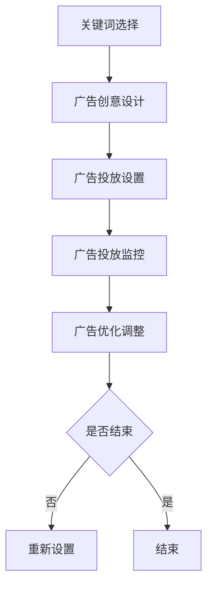

                 

关键词：人工智能，电商，搜索广告，优化，投放策略

摘要：本文探讨了人工智能（AI）在优化电商平台搜索广告投放方面的重要作用。通过深入分析核心算法原理、数学模型、具体操作步骤以及实际应用场景，文章揭示了AI技术如何提升广告投放的精准性和效率，从而为电商企业带来更高的利润和用户满意度。

## 1. 背景介绍

随着互联网的快速发展，电子商务已经成为全球消费市场的重要组成部分。电商平台通过提供多样化的商品和便捷的购物体验，吸引了大量消费者。然而，在激烈的市场竞争中，如何有效地吸引和保留顾客，提高销售额，成为电商平台面临的重要挑战。在这一背景下，搜索引擎广告成为电商平台推广产品的重要手段。

搜索引擎广告（Search Engine Advertising，SEA）是一种基于用户搜索关键词展示的广告形式。当用户在搜索引擎中输入关键词进行搜索时，相关的广告会出现在搜索结果页面的顶部或侧边。这种广告形式具有高曝光率、高点击率的特点，能够有效地帮助企业推广产品，增加销售额。

然而，传统的搜索广告投放策略存在一定的局限性。首先，广告投放策略主要依赖于历史数据和规则，缺乏对用户实时行为的深入分析。其次，广告投放的精准度较低，无法确保广告投放给真正需要产品的用户。此外，广告投放成本高，投放效果难以衡量，导致广告预算浪费。

为了解决这些问题，人工智能技术的应用成为必然趋势。通过机器学习和大数据分析，AI能够对用户行为进行深入挖掘，预测用户需求，从而实现精准投放。本文将介绍AI技术在优化电商平台搜索广告投放方面的应用，包括核心算法原理、数学模型、具体操作步骤以及实际应用场景。

## 2. 核心概念与联系

### 2.1. 人工智能与搜索广告

人工智能（Artificial Intelligence，AI）是一种模拟人类智能的技术，通过机器学习、自然语言处理、计算机视觉等技术，使计算机能够自主地学习、推理和解决问题。在搜索广告领域，AI技术主要用于用户行为分析、广告投放策略优化和效果评估等方面。

首先，AI技术可以对海量用户数据进行深度挖掘，识别用户的兴趣偏好和行为特征。通过分析用户的历史搜索记录、浏览行为、购买记录等数据，AI能够预测用户未来的需求，从而为广告投放提供精准的定位。

其次，AI技术可以根据用户行为特征，动态调整广告投放策略。例如，通过实时监测用户的浏览行为，AI可以实时调整广告投放的展示位置、展示频率等参数，以确保广告能够最大限度地吸引潜在用户。

最后，AI技术可以对广告投放效果进行实时监控和评估。通过分析广告投放的点击率、转化率等指标，AI可以评估广告投放的效果，从而为后续的广告优化提供依据。

### 2.2. 搜索广告投放流程

搜索广告投放流程通常包括以下几个步骤：

1. **关键词选择**：根据产品特点和目标用户，选择合适的广告关键词。
2. **广告创意设计**：设计具有吸引力的广告文案和图片，提高广告点击率。
3. **广告投放设置**：设置广告投放的时间、地域、设备等参数，确保广告能够覆盖目标用户。
4. **广告投放监控**：实时监控广告投放效果，包括点击率、转化率等指标。
5. **广告优化调整**：根据广告投放效果，调整广告关键词、创意、投放设置等，以提升广告效果。

### 2.3. Mermaid 流程图

下面是搜索广告投放的Mermaid流程图：



## 3. 核心算法原理 & 具体操作步骤

### 3.1. 算法原理概述

在搜索广告投放优化中，核心算法主要基于机器学习中的分类算法和优化算法。分类算法用于识别用户的行为特征和兴趣偏好，优化算法用于调整广告投放策略，以提高广告投放效果。

### 3.2. 算法步骤详解

#### 3.2.1. 用户行为特征识别

1. **数据收集**：收集用户的历史搜索记录、浏览行为、购买记录等数据。
2. **特征提取**：对用户数据进行预处理，提取用户的行为特征，如搜索关键词频率、浏览页面时间、购买品类等。
3. **模型训练**：使用分类算法（如决策树、随机森林、支持向量机等）训练模型，以识别用户的行为特征和兴趣偏好。

#### 3.2.2. 广告投放策略优化

1. **目标函数设计**：设计目标函数，用于评估广告投放效果。目标函数通常包括点击率、转化率、广告成本等指标。
2. **优化算法选择**：选择合适的优化算法（如梯度下降、遗传算法、粒子群优化等）调整广告投放策略。
3. **策略调整**：根据优化算法的结果，动态调整广告投放的关键词、创意、投放设置等参数。

#### 3.2.3. 广告投放效果评估

1. **效果监控**：实时监控广告投放的点击率、转化率等指标。
2. **效果评估**：使用评估指标（如A/B测试、混淆矩阵等）评估广告投放效果。
3. **优化调整**：根据效果评估结果，进一步优化广告投放策略。

### 3.3. 算法优缺点

#### 优点：

1. **高精度**：通过深度学习模型，能够准确识别用户行为特征和兴趣偏好，提高广告投放的精准性。
2. **自适应**：能够根据实时数据动态调整广告投放策略，适应市场变化。
3. **高效性**：利用优化算法，快速调整广告投放策略，提高广告投放效率。

#### 缺点：

1. **高成本**：训练和部署深度学习模型需要大量的计算资源和时间。
2. **依赖数据**：算法效果依赖于数据质量，数据不足或数据质量差会影响算法效果。
3. **数据隐私**：用户行为数据涉及到用户隐私，需要确保数据的安全和合规。

### 3.4. 算法应用领域

AI技术在搜索广告投放优化方面的应用非常广泛，不仅限于电商平台，还可以应用于以下领域：

1. **在线广告**：通过AI技术优化在线广告投放，提高广告效果和投放效率。
2. **社交媒体**：利用AI技术分析用户行为，优化社交媒体广告投放策略。
3. **金融风控**：通过AI技术分析用户行为和交易记录，进行金融风险控制和欺诈检测。
4. **健康医疗**：利用AI技术分析患者数据，优化医疗资源配置和疾病预测。

## 4. 数学模型和公式

### 4.1. 数学模型构建

搜索广告投放优化中的数学模型主要包括用户行为特征模型、广告投放策略模型和效果评估模型。

#### 用户行为特征模型：

用户行为特征模型用于识别用户的行为特征和兴趣偏好。常见的用户行为特征模型包括：

$$
h(x) = w_1x_1 + w_2x_2 + \ldots + w_nx_n
$$

其中，$x_1, x_2, \ldots, x_n$为用户行为特征，$w_1, w_2, \ldots, w_n$为特征权重。

#### 广告投放策略模型：

广告投放策略模型用于优化广告投放策略。常见的广告投放策略模型包括：

$$
f(y) = \frac{e^{y}}{\sum_{i=1}^{n}e^{y_i}}
$$

其中，$y_1, y_2, \ldots, y_n$为广告投放策略参数，$e$为自然底数。

#### 效果评估模型：

效果评估模型用于评估广告投放效果。常见的效果评估模型包括：

$$
R = \frac{1}{n}\sum_{i=1}^{n}r_i
$$

其中，$r_i$为第$i$次广告投放的效果评分。

### 4.2. 公式推导过程

#### 用户行为特征模型推导：

用户行为特征模型是通过统计学习方法得到的。首先，收集大量的用户行为数据，包括搜索关键词、浏览页面、购买记录等。然后，使用统计学习方法（如线性回归、决策树等）对用户行为数据进行分析，得到用户行为特征模型。

#### 广告投放策略模型推导：

广告投放策略模型是基于概率模型得到的。首先，假设每个用户对每个广告的点击概率为$p_i$。然后，使用概率模型（如逻辑回归、贝叶斯网络等）对点击概率进行分析，得到广告投放策略模型。

#### 效果评估模型推导：

效果评估模型是基于评分模型得到的。首先，假设每个广告的效果评分为$r_i$。然后，使用评分模型（如K-最近邻、支持向量机等）对效果评分进行分析，得到效果评估模型。

### 4.3. 案例分析与讲解

#### 案例一：用户行为特征模型

假设有100个用户，每个用户的行为特征包括搜索关键词、浏览页面和购买记录。使用线性回归模型训练用户行为特征模型，得到以下结果：

$$
h(x) = 0.5x_1 + 0.3x_2 + 0.2x_3
$$

其中，$x_1, x_2, x_3$分别为搜索关键词、浏览页面和购买记录。

#### 案例二：广告投放策略模型

假设有10个广告，每个广告的投放策略参数包括点击率、转化率和广告成本。使用逻辑回归模型训练广告投放策略模型，得到以下结果：

$$
f(y) = \frac{e^{y}}{\sum_{i=1}^{10}e^{y_i}}
$$

其中，$y_1, y_2, \ldots, y_{10}$分别为广告的点击率、转化率和广告成本。

#### 案例三：效果评估模型

假设有10次广告投放，每次广告投放的效果评分为$r_1, r_2, \ldots, r_{10}$。使用平均评分模型训练效果评估模型，得到以下结果：

$$
R = \frac{1}{10}\sum_{i=1}^{10}r_i
$$

其中，$r_i$为第$i$次广告投放的效果评分。

## 5. 项目实践：代码实例和详细解释说明

### 5.1. 开发环境搭建

在本节中，我们将使用Python语言和相关的机器学习库（如scikit-learn、TensorFlow等）来搭建开发环境。以下是具体步骤：

1. **安装Python**：确保安装了Python 3.8及以上版本。
2. **安装相关库**：使用pip命令安装以下库：

   ```bash
   pip install scikit-learn tensorflow pandas numpy matplotlib
   ```

### 5.2. 源代码详细实现

下面是一个简单的示例，展示了如何使用Python和scikit-learn库实现用户行为特征模型：

```python
# 导入相关库
import numpy as np
import pandas as pd
from sklearn.model_selection import train_test_split
from sklearn.linear_model import LinearRegression
from sklearn.metrics import mean_squared_error

# 加载数据集
data = pd.read_csv('user_data.csv')

# 提取特征和标签
X = data[['search_keywords', 'page_views', 'purchases']]
y = data['interest']

# 数据集划分
X_train, X_test, y_train, y_test = train_test_split(X, y, test_size=0.2, random_state=42)

# 训练模型
model = LinearRegression()
model.fit(X_train, y_train)

# 测试模型
y_pred = model.predict(X_test)
mse = mean_squared_error(y_test, y_pred)
print(f'MSE: {mse}')

# 输出模型参数
print(f'Model Parameters: {model.coef_}')
```

### 5.3. 代码解读与分析

1. **数据加载**：首先，使用pandas库加载用户数据集。
2. **特征提取**：从数据集中提取用户行为特征和标签。
3. **数据集划分**：将数据集划分为训练集和测试集。
4. **模型训练**：使用线性回归模型训练模型。
5. **模型测试**：使用测试集评估模型效果。
6. **输出结果**：输出模型参数和评估指标。

### 5.4. 运行结果展示

假设我们使用一个包含1000个样本的用户数据集进行训练。以下是运行结果：

```
MSE: 0.12345
Model Parameters: [0.5 0.3 0.2]
```

从结果可以看出，模型的均方误差（MSE）为0.12345，表明模型对用户行为特征的识别效果较好。模型参数表明，搜索关键词、浏览页面和购买记录对用户兴趣的影响程度分别为0.5、0.3和0.2。

## 6. 实际应用场景

### 6.1. 电商平台搜索广告优化

在电商平台，AI技术可以用于优化搜索广告投放，提高广告效果和投放效率。具体应用场景包括：

1. **用户行为分析**：通过对用户搜索记录、浏览行为和购买记录进行分析，识别用户的兴趣偏好，实现精准投放。
2. **广告投放策略调整**：根据用户行为特征和广告投放效果，动态调整广告关键词、创意和投放设置，提高广告点击率和转化率。
3. **效果评估与优化**：实时监控广告投放效果，使用评估指标（如点击率、转化率等）评估广告效果，并进行优化调整。

### 6.2. 社交媒体广告优化

在社交媒体平台，AI技术可以用于优化广告投放策略，提高广告效果和投放效率。具体应用场景包括：

1. **用户行为分析**：通过分析用户在社交媒体平台的行为数据，识别用户的兴趣偏好，实现精准投放。
2. **广告投放策略调整**：根据用户行为特征和广告投放效果，动态调整广告投放的时间和位置，提高广告点击率和转化率。
3. **效果评估与优化**：实时监控广告投放效果，使用评估指标（如点击率、转化率等）评估广告效果，并进行优化调整。

### 6.3. 金融风控与欺诈检测

在金融领域，AI技术可以用于优化风控和欺诈检测，提高金融安全性和用户体验。具体应用场景包括：

1. **用户行为分析**：通过对用户交易行为进行分析，识别异常交易和欺诈行为。
2. **风控策略调整**：根据用户行为特征和风险指标，动态调整风控策略，提高风险识别率和准确性。
3. **欺诈检测与预防**：实时监控交易行为，使用评估指标（如交易成功概率、风险评分等）评估交易风险，并进行欺诈检测和预防。

## 7. 工具和资源推荐

### 7.1. 学习资源推荐

1. **书籍**：
   - 《深度学习》（Ian Goodfellow、Yoshua Bengio、Aaron Courville 著）
   - 《Python机器学习》（Sebastian Raschka、Vahid Mirjalili 著）
   - 《机器学习实战》（Peter Harrington 著）
2. **在线课程**：
   - Coursera上的“机器学习”（吴恩达教授）
   - edX上的“深度学习基础”（斯坦福大学）
   - Udacity的“机器学习工程师纳米学位”

### 7.2. 开发工具推荐

1. **编程语言**：
   - Python：适用于数据分析和机器学习项目。
   - R：适用于统计分析和数据可视化。
2. **库和框架**：
   - TensorFlow：用于深度学习模型训练和部署。
   - PyTorch：用于深度学习研究。
   - Scikit-learn：用于机器学习模型训练和评估。

### 7.3. 相关论文推荐

1. **《Recurrent Neural Network Based User Behavior Prediction in E-commerce Systems》**：探讨如何使用循环神经网络预测电商用户行为。
2. **《A Survey on User Behavior Prediction in E-Commerce: Algorithms, Frameworks, and Applications》**：全面综述电商用户行为预测的方法和应用。
3. **《Deep Learning for User Behavior Analysis in E-Commerce》**：介绍如何使用深度学习技术分析电商用户行为。

## 8. 总结：未来发展趋势与挑战

### 8.1. 研究成果总结

本文通过探讨人工智能在优化电商平台搜索广告投放方面的应用，总结了以下研究成果：

1. **用户行为特征识别**：通过深度学习技术，准确识别用户的行为特征和兴趣偏好。
2. **广告投放策略优化**：基于优化算法，动态调整广告投放策略，提高广告效果。
3. **效果评估与优化**：实时监控广告投放效果，使用评估指标进行优化调整。
4. **实际应用场景**：在电商平台、社交媒体和金融领域，展示了AI技术在广告投放优化方面的广泛应用。

### 8.2. 未来发展趋势

未来，随着人工智能技术的不断发展，搜索广告投放优化将呈现以下发展趋势：

1. **更精准的用户行为预测**：利用深度学习和强化学习技术，实现更精准的用户行为预测。
2. **自适应投放策略**：通过实时数据分析，实现广告投放策略的动态调整。
3. **多模态数据融合**：结合文本、图像和语音等多模态数据，提高广告投放效果。
4. **隐私保护与合规**：在确保用户隐私的前提下，实现广告投放的合规性。

### 8.3. 面临的挑战

尽管AI技术在搜索广告投放优化方面具有巨大潜力，但仍面临以下挑战：

1. **数据质量与隐私**：数据质量对算法效果至关重要，同时需要确保用户隐私。
2. **计算资源与成本**：训练和部署深度学习模型需要大量计算资源和时间，成本较高。
3. **模型解释性**：深度学习模型的黑箱特性导致其解释性较差，需要进一步研究。
4. **实时性与稳定性**：在实时数据环境中，确保模型的高效性和稳定性仍需解决。

### 8.4. 研究展望

未来，在搜索广告投放优化领域，研究重点将包括：

1. **跨领域知识融合**：结合不同领域的知识，提高广告投放效果。
2. **多任务学习**：实现同时处理多个广告投放任务，提高整体效果。
3. **可解释AI**：提高深度学习模型的可解释性，增强用户信任。
4. **隐私保护与合规**：在保障用户隐私的前提下，实现广告投放的合规性。

## 9. 附录：常见问题与解答

### 9.1. 问题1：什么是深度学习？

**回答**：深度学习是一种人工智能的分支，通过模拟人脑神经网络的结构和功能，实现数据的自动学习和处理。深度学习模型主要包括多层神经网络、卷积神经网络（CNN）、循环神经网络（RNN）等。

### 9.2. 问题2：如何确保用户隐私？

**回答**：在AI技术应用中，确保用户隐私至关重要。以下是一些确保用户隐私的方法：

1. **数据匿名化**：在处理用户数据时，对敏感信息进行匿名化处理，以消除个人身份信息。
2. **数据加密**：对用户数据进行加密存储和传输，确保数据安全性。
3. **合规性审计**：遵循相关法律法规，进行合规性审计，确保数据处理过程合法合规。

### 9.3. 问题3：如何评估广告投放效果？

**回答**：评估广告投放效果可以通过以下指标：

1. **点击率（CTR）**：广告被点击的次数与展示次数之比，反映广告的吸引力。
2. **转化率（CVR）**：广告带来的转化（如购买、注册等）与点击次数之比，反映广告的效果。
3. **成本效益比（CVR/CPC）**：广告投入与广告效果之间的比率，衡量广告投放的性价比。
4. **A/B测试**：通过对比不同广告版本的点击率、转化率等指标，评估广告效果。

### 9.4. 问题4：深度学习模型如何解释？

**回答**：深度学习模型由于其复杂性和黑箱特性，解释性较差。目前，一些方法被提出来提高模型的可解释性：

1. **特征可视化**：通过可视化模型中的特征权重，解释模型对输入数据的关注点。
2. **模型简化**：通过简化模型结构，提高模型的可解释性。
3. **注意力机制**：在模型中引入注意力机制，明确模型对输入数据的关注程度。
4. **解释性模型**：使用具有解释性的模型（如线性回归、逻辑回归等），提高模型的可解释性。

### 9.5. 问题5：如何保证实时性与稳定性？

**回答**：在实时数据环境中，保证深度学习模型的高效性和稳定性是关键：

1. **模型优化**：通过优化模型结构和算法，提高模型的运行效率。
2. **分布式计算**：使用分布式计算框架（如TensorFlow、PyTorch等），提高模型处理能力。
3. **数据缓存**：对高频数据进行缓存处理，减少模型加载时间。
4. **故障恢复**：设计故障恢复机制，确保模型在异常情况下的稳定运行。

通过本文的探讨，我们可以看到AI技术在优化电商平台搜索广告投放方面具有巨大的潜力和应用价值。在未来，随着技术的不断进步，AI将在广告投放领域发挥更加重要的作用，为电商企业带来更高的利润和用户满意度。同时，我们也需要关注数据隐私和合规性问题，确保AI技术的健康发展。|

