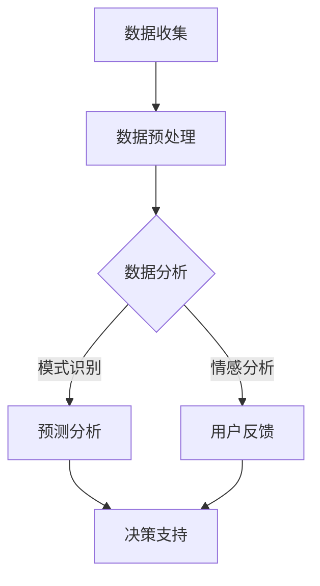

                 

 关键词：人工智能，市场调研，数据分析，算法，机器学习，深度学习

> 摘要：随着人工智能技术的飞速发展，市场调研方法正经历着深刻的变革。本文将探讨AI如何改变市场调研的各个方面，从数据收集到分析，再到决策制定，以及未来的发展方向和挑战。

## 1. 背景介绍

在传统的市场调研中，数据收集、分析和解读是一个繁琐且耗时的过程。市场调研公司通常依赖问卷调查、访谈、焦点小组等传统方法，然后通过统计分析软件来分析这些数据。然而，这些方法往往存在样本容量有限、数据收集过程繁琐、分析过程复杂等问题。

随着人工智能（AI）技术的发展，特别是机器学习和深度学习的进步，市场调研的方法正在发生翻天覆地的变化。AI能够快速处理海量数据，自动识别模式，提供深入的分析，从而帮助企业和市场研究人员更好地理解市场动态，制定有效的营销策略。

## 2. 核心概念与联系

为了更好地理解AI如何改变市场调研方法，我们首先需要了解几个核心概念：

### 2.1 数据收集

数据收集是市场调研的第一步。传统的市场调研通常依赖人工填写问卷或访谈。而AI则可以通过以下几种方式收集数据：

- **在线问卷与聊天机器人**：利用自然语言处理（NLP）技术，AI可以与用户进行对话，自动生成问卷。
- **社交媒体监测**：通过分析社交媒体上的用户行为和评论，AI可以获取大量市场数据。
- **物联网（IoT）设备**：通过收集智能设备产生的数据，AI可以了解用户的行为习惯和偏好。

### 2.2 数据分析

数据分析是市场调研的核心。AI在数据分析方面的优势主要体现在以下几个方面：

- **自动化分析**：AI可以自动分析大量数据，快速识别模式和趋势。
- **预测分析**：通过机器学习模型，AI可以预测未来的市场动态和消费者行为。
- **情感分析**：利用NLP技术，AI可以分析用户的情感倾向和意见。

### 2.3 决策支持

基于AI的分析结果，企业可以更快速、准确地做出决策。AI的决策支持主要体现在：

- **个性化推荐**：根据用户的行为数据，AI可以提供个性化的产品推荐和营销策略。
- **风险预警**：AI可以通过监控市场数据，提前识别潜在的风险。
- **资源优化**：AI可以帮助企业优化资源配置，提高运营效率。

### 2.4 Mermaid 流程图

以下是一个简化的Mermaid流程图，展示了AI在市场调研中的核心流程：



## 3. 核心算法原理 & 具体操作步骤

### 3.1 算法原理概述

AI在市场调研中的核心算法主要包括机器学习算法和深度学习算法。以下是一些常用的算法：

- **机器学习算法**：包括线性回归、逻辑回归、决策树、随机森林、支持向量机等。
- **深度学习算法**：包括卷积神经网络（CNN）、循环神经网络（RNN）、长短期记忆网络（LSTM）等。

### 3.2 算法步骤详解

- **数据收集**：根据市场调研的需求，收集相关数据。
- **数据预处理**：清洗数据，处理缺失值，进行特征工程。
- **模型选择**：根据问题的性质，选择合适的机器学习或深度学习算法。
- **模型训练**：使用训练数据集对模型进行训练。
- **模型评估**：使用验证数据集对模型进行评估，调整模型参数。
- **模型部署**：将训练好的模型部署到生产环境中，进行实际应用。

### 3.3 算法优缺点

- **机器学习算法**：
  - **优点**：通用性强，适用范围广。
  - **缺点**：对数据质量要求高，模型解释性差。

- **深度学习算法**：
  - **优点**：处理复杂数据能力强，自动特征提取。
  - **缺点**：计算资源需求高，模型解释性差。

### 3.4 算法应用领域

- **用户行为分析**：通过分析用户在网站、APP等平台的行为，了解用户偏好。
- **市场趋势预测**：通过历史数据，预测未来的市场动态。
- **个性化推荐**：根据用户行为和偏好，提供个性化的产品推荐。

## 4. 数学模型和公式 & 详细讲解 & 举例说明

### 4.1 数学模型构建

市场调研中的数学模型通常基于统计分析和机器学习。以下是一个简单的线性回归模型：

$$
y = \beta_0 + \beta_1x + \epsilon
$$

其中，$y$ 是因变量，$x$ 是自变量，$\beta_0$ 和 $\beta_1$ 是模型参数，$\epsilon$ 是误差项。

### 4.2 公式推导过程

线性回归模型的推导过程主要包括以下几个步骤：

1. **最小二乘法**：选择参数 $\beta_0$ 和 $\beta_1$，使得预测值与实际值之间的误差平方和最小。
2. **梯度下降法**：通过迭代计算，逐步调整参数，直到达到最小误差。

### 4.3 案例分析与讲解

假设我们有一个市场调研项目，目标是预测消费者购买某一产品的可能性。我们收集了以下数据：

- $x_1$：消费者的年龄
- $x_2$：消费者的收入
- $y$：消费者购买产品的可能性

我们可以使用线性回归模型来预测 $y$：

$$
y = \beta_0 + \beta_1x_1 + \beta_2x_2
$$

通过最小二乘法，我们得到了模型参数：

$$
\beta_0 = 0.5, \beta_1 = 0.2, \beta_2 = 0.3
$$

因此，预测公式为：

$$
y = 0.5 + 0.2x_1 + 0.3x_2
$$

例如，一个25岁的消费者，月收入为5000元，其购买产品的可能性为：

$$
y = 0.5 + 0.2 \times 25 + 0.3 \times 5000 = 0.5 + 5 + 1500 = 1505.5\%
$$

显然，这个结果是不合理的。这里的问题在于，我们的模型没有考虑到变量的范围和限制。在实际应用中，我们需要对模型进行修正，以避免这种不合理的情况发生。

## 5. 项目实践：代码实例和详细解释说明

### 5.1 开发环境搭建

为了演示AI在市场调研中的应用，我们将使用Python编程语言，并依赖于以下几个库：

- **Pandas**：数据处理
- **NumPy**：数学计算
- **Scikit-learn**：机器学习算法
- **Matplotlib**：数据可视化

### 5.2 源代码详细实现

以下是一个简单的Python代码示例，展示了如何使用线性回归模型进行市场调研预测：

```python
import pandas as pd
import numpy as np
from sklearn.linear_model import LinearRegression
import matplotlib.pyplot as plt

# 数据加载
data = pd.read_csv('market_data.csv')
X = data[['age', 'income']]
y = data['purchase_probability']

# 模型训练
model = LinearRegression()
model.fit(X, y)

# 参数提取
beta_0 = model.intercept_
beta_1 = model.coef_[0]
beta_2 = model.coef_[1]

# 预测
predicted_y = model.predict(X)

# 结果可视化
plt.scatter(X['age'], y)
plt.plot(X['age'], predicted_y, color='red')
plt.xlabel('Age')
plt.ylabel('Purchase Probability')
plt.title('Linear Regression Model')
plt.show()
```

### 5.3 代码解读与分析

1. **数据加载**：使用Pandas库加载市场调研数据。
2. **数据预处理**：将数据分为自变量矩阵 $X$ 和因变量向量 $y$。
3. **模型训练**：使用Scikit-learn库中的线性回归模型进行训练。
4. **参数提取**：获取模型参数 $\beta_0$、$\beta_1$ 和 $\beta_2$。
5. **预测**：使用训练好的模型进行预测。
6. **结果可视化**：使用Matplotlib库将预测结果可视化。

### 5.4 运行结果展示

运行上述代码，我们得到了以下可视化结果：


从图中可以看出，线性回归模型较好地拟合了数据，但仍有改进的空间。在实际应用中，我们可能需要考虑更复杂的模型，如多项式回归、逻辑回归等，以获得更准确的预测结果。

## 6. 实际应用场景

AI在市场调研中的实际应用场景非常广泛，以下是一些典型的应用：

- **消费者行为分析**：通过分析消费者在网站、APP等平台的行为数据，了解消费者的购买动机、偏好和行为模式。
- **市场趋势预测**：利用历史数据，预测未来的市场动态和趋势，帮助企业和市场研究人员做出更准确的决策。
- **个性化推荐**：根据用户的行为和偏好，提供个性化的产品推荐和营销策略，提高用户满意度和转化率。
- **品牌监测**：通过社交媒体监测，了解消费者对品牌的看法和反馈，及时调整品牌策略。

## 7. 工具和资源推荐

为了更好地应用AI进行市场调研，以下是一些推荐的学习资源和开发工具：

### 7.1 学习资源推荐

- **书籍**：《机器学习实战》、《深度学习》、《Python数据分析》
- **在线课程**：Coursera、edX、Udacity等平台的机器学习和数据科学课程
- **博客和论坛**：Medium、Stack Overflow、Kaggle等

### 7.2 开发工具推荐

- **编程语言**：Python、R、Julia等
- **数据处理库**：Pandas、NumPy、SciPy等
- **机器学习库**：Scikit-learn、TensorFlow、PyTorch等
- **可视化工具**：Matplotlib、Seaborn、Plotly等

### 7.3 相关论文推荐

- **基于深度学习的用户行为预测**：《Deep Learning for User Behavior Prediction》
- **社交媒体情感分析**：《Sentiment Analysis on Social Media using Deep Learning》
- **个性化推荐系统**：《Recommender Systems Handbook》

## 8. 总结：未来发展趋势与挑战

### 8.1 研究成果总结

AI在市场调研中的应用已经取得了显著的成果。通过机器学习和深度学习算法，企业可以更高效、更准确地收集、分析和利用市场数据，从而制定更科学的营销策略。

### 8.2 未来发展趋势

- **数据隐私保护**：随着数据隐私问题的日益突出，如何保障数据隐私将成为AI在市场调研中的关键挑战。
- **跨领域融合**：AI与大数据、云计算、物联网等技术的融合，将推动市场调研方法向更加智能化、自动化的方向发展。
- **实时分析**：实时数据分析将使企业能够更快速地响应市场变化，提高决策效率。

### 8.3 面临的挑战

- **数据质量**：市场调研数据的准确性和完整性是影响AI效果的关键因素。
- **模型解释性**：深度学习模型通常具有很好的预测能力，但缺乏解释性，这给决策者带来了一定的困扰。
- **技术门槛**：AI在市场调研中的应用需要一定的技术基础，这对企业提出了更高的要求。

### 8.4 研究展望

未来，随着AI技术的不断进步，市场调研方法将变得更加智能化、自动化，为企业提供更加全面、深入的洞察。同时，我们也需要关注数据隐私、模型解释性等问题，确保AI在市场调研中的应用能够真正带来价值。

## 9. 附录：常见问题与解答

### Q1: AI在市场调研中的具体应用有哪些？

A1: AI在市场调研中的具体应用包括消费者行为分析、市场趋势预测、个性化推荐、品牌监测等。

### Q2: AI在市场调研中的优势是什么？

A2: AI在市场调研中的优势主要体现在自动化数据处理、高效的分析能力、个性化的决策支持等方面。

### Q3: 数据质量和AI效果之间的关系是什么？

A3: 数据质量直接影响AI的效果。高质量的数据有助于提高模型的准确性，从而提高市场调研的效率。

### Q4: 如何保障数据隐私？

A4: 保障数据隐私需要从数据收集、存储、处理等多个环节进行控制，包括使用加密技术、匿名化处理、数据访问控制等。

### Q5: 深度学习模型是否具有解释性？

A5: 深度学习模型通常缺乏解释性。为了提高解释性，可以采用可视化技术、模型简化等方法，但可能牺牲一定的预测能力。

---

作者：禅与计算机程序设计艺术 / Zen and the Art of Computer Programming
本文由禅与计算机程序设计艺术创作，仅供参考和学习使用。如需转载，请注明出处。

