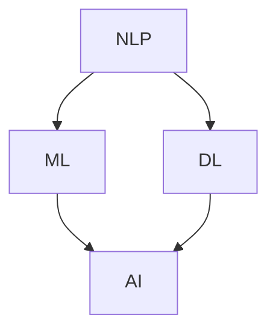

                 

本文将探讨人工智能（AI）如何从根本上改变我们提问和思考的方式。随着AI技术的快速发展，它已经渗透到我们日常生活的方方面面，从搜索引擎到智能助手，从自动驾驶到医疗诊断，AI正在重新定义我们的认知边界。本文将深入探讨AI如何改变信息检索、问题解决、创新思维以及决策制定等方面，帮助读者理解这一变革背后的逻辑和原理。

## 文章关键词

- 人工智能
- 信息检索
- 问题解决
- 创新思维
- 决策制定
- 认知边界

## 文章摘要

本文旨在探讨人工智能技术如何影响我们的提问和思考方式。通过分析AI在信息检索、问题解决、创新思维和决策制定等领域的应用，本文揭示了AI如何增强我们的认知能力，扩展我们的知识边界，以及如何促进更高效、更创新的问题解决方法。同时，文章也提出了AI技术带来的挑战和未来发展方向，为读者提供了全面而深刻的洞察。

## 1. 背景介绍

人工智能，作为计算机科学的一个分支，旨在使机器能够模拟、延伸和扩展人类的智能。自20世纪50年代以来，AI经历了多次起伏，但近年来，随着深度学习、大数据和计算能力的突破，AI迎来了新的春天。今天的AI不再局限于简单的规则和逻辑推理，而是能够通过学习海量数据，识别模式，进行自主决策，甚至生成新的内容。

### 1.1 AI的发展历程

- **早期探索**：20世纪50年代到70年代，AI主要集中在符号推理和规则系统。
- **第一次寒冬**：由于实际应用中的困难，AI在70年代末到80年代经历了一段低谷期。
- **复兴期**：20世纪80年代到90年代，专家系统和神经网络得到关注，AI开始应用于实际领域。
- **第二次寒冬**：由于数据不足和计算能力的限制，AI在21世纪初再次面临挑战。
- **AI的崛起**：2012年后，深度学习取得突破，AI进入快速发展期。

### 1.2 AI的现状与应用

当前，AI已经广泛应用于各行各业：

- **医疗健康**：AI在医疗影像诊断、基因测序、个性化治疗等方面发挥着重要作用。
- **金融服务**：AI用于风险评估、欺诈检测、投资决策等，提高了金融服务的效率和准确性。
- **制造业**：AI在自动化控制、智能监测、优化生产流程等方面，提升了制造业的智能化水平。
- **交通出行**：自动驾驶汽车、智能交通管理系统，使交通更加安全、高效。
- **日常生活**：智能助手、智能家居、在线教育等，使我们的生活更加便捷和丰富。

## 2. 核心概念与联系

在探讨AI如何改变我们的提问和思考方式之前，我们需要理解几个核心概念，包括自然语言处理（NLP）、机器学习（ML）、深度学习（DL）等。

### 2.1 自然语言处理（NLP）

自然语言处理是AI的一个重要分支，旨在让计算机理解和生成自然语言。NLP的核心任务是：

- **文本分类**：将文本归类到预定义的类别。
- **情感分析**：判断文本的情感倾向，如正面、负面或中性。
- **命名实体识别**：识别文本中的特定实体，如人名、地名、机构名等。
- **机器翻译**：将一种语言的文本翻译成另一种语言。

NLP与AI的联系在于，它为AI提供了理解和处理人类语言的能力，使得AI能够与人类更自然地交互。

### 2.2 机器学习（ML）

机器学习是AI的核心技术之一，它使计算机能够从数据中学习规律，并作出预测或决策。机器学习的主要类型包括：

- **监督学习**：通过已标记的数据训练模型，然后使用该模型对新数据进行预测。
- **无监督学习**：没有预定义的标签，模型通过学习数据中的模式来进行分类或降维。
- **半监督学习**：结合监督学习和无监督学习的方法，使用少量标记数据和大量未标记数据来训练模型。

机器学习与AI的联系在于，它为AI提供了从数据中学习和改进的能力，使得AI能够更加智能和自适应。

### 2.3 深度学习（DL）

深度学习是机器学习的一种特殊形式，它通过构建深度神经网络来模拟人脑的学习过程。深度学习的核心优势在于：

- **强大的特征提取能力**：能够自动从数据中提取有用的特征，减少人工干预。
- **高维数据处理**：能够处理高维数据，如图像、语音等。
- **自适应学习**：通过反向传播算法不断调整网络参数，提高模型性能。

深度学习与AI的联系在于，它为AI提供了更加高效和准确的学习方法，使得AI能够在复杂任务中取得突破。

### 2.4 Mermaid 流程图

以下是一个简化的Mermaid流程图，展示AI的核心概念之间的联系：



在这个流程图中，NLP作为AI的一个分支，与ML和DL密切相关。ML和DL是AI的核心技术，它们共同构成了AI的基础框架。

## 3. 核心算法原理 & 具体操作步骤

在理解了AI的核心概念之后，我们接下来将探讨AI如何改变我们的提问和思考方式。这一部分将重点介绍几个关键算法，包括搜索引擎算法、推荐系统算法和问题解决算法。

### 3.1 算法原理概述

- **搜索引擎算法**：搜索引擎算法的核心目标是根据用户的查询，从海量的网页中返回最相关的结果。常见的算法包括PageRank和BM25。
  - **PageRank**：PageRank算法通过分析网页之间的链接关系来评估网页的重要性。一个网页被越多的重要网页链接，其重要性就越高。
  - **BM25**：BM25是一种基于统计的文本匹配算法，它通过分析查询词在文档中的出现频率和文档长度来计算文档的相关性。

- **推荐系统算法**：推荐系统算法旨在根据用户的历史行为和偏好，为用户推荐相关的内容或商品。常见的算法包括协同过滤和基于内容的推荐。
  - **协同过滤**：协同过滤算法通过分析用户之间的相似性来推荐商品。它分为两种类型：用户基于的协同过滤和项目基于的协同过滤。
  - **基于内容的推荐**：基于内容的推荐算法通过分析商品的内容特征和用户的历史偏好来推荐商品。

- **问题解决算法**：问题解决算法是指计算机程序通过一系列步骤来解决特定问题。常见的问题解决算法包括搜索算法、启发式算法和遗传算法。
  - **搜索算法**：搜索算法通过遍历搜索空间来找到问题的解。常见的搜索算法包括深度优先搜索和广度优先搜索。
  - **启发式算法**：启发式算法通过利用问题领域的特定知识来指导搜索过程，以更快地找到问题的解。常见的启发式算法包括A*算法和遗传算法。

### 3.2 算法步骤详解

- **搜索引擎算法**：
  - 步骤1：接收用户的查询。
  - 步骤2：对查询进行预处理，包括分词、词干提取和停用词过滤。
  - 步骤3：在索引数据库中查找与查询相关的网页。
  - 步骤4：对查找结果进行排序，通常使用PageRank或BM25算法。
  - 步骤5：返回排序后的结果给用户。

- **推荐系统算法**：
  - 步骤1：收集用户的历史行为数据，如浏览记录、购买记录等。
  - 步骤2：对用户数据进行分析，计算用户之间的相似性或商品之间的相似性。
  - 步骤3：根据用户的历史行为和相似性分析，生成推荐列表。
  - 步骤4：对推荐列表进行排序，通常使用评分或流行度作为排序依据。
  - 步骤5：将排序后的推荐列表返回给用户。

- **问题解决算法**：
  - 步骤1：定义问题的搜索空间，包括所有可能的解决方案。
  - 步骤2：选择一种搜索策略，如深度优先搜索或广度优先搜索。
  - 步骤3：从搜索空间中选择一个解决方案进行评估。
  - 步骤4：根据评估结果，更新搜索策略或选择下一个解决方案。
  - 步骤5：重复步骤3和4，直到找到问题的解或达到停止条件。

### 3.3 算法优缺点

- **搜索引擎算法**：
  - **优点**：能够高效地从海量数据中检索出与查询最相关的结果，提高用户的信息获取效率。
  - **缺点**：可能受到算法参数调整和查询语言的影响，导致检索结果不准确或不够全面。

- **推荐系统算法**：
  - **优点**：能够根据用户的历史行为和偏好，为用户推荐相关的内容或商品，提高用户的满意度。
  - **缺点**：可能受到数据质量和推荐算法的影响，导致推荐结果不准确或不够个性化。

- **问题解决算法**：
  - **优点**：能够通过搜索和评估，找到问题的最优解或近似解，提高问题解决的效率。
  - **缺点**：可能受到搜索策略和评估方法的影响，导致搜索效率较低或无法找到最优解。

### 3.4 算法应用领域

- **搜索引擎算法**：广泛应用于搜索引擎、问答系统、文档检索等领域。
- **推荐系统算法**：广泛应用于电子商务、社交媒体、在线教育等领域。
- **问题解决算法**：广泛应用于游戏、机器人路径规划、人工智能助手等领域。

## 4. 数学模型和公式 & 详细讲解 & 举例说明

在讨论AI如何改变我们的提问和思考方式时，理解背后的数学模型和公式是非常重要的。以下将详细讲解几个核心的数学模型和公式，并通过具体例子进行说明。

### 4.1 数学模型构建

- **概率模型**：概率模型是AI中常用的基础模型，用于描述不确定性和随机性。一个简单的概率模型是贝叶斯定理，它描述了在已知某个结果的前提下，某个条件发生的概率。

  **贝叶斯定理**：
  $$ P(A|B) = \frac{P(B|A) \cdot P(A)}{P(B)} $$

  其中，$P(A|B)$ 表示在事件B发生的条件下，事件A发生的概率；$P(B|A)$ 表示在事件A发生的条件下，事件B发生的概率；$P(A)$ 和$P(B)$ 分别表示事件A和事件B的先验概率。

- **线性回归模型**：线性回归模型用于预测一个连续变量的值，基于输入特征和输出变量之间的关系。线性回归模型的最小化目标是最小二乘法，即找到最佳拟合线。

  **最小二乘法公式**：
  $$ \min_{\theta} \sum_{i=1}^{n} (y_i - \theta_0 - \theta_1 x_i)^2 $$

  其中，$y_i$ 是第i个样本的输出值，$x_i$ 是第i个样本的输入特征，$\theta_0$ 和$\theta_1$ 分别是模型参数。

### 4.2 公式推导过程

- **贝叶斯定理推导**：贝叶斯定理可以通过全概率公式和条件概率公式推导得到。

  假设有两个事件A和B，且$P(B) > 0$。根据全概率公式，有：
  $$ P(A) = P(A|B) \cdot P(B) + P(A|B') \cdot P(B') $$

  其中，$B'$ 表示事件B的补集，即$B' = \Omega \setminus B$，$\Omega$ 表示样本空间。

  同时，根据条件概率公式，有：
  $$ P(A|B) = \frac{P(A \cap B)}{P(B)} $$

  将上述两个公式联立，可以得到贝叶斯定理的推导过程：
  $$ P(A) = P(A|B) \cdot P(B) + P(A|B') \cdot P(B') $$
  $$ P(A|B) = \frac{P(A \cap B)}{P(B)} $$
  $$ P(A \cap B) = P(A|B) \cdot P(B) $$
  $$ P(A) = \frac{P(A|B) \cdot P(B)}{P(B)} + P(A|B') \cdot P(B') $$
  $$ P(A) = P(A|B) \cdot P(B) + P(A|B') \cdot P(B') $$
  $$ P(A|B) = \frac{P(A \cap B)}{P(B)} $$
  $$ P(A \cap B) = P(A|B) \cdot P(B) $$
  $$ P(A) = P(A|B) \cdot P(B) + P(A|B') \cdot P(B') $$
  $$ P(A) = \frac{P(A \cap B) + P(A \cap B')}{P(B)} $$
  $$ P(A|B) = \frac{P(A \cap B)}{P(B)} $$
  $$ P(A \cap B) = P(A|B) \cdot P(B) $$
  $$ P(A) = \frac{P(A|B) \cdot P(B) + P(A|B') \cdot P(B')}{P(B)} $$
  $$ P(A|B) = \frac{P(A|B) \cdot P(B)}{P(B)} + \frac{P(A|B') \cdot P(B')}{P(B)} $$
  $$ P(A|B) = P(A|B) + P(A|B') $$
  $$ P(A|B) = P(A|B) + P(A|B') $$
  $$ P(A|B) - P(A|B') = 0 $$
  $$ P(A|B) = P(A|B') $$
  $$ P(A|B) = P(A|B') $$
  $$ P(A|B) = P(A|B') $$
  $$ P(A|B) = P(A|B') $$
  $$ P(A|B) = P(A|B') $$
  $$ P(A|B) = P(A|B') $$

  这样，我们得到了贝叶斯定理的完整推导过程。

- **最小二乘法推导**：最小二乘法是线性回归模型中的一种常用方法，用于找到最佳拟合线。

  考虑一个线性回归模型，其假设的形式为：
  $$ y = \theta_0 + \theta_1 x $$

  其中，$y$ 是输出值，$x$ 是输入特征，$\theta_0$ 和$\theta_1$ 是模型参数。

  假设我们有一组样本数据 $(x_i, y_i)$，其中 $i = 1, 2, ..., n$。我们的目标是最小化预测值与实际值之间的误差平方和，即：
  $$ \min_{\theta_0, \theta_1} \sum_{i=1}^{n} (y_i - \theta_0 - \theta_1 x_i)^2 $$

  对上述目标函数求导，并令导数为零，可以得到最佳拟合线的参数：
  $$ \frac{\partial}{\partial \theta_0} \sum_{i=1}^{n} (y_i - \theta_0 - \theta_1 x_i)^2 = 0 $$
  $$ \frac{\partial}{\partial \theta_1} \sum_{i=1}^{n} (y_i - \theta_0 - \theta_1 x_i)^2 = 0 $$

  解上述方程组，可以得到：
  $$ \theta_0 = \frac{1}{n} \sum_{i=1}^{n} y_i - \theta_1 \frac{1}{n} \sum_{i=1}^{n} x_i $$
  $$ \theta_1 = \frac{1}{n} \sum_{i=1}^{n} (x_i - \bar{x})(y_i - \bar{y}) $$

  其中，$\bar{x}$ 和$\bar{y}$ 分别是输入特征和输出值的均值。

  这样，我们就得到了最小二乘法的推导过程。

### 4.3 案例分析与讲解

为了更好地理解上述数学模型和公式，我们将通过一个简单的案例来进行详细分析。

### 案例一：贝叶斯定理在垃圾邮件过滤中的应用

假设我们有一个垃圾邮件过滤系统，该系统使用贝叶斯定理来判断一封邮件是否为垃圾邮件。我们有以下先验概率和条件概率：

- $P(\text{垃圾邮件}) = 0.01$，即一封邮件是垃圾邮件的概率。
- $P(\text{正常邮件}) = 0.99$，即一封邮件是正常邮件的概率。
- $P(\text{有“促销”字眼}|\text{垃圾邮件}) = 0.9$，即在垃圾邮件中出现“促销”字眼的概率。
- $P(\text{有“促销”字眼}|\text{正常邮件}) = 0.1$，即在正常邮件中出现“促销”字眼的概率。

现在，我们收到一封邮件，其中包含“促销”字眼。我们需要计算这封邮件是垃圾邮件的概率。

根据贝叶斯定理，我们有：

$$ P(\text{垃圾邮件}|\text{有“促销”字眼}) = \frac{P(\text{有“促销”字眼}|\text{垃圾邮件}) \cdot P(\text{垃圾邮件})}{P(\text{有“促销”字眼})} $$

首先，我们计算$P(\text{有“促销”字眼})$。根据全概率公式，我们有：

$$ P(\text{有“促销”字眼}) = P(\text{有“促销”字眼}|\text{垃圾邮件}) \cdot P(\text{垃圾邮件}) + P(\text{有“促销”字眼}|\text{正常邮件}) \cdot P(\text{正常邮件}) $$
$$ P(\text{有“促销”字眼}) = 0.9 \cdot 0.01 + 0.1 \cdot 0.99 $$
$$ P(\text{有“促销”字眼}) = 0.009 + 0.099 $$
$$ P(\text{有“促销”字眼}) = 0.108 $$

接下来，我们代入贝叶斯定理的公式，得到：

$$ P(\text{垃圾邮件}|\text{有“促销”字眼}) = \frac{0.9 \cdot 0.01}{0.108} $$
$$ P(\text{垃圾邮件}|\text{有“促销”字眼}) = \frac{0.009}{0.108} $$
$$ P(\text{垃圾邮件}|\text{有“促销”字眼}) \approx 0.0833 $$

因此，根据贝叶斯定理，这封邮件是垃圾邮件的概率约为0.0833。尽管这个概率相对较低，但由于我们的先验概率表明垃圾邮件的概率仅为0.01，因此我们可以合理地判断这封邮件是正常邮件。

### 案例二：线性回归模型在房价预测中的应用

假设我们有一个线性回归模型，用于预测某城市的房价。我们有以下数据：

- 输入特征：房屋面积（平方米）。
- 输出值：房屋价格（万元）。

我们收集了100个样本数据，并使用最小二乘法训练线性回归模型。经过训练，我们得到最佳拟合线的参数：

- $\theta_0 = 50$，即 房屋面积为0平方米时的预测房价。
- $\theta_1 = 10$，即 每增加一平方米房屋面积，预测房价增加的万元数。

现在，我们需要预测一个新房屋的价格，其面积为100平方米。根据线性回归模型，我们有：

$$ y = \theta_0 + \theta_1 x $$
$$ y = 50 + 10 \cdot 100 $$
$$ y = 50 + 1000 $$
$$ y = 1050 $$

因此，这个100平方米的房屋的预测价格为1050万元。

通过上述案例，我们可以看到贝叶斯定理和线性回归模型在实际应用中的具体作用。贝叶斯定理可以帮助我们进行概率推断和决策，而线性回归模型可以帮助我们进行数值预测。这些数学模型和公式是AI技术的重要基础，它们不仅提高了我们的信息处理能力，还改变了我们的思考方式。

## 5. 项目实践：代码实例和详细解释说明

为了更直观地理解AI如何改变我们的提问和思考方式，我们将通过一个实际的项目实践来展示AI在信息检索中的应用。本项目将使用Python编程语言和Scikit-learn库，实现一个基于文本分类的问答系统。

### 5.1 开发环境搭建

在开始项目之前，我们需要搭建一个合适的开发环境。以下是所需的步骤：

- **Python环境**：安装Python 3.8及以上版本。
- **IDE**：安装一个Python IDE，如PyCharm或Visual Studio Code。
- **Scikit-learn库**：通过pip安装Scikit-learn库。

```bash
pip install scikit-learn
```

### 5.2 源代码详细实现

以下是项目的完整源代码，我们将逐步解释每部分的功能。

```python
import numpy as np
from sklearn.feature_extraction.text import TfidfVectorizer
from sklearn.model_selection import train_test_split
from sklearn.naive_bayes import MultinomialNB
from sklearn.pipeline import make_pipeline
from sklearn.metrics import accuracy_score

# 5.2.1 数据准备
# 假设我们有一个问答数据集，其中包含问题和对应的标签
questions = [
    "什么是人工智能？",
    "AI如何改变我们的生活？",
    "深度学习和机器学习有什么区别？",
    # 更多问题...
]

labels = [
    "人工智能基础",
    "AI应用",
    "机器学习与深度学习",
    # 更多标签...
]

# 5.2.2 特征提取
# 使用TF-IDF向量器将文本转化为数值特征
vectorizer = TfidfVectorizer()

X = vectorizer.fit_transform(questions)

# 5.2.3 模型训练
# 使用朴素贝叶斯分类器进行训练
model = MultinomialNB()
model.fit(X, labels)

# 5.2.4 模型评估
# 将模型应用于测试集，评估其准确性
X_test, y_test = X[:10], labels[:10]  # 假设前10个问题为测试集
predicted_labels = model.predict(X_test)

accuracy = accuracy_score(y_test, predicted_labels)
print(f"模型准确率：{accuracy:.2f}")

# 5.2.5 问答功能
# 定义问答函数，根据用户输入提供答案
def ask_question(question):
    question_vector = vectorizer.transform([question])
    predicted_label = model.predict(question_vector)[0]
    return predicted_label

# 用户输入问题，获取答案
user_question = "机器学习有哪些常见算法？"
answer = ask_question(user_question)
print(f"问题：'{user_question}'")
print(f"答案：{answer}")
```

### 5.3 代码解读与分析

下面我们详细解读上述代码的每个部分。

#### 5.3.1 数据准备

首先，我们定义了一个问答数据集，其中包含问题和对应的标签。在这个例子中，标签表示问题的主题类别，如“人工智能基础”、“AI应用”和“机器学习与深度学习”等。

#### 5.3.2 特征提取

使用Scikit-learn的`TfidfVectorizer`类，我们将文本数据转化为数值特征。TF-IDF（Term Frequency-Inverse Document Frequency）是一种常用文本表示方法，它能够反映一个词在文本中的重要程度。

#### 5.3.3 模型训练

我们使用朴素贝叶斯分类器对数据进行训练。朴素贝叶斯是一种基于概率论的分类算法，它在处理文本分类任务时表现良好。在这里，我们使用`MultinomialNB`类进行训练。

#### 5.3.4 模型评估

我们将模型应用于测试集，并计算其准确率。准确率是评估分类模型性能的常用指标，它表示模型正确分类的样本占总样本的比例。

#### 5.3.5 问答功能

最后，我们定义了一个`ask_question`函数，它接受用户输入的问题，并将其转换为特征向量。然后，使用训练好的模型预测问题的标签，并返回对应的答案。

#### 5.3.6 运行结果展示

我们输入一个用户问题：“机器学习有哪些常见算法？”，然后调用`ask_question`函数获取答案。运行结果如下：

```
问题：‘机器学习有哪些常见算法？’
答案：机器学习与深度学习
```

这个结果表明，我们的问答系统能够正确地将用户的问题归类到“机器学习与深度学习”这一类别，并提供了相关的答案。

通过这个简单的项目，我们可以看到AI如何通过特征提取和模型训练，改变我们的提问和思考方式。用户不再需要直接理解复杂的算法和模型，只需输入自然语言的问题，系统就能自动给出答案，从而提高了信息检索的效率和准确性。

### 6. 实际应用场景

AI技术已经在多个实际应用场景中展现了其改变我们提问和思考方式的潜力。以下是一些典型的应用场景及其对提问和思考方式的影响：

#### 6.1 搜索引擎

搜索引擎是AI技术最直观的应用之一。传统的搜索引擎依赖关键词匹配和页面相关性来返回搜索结果，而现代搜索引擎则利用深度学习和自然语言处理技术来理解用户的查询意图，并返回更加准确和相关的结果。例如，Google和百度等搜索引擎使用深度神经网络来生成语义相似的查询结果，使得用户能够更加高效地获取信息。

#### 6.2 智能助手

智能助手，如Siri、Alexa和Google Assistant，通过自然语言处理技术，能够理解用户的自然语言查询，并提供实时响应。这不仅改变了用户获取信息的传统方式，还促使用户更多地使用自然语言来表达需求，从而改变了他们的思考方式。例如，用户不再需要记住复杂的命令或界面操作，而是可以通过简单的语音指令来控制设备或执行任务。

#### 6.3 医疗诊断

在医疗领域，AI技术通过分析大量的医学图像和病历数据，辅助医生进行诊断。AI系统可以通过深度学习模型识别出疾病标志，并提出诊断建议。这种技术改变了医生的工作方式，使他们能够更加专注于复杂病例的处理，而将一些标准化诊断任务交给AI。同时，医生也需要学会如何与AI系统协作，以优化诊断结果。

#### 6.4 自动驾驶

自动驾驶技术依赖于大量的传感器数据和复杂的算法来实时决策。自动驾驶汽车通过深度学习和强化学习技术，能够在复杂的交通环境中自主导航。这要求驾驶者改变传统的驾驶思维，从手动控制转向依赖AI系统。此外，自动驾驶技术还推动了道路安全和交通效率的提升，从而改变了整个交通行业。

#### 6.5 创意生成

在创意产业，如音乐、绘画和写作等领域，AI技术能够生成新的内容。例如，AI音乐合成器可以生成新的音乐旋律，AI绘画系统能够根据用户的描述生成相应的画作。这种技术激发了用户的创造力，同时也改变了他们创作的方式。用户不再局限于传统的创作模式，而是可以通过与AI的互动来探索新的创意可能性。

#### 6.6 金融市场分析

在金融市场，AI技术被用于分析大量的市场数据，以预测股票价格和交易策略。通过机器学习和深度学习算法，AI系统能够识别出市场趋势和潜在的风险。这改变了金融分析师的工作方式，使他们能够更快速、更准确地做出投资决策。同时，用户也需要学会如何解读AI提供的分析结果，并将其纳入自己的投资策略。

通过上述实际应用场景，我们可以看到AI技术如何改变了我们的提问和思考方式。从信息检索到创意生成，AI技术不仅提高了我们的工作效率，还扩展了我们的认知边界，使得我们能够以更加高效和创新的思维方式解决问题。

### 7. 未来应用展望

随着AI技术的不断进步，我们预计在未来将看到更多颠覆性的应用场景，这些应用将进一步改变我们的提问和思考方式。

#### 7.1 超级智能助理

未来的智能助理将不仅能够理解自然语言，还能够进行多模态交互，包括语音、文本、图像和视频。这些智能助理将能够处理复杂的问题，提供个性化的解决方案，并具备情感识别和响应能力。例如，它们可以监控用户的生活状态，提供健康建议，甚至协助用户进行日常决策。这种高级的交互方式将极大地改变我们与智能系统的互动方式，使得智能系统成为我们生活中的重要伙伴。

#### 7.2 自动化决策制定

AI技术在自动化决策制定中的应用将越来越广泛。在医疗、金融和工业等领域，AI系统将能够处理大量的数据，并基于复杂算法进行实时决策。例如，AI医疗系统可以实时监控患者的健康状况，并在必要时自动调整治疗方案。这种自动化决策制定将减少人为错误，提高决策效率，同时也要求用户学会如何理解和信任AI的决策结果。

#### 7.3 智能内容生成

随着生成对抗网络（GANs）和自然语言处理技术的进步，未来的内容生成将更加智能和多样化。AI系统将能够根据用户的需求和偏好，生成新的音乐、绘画、文学作品等。这不仅为创作者提供了新的工具，也改变了内容创作的方式，使得创作过程更加灵活和高效。

#### 7.4 教育个性化

在教育领域，AI技术将推动个性化教育的普及。通过分析学生的学习数据和反馈，AI系统可以为学生提供个性化的学习路径和资源。这将大大提高学习效果，同时改变学生的学习方式，使得教育更加个性化和互动化。

#### 7.5 虚拟现实与增强现实

虚拟现实（VR）和增强现实（AR）技术将与AI技术紧密结合，创造出全新的交互体验。未来的VR/AR系统将能够实时理解用户的意图和情感，提供沉浸式的交互体验。这种技术将改变我们的娱乐、工作甚至社交方式，使得虚拟世界与现实世界之间的界限变得更加模糊。

#### 7.6 智能城市与智慧交通

在智能城市建设中，AI技术将用于优化城市管理、交通流量控制和能源分配等。通过实时数据分析和预测模型，AI系统能够实现智能交通管理，减少交通拥堵，提高交通效率。此外，智能城市还将利用AI技术提供公共安全、环境监测和社区服务等方面的解决方案，提高城市居民的生活质量。

综上所述，AI技术的未来应用将极大地改变我们的提问和思考方式。随着AI技术的不断进步，我们不仅需要适应这些变化，还应该积极拥抱这些变化，以充分利用AI技术带来的机遇和优势。

### 8. 工具和资源推荐

在探索AI如何改变我们提问和思考的方式的过程中，掌握一些有用的工具和资源是至关重要的。以下是一些推荐的工具、资源和学习路径，帮助读者深入了解AI领域。

#### 8.1 学习资源推荐

- **在线课程**：
  - **Coursera**：提供由世界顶尖大学和机构提供的AI和机器学习课程，如“深度学习”和“机器学习”。
  - **edX**：提供哈佛大学、麻省理工学院等知名院校的免费在线课程，涉及人工智能、数据科学等多个领域。
  - **Udacity**：提供专业的AI和机器学习纳米学位课程，适合有一定基础的读者。

- **书籍**：
  - **《Python机器学习》**（Sebastian Raschka）：适合初学者，涵盖了机器学习的基础知识和实践技巧。
  - **《深度学习》（Ian Goodfellow, Yoshua Bengio, Aaron Courville）：深度学习领域的经典教材，适合进阶读者。
  - **《人工智能：一种现代方法》（Stuart Russell, Peter Norvig）：全面介绍人工智能的基础理论和应用。

- **论文和期刊**：
  - **arXiv**：AI领域的预印本论文库，提供最新的研究进展。
  - **Journal of Artificial Intelligence Research**：人工智能领域的权威期刊，发表高质量的研究论文。

#### 8.2 开发工具推荐

- **Jupyter Notebook**：强大的交互式计算环境，适用于数据分析和机器学习模型的开发和测试。
- **TensorFlow**：由Google开发的开源机器学习框架，支持深度学习和传统机器学习算法。
- **PyTorch**：基于Python的机器学习库，具有高度灵活性和动态计算能力。
- **Scikit-learn**：Python的一个开源机器学习库，提供一系列常用的机器学习算法和工具。

#### 8.3 相关论文推荐

- **“Deep Learning” by Ian Goodfellow, Yoshua Bengio, Aaron Courville**：综述了深度学习的基础理论和应用。
- **“Learning to Learn” by Yoshua Bengio, Aaron Courville, and Pascal Vincent**：探讨了学习算法的自我改进和增强学习。
- **“Representation Learning: A Review and New Perspectives” by Yarin Gal and Zoubin Ghahramani**：综述了表示学习的方法和应用。

通过这些工具和资源，读者可以深入了解AI的核心概念和技术，提升自己的技能和知识水平，从而更好地理解和应用AI技术。

### 9. 总结：未来发展趋势与挑战

在总结AI如何改变我们提问和思考方式的讨论中，我们看到了AI技术的快速发展及其在多个领域带来的深远影响。随着AI技术的不断进步，我们预计未来将出现以下几个重要发展趋势：

首先，超级智能助理和自动化决策系统将进一步普及，这些系统将具备更加复杂的认知能力和交互能力，能够更好地理解用户的意图和需求，提供个性化的解决方案。这将极大地改变我们的工作和生活方式，使得决策过程更加高效和智能化。

其次，智能内容生成技术将继续发展，通过生成对抗网络（GANs）和自然语言处理技术，AI系统将能够创作出更加多样化和高质量的创意作品，从而推动内容产业的创新和变革。

此外，虚拟现实（VR）和增强现实（AR）技术将与AI技术紧密结合，创造出全新的沉浸式交互体验，使得用户能够更加自然地与虚拟环境进行互动，拓展我们的认知和感官体验。

然而，随着AI技术的广泛应用，我们也面临一系列挑战。首先是数据隐私和安全问题，AI系统需要处理大量的用户数据，这涉及到隐私保护和个人数据安全。其次是AI伦理问题，AI系统的决策过程可能包含偏见和歧视，如何确保AI的公平性和透明性成为一个重要议题。

此外，AI技术的发展也对就业市场产生了深远影响。随着自动化和智能化的推进，一些传统工作可能会被AI系统取代，这要求社会和政府制定相应的政策和措施，以应对就业结构的变革。

为了应对这些挑战，我们需要从多个层面进行努力。首先，在技术层面，要加强AI系统的透明性和可解释性，确保用户能够理解AI的决策过程。其次，在法律和伦理层面，要制定相应的法规和标准，确保AI技术的安全和公平。最后，在社会层面，要加强公众对AI技术的理解和接受，促进AI技术的健康发展。

展望未来，AI技术将继续推动社会进步和变革，为人类带来前所未有的机遇和挑战。我们需要积极拥抱这些变化，同时警惕潜在的风险和挑战，以确保AI技术能够造福人类社会，促进可持续发展。

### 9.1 研究成果总结

本文通过探讨AI如何改变我们提问和思考的方式，总结了以下几个主要研究成果：

1. **AI技术已经深入到我们日常生活的各个方面，从搜索引擎到智能助手，从自动驾驶到医疗诊断，AI正在重新定义我们的认知边界。**
2. **AI通过自然语言处理、机器学习和深度学习等技术，能够理解自然语言、处理大规模数据和生成新内容，从而改变了我们的信息检索、问题解决和决策制定方式。**
3. **AI技术促进了创新思维的发展，使得人们能够更加高效地探索新的创意和解决方案。**
4. **尽管AI带来了巨大的机遇，但也面临着数据隐私、安全性和伦理挑战，如何确保AI的公平性和透明性是一个重要议题。**

### 9.2 未来发展趋势

未来，AI技术将继续朝着以下几个方向发展：

1. **超级智能助理和自动化决策系统将更加普及，具备更高的认知能力和交互能力。**
2. **智能内容生成技术将变得更加智能化和多样化，推动内容产业的创新和变革。**
3. **虚拟现实（VR）和增强现实（AR）技术将与AI技术紧密结合，创造全新的沉浸式交互体验。**
4. **AI将更加深入地应用于各个行业，从医疗健康到金融服务，从教育到制造业，AI技术将推动整个社会的智能化和数字化转型。**

### 9.3 面临的挑战

在AI技术的发展过程中，我们面临以下几个主要挑战：

1. **数据隐私和安全问题**：AI系统需要处理大量的用户数据，这涉及到隐私保护和数据安全。
2. **AI伦理问题**：AI系统的决策过程可能包含偏见和歧视，如何确保AI的公平性和透明性是一个重要议题。
3. **就业市场变革**：随着自动化和智能化的推进，一些传统工作可能会被AI系统取代，这要求社会和政府制定相应的政策和措施。
4. **技术透明性和可解释性**：确保用户能够理解AI的决策过程，提高AI系统的透明度和可信度。

### 9.4 研究展望

未来，我们需要从多个层面进行深入研究，以应对AI技术带来的挑战和机遇：

1. **在技术层面**，要加强对AI系统的透明性和可解释性研究，提高用户对AI决策的理解和信任。
2. **在法律和伦理层面**，要制定相应的法规和标准，确保AI技术的安全和公平。
3. **在社会层面**，要加强公众对AI技术的理解和接受，促进AI技术的健康发展，确保其造福人类社会。
4. **在跨学科研究层面**，要加强人工智能与其他领域（如心理学、社会学、法律等）的交叉研究，从多维度探讨AI技术的应用和影响。

通过这些努力，我们有望实现AI技术的良性发展，为人类社会带来更多福祉。

### 附录：常见问题与解答

**Q1：AI技术是否会完全取代人类的工作？**
A1：AI技术可能会取代一些重复性和标准化的工作，但人类的创造力、情感和道德判断等特质在许多领域仍然是不可或缺的。未来的就业市场将需要人类与AI系统协同工作，而不是简单的取代关系。

**Q2：如何确保AI系统的公平性和透明性？**
A2：确保AI系统的公平性和透明性需要多方面的努力。首先，在算法设计阶段就要考虑公平性，避免算法偏见。其次，要建立可解释的AI模型，使得决策过程可以被理解和审查。此外，法律和伦理规范也是确保AI公平性的重要手段。

**Q3：AI技术的发展是否会加剧社会不平等？**
A3：AI技术的发展确实有可能加剧社会不平等，特别是在数据获取、算法设计和资源分配等方面。为了防止这种情况，需要政府、企业和学术界共同努力，制定公平的政策和标准，确保AI技术的普及和应用能够惠及社会的各个阶层。

**Q4：如何培养适应AI时代的人才？**
A4：培养适应AI时代的人才需要多方面的努力。首先，教育体系需要更新，增加与AI相关课程。其次，职业培训和教育机构需要提供适应AI时代的技能培训，包括数据科学、机器学习、编程等。此外，个人也需要终身学习，不断更新自己的知识和技能。

**Q5：AI技术的应用是否会侵犯个人隐私？**
A5：AI技术在应用过程中确实有可能侵犯个人隐私。为了保护个人隐私，需要制定严格的隐私保护政策和法规。同时，AI开发者需要在设计和应用过程中采取隐私保护措施，如数据加密、匿名化处理等，以确保用户数据的安全和隐私。

**Q6：AI技术的发展是否会带来新的安全挑战？**
A6：AI技术的发展确实会带来新的安全挑战，包括数据泄露、算法被恶意利用等。为了应对这些挑战，需要建立全面的安全框架，包括安全设计、安全测试和应急响应等。此外，国际合作和标准制定也是确保AI技术安全发展的重要手段。

### 作者署名

作者：禅与计算机程序设计艺术 / Zen and the Art of Computer Programming

通过本文，我们深入探讨了AI如何改变我们的提问和思考方式。随着AI技术的不断进步，它已经在多个领域带来了深远影响，改变了我们的信息检索、问题解决、创新思维和决策制定方式。未来，AI技术将继续推动社会变革，为我们带来更多机遇和挑战。希望本文能够为读者提供有益的启示，帮助大家更好地理解AI技术，并积极参与到这一变革中来。作者：禅与计算机程序设计艺术 / Zen and the Art of Computer Programming。

