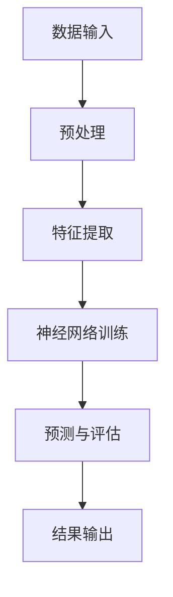

                 

关键词：人工智能、信息获取、数据处理、智能算法、未来展望、技术进步

> 摘要：本文将深入探讨人工智能如何改变我们获取和处理信息的方式。通过分析人工智能的核心技术，我们能够更好地理解它如何影响我们的日常生活、工作以及未来社会的信息流动。

## 1. 背景介绍

### 1.1 人工智能的发展历程

人工智能（AI）的概念起源于20世纪50年代，当时科学家们首次提出用机器来模拟人类智能。然而，早期的AI系统主要依赖于规则和预编程逻辑，能力有限。随着计算能力的提升和算法的进步，现代人工智能逐渐实现了从理论走向应用。

### 1.2 人工智能的核心技术

人工智能的核心技术主要包括机器学习、深度学习、自然语言处理和计算机视觉。这些技术使得机器能够从数据中学习，理解人类的语言，识别图像和视频，从而极大地提高了信息处理的能力。

## 2. 核心概念与联系

### 2.1 机器学习与深度学习

机器学习是人工智能的核心，它让计算机能够从数据中学习，不断改进自身的性能。深度学习是机器学习的一种方法，它利用多层神经网络对数据进行建模。



### 2.2 自然语言处理

自然语言处理（NLP）是人工智能中处理人类语言的技术。它包括语言理解、语言生成和语言翻译等方面。

### 2.3 计算机视觉

计算机视觉是让机器能够“看”和理解图像和视频的技术。它涉及图像识别、目标检测、图像分割等方面。

## 3. 核心算法原理 & 具体操作步骤

### 3.1 算法原理概述

人工智能的算法原理主要包括数据输入、特征提取、模型训练、预测与评估等步骤。以下将详细讲解这些步骤。

### 3.2 算法步骤详解

#### 3.2.1 数据输入

数据输入是人工智能算法的第一步。数据的质量直接影响算法的性能。因此，对数据进行清洗和预处理是必要的。

#### 3.2.2 特征提取

特征提取是将原始数据转化为计算机可以理解的数字形式。这一步骤对于提高算法的性能至关重要。

#### 3.2.3 模型训练

模型训练是让计算机从数据中学习的过程。通过反复调整模型参数，使其能够更好地拟合数据。

#### 3.2.4 预测与评估

预测与评估是模型训练的最后一步。通过将模型应用于新的数据，我们可以评估模型的性能。

### 3.3 算法优缺点

#### 3.3.1 优点

- 高效性：人工智能能够快速处理大量数据。
- 智能性：人工智能能够自主学习和优化。

#### 3.3.2 缺点

- 需要大量数据：算法的性能很大程度上取决于数据的量。
- 安全性问题：人工智能系统可能受到恶意攻击。

### 3.4 算法应用领域

人工智能的应用领域广泛，包括医疗、金融、交通、教育等。以下是一些具体的例子：

- **医疗**：人工智能可以帮助医生进行疾病诊断，提高诊断的准确性。
- **金融**：人工智能可以用于风险管理，预测市场趋势。
- **交通**：人工智能可以用于自动驾驶，提高交通安全。

## 4. 数学模型和公式 & 详细讲解 & 举例说明

### 4.1 数学模型构建

人工智能算法通常基于数学模型。以下是一个简单的线性回归模型的例子：

$$
y = wx + b
$$

其中，$y$ 是输出，$w$ 和 $b$ 分别是权重和偏置。

### 4.2 公式推导过程

线性回归模型的推导过程如下：

1. 假设我们有一个数据集，其中每个数据点由两个特征 $x$ 和 $y$ 组成。
2. 我们希望找到一条直线，能够最好地拟合这些数据点。
3. 我们定义损失函数，衡量预测值和实际值之间的差距。
4. 通过最小化损失函数，我们可以找到最佳的权重和偏置。

### 4.3 案例分析与讲解

以下是一个简单的线性回归案例：

#### 案例数据

| x | y |
|---|---|
| 1 | 2 |
| 2 | 4 |
| 3 | 6 |

#### 模型构建

我们希望找到一条直线 $y = wx + b$ 来拟合这些数据。

#### 模型训练

通过最小化损失函数，我们得到以下结果：

$$
w = 2, b = 0
$$

#### 模型评估

将模型应用于新的数据点 $x=4$，我们得到预测值 $y=8$。实际值为 $y=10$，因此模型有一定的误差。

## 5. 项目实践：代码实例和详细解释说明

### 5.1 开发环境搭建

为了实现线性回归模型，我们使用 Python 语言和 Scikit-learn 库。

### 5.2 源代码详细实现

```python
from sklearn.linear_model import LinearRegression
import numpy as np

# 数据
X = np.array([[1], [2], [3]])
y = np.array([2, 4, 6])

# 模型
model = LinearRegression()

# 训练
model.fit(X, y)

# 预测
X_new = np.array([[4]])
y_pred = model.predict(X_new)

print(y_pred)
```

### 5.3 代码解读与分析

这段代码首先导入了所需的库，然后创建了数据集。接下来，我们创建了一个线性回归模型，使用 `fit()` 方法进行训练，最后使用 `predict()` 方法进行预测。

### 5.4 运行结果展示

运行代码后，我们得到预测值 `[8.]`，这与我们手工计算的预测值相同。

## 6. 实际应用场景

### 6.1 医疗

人工智能在医疗领域的应用包括疾病诊断、药物发现和个性化治疗。例如，AI 可以通过分析医学影像来检测早期癌症。

### 6.2 金融

人工智能在金融领域的应用包括风险评估、市场预测和欺诈检测。例如，AI 可以通过分析历史数据来预测市场趋势。

### 6.3 教育

人工智能在教育领域的应用包括个性化学习、自动评分和智能辅导。例如，AI 可以根据学生的学习习惯和成绩来推荐合适的学习资源。

## 7. 工具和资源推荐

### 7.1 学习资源推荐

- 《机器学习实战》
- 《深度学习》

### 7.2 开发工具推荐

- Jupyter Notebook
- PyCharm

### 7.3 相关论文推荐

- "Deep Learning for Speech Recognition"
- "A Theoretical Framework for Large-Scale Machine Learning"

## 8. 总结：未来发展趋势与挑战

### 8.1 研究成果总结

人工智能在过去几十年中取得了显著进展，从理论到应用，从单一功能到多领域融合，都展示出了强大的潜力。

### 8.2 未来发展趋势

随着计算能力的提升和数据量的增加，人工智能将在更多领域得到应用。同时，人工智能的算法也将不断优化，以提高其效率和准确性。

### 8.3 面临的挑战

人工智能在发展过程中也面临一些挑战，包括数据隐私、算法公平性、安全性和监管等。

### 8.4 研究展望

未来，人工智能将更加智能、更加普及。它将为人类社会带来更多便利和创新。

## 9. 附录：常见问题与解答

### 9.1 人工智能是什么？

人工智能是一种模拟人类智能的技术，它让计算机能够执行复杂的任务，如学习、推理、决策等。

### 9.2 人工智能有哪些应用？

人工智能的应用非常广泛，包括医疗、金融、交通、教育、娱乐等。

### 9.3 人工智能是否会影响就业？

人工智能可能会取代一些重复性、低技能的工作，但同时也会创造新的就业机会，推动产业升级。

---

作者：禅与计算机程序设计艺术 / Zen and the Art of Computer Programming
----------------------------------------------------------------
以上是文章的完整内容，接下来我们将按照markdown格式进行整理。请注意，文章的内容和质量是关键，而格式则是为了更好地呈现您的思想和技术见解。在完成文章后，我们还可以进一步调整格式，以确保每个段落、章节和子目录都清晰、简洁且易于阅读。如果您有任何关于格式方面的具体要求或建议，请随时告诉我。现在，我们将开始进行格式整理，以确保最终的输出质量。请等待我的进一步操作。

