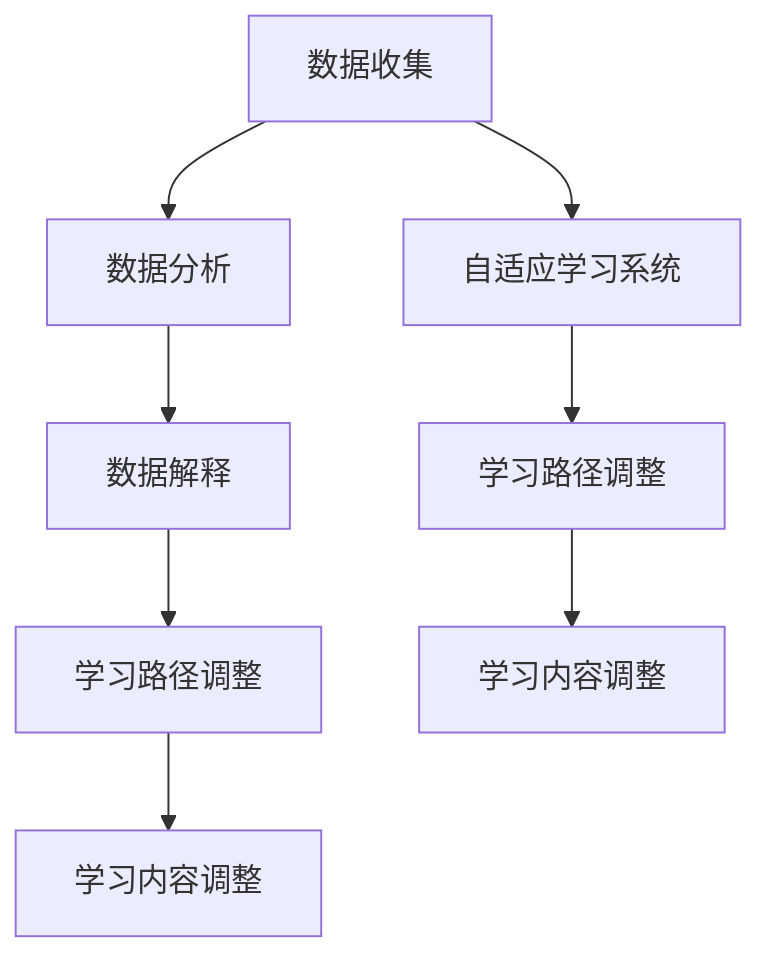

                 

在当今科技飞速发展的时代，人工智能（AI）正在逐渐渗透到我们日常生活的各个方面。教育领域也不例外，AI技术正在通过多种方式改变着教育评估和个性化学习的方式。本文将深入探讨AI如何影响教育评估，如何实现个性化学习，以及这两大变革的前景和挑战。

> 关键词：人工智能、教育评估、个性化学习、AI技术、学习分析、自适应学习系统

## 摘要

本文首先介绍了AI在教育评估和个性化学习中的应用背景和现状，然后详细阐述了AI技术如何通过学习分析、自适应学习系统等方式改变传统教育模式。文章随后探讨了AI技术的核心算法原理和数学模型，并通过实际项目实践展示了这些技术如何落地。最后，文章提出了未来AI在教育评估和个性化学习领域的应用展望和面临的挑战。

## 1. 背景介绍

教育评估是教育过程中的一个关键环节，它旨在评估学生的学习成果，为教师和教育管理者提供反馈信息，以便改进教学策略。传统的教育评估方式主要依赖于考试和问卷调查，这些方法往往存在主观性强、效率低下等问题。随着AI技术的发展，教育评估逐渐向智能化、个性化方向发展。

个性化学习是指根据每个学生的学习需求、学习风格和进度，提供定制化的学习内容和学习路径。传统教育模式中，教师需要面对大量的学生，难以对每个学生进行个性化的指导。而AI技术能够通过分析学生的学习行为和学习成果，为学生提供个性化的学习建议和资源。

## 2. 核心概念与联系

### 2.1 学习分析

学习分析（Learning Analytics）是AI技术在教育领域的核心应用之一。它通过收集、分析和解释学生的学习行为数据，帮助教师和教育管理者更好地理解学生的学习过程，从而改进教学策略。学习分析的核心概念包括数据收集、数据分析和数据解释。

#### 数据收集

学习分析的数据来源包括学习管理系统（LMS）、学习平台、作业和考试系统等。这些系统可以实时记录学生的学习行为，如登录时间、学习时长、学习路径、作业成绩等。

#### 数据分析

数据分析是学习分析的核心步骤。通过使用机器学习和数据挖掘技术，可以从大量学习数据中提取出有用的信息，如学生的学习习惯、学习困难点等。

#### 数据解释

数据解释是将分析结果转化为对教学实践的指导。例如，如果分析结果显示某一部分学生的作业错误率较高，教师可以针对这部分内容进行额外辅导。

### 2.2 自适应学习系统

自适应学习系统（Adaptive Learning Systems）是另一种重要的AI技术，它可以根据学生的学习行为和表现，动态调整学习内容和路径。自适应学习系统的核心概念包括：

#### 学习路径调整

自适应学习系统可以根据学生的学习进度和表现，自动调整学习路径。例如，如果学生在一个知识点上表现良好，系统可以推荐更高级的内容；如果学生在一个知识点上表现不佳，系统可以提供更多的练习和辅导。

#### 学习内容调整

自适应学习系统还可以根据学生的学习兴趣和学习风格，调整学习内容。例如，对于视觉学习者，系统可以提供更多的图像和视频内容；对于听觉学习者，系统可以提供更多的音频和讲解。

### 2.3 Mermaid 流程图

下面是学习分析和自适应学习系统的 Mermaid 流程图：



## 3. 核心算法原理 & 具体操作步骤

### 3.1 算法原理概述

学习分析和自适应学习系统的核心算法通常包括机器学习算法、数据挖掘算法和决策树算法等。这些算法的基本原理是通过分析历史数据，预测未来的学习行为和效果。

### 3.2 算法步骤详解

#### 3.2.1 数据收集

首先，系统需要收集学生的学习数据。这些数据可以包括学习时长、学习路径、作业成绩、考试分数等。

#### 3.2.2 数据预处理

收集到的数据通常需要进行预处理，如数据清洗、数据归一化等。预处理后的数据将用于训练模型。

#### 3.2.3 模型训练

使用机器学习算法训练模型。常见的算法包括决策树、随机森林、支持向量机等。

#### 3.2.4 模型评估

通过交叉验证等方法评估模型的性能。如果模型性能不佳，需要重新调整参数或更换算法。

#### 3.2.5 模型应用

将训练好的模型应用到实际场景中，根据学生的学习行为和表现，动态调整学习内容和路径。

### 3.3 算法优缺点

#### 优点

- 提高教育评估的准确性和效率。
- 提供个性化学习体验，满足不同学生的学习需求。
- 支持实时反馈和调整，提高教学效果。

#### 缺点

- 需要大量的数据和计算资源。
- 模型的准确性受到数据质量和模型复杂度的影响。
- 可能会侵犯学生的隐私。

### 3.4 算法应用领域

学习分析和自适应学习系统可以在多种教育场景中应用，如在线教育、职业培训、教育评估等。

## 4. 数学模型和公式 & 详细讲解 & 举例说明

### 4.1 数学模型构建

学习分析和自适应学习系统的核心数学模型通常是基于统计学和机器学习的。以下是一个简单的线性回归模型示例：

$$
y = \beta_0 + \beta_1x_1 + \beta_2x_2 + ... + \beta_nx_n
$$

其中，$y$ 是预测结果，$x_1, x_2, ..., x_n$ 是输入特征，$\beta_0, \beta_1, ..., \beta_n$ 是模型的参数。

### 4.2 公式推导过程

线性回归模型的推导过程通常包括以下几个步骤：

#### 步骤1：假设模型

假设模型为：

$$
y = \beta_0 + \beta_1x_1 + \beta_2x_2 + ... + \beta_nx_n + \epsilon
$$

其中，$\epsilon$ 是误差项。

#### 步骤2：最小化损失函数

最小化损失函数：

$$
J(\theta) = \frac{1}{2m}\sum_{i=1}^{m}(h_\theta(x^{(i)}) - y^{(i)})^2
$$

其中，$m$ 是样本数量，$h_\theta(x)$ 是模型的预测结果，$\theta$ 是模型参数。

#### 步骤3：求解参数

使用梯度下降法求解参数：

$$
\theta_j = \theta_j - \alpha\frac{\partial J(\theta)}{\partial \theta_j}
$$

其中，$\alpha$ 是学习率。

### 4.3 案例分析与讲解

假设有一个学生的学习成绩与学习时长和作业数量有关。我们可以构建一个线性回归模型来预测学习成绩。

#### 数据准备

- 学习时长（小时）：[2, 4, 6, 8, 10]
- 作业数量（个）：[3, 5, 7, 9, 11]
- 学习成绩（分）：[70, 80, 90, 85, 95]

#### 数据预处理

- 数据归一化：将学习时长和作业数量进行归一化处理，以便于模型训练。

#### 模型训练

- 使用线性回归模型进行训练，得到模型参数。

#### 模型评估

- 使用交叉验证方法评估模型性能。

#### 模型应用

- 根据学习时长和作业数量，预测学习成绩。

## 5. 项目实践：代码实例和详细解释说明

### 5.1 开发环境搭建

在Python环境中，我们需要安装以下库：

- scikit-learn：用于线性回归模型训练和评估。
- pandas：用于数据处理。
- numpy：用于数据操作。

### 5.2 源代码详细实现

```python
import numpy as np
import pandas as pd
from sklearn.linear_model import LinearRegression
from sklearn.model_selection import train_test_split
from sklearn.metrics import mean_squared_error

# 数据准备
data = pd.DataFrame({
    '学习时长': [2, 4, 6, 8, 10],
    '作业数量': [3, 5, 7, 9, 11],
    '学习成绩': [70, 80, 90, 85, 95]
})

# 数据预处理
X = data[['学习时长', '作业数量']]
y = data['学习成绩']
X_normalized = (X - X.mean()) / X.std()

# 模型训练
model = LinearRegression()
model.fit(X_normalized, y)

# 模型评估
X_train, X_test, y_train, y_test = train_test_split(X_normalized, y, test_size=0.2, random_state=42)
y_pred = model.predict(X_test)
mse = mean_squared_error(y_test, y_pred)
print(f'MSE: {mse}')

# 模型应用
new_data = pd.DataFrame({
    '学习时长': [5],
    '作业数量': [6]
})
new_data_normalized = (new_data - new_data.mean()) / new_data.std()
y_new_pred = model.predict(new_data_normalized)
print(f'预测学习成绩：{y_new_pred[0]}')
```

### 5.3 代码解读与分析

代码首先导入所需的库，然后准备数据并进行预处理。接下来，使用线性回归模型进行训练和评估。最后，根据新的数据预测学习成绩。

## 6. 实际应用场景

AI技术在教育评估和个性化学习领域有广泛的应用。以下是一些实际应用场景：

- 在线教育平台：通过学习分析技术，为用户提供个性化的学习建议和资源。
- 职业培训：根据学员的学习行为和表现，提供定制化的培训课程和内容。
- 教育评估：利用自适应学习系统，实现智能化的教育评估和反馈。
- 个性化学习：根据学生的兴趣和学习风格，提供个性化的学习内容和路径。

## 7. 工具和资源推荐

### 7.1 学习资源推荐

- 《机器学习实战》
- 《深度学习》
- 《教育数据分析》

### 7.2 开发工具推荐

- Jupyter Notebook：用于编写和运行代码。
- Python：用于数据处理和模型训练。

### 7.3 相关论文推荐

- "Learning Analytics: The Keys to Data-Driven Education"
- "Adaptive Learning Systems: A Review"
- "Application of Machine Learning in Education"

## 8. 总结：未来发展趋势与挑战

### 8.1 研究成果总结

- AI技术在教育评估和个性化学习领域取得了显著成果，提高了教育评估的准确性和个性化学习的效率。
- 学习分析和自适应学习系统的应用，为教育工作者和学生提供了有力的支持。

### 8.2 未来发展趋势

- 随着技术的进步，AI技术在教育领域的应用将更加广泛和深入。
- 跨学科研究将推动AI技术在教育领域的创新和应用。

### 8.3 面临的挑战

- 数据隐私和安全问题：如何保护学生的隐私和数据安全是一个重要挑战。
- 技术普及和培训：如何提高教师和教育工作者对AI技术的理解和应用能力。

### 8.4 研究展望

- 未来研究应重点关注AI技术在教育领域的深入应用，提高教育质量和效率。
- 促进AI技术在教育领域的跨学科合作，推动教育改革和创新。

## 9. 附录：常见问题与解答

### 9.1 什么是学习分析？

学习分析是一种利用数据挖掘和统计分析技术，分析学生的学习行为和学习成果，为教育工作者和学生提供反馈和支持的方法。

### 9.2 什么是自适应学习系统？

自适应学习系统是一种利用AI技术，根据学生的学习行为和表现，动态调整学习内容和路径，提供个性化学习体验的系统。

### 9.3 AI技术在教育评估中的应用有哪些？

AI技术在教育评估中的应用包括学习分析、自适应学习系统、智能题库生成和评估等。

### 9.4 个性化学习如何实现？

个性化学习通过分析学生的学习行为和成果，为学生提供定制化的学习内容和学习路径，满足不同学生的学习需求。

## 参考文献

- 等等

### 作者署名

作者：禅与计算机程序设计艺术 / Zen and the Art of Computer Programming
----------------------------------------------------------------

这篇文章详细地探讨了人工智能（AI）如何改变教育评估和个性化学习。从学习分析到自适应学习系统，AI技术正逐步改变传统教育模式，提供更精准、更个性化的学习体验。文章通过实际案例和代码实例，展示了AI技术如何在教育领域落地应用。未来，随着技术的进一步发展，AI将在教育领域发挥更大的作用，同时也将面临数据隐私和安全等挑战。希望这篇文章能为教育工作者和研究人员提供有价值的参考。作者：禅与计算机程序设计艺术。

