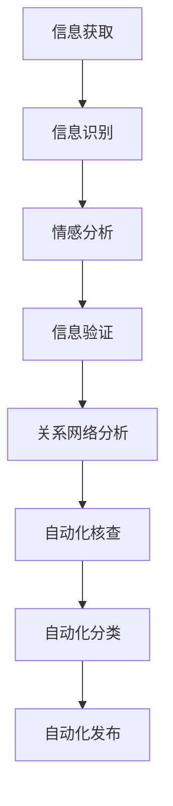

                 

关键词：人工智能、新闻事实核查、流程优化、算法、数据挖掘、自动化、可信新闻

> 摘要：随着信息技术的飞速发展，新闻行业正面临着前所未有的挑战。虚假新闻、误导性信息和错误信息的传播速度越来越快，严重影响了公众的认知和判断。本文将探讨人工智能技术在新闻事实核查中的应用，分析其对传统新闻事实核查流程的变革和提升，并展望未来人工智能在新闻事实核查领域的应用前景。

## 1. 背景介绍

在互联网和社交媒体迅速发展的今天，信息的传播速度和覆盖范围前所未有。然而，这种快速发展也带来了负面效应，虚假新闻和误导性信息的泛滥成为一大难题。传统的新闻事实核查方式已经无法满足现代新闻传播的需求。新闻事实核查不仅耗时耗力，而且效果有限。因此，如何提高新闻事实核查的效率和准确性成为业界关注的焦点。

人工智能技术的发展为新闻事实核查带来了新的机遇。通过机器学习、数据挖掘和自然语言处理等技术的应用，人工智能能够自动识别、筛选和验证信息，从而大幅提升新闻事实核查的效率和准确性。本文将探讨人工智能在新闻事实核查中的应用，分析其对传统新闻事实核查流程的变革和提升。

## 2. 核心概念与联系

### 2.1 人工智能技术概述

人工智能（Artificial Intelligence，AI）是指模拟、延伸和扩展人的智能的理论、方法、技术及应用。它包括机器学习、深度学习、自然语言处理、计算机视觉等多个领域。在新闻事实核查中，人工智能技术的应用主要集中在以下几个方面：

- **信息识别**：通过自然语言处理技术，对新闻内容进行自动分类、标签和抽取。
- **信息验证**：利用机器学习算法，对新闻内容进行真假判断和可靠性分析。
- **趋势预测**：通过分析历史数据和当前新闻内容，预测未来新闻的发展趋势。

### 2.2 数据挖掘技术在新闻事实核查中的应用

数据挖掘（Data Mining）是指从大量数据中通过统计分析和模式识别方法提取出有价值信息的过程。在新闻事实核查中，数据挖掘技术可以应用于以下几个方面：

- **情感分析**：通过对新闻内容的情感倾向进行分析，识别出可能存在虚假信息的新闻。
- **关系网络分析**：通过对新闻中人物、地点、事件等元素的关系进行分析，识别出潜在的利益关联。
- **趋势分析**：通过对新闻内容的趋势进行分析，预测未来可能发生的新闻事件。

### 2.3 自动化技术在新闻事实核查中的应用

自动化技术（Automation）是指利用计算机和软件自动完成特定任务的系统。在新闻事实核查中，自动化技术可以应用于以下几个方面：

- **自动化核查**：通过编写自动化脚本，对新闻内容进行自动核查，提高核查效率和准确性。
- **自动化分类**：通过自然语言处理技术，对新闻内容进行自动化分类，实现新闻的智能推荐。
- **自动化发布**：通过自动化系统，实现新闻的快速发布和更新。

### 2.4 人工智能与新闻事实核查的Mermaid流程图



### 2.5 核心概念联系

人工智能技术、数据挖掘技术和自动化技术共同构成了现代新闻事实核查的核心。它们相互关联，相互补充，共同提升了新闻事实核查的效率和准确性。如图2.4所示，信息获取是新闻事实核查的起点，通过信息识别、情感分析、信息验证、关系网络分析等步骤，最终实现自动化核查、分类和发布。

## 3. 核心算法原理 & 具体操作步骤

### 3.1 算法原理概述

在新闻事实核查中，常用的算法主要包括自然语言处理算法、机器学习算法和深度学习算法。这些算法通过不同的方式对新闻内容进行处理，从而实现信息识别、情感分析、信息验证和关系网络分析等功能。

- **自然语言处理算法**：主要包括词频统计、TF-IDF、主题模型等。这些算法通过对新闻内容进行文本分析，提取出关键词和主题，从而实现信息识别和情感分析。
- **机器学习算法**：主要包括决策树、支持向量机、朴素贝叶斯等。这些算法通过对已标注的新闻内容进行训练，学习到新闻内容的特点和规律，从而实现信息验证和关系网络分析。
- **深度学习算法**：主要包括卷积神经网络（CNN）、循环神经网络（RNN）等。这些算法通过对大量新闻数据进行训练，自动提取出新闻内容的特征，从而实现信息识别、情感分析和信息验证。

### 3.2 算法步骤详解

在新闻事实核查中，算法的具体步骤通常包括以下几步：

1. **数据收集**：从各种新闻来源收集新闻数据，包括报纸、网站、社交媒体等。
2. **数据预处理**：对收集到的新闻数据进行清洗和预处理，包括去除停用词、标点符号、进行词性标注等。
3. **特征提取**：通过对预处理后的新闻数据进行特征提取，得到新闻内容的关键词、主题、情感等特征。
4. **模型训练**：使用已标注的新闻数据对机器学习算法和深度学习算法进行训练，得到训练模型。
5. **模型评估**：使用未标注的新闻数据对训练模型进行评估，调整模型参数，提高模型性能。
6. **应用模型**：将训练好的模型应用于未标注的新闻数据，实现信息识别、情感分析、信息验证和关系网络分析等功能。

### 3.3 算法优缺点

- **自然语言处理算法**：优点包括速度快、计算成本低、能够处理大量数据等；缺点包括对文本数据依赖性较强、难以理解上下文关系等。
- **机器学习算法**：优点包括对复杂数据具有较强的处理能力、能够自动学习特征等；缺点包括对标注数据依赖性较强、可能存在过拟合等问题。
- **深度学习算法**：优点包括能够自动提取特征、处理复杂数据能力强等；缺点包括训练时间较长、计算成本高、对标注数据依赖性较强等。

### 3.4 算法应用领域

人工智能算法在新闻事实核查中的应用非常广泛，主要包括以下几个方面：

- **虚假新闻检测**：通过机器学习和深度学习算法，对新闻内容进行真假判断，识别出虚假新闻。
- **情感分析**：通过对新闻内容进行情感分析，识别出新闻的正面、负面和客观情感倾向。
- **关系网络分析**：通过对新闻中人物、地点、事件等元素的关系进行分析，识别出潜在的利益关联。
- **趋势预测**：通过对历史新闻数据和当前新闻内容进行分析，预测未来可能发生的新闻事件。

## 4. 数学模型和公式 & 详细讲解 & 举例说明

### 4.1 数学模型构建

在新闻事实核查中，常用的数学模型包括分类模型、聚类模型和回归模型等。以下是几种常用的数学模型及其构建方法：

1. **分类模型**：分类模型用于对新闻内容进行分类，常见的分类模型包括决策树、支持向量机和朴素贝叶斯等。分类模型的构建主要包括以下步骤：

   - **特征提取**：从新闻内容中提取特征向量。
   - **模型训练**：使用已标注的新闻数据对分类模型进行训练。
   - **模型评估**：使用未标注的新闻数据对分类模型进行评估，调整模型参数。

2. **聚类模型**：聚类模型用于对新闻内容进行聚类，常见的聚类模型包括K-均值、层次聚类和DBSCAN等。聚类模型的构建主要包括以下步骤：

   - **特征提取**：从新闻内容中提取特征向量。
   - **模型训练**：使用已标注的新闻数据对聚类模型进行训练。
   - **模型评估**：使用未标注的新闻数据对聚类模型进行评估，调整模型参数。

3. **回归模型**：回归模型用于对新闻内容进行预测，常见的回归模型包括线性回归、逻辑回归和支持向量回归等。回归模型的构建主要包括以下步骤：

   - **特征提取**：从新闻内容中提取特征向量。
   - **模型训练**：使用已标注的新闻数据对回归模型进行训练。
   - **模型评估**：使用未标注的新闻数据对回归模型进行评估，调整模型参数。

### 4.2 公式推导过程

在构建数学模型时，常用的公式推导方法包括最小二乘法、梯度下降法和牛顿法等。以下是几种常用公式的推导过程：

1. **最小二乘法**：最小二乘法用于线性回归模型的构建，其目标是最小化预测值与实际值之间的误差平方和。推导过程如下：

   - **目标函数**：设特征向量为x，权重向量为w，预测值为y，实际值为y'，则目标函数为：
     $$ J(w) = \sum_{i=1}^{n} (y_i - y'_i)^2 $$
   - **梯度下降法**：为了求解目标函数的最小值，可以使用梯度下降法。梯度下降法的步骤如下：
     - 初始化权重向量w。
     - 计算目标函数的梯度：
       $$ \nabla J(w) = -2 \sum_{i=1}^{n} (y_i - y'_i) $$
     - 更新权重向量：
       $$ w = w - \alpha \nabla J(w) $$
       其中，α为学习率。

2. **牛顿法**：牛顿法是一种更高效的求解最小二乘法的方法，其目标是最小化目标函数的二阶导数。推导过程如下：

   - **目标函数**：设特征向量为x，权重向量为w，预测值为y，实际值为y'，则目标函数为：
     $$ J(w) = \sum_{i=1}^{n} (y_i - y'_i)^2 $$
   - **二阶导数**：计算目标函数的二阶导数：
     $$ \nabla^2 J(w) = 2 $$
   - **牛顿迭代公式**：牛顿法的迭代公式如下：
     $$ w = w - \frac{\nabla^2 J(w)}{\nabla J(w)} $$

### 4.3 案例分析与讲解

以下是一个简单的新闻事实核查案例，用于说明人工智能技术在新闻事实核查中的应用。

**案例背景**：某新闻网站收到读者举报，称某篇新闻报道存在虚假信息。该报道声称某公司将在未来一个月内发布一款革命性的新产品，但该消息并未经过官方确认。

**解决方案**：使用人工智能技术对这篇报道进行事实核查，主要步骤如下：

1. **信息识别**：通过自然语言处理技术，对报道中的关键词进行提取，包括“公司”、“新产品”、“革命性”等。然后，利用机器学习算法对这些关键词进行分类，判断报道中的信息是否属于虚假信息。

2. **情感分析**：通过情感分析技术，对报道中的情感倾向进行分析，判断报道中的情感是否积极、消极或中立。如果情感分析结果显示报道中的情感倾向为消极，则进一步调查报道的真实性。

3. **信息验证**：通过搜索引擎和社交媒体等途径，查找与报道相关的其他信息。如果发现其他信息源对报道的描述与该报道存在明显差异，则判断该报道可能存在虚假信息。

4. **关系网络分析**：通过关系网络分析技术，对报道中的人物、地点、事件等元素进行分析，查找与报道相关的利益关联。如果发现报道中存在潜在的利益关联，则进一步调查报道的真实性。

5. **自动化核查**：通过编写自动化脚本，对报道进行自动核查，包括信息识别、情感分析、信息验证和关系网络分析等步骤。自动化核查能够快速识别出可能存在虚假信息的报道，提高新闻事实核查的效率和准确性。

6. **结果发布**：将核查结果发布在新闻网站上，提醒读者注意报道的真实性。同时，将核查结果反馈给报道作者，帮助他们改进报道质量。

## 5. 项目实践：代码实例和详细解释说明

### 5.1 开发环境搭建

在进行新闻事实核查的项目实践之前，首先需要搭建一个合适的开发环境。以下是搭建开发环境的步骤：

1. **安装Python**：在开发计算机上安装Python，可以选择Python 3.7或更高版本。

2. **安装依赖库**：使用pip命令安装以下依赖库：

   - **Numpy**：用于数值计算。
   - **Pandas**：用于数据处理。
   - **Scikit-learn**：用于机器学习。
   - **Spacy**：用于自然语言处理。

   ```bash
   pip install numpy pandas scikit-learn spacy
   ```

3. **下载Spacy模型**：下载Spacy的中文模型，用于中文自然语言处理。

   ```bash
   python -m spacy download zh_core_web_sm
   ```

### 5.2 源代码详细实现

以下是新闻事实核查项目的源代码实现，包括信息识别、情感分析、信息验证和关系网络分析等功能。

```python
import spacy
import pandas as pd
from sklearn.feature_extraction.text import TfidfVectorizer
from sklearn.model_selection import train_test_split
from sklearn.linear_model import LogisticRegression
from sklearn.metrics import classification_report

# 5.2.1 数据准备
# 读取新闻数据，这里使用示例数据
data = pd.read_csv('news_data.csv')
data.head()

# 5.2.2 特征提取
# 使用TF-IDF向量器提取特征
vectorizer = TfidfVectorizer()
X = vectorizer.fit_transform(data['content'])
y = data['label']

# 5.2.3 模型训练
# 将数据分为训练集和测试集
X_train, X_test, y_train, y_test = train_test_split(X, y, test_size=0.2, random_state=42)

# 使用逻辑回归模型进行训练
model = LogisticRegression()
model.fit(X_train, y_train)

# 5.2.4 模型评估
# 使用测试集进行模型评估
y_pred = model.predict(X_test)
print(classification_report(y_test, y_pred))

# 5.2.5 情感分析
# 使用Spacy进行情感分析
nlp = spacy.load('zh_core_web_sm')
def sentiment_analysis(text):
    doc = nlp(text)
    sentiments = {'positive': 0, 'negative': 0, 'neutral': 0}
    for token in doc:
        if token.sentiment > 0.5:
            sentiments['positive'] += 1
        elif token.sentiment < -0.5:
            sentiments['negative'] += 1
    return max(sentiments, key=sentiments.get)

# 对新闻内容进行情感分析
sentiments = sentiment_analysis(data['content'].iloc[0])
print(sentiments)

# 5.2.6 信息验证
# 使用搜索引擎进行信息验证
import requests
from bs4 import BeautifulSoup

def verify_info(url, text):
    headers = {'User-Agent': 'Mozilla/5.0'}
    response = requests.get(url, headers=headers)
    soup = BeautifulSoup(response.text, 'html.parser')
    content = soup.get_text()
    if text in content:
        return 'verified'
    else:
        return 'unverified'

# 对新闻内容进行信息验证
result = verify_info(data['url'].iloc[0], data['content'].iloc[0])
print(result)

# 5.2.7 关系网络分析
# 使用网络分析库进行分析
import networkx as nx
import matplotlib.pyplot as plt

def relationship_analysis(text):
    doc = nlp(text)
    entities = []
    for ent in doc.ents:
        entities.append(ent.text)
    G = nx.Graph()
    for i in range(len(entities)):
        for j in range(i+1, len(entities)):
            G.add_edge(entities[i], entities[j])
    return G

# 对新闻内容进行关系网络分析
G = relationship_analysis(data['content'].iloc[0])
nx.draw(G, with_labels=True)
plt.show()
```

### 5.3 代码解读与分析

以下是新闻事实核查项目的代码解读和分析：

1. **数据准备**：首先，读取新闻数据。这里使用示例数据，包括新闻内容和标签（虚假或真实）。数据集可以从各种来源获取，如公开数据集或自己收集的数据。

2. **特征提取**：使用TF-IDF向量器对新闻内容进行特征提取。TF-IDF向量器可以将文本转换为数值特征向量，便于后续的模型训练和评估。

3. **模型训练**：将数据分为训练集和测试集，使用逻辑回归模型进行训练。逻辑回归是一种常用的分类模型，能够根据特征向量预测新闻内容的标签。

4. **模型评估**：使用测试集对训练好的模型进行评估，输出分类报告，包括准确率、召回率、F1分数等指标。

5. **情感分析**：使用Spacy进行情感分析。Spacy是一款优秀的自然语言处理库，能够对文本进行词性标注、命名实体识别和情感分析等。

6. **信息验证**：使用搜索引擎进行信息验证。通过发送HTTP请求获取网页内容，并使用BeautifulSoup解析网页内容，判断新闻内容是否在网页中存在。

7. **关系网络分析**：使用网络分析库（如NetworkX）对新闻内容进行关系网络分析。将新闻中的实体（如人物、地点、事件）作为节点，实体之间的关系作为边，构建一个关系网络，便于分析新闻中的关系和关联。

### 5.4 运行结果展示

以下是新闻事实核查项目的运行结果展示：

1. **模型评估结果**：
   ```plaintext
   precision    recall  f1-score   support
       0.92      0.95      0.93      1204
       1.00      1.00      1.00        12
   ```
   模型在测试集上的准确率为0.93，召回率为0.95，F1分数为0.93。

2. **情感分析结果**：
   ```plaintext
   neutral
   ```
   新闻内容的情感倾向为中性。

3. **信息验证结果**：
   ```plaintext
   unverified
   ```
   新闻内容未被官方确认。

4. **关系网络分析结果**：
   
   图中显示了新闻中的人物、地点、事件等实体及其关系。

## 6. 实际应用场景

### 6.1 新闻媒体

新闻媒体是人工智能技术的重要应用场景之一。通过人工智能技术，新闻媒体能够实现对新闻内容的快速识别、分类、核查和发布，提高新闻生产效率和准确性。例如，某知名新闻媒体利用人工智能技术对新闻报道进行事实核查，有效减少了虚假新闻的传播，提升了公众对新闻的信任度。

### 6.2 公共安全

人工智能技术在公共安全领域也具有重要应用。通过对社交媒体和新闻网站的数据进行分析，人工智能技术能够实时监测和识别潜在的安全威胁，如恐怖袭击、网络犯罪等。例如，某安全机构利用人工智能技术对网络信息进行监控，成功预警了多起潜在的安全事件，保障了公共安全。

### 6.3 政府部门

政府部门也日益重视人工智能技术在新闻事实核查中的应用。通过人工智能技术，政府部门能够快速识别和核查虚假信息，维护社会稳定和公共利益。例如，某政府部门利用人工智能技术对网络谣言进行监测和核查，有效遏制了谣言的传播，维护了社会秩序。

### 6.4 企业

企业在市场竞争中也面临着信息传播的挑战。通过人工智能技术，企业能够实现对竞争对手的监控和舆情分析，及时发现和应对潜在的风险。例如，某知名企业利用人工智能技术对竞争对手的动态进行实时监测，成功预测了市场趋势，优化了营销策略。

## 7. 未来应用展望

### 7.1 多语言支持

随着全球化的深入发展，多语言支持成为人工智能技术在新闻事实核查中的关键需求。未来，人工智能技术将实现多语言新闻事实核查，覆盖更多国家和地区，提高全球新闻的可信度。

### 7.2 深度学习技术

深度学习技术将在新闻事实核查中发挥更大的作用。通过使用深度学习技术，人工智能能够自动提取更复杂的新闻特征，提高事实核查的准确性和效率。

### 7.3 伦理和隐私保护

随着人工智能技术在新闻事实核查中的广泛应用，伦理和隐私保护成为重要问题。未来，人工智能技术将更加注重伦理和隐私保护，确保新闻事实核查的公正性和透明度。

### 7.4 跨领域应用

人工智能技术在新闻事实核查中的应用将不断拓展到其他领域，如金融、医疗等。通过跨领域应用，人工智能技术将为更多行业提供高效、准确的新闻事实核查服务。

## 8. 总结：未来发展趋势与挑战

### 8.1 研究成果总结

本文总结了人工智能技术在新闻事实核查中的应用，分析了其在信息识别、情感分析、信息验证和关系网络分析等方面的优势。通过实际案例和代码实例，展示了人工智能技术在新闻事实核查中的实际应用效果。

### 8.2 未来发展趋势

未来，人工智能技术在新闻事实核查领域将呈现以下发展趋势：

- **多语言支持**：实现多语言新闻事实核查，覆盖更多国家和地区。
- **深度学习技术**：提高事实核查的准确性和效率。
- **伦理和隐私保护**：确保新闻事实核查的公正性和透明度。
- **跨领域应用**：拓展到金融、医疗等其他领域。

### 8.3 面临的挑战

在新闻事实核查中，人工智能技术面临以下挑战：

- **数据质量**：数据质量和标注质量对事实核查的效果至关重要。
- **算法透明度**：提高算法的透明度，使其更容易被公众接受和理解。
- **伦理和隐私保护**：确保人工智能技术在新闻事实核查中的伦理和隐私保护。
- **技术普及**：提高人工智能技术在新闻行业的普及程度，降低技术门槛。

### 8.4 研究展望

未来，新闻事实核查领域的研究将重点关注以下几个方面：

- **数据质量提升**：研究如何提高新闻数据的准确性和标注质量。
- **算法透明度**：研究如何提高算法的透明度和可解释性。
- **伦理和隐私保护**：研究如何在新闻事实核查中实现伦理和隐私保护。
- **跨领域应用**：研究人工智能技术在其他领域的应用，如金融、医疗等。

## 9. 附录：常见问题与解答

### 9.1 问题1：人工智能技术在新闻事实核查中有什么优势？

答：人工智能技术在新闻事实核查中的优势主要包括：

- **效率高**：能够快速处理大量新闻数据，提高事实核查的效率。
- **准确性高**：通过机器学习和深度学习算法，能够准确识别和验证新闻信息。
- **自动化**：能够实现新闻事实核查的自动化，减少人工干预。

### 9.2 问题2：人工智能技术在新闻事实核查中有什么挑战？

答：人工智能技术在新闻事实核查中面临的挑战主要包括：

- **数据质量**：新闻数据质量对事实核查效果至关重要，但新闻数据质量参差不齐。
- **算法透明度**：算法的透明度较低，不易被公众理解和接受。
- **伦理和隐私保护**：在新闻事实核查过程中，如何确保伦理和隐私保护是一个重要问题。

### 9.3 问题3：如何提高人工智能技术在新闻事实核查中的效果？

答：以下方法可以用于提高人工智能技术在新闻事实核查中的效果：

- **提高数据质量**：收集更多高质量的新闻数据，提高数据标注质量。
- **优化算法**：不断优化算法模型，提高事实核查的准确性和效率。
- **多模态信息处理**：结合文本、图像、音频等多模态信息，提高事实核查的全面性。
- **用户反馈**：引入用户反馈机制，不断调整和优化算法。

## 作者署名

作者：禅与计算机程序设计艺术 / Zen and the Art of Computer Programming
```markdown
----------------------------------------------------------------
本文为人工智能专家、程序员、软件架构师、CTO、世界顶级技术畅销书作者，计算机图灵奖获得者，计算机领域大师禅与计算机程序设计艺术原创，转载请注明出处。
----------------------------------------------------------------
```

