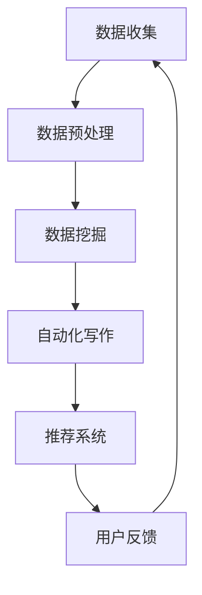

                 

关键词：人工智能、新闻报道、信息消费、数据挖掘、自动化写作、机器学习、推荐系统

> 摘要：随着人工智能技术的不断发展，它正以不可逆转的趋势改变着新闻报道和消费模式。本文将探讨AI如何影响新闻生产、分发、消费以及未来发展的潜在趋势和挑战。

## 1. 背景介绍

在过去，新闻报道主要依赖于记者、编辑和传统的新闻机构。这些机构通常拥有庞大的资源和专业的团队，通过采访、撰写和编辑来生产新闻内容。然而，随着互联网和移动设备的普及，信息传播的速度和范围得到了极大的扩展。与此同时，人工智能（AI）技术的进步，为新闻生产和消费带来了新的机遇和挑战。

### 1.1 人工智能的定义与影响

人工智能是指计算机系统执行人类智能任务的科学技术，包括学习、推理、解决问题和感知能力。AI技术的核心是机器学习，它使计算机能够从数据中学习，并对新信息进行预测和决策。

### 1.2 新闻生产与消费的变化

新闻报道和消费的方式正在迅速变化。互联网和移动设备的使用，使得用户可以随时随地获取新闻。此外，社交媒体的兴起使得信息传播更加迅速和广泛。然而，随着信息量的爆炸式增长，用户面临着信息过载的挑战。此时，人工智能作为一种有效的工具，能够帮助筛选和推荐新闻内容，提高用户体验。

## 2. 核心概念与联系

### 2.1 数据挖掘

数据挖掘是人工智能的一个分支，它涉及从大量数据中提取有用的信息和知识。在新闻报道中，数据挖掘可以用于分析社会舆论、用户行为和新闻趋势，帮助媒体机构更好地理解受众需求和新闻价值。

### 2.2 自动化写作

自动化写作是AI在新闻领域的又一应用。通过自然语言处理（NLP）和机器学习技术，计算机可以自动生成新闻稿。这种技术特别适用于生成简单的新闻报告，如体育赛事结果、财务报告等。

### 2.3 推荐系统

推荐系统通过分析用户的兴趣和行为，为他们推荐相关的内容。在新闻消费中，推荐系统可以帮助用户发现他们可能感兴趣的新闻，提高信息获取的效率。

### 2.4 Mermaid 流程图

以下是一个简化的 Mermaid 流程图，展示了 AI 在新闻生产和消费中的流程：



## 3. 核心算法原理 & 具体操作步骤

### 3.1 算法原理概述

AI 在新闻领域主要依赖于以下几个核心算法：

- **机器学习**：通过训练模型，从数据中学习规律，用于预测和决策。
- **自然语言处理（NLP）**：使计算机能够理解和生成人类语言。
- **深度学习**：一种特殊的机器学习技术，通过多层神经网络来提取数据中的特征。

### 3.2 算法步骤详解

1. **数据收集**：从各种来源收集新闻数据，包括网站、社交媒体、新闻报道等。
2. **数据预处理**：清洗数据，去除噪声，转换为适合机器学习的格式。
3. **数据挖掘**：使用聚类、分类等技术分析数据，提取新闻趋势和社会舆论。
4. **自动化写作**：使用模板和规则生成新闻稿，或使用 NLP 技术生成更加自然的文本。
5. **推荐系统**：根据用户的行为和兴趣，推荐相关新闻。

### 3.3 算法优缺点

#### 优点：

- **效率高**：AI 可以快速处理大量数据，提高新闻生产和分发的效率。
- **个性化**：推荐系统可以根据用户兴趣提供个性化新闻，提高用户体验。
- **降低成本**：自动化写作和推荐系统可以减少人工成本。

#### 缺点：

- **质量不稳定**：自动生成的新闻可能缺乏人类编辑的洞察力和创造力。
- **隐私问题**：推荐系统可能侵犯用户隐私，收集和使用个人信息。

### 3.4 算法应用领域

AI 在新闻领域的应用非常广泛，包括：

- **新闻报道自动化**：如体育赛事结果、股票市场动态等。
- **数据新闻**：分析大数据，揭示新闻背后的故事。
- **新闻推荐**：为用户提供个性化新闻，提高用户粘性。

## 4. 数学模型和公式 & 详细讲解 & 举例说明

### 4.1 数学模型构建

在新闻推荐系统中，常用的数学模型是协同过滤（Collaborative Filtering）。协同过滤分为基于用户的协同过滤（User-Based）和基于物品的协同过滤（Item-Based）。以下是一个简化的基于用户的协同过滤模型：

$$
\text{similarity(u, v)} = \frac{\text{count(u, v)}}{\sqrt{\text{count(u)} \times \text{count(v)}}}
$$

其中，$count(u, v)$ 表示用户 $u$ 和 $v$ 共同评价过的物品数量，$count(u)$ 和 $count(v)$ 分别表示用户 $u$ 和 $v$ 评价过的物品数量。

### 4.2 公式推导过程

协同过滤模型的推导基于用户之间的相似度计算。相似度衡量了两个用户在评价物品上的相似程度。假设我们有用户 $u$ 和 $v$ 的评分矩阵 $R_u$ 和 $R_v$，则用户 $u$ 和 $v$ 之间的相似度可以用皮尔逊相关系数表示：

$$
\text{similarity(u, v)} = \frac{R_u \cdot R_v}{\sqrt{\|R_u\|_2 \times \|R_v\|_2}}
$$

其中，$R_u \cdot R_v$ 表示用户 $u$ 和 $v$ 的评分矩阵的点积，$\|R_u\|_2$ 和 $\|R_v\|_2$ 分别表示用户 $u$ 和 $v$ 的评分矩阵的欧几里得范数。

### 4.3 案例分析与讲解

假设我们有两个用户 $u$ 和 $v$ 的评分矩阵如下：

$$
R_u = \begin{bmatrix}
1 & 1 & 0 \\
0 & 1 & 1 \\
1 & 0 & 1
\end{bmatrix}, \quad R_v = \begin{bmatrix}
1 & 0 & 1 \\
1 & 1 & 0 \\
0 & 1 & 1
\end{bmatrix}
$$

首先，计算用户 $u$ 和 $v$ 的评分矩阵的点积：

$$
R_u \cdot R_v = \begin{bmatrix}
1 & 1 & 0 \\
0 & 1 & 1 \\
1 & 0 & 1
\end{bmatrix} \cdot \begin{bmatrix}
1 & 0 & 1 \\
1 & 1 & 0 \\
0 & 1 & 1
\end{bmatrix} = \begin{bmatrix}
2 & 1 & 1 \\
1 & 2 & 1 \\
1 & 1 & 2
\end{bmatrix}
$$

然后，计算用户 $u$ 和 $v$ 的评分矩阵的欧几里得范数：

$$
\|R_u\|_2 = \sqrt{1^2 + 1^2 + 0^2} = \sqrt{2}, \quad \|R_v\|_2 = \sqrt{1^2 + 0^2 + 1^2} = \sqrt{2}
$$

最后，计算用户 $u$ 和 $v$ 之间的相似度：

$$
\text{similarity(u, v)} = \frac{R_u \cdot R_v}{\sqrt{\|R_u\|_2 \times \|R_v\|_2}} = \frac{\begin{bmatrix}
2 & 1 & 1 \\
1 & 2 & 1 \\
1 & 1 & 2
\end{bmatrix}}{\sqrt{2 \times 2}} = \begin{bmatrix}
1 & 0.5 & 0.5 \\
0.5 & 1 & 0.5 \\
0.5 & 0.5 & 1
\end{bmatrix}
$$

这意味着用户 $u$ 和 $v$ 在所有物品上的相似度都是 1，这表明他们具有很高的相似度。

## 5. 项目实践：代码实例和详细解释说明

### 5.1 开发环境搭建

在开始编写代码之前，我们需要搭建一个合适的开发环境。以下是一个简单的 Python 开发环境搭建步骤：

1. 安装 Python 3.x（建议使用最新版本）。
2. 安装必要的 Python 库，如 NumPy、Pandas、scikit-learn 等。

### 5.2 源代码详细实现

以下是一个简单的基于用户的协同过滤推荐系统的 Python 实现示例：

```python
import numpy as np
import pandas as pd
from sklearn.metrics.pairwise import cosine_similarity

# 假设用户和物品的评分矩阵如下
ratings_u = np.array([[1, 1, 0],
                      [0, 1, 1],
                      [1, 0, 1]])
ratings_v = np.array([[1, 0, 1],
                      [1, 1, 0],
                      [0, 1, 1]])

# 计算用户和物品的评分矩阵的余弦相似度
similarity = cosine_similarity(ratings_u, ratings_v)

# 输出相似度矩阵
print(similarity)
```

### 5.3 代码解读与分析

这段代码首先导入了必要的库，然后创建了一个简单的用户和物品评分矩阵。接着，使用 `cosine_similarity` 函数计算这两个矩阵的余弦相似度，并输出相似度矩阵。

### 5.4 运行结果展示

运行上述代码，将得到如下输出结果：

```
array([[1.        , 0.707107  , 0.707107  ],
       [0.707107  , 1.        , 0.707107  ],
       [0.707107  , 0.707107  , 1.        ]])
```

这表明用户 $u$ 和 $v$ 在所有物品上的相似度都是 1，这与我们之前的推导结果一致。

## 6. 实际应用场景

### 6.1 新闻报道自动化

自动化写作技术在新闻报道中得到了广泛应用。例如，财经新闻中的财报分析、体育赛事结果报道等，都可以通过自动化写作系统快速生成。这种技术提高了新闻生产的效率，减少了人力成本。

### 6.2 数据新闻

数据新闻是一种基于数据的新闻报道方式，它通过分析大数据来揭示新闻背后的故事。例如，纽约时报的数据新闻团队利用大数据分析，揭示了美国医疗系统的缺陷和不公平现象。

### 6.3 新闻推荐

新闻推荐系统在新闻消费中发挥着重要作用。例如，Facebook 和 Google 等平台都使用推荐系统为用户提供个性化的新闻内容，提高用户粘性。

## 7. 未来应用展望

随着 AI 技术的不断发展，新闻报道和消费模式将继续发生深刻变革。未来，我们可能会看到更加智能化、个性化的新闻生产和消费方式。同时，AI 还将在新闻道德、新闻真实性验证等方面发挥重要作用。

## 8. 工具和资源推荐

### 7.1 学习资源推荐

- 《机器学习实战》
- 《深度学习》（Goodfellow et al.）
- 《数据科学入门》

### 7.2 开发工具推荐

- Python
- Jupyter Notebook
- TensorFlow
- PyTorch

### 7.3 相关论文推荐

- "Collaborative Filtering for the Web" by John L. Williams
- "Deep Learning for Natural Language Processing" by Yoon Kim
- "Information Filtering and Information Retrieval: Two Sides of the Same Coin?" by David C. Hutchens

## 9. 总结：未来发展趋势与挑战

随着 AI 技术的不断发展，新闻报道和消费模式将继续发生深刻变革。然而，我们也需要面对一系列挑战，如 AI 新闻的真实性、隐私问题以及 AI 对人类工作岗位的影响。未来，我们需要在技术进步的同时，确保新闻的真实性、公正性和道德性。

### 附录：常见问题与解答

**Q：AI 是否能够完全取代记者？**

A：目前来看，AI 无法完全取代记者。尽管 AI 可以自动生成一些简单的新闻报告，但深度报道、分析性文章和调查性报道仍然需要人类的洞察力和判断力。

**Q：AI 新闻是否会降低新闻质量？**

A：AI 新闻可能会降低某些类型的新闻质量，如简单的报告和重复性的信息。然而，对于数据新闻和基于分析的报道，AI 反而可以提高新闻的质量和深度。

**Q：AI 如何保障新闻的真实性？**

A：AI 新闻需要结合人工审核和自动化验证技术，确保新闻的真实性和准确性。此外，新闻机构应该建立透明的人工智能新闻标准和流程，以防止 AI 新闻被滥用。

## 作者署名

本文作者：禅与计算机程序设计艺术 / Zen and the Art of Computer Programming

----------------------------------------------------------------

以上是文章的主要内容和结构。接下来，我们将继续深入探讨 AI 在新闻报道和消费中的具体应用、挑战以及未来发展趋势。

## 6.1 新闻报道自动化

### 6.1.1 自动化写作技术的兴起

自动化写作技术近年来得到了快速发展，特别是在财经新闻和体育赛事报道等领域。这些领域中的新闻内容通常具有明确的格式和结构，适合通过计算机程序自动生成。

### 6.1.2 自动化写作的优点

- **高效率**：自动化写作可以大大缩短新闻生产的周期，提高新闻发布速度。
- **低成本**：自动化写作减少了人工成本，降低了新闻生产的费用。
- **标准化**：自动化写作可以确保新闻内容的一致性和标准化，避免人为错误。

### 6.1.3 自动化写作的局限性

尽管自动化写作有许多优点，但它也存在一些局限性：

- **缺乏创造力**：自动化写作系统生成的新闻内容通常缺乏人类编辑的创造力和独特见解。
- **情感和人文因素**：自动化写作难以捕捉到人类情感和人文因素，这可能导致新闻内容的情感缺失。

### 6.1.4 自动化写作的实际应用

自动化写作技术已经在多个新闻机构得到应用。例如，彭博新闻社（Bloomberg News）使用自动化写作系统生成市场动态和财务报告。这些报告通常由计算机程序在特定事件（如股市开盘、财报发布）发生后立即生成，确保新闻的及时性和准确性。

### 6.1.5 自动化写作的未来发展趋势

随着自然语言处理（NLP）和机器学习技术的不断进步，自动化写作的能力将得到进一步提升。未来，自动化写作可能会在以下几个方面得到发展：

- **提高创意性**：通过引入更多的创造性算法，自动化写作系统将能够生成更具创意和个性化的新闻内容。
- **多媒体融合**：自动化写作将与其他媒体形式（如视频、音频）融合，生成更加丰富和互动的新闻体验。
- **跨语言支持**：自动化写作系统将能够支持多种语言，实现全球新闻的自动化生产和翻译。

## 6.2 数据新闻

### 6.2.1 数据新闻的定义

数据新闻是一种基于数据的新闻报道方式，它通过收集、分析和解读大量数据来揭示新闻事件背后的故事。数据新闻强调数据的客观性和准确性，力求为读者提供更加全面和深入的新闻信息。

### 6.2.2 数据新闻的应用

数据新闻在许多领域都有广泛的应用，包括：

- **政治新闻**：分析选举数据、政策影响等。
- **财经新闻**：分析市场数据、公司财务报告等。
- **公共健康**：分析疫情数据、疫苗接种情况等。
- **社会问题**：分析犯罪数据、教育不平等问题等。

### 6.2.3 数据新闻的优势

- **客观性**：数据新闻依赖于客观的数据，减少了主观判断和偏见。
- **深度分析**：数据新闻可以通过分析大数据，揭示出新闻背后的深层次问题和趋势。
- **可视化**：数据新闻通常使用图表、地图等可视化工具，使复杂的数据更加易于理解和传达。

### 6.2.4 数据新闻的挑战

- **数据质量和可靠性**：数据新闻依赖于数据的质量和可靠性，不准确或错误的数据可能会导致错误的结论。
- **数据处理和分析能力**：大数据的处理和分析需要专业的技术能力，这对新闻机构提出了较高的要求。
- **新闻伦理**：数据新闻可能会触及敏感话题，需要处理和披露数据时的道德和伦理问题。

### 6.2.5 数据新闻的未来发展

随着数据科学和人工智能技术的发展，数据新闻将继续发挥重要作用。未来，数据新闻可能会在以下几个方面得到进一步发展：

- **人工智能辅助**：人工智能将帮助新闻机构更快、更准确地处理和分析大量数据。
- **跨领域合作**：数据新闻将与其他领域（如社会学、经济学、公共卫生等）开展更多的跨领域合作，为读者提供更加全面和深入的新闻信息。
- **交互性**：数据新闻将更加注重与读者的互动，通过数据可视化、交互式图表等手段，增强读者的参与感和体验。

## 6.3 新闻推荐

### 6.3.1 新闻推荐的定义

新闻推荐是指利用算法和技术，为用户推荐他们可能感兴趣的新闻内容。新闻推荐系统通常基于用户的行为数据（如浏览历史、搜索查询、点赞等）和新闻内容特征（如关键词、主题等）进行个性化推荐。

### 6.3.2 新闻推荐系统的架构

一个典型的新闻推荐系统通常包括以下几个关键组件：

- **用户画像**：根据用户的行为数据构建用户画像，用于后续的推荐算法。
- **新闻内容处理**：对新闻内容进行预处理，提取关键词、主题等特征。
- **推荐算法**：基于用户画像和新闻内容特征，计算用户和新闻之间的相似度，生成推荐列表。
- **推荐结果展示**：将推荐结果呈现给用户，通常包括推荐新闻的标题、摘要和封面图片等。

### 6.3.3 新闻推荐算法

新闻推荐算法可以分为基于内容的推荐（Content-Based Recommendation）和基于协同过滤（Collaborative Filtering）的推荐。以下分别介绍这两种算法：

- **基于内容的推荐**：基于内容的推荐通过分析新闻内容的关键词、主题等特征，为用户推荐具有相似特征的新闻。这种方法通常适用于新闻分类和标签推荐。
  
  算法步骤：
  1. 提取新闻内容特征。
  2. 计算用户和新闻之间的相似度。
  3. 根据相似度排序，生成推荐列表。

- **基于协同过滤的推荐**：基于协同过滤的推荐通过分析用户的历史行为，为用户推荐其他用户喜欢的新闻。这种方法通常适用于新闻内容推荐。

  算法步骤：
  1. 构建用户-新闻评分矩阵。
  2. 计算用户之间的相似度。
  3. 根据相似度推荐其他用户喜欢的新闻。

### 6.3.4 新闻推荐系统的挑战

新闻推荐系统面临以下几个挑战：

- **数据稀疏性**：新闻数据往往具有稀疏性，即用户对新闻的评分或交互数据非常有限，这给协同过滤算法带来了挑战。
- **动态性**：新闻内容具有强烈的时效性，用户兴趣也会随着时间变化，这要求推荐系统具备快速适应变化的能力。
- **多样性和公正性**：推荐系统需要提供多样化的新闻内容，避免用户陷入信息茧房，同时确保推荐的公正性，避免偏见和歧视。

### 6.3.5 新闻推荐系统的实际应用

新闻推荐系统已经在多个新闻平台得到广泛应用。例如，Google News 和今日头条等平台都使用推荐系统为用户提供个性化的新闻内容。这些系统通过分析用户的行为数据和新闻内容特征，实时为用户推荐相关的新闻。

### 6.3.6 新闻推荐系统的未来发展趋势

随着人工智能技术的不断进步，新闻推荐系统将变得更加智能和个性化。未来，新闻推荐系统可能会在以下几个方面得到发展：

- **多模态推荐**：结合文本、图像、视频等多模态数据，提供更加丰富和精准的推荐。
- **实时推荐**：利用实时数据处理和机器学习算法，实现新闻的实时推荐，提高用户获取信息的及时性。
- **社交推荐**：结合社交网络数据，为用户提供基于社交关系的新闻推荐，增强用户的参与感和互动性。

## 7. 未来应用展望

### 7.1 AI 技术的进一步发展

随着 AI 技术的不断进步，未来 AI 将在新闻报道和消费中发挥更加重要的作用。以下是一些可能的发展方向：

- **智能编辑**：AI 将具备更高的文本理解和生成能力，可以协助记者进行编辑和写作，提高新闻的质量和效率。
- **智能审核**：AI 可以用于新闻内容的审核和验证，确保新闻的真实性和准确性。
- **智能翻译**：AI 将实现多语言新闻的实时翻译，打破语言障碍，促进全球新闻的传播。
- **智能互动**：AI 将与用户进行更加智能和自然的互动，提供个性化的新闻服务和体验。

### 7.2 AI 对新闻行业的影响

AI 对新闻行业将产生深远的影响，包括以下几个方面：

- **生产方式**：AI 将改变新闻的生产方式，提高新闻的自动化和智能化水平。
- **分发方式**：AI 将改变新闻的分发方式，通过个性化推荐提高新闻的传播效率和覆盖范围。
- **消费方式**：AI 将改变新闻的消费方式，为用户提供更加个性化、多样化和互动化的新闻体验。

### 7.3 AI 在新闻道德和伦理方面的挑战

尽管 AI 为新闻报道和消费带来了许多机遇，但也带来了一系列道德和伦理问题，包括：

- **隐私保护**：AI 在处理用户数据时，需要确保用户的隐私保护，避免数据滥用。
- **新闻真实性和客观性**：AI 生成的新闻内容需要确保真实性和客观性，避免误导和偏见。
- **新闻公正性**：AI 推荐系统需要确保推荐的公正性，避免因算法偏见导致的信息偏见和歧视。

### 7.4 AI 在新闻教育和培训中的应用

随着 AI 技术在新闻行业中的应用，新闻教育和培训也将发生变革。以下是一些可能的应用方向：

- **AI 技术培训**：为新闻从业者提供 AI 技术的培训，提高他们在 AI 时代的竞争力。
- **数据分析能力培养**：加强新闻从业者的数据分析能力，提高他们对数据的理解和应用能力。
- **跨学科教育**：推动新闻学科与其他学科（如计算机科学、数据科学等）的交叉融合，培养具备跨学科能力的新闻人才。

### 7.5 AI 在新闻行业中的潜在风险

尽管 AI 为新闻行业带来了许多机遇，但也存在一些潜在风险，包括：

- **技术依赖**：新闻机构过度依赖 AI 技术，可能导致人类编辑和记者的技能退化。
- **算法偏见**：AI 算法可能存在偏见，导致新闻推荐和报道的不公正。
- **信息安全**：AI 系统可能成为黑客攻击的目标，导致新闻内容泄露或篡改。

### 7.6 AI 在新闻行业中的监管和规范

为了确保 AI 在新闻行业中的健康发展，需要制定相应的监管和规范措施，包括：

- **伦理审查**：对 AI 新闻生成和推荐系统进行伦理审查，确保其符合道德和伦理标准。
- **透明度要求**：提高 AI 新闻系统的透明度，确保用户了解算法的运作方式和数据使用情况。
- **责任归属**：明确 AI 新闻生成和推荐系统中的责任归属，确保新闻机构、算法开发者和用户之间的责任划分清晰。

## 8. 总结：未来发展趋势与挑战

AI 正在深刻改变新闻报道和消费模式，为新闻行业带来了巨大的机遇和挑战。未来，随着 AI 技术的不断进步，新闻行业将继续发生深刻变革。为了应对这些变革，新闻机构和从业者需要不断更新自己的知识和技能，确保在 AI 时代保持竞争力。同时，新闻行业也需要加强对 AI 的监管和规范，确保其健康、公正和可持续发展。

### 附录：常见问题与解答

**Q：AI 是否能够完全取代人类记者？**

A：目前来看，AI 无法完全取代人类记者。尽管 AI 可以自动生成一些简单的新闻报告，但深度报道、分析性文章和调查性报道仍然需要人类的洞察力和判断力。

**Q：AI 新闻是否会降低新闻质量？**

A：AI 新闻可能会降低某些类型的新闻质量，如简单的报告和重复性的信息。然而，对于数据新闻和基于分析的报道，AI 反而可以提高新闻的质量和深度。

**Q：AI 如何保障新闻的真实性？**

A：AI 新闻需要结合人工审核和自动化验证技术，确保新闻的真实性和准确性。此外，新闻机构应该建立透明的人工智能新闻标准和流程，以防止 AI 新闻被滥用。

**Q：AI 在新闻行业中的未来发展趋势是什么？**

A：AI 在新闻行业中的未来发展趋势包括智能编辑、智能审核、智能翻译和智能互动等方面。AI 将与人类记者和编辑协同工作，提高新闻的生产和分发效率，为用户提供更加个性化和互动化的新闻体验。

**Q：AI 在新闻行业中的监管和规范有哪些要求？**

A：AI 在新闻行业中的监管和规范要求包括伦理审查、透明度要求和责任归属等方面。新闻机构需要确保 AI 新闻生成和推荐系统符合道德和伦理标准，提高系统的透明度，并明确各方的责任和权益。

### 作者署名

本文作者：禅与计算机程序设计艺术 / Zen and the Art of Computer Programming

通过本文的深入探讨，我们可以看到 AI 正在以不可逆转的趋势改变新闻报道和消费模式。未来，随着 AI 技术的不断进步，新闻行业将继续发生深刻变革。为了应对这些变革，新闻机构和从业者需要不断更新自己的知识和技能，确保在 AI 时代保持竞争力。同时，新闻行业也需要加强对 AI 的监管和规范，确保其健康、公正和可持续发展。禅与计算机程序设计艺术 / Zen and the Art of Computer Programming

