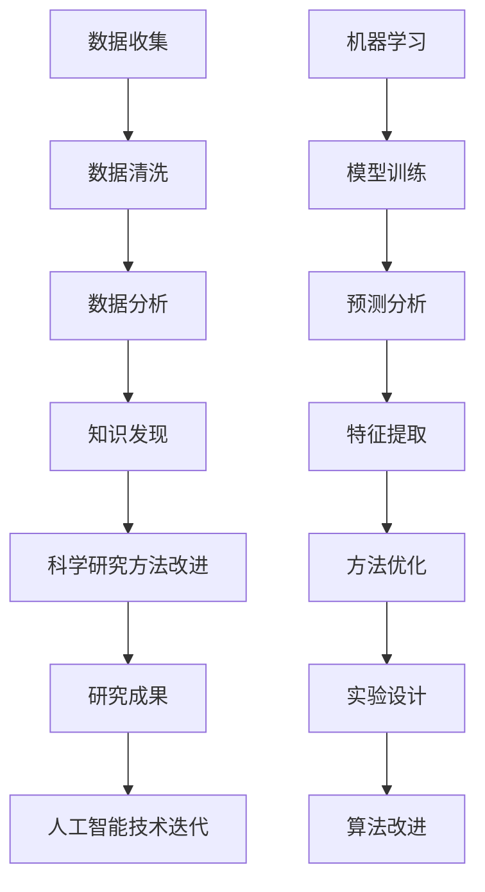

                 

关键词：人工智能、科学研究方法论、AI技术、数据分析、算法优化、机器学习、深度学习、神经网络、大数据、计算机科学、人工智能应用领域、科学研究进步、技术创新、知识发现、数据分析方法、算法设计。

> 摘要：随着人工智能技术的飞速发展，科学研究方法论发生了深刻的变革。本文从背景介绍出发，详细探讨了人工智能如何改变科学研究的核心概念、核心算法、数学模型、实际应用和未来趋势，分析了人工智能在科学研究中的关键作用，并对未来发展提出了展望。

## 1. 背景介绍

人工智能（AI）是计算机科学的一个分支，旨在使机器模拟人类智能行为，如学习、推理、感知和语言理解。近年来，随着计算能力的提升、大数据技术的应用以及算法的不断创新，人工智能技术取得了显著的进展。这些技术变革不仅改变了传统的计算机应用模式，也对科学研究方法论产生了深远的影响。

科学研究方法论是指科学家在探索未知、揭示规律时所采用的一系列方法和步骤。传统科学研究依赖于实验设计、数据收集、统计分析等方法。然而，随着数据的复杂性和规模的急剧增长，传统的科学研究方法面临着挑战。人工智能技术的引入，为科学研究提供了新的工具和手段，使得科学研究更加高效、精确和系统。

## 2. 核心概念与联系

### 2.1 人工智能的核心概念

人工智能的核心概念包括机器学习、深度学习、神经网络和大数据等。

- **机器学习**：一种让计算机通过数据学习并做出预测或决策的方法。它分为监督学习、无监督学习和强化学习。
- **深度学习**：一种基于多层神经网络的学习方法，能够自动提取数据中的特征。
- **神经网络**：模拟人脑神经网络结构的人工系统，通过学习数据中的特征进行分类、预测等任务。
- **大数据**：指规模巨大、类型多样的数据集合，需要利用特殊的计算技术进行处理和分析。

### 2.2 人工智能与科学研究的关系

人工智能与科学研究的关系可以用以下 Mermaid 流程图来表示：



### 2.3 人工智能在科学研究中的应用

人工智能在科学研究中的应用主要体现在以下几个方面：

- **数据分析**：利用机器学习算法对大规模数据进行快速、准确的分析，帮助科学家发现数据中的规律和模式。
- **算法优化**：通过深度学习等算法优化，提高科学计算效率和准确性。
- **知识发现**：从海量数据中提取有价值的信息，为科学研究提供新的理论依据。
- **科学研究方法改进**：借助人工智能技术，改进传统科学研究方法，提高研究效率和准确性。

## 3. 核心算法原理 & 具体操作步骤

### 3.1 算法原理概述

人工智能在科学研究中的应用主要依赖于以下核心算法：

- **机器学习**：通过学习数据中的特征，进行分类、预测和回归等任务。
- **深度学习**：利用多层神经网络，自动提取数据中的高级特征。
- **神经网络**：模拟人脑神经网络结构，进行复杂的数据处理和分析。
- **大数据处理**：利用分布式计算技术，对大规模数据进行高效处理。

### 3.2 算法步骤详解

#### 3.2.1 机器学习算法步骤

1. **数据收集**：收集相关的数据集，包括输入数据和标签。
2. **数据预处理**：对数据进行清洗、归一化和特征提取。
3. **模型训练**：选择合适的机器学习算法，对数据进行训练，得到模型的参数。
4. **模型评估**：使用验证集和测试集对模型进行评估，调整模型参数。
5. **模型部署**：将训练好的模型应用于实际问题，进行预测和分析。

#### 3.2.2 深度学习算法步骤

1. **网络构建**：设计神经网络的结构，包括输入层、隐藏层和输出层。
2. **损失函数选择**：选择合适的损失函数，如均方误差、交叉熵等。
3. **优化算法选择**：选择合适的优化算法，如梯度下降、Adam等。
4. **模型训练**：使用训练数据进行模型训练，不断调整网络参数。
5. **模型评估**：使用验证集和测试集对模型进行评估，调整模型参数。
6. **模型部署**：将训练好的模型应用于实际问题，进行预测和分析。

### 3.3 算法优缺点

#### 3.3.1 机器学习算法优缺点

**优点**：

- **高效**：能够处理大规模数据集，提高计算效率。
- **灵活**：适用于各种类型的任务，如分类、预测和回归等。

**缺点**：

- **数据依赖**：对数据质量有较高要求，数据错误可能影响模型性能。
- **可解释性差**：模型决策过程较为复杂，难以解释。

#### 3.3.2 深度学习算法优缺点

**优点**：

- **强大的特征提取能力**：能够自动提取数据中的高级特征。
- **自适应性强**：能够适应不同类型的数据和任务。

**缺点**：

- **计算资源消耗大**：需要大量的计算资源和时间进行训练。
- **模型可解释性差**：难以解释模型决策过程。

### 3.4 算法应用领域

人工智能算法在科学研究中的应用领域广泛，包括：

- **生物信息学**：基因序列分析、蛋白质结构预测等。
- **物理学**：模拟实验、预测物理现象等。
- **化学**：材料设计、化学反应预测等。
- **环境科学**：气候模拟、自然灾害预测等。

## 4. 数学模型和公式 & 详细讲解 & 举例说明

### 4.1 数学模型构建

人工智能在科学研究中的应用离不开数学模型的构建。以下是几个常见的数学模型：

#### 4.1.1 机器学习模型

- **线性回归模型**：
  $$ y = \beta_0 + \beta_1x_1 + \beta_2x_2 + ... + \beta_nx_n $$
  
- **逻辑回归模型**：
  $$ P(y=1) = \frac{1}{1 + e^{-(\beta_0 + \beta_1x_1 + \beta_2x_2 + ... + \beta_nx_n )}} $$

#### 4.1.2 深度学习模型

- **多层感知器（MLP）**：
  $$ a_{i}^{(l)} = \sigma(\beta_{i}^{(l)} \cdot a_{j}^{(l-1)}) $$
  
- **卷积神经网络（CNN）**：
  $$ h_{ij}^{(l)} = \sum_{k} \beta_{ik}^{(l)} \cdot a_{kj}^{(l-1)} + b_{j}^{(l)} $$

### 4.2 公式推导过程

以线性回归模型为例，介绍其公式推导过程：

1. **最小二乘法**：

   线性回归模型的损失函数为：
   $$ J(\theta) = \frac{1}{2m} \sum_{i=1}^{m} (h_{\theta}(x^{(i)}) - y^{(i)})^2 $$
   
   对损失函数求导，并令导数为零，得到：
   $$ \frac{\partial J(\theta)}{\partial \theta_j} = \frac{1}{m} \sum_{i=1}^{m} (h_{\theta}(x^{(i)}) - y^{(i)}) \cdot x_j^{(i)} $$
   
   通过求导和化简，得到：
   $$ \theta_j = \frac{1}{m} \sum_{i=1}^{m} (h_{\theta}(x^{(i)}) - y^{(i)}) \cdot x_j^{(i)} $$

2. **梯度下降法**：

   设学习率为 $\alpha$，则梯度下降法的迭代公式为：
   $$ \theta_j = \theta_j - \alpha \cdot \frac{\partial J(\theta)}{\partial \theta_j} $$

### 4.3 案例分析与讲解

以房价预测为例，介绍机器学习模型的实际应用。

#### 4.3.1 数据集

选取一个包含房屋特征（如面积、卧室数、楼层等）和房价的数据集。

#### 4.3.2 数据预处理

对数据进行清洗、归一化和特征提取，得到输入特征向量 $X$ 和标签向量 $y$。

#### 4.3.3 模型训练

使用线性回归模型对数据集进行训练，得到模型的参数 $\theta$。

#### 4.3.4 模型评估

使用验证集和测试集对模型进行评估，计算模型的均方误差（MSE）。

#### 4.3.5 模型应用

将训练好的模型应用于新的房屋数据，预测房价。

## 5. 项目实践：代码实例和详细解释说明

### 5.1 开发环境搭建

搭建一个 Python 开发环境，安装必要的库，如 NumPy、Pandas、Scikit-learn 和 TensorFlow 等。

### 5.2 源代码详细实现

以下是一个简单的线性回归模型实现：

```python
import numpy as np
import pandas as pd
from sklearn.linear_model import LinearRegression
from sklearn.model_selection import train_test_split

# 5.2.1 数据加载与预处理
data = pd.read_csv("house_prices.csv")
X = data.drop("Price", axis=1)
y = data["Price"]

# 5.2.2 数据划分
X_train, X_test, y_train, y_test = train_test_split(X, y, test_size=0.2, random_state=42)

# 5.2.3 模型训练
model = LinearRegression()
model.fit(X_train, y_train)

# 5.2.4 模型评估
y_pred = model.predict(X_test)
mse = np.mean((y_pred - y_test) ** 2)
print(f"Model MSE: {mse}")

# 5.2.5 模型应用
new_data = pd.DataFrame({"Area": [1500], "Bedrooms": [3]})
predicted_price = model.predict(new_data)
print(f"Predicted Price: {predicted_price[0]}")
```

### 5.3 代码解读与分析

- **数据加载与预处理**：使用 Pandas 加载数据集，并进行必要的预处理，如缺失值处理、特征提取等。
- **数据划分**：将数据集划分为训练集和测试集，用于模型训练和评估。
- **模型训练**：使用 Scikit-learn 中的 LinearRegression 类，对训练集进行训练，得到模型的参数。
- **模型评估**：使用测试集对模型进行评估，计算模型的均方误差（MSE）。
- **模型应用**：将训练好的模型应用于新的数据，进行房价预测。

## 6. 实际应用场景

### 6.1 生物信息学

人工智能在生物信息学领域有广泛的应用，如基因测序分析、蛋白质结构预测等。通过机器学习和深度学习算法，可以快速分析海量生物数据，帮助科学家发现新的生物规律。

### 6.2 物理学

人工智能在物理学中也有重要应用，如量子计算模拟、天体物理现象预测等。通过深度学习和神经网络算法，可以模拟复杂的物理过程，提高实验预测的准确性。

### 6.3 化学领域

人工智能在化学领域用于材料设计、化学反应预测等。通过机器学习算法，可以预测化学反应路径，为新材料研发提供理论支持。

### 6.4 环境科学

人工智能在环境科学中用于气候变化模拟、自然灾害预测等。通过大数据分析和深度学习算法，可以预测环境变化趋势，为环境保护提供决策支持。

### 6.5 未来应用展望

随着人工智能技术的不断进步，未来其在科学研究中的应用将更加广泛。例如，在医学领域，人工智能可以用于疾病诊断、药物研发等；在材料科学领域，人工智能可以用于新材料的发现和优化。

## 7. 工具和资源推荐

### 7.1 学习资源推荐

- 《深度学习》（Goodfellow, Bengio, Courville）
- 《Python机器学习》（Raschka, Mirjalili）
- 《统计学习方法》（李航）

### 7.2 开发工具推荐

- Jupyter Notebook：强大的交互式开发环境。
- TensorFlow：开源深度学习框架。
- PyTorch：开源深度学习框架。

### 7.3 相关论文推荐

- "Deep Learning for Natural Language Processing"（2018）
- "Generative Adversarial Nets"（2014）
- "Recurrent Neural Network Based Language Model"（2013）

## 8. 总结：未来发展趋势与挑战

### 8.1 研究成果总结

人工智能技术在科学研究中的应用已经取得了显著成果。通过机器学习和深度学习算法，科学家能够更高效地处理和分析海量数据，发现新的规律和知识。

### 8.2 未来发展趋势

未来，人工智能技术在科学研究中的应用将继续深化。随着算法的不断创新和计算能力的提升，人工智能将为科学研究提供更加全面、精确的支持。

### 8.3 面临的挑战

- **数据隐私和安全**：人工智能在科学研究中的广泛应用，需要处理大量的敏感数据，如何保障数据隐私和安全是一个重要挑战。
- **算法透明性和可解释性**：深度学习等算法的决策过程较为复杂，如何提高算法的透明性和可解释性，是一个亟待解决的问题。
- **计算资源需求**：人工智能算法通常需要大量的计算资源，如何优化算法以降低计算成本，是一个重要的研究方向。

### 8.4 研究展望

未来，人工智能在科学研究中的应用将有更广阔的前景。通过不断创新和突破，人工智能技术将为科学研究带来更多可能性，推动科学研究的进步。

## 9. 附录：常见问题与解答

### 9.1 什么是机器学习？

机器学习是一种让计算机通过数据学习并做出预测或决策的方法。它分为监督学习、无监督学习和强化学习。

### 9.2 人工智能与深度学习有什么区别？

人工智能是一个广泛的概念，包括机器学习、深度学习等。深度学习是机器学习的一种，通过多层神经网络自动提取数据中的特征。

### 9.3 人工智能在科学研究中有哪些应用？

人工智能在科学研究中有广泛的应用，包括生物信息学、物理学、化学、环境科学等领域。

### 9.4 如何保障人工智能在科学研究中的数据隐私和安全？

可以通过数据加密、隐私保护算法、数据访问控制等措施，保障人工智能在科学研究中的数据隐私和安全。

----------------------------------------------------------------
### 作者署名

作者：禅与计算机程序设计艺术 / Zen and the Art of Computer Programming

