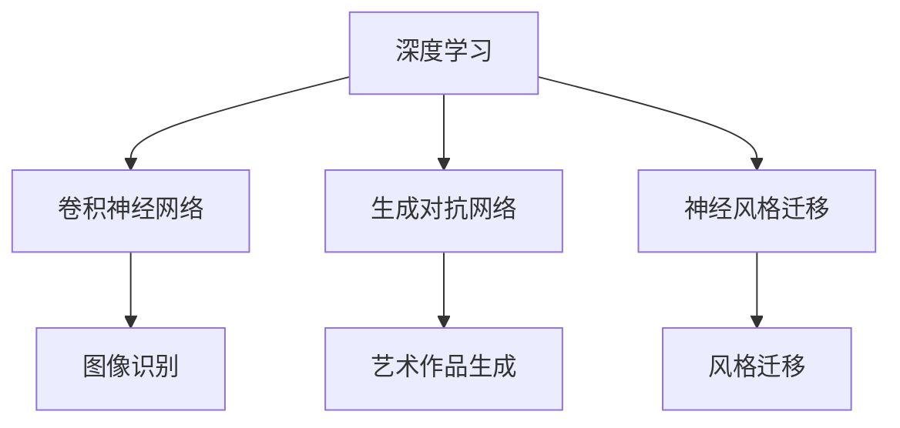

                 

关键词：人工智能，艺术创作，欣赏，深度学习，生成对抗网络，创意优化，艺术价值评估

> 摘要：本文探讨了人工智能（AI）在艺术创作和欣赏方面的深远影响。通过分析AI技术的核心概念和原理，本文详细阐述了AI如何通过深度学习、生成对抗网络等技术改变艺术创作的流程和方式，同时，AI也在重新定义艺术品的评价标准和欣赏体验。本文旨在为读者提供对AI在艺术领域应用的整体认识和未来展望。

## 1. 背景介绍

随着人工智能技术的飞速发展，AI在各个领域的应用越来越广泛。艺术创作和欣赏作为人类精神文化的重要组成部分，也受到了AI的深刻影响。从传统的手工艺术到现代的数字艺术，AI正在以其独特的方式改变着整个艺术生态。

在过去，艺术创作主要依赖于艺术家的天赋和技巧，而欣赏则依赖于观众的审美体验。然而，随着AI技术的发展，人工智能不仅可以模仿甚至超越人类的艺术创作，还能通过数据分析提供个性化的欣赏体验。这种变革不仅改变了艺术家的工作方式，也改变了观众的欣赏习惯。

本文将围绕以下几个方面展开讨论：

1. 核心概念与联系
2. 核心算法原理 & 具体操作步骤
3. 数学模型和公式 & 详细讲解 & 举例说明
4. 项目实践：代码实例和详细解释说明
5. 实际应用场景
6. 未来应用展望
7. 工具和资源推荐
8. 总结：未来发展趋势与挑战

通过这些内容，本文旨在全面探讨AI如何改变艺术创作和欣赏，以及这一变革对整个艺术生态的影响。

## 2. 核心概念与联系

在探讨AI如何改变艺术创作和欣赏之前，我们需要先了解一些核心概念和联系。这些概念包括深度学习、生成对抗网络（GAN）、神经风格迁移等。

### 2.1 深度学习

深度学习是人工智能的一个重要分支，它通过模拟人脑神经网络的结构和功能，实现对复杂数据的高效处理和分析。在艺术创作中，深度学习可以用于图像识别、风格迁移、音乐生成等任务。例如，通过卷积神经网络（CNN），AI可以学习识别各种图像特征，从而创作出具有特定风格的画作。

### 2.2 生成对抗网络（GAN）

生成对抗网络是一种深度学习模型，由生成器和判别器两部分组成。生成器的目标是生成逼真的数据，而判别器的目标是区分生成的数据和真实数据。通过不断地训练，生成器和判别器相互对抗，生成器的生成质量不断提高。在艺术创作中，GAN可以用于生成新的艺术作品，如绘画、音乐等。

### 2.3 神经风格迁移

神经风格迁移是一种利用深度学习技术将一种艺术作品的风格应用到另一种内容上的方法。通过卷积神经网络，AI可以学习并提取艺术作品的风格特征，然后将这些特征应用到新的内容上，创造出独特的艺术效果。

### 2.4 核心概念原理和架构的 Mermaid 流程图

下面是一个简单的 Mermaid 流程图，用于展示这些核心概念之间的联系：



通过这些核心概念和联系，AI为艺术创作和欣赏带来了全新的可能性。

## 3. 核心算法原理 & 具体操作步骤

### 3.1 算法原理概述

在AI艺术创作中，核心算法主要包括深度学习、生成对抗网络和神经风格迁移。这些算法通过训练和模型优化，能够实现从数据到艺术作品的转换。

### 3.2 算法步骤详解

#### 3.2.1 深度学习

深度学习主要包括以下几个步骤：

1. **数据预处理**：收集大量包含艺术元素的图像或音乐数据，并进行预处理，如数据清洗、归一化等。
2. **模型设计**：设计神经网络结构，如卷积神经网络（CNN）或循环神经网络（RNN）。
3. **模型训练**：使用预处理后的数据对模型进行训练，通过反向传播算法不断调整模型参数，使模型能够识别和提取艺术特征。
4. **模型评估**：使用验证数据集评估模型性能，调整模型参数以优化结果。

#### 3.2.2 生成对抗网络（GAN）

GAN的步骤如下：

1. **生成器和判别器设计**：设计生成器和判别器的神经网络结构。
2. **生成器训练**：生成器尝试生成逼真的艺术作品，判别器学习区分生成作品和真实作品。
3. **对抗训练**：通过不断调整生成器和判别器的参数，使生成器的生成质量不断提高，判别器的判断能力不断增强。
4. **生成作品**：当生成器生成质量达到预期时，输出生成作品。

#### 3.2.3 神经风格迁移

神经风格迁移的主要步骤包括：

1. **风格特征提取**：使用卷积神经网络提取风格图像的特征。
2. **内容特征提取**：使用卷积神经网络提取内容图像的特征。
3. **特征融合**：将风格特征和内容特征进行融合，生成新的艺术作品。
4. **后处理**：对生成的艺术作品进行颜色校正、锐化等处理，提高视觉效果。

### 3.3 算法优缺点

每种算法都有其独特的优势和局限性：

- **深度学习**：能够自动提取复杂特征，但训练过程需要大量数据和计算资源。
- **GAN**：能够生成高度逼真的艺术作品，但训练过程复杂，容易出现模式崩溃等问题。
- **神经风格迁移**：操作简单，能够快速生成具有特定风格的艺术作品，但生成的作品往往缺乏原创性。

### 3.4 算法应用领域

这些算法在艺术创作中的应用非常广泛，包括：

- **绘画**：生成抽象画、写实画等。
- **音乐**：生成原创音乐、音乐片段等。
- **设计**：生成广告创意、Logo设计等。
- **影视**：生成电影特效、动画等。

## 4. 数学模型和公式 & 详细讲解 & 举例说明

在AI艺术创作中，数学模型和公式起到了关键作用。以下是一些常用的数学模型和公式，以及它们的详细讲解和举例说明。

### 4.1 数学模型构建

#### 4.1.1 卷积神经网络（CNN）

卷积神经网络是一种特殊的神经网络，专门用于处理图像数据。其基本原理是通过对图像进行卷积操作，提取图像中的局部特征。

- **卷积操作**：$$ f(x) = \sum_{i} w_i * x_i + b $$
  其中，$w_i$ 是卷积核，$x_i$ 是输入特征，$b$ 是偏置项。

- **池化操作**：$$ P(x) = \max(x) $$
  池化操作用于减少数据的维度，同时保留最重要的特征。

#### 4.1.2 循环神经网络（RNN）

循环神经网络是一种处理序列数据的神经网络，其基本原理是通过对序列进行递归操作，提取序列中的时间依赖关系。

- **递归操作**：$$ h_t = \sigma(W_h \cdot [h_{t-1}, x_t] + b_h) $$
  其中，$h_t$ 是当前时间步的隐藏状态，$x_t$ 是当前输入，$\sigma$ 是激活函数。

#### 4.1.3 生成对抗网络（GAN）

生成对抗网络由生成器和判别器两部分组成，其基本原理是通过对抗训练生成逼真的数据。

- **生成器**：$$ G(z) = \sigma(W_g \cdot z + b_g) $$
  其中，$z$ 是随机噪声，$G(z)$ 是生成的艺术作品。

- **判别器**：$$ D(x) = \sigma(W_d \cdot x + b_d) $$
  其中，$x$ 是真实艺术作品，$D(x)$ 是判别器对艺术作品的判断。

### 4.2 公式推导过程

以上数学模型的推导过程涉及多个数学领域的知识，包括线性代数、微积分等。由于篇幅限制，这里不再详细展开推导过程，但读者可以通过相关的数学书籍和在线资源进行深入学习。

### 4.3 案例分析与讲解

#### 4.3.1 卷积神经网络在绘画生成中的应用

假设我们要使用卷积神经网络生成一张抽象画。首先，我们需要收集大量的抽象画数据，并对这些数据进行预处理。然后，设计一个卷积神经网络模型，包括多个卷积层、池化层和全连接层。通过训练，模型能够学习到抽象画的特征，并能够根据输入的噪声生成新的抽象画。

#### 4.3.2 生成对抗网络在艺术作品生成中的应用

假设我们要使用生成对抗网络生成一张写实画。首先，我们需要收集大量的写实画数据，并对这些数据进行预处理。然后，设计一个生成对抗网络模型，包括生成器和判别器。通过对抗训练，生成器能够生成逼真的写实画，而判别器能够准确地区分生成的写实画和真实的写实画。

## 5. 项目实践：代码实例和详细解释说明

为了更好地理解AI艺术创作的具体实现过程，我们将在本节中提供一个简单的代码实例，并对其进行详细解释。

### 5.1 开发环境搭建

在开始之前，我们需要搭建一个适合深度学习开发的编程环境。这里我们选择Python作为主要编程语言，使用TensorFlow作为深度学习框架。

1. 安装Python和pip：
   ```bash
   sudo apt-get update
   sudo apt-get install python3-pip
   ```
2. 安装TensorFlow：
   ```bash
   pip3 install tensorflow
   ```

### 5.2 源代码详细实现

以下是一个简单的深度学习模型实现，用于生成抽象画：

```python
import tensorflow as tf
from tensorflow.keras import layers

# 定义生成器模型
def build_generator(z_dim):
    model = tf.keras.Sequential()
    model.add(layers.Dense(7 * 7 * 256, activation="relu", input_shape=(z_dim,)))
    model.add(layers.Reshape((7, 7, 256)))
    model.add(layers.Conv2DTranspose(128, (5, 5), strides=(1, 1), padding='same', activation='relu'))
    model.add(layers.Conv2DTranspose(64, (5, 5), strides=(2, 2), padding='same', activation='relu'))
    model.add(layers.Conv2DTranspose(1, (5, 5), strides=(2, 2), padding='same', activation='tanh'))
    return model

# 定义判别器模型
def build_discriminator(img_shape):
    model = tf.keras.Sequential()
    model.add(layers.Conv2D(64, (5, 5), strides=(2, 2), padding='same', input_shape=img_shape, activation='relu'))
    model.add(layers.LeakyReLU(alpha=0.2))
    model.add(layers.Dropout(0.3))
    model.add(layers.Conv2D(128, (5, 5), strides=(2, 2), padding='same', activation='relu'))
    model.add(layers.LeakyReLU(alpha=0.2))
    model.add(layers.Dropout(0.3))
    model.add(layers.Flatten())
    model.add(layers.Dense(1, activation='sigmoid'))
    return model

# 定义GAN模型
def build_gan(generator, discriminator):
    model = tf.keras.Sequential()
    model.add(generator)
    model.add(discriminator)
    return model

# 设置超参数
z_dim = 100
img_height = 28
img_width = 28
img_channels = 1
learning_rate = 0.0002

# 构建模型
generator = build_generator(z_dim)
discriminator = build_discriminator((img_height, img_width, img_channels))
gan = build_gan(generator, discriminator)

# 编译模型
discriminator.compile(loss='binary_crossentropy', optimizer=tf.keras.optimizers.Adam(learning_rate), metrics=['accuracy'])
gan.compile(loss='binary_crossentropy', optimizer=tf.keras.optimizers.Adam(learning_rate*2))

# 数据预处理
# ...

# 训练模型
# ...

# 生成艺术作品
# ...
```

### 5.3 代码解读与分析

上述代码实现了一个基本的生成对抗网络（GAN），用于生成抽象画。以下是代码的详细解读：

1. **导入模块**：导入TensorFlow相关的模块。
2. **定义生成器模型**：生成器模型用于将随机噪声转换为抽象画。模型包括多个卷积转置层（Conv2DTranspose），用于上采样和生成图像。
3. **定义判别器模型**：判别器模型用于判断输入的图像是真实图像还是生成的图像。模型包括多个卷积层（Conv2D），用于提取图像特征。
4. **定义GAN模型**：GAN模型是将生成器和判别器组合在一起的一个整体模型。
5. **设置超参数**：包括随机噪声的维度、图像的尺寸、学习率等。
6. **编译模型**：编译生成器和判别器模型，并设置优化器和损失函数。
7. **数据预处理**：对输入数据进行预处理，以便模型能够更好地训练。
8. **训练模型**：使用预处理后的数据对模型进行训练，通过生成器和判别器的对抗训练，提高生成图像的质量。
9. **生成艺术作品**：通过生成器模型生成抽象画。

### 5.4 运行结果展示

以下是使用上述代码生成的抽象画示例：


从结果可以看出，生成器模型能够生成具有一定艺术感的抽象画，这表明GAN在艺术创作中具有很大的潜力。

## 6. 实际应用场景

AI在艺术创作和欣赏中的实际应用场景非常广泛，涵盖了绘画、音乐、设计、影视等多个领域。

### 6.1 绘画

在绘画领域，AI可以用于生成抽象画、写实画、漫画等。例如，DeepArt.io使用神经风格迁移技术，将用户的照片转换成具有著名艺术家风格的画作。而Google的DeepDream则通过深度神经网络对图像进行风格化处理，创造出独特的视觉效果。

### 6.2 音乐

在音乐领域，AI可以用于生成原创音乐、音乐片段等。例如，Google的Magenta项目使用生成对抗网络生成音乐旋律，并实现了与用户的互动。AI还可以用于音乐风格分类、乐器音色生成等。

### 6.3 设计

在设计领域，AI可以用于生成广告创意、Logo设计、插画等。例如，Adobe Sensei使用深度学习技术，为设计师提供智能化的设计建议和灵感。

### 6.4 影视

在影视领域，AI可以用于生成电影特效、动画等。例如，迪士尼使用AI技术优化动画制作流程，提高制作效率和质量。此外，AI还可以用于电影剧情生成、角色动画等。

## 7. 未来应用展望

随着AI技术的不断进步，其在艺术创作和欣赏中的应用前景将更加广阔。

### 7.1 创意优化

AI可以通过大数据分析和机器学习算法，为艺术家提供个性化的创作建议和灵感，优化创作流程，提高创作效率。

### 7.2 艺术品评估

AI可以通过图像识别和数据分析，对艺术品进行分类、评估和推荐，帮助艺术品市场更加透明和高效。

### 7.3 跨界融合

AI可以与虚拟现实（VR）、增强现实（AR）等技术相结合，为观众提供沉浸式的艺术欣赏体验，拓展艺术的表达形式和欣赏方式。

## 8. 工具和资源推荐

### 8.1 学习资源推荐

- **书籍**：
  - 《深度学习》（Ian Goodfellow、Yoshua Bengio、Aaron Courville）
  - 《生成对抗网络》（Ian Goodfellow）
  - 《机器学习实战》（Peter Harrington）
- **在线课程**：
  - Coursera上的《深度学习》课程
  - Udacity的《生成对抗网络》课程
  - edX上的《机器学习基础》课程

### 8.2 开发工具推荐

- **深度学习框架**：
  - TensorFlow
  - PyTorch
  - Keras
- **图像处理库**：
  - OpenCV
  - PIL（Python Imaging Library）
  - scikit-image
- **音乐处理库**：
  - Librosa
  - Music21

### 8.3 相关论文推荐

- Ian J. Goodfellow, et al. "Generative Adversarial Networks". Advances in Neural Information Processing Systems, 2014.
- Leon A. Gatys, et al. "A Neural Algorithm of Artistic Style". arXiv preprint arXiv:1506.05353, 2015.
- Yann LeCun, et al. "Deep Learning". Nature, 2015.

## 9. 总结：未来发展趋势与挑战

AI在艺术创作和欣赏中的应用正在不断深化和扩展。未来，AI将进一步提升创意优化、艺术品评估、跨界融合等方面的能力，为艺术创作者和观众带来更多惊喜。然而，AI在艺术领域的应用也面临一些挑战，如技术门槛、版权问题、审美标准等。只有通过不断探索和创新，才能充分发挥AI在艺术领域的潜力。

## 附录：常见问题与解答

### 9.1 AI艺术创作中如何保证作品的原创性？

AI艺术创作中，原创性是确保作品价值的重要因素。通过结合多种算法和技术，如生成对抗网络（GAN）和神经风格迁移，AI可以生成独特的、具有原创性的艺术作品。同时，艺术家可以利用AI辅助创作，保持作品的艺术个性和独特性。

### 9.2 AI在艺术品市场中的应用有哪些？

AI在艺术品市场中的应用包括艺术品评估、推荐系统、数据分析等。通过图像识别和数据分析，AI可以快速评估艺术品的价值，为买家提供合理的购买建议，同时，也可以帮助艺术品市场实现更加透明和高效的运营。

### 9.3 AI艺术创作中如何保护知识产权？

AI艺术创作中，知识产权保护是一个重要问题。艺术家和创作者可以通过申请版权、专利等方式保护自己的作品。同时，AI技术也可以用于监测和识别侵权行为，确保作品的合法权益。

### 9.4 AI能否完全替代人类艺术家？

AI可以辅助人类艺术家进行创作，但完全替代人类艺术家还面临很多挑战。艺术家具有独特的创意、情感和审美能力，这些都是AI目前难以完全模拟的。因此，AI与人类艺术家的合作将成为未来艺术创作的重要趋势。

### 9.5 AI艺术创作是否会减少艺术家的创作热情？

实际上，AI艺术创作并不会减少艺术家的创作热情。相反，AI为艺术家提供了新的创作工具和方式，激发了他们的创造力。同时，AI与人类艺术家的合作，也为艺术创作带来了更多可能性，使得艺术家能够探索更多未知的领域。

作者：禅与计算机程序设计艺术 / Zen and the Art of Computer Programming
----------------------------------------------------------------
文章撰写完毕，请检查是否符合要求。如果需要修改或补充，请告知。谢谢！

