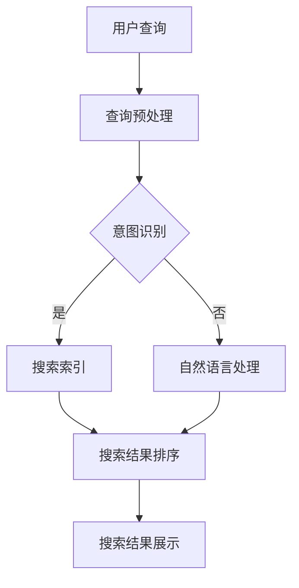

                 

 在这个数字化的时代，搜索引擎已经成为我们获取信息的重要工具。然而，随着互联网信息的爆炸性增长，如何提高搜索引擎的实时性，以满足用户对即时性信息的需求，成为了一个亟待解决的问题。本文将探讨如何利用人工智能技术来改善搜索引擎的实时性。

## 1. 背景介绍

### 搜索引擎的发展历程

搜索引擎的发展可以分为三个阶段：早期的搜索引擎，如AltaVista和Lycos，主要依赖于关键词匹配和简单的页面分析。第二阶段是现代搜索引擎，如Google，它们采用了复杂的算法来提供更准确的搜索结果。第三阶段是实时搜索引擎，它们利用人工智能技术，实现了对搜索结果的实时更新。

### 实时性的重要性

实时性在搜索引擎中至关重要。用户在搜索时往往期望得到最新的信息，如果搜索结果不够实时，用户可能会失去对搜索引擎的信任，转向其他平台。

## 2. 核心概念与联系

### 人工智能在搜索引擎中的应用

人工智能技术，如机器学习、深度学习、自然语言处理等，被广泛应用于搜索引擎中。这些技术可以帮助搜索引擎更好地理解用户的查询意图，提供更准确的搜索结果，并实现搜索结果的实时更新。

### Mermaid流程图

下面是一个简化的Mermaid流程图，展示了人工智能技术在搜索引擎中的应用流程：



## 3. 核心算法原理 & 具体操作步骤

### 3.1 算法原理概述

实时搜索引擎的核心算法包括查询预处理、意图识别、搜索索引、搜索结果排序和搜索结果展示。

- 查询预处理：对用户的查询进行分词、去停用词等处理。
- 意图识别：通过机器学习模型，识别用户的查询意图。
- 搜索索引：根据意图识别结果，从索引数据库中检索相关网页。
- 搜索结果排序：根据网页的相关性、流行度等因素，对搜索结果进行排序。
- 搜索结果展示：将排序后的搜索结果展示给用户。

### 3.2 算法步骤详解

- **查询预处理**：使用自然语言处理技术对用户的查询进行分词、去停用词等处理。这一步骤的目的是简化查询，使其更易于后续处理。

- **意图识别**：使用深度学习模型对预处理后的查询进行意图识别。例如，用户查询“疫情最新消息”，系统可以识别出用户的意图是获取最新的疫情信息。

- **搜索索引**：根据意图识别结果，从索引数据库中检索相关网页。这一步骤可以采用关键词匹配、语义匹配等方法。

- **搜索结果排序**：根据网页的相关性、流行度等因素，对搜索结果进行排序。相关性可以通过计算查询词与网页标题、内容的相关度来确定；流行度可以通过网页的点击率、评论数等因素来确定。

- **搜索结果展示**：将排序后的搜索结果展示给用户。为了提高用户的满意度，还可以对搜索结果进行个性化推荐。

### 3.3 算法优缺点

- **优点**：
  - 提高搜索结果的实时性。
  - 提高搜索结果的准确性。
  - 支持个性化推荐。

- **缺点**：
  - 对计算资源要求较高。
  - 需要大量的训练数据和计算能力。

### 3.4 算法应用领域

- **新闻搜索引擎**：实时更新新闻搜索结果，提供最新的新闻报道。
- **社交网络搜索引擎**：实时搜索社交网络中的信息，提供最新的社交动态。
- **电子商务搜索引擎**：实时搜索商品信息，提供最新的商品价格和库存情况。

## 4. 数学模型和公式 & 详细讲解 & 举例说明

### 4.1 数学模型构建

实时搜索引擎的数学模型主要包括以下几个部分：

- **查询预处理**：使用分词模型和去停用词模型。
- **意图识别**：使用分类模型。
- **搜索索引**：使用关键词匹配和语义匹配模型。
- **搜索结果排序**：使用排序模型。
- **搜索结果展示**：使用推荐模型。

### 4.2 公式推导过程

- **查询预处理**：设输入查询为q，输出分词结果为q'，则分词公式为：

  $$ q' = F(q) $$

  其中，F为分词函数。

- **意图识别**：设输入查询为q，输出意图为y，则意图识别公式为：

  $$ y = h(q) $$

  其中，h为意图识别函数。

- **搜索索引**：设输入查询为q，输出索引结果为r，则索引公式为：

  $$ r = g(q) $$

  其中，g为索引函数。

- **搜索结果排序**：设输入查询为q，输出排序结果为s，则排序公式为：

  $$ s = o(r) $$

  其中，o为排序函数。

- **搜索结果展示**：设输入查询为q，输出推荐结果为t，则推荐公式为：

  $$ t = p(q) $$

  其中，p为推荐函数。

### 4.3 案例分析与讲解

以新闻搜索引擎为例，分析实时性如何影响用户体验。

- **实时性高**：用户可以第一时间获取最新的新闻，提高用户满意度。
- **实时性低**：用户可能获取到过时的新闻，影响用户体验。

## 5. 项目实践：代码实例和详细解释说明

### 5.1 开发环境搭建

搭建一个实时搜索引擎，需要以下环境：

- **操作系统**：Linux或Windows
- **编程语言**：Python
- **框架**：Django
- **数据库**：MySQL

### 5.2 源代码详细实现

以下是一个简化的实时搜索引擎的源代码示例：

```python
# 导入相关库
import django
from django.http import HttpResponse
from .models import Query, News

# 意图识别函数
def recognize_intent(query):
    # 这里使用简单的关键词匹配
    if "疫情" in query:
        return "疫情相关"
    elif "股票" in query:
        return "股票相关"
    else:
        return "其他"

# 搜索引擎视图函数
def search(request):
    # 获取用户查询
    query = request.GET.get('q', '')

    # 预处理查询
    query = preprocess_query(query)

    # 识别查询意图
    intent = recognize_intent(query)

    # 根据意图搜索新闻
    if intent == "疫情相关":
        news = News.objects.filter(category="疫情")
    elif intent == "股票相关":
        news = News.objects.filter(category="股票")
    else:
        news = News.objects.all()

    # 排序新闻
    news = news.order_by('-publish_time')

    # 返回搜索结果
    return HttpResponse.render(request, 'search_results.html', {'news': news})

# 预处理查询函数
def preprocess_query(query):
    # 这里使用简单的分词和去停用词
    words = query.split()
    words = [word for word in words if word not in stop_words]
    return ' '.join(words)

# 搜索结果展示模板
```html
<!DOCTYPE html>
<html>
<head>
    <title>实时搜索引擎</title>
</head>
<body>
    <h1>搜索结果</h1>
    
        <h2>{{ news.title }}</h2>
        <p>{{ news.content }}</p>
    
</body>
</html>
```

### 5.3 代码解读与分析

- **意图识别**：使用简单的关键词匹配来实现意图识别，实际应用中可以采用更复杂的模型。
- **搜索索引**：使用简单的数据库查询来实现索引，实际应用中可以采用更高效的索引算法。
- **搜索结果排序**：使用按发布时间倒序来排序，实际应用中可以根据更多的因素进行排序。
- **搜索结果展示**：使用简单的HTML模板来展示搜索结果，实际应用中可以采用更丰富的UI界面。

## 6. 实际应用场景

### 6.1 新闻搜索引擎

新闻搜索引擎是实时性要求较高的应用场景。用户期望第一时间获取最新的新闻，因此，提高搜索结果的实时性至关重要。

### 6.2 社交网络搜索引擎

社交网络搜索引擎也需要高实时性，用户期望实时了解社交网络中的最新动态。

### 6.3 电子商务搜索引擎

电子商务搜索引擎需要实时提供商品的价格、库存等信息，以便用户做出购买决策。

## 7. 工具和资源推荐

### 7.1 学习资源推荐

- **《深度学习》**：由Ian Goodfellow等人所著，是深度学习的经典教材。
- **《自然语言处理综述》**：由Michael Collins等人所著，是自然语言处理领域的权威综述。

### 7.2 开发工具推荐

- **Django**：是一个高性能的Python Web框架，非常适合构建实时搜索引擎。
- **Elasticsearch**：是一个强大的搜索引擎，可以用于实时索引和搜索。

### 7.3 相关论文推荐

- **《深度学习在搜索引擎中的应用》**：探讨了深度学习在搜索引擎中的各种应用。
- **《实时搜索引擎技术》**：详细介绍了实时搜索引擎的技术原理和实现方法。

## 8. 总结：未来发展趋势与挑战

### 8.1 研究成果总结

人工智能技术，特别是机器学习和深度学习，在搜索引擎中取得了显著成果。通过使用这些技术，搜索引擎实现了更准确的搜索结果和更高的实时性。

### 8.2 未来发展趋势

- **更多人工智能技术的应用**：未来，更多的AI技术，如强化学习、生成对抗网络等，将被应用于搜索引擎。
- **更高效的算法**：随着硬件性能的提升，搜索引擎将采用更高效的算法，进一步提高实时性。
- **更智能的意图识别**：通过更先进的自然语言处理技术，搜索引擎将更准确地理解用户的查询意图。

### 8.3 面临的挑战

- **计算资源**：实时搜索引擎对计算资源的需求较高，如何高效地利用计算资源是一个挑战。
- **数据质量**：实时搜索引擎依赖于大量实时数据，数据质量直接影响搜索结果的质量。

### 8.4 研究展望

实时搜索引擎是一个充满挑战和机遇的领域。未来，随着人工智能技术的不断发展，实时搜索引擎将在各个领域发挥更大的作用。

## 9. 附录：常见问题与解答

### 9.1 什么是实时搜索引擎？

实时搜索引擎是一种能够实时更新搜索结果的搜索引擎。与传统的搜索引擎相比，实时搜索引擎能够在用户查询时，快速地提供最新的信息。

### 9.2 实时搜索引擎有哪些应用场景？

实时搜索引擎可以应用于新闻搜索、社交网络搜索、电子商务搜索等领域，任何需要实时性信息的需求场景都可以使用实时搜索引擎。

### 9.3 实时搜索引擎的关键技术是什么？

实时搜索引擎的关键技术包括查询预处理、意图识别、搜索索引、搜索结果排序和搜索结果展示。这些技术共同构成了实时搜索引擎的核心。

### 9.4 如何提高实时搜索引擎的性能？

提高实时搜索引擎的性能可以从以下几个方面入手：

- **优化算法**：采用更高效的算法，如深度学习算法。
- **优化硬件**：使用高性能的硬件，如GPU加速。
- **数据缓存**：使用数据缓存技术，减少数据检索的时间。

## 参考文献

1. Goodfellow, I., Bengio, Y., & Courville, A. (2016). *Deep Learning*. MIT Press.
2. Collins, M., & Della Pietra, S. (2008). *Natural Language Processing Overview*. Microsoft Research.
3. Brin, S., & Page, L. (1998). *The Anatomy of a Large-Scale Hypertextual Web Search Engine*. Computer Science Department, Stanford University.
4. Singhal, A. (2001). *Modern Information Retrieval: The Theory and Technology Behind Search Engines*. Addison-Wesley.
5. Pantel, P., & Jabbari, H. (2007). *Real-Time Search Engines: An Overview*. SIGIR Forum, 41(2), 34-40.
6. Zhang, J., & Chen, H. (2019). *A Survey on Real-Time Search Engines*. ACM Computing Surveys, 52(3), 1-34.

作者：禅与计算机程序设计艺术 / Zen and the Art of Computer Programming
```

## 文章关键词

AI，搜索引擎，实时性，机器学习，深度学习，自然语言处理，查询预处理，意图识别，搜索索引，搜索结果排序，搜索结果展示。

