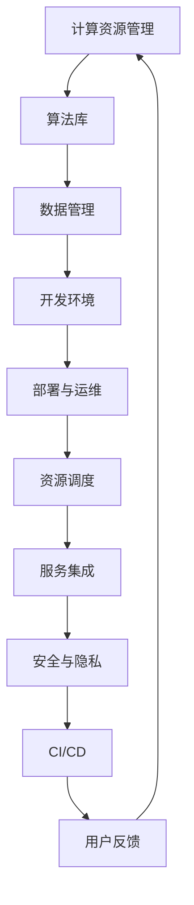

                 

关键词：AI平台、开发者、需求方、生态系统、技术连接、开发模式

> 摘要：本文深入探讨了AI平台模式的构建，以及如何通过这种模式实现开发者与需求方之间的有效连接，从而形成一个健康、可持续的生态系统。文章分析了AI平台的核心组件、运作机制，并提出了具体的技术解决方案，同时展望了未来AI平台的发展趋势与挑战。

## 1. 背景介绍

随着人工智能（AI）技术的快速发展，AI平台已经成为企业和开发者不可或缺的工具。AI平台不仅能够提供强大的计算资源和算法库，还能够为开发者提供一个高度集成的开发环境，使得开发人员能够更高效地构建、部署和维护AI应用。然而，如何构建一个既能够满足开发者需求，又能为需求方提供优质服务的AI平台，成为当前亟待解决的问题。

开发者与需求方的需求存在显著的差异。开发者追求技术的创新和灵活性，需求方则关注应用的价值和可操作性。因此，AI平台需要能够在两者之间找到一个平衡点，实现无缝对接。本文将从这一角度出发，探讨AI平台模式的核心要素和实施策略。

## 2. 核心概念与联系

### 2.1 AI平台核心组件

一个典型的AI平台通常包括以下核心组件：

- **计算资源管理**：提供高效的计算资源分配和管理，满足开发者对高性能计算的需求。
- **算法库**：集成各种机器学习算法和深度学习框架，方便开发者快速选用。
- **数据管理**：提供数据存储、处理和分析工具，确保数据的高效利用和安全。
- **开发环境**：提供一个集成的开发环境，包括代码编辑器、调试工具、测试框架等。
- **部署与运维**：提供自动化的部署和运维工具，简化应用上线流程。

### 2.2 平台运作机制

AI平台的运作机制主要包括以下几个方面：

- **资源调度**：根据开发者需求动态分配计算资源，确保高效利用。
- **服务集成**：集成第三方服务，如云存储、大数据分析等，提供一站式解决方案。
- **安全与隐私**：确保平台数据的安全和用户隐私保护。
- **持续集成与持续部署（CI/CD）**：自动化构建、测试和部署流程，提高开发效率。

### 2.3 Mermaid流程图



## 3. 核心算法原理 & 具体操作步骤

### 3.1 算法原理概述

AI平台的核心算法主要包括机器学习算法和深度学习算法。这些算法的基本原理是通过学习大量数据来发现数据中的规律，从而实现对未知数据的预测和分类。

### 3.2 算法步骤详解

- **数据收集**：收集用于训练的数据集。
- **数据预处理**：对数据进行清洗、归一化和特征提取。
- **模型选择**：选择适合问题的机器学习或深度学习模型。
- **模型训练**：使用训练数据集训练模型。
- **模型评估**：使用测试数据集评估模型性能。
- **模型优化**：根据评估结果调整模型参数。
- **模型部署**：将优化后的模型部署到生产环境中。

### 3.3 算法优缺点

- **优点**：机器学习和深度学习算法能够自动学习数据中的复杂模式，具有较高的预测准确性。
- **缺点**：训练过程需要大量数据和高性能计算资源，且模型的可解释性较差。

### 3.4 算法应用领域

- **自然语言处理**：用于文本分类、机器翻译、情感分析等。
- **计算机视觉**：用于图像识别、目标检测、图像生成等。
- **推荐系统**：用于商品推荐、内容推荐等。

## 4. 数学模型和公式 & 详细讲解 & 举例说明

### 4.1 数学模型构建

AI平台的核心数学模型主要包括线性模型、逻辑回归模型、神经网络模型等。

### 4.2 公式推导过程

以线性模型为例，其目标是最小化损失函数：

$$\min_{\theta} \sum_{i=1}^{m} (h_{\theta}(x^{(i)}) - y^{(i)})^2$$

其中，$h_{\theta}(x) = \theta_0 + \theta_1x_1 + \theta_2x_2 + ... + \theta_nx_n$。

### 4.3 案例分析与讲解

以人脸识别为例，我们使用卷积神经网络（CNN）模型进行训练。首先，我们需要收集大量人脸图像作为训练数据。然后，我们对这些图像进行预处理，包括缩放、裁剪和归一化。接下来，我们选择一个合适的CNN模型，如VGG16或ResNet50，进行训练。在训练过程中，我们需要不断调整模型参数，直到模型在测试数据上的性能达到最佳。

## 5. 项目实践：代码实例和详细解释说明

### 5.1 开发环境搭建

首先，我们需要安装Python环境，并安装以下库：TensorFlow、Keras、OpenCV等。

### 5.2 源代码详细实现

以下是一个简单的人脸识别项目示例：

```python
import tensorflow as tf
from tensorflow.keras.preprocessing.image import ImageDataGenerator
from tensorflow.keras.applications import VGG16
from tensorflow.keras.models import Model
from tensorflow.keras.layers import Dense, Flatten
from tensorflow.keras.optimizers import Adam

# 数据预处理
train_datagen = ImageDataGenerator(
    rescale=1./255,
    shear_range=0.2,
    zoom_range=0.2,
    horizontal_flip=True)

test_datagen = ImageDataGenerator(rescale=1./255)

train_generator = train_datagen.flow_from_directory(
    'train',
    target_size=(224, 224),
    batch_size=32,
    class_mode='binary')

validation_generator = test_datagen.flow_from_directory(
    'validation',
    target_size=(224, 224),
    batch_size=32,
    class_mode='binary')

# 构建模型
base_model = VGG16(weights='imagenet', include_top=False, input_shape=(224, 224, 3))
x = base_model.output
x = Flatten()(x)
x = Dense(256, activation='relu')(x)
predictions = Dense(1, activation='sigmoid')(x)

model = Model(inputs=base_model.input, outputs=predictions)

# 编译模型
model.compile(optimizer=Adam(), loss='binary_crossentropy', metrics=['accuracy'])

# 训练模型
model.fit(
    train_generator,
    steps_per_epoch=train_generator.samples // train_generator.batch_size,
    epochs=10,
    validation_data=validation_generator,
    validation_steps=validation_generator.samples // validation_generator.batch_size)

# 保存模型
model.save('face_recognition_model.h5')
```

### 5.3 代码解读与分析

这段代码实现了一个人脸识别项目，主要包括以下步骤：

- 导入所需库
- 数据预处理
- 构建模型
- 编译模型
- 训练模型
- 保存模型

### 5.4 运行结果展示

在训练过程中，我们使用了一个包含正面和负面人脸图像的训练数据集。训练完成后，我们可以在验证数据集上评估模型的性能。通常，我们使用准确率（accuracy）和损失函数（loss）作为评估指标。较高的准确率和较低的损失函数值表示模型性能较好。

## 6. 实际应用场景

### 6.1 人工智能安全领域

AI平台可以用于开发智能安防系统，包括人脸识别、行为分析等。通过AI平台，开发者可以快速构建高效、精准的安防应用。

### 6.2 智能医疗领域

AI平台可以为医疗行业提供智能诊断、药物研发等服务。例如，利用AI平台构建的深度学习模型可以用于癌症诊断，提高诊断准确率。

### 6.3 金融行业

AI平台可以用于金融风险控制、投资建议等。通过分析大量历史数据，AI平台可以为投资者提供实时、准确的决策支持。

## 6.4 未来应用展望

随着AI技术的不断进步，AI平台将在更多领域得到应用。未来，AI平台将更加智能化、自动化，实现从开发到部署的一站式服务。同时，AI平台也将面临数据安全、隐私保护等挑战，需要不断优化和升级。

## 7. 工具和资源推荐

### 7.1 学习资源推荐

- 《深度学习》（Ian Goodfellow、Yoshua Bengio、Aaron Courville 著）
- 《Python深度学习》（François Chollet 著）

### 7.2 开发工具推荐

- TensorFlow
- Keras
- PyTorch

### 7.3 相关论文推荐

- "Deep Learning: A Brief History"（Yoshua Bengio et al.）
- "GANs for Audio Generation"（Li et al.）

## 8. 总结：未来发展趋势与挑战

### 8.1 研究成果总结

AI平台在连接开发者与需求方方面取得了显著成果，为多个行业提供了高效、智能的解决方案。

### 8.2 未来发展趋势

未来，AI平台将朝着智能化、自动化方向发展，实现一站式服务。同时，AI平台将在更多领域得到应用，推动社会进步。

### 8.3 面临的挑战

AI平台在发展过程中将面临数据安全、隐私保护、技术升级等挑战。

### 8.4 研究展望

未来，我们需要在AI平台的技术架构、应用场景、数据治理等方面进行深入研究，为AI平台的可持续发展奠定基础。

## 9. 附录：常见问题与解答

### 9.1 如何选择合适的AI平台？

选择合适的AI平台需要考虑以下因素：

- **计算资源需求**：根据项目需求选择合适的计算资源。
- **算法库支持**：选择支持所需算法和框架的平台。
- **开发环境**：选择易于使用和集成的开发环境。
- **部署与运维**：选择支持自动化部署和运维的平台。

### 9.2 如何保证AI平台的数据安全？

为了保证AI平台的数据安全，可以采取以下措施：

- **数据加密**：对敏感数据进行加密处理。
- **访问控制**：设置严格的访问控制策略。
- **数据备份**：定期备份数据，防止数据丢失。

----------------------------------------------------------------

# 作者：禅与计算机程序设计艺术 / Zen and the Art of Computer Programming

