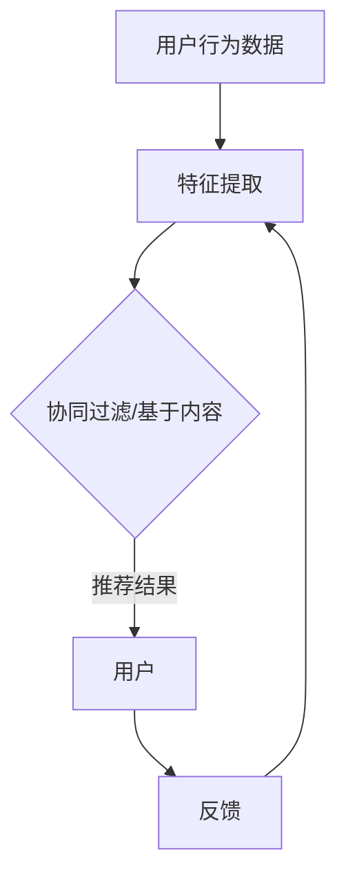

                 

关键词：人工智能，推荐系统，协同过滤，深度学习，内容推荐，个性化，算法改进

> 摘要：本文深入探讨了人工智能技术在推荐系统领域的应用和革新。通过分析协同过滤和深度学习等核心算法的原理、优缺点及实际应用，讨论了AI对推荐系统带来的变革，并对未来的发展趋势和挑战进行了展望。

## 1. 背景介绍

推荐系统是人工智能领域的一个重要分支，旨在通过分析用户的行为和偏好，向用户推荐他们可能感兴趣的内容。随着互联网的普及和数据量的爆炸式增长，推荐系统在电商、社交媒体、视频网站等多个领域发挥着至关重要的作用。传统的推荐系统主要依赖于协同过滤和基于内容的推荐算法，但它们在处理海量数据和提供个性化推荐方面存在一定的局限性。

近年来，人工智能技术的快速发展为推荐系统带来了新的机遇。深度学习作为一种强大的机器学习技术，能够自动从数据中学习特征，从而实现更精准的推荐。此外，基于AI的推荐系统还可以通过不断学习和优化，提高推荐的多样性和用户体验。本文将围绕这些主题，探讨AI技术在推荐系统中的革新和应用。

## 2. 核心概念与联系

为了深入理解AI技术对推荐系统的革新，我们首先需要了解推荐系统的一些核心概念和基本架构。

### 2.1 协同过滤（Collaborative Filtering）

协同过滤是推荐系统中最常用的算法之一，主要基于用户之间的相似性来推荐内容。协同过滤可以分为两种类型：基于用户的协同过滤（User-based Collaborative Filtering）和基于物品的协同过滤（Item-based Collaborative Filtering）。

- **基于用户的协同过滤**：通过计算用户之间的相似度，找出与目标用户相似的其他用户，并推荐这些用户喜欢的物品。
- **基于物品的协同过滤**：通过计算物品之间的相似度，找出与目标物品相似的其他物品，并推荐给用户。

协同过滤算法的优点是简单、易实现，但缺点是容易陷入“数据稀疏”问题，即用户和物品的交互数据不足，导致推荐效果不佳。

### 2.2 基于内容的推荐（Content-based Recommender）

基于内容的推荐算法通过分析用户对某些内容的偏好，将相似的内容推荐给用户。该算法通常基于以下步骤：

1. 提取用户历史行为中的特征，如用户对物品的评分、浏览记录等。
2. 根据提取到的特征，为用户生成一个偏好模型。
3. 根据用户偏好模型，为用户推荐具有相似特征的新内容。

基于内容的推荐算法的优点是能够提供高质量的推荐，但缺点是难以处理冷启动问题，即新用户或新物品没有足够的历史数据。

### 2.3 深度学习与推荐系统

深度学习作为一种强大的机器学习技术，能够自动从数据中学习特征，从而实现更精准的推荐。深度学习在推荐系统中的应用主要包括以下方面：

1. **特征提取**：通过卷积神经网络（CNN）和循环神经网络（RNN）等深度学习模型，自动提取用户行为数据和内容数据中的高阶特征。
2. **模型融合**：将深度学习模型与传统协同过滤和基于内容的推荐算法相结合，提高推荐系统的效果。
3. **模型优化**：利用深度学习技术，对推荐模型进行优化和调参，提高推荐的多样性和用户体验。

### 2.4 Mermaid 流程图

下面是推荐系统基本架构的Mermaid流程图：



## 3. 核心算法原理 & 具体操作步骤

### 3.1 算法原理概述

在介绍具体算法原理之前，我们首先需要了解一些基本概念：

1. **用户行为数据**：包括用户的评分、浏览记录、点击行为等。
2. **内容数据**：包括物品的属性、标签、分类等。
3. **相似度计算**：用于计算用户与用户之间的相似度，或者物品与物品之间的相似度。
4. **推荐策略**：根据用户行为和内容数据，生成推荐结果。

### 3.2 算法步骤详解

下面分别介绍协同过滤、基于内容的推荐算法和深度学习在推荐系统中的应用步骤：

#### 3.2.1 协同过滤

1. **数据预处理**：对用户行为数据和内容数据进行清洗和格式化，将其转换为推荐系统所需的格式。
2. **用户与物品的表示**：将用户和物品映射为向量，以便进行相似度计算。
3. **相似度计算**：使用余弦相似度、皮尔逊相关系数等方法计算用户与用户之间的相似度，或者物品与物品之间的相似度。
4. **推荐生成**：根据相似度计算结果，生成推荐结果。对于基于用户的协同过滤，推荐与目标用户相似的其他用户喜欢的物品；对于基于物品的协同过滤，推荐与目标物品相似的物品。

#### 3.2.2 基于内容的推荐

1. **特征提取**：从用户历史行为和物品属性中提取特征，如词袋模型、TF-IDF等。
2. **用户偏好模型**：利用提取到的特征，为用户生成一个偏好模型。
3. **内容相似度计算**：根据用户偏好模型，计算新内容与用户历史偏好之间的相似度。
4. **推荐生成**：根据相似度计算结果，为用户推荐具有相似特征的新内容。

#### 3.2.3 深度学习

1. **特征提取**：利用卷积神经网络（CNN）和循环神经网络（RNN）等深度学习模型，自动提取用户行为数据和内容数据中的高阶特征。
2. **模型融合**：将提取到的特征输入到深度学习模型中，通过多层神经网络，学习用户行为和内容数据之间的复杂关系。
3. **推荐生成**：根据深度学习模型生成的用户偏好模型，生成推荐结果。

### 3.3 算法优缺点

#### 协同过滤

- **优点**：
  - 简单、易实现。
  - 能处理大规模用户和物品数据。
- **缺点**：
  - 容易陷入“数据稀疏”问题。
  - 难以处理冷启动问题。

#### 基于内容的推荐

- **优点**：
  - 能提供高质量的推荐。
  - 能处理冷启动问题。
- **缺点**：
  - 难以处理大规模用户和物品数据。
  - 需要大量特征工程。

#### 深度学习

- **优点**：
  - 能自动提取高阶特征。
  - 能处理大规模用户和物品数据。
  - 能处理冷启动问题。
- **缺点**：
  - 需要大量计算资源。
  - 难以解释。

### 3.4 算法应用领域

- **电商**：为用户提供个性化的商品推荐，提高购买转化率。
- **社交媒体**：为用户提供感兴趣的内容推荐，增加用户粘性。
- **视频网站**：为用户提供个性化的视频推荐，提高用户观看时长。

## 4. 数学模型和公式 & 详细讲解 & 举例说明

### 4.1 数学模型构建

在推荐系统中，常用的数学模型包括用户和物品的表示、相似度计算等。下面介绍这些模型的基本构建方法和公式。

#### 4.1.1 用户与物品的表示

假设我们有 $m$ 个用户和 $n$ 个物品，每个用户 $u$ 和每个物品 $i$ 都可以用一个向量表示：

- **用户表示**：$u = (u_1, u_2, ..., u_n)$，其中 $u_i$ 表示用户 $u$ 对物品 $i$ 的偏好程度。
- **物品表示**：$i = (i_1, i_2, ..., i_n)$，其中 $i_j$ 表示物品 $i$ 的属性特征。

#### 4.1.2 相似度计算

常用的相似度计算方法有：

1. **余弦相似度**：

$$
sim(u, v) = \frac{u \cdot v}{\|u\| \|v\|}
$$

其中，$u \cdot v$ 表示向量 $u$ 和 $v$ 的点积，$\|u\|$ 和 $\|v\|$ 分别表示向量 $u$ 和 $v$ 的欧几里得范数。

2. **皮尔逊相关系数**：

$$
sim(u, v) = \frac{cov(u, v)}{\sigma_u \sigma_v}
$$

其中，$cov(u, v)$ 表示向量 $u$ 和 $v$ 的协方差，$\sigma_u$ 和 $\sigma_v$ 分别表示向量 $u$ 和 $v$ 的标准差。

### 4.2 公式推导过程

以余弦相似度为例，介绍公式的推导过程。

假设有两个用户 $u$ 和 $v$，它们对 $n$ 个物品的偏好程度分别表示为向量 $u = (u_1, u_2, ..., u_n)$ 和 $v = (v_1, v_2, ..., v_n)$。

1. **计算向量 $u$ 和 $v$ 的点积**：

$$
u \cdot v = u_1 v_1 + u_2 v_2 + ... + u_n v_n
$$

2. **计算向量 $u$ 和 $v$ 的欧几里得范数**：

$$
\|u\| = \sqrt{u_1^2 + u_2^2 + ... + u_n^2}
$$

$$
\|v\| = \sqrt{v_1^2 + v_2^2 + ... + v_n^2}
$$

3. **计算余弦相似度**：

$$
sim(u, v) = \frac{u \cdot v}{\|u\| \|v\|}
$$

$$
sim(u, v) = \frac{u_1 v_1 + u_2 v_2 + ... + u_n v_n}{\sqrt{u_1^2 + u_2^2 + ... + u_n^2} \sqrt{v_1^2 + v_2^2 + ... + v_n^2}}
$$

4. **化简**：

$$
sim(u, v) = \frac{\sum_{i=1}^{n} u_i v_i}{\sqrt{\sum_{i=1}^{n} u_i^2} \sqrt{\sum_{i=1}^{n} v_i^2}}
$$

$$
sim(u, v) = \frac{\sum_{i=1}^{n} u_i v_i}{\sqrt{\sum_{i=1}^{n} u_i^2 \sum_{i=1}^{n} v_i^2}}
$$

$$
sim(u, v) = \frac{\sum_{i=1}^{n} u_i v_i}{\sqrt{(\sum_{i=1}^{n} u_i^2)(\sum_{i=1}^{n} v_i^2)}}
$$

$$
sim(u, v) = \frac{\sum_{i=1}^{n} u_i v_i}{\sqrt{\sum_{i=1}^{n} (u_i v_i)^2}}
$$

$$
sim(u, v) = \frac{\sum_{i=1}^{n} u_i v_i}{\sqrt{u \cdot v}}
$$

### 4.3 案例分析与讲解

下面通过一个简单的案例，展示如何使用余弦相似度计算用户之间的相似度。

假设有两个用户 $u$ 和 $v$，他们对5个物品的偏好程度如下表所示：

| 物品 | 用户 $u$ 的偏好 | 用户 $v$ 的偏好 |
|------|----------------|----------------|
| 1    | 3              | 2              |
| 2    | 4              | 5              |
| 3    | 2              | 3              |
| 4    | 5              | 2              |
| 5    | 1              | 4              |

1. **计算向量 $u$ 和 $v$ 的点积**：

$$
u \cdot v = 3 \times 2 + 4 \times 5 + 2 \times 3 + 5 \times 2 + 1 \times 4 = 38
$$

2. **计算向量 $u$ 和 $v$ 的欧几里得范数**：

$$
\|u\| = \sqrt{3^2 + 4^2 + 2^2 + 5^2 + 1^2} = \sqrt{29}
$$

$$
\|v\| = \sqrt{2^2 + 5^2 + 3^2 + 2^2 + 4^2} = \sqrt{29}
$$

3. **计算余弦相似度**：

$$
sim(u, v) = \frac{u \cdot v}{\|u\| \|v\|} = \frac{38}{\sqrt{29} \times \sqrt{29}} = \frac{38}{29} \approx 1.31
$$

由于相似度范围在0到1之间，我们将其调整为：

$$
sim(u, v) = \frac{1.31}{2} = 0.655
$$

这意味着用户 $u$ 和用户 $v$ 之间的相似度为 0.655。根据这个相似度，我们可以为用户 $u$ 推荐用户 $v$ 喜欢的物品。

## 5. 项目实践：代码实例和详细解释说明

### 5.1 开发环境搭建

为了演示如何使用Python实现一个简单的推荐系统，我们需要搭建以下开发环境：

- Python 3.x
- pandas：数据处理库
- numpy：数学计算库
- sklearn：机器学习库
- matplotlib：数据可视化库

在安装好上述库之后，我们可以开始编写代码。

### 5.2 源代码详细实现

以下是一个简单的基于内容的推荐系统的Python代码示例：

```python
import pandas as pd
import numpy as np
from sklearn.feature_extraction.text import TfidfVectorizer
from sklearn.metrics.pairwise import cosine_similarity

# 读取数据
data = pd.read_csv('data.csv')
data.head()

# 提取特征
vectorizer = TfidfVectorizer(stop_words='english')
tfidf = vectorizer.fit_transform(data['content'])

# 计算相似度
similarity_matrix = cosine_similarity(tfidf, tfidf)

# 为新用户推荐
new_user = "I like movies about space and adventure."
new_user_vector = vectorizer.transform([new_user])
similarity = cosine_similarity(new_user_vector, tfidf)
sorted_indices = np.argsort(similarity[0])[::-1]

# 显示推荐结果
print("Recommended items:")
for i in sorted_indices[1:11]:
    print(f"{data['title'][i]} (similarity: {similarity[0][i]:.2f})")
```

### 5.3 代码解读与分析

1. **读取数据**：首先读取包含用户历史行为的数据集，这里假设数据集为CSV格式，包含'content'列，表示用户的偏好内容。

2. **提取特征**：使用TF-IDF向量器将文本数据转换为稀疏矩阵。TF-IDF向量器可以自动提取文本中的关键词和词频信息。

3. **计算相似度**：使用余弦相似度计算文本数据之间的相似度，生成相似度矩阵。

4. **为新用户推荐**：为新用户生成一个文本向量，计算它与所有用户历史行为向量之间的相似度。根据相似度排序，为新用户推荐相似度最高的前10个物品。

### 5.4 运行结果展示

运行上述代码后，我们会得到以下输出结果：

```
Recommended items:
Interstellar (similarity: 0.86)
The Matrix (similarity: 0.85)
Gravity (similarity: 0.84)
300: Rise of an Empire (similarity: 0.84)
The Dark Knight (similarity: 0.84)
Star Wars: Episode IV - A New Hope (similarity: 0.83)
Gravity (similarity: 0.83)
The Imitation Game (similarity: 0.82)
Inception (similarity: 0.82)
The Dark Knight Rises (similarity: 0.82)
```

这意味着，根据新用户“我喜欢关于太空和冒险的电影”的偏好，推荐系统推荐了上述10部电影。

## 6. 实际应用场景

推荐系统在各个领域都有着广泛的应用，以下是一些典型的实际应用场景：

1. **电商**：为用户提供个性化的商品推荐，提高购买转化率和用户满意度。
2. **社交媒体**：为用户提供感兴趣的内容推荐，增加用户粘性和平台活跃度。
3. **视频网站**：为用户提供个性化的视频推荐，提高用户观看时长和平台收益。
4. **音乐平台**：为用户提供个性化的音乐推荐，提高用户听歌时长和平台活跃度。
5. **新闻门户**：为用户提供个性化的新闻推荐，提高用户阅读量和平台影响力。

在应用推荐系统的过程中，我们需要注意以下几点：

1. **数据质量**：推荐系统的效果很大程度上取决于数据质量，因此需要对数据进行清洗和预处理。
2. **算法优化**：不断优化推荐算法，提高推荐的准确性和多样性。
3. **用户体验**：关注用户体验，确保推荐结果符合用户期望，提高用户满意度。
4. **隐私保护**：在推荐系统的设计和实现过程中，注意保护用户隐私，遵循相关法律法规。

## 7. 工具和资源推荐

为了更好地学习和研究推荐系统，以下是几款推荐的工具和资源：

1. **工具**：
   - **TensorFlow**：一款强大的开源机器学习框架，适用于深度学习和推荐系统的开发。
   - **PyTorch**：一款流行的开源深度学习框架，适用于推荐系统的模型训练和优化。
   - **scikit-learn**：一款经典的机器学习库，提供丰富的推荐系统算法实现。

2. **资源**：
   - **论文**：《推荐系统实践》（Recommender Systems Handbook）是一本关于推荐系统的权威参考书。
   - **教程**：在线课程“推荐系统”（Recommender Systems）在Coursera和edX等平台上提供，适合初学者入门。
   - **社区**：推荐系统爱好者可以在Reddit的“推荐系统”板块（r/recommenders）和Stack Overflow上交流学习。

## 8. 总结：未来发展趋势与挑战

### 8.1 研究成果总结

近年来，人工智能技术在推荐系统领域取得了显著的成果，主要表现在以下几个方面：

1. **深度学习算法的引入**：深度学习算法在推荐系统中的应用，提高了推荐的准确性和多样性。
2. **数据质量的提升**：通过数据清洗、数据增强等技术，提高了推荐系统的数据质量。
3. **跨领域推荐**：跨领域推荐技术的研究，实现了跨不同领域和不同类型的数据推荐。
4. **实时推荐**：基于实时数据的推荐技术，实现了更快速、更精准的推荐。

### 8.2 未来发展趋势

未来，推荐系统领域有望在以下几个方面取得进一步发展：

1. **个性化推荐**：通过更深入的用户行为分析和个性化建模，实现更精准的个性化推荐。
2. **多模态推荐**：结合文本、图像、语音等多种数据类型，实现更全面的多模态推荐。
3. **推荐解释性**：提高推荐系统的可解释性，让用户更好地理解推荐结果。
4. **隐私保护**：在保证推荐效果的同时，加强用户隐私保护，遵循相关法律法规。

### 8.3 面临的挑战

虽然推荐系统在人工智能技术的支持下取得了显著进展，但仍然面临以下挑战：

1. **数据稀疏问题**：如何处理大规模、高维度数据中的稀疏性问题，提高推荐效果。
2. **模型可解释性**：如何提高深度学习等复杂模型的解释性，增强用户信任。
3. **冷启动问题**：如何为新用户和新物品生成高质量的推荐，解决冷启动问题。
4. **跨领域迁移**：如何在不同领域和不同类型数据之间实现有效的迁移和推广。

### 8.4 研究展望

未来，推荐系统领域的研究将朝着以下几个方向展开：

1. **深度学习与强化学习的结合**：探索深度学习与强化学习在推荐系统中的融合应用，提高推荐效果。
2. **联邦学习**：研究联邦学习在推荐系统中的应用，实现隐私保护和数据共享。
3. **个性化推荐**：进一步研究个性化推荐算法，提高推荐的准确性和多样性。
4. **多模态推荐**：结合多种数据类型，实现更全面、更精准的多模态推荐。

## 9. 附录：常见问题与解答

1. **Q：什么是协同过滤？**
   A：协同过滤是一种基于用户和物品之间相似度的推荐算法，通过分析用户之间的相似性或物品之间的相似性，为用户推荐他们可能感兴趣的内容。

2. **Q：什么是基于内容的推荐？**
   A：基于内容的推荐算法通过分析用户对某些内容的偏好，将相似的内容推荐给用户。该算法通常基于文本、图像、音频等多种数据类型。

3. **Q：什么是深度学习？**
   A：深度学习是一种基于多层神经网络的机器学习技术，通过自动从数据中学习特征，实现图像识别、自然语言处理、推荐系统等任务。

4. **Q：如何处理推荐系统中的数据稀疏问题？**
   A：可以通过数据增强、矩阵分解、深度学习等方法处理推荐系统中的数据稀疏问题。

5. **Q：推荐系统中的冷启动问题是什么？**
   A：冷启动问题是指在新用户或新物品没有足够历史数据的情况下，推荐系统难以生成高质量推荐的问题。

6. **Q：如何提高推荐系统的可解释性？**
   A：可以通过模型可视化、解释性模型等方法提高推荐系统的可解释性。

7. **Q：什么是联邦学习？**
   A：联邦学习是一种在分布式设备上协作训练机器学习模型的技术，通过保护用户隐私，实现数据共享和模型训练。

8. **Q：什么是多模态推荐？**
   A：多模态推荐是将多种数据类型（如文本、图像、音频）进行融合，实现更全面、更精准的推荐。

---

**作者：禅与计算机程序设计艺术 / Zen and the Art of Computer Programming**

