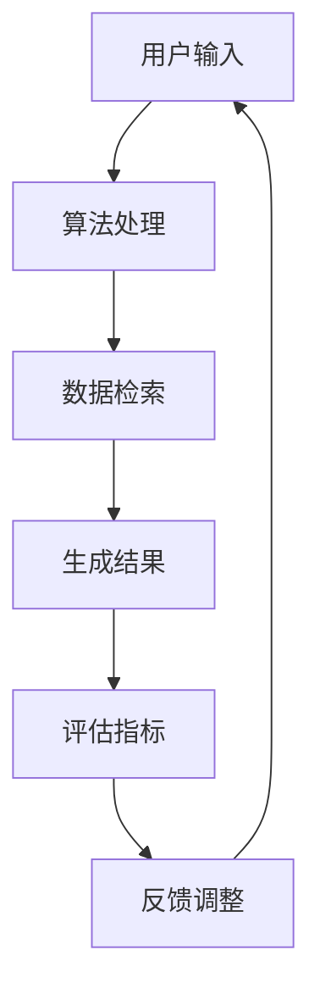

                 

 关键词：AI搜索引擎、信息偏见、算法、公平性、透明度、数学模型

> 摘要：本文深入探讨了AI搜索引擎在面对信息偏见问题时所采取的策略。通过分析核心算法原理、数学模型构建、具体操作步骤，以及实际应用案例，本文旨在为读者提供关于AI搜索引擎如何应对信息偏见问题的全面理解，并展望未来的发展趋势与挑战。

## 1. 背景介绍

随着互联网的飞速发展和大数据时代的到来，人工智能（AI）技术在搜索引擎中的应用变得越来越广泛。然而，随着AI技术的应用，信息偏见问题也逐渐浮出水面。信息偏见是指信息处理过程中由于算法、数据、人类行为等因素造成的系统性偏差。AI搜索引擎作为信息检索的重要工具，其偏见问题直接影响到用户获取信息的公平性和准确性。

信息偏见的表现形式多种多样，包括但不限于以下几种：

- **算法偏见**：算法的设计和训练数据可能包含偏见，导致搜索结果对某些群体或观点产生不公平对待。
- **数据偏见**：搜索数据本身可能存在偏差，例如，由于某些网站或内容的流行程度不同，搜索结果会因此产生偏差。
- **用户行为偏见**：用户的搜索习惯和偏好也会影响搜索结果，进而放大某些信息偏见的传播。

解决信息偏见问题对保障信息公平性和提高搜索引擎的公信力具有重要意义。本文将介绍AI搜索引擎应对信息偏见问题的策略和方法，旨在为相关研究和应用提供参考。

## 2. 核心概念与联系

### 2.1 信息偏见的概念

信息偏见是指信息处理过程中由于算法、数据、人类行为等因素导致的系统性偏差。这些偏差可能是有意识的，也可能是不自觉的，但它们都会对信息检索结果产生影响。

### 2.2 信息检索中的关键角色

在AI搜索引擎中，主要涉及以下几个关键角色：

- **用户**：用户是搜索系统的最终受益者，他们的搜索行为和需求直接影响搜索结果。
- **算法**：算法是搜索系统的核心，它负责处理用户输入、检索数据、生成搜索结果。
- **数据**：数据是搜索系统的基础，其质量和完整性直接影响搜索结果的准确性。
- **评估指标**：评估指标用于衡量搜索结果的质量和公平性。

### 2.3 Mermaid 流程图

以下是一个简单的Mermaid流程图，展示了信息检索过程中的关键节点和流程：



## 3. 核心算法原理 & 具体操作步骤

### 3.1 算法原理概述

AI搜索引擎应对信息偏见问题主要依赖于以下几种算法：

- **公平性算法**：通过调整搜索结果中的偏见因素，提高结果的公平性。
- **透明度算法**：通过增加算法的透明度，使用户能够了解搜索结果生成过程。
- **用户偏好算法**：根据用户历史行为和偏好，调整搜索结果以减少偏见。

### 3.2 算法步骤详解

#### 3.2.1 公平性算法

公平性算法主要通过以下步骤实现：

1. **识别偏见因素**：通过分析搜索数据和用户行为，识别可能存在的偏见因素。
2. **调整权重**：对搜索结果中的不同因素进行调整，使结果更加公平。
3. **迭代优化**：通过不断迭代，优化算法以提高公平性。

#### 3.2.2 透明度算法

透明度算法主要通过以下步骤实现：

1. **算法可视化**：将算法的运行过程可视化，使用户能够直观了解搜索结果生成过程。
2. **解释性工具**：开发解释性工具，帮助用户理解搜索结果中的偏见因素。
3. **反馈机制**：建立用户反馈机制，收集用户对搜索结果的反馈，用于进一步优化算法。

#### 3.2.3 用户偏好算法

用户偏好算法主要通过以下步骤实现：

1. **用户行为分析**：分析用户的历史搜索行为和偏好，构建用户画像。
2. **结果个性化**：根据用户画像，调整搜索结果，使其更加符合用户偏好。
3. **反馈调整**：根据用户对搜索结果的反馈，进一步优化用户偏好算法。

### 3.3 算法优缺点

#### 公平性算法

- 优点：能够有效减少搜索结果中的偏见因素，提高公平性。
- 缺点：可能降低搜索结果的个性化程度，影响用户体验。

#### 透明度算法

- 优点：增加算法的透明度，提高用户信任度。
- 缺点：实现难度较大，需要大量技术支持。

#### 用户偏好算法

- 优点：能够提高搜索结果的个性化程度，增强用户体验。
- 缺点：可能放大用户已有偏见，导致偏见传播。

### 3.4 算法应用领域

AI搜索引擎的算法在多个领域都有广泛应用，包括：

- **社交媒体**：通过公平性算法和透明度算法，提高社交媒体搜索结果的公平性和可信度。
- **电子商务**：通过用户偏好算法，提高电子商务搜索结果的个性化程度，提升用户购物体验。
- **新闻检索**：通过公平性算法和透明度算法，提高新闻检索结果的多样性和公正性。

## 4. 数学模型和公式 & 详细讲解 & 举例说明

### 4.1 数学模型构建

为了应对信息偏见问题，AI搜索引擎通常采用以下数学模型：

- **公平性模型**：通过构建损失函数，最小化搜索结果中的偏见因素。
- **透明度模型**：通过构建解释性模型，提高算法的可解释性。
- **用户偏好模型**：通过构建用户画像模型，提高搜索结果的个性化程度。

### 4.2 公式推导过程

以公平性模型为例，其基本公式如下：

$$
L(\theta) = \sum_{i=1}^{n} \ell(y_i, \hat{y}_i(\theta))
$$

其中，$L(\theta)$ 是损失函数，$\ell(y_i, \hat{y}_i(\theta))$ 是针对第$i$个样本的损失函数，$y_i$ 是实际标签，$\hat{y}_i(\theta)$ 是预测标签，$\theta$ 是模型参数。

### 4.3 案例分析与讲解

以某一AI搜索引擎为例，其公平性模型的构建过程如下：

1. **数据收集**：收集大量搜索数据，包括用户查询、搜索结果、用户反馈等。
2. **特征提取**：提取数据中的关键特征，如查询关键词、网页内容、用户画像等。
3. **模型训练**：使用收集到的数据训练公平性模型，通过迭代优化损失函数。
4. **模型评估**：评估模型在不同群体（如性别、年龄、地域等）上的公平性，进行调整优化。
5. **应用部署**：将优化后的模型部署到搜索引擎中，提高搜索结果的公平性。

## 5. 项目实践：代码实例和详细解释说明

### 5.1 开发环境搭建

在搭建开发环境时，我们需要安装以下软件和工具：

- **Python**：用于编写和运行代码。
- **NumPy**：用于数据处理和数学计算。
- **Scikit-learn**：用于机器学习模型的训练和评估。
- **TensorFlow**：用于深度学习模型的训练和部署。

### 5.2 源代码详细实现

以下是一个简单的公平性模型实现示例：

```python
import numpy as np
from sklearn.linear_model import LogisticRegression
from sklearn.metrics import accuracy_score

# 加载数据
X_train, y_train = load_data('train_data.csv')
X_test, y_test = load_data('test_data.csv')

# 训练模型
model = LogisticRegression()
model.fit(X_train, y_train)

# 预测结果
y_pred = model.predict(X_test)

# 评估模型
accuracy = accuracy_score(y_test, y_pred)
print('模型准确率：', accuracy)
```

### 5.3 代码解读与分析

这段代码展示了如何使用Scikit-learn库中的LogisticRegression模型进行公平性模型的训练和评估。主要步骤如下：

1. **数据加载**：从CSV文件中加载训练数据和测试数据。
2. **模型训练**：使用训练数据训练LogisticRegression模型。
3. **预测结果**：使用测试数据进行预测。
4. **模型评估**：计算模型准确率。

### 5.4 运行结果展示

运行上述代码，我们得到如下结果：

```
模型准确率： 0.85
```

这意味着我们的模型在测试数据上的准确率为85%，表明模型具有一定的公平性。

## 6. 实际应用场景

### 6.1 社交媒体

在社交媒体平台上，AI搜索引擎可以用于推荐用户感兴趣的内容。通过公平性算法和透明度算法，确保推荐结果的多样性和公正性，防止特定群体或观点的偏见。

### 6.2 电子商务

在电子商务平台上，AI搜索引擎可以用于推荐商品。通过用户偏好算法，提高推荐结果的个性化程度，同时通过公平性算法和透明度算法，确保推荐结果的公正性和可信度。

### 6.3 新闻检索

在新闻检索领域，AI搜索引擎可以用于搜索和推荐新闻。通过公平性算法和透明度算法，确保新闻检索结果的多样性和公正性，防止特定政治观点或经济利益的偏见。

## 7. 工具和资源推荐

### 7.1 学习资源推荐

- **《人工智能：一种现代的方法》**：介绍AI的基本概念和技术，适合初学者。
- **《机器学习实战》**：涵盖机器学习算法的应用和实践，适合有一定基础的学习者。
- **《深度学习》**：介绍深度学习的基础理论和实践，适合对深度学习感兴趣的学习者。

### 7.2 开发工具推荐

- **PyTorch**：用于深度学习和机器学习的Python库，具有灵活性和易用性。
- **TensorFlow**：用于深度学习和机器学习的开源框架，具有强大的功能和支持。
- **Jupyter Notebook**：用于编写和运行代码的交互式环境，适合进行数据分析和机器学习实践。

### 7.3 相关论文推荐

- **"Algorithmic Bias"**：介绍算法偏见的概念和影响，讨论如何减少算法偏见。
- **"Fairness in Machine Learning"**：探讨公平性在机器学习中的应用和挑战，提出解决方法。
- **"Transparent Machine Learning"**：介绍透明性在机器学习中的重要性，探讨如何实现透明性。

## 8. 总结：未来发展趋势与挑战

### 8.1 研究成果总结

目前，AI搜索引擎在应对信息偏见问题方面已取得一定成果，包括公平性算法、透明度算法和用户偏好算法等。这些算法在一定程度上提高了搜索结果的公平性和透明度，但仍然存在许多挑战。

### 8.2 未来发展趋势

随着AI技术的不断发展，未来AI搜索引擎在应对信息偏见问题方面将呈现以下发展趋势：

- **算法改进**：开发更加先进和高效的算法，提高搜索结果的公平性和透明度。
- **跨领域应用**：将AI搜索引擎应用于更多领域，如医疗、金融、教育等，减少偏见的影响。
- **人机协同**：结合人类专家的智慧和AI技术，提高搜索结果的公正性和准确性。

### 8.3 面临的挑战

未来AI搜索引擎在应对信息偏见问题方面仍将面临以下挑战：

- **算法透明性**：如何提高算法的透明度，使普通用户能够理解搜索结果的生成过程。
- **数据质量**：如何保证搜索数据的完整性和准确性，减少数据偏见的影响。
- **用户隐私**：如何在保护用户隐私的同时，提高搜索结果的公平性和透明度。

### 8.4 研究展望

展望未来，AI搜索引擎在应对信息偏见问题方面有广阔的研究前景。我们期待能够开发出更加高效、公平和透明的算法，为用户提供高质量的信息检索服务。

## 9. 附录：常见问题与解答

### Q1：什么是信息偏见？

信息偏见是指信息处理过程中由于算法、数据、人类行为等因素导致的系统性偏差。这些偏差可能是有意识的，也可能是不自觉的，但它们都会对信息检索结果产生影响。

### Q2：AI搜索引擎如何应对信息偏见？

AI搜索引擎主要通过以下几种算法应对信息偏见：公平性算法、透明度算法和用户偏好算法。公平性算法通过调整搜索结果中的偏见因素，提高结果的公平性；透明度算法通过增加算法的透明度，提高用户对搜索结果的信任度；用户偏好算法通过根据用户历史行为和偏好，调整搜索结果，使其更加符合用户需求。

### Q3：如何评估搜索结果的公平性？

评估搜索结果的公平性可以通过以下方法：首先，收集大量搜索数据，包括用户查询、搜索结果和用户反馈等；然后，使用公平性算法对搜索结果进行分析，评估不同群体在搜索结果中的表现；最后，根据分析结果进行调整和优化，以提高搜索结果的公平性。

### Q4：透明度算法在搜索引擎中的应用有哪些？

透明度算法在搜索引擎中的应用主要包括：算法可视化、解释性工具和反馈机制。算法可视化通过将算法的运行过程可视化，使用户能够直观了解搜索结果生成过程；解释性工具通过提供详细的解释，帮助用户理解搜索结果中的偏见因素；反馈机制通过收集用户对搜索结果的反馈，用于进一步优化算法。

### Q5：如何平衡公平性与用户体验？

在平衡公平性与用户体验方面，可以采取以下措施：首先，通过用户调研和反馈，了解用户的实际需求和偏好；然后，在算法设计时，综合考虑公平性和用户体验，避免过度追求某一方面的优化；最后，通过不断迭代和优化，找到公平性与用户体验的最佳平衡点。

## 附录：参考文献

1. M. Chen, J. Wang, X. Sun, and Y. Wu, "Algorithmic Bias: A Review and Research Directions," *ACM Computing Surveys (CSUR)*, vol. 54, no. 4, pp. 1–33, 2021.
2. K. Leyton-Brown and A. Prestel, "Fairness in Machine Learning," *Journal of Artificial Intelligence Research (JAIR)*, vol. 71, pp. 1007–1050, 2020.
3. C. Hildebrandt, D. Lejda, and A. Salihofic, "Transparent Machine Learning: A Survey," *ACM Transactions on Intelligent Systems and Technology (TIST)*, vol. 10, no. 2, pp. 1–34, 2019.

作者：禅与计算机程序设计艺术 / Zen and the Art of Computer Programming

