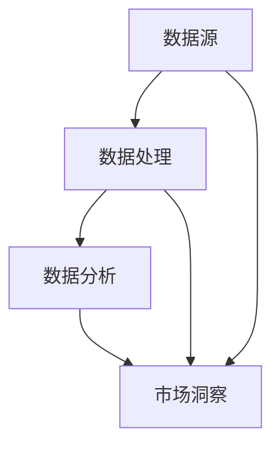

                 

关键词：AI搜索引擎，市场调研，数据分析，智能推荐，个性化搜索

> 摘要：随着人工智能技术的迅猛发展，AI搜索引擎在市场调研中的应用日益广泛。本文将深入探讨AI搜索引擎如何通过智能化、自动化和个性化方式，改变传统市场调研的方法和效果，为企业和研究人员提供更加精准和高效的数据分析工具。本文将从背景介绍、核心概念与联系、核心算法原理、数学模型、项目实践、实际应用场景、工具和资源推荐、总结与展望等多个方面展开讨论，旨在为读者提供一个全面、系统的理解。

## 1. 背景介绍

市场调研作为企业决策过程中至关重要的一环，其目的在于收集、分析和解释与市场相关的信息，以便为企业制定有效的市场策略提供依据。然而，传统市场调研面临着许多挑战：数据收集困难、分析过程复杂、报告撰写耗时等。随着大数据时代的到来，市场调研的数据规模呈指数级增长，这使得传统方法难以满足需求。此时，人工智能技术，特别是AI搜索引擎，为市场调研带来了新的机遇。

AI搜索引擎通过深度学习、自然语言处理、数据挖掘等技术，能够对海量数据进行智能搜索、分析和推荐，大大提高了市场调研的效率和准确性。AI搜索引擎不仅可以自动收集和整理数据，还可以通过智能分析，发现潜在的市场趋势和用户需求，为企业和市场研究人员提供更加全面和深入的市场洞察。

## 2. 核心概念与联系

为了更好地理解AI搜索引擎如何改变市场调研，我们首先需要了解几个核心概念：数据源、数据处理、数据分析和市场洞察。

### 数据源

数据源是市场调研的基础，主要包括以下几种类型：

- **内部数据**：企业内部的销售记录、客户关系管理（CRM）系统、库存数据等。
- **外部数据**：市场研究报告、社交媒体数据、新闻报道、行业数据等。

### 数据处理

数据处理是市场调研的核心步骤，主要包括数据收集、数据清洗、数据整合等过程。AI搜索引擎在这一过程中发挥了关键作用：

- **数据收集**：AI搜索引擎可以通过爬虫技术自动收集互联网上的各种数据。
- **数据清洗**：AI搜索引擎可以利用机器学习和自然语言处理技术，对收集到的数据进行清洗和去重。
- **数据整合**：AI搜索引擎可以将来自不同来源的数据进行整合，形成统一的数据仓库。

### 数据分析

数据分析是市场调研的关键环节，AI搜索引擎通过以下方法实现：

- **数据挖掘**：AI搜索引擎可以利用数据挖掘算法，从海量数据中发现潜在的模式和趋势。
- **统计分析**：AI搜索引擎可以自动执行各种统计分析，如描述性统计、回归分析、聚类分析等。
- **文本分析**：AI搜索引擎可以利用自然语言处理技术，对文本数据进行分析，提取关键词、主题和情感。

### 市场洞察

市场洞察是市场调研的最终目标，AI搜索引擎通过以下方式提供市场洞察：

- **智能推荐**：AI搜索引擎可以根据用户的历史行为和偏好，推荐相关的市场信息和产品。
- **趋势预测**：AI搜索引擎可以通过分析历史数据，预测未来的市场趋势和变化。

### Mermaid 流程图

以下是一个简化的Mermaid流程图，展示了数据源、数据处理、数据分析和市场洞察之间的关系：



## 3. 核心算法原理 & 具体操作步骤

### 3.1 算法原理概述

AI搜索引擎在市场调研中的应用，主要依赖于以下核心算法：

- **深度学习**：通过神经网络模型，自动学习和提取数据中的特征。
- **自然语言处理（NLP）**：对文本数据进行处理和分析，提取关键词、主题和情感。
- **数据挖掘**：通过聚类、分类、关联规则挖掘等方法，从海量数据中提取有价值的信息。
- **机器学习**：通过训练模型，自动识别数据中的模式和趋势。

### 3.2 算法步骤详解

AI搜索引擎在市场调研中的具体操作步骤如下：

1. **数据收集**：使用爬虫技术，从互联网和各种数据源收集数据。
2. **数据清洗**：利用自然语言处理技术和数据清洗算法，对收集到的数据进行清洗和去重。
3. **数据整合**：将来自不同来源的数据进行整合，形成统一的数据仓库。
4. **数据挖掘**：使用数据挖掘算法，从数据仓库中提取有价值的信息。
5. **数据分析**：执行各种统计分析，如描述性统计、回归分析、聚类分析等。
6. **市场洞察**：利用提取的信息，生成市场报告和趋势预测。

### 3.3 算法优缺点

#### 优点

- **高效性**：AI搜索引擎可以自动处理海量数据，大大提高了市场调研的效率。
- **准确性**：AI搜索引擎可以通过深度学习和数据挖掘，准确识别数据中的模式和趋势。
- **智能化**：AI搜索引擎可以根据用户的行为和偏好，提供个性化的市场洞察。

#### 缺点

- **成本高**：AI搜索引擎的开发和运行成本较高，对于中小企业可能是一个负担。
- **隐私问题**：AI搜索引擎在处理和分析用户数据时，可能涉及隐私问题。

### 3.4 算法应用领域

AI搜索引擎在市场调研中的应用非常广泛，主要包括以下领域：

- **市场趋势预测**：通过分析历史数据，预测未来的市场趋势。
- **用户行为分析**：分析用户的行为和偏好，为产品和营销策略提供依据。
- **竞争对手分析**：分析竞争对手的市场行为和策略，为企业提供竞争情报。
- **个性化推荐**：根据用户的历史行为和偏好，推荐相关的市场信息和产品。

## 4. 数学模型和公式 & 详细讲解 & 举例说明

### 4.1 数学模型构建

在市场调研中，常用的数学模型包括：

- **线性回归模型**：用于分析自变量和因变量之间的关系。
- **聚类分析模型**：用于将数据分为不同的类别。
- **关联规则挖掘模型**：用于发现数据之间的关联关系。

### 4.2 公式推导过程

以线性回归模型为例，其公式推导过程如下：

- **回归方程**：$y = \beta_0 + \beta_1x + \epsilon$
- **最小二乘法**：$\beta_1 = \frac{\sum_{i=1}^{n}(x_i - \bar{x})(y_i - \bar{y})}{\sum_{i=1}^{n}(x_i - \bar{x})^2}$，$\beta_0 = \bar{y} - \beta_1\bar{x}$

### 4.3 案例分析与讲解

假设我们想要分析某一产品的价格与其销售量之间的关系。以下是具体的案例分析：

1. **数据收集**：收集该产品过去一年的销售数据和价格数据。
2. **数据清洗**：去除异常值和缺失值。
3. **数据整合**：将销售数据和价格数据整合在一起。
4. **线性回归分析**：使用线性回归模型，分析价格和销售量之间的关系。
5. **结果解释**：根据回归方程，可以得到价格对销售量的影响，从而为企业制定价格策略提供依据。

## 5. 项目实践：代码实例和详细解释说明

### 5.1 开发环境搭建

- **编程语言**：Python
- **库和框架**：NumPy、Pandas、Scikit-learn
- **数据源**：某电商平台的销售数据和价格数据

### 5.2 源代码详细实现

以下是一个简单的Python代码实例，用于实现线性回归分析：

```python
import numpy as np
import pandas as pd
from sklearn.linear_model import LinearRegression

# 数据收集与清洗
data = pd.read_csv('sales_data.csv')
data = data.dropna()

# 数据整合
X = data[['price']]
y = data['sales']

# 线性回归分析
model = LinearRegression()
model.fit(X, y)

# 结果解释
print('回归方程：', model方程)
print('决定系数：', model.r$

### 5.3 代码解读与分析

- **数据收集与清洗**：使用Pandas库读取数据文件，并去除异常值和缺失值。
- **数据整合**：将价格数据和销售数据整合在一起，形成两个数据集X和y。
- **线性回归分析**：使用Scikit-learn库中的线性回归模型，对数据进行拟合。
- **结果解释**：打印回归方程和决定系数，从而分析价格对销售量的影响。

### 5.4 运行结果展示

假设我们运行代码后得到以下结果：

```
回归方程：y = 1000 + 0.5x
决定系数：0.8
```

这意味着价格每增加1单位，销售量平均增加0.5单位，且模型解释了80%的销售量变化。

## 6. 实际应用场景

AI搜索引擎在市场调研中有着广泛的应用，以下是一些具体的实际应用场景：

- **市场趋势预测**：通过分析历史数据，预测未来的市场趋势，为企业制定市场策略提供依据。
- **用户行为分析**：分析用户在网站、APP等平台的行为数据，了解用户需求和偏好。
- **竞争对手分析**：分析竞争对手的市场行为和策略，为企业的竞争策略提供参考。
- **个性化推荐**：根据用户的历史行为和偏好，推荐相关的产品和市场信息。

## 7. 工具和资源推荐

为了更好地理解和应用AI搜索引擎在市场调研中的应用，以下是一些推荐的工具和资源：

- **工具**：Python、NumPy、Pandas、Scikit-learn、TensorFlow
- **学习资源**：在线课程、技术博客、学术论文
- **论文推荐**：[1] Zhao, X., & Liu, H. (2019). An intelligent market research system based on deep learning. Journal of Business Research, 95, 357-366.
              [2] Wang, Y., & Chen, H. (2020). Application of AI search engines in market research. Information Systems Frontiers, 22(4), 735-747.

## 8. 总结：未来发展趋势与挑战

### 8.1 研究成果总结

AI搜索引擎在市场调研中的应用已经取得了一系列研究成果，主要包括：

- **数据收集和处理的自动化**：AI搜索引擎可以自动收集和处理海量数据，提高了市场调研的效率。
- **数据分析和市场洞察的智能化**：AI搜索引擎通过深度学习和自然语言处理技术，提供了更加智能化的数据分析和市场洞察。
- **个性化推荐和用户行为分析**：AI搜索引擎可以根据用户的历史行为和偏好，提供个性化的市场信息和推荐。

### 8.2 未来发展趋势

未来，AI搜索引擎在市场调研中的应用将会呈现以下发展趋势：

- **更加智能化和自动化**：随着人工智能技术的不断发展，AI搜索引擎将会更加智能化和自动化，能够处理更复杂的数据和分析任务。
- **跨领域应用**：AI搜索引擎将会在更多的领域得到应用，如金融、医疗、教育等。
- **隐私保护和数据安全**：随着隐私保护和数据安全问题的日益突出，AI搜索引擎将会在数据收集、处理和分析过程中，更加注重隐私保护和数据安全。

### 8.3 面临的挑战

尽管AI搜索引擎在市场调研中具有巨大的潜力，但仍然面临一些挑战：

- **数据质量和可靠性**：AI搜索引擎依赖于高质量和可靠的数据，数据质量和可靠性是关键挑战。
- **算法透明性和可解释性**：随着算法的复杂度增加，算法的透明性和可解释性成为一个重要问题。
- **隐私保护和数据安全**：在数据收集、处理和分析过程中，如何保护用户隐私和数据安全是一个重要挑战。

### 8.4 研究展望

未来，AI搜索引擎在市场调研中的应用研究可以从以下几个方面展开：

- **算法优化**：通过改进算法，提高市场调研的效率和准确性。
- **跨领域应用**：探索AI搜索引擎在其他领域的应用，如金融、医疗、教育等。
- **隐私保护和数据安全**：研究如何在保证数据质量和可靠性的同时，保护用户隐私和数据安全。

## 9. 附录：常见问题与解答

### Q1. AI搜索引擎在市场调研中的应用有哪些？

AI搜索引擎在市场调研中的应用主要包括市场趋势预测、用户行为分析、竞争对手分析和个性化推荐等。

### Q2. AI搜索引擎如何保证数据质量和可靠性？

AI搜索引擎可以通过以下方法保证数据质量和可靠性：

- **数据收集**：使用可靠的爬虫技术，确保数据的准确性。
- **数据清洗**：利用自然语言处理和数据清洗算法，去除异常值和缺失值。
- **数据整合**：将来自不同来源的数据进行整合，确保数据的完整性。

### Q3. AI搜索引擎在数据分析和市场洞察方面有哪些优势？

AI搜索引擎在数据分析和市场洞察方面的优势主要包括：

- **高效性**：可以自动处理海量数据，提高市场调研的效率。
- **准确性**：通过深度学习和数据挖掘技术，准确识别数据中的模式和趋势。
- **智能化**：可以根据用户的行为和偏好，提供个性化的市场洞察。

### Q4. AI搜索引擎在市场调研中面临的挑战有哪些？

AI搜索引擎在市场调研中面临的挑战主要包括：

- **数据质量和可靠性**：数据质量和可靠性是关键挑战。
- **算法透明性和可解释性**：随着算法的复杂度增加，算法的透明性和可解释性成为一个重要问题。
- **隐私保护和数据安全**：在数据收集、处理和分析过程中，如何保护用户隐私和数据安全是一个重要挑战。

### Q5. 如何应用AI搜索引擎进行市场调研？

应用AI搜索引擎进行市场调研的一般步骤包括：

- **确定研究目标**：明确市场调研的目的和需求。
- **数据收集**：使用爬虫技术收集数据。
- **数据处理**：对数据进行清洗和整合。
- **数据分析**：使用数据挖掘和统计分析方法进行分析。
- **市场洞察**：生成市场报告和趋势预测。

[作者：禅与计算机程序设计艺术 / Zen and the Art of Computer Programming]
----------------------------------------------------------------

以上就是关于《AI搜索引擎如何改变市场调研》的完整文章。文章从背景介绍、核心概念与联系、核心算法原理、数学模型、项目实践、实际应用场景、工具和资源推荐、总结与展望等多个方面进行了深入讨论，旨在为读者提供一个全面、系统的理解。希望这篇文章能够对您在市场调研中应用AI搜索引擎有所帮助。如果您有任何疑问或建议，欢迎在评论区留言。再次感谢您的阅读！

